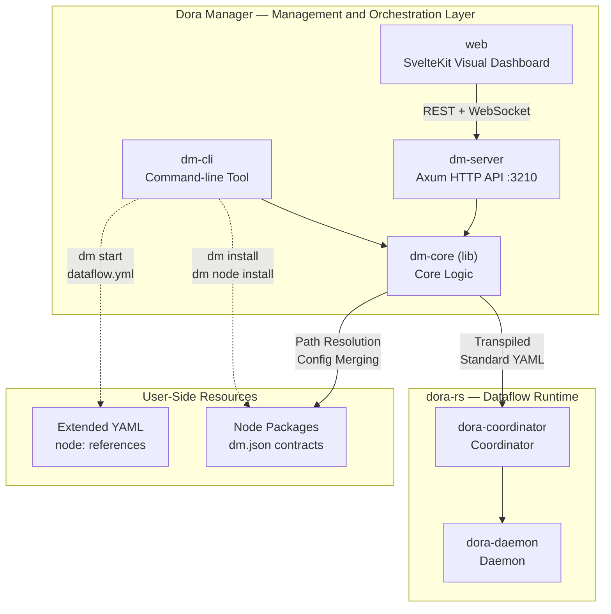
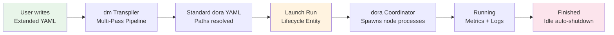

Dora Manager (abbreviated as `dm`) is a **dataflow orchestration and management platform** built with Rust. It provides three layers of management capabilities for [dora-rs](https://github.com/dora-rs/dora) — a high-performance, multi-language dataflow runtime based on Apache Arrow: **command-line tool (CLI), HTTP API service, and Web visual dashboard**. If you are looking for a way to assemble heterogeneous capabilities like AI models, media capture, and voice processing into runnable applications like LEGO bricks, Dora Manager is built for this purpose. It is not a replacement for dora-rs, but a value-added management layer built on top of it — transforming dora-rs from a powerful low-level engine into a complete platform that developers can directly use to build, run, and observe applications.

Sources: [README.md](https://github.com/l1veIn/dora-manager/blob/main/README.md), [README_zh.md](https://github.com/l1veIn/dora-manager/blob/main/README_zh.md), [PROJECT_CONSTITUTION.md](https://github.com/l1veIn/dora-manager/blob/main/PROJECT_CONSTITUTION.md)

## dora-rs and Dora Manager: Runtime vs. Management Layer

The first step in understanding Dora Manager is to clarify the division of responsibilities between it and the underlying dora-rs. **dora-rs** is a process orchestration engine for robotics and AI domains: nodes exchange data via shared memory in Apache Arrow format with zero-copy semantics, natively supporting multiple languages including Rust, Python, and C++. However, it does not provide node package management, visual configuration, runtime monitoring, or interactive controls — these are precisely the problems that **Dora Manager** solves.

The following architecture diagram shows the collaboration between Dora Manager components and their boundary with the dora-rs runtime:



As shown in the diagram, when users operate through Dora Manager's CLI or Web dashboard, commands are processed by `dm-core` — including transpiling extended YAML, resolving node paths, and merging configurations — before the standard dora-rs YAML is handed to dora-rs's coordinator for execution. Users always work at a higher level of abstraction without needing to interact with dora-rs implementation details directly.

Sources: [README.md](https://github.com/l1veIn/dora-manager/blob/main/README.md), [crates/dm-server/src/main.rs](https://github.com/l1veIn/dora-manager/blob/main/crates/dm-server/src/main.rs#L79-L95), [docs/blog/building-dora-manager-with-ai.md](https://github.com/l1veIn/dora-manager/blob/main/docs/blog/building-dora-manager-with-ai.md#L12-L19)

## Three-Tier Backend Architecture: dm-core / dm-cli / dm-server

Dora Manager's backend code is organized into three Rust crates, following the layered principle of **separating core logic from entry points**. This design ensures that business logic exists in only one place (`dm-core`), while the CLI and HTTP service entry points share the same validated core logic.

| Crate | Type | Responsibility | Key Capabilities |
|-------|------|---------------|------------------|
| **dm-core** | Library (lib) | The承载 layer for all business logic | Transpiler, node management, run scheduling, event storage, environment management |
| **dm-cli** | Binary (bin) | Terminal user interface | Colored output, progress bars, command dispatching, depends on dm-core |
| **dm-server** | Binary (bin) | HTTP API service | Axum routing, WebSocket real-time interaction, Swagger docs, frontend static asset embedding |

`dm-core` is the "brain" of the entire system — it does not depend on any specific node type, contains no hardcoded node IDs, and purely handles dataflow lifecycle management, YAML transpilation, path resolution, and configuration merging. The two entry points `dm-cli` and `dm-server` share the same core logic, serving terminal scenarios and browser scenarios respectively.

Sources: [Cargo.toml](https://github.com/l1veIn/dora-manager/blob/main/Cargo.toml), [crates/dm-core/Cargo.toml](https://github.com/l1veIn/dora-manager/blob/main/crates/dm-core/Cargo.toml#L1-L8), [crates/dm-cli/Cargo.toml](https://github.com/l1veIn/dora-manager/blob/main/crates/dm-cli/Cargo.toml#L1-L14), [crates/dm-server/Cargo.toml](https://github.com/l1veIn/dora-manager/blob/main/crates/dm-server/Cargo.toml#L1-L14), [docs/architecture-principles.md](https://github.com/l1veIn/dora-manager/blob/main/docs/architecture-principles.md#L47-L65)

## Three Core Concepts: Node, Dataflow, Run

Dora Manager organizes all functionality around three core concepts. Beginners should first understand their hierarchical relationship: **Nodes** are the smallest building blocks, **Dataflows** define the connection topology between nodes, and **Runs** are tracked execution instances of dataflows.



### Node — dm.json Contract-Driven Executable Unit

A **Node** is the most basic building block in the system. Each node is an independently running executable unit (which can be a Python script, Rust binary, or C++ program). Each node's interface, configuration, and metadata are defined by a contract file called **`dm.json`**. Here are the key fields in the `dm.json` of the `dm-slider` node:

| Field | Meaning | Example |
|-------|---------|---------|
| `executable` | Path to the node's executable entry point | `.venv/bin/dm-slider` |
| `ports` | Input/output port definitions, optionally with Arrow type schemas | `value` port outputs `float64` |
| `config_schema` | Configurable parameters, mapped to environment variables via `env` field | `label`, `min_val`, `max_val` |
| `capabilities` | Declares the node's capability type (e.g., `widget_input`) | Frontend widget registration and input binding |
| `runtime` | Runtime language and version requirements | `python >= 3.10` |

The system includes a rich ecosystem of built-in nodes, from media capture (`dm-screen-capture`, `dm-microphone`) to AI inference (`dora-qwen`, `dora-yolo`) to logic control (`dm-and`, `dm-gate`), totaling **28 built-in nodes** covering multiple categories including interaction, media, storage, logic, and AI.

Sources: [nodes/dm-slider/dm.json](https://github.com/l1veIn/dora-manager/blob/main/nodes/dm-slider/dm.json#L1-L119), [registry.json](https://github.com/l1veIn/dora-manager/blob/main/registry.json), [docs/blog/building-dora-manager-with-ai.md](https://github.com/l1veIn/dora-manager/blob/main/docs/blog/building-dora-manager-with-ai.md#L39-L70)

### Dataflow — YAML Topology and Auto-Transpilation

A **Dataflow** is a `.yml` file that describes the connection topology between node instances. Dora Manager defines an **extended YAML syntax** where users reference installed nodes via the `node:` field (instead of dora-rs's native `path:` absolute paths). Here is a simple out-of-the-box demo:

```yaml
# demos/demo-hello-timer.yml
nodes:
  - id: echo
    node: dora-echo
    inputs:
      value: dora/timer/millis/1000
    outputs:
      - value

  - id: message
    node: dm-message
    inputs:
      message: echo/value
    config:
      label: "Timer Tick"
      render: text
```

At startup, the transpiler performs four key tasks: **path resolution** (resolving `node: dora-echo` to the executable's absolute path), **four-layer config merging** (merging by `inline > flow > node > schema default` priority and injecting as environment variables), **port schema validation** (checking data type compatibility at both ends of connections), and **runtime parameter injection** (injecting WebSocket addresses and other information for interaction nodes).

Sources: [demos/demo-hello-timer.yml](demos/demo-hello-timer.yml#L1-L39), [README.md](https://github.com/l1veIn/dora-manager/blob/main/README.md), [docs/blog/building-dora-manager-with-ai.md](https://github.com/l1veIn/dora-manager/blob/main/docs/blog/building-dora-manager-with-ai.md#L72-L83)

### Run — Lifecycle Tracking Entity

When a dataflow is launched, it becomes a **Run** — a complete lifecycle entity tracked by the system. Each Run records the transpiled YAML of its dataflow, CPU/memory usage metrics for each node, and standard output and error logs. The Web dashboard interacts with running nodes in real-time via WebSocket, supporting dynamic adjustment of runtime parameters through reactive widgets.

Sources: [crates/dm-core/src/runs/mod.rs](https://github.com/l1veIn/dora-manager/blob/main/crates/dm-core/src/runs/mod.rs), [crates/dm-server/src/main.rs](https://github.com/l1veIn/dora-manager/blob/main/crates/dm-server/src/main.rs#L223-L224)

## Frontend Architecture: SvelteKit Visual Dashboard

Dora Manager's frontend is a single-page application built with **SvelteKit + SvelteFlow + Tailwind CSS**. It is statically embedded into the `dm-server` binary at release time via `rust-embed`, enabling true **single-file deployment** — one binary provides both the API and the Web UI.

The frontend's core pages and features include:

| Page / Feature | Description |
|---------------|-------------|
| **Visual Graph Editor** | An interactive dataflow editor built on SvelteFlow, supporting drag-and-drop connections, context menus, floating Inspector panels, with all edits synchronized to the underlying YAML in real-time |
| **Run Workspace** | Grid-layout panel system with real-time log viewing, CPU/memory metrics display, and reactive widget interaction |
| **Node Management** | Node list, install/uninstall, status viewing |
| **Dataflow Management** | Dataflow list, configuration, version history |
| **Run History** | Run instance list, metric charts, log replay |

Sources: [web/package.json](https://github.com/l1veIn/dora-manager/blob/main/web/package.json#L1-L68), [crates/dm-server/src/main.rs](https://github.com/l1veIn/dora-manager/blob/main/crates/dm-server/src/main.rs#L20-L22), [crates/dm-server/src/main.rs](https://github.com/l1veIn/dora-manager/blob/main/crates/dm-server/src/main.rs#L234-L235)

## Project Directory Structure Overview

The project adopts a mixed structure of Rust workspace + SvelteKit frontend. Here are the key directories and their responsibilities:

| Directory | Contents | Description |
|-----------|----------|-------------|
| `crates/dm-core/src/` | Core library | Transpiler (`dataflow/transpile`), node management (`node/`), run scheduling (`runs/`), event storage (`events/`) |
| `crates/dm-cli/` | CLI entry point | Command-line tool with colored output and progress bars, `dm` binary |
| `crates/dm-server/` | API service | Axum routing (40+ endpoints), WebSocket, Swagger UI, `dm-server` binary |
| `web/` | SvelteKit frontend | Visual dashboard, graph editor, reactive widgets, i18n |
| `nodes/` | Built-in node packages | Each subdirectory is a node containing a `dm.json` contract and executable code |
| `demos/` | Sample dataflows | 4 out-of-the-box demos, from the simplest timer to YOLO object detection |
| `tests/dataflows/` | Test dataflows | YAML files for system integration testing |
| `docs/` | Design documents | Architecture principles, subsystem designs, development logs |
| `scripts/` | Utility scripts | One-click installer (`install.sh`), data migration tools |

Node discovery order: first checks user-installed `~/.dm/nodes`, then the repository's built-in `nodes/` directory, and finally extra directories specified by the `DM_NODE_DIRS` environment variable. User-installed nodes override built-in nodes with the same name.

Sources: [nodes/README.md](https://github.com/l1veIn/dora-manager/blob/main/nodes/README.md#L1-L12), [Cargo.toml](https://github.com/l1veIn/dora-manager/blob/main/Cargo.toml)

## Design Philosophy: Node Business Purity and Core Engine Node-Agnosticism

Dora Manager's architectural decisions follow a clear set of design principles. The two most important ones directly affect how you write nodes and understand system behavior:

**Node Business Purity**: Each node does only one thing — either computation (e.g., AI inference), storage (e.g., data persistence), interaction (e.g., UI controls), or data source (e.g., timers). If a node starts doing two things, it should be split into two nodes. This makes node composition more flexible, and testing and reuse easier.

| Node Family | Responsibility | Examples |
|-------------|---------------|----------|
| **Compute** | Data transformation, no side effects beyond Arrow output | `dora-qwen`, `dora-yolo` |
| **Storage** | Data persistence (serialization + file writing) | `dm-log`, `dm-save` |
| **Interaction** | Human-machine interface bridging | `dm-message`, `dm-slider`, `dm-button` |
| **Source** | Data generation / event emission | `dora/timer`, `dm-screen-capture` |

**Core Engine Node-Agnosticism**: `dm-core` contains no knowledge of specific nodes — no hardcoded node IDs, no node-specialized enum variants, no node-specific metadata storage. If a node requires framework-level special support, that support belongs in the application layer (`dm-server` / `dm-cli`), not the core layer. This ensures the core engine's stability and predictability.

Sources: [docs/architecture-principles.md](https://github.com/l1veIn/dora-manager/blob/main/docs/architecture-principles.md#L9-L65), [PROJECT_CONSTITUTION.md](https://github.com/l1veIn/dora-manager/blob/main/PROJECT_CONSTITUTION.md)

## Product Vision and Long-term Direction

Dora Manager's long-term direction is not just managing dora-rs, but validating a **reusable application building model**: the recurring display layer, configuration layer, interaction layer, output and feedback layer can all be elevated into reusable node capabilities. If this direction proves valid, many future tools and applications will not need to rebuild UIs, control panels, and feedback loops for each project — they can compose these capabilities on a shared runtime driven by nodes and dataflows.

Sources: [PROJECT_CONSTITUTION.md](https://github.com/l1veIn/dora-manager/blob/main/PROJECT_CONSTITUTION.md)

## Current Limitations and Improvement Directions

Dora Manager is currently in the active development phase of v0.1.0. Note the following areas of maturity:

| Limitation | Description |
|-----------|-------------|
| Graph editor is in early stage | Basic operations like connections, property editing, and node copying are covered, but auto-layout, undo/redo, and multi-select batch operations are missing |
| Low test coverage | The project overall lacks a comprehensive unit and integration testing system |
| Single-machine deployment only | The current architecture does not support distributed multi-machine cluster scheduling |
| No topology validation | The transpiler does not perform cycle detection or topological sorting, only port indegree limits and schema compatibility checks |
| Network dependency | `dm install` and node downloads depend on GitHub Releases; offline installation is not yet supported |
| Windows compatibility unverified | The primary development and testing environments are macOS and Linux |

Sources: [README_zh.md](https://github.com/l1veIn/dora-manager/blob/main/README_zh.md), [CHANGELOG.md](https://github.com/l1veIn/dora-manager/blob/main/CHANGELOG.md)

## Suggested Next Steps

After grasping the project overview, we recommend exploring in the following order:

**Hands-on first**: Head to [Quick Start: Install, Launch, and Run Your First Dataflow](02-quickstart) to install from scratch and run an actual dataflow for a first-hand experience. Then configure the frontend-backend co-development mode through [Development Environment: Building from Source and Hot-Reload Workflow](03-dev-environment).

**Understand core concepts**: Read the three concept pages in order: [Node: dm.json Contract and Executable Unit](04-node-concept) → [Dataflow: YAML Topology Definition and Node Connections](05-dataflow-concept) → [Run: Lifecycle State Machine and Metrics Tracking](06-run-lifecycle).

**Dive into architecture**: Developers interested in the backend can explore [Overall Layered Architecture: dm-core / dm-cli / dm-server Responsibilities](10-architecture-overview) for internal module design of each crate; those interested in the frontend can visit [SvelteKit Project Structure: Route Design, API Communication, and State Management](17-sveltekit-structure) for the frontend organization.
