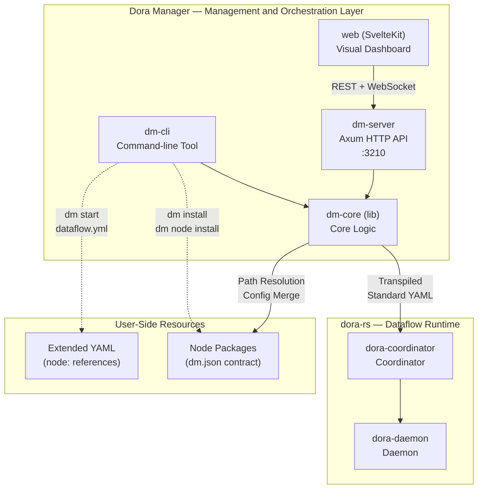
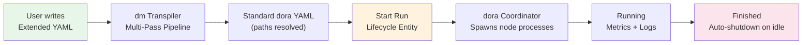

Dora Manager (abbreviated as `dm`) is a **dataflow orchestration and management platform** built with Rust. It provides three layers of management capabilities for [dora-rs](https://github.com/dora-rs/dora) — a high-performance, multi-language dataflow runtime based on Apache Arrow: **command-line tool (CLI), HTTP API service, and visual web dashboard**. If you are familiar with the relationship between docker and docker-compose, you can think of dora-rs as the container runtime, while Dora Manager sits on top as the orchestration and management layer, responsible for node package installation scheduling, dataflow topology transpilation and execution, as well as runtime state observability and interaction.

Sources: [README.md](https://github.com/l1veIn/dora-manager/blob/master/README.md), [README_zh.md](https://github.com/l1veIn/dora-manager/blob/master/README_zh.md)

## dora-rs and Dora Manager: A Two-Tier Relationship

The first step in understanding Dora Manager is to clarify the division of responsibilities between it and the underlying dora-rs. **dora-rs** is a process orchestration engine targeting robotics and AI domains. Nodes exchange data via shared memory in Apache Arrow format with zero-copy semantics, natively supporting multiple languages such as Rust, Python, and C++. However, it only concerns itself with "how to run a set of processes and make them communicate with each other" — it does not provide answers for questions like "where do nodes come from", "how to write YAML more conveniently", or "how to visualize runtime state".

**Dora Manager is precisely the value-added layer built on top of these concerns**. It treats dora-rs as a black-box runtime and wraps three things on top of it: node lifecycle management (installation, import, isolation), dataflow transpilation (translating user-friendly extended YAML into dora-rs native format), and runtime observability (web dashboard, metrics collection, log tracing, real-time interaction). This means you can use `dm` to complete the full loop from installing nodes to launching dataflows to debugging interactively in the browser — all with a single command — without manually configuring Python virtual environments, writing absolute paths, or guessing node state from terminal logs.

Sources: [README.md](https://github.com/l1veIn/dora-manager/blob/master/README.md), [docs/architecture-principles.md](https://github.com/l1veIn/dora-manager/blob/master/docs/architecture-principles.md#L1-L10)

The following architecture diagram shows the collaboration between Dora Manager components and their boundary with the dora-rs runtime:



Sources: [README.md](https://github.com/l1veIn/dora-manager/blob/master/README.md), [crates/dm-server/src/main.rs](https://github.com/l1veIn/dora-manager/blob/master/crates/dm-server/src/main.rs#L78-L95)

## Three-Layer Architecture: dm-core / dm-cli / dm-server

The backend code of Dora Manager is organized into three Rust crates, following the layered principle of **separating core logic from entry points**:

| Crate | Type | Responsibility | Key Capabilities |
|-------|------|----------------|-------------------|
| **dm-core** | Library (lib) | Host layer for all business logic | Transpiler, node management, run scheduling, event storage, environment management |
| **dm-cli** | Binary (bin) | Terminal user interface | Colored output, progress bars, command dispatch; depends on dm-core |
| **dm-server** | Binary (bin) | HTTP API service | Axum routes, WebSocket interaction, Swagger docs, frontend static asset embedding |

`dm-core` is the "brain" of the entire system — it does not depend on any specific node type, does not contain any hardcoded node IDs, and is purely responsible for dataflow lifecycle management, YAML transpilation, path resolution, and config merging. Both `dm-cli` and `dm-server` share the same core logic, serving terminal and web scenarios respectively. The frontend SvelteKit application is statically embedded into the `dm-server` binary at compile time via `rust_embed`, so only a single binary is needed at distribution time to provide both API service and web interface.

Sources: [Cargo.toml](https://github.com/l1veIn/dora-manager/blob/master/Cargo.toml), [crates/dm-core/src/lib.rs](https://github.com/l1veIn/dora-manager/blob/master/crates/dm-core/src/lib.rs#L1-L21), [docs/architecture-principles.md](https://github.com/l1veIn/dora-manager/blob/master/docs/architecture-principles.md#L48-L65)

## Three Core Concepts: Node, Dataflow, Run Instance

Dora Manager organizes all functionality around three core concepts. Beginners should first understand their relationships.

### Node — dm.json Contract-Driven Executable Unit

A **Node** is the most fundamental building block in the system. Each node is an independently running executable unit (which can be a Python script, Rust binary, or C++ program). The interface, configuration, and metadata of each node are fully described by a contract file called **`dm.json`**. Below is an example of key fields from the `dm-slider` node's `dm.json`:

```json
{
  "id": "dm-slider",
  "executable": ".venv/bin/dm-slider",
  "ports": [
    { "id": "value", "direction": "output", "schema": { "type": { "name": "float64" } } }
  ],
  "config_schema": {
    "label":   { "default": "Value", "env": "LABEL" },
    "min_val": { "default": 0, "env": "MIN_VAL" },
    "max_val": { "default": 100, "env": "MAX_VAL" }
  }
}
```

This contract declares the node's executable entry (`executable`), data ports (`ports`, optionally with Arrow type schemas), and configurable parameters (`config_schema`, where each parameter maps to an environment variable via the `env` field). The system includes a rich node ecosystem, covering media capture (`dm-screen-capture`, `dm-microphone`), data tools (`dm-queue`, `dm-log`, `dm-save`), and AI inference (`dora-qwen`, `dora-distil-whisper`, `dora-kokoro-tts`), addressing common needs for building voice interaction or computer vision pipelines.

Sources: [README.md](https://github.com/l1veIn/dora-manager/blob/master/README.md), [nodes/dm-slider/dm.json](https://github.com/l1veIn/dora-manager/blob/master/nodes/dm-slider/dm.json#L1-L83), [nodes/dora-qwen/dm.json](https://github.com/l1veIn/dora-manager/blob/master/nodes/dora-qwen/dm.json#L1-L39)

### Dataflow — YAML Topology and Transpilation

A **Dataflow** is a `.yml` file that describes the connection topology between node instances. Dora Manager defines an **extended YAML syntax** where users reference installed nodes via the `node:` field (instead of dora-rs native `path:` absolute paths). The transpiler performs the following work at startup:

1. **Path Resolution**: Resolves `node: dora-qwen` to the actual absolute path of the node's executable
2. **Four-Layer Config Merge**: Merges configuration values following the priority order `inline > flow > node > schema default`, injecting them as environment variables
3. **Port Schema Validation**: Checks data type compatibility between connected ports
4. **Runtime Parameter Injection**: Injects runtime information such as WebSocket addresses for interactive nodes

Below is a snippet from a system test dataflow, showing the `node:` reference style and connections between nodes:

```yaml
nodes:
  - id: text_sender
    node: pyarrow-sender
    outputs:
      - data

  - id: text_echo
    node: dora-echo
    inputs:
      data: text_sender/data
    outputs:
      - data
```

Sources: [README.md](https://github.com/l1veIn/dora-manager/blob/master/README.md), [tests/dataflows/system-test-happy.yml](https://github.com/l1veIn/dora-manager/blob/master/tests/dataflows/system-test-happy.yml#L1-L49)

### Run Instance — Lifecycle Tracking Entity

When a dataflow is started, it becomes a **Run** (run instance) — a full lifecycle entity tracked by the system. Each Run records the transpiled YAML of its dataflow, CPU/memory usage metrics for each node, and stdout/stderr logs. The web dashboard communicates with running nodes in real time via WebSocket, supporting dynamic parameter adjustment through interactive components. The system also provides an automatic idle detection mechanism — when all Runs end, the backend automatically shuts down the dora coordinator to release resources.

Sources: [README.md](https://github.com/l1veIn/dora-manager/blob/master/README.md), [crates/dm-server/src/main.rs](https://github.com/l1veIn/dora-manager/blob/master/crates/dm-server/src/main.rs#L234-L241)

The following flowchart shows the full lifecycle from writing YAML to dataflow completion:



## Project Directory Structure Overview

The project uses a hybrid structure of Rust workspace + SvelteKit frontend. Below is a simplified overview of key directories:

| Directory | Contents | Description |
|-----------|----------|-------------|
| `crates/dm-core/` | Core library | Transpiler, node management, run scheduling, event storage |
| `crates/dm-cli/` | CLI entry | Command-line tool with colored output and progress bars |
| `crates/dm-server/` | API service | Axum routes, WebSocket, Swagger UI |
| `web/` | SvelteKit frontend | Visual dashboard, graph editor, responsive components |
| `nodes/` | Built-in node packages | Each subdirectory is a node with a `dm.json` contract |
| `tests/dataflows/` | Test dataflows | YAML files for system integration tests |
| `docs/` | Design documents | Architecture principles, subsystem designs, development logs |

Sources: [Cargo.toml](https://github.com/l1veIn/dora-manager/blob/master/Cargo.toml), [crates/dm-core/src/lib.rs](https://github.com/l1veIn/dora-manager/blob/master/crates/dm-core/src/lib.rs#L1-L11)

## Design Philosophy: Node Business Purity and Node-Agnostic Core Engine

The architectural decisions of Dora Manager follow a set of clear design principles, the most important of which are:

**Node Business Purity**: Each node does only one thing — either computation (e.g., AI inference), storage (e.g., data persistence), or interaction (e.g., UI controls). If a node starts doing two things, it should be split into two nodes. This makes node composition more flexible, and testing and reuse simpler.

**Node-Agnostic Core Engine**: `dm-core` does not contain knowledge of any specific node — no hardcoded node IDs, no node-specific enum variants, no node-exclusive metadata. If a node requires framework-level special support, that support belongs to the application layer (dm-server / dm-cli), not the core library. This ensures the stability and extensibility of the core engine.

Sources: [docs/architecture-principles.md](https://github.com/l1veIn/dora-manager/blob/master/docs/architecture-principles.md#L9-L65)

## Current Limitations and Improvement Directions

Dora Manager is still in active development. The maturity of the following areas warrants attention:

- **Graph editor is still early**: The visual editor covers basic operations (connections, property editing, node duplication), but lacks auto-layout, undo/redo, and multi-select batch operations
- **Low test coverage**: The project lacks a comprehensive unit test and integration test suite
- **Single-machine deployment only**: The current architecture does not support distributed multi-machine cluster scheduling
- **No topology validation**: The transpiler does not perform cycle detection or topological sorting, only port in-degree limits and schema compatibility checks
- **Network dependency**: `dm install` and node downloads depend on GitHub Releases, with no offline installation support yet
- **Windows compatibility unverified**: Primary development and testing environments are macOS and Linux

Sources: [README.md](https://github.com/l1veIn/dora-manager/blob/master/README.md)

## Next Steps

After grasping the project overview, it is recommended to proceed along the following path:

1. **Hands-on practice**: Go to [Quickstart: Build, Launch, and Run Your First Dataflow](02-quickstart.md) to build and run an actual dataflow from scratch
2. **Set up the development environment**: Follow [Development Environment Setup and Hot-Reload Workflow](03-dev-environment.md) to configure the frontend-backend co-compilation development mode
3. **Understand core concepts**: Read [Node (Node): dm.json Contract and Executable Unit](04-node-concept.md) → [Dataflow (Dataflow): YAML Topology and Node Connections](05-dataflow-concept.md) → [Run Instance (Run): Lifecycle, State, and Metrics Tracking](06-run-lifecycle.md) in order
4. **Dive into architecture**: Developers interested in the backend can proceed to [Architecture Overview: dm-core / dm-cli / dm-server Layered Design](07-architecture-overview.md) to understand the internal module design of each crate