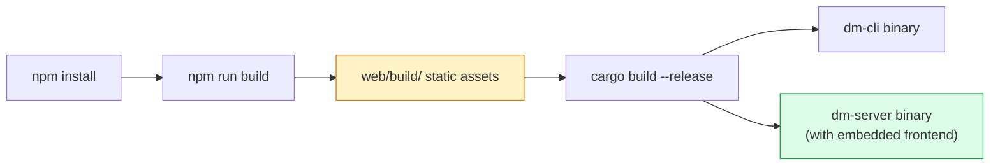
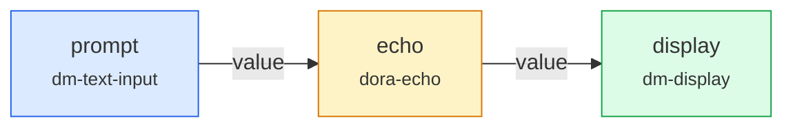
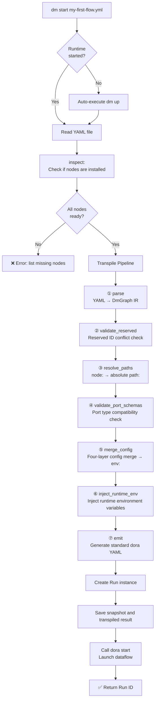

This page is a **hands-on introductory guide** for Dora Manager. It will walk you through, from scratch: compiling the project → starting services → writing a YAML dataflow → observing real-time data flow between nodes in the browser. After reading this page, you will have mastered the core workflow of `dm` and laid the foundation for deeper architectural exploration.

---

## Prerequisites

Before starting, ensure your development environment meets the following requirements. The compilation and running of `dm` depend on two toolchains (Rust backend + Node.js frontend), while the node ecosystem requires a Python environment.

| Dependency | Minimum Version | Purpose | Installation |
|------------|----------------|---------|-------------|
| **Rust** | stable | Compile `dm-core`, `dm-cli`, `dm-server` | `curl --proto '=https' --tlsv1.2 -sSf https://sh.rustup.rs \| sh` |
| **Node.js** | 20+ | Compile SvelteKit frontend dashboard | [nodejs.org](https://nodejs.org) or `brew install node@20` |
| **npm** | Installed with Node.js | Frontend dependency management | Included automatically |
| **Python** | 3.10+ | Node virtual environment and `pip install -e .` build | `brew install python@3.11` or system package manager |
| **uv** (recommended) | Any | Accelerate Python virtual environment creation | `pip install uv` |

The project pins the Rust toolchain to the stable channel via `rust-toolchain.toml`, with `clippy` and `rustfmt` components enabled. The CI pipeline has been verified on macOS (aarch64) and Linux (x86_64) platforms; Windows is not officially supported.

Sources: [rust-toolchain.toml](https://github.com/l1veIn/dora-manager/blob/master/rust-toolchain.toml), [.github/workflows/ci.yml](https://github.com/l1veIn/dora-manager/blob/master/.github/workflows/ci.yml#L13-L28), [crates/dm-core/src/env.rs](https://github.com/l1veIn/dora-manager/blob/master/crates/dm-core/src/env.rs#L1-L76)

## Build Flow Overview

Dora Manager adopts a **frontend-backend static embedding** distribution strategy — the SvelteKit frontend is compiled into pure static assets via `adapter-static`, then embedded into the Rust binary at compile time by `rust_embed`. This means you must **compile the frontend first, then the backend** — the order cannot be reversed.



The two resulting binaries have distinct roles: `dm` is the command-line tool responsible for environment management, node installation, and dataflow launching; `dm-server` is an Axum HTTP service with an embedded web dashboard providing RESTful API, listening on port `3210` by default.

Sources: [web/svelte.config.js](https://github.com/l1veIn/dora-manager/blob/master/web/svelte.config.js#L1-L15), [crates/dm-server/src/main.rs](https://github.com/l1veIn/dora-manager/blob/master/crates/dm-server/src/main.rs#L20-L22), [Cargo.toml](https://github.com/l1veIn/dora-manager/blob/master/Cargo.toml)

## Step 1: Compile the Project

### 1.1 Compile the Frontend Dashboard

```bash
cd web
npm install        # Install SvelteKit and all dependencies
npm run build      # Output static assets to web/build/
cd ..
```

`npm run build` executes `vite build`, which uses `@sveltejs/adapter-static` to compile the SvelteKit application into pure HTML/JS/CSS files, output to the `web/build/` directory. These files are then embedded wholesale into the `dm-server` binary by the `rust_embed` macro at Rust compile time.

Sources: [web/package.json](https://github.com/l1veIn/dora-manager/blob/master/web/package.json#L7-L9), [web/svelte.config.js](https://github.com/l1veIn/dora-manager/blob/master/web/svelte.config.js#L1-L15)

### 1.2 Compile the Rust Backend

```bash
cargo build --release
```

This command compiles the three crates in the workspace: `dm-core` (core library), `dm-cli` (CLI binary `dm`), and `dm-server` (HTTP service binary). Release mode enables LTO, single codegen-unit, and strip, producing smaller and faster binaries. Build artifacts are located in the `target/release/` directory.

Sources: [Cargo.toml](https://github.com/l1veIn/dora-manager/blob/master/Cargo.toml), [crates/dm-server/src/main.rs](https://github.com/l1veIn/dora-manager/blob/master/crates/dm-server/src/main.rs#L78-L243)

### 1.3 One-Click Development Mode (Optional)

If you want to run the frontend and backend simultaneously with hot-reload support, use the project's built-in development script:

```bash
./dev.sh
```

`dev.sh` automatically performs the following: checks if Rust and Node.js are installed → compiles the frontend → starts `dm-server` (Rust backend, port 3210) → starts the SvelteKit dev server (HMR hot-reload). Press `Ctrl+C` to stop both processes simultaneously.

Sources: [dev.sh](https://github.com/l1veIn/dora-manager/blob/master/dev.sh)

## Step 2: Initialize the Environment

After compilation, the first use requires environment initialization — installing the dora-rs runtime and verifying dependency completeness.

### 2.1 One-Click Installation (Recommended)

```bash
./target/release/dm setup
```

`dm setup` is a one-stop bootstrap command that sequentially: checks Python → installs uv (if missing) → downloads and installs the latest dora-rs CLI. After installation, the dora binary is stored at `~/.dm/versions/&lt;version&gt;/dora`, and the currently active version is recorded in `~/.dm/config.toml`.

Sources: [crates/dm-cli/src/main.rs](https://github.com/l1veIn/dora-manager/blob/master/crates/dm-cli/src/main.rs#L260-L302), [crates/dm-core/src/api/setup.rs](https://github.com/l1veIn/dora-manager/blob/master/crates/dm-core/src/api/setup.rs#L1-L55)

### 2.2 Step-by-Step Installation

If you prefer manual control over each step:

```bash
# Download and install the latest dora-rs (with progress bar)
./target/release/dm install

# Diagnose environment health
./target/release/dm doctor

# Switch to a specific version (optional)
./target/release/dm use 0.4.1
```

`dm doctor` checks Python, uv, and Rust availability one by one, and lists installed dora versions with their active status. If all checks pass, the output ends with `all_ok: true`.

Sources: [crates/dm-cli/src/main.rs](https://github.com/l1veIn/dora-manager/blob/master/crates/dm-cli/src/main.rs#L182-L205), [crates/dm-core/src/api/doctor.rs](https://github.com/l1veIn/dora-manager/blob/master/crates/dm-core/src/api/doctor.rs#L1-L62)

## Step 3: Start Services and Runtime

### 3.1 Start the HTTP Service

```bash
./target/release/dm-server
```

After startup, the terminal outputs `🚀 dm-server listening on http://127.0.0.1:3210`. Open [http://127.0.0.1:3210](http://127.0.0.1:3210) in your browser to access the visual management dashboard. The service embeds Swagger UI, accessible at [http://127.0.0.1:3210/swagger-ui](http://127.0.0.1:3210/swagger-ui) for the complete API documentation.

Sources: [crates/dm-server/src/main.rs](https://github.com/l1veIn/dora-manager/blob/master/crates/dm-server/src/main.rs#L227-L243)

### 3.2 Start the dora Runtime

Dataflow execution depends on dora-rs's coordinator + daemon processes:

```bash
./target/release/dm up
```

Or trigger via HTTP API:

```bash
curl -X POST http://127.0.0.1:3210/api/up
```

> **Note**: When using `dm start` to launch a dataflow, the system automatically detects runtime status; if not running, it automatically executes `up`, so this step can be skipped.

Sources: [crates/dm-core/src/api/runtime.rs](https://github.com/l1veIn/dora-manager/blob/master/crates/dm-core/src/api/runtime.rs#L132-L194), [crates/dm-server/src/main.rs](https://github.com/l1veIn/dora-manager/blob/master/crates/dm-server/src/main.rs#L108-L109)

## Step 4: Run Your First Dataflow

Now everything is ready. Let's create and run the simplest interactive dataflow — user enters text, it gets echoed, and is displayed on the dashboard.

### 4.1 Create the Dataflow YAML

Create a `my-first-flow.yml` file in the project root directory:

```yaml
nodes:
  - id: prompt
    node: dm-text-input
    outputs:
      - value
    config:
      label: "Input Prompt"
      placeholder: "Type text here..."
      multiline: true

  - id: echo
    node: dora-echo
    inputs:
      value: prompt/value
    outputs:
      - value

  - id: display
    node: dm-display
    inputs:
      data: echo/value
    config:
      label: "Echo Output"
      render: text
```

This dataflow defines the topology connections of three node instances. The key to understanding this YAML lies in distinguishing between **node references** (`node:` field) and **node instance IDs** (`id:` field): `node: dm-text-input` references an installed node type, while `id: prompt` is the unique identifier for this instance in the dataflow. Connections are declared through the `instanceID/portName` format in `inputs` — `value: prompt/value` means the `value` input port of the `echo` instance connects to the `value` output port of the `prompt` instance.



Sources: [tests/dataflows/interaction-demo.yml](https://github.com/l1veIn/dora-manager/blob/master/tests/dataflows/interaction-demo.yml#L1-L25)

### 4.2 Understanding the `dm start` Execution Pipeline

When you execute `dm start my-first-flow.yml`, the system goes through the following complete pipeline:



The **Transpiler** is the core component of `dm`. It translates the user-friendly extended YAML into standard dora-rs executable format. The two most critical steps are: **path resolution** (resolving `node: dm-text-input` to the absolute path of `.venv/bin/dm-text-input` under the node directory) and **config merging** (merging inline config, flow config, node config, and schema default — four layers — then injecting as environment variables).

Sources: [crates/dm-cli/src/main.rs](https://github.com/l1veIn/dora-manager/blob/master/crates/dm-cli/src/main.rs#L353-L384), [crates/dm-core/src/dataflow/transpile/mod.rs](https://github.com/l1veIn/dora-manager/blob/master/crates/dm-core/src/dataflow/transpile/mod.rs#L1-L82), [crates/dm-core/src/runs/service_start.rs](https://github.com/l1veIn/dora-manager/blob/master/crates/dm-core/src/runs/service_start.rs#L72-L146)

### 4.3 Launch the Dataflow

Using the CLI:

```bash
./target/release/dm start my-first-flow.yml
```

Or via HTTP API:

```bash
curl -X POST http://127.0.0.1:3210/api/dataflow/start \
  -H 'Content-Type: application/json' \
  -d '{"name": "my-first-flow"}'
```

After successful launch, the CLI outputs something like:

```
🚀 Starting dataflow...
✅ Run created: a1b2c3d4-e5f6-7890-abcd-ef1234567890
  Dora UUID: 12345678-abcd-ef00-1234-567890abcdef
  Dora runtime started dataflow successfully.
```

At this point, open the browser dashboard and you can see the dataflow is in **Running** state. The `prompt` node renders a text input field. Enter any text and submit — data flows through the `echo` node for echoing, and is finally displayed in the `display` node's dashboard area.

Sources: [crates/dm-core/src/runs/service_start.rs](https://github.com/l1veIn/dora-manager/blob/master/crates/dm-core/src/runs/service_start.rs#L176-L181)

### 4.4 Managing Running Dataflows

| Operation | CLI Command | HTTP API |
|-----------|-------------|----------|
| View all runs | `dm runs` | `GET /api/runs` |
| View run logs | `dm runs logs <run_id>` | `GET /api/runs/{id}/logs/{node_id}` |
| Stop a run | `dm runs stop <run_id>` | `POST /api/runs/{id}/stop` |
| Stop runtime | `dm down` | `POST /api/down` |
| Force restart | `dm start file.yml --force` | — |

Sources: [crates/dm-cli/src/main.rs](https://github.com/l1veIn/dora-manager/blob/master/crates/dm-cli/src/main.rs#L109-L137), [crates/dm-server/src/main.rs](https://github.com/l1veIn/dora-manager/blob/master/crates/dm-server/src/main.rs#L170-L192)

## Configuration System Overview

All persistent state of `dm` is stored in the **DM_HOME** directory, defaulting to `~/.dm`, which can be overridden via the `--home` parameter or `DM_HOME` environment variable.

```
~/.dm/
├── config.toml          # Global configuration (active version, media backend, etc.)
├── active               → Symlink to currently active version
├── versions/
│   └── 0.4.1/
│       └── dora         # dora-rs CLI binary
├── nodes/               # Installed node packages
│   └── &lt;node-id&gt;/
│       ├── dm.json      # Node contract file
│       ├── .venv/       # Python virtual environment (Python nodes)
│       └── ...          # Node source code and resources
├── dataflows/           # Imported dataflow projects
└── runs/                # Run history
    └── <run-id>/
        ├── run.json     # Run instance metadata
        ├── snapshot.yml # Original YAML snapshot
        └── transpiled.yml # Transpiled standard YAML
```

Node discovery order: `~/.dm/nodes` → repository built-in `nodes/` directory → additional paths specified by `DM_NODE_DIRS` environment variable. Nodes with the same name in `~/.dm/nodes` override built-in nodes.

Sources: [crates/dm-core/src/config.rs](https://github.com/l1veIn/dora-manager/blob/master/crates/dm-core/src/config.rs#L105-L167), [nodes/README.md](https://github.com/l1veIn/dora-manager/blob/master/nodes/README.md#L1-L12)

## Troubleshooting

| Symptom | Possible Cause | Solution |
|---------|---------------|----------|
| `cargo build` reports `rust_embed` error | Frontend not compiled | Run `cd web && npm run build` first |
| `dm start` reports "missing nodes" | Nodes not installed | Run `dm node install &lt;node-id&gt;` |
| `dm doctor` shows `all_ok: false` | dora not installed | Run `dm install` or `dm setup` |
| Browser can't access port 3210 | dm-server not started | Run `./target/release/dm-server` |
| Node exits immediately after startup | Python venv missing | Run `dm node install &lt;node-id&gt;` to rebuild `.venv` |
| `dm up` timeout | Port conflict or permission issue | Check for leftover dora processes, `pkill dora` and retry |

## Next Steps

Congratulations on building and running your first dataflow! Based on your interests, here are recommended follow-up readings:

- Deep dive into node contracts and port systems → [Node (Node): dm.json Contract and Executable Unit](04-node-concept.md)
- Master the complete YAML topology syntax → [Dataflow (Dataflow): YAML Topology and Node Connections](05-dataflow-concept.md)
- Learn about Run lifecycle and state tracking → [Run Instance (Run): Lifecycle, State, and Metrics Tracking](06-run-lifecycle.md)
- Configure the development hot-reload environment → [Development Environment Setup and Hot-Reload Workflow](03-dev-environment.md)