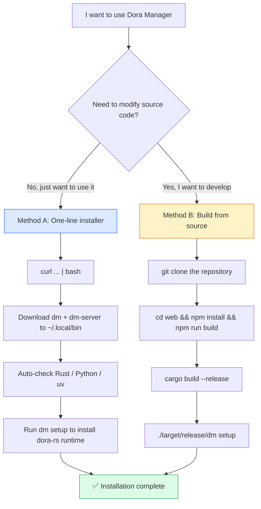
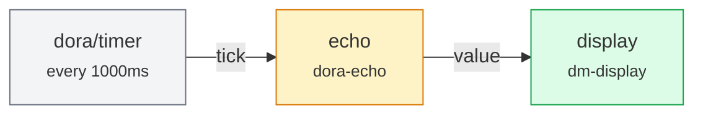
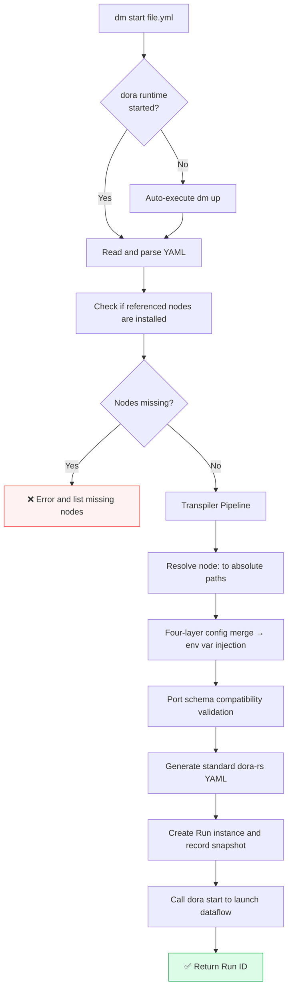

This page is an **end-to-end getting-started guide for new users**: from installing Dora Manager to seeing your first dataflow output in the browser, all in as few as **three commands**. Whether you choose the precompiled binary or build from source, you can complete the entire process in under 5 minutes. We'll intersperse key concept explanations along the way to help you build intuition about how the system works, without diving into architectural details right away.

Sources: [README.md](https://github.com/l1veIn/dora-manager/blob/main/README.md), [README_zh.md](https://github.com/l1veIn/dora-manager/blob/main/README_zh.md)

---

## Step 1: Choose Your Installation Method

Dora Manager provides two installation paths. Choose the one that best fits your current scenario — both produce identical results.



### Method A: One-line Install (Recommended for New Users)

```bash
curl -fsSL https://raw.githubusercontent.com/l1veIn/dora-manager/master/scripts/install.sh | bash
```

The installer automatically performs all of the following: **detects OS and CPU architecture** (supports macOS and Linux on x86_64 / aarch64) → **downloads the latest `dm` and `dm-server` binaries from GitHub Releases** to `~/.local/bin` → **checks Rust, Python, and uv environments** (provides installation suggestions if missing, without blocking the process) → **executes `dm setup` to install the dora-rs runtime**. If any step fails, clear error messages and fix suggestions are provided.

Sources: [scripts/install.sh](https://github.com/l1veIn/dora-manager/blob/main/scripts/install.sh#L1-L43)

The installer supports the following optional parameters:

| Parameter | Purpose | Example |
|-----------|---------|---------|
| `--skip-setup` | Skip `dm setup` (don't install dora-rs runtime) | `bash -s -- --skip-setup` |
| `--skip-deps` | Skip Rust / Python / uv dependency checks | `bash -s -- --skip-deps` |
| `--version VER` | Install a specific version instead of the latest | `bash -s -- --version v0.1.0` |
| `--bin-dir PATH` | Custom binary installation directory (default: `~/.local/bin`) | `bash -s -- --bin-dir /usr/local/bin` |

Sources: [scripts/install.sh](https://github.com/l1veIn/dora-manager/blob/main/scripts/install.sh#L30-L42)

> **After first installation**: If `~/.local/bin` is not in your `PATH`, the script will prompt you to add `export PATH="$PATH:$HOME/.local/bin"` to your shell configuration file (`~/.bashrc`, `~/.zshrc`, etc.) and then `source` it.

Sources: [scripts/install.sh](https://github.com/l1veIn/dora-manager/blob/main/scripts/install.sh#L215-L228)

### Method B: Build from Source (Developers)

If you plan to contribute to development or need a custom build, first ensure your environment meets these requirements:

| Dependency | Minimum Version | Purpose |
|-----------|----------------|---------|
| **Rust** | stable | Compile the three Rust crates (`dm-core`, `dm-cli`, `dm-server`) |
| **Node.js** | 20+ | Compile the SvelteKit frontend dashboard |
| **npm** | bundled with Node.js | Frontend dependency management |
| **Python** | 3.10+ | Virtual environment construction for some nodes |
| **uv** (recommended) | any | Accelerate Python virtual environment creation |

The project pins the Rust stable channel via `rust-toolchain.toml` and automatically enables `clippy` and `rustfmt` components.

Sources: [rust-toolchain.toml](https://github.com/l1veIn/dora-manager/blob/main/rust-toolchain.toml), [Cargo.toml](https://github.com/l1veIn/dora-manager/blob/main/Cargo.toml)

**Important: Build order matters**. Dora Manager uses a static embedding strategy — the SvelteKit frontend is compiled to pure static assets via `adapter-static`, then embedded into the `dm-server` binary at Rust compile time via the `rust_embed` macro. You must **build the frontend first, then the backend**:

```bash
# 1. Clone the repository
git clone https://github.com/l1veIn/dora-manager.git
cd dora-manager

# 2. Build the frontend (outputs to web/build/)
cd web
npm install
npm run build
cd ..

# 3. Build the backend (automatically embeds frontend assets from web/build/)
cargo build --release

# 4. Initialize the dora-rs runtime
./target/release/dm setup
```

After a successful build, two binaries will appear in `target/release/`: `dm` (CLI tool) and `dm-server` (HTTP service with embedded Web dashboard).

Sources: [README.md](https://github.com/l1veIn/dora-manager/blob/main/README.md), [Cargo.toml](https://github.com/l1veIn/dora-manager/blob/main/Cargo.toml)

---

## Step 2: Start the Service

After installation, you need to start **dm-server** — an Axum-based HTTP service with an embedded Web visual management dashboard. The startup command differs slightly depending on your installation method:

| Installation Method | Startup Command | Notes |
|--------------------|-----------------|-------|
| Method A (precompiled) | `dm-server` | Binary installed in `~/.local/bin` |
| Method B (built from source) | `./target/release/dm-server` | Binary in repository `target/release/` |
| Development mode (source) | `./dev.sh` | Starts both backend + frontend HMR hot-reload |

After successful startup, the terminal will output:

```
🚀 dm-server listening on http://127.0.0.1:3210
```

At this point, open **[http://127.0.0.1:3210](http://127.0.0.1:3210)** in your browser to access the visual management dashboard. If you're using source development mode (`./dev.sh`), the frontend dev server will run simultaneously and provide HMR hot-reload — the browser automatically refreshes when you modify frontend code.

Sources: [crates/dm-server/src/main.rs](https://github.com/l1veIn/dora-manager/blob/main/crates/dm-server/src/main.rs#L227-L243), [dev.sh](https://github.com/l1veIn/dora-manager/blob/main/dev.sh)

> **About `./dev.sh`**: This script executes in sequence — checks if Rust and Node.js are installed → installs frontend dependencies (first time only) → starts `cargo run -p dm-server` (backend, port 3210) → starts `npm run dev` (frontend HMR dev server). Press `Ctrl+C` to gracefully stop both processes.

Sources: [dev.sh](https://github.com/l1veIn/dora-manager/blob/main/dev.sh)

---

## Step 3: Run Your First Dataflow

With the service running, you're 80% done with setup. Let's use a **zero-dependency built-in demo** to verify everything works.

### Run the Hello Timer Demo

```bash
# Precompiled installation
dm start demos/demo-hello-timer.yml

# Or built from source
./target/release/dm start demos/demo-hello-timer.yml
```

This dataflow is Dora Manager's simplest out-of-the-box example — it uses only built-in nodes and **requires no additional dependencies**. The dataflow topology is straightforward:



**What happened?** The Timer virtual node sends a heartbeat event every second → the `dora-echo` node receives and forwards it unchanged → the `dm-display` node pushes text to the Web UI's panel area. If you open the corresponding run instance page in the browser, the right panel will refresh with a new message every second.

Sources: [demos/demo-hello-timer.yml](demos/demo-hello-timer.yml#L1-L39)

The CLI output looks like:

```
🚀 Starting dataflow...
✅ Run created: a1b2c3d4-e5f6-7890-abcd-ef1234567890
  → Running in background. Stop with: dm runs stop a1b2c3d4-e5f6-7890-abcd-ef1234567890
  → View in browser: http://127.0.0.1:3210
```

> **Note**: `dm start` automatically checks if the dora runtime is running; if not, it automatically executes `dm up`, so you don't need to start the runtime manually.

Sources: [crates/dm-cli/src/main.rs](https://github.com/l1veIn/dora-manager/blob/main/crates/dm-cli/src/main.rs#L353-L384)

### What Happens Behind `dm start`

When you execute `dm start`, the system goes through a complete processing pipeline. You don't need to memorize every step, but knowing they exist helps with troubleshooting later:



The **Transpiler** is `dm`'s core differentiator — it translates user-friendly extended YAML (using `node:` references instead of hardcoded paths) into dora-rs's native executable format, including path resolution, configuration merging, and environment variable injection.

Sources: [crates/dm-cli/src/main.rs](https://github.com/l1veIn/dora-manager/blob/main/crates/dm-cli/src/main.rs#L353-L384)

---

## Step 4: Interact in the Web Dashboard

After launching a dataflow, open [http://127.0.0.1:3210](http://127.0.0.1:3210) to see the current run instance page. For the Hello Timer demo:

1. The page displays the run instance's **status** (Running), **Run ID**, and start time
2. The `display` node's area **refreshes every second** with received messages
3. You can observe data flowing between nodes in real-time

This is the core Dora Manager experience — **dataflows are no longer black boxes in the terminal**, but visualized, interactive, and debuggable runtime entities.

---

## More Built-in Demos

The project includes multiple zero-dependency demos you can run to experience different features:

| Demo | Command | What It Demonstrates |
|------|---------|---------------------|
| **Hello Timer** | `dm start demos/demo-hello-timer.yml` | Simplest timer, validates engine and UI connectivity |
| **Interactive Widgets** | `dm start demos/demo-interactive-widgets.yml` | Four interactive controls: slider, button, text input, toggle |
| **Logic Gate** | `dm start demos/demo-logic-gate.yml` | AND gate + conditional flow control, demonstrating logic node composition |

Sources: [demos/demo-hello-timer.yml](demos/demo-hello-timer.yml#L1-L39), [demos/demo-interactive-widgets.yml](demos/demo-interactive-widgets.yml#L1-L129), [demos/demo-logic-gate.yml](demos/demo-logic-gate.yml#L1-L120)

Additionally, there's an advanced demo in the `demos/` directory that requires installing extra nodes:

```bash
# Robotics object detection (requires opencv-video-capture and dora-yolo)
dm node install opencv-video-capture
dm node install dora-yolo
dm start demos/robotics-object-detection.yml
```

This demo showcases the complete "camera capture → YOLOv8 inference → annotated image display" pipeline, including a real-time slider control for adjusting the detection confidence threshold.

Sources: [demos/robotics-object-detection.yml](demos/robotics-object-detection.yml#L1-L76), [README.md](https://github.com/l1veIn/dora-manager/blob/main/README.md)

---

## Common Commands Quick Reference

After installing and starting the service, these are the commands you'll use most:

| Operation | CLI Command | HTTP API |
|-----------|------------|----------|
| Environment diagnostics | `dm doctor` | `GET /api/doctor` |
| Check installed dora version | `dm versions` | `GET /api/versions` |
| Start dora runtime | `dm up` | `POST /api/up` |
| Start a dataflow | `dm start <file.yml>` | `POST /api/dataflow/start` |
| List all runs | `dm runs` | `GET /api/runs` |
| View run logs | `dm runs logs <run_id>` | `GET /api/runs/{id}/logs/{node_id}` |
| Stop a run | `dm runs stop <run_id>` | `POST /api/runs/{id}/stop` |
| Stop runtime | `dm down` | `POST /api/down` |
| List installed nodes | `dm node list` | `GET /api/nodes` |
| Install a node | `dm node install <node-id>` | `POST /api/nodes/install` |

Sources: [crates/dm-cli/src/main.rs](https://github.com/l1veIn/dora-manager/blob/main/crates/dm-cli/src/main.rs#L51-L152), [crates/dm-server/src/main.rs](https://github.com/l1veIn/dora-manager/blob/main/crates/dm-server/src/main.rs#L108-L192)

The HTTP API listens on port **3210** by default. The service also embeds Swagger UI, accessible at [http://127.0.0.1:3210/swagger-ui](http://127.0.0.1:3210/swagger-ui) for browsing complete API documentation and debugging online.

Sources: [crates/dm-server/src/main.rs](https://github.com/l1veIn/dora-manager/blob/main/crates/dm-server/src/main.rs#L224-L225)

---

## Configuration and Storage: The DM_HOME Directory

All persistent state for `dm` is stored in the **DM_HOME** directory, defaulting to `~/.dm`. This can be overridden via the `--home` parameter or the `DM_HOME` environment variable. Understanding this directory structure helps with manual troubleshooting when needed:

```
~/.dm/
├── config.toml          # Global config (active version, media backend, etc.)
├── active               → Symlink to currently active version
├── versions/
│   └── 0.4.1/
│       └── dora         # dora-rs CLI binary
├── nodes/               # Installed node packages
│   └── <node-id>/
│       ├── dm.json      # Node contract file
│       ├── .venv/       # Python virtual environment (for Python nodes)
│       └── ...
├── dataflows/           # Imported dataflow projects
└── runs/                # Run history records
    └── <run-id>/
        ├── run.json     # Run instance metadata
        ├── snapshot.yml # Original YAML snapshot
        └── transpiled.yml # Transpiled standard YAML
```

Node discovery order: `~/.dm/nodes` → repository built-in `nodes/` directory → extra paths specified by `DM_NODE_DIRS` environment variable.

Sources: [crates/dm-core/src/config.rs](https://github.com/l1veIn/dora-manager/blob/main/crates/dm-core/src/config.rs#L135-L167)

---

## Common Troubleshooting

| Symptom | Possible Cause | Solution |
|---------|---------------|----------|
| `cargo build` reports `rust_embed` error | Frontend not built | Run `cd web && npm install && npm run build` first |
| `dm start` reports "missing nodes" | Nodes not installed | Run `dm node install <node-id>` to install missing nodes |
| `dm doctor` shows `all_ok: false` | dora runtime not installed | Run `dm install` or `dm setup` |
| Browser can't reach port 3210 | dm-server not running | Run `dm-server` or `./target/release/dm-server` |
| Node exits immediately after starting | Python virtual environment missing | Run `dm node install <node-id>` to rebuild `.venv` |
| `dm up` times out | Port conflict or permissions | Run `pkill dora` to clear residual processes and retry |
| `dm-server` command not found | PATH not configured | Confirm `~/.local/bin` is in PATH |

Sources: [crates/dm-cli/src/main.rs](https://github.com/l1veIn/dora-manager/blob/main/crates/dm-cli/src/main.rs#L260-L302), [simulate_clean_install.sh](https://github.com/l1veIn/dora-manager/blob/main/simulate_clean_install.sh)

---

## Next Steps

Congratulations on completing the full flow from installation to running your first dataflow! Here are recommended reading paths based on your interests:

- **Understand what nodes are** → [Node: dm.json Contract and Executable Unit](04-node-concept)
- **Master the full YAML topology syntax** → [Dataflow: YAML Topology Definition and Node Connections](05-dataflow-concept)
- **Learn about Run lifecycle tracking** → [Run: Lifecycle State Machine and Metrics Tracking](06-run-lifecycle)
- **Set up a hot-reload development environment** → [Development Environment: Building from Source and Hot-Reload Workflow](03-dev-environment)
