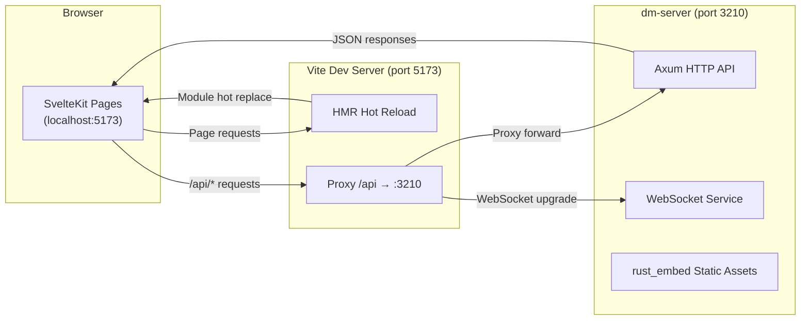

This document guides you through setting up the complete development environment for Dora Manager from scratch, and teaches you the core **hot-reload workflow** for daily development. You will learn about the project's frontend-backend dual-process architecture, how the `dev.sh` one-click startup script works, how Vite proxy bridges frontend and backend, and the key differences between production and development builds.

Sources: [README_zh.md](https://github.com/l1veIn/dora-manager/blob/master/README_zh.md), [dev.sh](https://github.com/l1veIn/dora-manager/blob/master/dev.sh)

## Prerequisites

Before starting, ensure your system has the following tools installed. Version requirements reference the CI pipeline configuration:

| Tool | Minimum Version | Purpose | Verification Command |
|------|----------------|---------|---------------------|
| **Rust (stable)** | 1.70+ | Compile the three backend crates | `cargo --version` |
| **Node.js** | 20+ | Frontend build and dev server | `node --version` |
| **npm** | Installed with Node.js | Package manager | `npm --version` |
| **Git** | Any | Source code management | `git --version` |

The project pins the Rust toolchain to the **stable** channel via `rust-toolchain.toml`, requiring the `clippy` (code checking) and `rustfmt` (formatting) components. `cargo` automatically reads this configuration — no manual `rustup component add` needed.

Sources: [rust-toolchain.toml](https://github.com/l1veIn/dora-manager/blob/master/rust-toolchain.toml), [.github/workflows/ci.yml](https://github.com/l1veIn/dora-manager/blob/master/.github/workflows/ci.yml#L33-L37)

### Installing the Rust Toolchain

If you haven't installed Rust yet, use the official installer:

```bash
curl --proto '=https' --tlsv1.2 -sSf https://sh.rustup.rs | sh
```

After installation, run `cargo --version` in the project root directory to verify. The `rust-toolchain.toml` in the project root ensures `cargo` automatically switches to the correct toolchain and installs required components.

Sources: [rust-toolchain.toml](https://github.com/l1veIn/dora-manager/blob/master/rust-toolchain.toml)

### Installing Node.js

Node.js 20 LTS is recommended. You can download from [nodejs.org](https://nodejs.org) or use `nvm`:

```bash
nvm install 20
nvm use 20
```

The `.npmrc` in the project's frontend directory `web/` sets `engine-strict=true`, meaning if the Node.js version doesn't meet the `engines` field requirements in `package.json`, `npm install` will immediately error out.

Sources: [web/.npmrc](https://github.com/l1veIn/dora-manager/blob/master/web/.npmrc#L1-L2)

## Project Structure Overview

Dora Manager uses a **Rust backend + SvelteKit frontend** dual-language architecture. The backend is organized as a Cargo workspace with three crates, while the frontend is a standard SvelteKit project. Understanding this structure is the foundation for setting up the development environment.

```text
dora-manager/
├── crates/
│   ├── dm-core/        ← Core logic library (transpiler, node management, run scheduling)
│   ├── dm-cli/         ← CLI tool binary (`dm` command)
│   └── dm-server/      ← HTTP API service (Axum, port 3210)
├── web/                ← SvelteKit frontend
│   ├── src/            ← Svelte components, routes, API communication layer
│   ├── build/          ← Vite static build output (embedded by rust_embed)
│   └── package.json    ← Frontend dependencies and scripts
├── nodes/              ← Built-in node collection (Python / Rust)
├── dev.sh              ← One-click development startup script
├── Cargo.toml          ← Workspace root configuration
└── rust-toolchain.toml ← Rust toolchain pinning
```

Sources: [Cargo.toml](https://github.com/l1veIn/dora-manager/blob/master/Cargo.toml), [README_zh.md](https://github.com/l1veIn/dora-manager/blob/master/README_zh.md)

## Development Environment Setup Steps

### Step 1: Clone the Repository

```bash
git clone https://github.com/l1veIn/dora-manager.git
cd dora-manager
```

Sources: [README_zh.md](https://github.com/l1veIn/dora-manager/blob/master/README_zh.md)

### Step 2: Install Frontend Dependencies

```bash
cd web
npm install
cd ..
```

The first installation pulls all frontend dependencies into `web/node_modules/`, including Svelte 5, Vite 7, Tailwind CSS 4, SvelteFlow, etc. Subsequent hot-reloading depends on these dependencies being correctly installed.

Sources: [web/package.json](https://github.com/l1veIn/dora-manager/blob/master/web/package.json#L16-L65)

### Step 3: Build Frontend Static Assets

```bash
cd web && npm run build && cd ..
```

This step executes `vite build`, compiling the SvelteKit application into pure static files output to the `web/build/` directory. **This step cannot be skipped** because the backend crate `dm-server` uses `rust_embed` to embed the static files under `web/build/` into the Rust binary at compile time:

```rust
#[derive(Embed)]
#[folder = "../../web/build"]
struct WebAssets;
```

If the `web/build/` directory is empty or doesn't exist, `cargo build` will still compile successfully, but the runtime will be unable to serve the Web UI.

Sources: [crates/dm-server/src/main.rs](https://github.com/l1veIn/dora-manager/blob/master/crates/dm-server/src/main.rs#L20-L22), [crates/dm-server/src/handlers/web.rs](https://github.com/l1veIn/dora-manager/blob/master/crates/dm-server/src/handlers/web.rs#L1-L27)

### Step 4: Compile the Rust Backend

```bash
cargo build
```

This compiles the three crates in the entire workspace: `dm-core` (core library), `dm-cli` (CLI binary `dm`), and `dm-server` (HTTP service binary `dm-server`). The first compilation may take several minutes to download and compile dependencies. Build artifacts are in the `target/debug/` directory.

Sources: [Cargo.toml](https://github.com/l1veIn/dora-manager/blob/master/Cargo.toml)

### Step 5: Verify the Build Results

```bash
# Verify Rust binaries
./target/debug/dm --help
./target/debug/dm-server --help

# Verify frontend build artifacts
ls web/build/
```

If you can see the help information for `dm` and `dm-server`, and `web/build/` contains `index.html` and other files, the environment setup is successful.

Sources: [README_zh.md](https://github.com/l1veIn/dora-manager/blob/master/README_zh.md)

## Hot-Reload Development Workflow

Dora Manager's development mode uses a **dual-process parallel** architecture: the Rust backend (`dm-server`) provides the API service, while the Vite frontend dev server provides HMR (Hot Module Replacement). The two work together through Vite's proxy mechanism.



Sources: [dev.sh](https://github.com/l1veIn/dora-manager/blob/master/dev.sh), [web/vite.config.ts](https://github.com/l1veIn/dora-manager/blob/master/web/vite.config.ts#L1-L17)

### One-Click Startup: dev.sh

The project provides a `dev.sh` script that encapsulates the complete development startup flow. You only need one command:

```bash
chmod +x dev.sh   # First run requires execution permission
./dev.sh
```

The script performs the following operations in order:

**Pre-check phase**: Checks whether `cargo`, `node`, and `npm` are available; exits immediately with installation hints if missing.

**Frontend build**: If `web/node_modules/` doesn't exist, automatically runs `npm install`, then executes `npm run build` to generate `web/build/` static assets. This step ensures `rust_embed` can find the frontend artifacts when the backend compiles.

**Backend startup**: Starts the Rust backend in the background via `cargo run -p dm-server`, listening on `127.0.0.1:3210`.

**Frontend dev server startup**: Executes `npm run dev` (i.e., `vite dev`) in the `web/` directory to start the Vite dev server, listening on `localhost:5173` by default.

**Graceful shutdown**: The script registers a `trap cleanup EXIT INT TERM` signal handler, so pressing `Ctrl+C` terminates both child processes simultaneously.

Sources: [dev.sh](https://github.com/l1veIn/dora-manager/blob/master/dev.sh)

### Vite Proxy: The Bridge Between Frontend and Backend

In development mode, the frontend runs on the Vite dev server (`localhost:5173`), while the backend runs on `dm-server` (`localhost:3210`). Due to browser same-origin policy restrictions, the frontend cannot directly request the backend API on a different port. Vite's proxy configuration solves this problem:

```typescript
// web/vite.config.ts
export default defineConfig({
    plugins: [tailwindcss(), sveltekit()],
    server: {
        proxy: {
            '/api': {
                target: 'http://127.0.0.1:3210',
                changeOrigin: true,
                ws: true    // Support WebSocket proxying
            }
        }
    }
});
```

All `/api/*` requests from the frontend are automatically proxied to `dm-server` by Vite. The `ws: true` configuration ensures WebSocket connections (used for real-time message pushing and runtime status monitoring) also work properly through the proxy. The frontend API communication layer uses the relative path `/api` as the base path, with no need to hardcode the backend address:

```typescript
// web/src/lib/api.ts
export const API_BASE = '/api';
```

Sources: [web/vite.config.ts](https://github.com/l1veIn/dora-manager/blob/master/web/vite.config.ts#L1-L17), [web/src/lib/api.ts](https://github.com/l1veIn/dora-manager/blob/master/web/src/lib/api.ts#L1-L7)

### Frontend Hot Reload (HMR) Mechanism

When you modify any Svelte component, TypeScript file, or CSS style under `web/src/`, Vite will:

1. **Detect file changes**: Vite's file watcher detects modifications on disk
2. **Incremental compilation**: Only recompile affected modules, not the entire application
3. **Push HMR updates**: Push changes to the browser via WebSocket
4. **Partial replacement**: Svelte components in the browser are replaced in-place, **preserving application state**

This means after you change a button's color or adjust a component's layout, the page updates automatically within hundreds of milliseconds — no manual refresh, no need to recompile the Rust backend.

Sources: [web/package.json](https://github.com/l1veIn/dora-manager/blob/master/web/package.json#L7-L8)

### Development Loop for Backend Changes

After modifying Rust backend code, hot-reload does not automatically take effect — Rust is a compiled language and requires recompilation. Your workflow is:

1. **Modify code**: Edit Rust source files under `crates/`
2. **Restart backend**: `Ctrl+C` to terminate `dev.sh`, then re-run `./dev.sh`

If you only modify API handler logic (not involving the frontend), you can accelerate the loop by restarting just the backend:

```bash
# Start backend only (in the project root directory)
cargo run -p dm-server
```

The Vite dev server can continue running in another terminal, unaffected by backend restarts.

Sources: [dev.sh](https://github.com/l1veIn/dora-manager/blob/master/dev.sh), [Cargo.toml](https://github.com/l1veIn/dora-manager/blob/master/Cargo.toml)

## Development Mode vs Production Mode

Understanding the differences between the two modes is crucial for debugging and deployment.

| Dimension | Development Mode (`dev.sh`) | Production Mode (`dm-server`) |
|-----------|---------------------------|-------------------------------|
| **Frontend service** | Vite Dev Server (port 5173) | `rust_embed` static embedding, served directly by dm-server |
| **API service** | `cargo run` (debug build, port 3210) | Pre-compiled release binary (port 3210) |
| **Frontend updates** | HMR hot-reload, millisecond response | Requires re-run `npm run build` + `cargo build` |
| **Browser access** | `http://localhost:5173` | `http://127.0.0.1:3210` |
| **API proxy** | Vite proxy (`/api` → `:3210`) | Direct connection, no proxy layer |
| **Debug info** | Rust debug assertions enabled, frontend source maps available | Binary stripped, LTO optimized |
| **Build artifacts** | `target/debug/dm-server` (~50MB+) | `target/release/dm-server` (~10MB, stripped) |

In production mode, SvelteKit uses `adapter-static` to compile the frontend into pure static files (HTML/CSS/JS), then `rust_embed` embeds these files into the binary at Rust compile time. At runtime, `dm-server` serves these files directly from memory via the `serve_web` handler, with all unknown paths falling back to `index.html` to support SPA routing.

Sources: [web/svelte.config.js](https://github.com/l1veIn/dora-manager/blob/master/web/svelte.config.js#L1-L15), [crates/dm-server/src/main.rs](https://github.com/l1veIn/dora-manager/blob/master/crates/dm-server/src/main.rs#L224-L225), [crates/dm-server/src/handlers/web.rs](https://github.com/l1veIn/dora-manager/blob/master/crates/dm-server/src/handlers/web.rs#L6-L27), [Cargo.toml](https://github.com/l1veIn/dora-manager/blob/master/Cargo.toml)

## Common Development Commands Quick Reference

| Scenario | Command | Description |
|----------|---------|-------------|
| One-click dev environment | `./dev.sh` | Start backend + Vite frontend simultaneously |
| Backend only | `cargo run -p dm-server` | Backend API service, port 3210 |
| Frontend only | `cd web && npm run dev` | Vite dev server, requires backend running |
| Compile frontend | `cd web && npm run build` | Output to `web/build/` |
| Compile all (release) | `cargo build --release` | Optimized binaries |
| Rust format check | `cargo fmt --check` | CI runs this |
| Rust static analysis | `cargo clippy --workspace --all-targets` | CI runs this |
| Frontend type check | `cd web && npm run check` | Svelte type validation |
| Frontend lint | `cd web && npm run lint` | Svelte check |
| Run Rust tests | `cargo test --workspace` | Unit and integration tests |
| Clean install verification | `./simulate_clean_install.sh` | Simulate full install on a fresh environment |

Sources: [web/package.json](https://github.com/l1veIn/dora-manager/blob/master/web/package.json#L6-L15), [.github/workflows/ci.yml](https://github.com/l1veIn/dora-manager/blob/master/.github/workflows/ci.yml#L61-L73)

## Troubleshooting

### Issue: `cargo build` error about missing frontend assets

**Symptom**: When compiling `dm-server`, `rust_embed` cannot read files under `web/build/`, or opening Web UI at runtime shows a blank page.

**Solution**: Ensure the frontend build is completed before compiling Rust:

```bash
cd web && npm install && npm run build && cd ..
cargo build
```

`rust_embed` reads the `web/build/` directory at compile time (not runtime). If the directory doesn't exist, the embedded resources will be empty, but compilation won't fail — this is an easy-to-overlook trap.

Sources: [crates/dm-server/src/main.rs](https://github.com/l1veIn/dora-manager/blob/master/crates/dm-server/src/main.rs#L20-L22)

### Issue: Frontend `npm run dev` shows blank page or API requests return 404

**Symptom**: Vite dev server runs normally, but the page has no data or the console shows `/api/*` requests returning 404.

**Solution**: Confirm that `dm-server` is running on port 3210. Vite only proxies requests with the `/api` prefix — if the backend isn't started, the proxy target is unreachable:

```bash
# Terminal 1: Start backend
cargo run -p dm-server

# Terminal 2: Start frontend
cd web && npm run dev
```

Or simply use `./dev.sh` for one-click startup.

Sources: [web/vite.config.ts](https://github.com/l1veIn/dora-manager/blob/master/web/vite.config.ts#L8-L14), [dev.sh](https://github.com/l1veIn/dora-manager/blob/master/dev.sh)

### Issue: Node.js version incompatibility

**Symptom**: `npm install` reports `Unsupported engine` error.

**Solution**: The project uses Node.js 20. Verify your version:

```bash
node --version   # Should show v20.x.x
```

If the version is too low, upgrade Node.js or use `nvm use 20` to switch versions. The `engine-strict=true` in `web/.npmrc` blocks installation when versions don't match.

Sources: [web/.npmrc](https://github.com/l1veIn/dora-manager/blob/master/web/.npmrc#L1-L2), [.github/workflows/ci.yml](https://github.com/l1veIn/dora-manager/blob/master/.github/workflows/ci.yml#L33-L34)

### Issue: Frontend requests timeout after modifying Rust code

**Symptom**: After modifying backend code and restarting `dm-server`, the frontend shows request timeouts.

**Solution**: This is normal behavior. During backend restart (especially with debug builds, compilation is slower), the API service is unavailable. The Vite proxy returns connection errors. Wait for the backend to finish starting (terminal shows `🚀 dm-server listening on http://127.0.0.1:3210`), then refresh the page to recover.

Sources: [crates/dm-server/src/main.rs](https://github.com/l1veIn/dora-manager/blob/master/crates/dm-server/src/main.rs#L227-L228)

## Next Steps

After setting up the environment and becoming familiar with the hot-reload workflow, it is recommended to proceed in the following order:

1. **[Node (Node): dm.json Contract and Executable Unit](04-node-concept.md)** — Understand the project's core abstraction; all functionality revolves around nodes
2. **[Dataflow (Dataflow): YAML Topology and Node Connections](05-dataflow-concept.md)** — Learn how to orchestrate data flow between nodes
3. **[Quickstart: Build, Launch, and Run Your First Dataflow](02-quickstart.md)** — Verify the development environment with hands-on practice