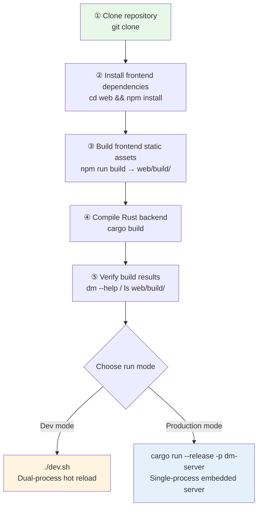
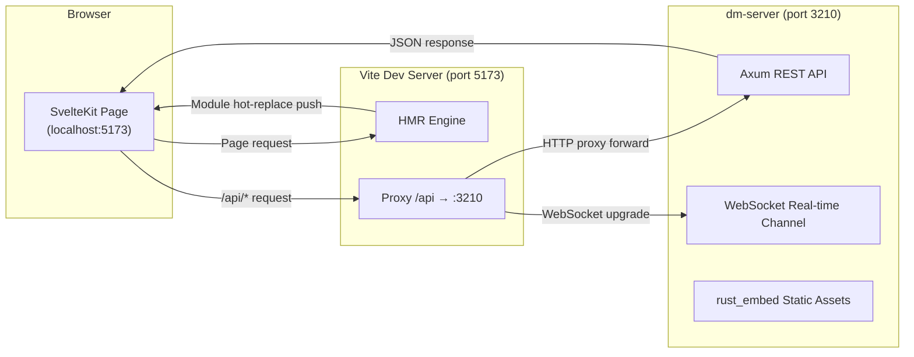

This document will guide you through setting up the complete Dora Manager development environment from scratch, and help you master the **hot-reload workflow** that is central to daily development. You will learn about the project's dual-process architecture (backend + frontend), how the `dev.sh` one-click startup script works, how the Vite proxy bridges the frontend and backend, and the key differences between production builds and development mode. Whether you want to quickly get the project running to see it in action, or plan to dive deep into contributing code, this article is your first stop before writing any code.

Sources: [README.md](https://github.com/l1veIn/dora-manager/blob/main/README.md), [dev.sh](https://github.com/l1veIn/dora-manager/blob/main/dev.sh)

## Prerequisites

Before you begin, make sure your system has the following tools installed. Version requirements are based on the CI pipeline configuration:

| Tool | Minimum Version | Purpose | Verification Command |
|------|----------|------|----------|
| **Rust (stable)** | 1.70+ | Compile the three backend crates | `cargo --version` |
| **Node.js** | 20+ | Frontend build and dev server | `node --version` |
| **npm** | Installed with Node.js | Frontend package manager | `npm --version` |
| **Git** | Any | Source control | `git --version` |

The project pins the Rust toolchain to the **stable** channel via `rust-toolchain.toml`, and declares `clippy` (linting) and `rustfmt` (formatting) as required components. When you run any `cargo` command from the project root, Cargo will automatically read this configuration file to ensure the correct toolchain and components are installed -- no manual `rustup component add` needed.

Sources: [rust-toolchain.toml](https://github.com/l1veIn/dora-manager/blob/main/rust-toolchain.toml), [.github/workflows/ci.yml](https://github.com/l1veIn/dora-manager/blob/main/.github/workflows/ci.yml#L33-L37)

### Installing the Rust Toolchain

If you haven't installed Rust yet, use the official installer:

```bash
curl --proto '=https' --tlsv1.2 -sSf https://sh.rustup.rs | sh
```

After installation, reopen your terminal and run `cargo --version` to verify. The `rust-toolchain.toml` file in the project root will ensure `cargo` automatically switches to the correct toolchain and installs the required `clippy` and `rustfmt` components.

Sources: [rust-toolchain.toml](https://github.com/l1veIn/dora-manager/blob/main/rust-toolchain.toml)

### Installing Node.js

**Node.js 20 LTS** is recommended. You can download it from [nodejs.org](https://nodejs.org) or manage it with `nvm`:

```bash
nvm install 20
nvm use 20
```

The `.npmrc` file in the `web/` directory sets `engine-strict=true`, which means if your Node.js version does not satisfy the `engines` field in `package.json`, `npm install` will fail immediately -- this is a hard guard for version compatibility.

Sources: [web/.npmrc](https://github.com/l1veIn/dora-manager/blob/main/web/.npmrc#L1-L2)

## Project Structure Overview

Dora Manager uses a **Rust backend + SvelteKit frontend** dual-language architecture. The backend is organized as a Cargo workspace with three crates, while the frontend is a standard SvelteKit project. Understanding this layered structure is fundamental to setting up the development environment and navigating the codebase.

```text
dora-manager/
├── crates/
│   ├── dm-core/        ← Core logic library (transpiler, node management, run scheduling)
│   ├── dm-cli/         ← CLI tool binary (`dm` command)
│   └── dm-server/      ← HTTP API server (Axum, port 3210)
├── web/                ← SvelteKit frontend
│   ├── src/            ← Svelte components, routes, API communication layer
│   ├── build/          ← Vite static build output (embedded via rust_embed)
│   └── package.json    ← Frontend dependencies and scripts
├── nodes/              ← Built-in node collection (Python / Rust mixed)
├── dev.sh              ← One-click development startup script
├── Cargo.toml          ← Workspace root configuration
└── rust-toolchain.toml ← Rust toolchain pinning
```

The three backend crates serve different responsibilities: **`dm-core`** is a pure library crate that encapsulates all core business logic, including the dataflow transpiler, node installation/management, and run scheduling; **`dm-cli`** depends on `dm-core` and provides a terminal command-line interface (binary name `dm`), with colored output and progress bars; **`dm-server`** also depends on `dm-core` and exposes REST APIs and WebSocket real-time channels on top of the Axum framework (binary name `dm-server`), using `rust_embed` to embed frontend static files into the Rust binary at compile time.

Sources: [Cargo.toml](https://github.com/l1veIn/dora-manager/blob/main/Cargo.toml), [crates/dm-core/Cargo.toml](https://github.com/l1veIn/dora-manager/blob/main/crates/dm-core/Cargo.toml#L1-L8), [crates/dm-cli/Cargo.toml](https://github.com/l1veIn/dora-manager/blob/main/crates/dm-cli/Cargo.toml#L1-L12), [crates/dm-server/Cargo.toml](https://github.com/l1veIn/dora-manager/blob/main/crates/dm-server/Cargo.toml#L1-L14)

## Building from Source: Step-by-Step Guide

The following process will take you from a blank slate to a fully runnable environment. Each step is annotated with its purpose and important notes.



### Step 1: Clone the Repository

```bash
git clone https://github.com/l1veIn/dora-manager.git
cd dora-manager
```

After cloning, you are in the project root directory `dora-manager/`. All subsequent commands should be run from this directory.

Sources: [README.md](https://github.com/l1veIn/dora-manager/blob/main/README.md)

### Step 2: Install Frontend Dependencies

```bash
cd web
npm install
cd ..
```

The first install will pull all frontend dependencies into `web/node_modules/`, including **Svelte 5**, **Vite 7**, **Tailwind CSS 4**, **SvelteFlow**, and 40+ direct dependencies. Subsequent hot-reload and frontend builds depend on these dependencies being correctly installed. If you see an `Unsupported engine` error, go back to the Prerequisites section and check your Node.js version.

Sources: [web/package.json](https://github.com/l1veIn/dora-manager/blob/main/web/package.json#L16-L68)

### Step 3: Build Frontend Static Assets

```bash
cd web && npm run build && cd ..
```

This step runs `vite build`, compiling the SvelteKit application into pure static files and outputting them to the `web/build/` directory. **This step cannot be skipped**, because the backend crate `dm-server` uses `rust_embed` to embed all static files from `web/build/` into the Rust binary at compile time. The key code is:

```rust
#[derive(Embed)]
#[folder = "../../web/build"]
struct WebAssets;
```

If the `web/build/` directory is empty or does not exist, `cargo build` **will still compile successfully** -- `rust_embed` does not error at compile time, but at runtime the Web UI will render a blank page. This is a common pitfall that is easy to overlook; always make sure the frontend build completes before the backend compilation.

Sources: [crates/dm-server/src/main.rs](https://github.com/l1veIn/dora-manager/blob/main/crates/dm-server/src/main.rs#L20-L22)

### Step 4: Compile the Rust Backend

```bash
cargo build
```

This compiles all three crates in the workspace: `dm-core` (core library), `dm-cli` (CLI binary `dm`), and `dm-server` (HTTP server binary `dm-server`). The first build may take several minutes to download and compile Rust dependencies (such as `tokio`, `axum`, `rusqlite`, etc.). Build artifacts are placed in the `target/debug/` directory.

Sources: [Cargo.toml](https://github.com/l1veIn/dora-manager/blob/main/Cargo.toml)

### Step 5: Verify Build Results

```bash
# Verify Rust binaries
./target/debug/dm --help
./target/debug/dm-server --help

# Verify frontend build artifacts
ls web/build/
```

If you can see the help output from `dm` and `dm-server`, and `index.html` and other files exist under `web/build/`, the environment setup is successful. You can also run the project's clean install verification script for a fully automated end-to-end test:

```bash
./simulate_clean_install.sh
```

This script backs up the existing environment, builds both frontend and backend, starts the server, and verifies an HTTP 200 response -- a complete end-to-end verification.

Sources: [simulate_clean_install.sh](https://github.com/l1veIn/dora-manager/blob/main/simulate_clean_install.sh), [README.md](https://github.com/l1veIn/dora-manager/blob/main/README.md)

## Hot-Reload Development Workflow

Dora Manager's development mode uses a **dual-process parallel** architecture: the Rust backend (`dm-server`) provides the API service, while the Vite frontend dev server provides HMR (Hot Module Replacement). The two work together through Vite's proxy mechanism, giving you near-instant browser updates when you modify frontend code.

Sources: [dev.sh](https://github.com/l1veIn/dora-manager/blob/main/dev.sh), [web/vite.config.ts](https://github.com/l1veIn/dora-manager/blob/main/web/vite.config.ts#L1-L17)

### Architecture Diagram: Dual-Process Collaboration in Dev Mode

Before diving into the operations, let's understand the relationship between components in development mode. The following flowchart shows how browser requests reach the backend through the Vite proxy, and how HMR automatically pushes updates when files are modified:



In development mode, the browser accesses `localhost:5173` (Vite port), and Vite serves the frontend pages. When the page needs to call backend APIs, requests are prefixed with `/api`, which the Vite proxy intercepts and forwards to `localhost:3210` (dm-server port). The `ws: true` configuration ensures WebSocket connections (used for real-time message push and run status monitoring) also work through the proxy. The frontend API communication layer uses the relative path `/api` as its base path, avoiding hardcoded backend addresses:

```typescript
export const API_BASE = '/api';
```

Sources: [web/vite.config.ts](https://github.com/l1veIn/dora-manager/blob/main/web/vite.config.ts#L8-L16), [web/src/lib/api.ts](https://github.com/l1veIn/dora-manager/blob/main/web/src/lib/api.ts#L1)

### One-Click Startup: dev.sh

The project provides a `dev.sh` script that wraps the entire development startup flow. You only need one command:

```bash
chmod +x dev.sh   # Grant execute permission on first run
./dev.sh
```

The script executes four stages in order, each with colored status output:

**Preflight check**: Verifies that `cargo`, `node`, and `npm` are available; exits immediately with installation hints if any are missing. This is your first line of defense -- if you forgot to install a tool, the script will tell you before starting.

**Frontend preparation**: Automatically runs `npm install` if `web/node_modules/` does not exist. Note that the `npm run build` line in the script is commented out (`# npm run build`), meaning it will not rebuild the frontend static assets on every startup. You need to ensure `web/build/` already exists from a manual build, otherwise the backend will embed empty assets.

**Backend startup**: Starts the Rust backend in the background via `cargo run -p dm-server`, listening on `127.0.0.1:3210`. `cargo run` is equivalent to compiling first and then running; if you modified Rust code, it will automatically perform an incremental build.

**Frontend dev server startup**: Runs `npm run dev` (i.e., `vite dev`) in the `web/` directory to start the Vite development server, listening on `localhost:5173` by default.

**Graceful shutdown**: The script registers a `trap cleanup EXIT INT TERM` signal handler. When you press `Ctrl+C`, the script will terminate both the `dm-server` and `npm run dev` background child processes simultaneously, avoiding zombie processes.

Sources: [dev.sh](https://github.com/l1veIn/dora-manager/blob/main/dev.sh)

### Frontend Hot Module Replacement (HMR) Mechanism

When you modify any Svelte component, TypeScript file, or CSS style under `web/src/`, Vite automatically performs the following four steps:

1. **Detect file change**: Vite's file system watcher detects the file modification on disk
2. **Incremental compilation**: Only the affected modules are recompiled, not the entire application
3. **Push HMR update**: Changes are pushed to the browser via a built-in WebSocket
4. **In-place replacement**: The Svelte component in the browser is replaced in place, **preserving application state**

This means when you change a button color or adjust a component's layout, the page will update automatically within a few hundred milliseconds -- no manual browser refresh needed, and no Rust backend recompilation required. This instant feedback loop is the core guarantee of frontend development efficiency.

Sources: [web/package.json](https://github.com/l1veIn/dora-manager/blob/main/web/package.json#L7-L8)

### Development Loop for Backend Changes

After modifying Rust backend code, hot-reload does not take effect automatically -- Rust is a compiled language and requires recompilation. The recommended development loop is:

1. **Modify code**: Edit Rust source files under `crates/`
2. **Restart the backend**: `Ctrl+C` to terminate `dev.sh`, then run `./dev.sh` again

If you're only modifying API handler logic (not involving the frontend), you can restart the backend alone to speed up the loop:

```bash
# Terminal 1: Start backend only
cargo run -p dm-server

# Terminal 2: Frontend dev server (keep running)
cd web && npm run dev
```

The Vite dev server can continue running while the backend restarts, unaffected. Once the backend restart completes, the frontend's next API request will automatically resume. Incremental compilation is typically much faster than the initial build (within tens of seconds), because Cargo only recompiles the affected crates.

Sources: [dev.sh](https://github.com/l1veIn/dora-manager/blob/main/dev.sh), [Cargo.toml](https://github.com/l1veIn/dora-manager/blob/main/Cargo.toml)

## Development Mode vs Production Mode

Understanding the differences between the two modes is essential for debugging and deployment. The following table compares them across multiple dimensions:

| Dimension | Development Mode (`./dev.sh`) | Production Mode (`dm-server`) |
|------|----------------------|------------------------|
| **Frontend serving** | Vite Dev Server (port 5173) | `rust_embed` static embedding, served directly by dm-server |
| **API serving** | `cargo run` (debug build, port 3210) | Pre-compiled release binary (port 3210) |
| **Frontend updates** | HMR hot reload, millisecond response | Requires `npm run build` + `cargo build` |
| **Browser access** | `http://localhost:5173` | `http://127.0.0.1:3210` |
| **API proxy** | Vite proxy (`/api` → `:3210`) | Direct connection, no proxy layer |
| **Debug info** | Rust debug assertions enabled, frontend source maps available | Binary is `strip`-ped, LTO-optimized |
| **Build artifact** | `target/debug/dm-server` (~50MB+) | `target/release/dm-server` (~10MB, stripped) |

In production mode, SvelteKit uses `adapter-static` to compile the frontend into pure static files (HTML/CSS/JS), then `rust_embed` embeds these files into the binary at Rust compile time. At runtime, `dm-server` serves these files directly from memory via the `serve_web` handler. All paths that don't match a static resource fall back to `index.html` to support SPA client-side routing.

The production release profile configures LTO (Link-Time Optimization), single codegen unit, and `strip = true`, producing smaller and better-performing binaries. This is also the mode used by the CI pipeline and the one-click install script.

Sources: [web/svelte.config.js](https://github.com/l1veIn/dora-manager/blob/main/web/svelte.config.js#L1-L15), [crates/dm-server/src/handlers/web.rs](https://github.com/l1veIn/dora-manager/blob/main/crates/dm-server/src/handlers/web.rs#L1-L28), [crates/dm-server/src/main.rs](https://github.com/l1veIn/dora-manager/blob/main/crates/dm-server/src/main.rs#L234-L235), [Cargo.toml](https://github.com/l1veIn/dora-manager/blob/main/Cargo.toml)

## Common Development Commands Quick Reference

Here are the most frequently used commands for daily development, organized by scenario:

| Scenario | Command | Description |
|------|------|------|
| One-click dev environment startup | `./dev.sh` | Starts both backend + Vite frontend |
| Start backend only | `cargo run -p dm-server` | Backend API server, port 3210 |
| Start frontend only | `cd web && npm run dev` | Vite dev server, requires backend running |
| Build frontend | `cd web && npm run build` | Output to `web/build/` |
| Build everything (release) | `cargo build --release` | Optimized binary |
| Rust format check | `cargo fmt --check` | CI runs this |
| Rust static analysis | `cargo clippy --workspace --all-targets` | CI runs this |
| Frontend type check | `cd web && npm run check` | Svelte type validation |
| Frontend lint | `cd web && npm run lint` | Equivalent to `npm run check` |
| Run Rust tests | `cargo test --workspace` | Unit and integration tests |
| Clean install verification | `./simulate_clean_install.sh` | Simulates a full fresh install |
| Install release version | `curl -fsSL https://raw.githubusercontent.com/l1veIn/dora-manager/master/scripts/install.sh \| bash` | Downloads pre-compiled binary |

Sources: [web/package.json](https://github.com/l1veIn/dora-manager/blob/main/web/package.json#L6-L15), [.github/workflows/ci.yml](https://github.com/l1veIn/dora-manager/blob/main/.github/workflows/ci.yml#L61-L73), [scripts/install.sh](https://github.com/l1veIn/dora-manager/blob/main/scripts/install.sh#L1-L11)

## Common Issue Troubleshooting

### Issue: `cargo build` succeeds but Web UI shows a blank page

**Symptom**: Compiling `dm-server` succeeds, but accessing `http://127.0.0.1:3210` shows a blank page.

**Root cause**: `rust_embed` reads the `web/build/` directory at compile time. If the directory doesn't exist or is empty, compilation **does not fail**, but the embedded assets are empty. The `serve_web` handler cannot match any static files and falls back to `index.html`, which also cannot be found.

**Solution**: Ensure the frontend build completes before compiling Rust:

```bash
cd web && npm install && npm run build && cd ..
cargo build
```

Sources: [crates/dm-server/src/main.rs](https://github.com/l1veIn/dora-manager/blob/main/crates/dm-server/src/main.rs#L20-L22), [crates/dm-server/src/handlers/web.rs](https://github.com/l1veIn/dora-manager/blob/main/crates/dm-server/src/handlers/web.rs#L6-L27)

### Issue: Frontend `npm run dev` shows blank page or API 404

**Symptom**: Vite dev server runs normally, but the page shows no data and the browser console reports 404 for `/api/*` requests.

**Root cause**: Vite only proxies `/api`-prefixed requests to `localhost:3210`. If `dm-server` is not running, the proxy target is unreachable.

**Solution**: Confirm `dm-server` is running on port 3210. It is recommended to use two separate terminals:

```bash
# Terminal 1: Start backend
cargo run -p dm-server

# Terminal 2: Start frontend
cd web && npm run dev
```

Or simply use `./dev.sh` to start both processes with one command.

Sources: [web/vite.config.ts](https://github.com/l1veIn/dora-manager/blob/main/web/vite.config.ts#L8-L16), [dev.sh](https://github.com/l1veIn/dora-manager/blob/main/dev.sh)

### Issue: Node.js version incompatibility

**Symptom**: `npm install` reports `Unsupported engine` error.

**Root cause**: `web/.npmrc` sets `engine-strict=true`. When the Node.js version does not satisfy the `engines` field in `package.json`, the installation is rejected.

**Solution**:

```bash
node --version   # Verify version, should be v20.x.x
nvm use 20       # If using nvm
```

Sources: [web/.npmrc](https://github.com/l1veIn/dora-manager/blob/main/web/.npmrc#L1-L2), [.github/workflows/ci.yml](https://github.com/l1veIn/dora-manager/blob/main/.github/workflows/ci.yml#L33-L34)

### Issue: Frontend requests timeout after modifying Rust code

**Symptom**: After modifying backend code and restarting `dm-server`, the frontend shows request timeouts or connection refused.

**Root cause**: The API service is unavailable during the backend restart. The Vite proxy will return connection errors -- this is expected behavior.

**Solution**: Wait for the backend to finish starting (the terminal shows `🚀 dm-server listening on http://127.0.0.1:3210`), then refresh the page. If you encounter this frequently, it is recommended to use two independent terminals for the frontend and backend processes, so that restarting the backend does not affect the running frontend.

Sources: [crates/dm-server/src/main.rs](https://github.com/l1veIn/dora-manager/blob/main/crates/dm-server/src/main.rs#L237-L243)

### Issue: First `cargo build` takes too long

**Symptom**: The first Rust backend compilation takes 5-10 minutes or more.

**Root cause**: Cargo needs to download and compile all dependencies (`tokio`, `axum`, `rusqlite`, `reqwest`, etc.). This is normal for Rust projects.

**Solution**: This is a one-time cost for the initial build. Subsequent incremental builds only recompile the crates affected by your changes, which is much faster. You can also use `cargo check` instead of `cargo build` to perform type checking only without generating a binary, which is faster.

Sources: [Cargo.toml](https://github.com/l1veIn/dora-manager/blob/main/Cargo.toml)

## Next Steps

Once the environment is set up and you're comfortable with the hot-reload workflow, we recommend continuing in the following order:

1. **[Node: dm.json Contract and Executable Unit](4-jie-dian-node-dm-json-qi-yue-yu-ke-zhi-xing-dan-yuan)** -- Understand the project's core abstraction; all functionality revolves around nodes
2. **[Dataflow: YAML Topology Definition and Node Connections](5-shu-ju-liu-dataflow-yaml-tuo-bu-ding-yi-yu-jie-dian-lian-jie)** -- Learn how to orchestrate data flow between nodes
3. **[Run Instance: Lifecycle State Machine and Metrics Tracking](6-yun-xing-shi-li-run-sheng-ming-zhou-qi-zhuang-tai-ji-yu-zhi-biao-zhui-zong)** -- Master the complete lifecycle of a dataflow from start to termination
