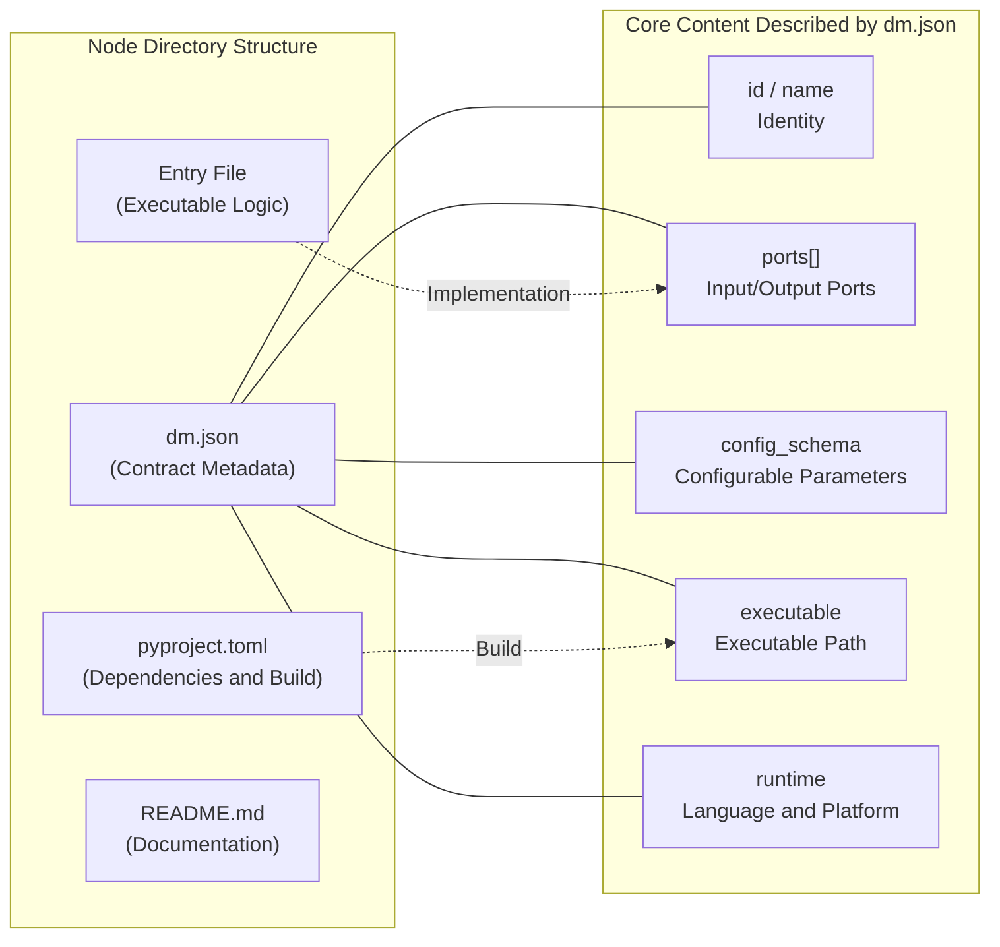
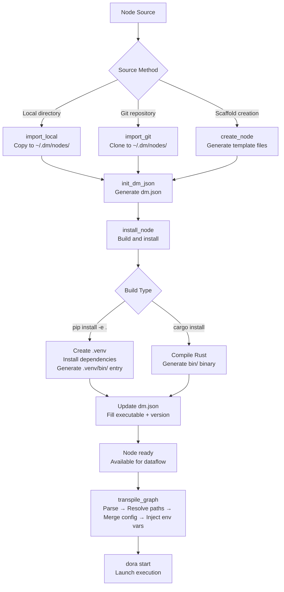

In Dora Manager's architecture, a **Node is the most fundamental executable unit** — it is a processing unit in the dataflow topology that receives input, executes logic, and sends output. All metadata, port declarations, and configuration specifications of each node are fully described by a file called `dm.json`. This file constitutes the **contract** between the node and the runtime system. Understanding the node concept is the foundation for mastering Dora Manager, because building dataflows is essentially the process of selecting nodes, declaring connections, and configuring parameters.

Sources: [model.rs](https://github.com/l1veIn/dora-manager/blob/master/crates/dm-core/src/node/model.rs#L105-L168), [mod.rs](https://github.com/l1veIn/dora-manager/blob/master/crates/dm-core/src/node/mod.rs#L1-L6)

## What is a Node: An Intuitive Analogy

You can think of a node as a **machine with well-defined interfaces**: it has several input pipes (input ports) and several output pipes (output ports), with processing logic inside. Raw materials enter through input pipes, get processed, and flow out through output pipes. `dm.json` is the **spec sheet** for this machine — telling the system what the machine is called, what raw materials it needs, what it produces, how to start it, and what adjustable parameters it has.

In the diagram below, the structure of a typical node is visualized. `dm.json` describes the node's identity, ports, and configuration; the implementation code (`main.py`) of the `dm-and` node reads input events, processes logic, and sends output through the dora-rs SDK.



Sources: [dm.json](https://github.com/l1veIn/dora-manager/blob/master/nodes/dm-and/dm.json#L1-L103), [main.py](https://github.com/l1veIn/dora-manager/blob/master/nodes/dm-and/dm_and/main.py#L1-L94)

## Node Locations in the File System

Dora Manager's nodes are distributed across different locations, following a **priority lookup mechanism**. The system scans node directories in the following order:

| Priority | Directory Path | Description |
|:---:|---|---|
| 1 (highest) | `~/.dm/nodes/&lt;node-id&gt;/` | User-installed nodes, override built-in nodes with the same ID |
| 2 | Repository `nodes/` directory | Built-in nodes distributed with the project |
| 3 | `DM_NODE_DIRS` environment variable | Additional custom node search paths |

Each node occupies an independent directory named after its node ID. The directory must contain a `dm.json` file to be recognized by the system. If a directory lacks a valid `dm.json`, the system generates a minimal **fallback node** for it — with only an ID, no ports, and no executable path.

Sources: [paths.rs](https://github.com/l1veIn/dora-manager/blob/master/crates/dm-core/src/node/paths.rs#L1-L53), [local.rs](https://github.com/l1veIn/dora-manager/blob/master/crates/dm-core/src/node/local.rs#L88-L136), [README.md](https://github.com/l1veIn/dora-manager/blob/master/nodes/README.md#L1-L12)

## Typical Node Directory Structure

Nodes can be implemented in **Python** or **Rust**, with slightly different directory structures. The following examples use the built-in `dm-and` (Python) and `dm-mjpeg` (Rust):

**Python node** (using `dm-and` as an example):

```
nodes/dm-and/
├── dm.json           ← Node contract (core)
├── pyproject.toml    ← Python package definition (dependencies, entry points)
├── README.md         ← Usage instructions
└── dm_and/           ← Python module
    └── main.py       ← Node entry logic
```

**Rust node** (using `dm-mjpeg` as an example):

```
nodes/dm-mjpeg/
├── dm.json           ← Node contract (core)
├── Cargo.toml        ← Rust package definition (dependencies, build)
├── README.md         ← Usage instructions
├── src/
│   └── main.rs       ← Node entry logic
└── bin/              ← Compiled binary files (generated after installation)
    └── dora-dm-mjpeg
```

Sources: [dm.json](https://github.com/l1veIn/dora-manager/blob/master/nodes/dm-and/dm.json#L1-L103), [pyproject.toml](https://github.com/l1veIn/dora-manager/blob/master/nodes/dm-and/pyproject.toml#L1-L17), [Cargo.toml](https://github.com/l1veIn/dora-manager/blob/master/nodes/dm-mjpeg/Cargo.toml#L1-L24)

## Complete dm.json Field Reference

`dm.json` is the **single source of truth** for a node — from serialization/deserialization to HTTP API return values, everything maps directly from this file. The following table lists all fields and their purposes:

| Field | Type | Required | Description |
|---|---|:---:|---|
| `id` | string | ✅ | Unique identifier, must match the directory name (e.g., `"dm-and"`) |
| `name` | string | ✅ | Human-readable display name |
| `version` | string | ✅ | Semantic version number (e.g., `"0.1.0"`) |
| `installed_at` | string | ✅ | Installation timestamp (Unix seconds) |
| `description` | string | — | Short description of node functionality |
| `source` | object | ✅ | Build source info, containing `build` (build command) and optional `github` URL |
| `executable` | string | ✅ | Relative path to the executable file (filled after installation) |
| `display` | object | — | Display metadata: `category` (category path) and `tags` (tag array) |
| `capabilities` | string[] | — | Runtime capability declarations (e.g., `"configurable"`, `"media"`, `"streaming"`) |
| `runtime` | object | — | Runtime info: `language`, `python` (version requirements), `platforms` |
| `ports` | array | — | Port declaration array, defining input/output interfaces |
| `config_schema` | object | — | Configuration parameter specification, each key maps to an environment variable |
| `files` | object | — | File index: `readme`, `entry`, `config`, `tests`, `examples` |
| `maintainers` | array | — | Maintainer list, each item with `name` and optional `email`/`url` |
| `license` | string | — | SPDX license identifier |
| `dynamic_ports` | bool | — | Whether to allow ports not predefined in `ports` to be declared in YAML |
| `path` | string | — | Absolute path filled at runtime (not stored in dm.json) |

Sources: [model.rs](https://github.com/l1veIn/dora-manager/blob/master/crates/dm-core/src/node/model.rs#L111-L168)

### Port Field Details

Ports are the **sole communication channel** between a node and the outside world. Each port declaration includes the following attributes:

```json
{
  "id": "frame",
  "name": "frame",
  "direction": "input",
  "description": "Image frame (raw bytes or encoded)",
  "required": true,
  "multiple": false,
  "schema": { "type": { "name": "int", "bitWidth": 8, "isSigned": false } }
}
```

| Attribute | Description |
|---|---|
| `id` | Unique port identifier, used during dataflow connection |
| `name` | Display name |
| `direction` | `"input"` or `"output"`, determines data flow direction |
| `description` | Textual description of port purpose |
| `required` | Whether this port must be connected |
| `multiple` | Whether it accepts multiple connections (fan-in/fan-out) |
| `schema` | Data type constraint, based on the Arrow type system (see [Port Schema Specification](20-port-schema)) |

For example, the `dm-and` node declares 4 boolean input ports (`a`, `b`, `c`, `d`) and 2 output ports (`ok` returns a boolean result, `details` returns JSON details):

Sources: [model.rs](https://github.com/l1veIn/dora-manager/blob/master/crates/dm-core/src/node/model.rs#L52-L69), [dm.json](https://github.com/l1veIn/dora-manager/blob/master/nodes/dm-and/dm.json#L27-L82), [dm.json](https://github.com/l1veIn/dora-manager/blob/master/nodes/dm-mjpeg/dm.json#L33-L46)

### config_schema Field Details

`config_schema` defines the **configurable parameters** of a node. Each configuration item maps to an environment variable, passed to the node code at runtime via environment variables. This is an elegant decoupling design — dm.json declares "what parameters exist", and node code reads them via "environment variables".

```json
"config_schema": {
  "expected_inputs": {
    "default": "a,b",
    "env": "EXPECTED_INPUTS"
  },
  "require_all_seen": {
    "default": "true",
    "env": "REQUIRE_ALL_SEEN"
  }
}
```

| Attribute | Description |
|---|---|
| `default` | Default value of the parameter |
| `env` | Mapped environment variable name |
| `description` | Parameter purpose description (optional) |
| `x-widget` | UI rendering hint, e.g., `"type": "select"` with an `options` array (optional) |

Sources: [dm.json](https://github.com/l1veIn/dora-manager/blob/master/nodes/dm-and/dm.json#L90-L99), [dm.json](https://github.com/l1veIn/dora-manager/blob/master/nodes/dm-queue/dm.json#L96-L152), [passes.rs](https://github.com/l1veIn/dora-manager/blob/master/crates/dm-core/src/dataflow/transpile/passes.rs#L349-L416)

## Node Lifecycle: From Creation to Execution

The complete node lifecycle can be divided into three phases: **Import/Creation**, **Installation/Build**, and **Runtime Execution**. The following flowchart illustrates this process:



Sources: [import.rs](https://github.com/l1veIn/dora-manager/blob/master/crates/dm-core/src/node/import.rs#L20-L84), [init.rs](https://github.com/l1veIn/dora-manager/blob/master/crates/dm-core/src/node/init.rs#L17-L112), [install.rs](https://github.com/l1veIn/dora-manager/blob/master/crates/dm-core/src/node/install.rs#L11-L75), [mod.rs](https://github.com/l1veIn/dora-manager/blob/master/crates/dm-core/src/dataflow/transpile/mod.rs#L31-L81)

### Phase 1: Import and Creation

**dm.json generation follows a priority inference chain**: the system sequentially checks for an existing `dm.json` (migration), `pyproject.toml` (Python project metadata), and `Cargo.toml` (Rust project metadata), extracting node name, version number, description, author, and other information from them. If both exist, `pyproject.toml` takes precedence. This means you only need to write a standard `pyproject.toml` or `Cargo.toml`, then run `dm node init` to automatically generate the corresponding `dm.json`.

Sources: [init.rs](https://github.com/l1veIn/dora-manager/blob/master/crates/dm-core/src/node/init.rs#L40-L112)

### Phase 2: Installation and Build

The `source.build` field in `dm.json` determines the installation strategy:

| Build command | Behavior | Generated executable path |
|---|---|---|
| `pip install -e .` | Creates `.venv` under the node directory, installs in editable mode | `.venv/bin/&lt;node-id&gt;` |
| `pip install <package>` | Creates `.venv`, installs specified package from PyPI | `.venv/bin/&lt;node-id&gt;` |
| `cargo install --path .` | Locally compiles Rust project | `bin/dora-&lt;node-id&gt;` |

After installation, the system writes back to `dm.json`, filling in `executable` (relative path to executable), `version` (actual version number), and `installed_at` (installation timestamp). **Nodes that are not installed cannot be used in dataflows** — the transpiler will report a `MissingExecutable` diagnostic error.

Sources: [install.rs](https://github.com/l1veIn/dora-manager/blob/master/crates/dm-core/src/node/install.rs#L11-L75), [error.rs](https://github.com/l1veIn/dora-manager/blob/master/crates/dm-core/src/dataflow/transpile/error.rs#L16-L31)

### Phase 3: Runtime — From dm.json to dora YAML

When a user starts a dataflow, the transpiler executes a multi-stage pipeline, converting DM-style YAML into standard dora-rs executable YAML:

| Pass | Name | Relationship with dm.json |
|:---:|---|---|
| 1 | **parse** | Identifies the `node:` field in YAML, classifies as Managed node |
| 2 | **resolve_paths** | Reads `dm.json`, resolves `node: dm-and` to absolute path `/path/to/dm-and/.venv/bin/dm-and` |
| 3 | **validate_port_schemas** | Reads both nodes' `dm.json` port declarations, validates type compatibility |
| 4 | **merge_config** | Reads `config_schema`, merges config values by four-layer priority and injects into `env:` |
| 5 | **inject_runtime_env** | Injects `DM_RUN_ID`, `DM_NODE_ID`, `DM_SERVER_URL`, and other general environment variables |
| 6 | **emit** | Outputs standard dora YAML, with `node:` replaced by `path:` |

**Four-layer priority for configuration merging** (higher priority overrides lower):

1. **YAML inline config** (values declared directly in the `config:` block) — highest priority
2. **Node persistent config** (values in the `config.json` file)
3. **dm.json schema default values** (the `default` field in `config_schema`)
4. Environment variable names specified by the `config_schema.&lt;key&gt;.env` field

Sources: [passes.rs](https://github.com/l1veIn/dora-manager/blob/master/crates/dm-core/src/dataflow/transpile/passes.rs#L1-L510), [mod.rs](https://github.com/l1veIn/dora-manager/blob/master/crates/dm-core/src/dataflow/transpile/mod.rs#L1-L82)

## Referencing Nodes in Dataflows

In DM-style YAML dataflows, nodes are referenced via the `node:` field rather than directly specifying `path:`. Below is a complete interactive dataflow example:

```yaml
nodes:
  - id: prompt          # Instance ID within the dataflow
    node: dm-text-input # References node ID from dm.json
    outputs:
      - value
    config:             # Inline config, overrides config_schema defaults
      label: "Prompt"
      placeholder: "Type something..."
      multiline: true

  - id: echo
    node: dora-echo     # External node (also managed via dm.json)
    inputs:
      value: prompt/value  # Connect to the value output of prompt node
    outputs:
      - value

  - id: display
    node: dm-display
    inputs:
      data: echo/value
    config:
      label: "Echo Output"
      render: text
```

After transpilation, `node: dm-text-input` is replaced with `path: /absolute/path/to/.venv/bin/dm-text-input`, and all `config` items are converted to `env:` environment variables.

Sources: [interaction-demo.yml](https://github.com/l1veIn/dora-manager/blob/master/tests/dataflows/interaction-demo.yml#L1-L25), [passes.rs](https://github.com/l1veIn/dora-manager/blob/master/crates/dm-core/src/dataflow/transpile/passes.rs#L15-L95)

## Two Categories of Nodes: Built-in and Community

By examining the `nodes/` directory and the `display.category` field in `dm.json`, built-in nodes can be categorized as follows:

| Category | Example Nodes | Function Summary |
|---|---|---|
| **Logic** | `dm-and`, `dm-gate` | Boolean logic operations and conditional gating |
| **Interaction** | `dm-button`, `dm-slider`, `dm-text-input`, `dm-display`, `dm-input-switch` | UI interaction controls: buttons, sliders, text input, display panels, switches |
| **Media** | `dm-mjpeg`, `dm-recorder`, `dm-stream-publish` | Video stream preview, recording, streaming |
| **Flow Control** | `dm-queue` | FIFO buffering and flow control |
| **AI Inference** | `dora-qwen`, `dora-distil-whisper`, `dora-kokoro-tts`, `dora-vad` | LLM, speech recognition, TTS, voice activity detection |
| **Tools** | `dm-log`, `dm-save`, `dm-downloader`, `dm-check-ffmpeg` | Logging, storage, downloading, environment detection |

Sources: [dm.json](https://github.com/l1veIn/dora-manager/blob/master/nodes/dm-and/dm.json#L17-L20), [dm.json](https://github.com/l1veIn/dora-manager/blob/master/nodes/dm-button/dm.json#L17-L23), [dm.json](https://github.com/l1veIn/dora-manager/blob/master/nodes/dm-mjpeg/dm.json#L18-L24), [dm.json](https://github.com/l1veIn/dora-manager/blob/master/nodes/dm-queue/dm.json#L17-L24)

## Core Patterns of Node Implementation

Regardless of whether Python or Rust is used, node implementation follows the **event loop pattern** provided by the dora-rs SDK: create a Node instance → iterate over the event stream → handle INPUT events → call `send_output` to send results.

Using `dm-and` as an example (Python):

```python
from dora import Node
import pyarrow as pa

node = Node()
for event in node:
    if event["type"] == "INPUT":
        input_id = event["id"]
        value = event["value"]
        # Processing logic...
        node.send_output("ok", pa.array([result]))
```

Key implementation points:
- **Environment variable-driven configuration**: Nodes read configuration via `os.getenv("EXPECTED_INPUTS")` etc., with these environment variables injected by the transpiler from `config_schema`
- **DM runtime variables**: The system automatically injects `DM_RUN_ID` (run ID), `DM_NODE_ID` (instance ID), `DM_SERVER_URL` (service address), and other environment variables
- **PyArrow data transfer**: Input and output data is passed between nodes in PyArrow array format

Sources: [main.py](https://github.com/l1veIn/dora-manager/blob/master/nodes/dm-and/dm_and/main.py#L1-L94), [passes.rs](https://github.com/l1veIn/dora-manager/blob/master/crates/dm-core/src/dataflow/transpile/passes.rs#L422-L449)

## Further Reading

After understanding the basic node concepts, consider exploring the following topics:

- **[Dataflow (Dataflow): YAML Topology and Node Connections](05-dataflow-concept.md)** — Learn how multiple nodes compose a complete data processing topology in YAML
- **[Built-in Nodes Overview: From Media Capture to AI Inference](19-builtin-nodes)** — Deep dive into the specific functionality and usage of each built-in node
- **[Port Schema Specification: Arrow Type System-Based Port Validation](20-port-schema)** — Understand how the port type system ensures safe data transfer between nodes
- **[Dataflow Transpiler: Multi-Pass Pipeline and Four-Layer Config Merge](08-transpiler.md)** — Deep dive into the implementation details of the transpilation pipeline
- **[Developing Custom Nodes: dm.json Complete Field Reference](22-custom-node-guide)** — A complete reference manual when you need to create your own nodes