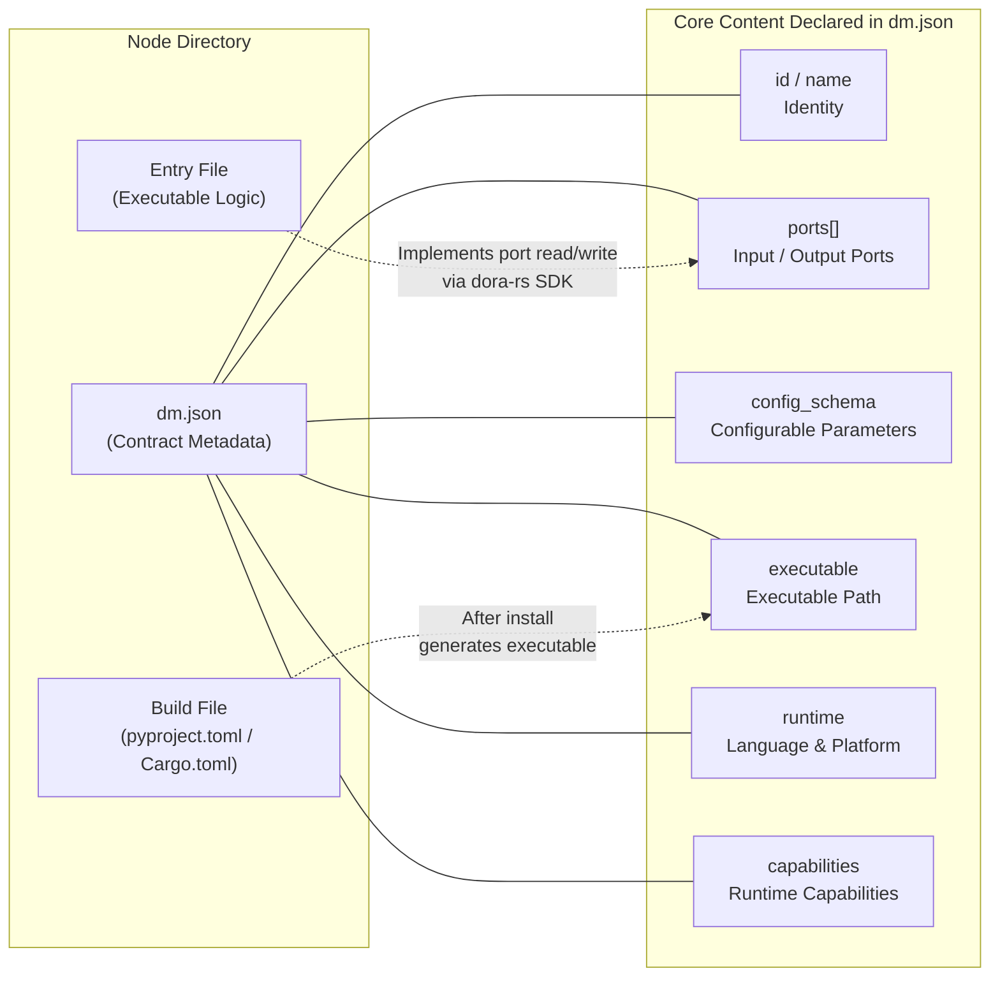
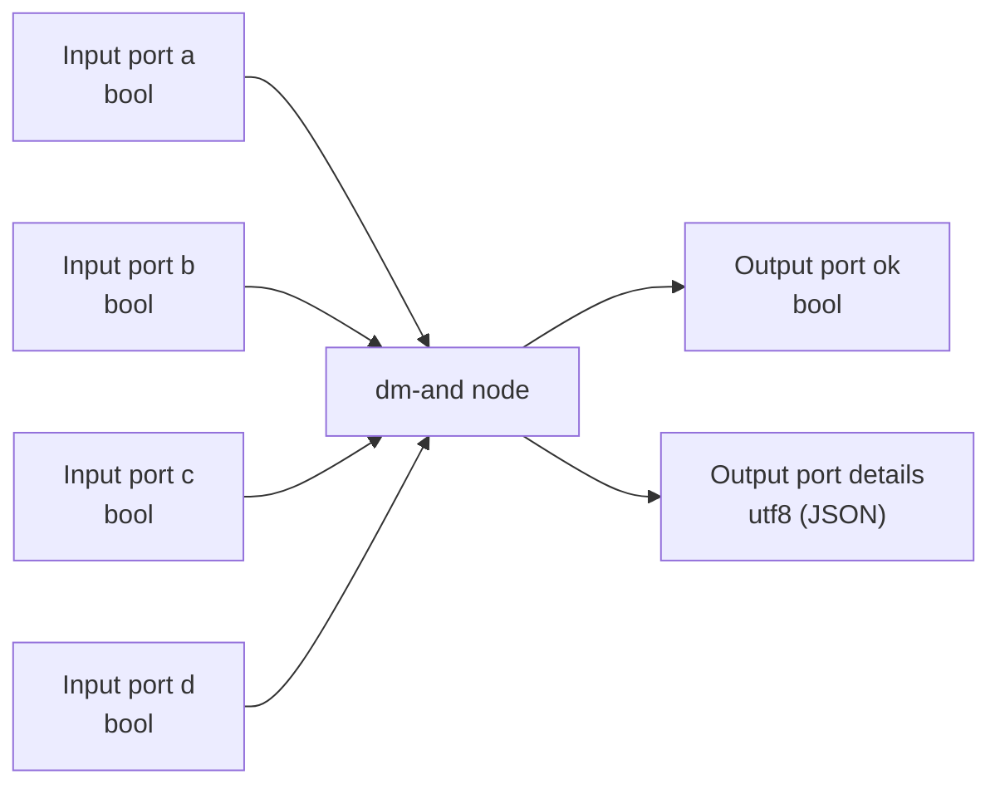
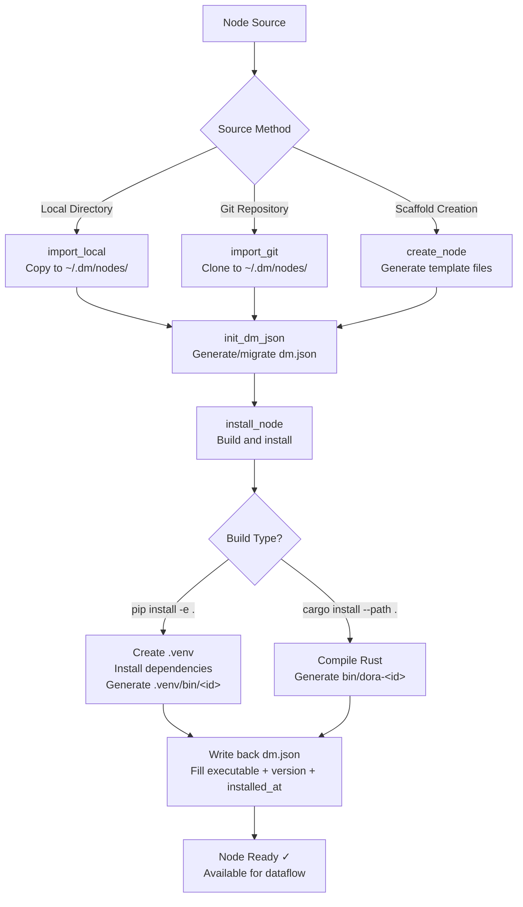

In the Dora Manager architecture, **Node is the most fundamental executable unit** -- it is a processing unit in the dataflow topology that receives input, executes logic, and sends output. All metadata, port declarations, and configuration specifications for each node are fully described by a single JSON file called **`dm.json`**, which serves as the **contract** between the node and the system. Regardless of whether a node is written in Python, Rust, or any other language, as long as it has a valid `dm.json`, it can be discovered, installed, verified, and scheduled by Dora Manager.

Sources: [model.rs](https://github.com/l1veIn/dora-manager/blob/main/crates/dm-core/src/node/model.rs#L222-L288), [mod.rs](https://github.com/l1veIn/dora-manager/blob/main/crates/dm-core/src/node/mod.rs#L1-L6)

## An Intuitive Analogy: A Machine with a Manual

You can think of a node as a **machine with well-defined interfaces** in a factory: it has several input pipes (input ports) and several output pipes (output ports), with a set of processing logic inside. Raw materials enter through the input pipes, are processed, and flow out through the output pipes. `dm.json` is the **manual** for this machine -- it does not contain the internal workings of the machine (that is the code's job), but it precisely describes the machine's model, interface specifications, adjustable parameters, and runtime environment requirements.

The following concept diagram shows how `dm.json` organizes the various aspects of a node:



Sources: [dm.json](https://github.com/l1veIn/dora-manager/blob/main/nodes/dm-and/dm.json#L1-L102), [main.py](https://github.com/l1veIn/dora-manager/blob/main/nodes/dm-and/dm_and/main.py#L1-L94)

## Node Locations on the File System

Dora Manager's nodes are distributed across different locations, following a **priority-based lookup mechanism**. When loading nodes, the system scans directories in the following order:

| Priority | Directory Path | Description |
|:---:|---|---|
| 1 (Highest) | `~/.dm/nodes/<node-id>/` | User-installed nodes; overrides built-in nodes when names conflict |
| 2 | Repository root `nodes/` | Built-in nodes distributed with the project |
| 3 | Paths specified by `DM_NODE_DIRS` environment variable | Additional developer-defined node search paths |

Each node occupies a separate directory named after its node ID. The directory **must contain a `dm.json` file** to be recognized by the system. If a directory lacks a valid `dm.json`, the system generates a minimal **fallback node** for it -- with only an ID, no port declarations, and no executable path. During scanning, the same ID is only recognized once (first found takes priority), and nodes are ultimately returned sorted alphabetically by ID.

Sources: [paths.rs](https://github.com/l1veIn/dora-manager/blob/main/crates/dm-core/src/node/paths.rs#L11-L23), [local.rs](https://github.com/l1veIn/dora-manager/blob/main/crates/dm-core/src/node/local.rs#L88-L136)

## Typical Node Directory Structure

Nodes can be implemented in **Python** or **Rust**, with slightly different directory structures. The following shows the complete structure using the built-in `dm-and` (Python) and `dm-mjpeg` (Rust) as examples.

**Python node** (using `dm-and` as an example):

```
nodes/dm-and/
├── dm.json            ← Node contract (core)
├── pyproject.toml     ← Python package definition (dependencies, entry points)
├── README.md          ← Usage documentation
└── dm_and/            ← Python module (directory name = node ID with - replaced by _)
    └── main.py        ← Node entry logic
```

**Rust node** (using `dm-mjpeg` as an example):

```
nodes/dm-mjpeg/
├── dm.json            ← Node contract (core)
├── Cargo.toml         ← Rust package definition (dependencies, build config)
├── README.md          ← Usage documentation
├── src/
│   ├── main.rs        ← Node entry logic
│   └── lib.rs         ← Shared library code
└── bin/               ← Compiled binaries (generated after install)
    └── dora-dm-mjpeg
```

The commonality between the two is: **`dm.json` is always the entry point for the node directory**. `pyproject.toml` or `Cargo.toml` is responsible for defining dependencies and build methods, while `dm.json` adds Dora Manager-specific metadata such as port declarations, configuration specifications, and category tags on top of that.

Sources: [dm.json](https://github.com/l1veIn/dora-manager/blob/main/nodes/dm-and/dm.json#L1-L102), [pyproject.toml](https://github.com/l1veIn/dora-manager/blob/main/nodes/dm-and/pyproject.toml#L1-L17), [dm.json](https://github.com/l1veIn/dora-manager/blob/main/nodes/dm-mjpeg/dm.json#L1-L101), [Cargo.toml](https://github.com/l1veIn/dora-manager/blob/main/nodes/dm-mjpeg/Cargo.toml#L1-L24)

## Complete dm.json Field Reference

`dm.json` is the **single source of truth** for a node -- from serialization/deserialization to HTTP API return values, everything maps directly from this file. The following table lists all fields grouped by functionality:

### Identity and Source

| Field | Type | Required | Description |
|---|---|:---:|---|
| `id` | string | ✅ | Unique identifier; must match the directory name (e.g., `"dm-and"`) |
| `name` | string | — | Human-readable display name (defaults to `id`) |
| `version` | string | ✅ | Semantic version number (e.g., `"0.1.0"`) |
| `installed_at` | string | ✅ | Installation timestamp (Unix seconds string) |
| `description` | string | — | Brief description of the node's functionality |
| `source` | object | ✅ | Build source, containing `build` (build command such as `"pip install -e ."`) and optional `github` URL |
| `executable` | string | ✅ | Relative path to the executable file after installation (empty string before installation) |
| `maintainers` | array | — | List of maintainers; each entry has `name`, with optional `email` / `url` |
| `license` | string | — | SPDX license identifier (e.g., `"MIT"`, `"Apache-2.0"`) |

### Display and Classification

| Field | Type | Required | Description |
|---|---|:---:|---|
| `display.category` | string | — | Category path (e.g., `"Builtin/Logic"`, `"AI/Vision"`) |
| `display.tags` | string[] | — | Tag array for search and filtering |

### Runtime and Capabilities

| Field | Type | Required | Description |
|---|---|:---:|---|
| `runtime.language` | string | — | Implementation language (`"python"` / `"rust"` / `"node"`) |
| `runtime.python` | string | — | Python version requirement (e.g., `">=3.10"`) |
| `runtime.platforms` | string[] | — | List of supported platforms (empty = all platforms) |
| `capabilities` | array | — | Runtime capability declarations (see details below) |
| `dynamic_ports` | bool | — | Whether to allow declaring ports in YAML that are not pre-defined in `ports` |

### Interface and Configuration

| Field | Type | Required | Description |
|---|---|:---:|---|
| `ports` | array | — | Port declaration array defining input/output interfaces |
| `config_schema` | object | — | Configuration parameter specification; each key maps to an environment variable |
| `files` | object | — | File index: `readme`, `entry`, `config`, `tests`, `examples` |
| `path` | string | — | Absolute path auto-populated at runtime (**not stored in dm.json**) |

Using the `dm.json` of `dora-yolo` (an AI vision inference node) as an example, you can see how these fields work together: it declares the `"AI/Vision"` category, `"python"` runtime, an `image` input port and a `bbox` output port, and configuration items such as `model` / `confidence`.

Sources: [model.rs](https://github.com/l1veIn/dora-manager/blob/main/crates/dm-core/src/node/model.rs#L222-L288), [dm.json](https://github.com/l1veIn/dora-manager/blob/main/nodes/dora-yolo/dm.json#L1-L83)

## Ports: Node Communication Interfaces

Ports are the **sole channel** for a node to communicate with the outside world. Each port declaration contains the following attributes:

```json
{
  "id": "frame",
  "name": "frame",
  "direction": "input",
  "description": "Image frame (raw bytes or encoded)",
  "required": true,
  "multiple": false,
  "schema": { "type": { "name": "int", "bitWidth": 8, "isSigned": false } }
}
```

| Attribute | Type | Description |
|---|---|---|
| `id` | string | Unique port identifier; used for dataflow connections |
| `name` | string | Display name (can differ from `id`) |
| `direction` | string | `"input"` or `"output"`, determining data flow direction |
| `description` | string | Text description of the port's purpose |
| `required` | bool | Whether this port **must** be connected (default `true`) |
| `multiple` | bool | Whether it accepts multiple connections (fan-in/fan-out) |
| `schema` | object | Data type constraint based on the Arrow type system |

Using the `dm-and` node as an example, it declares **4 boolean input ports** (`a`, `b`, `c`, `d`) and **2 output ports** (`ok` returning the boolean AND result, and `details` returning detailed information in JSON format):



The port `schema` type system is based on the **Apache Arrow** format, supporting multiple types such as `bool`, `utf8`, `int`, `float64`, and `binary`. The transpiler checks data type compatibility between ports on both ends of a connection during the validation phase -- if the output port type of the source node does not match the input port type of the target node, the system issues an `IncompatiblePortSchema` diagnostic warning. For the complete type system specification, please refer to [Port Schema and Port Type Validation](8-port-schema-yu-duan-kou-lei-xing-xiao-yan).

Sources: [model.rs](https://github.com/l1veIn/dora-manager/blob/main/crates/dm-core/src/node/model.rs#L156-L181), [dm.json](https://github.com/l1veIn/dora-manager/blob/main/nodes/dm-and/dm.json#L27-L82), [schema/model.rs](https://github.com/l1veIn/dora-manager/blob/main/crates/dm-core/src/node/schema/model.rs#L62-L107)

## Config Schema: Parameterizing Your Node

`config_schema` defines the **configurable parameters** of a node. Each configuration item maps to an **environment variable**, which is passed to the node code at runtime through environment variables. This is an elegant decoupling design -- `dm.json` declares "what parameters exist," and the node code reads values by "reading environment variables."

The following example is from the configuration declaration of the `dm-mjpeg` node:

```json
"config_schema": {
  "port": {
    "default": 4567,
    "env": "PORT"
  },
  "input_format": {
    "default": "jpeg",
    "env": "INPUT_FORMAT",
    "x-widget": {
      "type": "select",
      "options": ["jpeg", "rgb8", "rgba8", "yuv420p"]
    }
  },
  "max_fps": {
    "default": 30,
    "env": "MAX_FPS"
  }
}
```

| Attribute | Description |
|---|---|
| `default` | Default value for the parameter (used when no configuration at any level provides a value) |
| `env` | Mapped environment variable name (**required** -- config items without `env` are ignored) |
| `description` | Description of the parameter's purpose (optional) |
| `x-widget` | UI rendering hint, such as `"type": "select"` with an `options` array (optional) |

**Four-layer priority for configuration values** (higher priority overrides lower priority):

1. **YAML inline config** (values declared directly in the `config:` block) -- highest priority
2. **Node persisted config** (values in the `config.json` file)
3. **dm.json schema defaults** (the `default` field in `config_schema`)
4. Environment variable names are specified by the `config_schema.<key>.env` field

After merging configurations, the transpiler writes the final values into the `env:` block of the output YAML, for the dora-rs runtime to inject into the node process's environment variables.

Sources: [dm.json](https://github.com/l1veIn/dora-manager/blob/main/nodes/dm-mjpeg/dm.json#L54-L100), [passes.rs](https://github.com/l1veIn/dora-manager/blob/main/crates/dm-core/src/dataflow/transpile/passes.rs#L355-L421)

## Capabilities: Node Runtime Capabilities

The `capabilities` field declares the special capabilities a node possesses at runtime. It supports two forms:

**Simple tag form** -- declaring only the capability name:

```json
"capabilities": ["configurable", "media"]
```

**Structured detail form** -- carrying role-binding details:

```json
"capabilities": [
  "configurable",
  {
    "name": "widget_input",
    "bindings": [
      {
        "role": "widget",
        "channel": "register",
        "media": ["widgets"],
        "lifecycle": ["run_scoped", "stop_aware"],
        "description": "Registers a button widget with the DM interaction plane."
      },
      {
        "role": "widget",
        "port": "click",
        "channel": "input",
        "media": ["pulse"],
        "lifecycle": ["run_scoped", "stop_aware"]
      }
    ]
  }
]
```

Common simple capability tags include:

| Tag | Meaning |
|---|---|
| `configurable` | The node accepts configuration parameters (has `config_schema`) |
| `media` | The node processes media data (audio/video streams) |

Structured capabilities (such as `widget_input`, `display`) are used to declare the node's binding relationship with the interaction system. The transpiler recognizes these capabilities and automatically injects a hidden **Bridge node** in the dataflow, routing control events from the web frontend to the node's input ports. For a detailed explanation of this mechanism, please refer to [Interaction System Architecture: dm-input / dm-message / Bridge Node Injection](22-jiao-hu-xi-tong-jia-gou-dm-input-dm-message-bridge-jie-dian-zhu-ru-yuan-li).

Sources: [model.rs](https://github.com/l1veIn/dora-manager/blob/main/crates/dm-core/src/node/model.rs#L71-L116), [dm.json](https://github.com/l1veIn/dora-manager/blob/main/nodes/dm-button/dm.json#L25-L57)

## Node Registry (registry.json)

In addition to `~/.dm/nodes/` and the repository's built-in `nodes/` directory, Dora Manager also maintains a compile-time embedded **node registry** called `registry.json`. The registry provides a centralized node discovery mechanism, recording the source information of all known nodes:

```json
{
  "dm-and": {
    "source": { "type": "local", "path": "nodes/dm-and" },
    "category": "Builtin/Logic",
    "tags": ["logic", "bool", "and"]
  },
  "dm-mjpeg": {
    "source": { "type": "local", "path": "nodes/dm-mjpeg" },
    "category": "Builtin/Media",
    "tags": ["builtin", "rust", "video"]
  }
}
```

The registry supports two source types: `local` (local path, relative to the repository root) and `git` (remote Git repository URL). When the transpiler encounters an uninstalled node ID, it consults the registry to determine the node's source, thereby supporting automatic installation workflows.

Sources: [hub.rs](https://github.com/l1veIn/dora-manager/blob/main/crates/dm-core/src/node/hub.rs#L1-L73), [registry.json](https://github.com/l1veIn/dora-manager/blob/main/registry.json)

## Node Lifecycle: From Creation to Execution

The complete lifecycle of a node is divided into three phases: **Import/Creation** → **Installation/Build** → **Runtime Execution**. The following flowchart illustrates this process:



### Phase 1: Import and Creation

**dm.json generation follows a priority inference chain**: the system checks in order for an existing `dm.json` (migration mode), `pyproject.toml` (Python project metadata), and `Cargo.toml` (Rust project metadata), extracting information such as node name, version number, description, and author. If both exist, `pyproject.toml` takes priority over `Cargo.toml`. Nodes created through the `create_node` scaffold automatically generate `pyproject.toml`, `main.py` templates, and `README.md`.

Sources: [init.rs](https://github.com/l1veIn/dora-manager/blob/main/crates/dm-core/src/node/init.rs#L21-L114), [local.rs](https://github.com/l1veIn/dora-manager/blob/main/crates/dm-core/src/node/local.rs#L13-L86)

### Phase 2: Installation and Build

The `source.build` field in `dm.json` determines the installation strategy:

| Build Command | Behavior | Generated Executable Path |
|---|---|---|
| `pip install -e .` | Creates a `.venv` in the node directory and installs in editable mode | `.venv/bin/<node-id>` |
| `pip install <package>` | Creates a `.venv` and installs the specified package from PyPI | `.venv/bin/<node-id>` |
| `cargo install --path .` | Compiles the Rust project locally | `bin/dora-<node-id>` |

The installation process prefers `uv` (if available on the system) over `pip` for faster installation speeds. After installation, the system writes back to `dm.json`, filling in `executable` (relative path to the executable file), `version` (actual version number), and `installed_at` (installation timestamp). **Uninstalled nodes (with `executable` as an empty string) cannot be used in dataflows** -- the transpiler will issue a `MissingExecutable` diagnostic error.

Sources: [install.rs](https://github.com/l1veIn/dora-manager/blob/main/crates/dm-core/src/node/install.rs#L11-L75)

### Phase 3: Runtime -- From dm.json to dora YAML

When a user starts a dataflow, the transpiler executes a multi-stage pipeline to convert DM-style YAML into standard dora-rs executable YAML. In this pipeline, `dm.json` plays a key role at multiple stages:

| Pass | Name | Relationship with dm.json |
|:---:|---|---|
| 1 | **parse** | Identifies `node:` fields in YAML and classifies nodes as Managed nodes |
| 2 | **resolve_paths** | Reads `dm.json` and resolves `node: dm-and` to an absolute path (e.g., `/path/to/.venv/bin/dm-and`) |
| 3 | **validate_port_schemas** | Reads port declarations from both endpoints' `dm.json` files and validates Arrow type compatibility |
| 4 | **merge_config** | Reads `config_schema`, merges configuration values by four-layer priority, and injects into `env:` |
| 5 | **inject_runtime_env** | Injects common environment variables such as `DM_RUN_ID`, `DM_NODE_ID`, `DM_RUN_OUT_DIR` |
| 6 | **inject_dm_bridge** | Identifies structured capabilities and injects hidden Bridge nodes for interactive nodes |
| 7 | **emit** | Outputs standard dora YAML with all `node:` replaced by `path:` |

After transpilation is complete, the standard YAML is passed to the dora-rs coordinator (dora-coordinator), which is responsible for launching each node process.

Sources: [mod.rs](https://github.com/l1veIn/dora-manager/blob/main/crates/dm-core/src/dataflow/transpile/mod.rs#L1-L84), [passes.rs](https://github.com/l1veIn/dora-manager/blob/main/crates/dm-core/src/dataflow/transpile/passes.rs#L1-L100)

## Referencing Nodes in a Dataflow

In DM-style YAML dataflows, nodes are referenced via the `node:` field (rather than dora-rs's native `path:` absolute paths). The following is an interactive dataflow example:

```yaml
nodes:
  - id: prompt              # Instance ID within the dataflow (customizable)
    node: dm-text-input     # References the node ID in dm.json
    outputs:
      - value
    config:                 # Inline config, overrides config_schema defaults
      label: "Prompt"
      placeholder: "Type something..."

  - id: echo
    node: dora-echo
    inputs:
      value: prompt/value   # Connects to the value output port of the prompt instance
    outputs:
      - value

  - id: message
    node: dm-message
    inputs:
      message: echo/value
```

After transpilation, `node: dm-text-input` is replaced with `path: /absolute/path/to/.venv/bin/dm-text-input`, and all `config` items are converted to `env:` environment variables. For a detailed explanation of this transpilation process, please refer to [Dataflow Transpiler: Multi-Pass Pipeline and Four-Layer Config Merging](11-shu-ju-liu-zhuan-yi-qi-transpiler-duo-pass-guan-xian-yu-si-ceng-pei-zhi-he-bing).

Sources: [passes.rs](https://github.com/l1veIn/dora-manager/blob/main/crates/dm-core/src/dataflow/transpile/passes.rs#L15-L101)

## Two Major Categories of Nodes: Built-in and Community

By observing the `nodes/` directory and the `display.category` field in `dm.json`, the built-in nodes can be categorized as follows:

| Category | Example Nodes | Overview |
|---|---|---|
| **Logic** | `dm-and`, `dm-gate` | Boolean logic operations and conditional gating |
| **Interaction** | `dm-button`, `dm-slider`, `dm-text-input`, `dm-message`, `dm-input-switch` | UI interaction controls: buttons, sliders, text inputs, display panels, switches |
| **Media** | `dm-mjpeg`, `dm-screen-capture` | Video stream preview, screen capture |
| **Flow Control** | `dm-queue` | FIFO buffering and flow control |
| **AI Inference** | `dora-qwen`, `dora-distil-whisper`, `dora-kokoro-tts`, `dora-vad` | LLM, speech recognition, TTS, voice activity detection |
| **Vision** | `dora-yolo`, `opencv-plot`, `opencv-video-capture` | Object detection, image visualization, camera capture |
| **Utilities** | `dm-log`, `dm-save`, `dm-downloader`, `dm-check-ffmpeg` | Logging, storage, downloading, environment checking |

Nodes in each category follow the same `dm.json` contract specification but have different port configurations and capability declarations. For detailed functionality of each node, please refer to [Built-in Nodes Overview: From Media Capture to AI Inference](7-nei-zhi-jie-dian-zong-lan-cong-mei-ti-cai-ji-dao-ai-tui-li).

Sources: [registry.json](https://github.com/l1veIn/dora-manager/blob/main/registry.json), [dm.json](https://github.com/l1veIn/dora-manager/blob/main/nodes/dm-and/dm.json#L18-L19), [dm.json](https://github.com/l1veIn/dora-manager/blob/main/nodes/dm-button/dm.json#L18-L23)

## Core Implementation Patterns

Whether using Python or Rust, node implementations follow the **event loop pattern** provided by the dora-rs SDK: create a Node instance → iterate through the event stream → handle INPUT events → call `send_output` to send results.

### Python Node Pattern (using dm-and as an example)

```python
from dora import Node
import pyarrow as pa

node = Node()
for event in node:
    if event["type"] == "INPUT":
        input_id = event["id"]        # Corresponds to the port id in dm.json
        value = event["value"]         # Data in PyArrow format
        # ... business logic ...
        node.send_output("ok", pa.array([result]))  # Output to "ok" port
```

### Rust Node Pattern (using dm-mjpeg as an example)

```rust
use dora_node_api::{DoraNode, Event};

let (_node, mut events) = DoraNode::init_from_env()?;
while let Some(event) = events.recv() {
    match event {
        Event::Input { id, data, .. } if id.as_str() == "frame" => {
            // Process input data from the "frame" port
            let bytes = arrow_to_bytes(&data)?;
            // ... business logic ...
        }
        Event::Stop(_) => break,
        _ => {}
    }
}
```

**Key implementation points**:

- **Environment variable-driven configuration**: Nodes read configuration via methods such as `os.getenv("EXPECTED_INPUTS")`; these environment variables are injected by the transpiler after four-layer merging from `config_schema`
- **DM runtime variables**: The system automatically injects environment variables such as `DM_RUN_ID` (run ID), `DM_NODE_ID` (instance ID in YAML), and `DM_RUN_OUT_DIR` (run output directory)
- **PyArrow / Arrow data transfer**: Input/output data is passed between nodes in Arrow array format, supporting zero-copy shared memory

Sources: [main.py](https://github.com/l1veIn/dora-manager/blob/main/nodes/dm-and/dm_and/main.py#L1-L94), [main.rs](https://github.com/l1veIn/dora-manager/blob/main/nodes/dm-mjpeg/src/main.rs#L1-L63), [passes.rs](https://github.com/l1veIn/dora-manager/blob/main/crates/dm-core/src/dataflow/transpile/passes.rs#L428-L451)

## Next Steps

After understanding the basic concepts of nodes, it is recommended to continue exploring the following topics:

- **[Dataflow: YAML Topology Definition and Node Connections](5-shu-ju-liu-dataflow-yaml-tuo-bu-ding-yi-yu-jie-dian-lian-jie)** -- Learn how multiple nodes form a complete data processing topology in YAML
- **[Run Instance: Lifecycle State Machine and Metrics Tracking](6-yun-xing-shi-li-run-sheng-ming-zhou-qi-zhuang-tai-ji-yu-zhi-biao-zhui-zong)** -- Understand how nodes become managed run instances after being started
- **[Built-in Nodes Overview: From Media Capture to AI Inference](7-nei-zhi-jie-dian-zong-lan-cong-mei-ti-cai-ji-dao-ai-tui-li)** -- Deep dive into the specific functionality and usage of each built-in node
- **[Port Schema and Port Type Validation](8-port-schema-yu-duan-kou-lei-xing-xiao-yan)** -- Understand how the port type system ensures safe data transfer between nodes
- **[Custom Node Development Guide: Complete dm.json Field Reference](9-zi-ding-yi-jie-dian-kai-fa-zhi-nan-dm-json-wan-zheng-zi-duan-can-kao)** -- A complete reference manual when you need to create your own nodes
