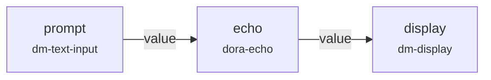
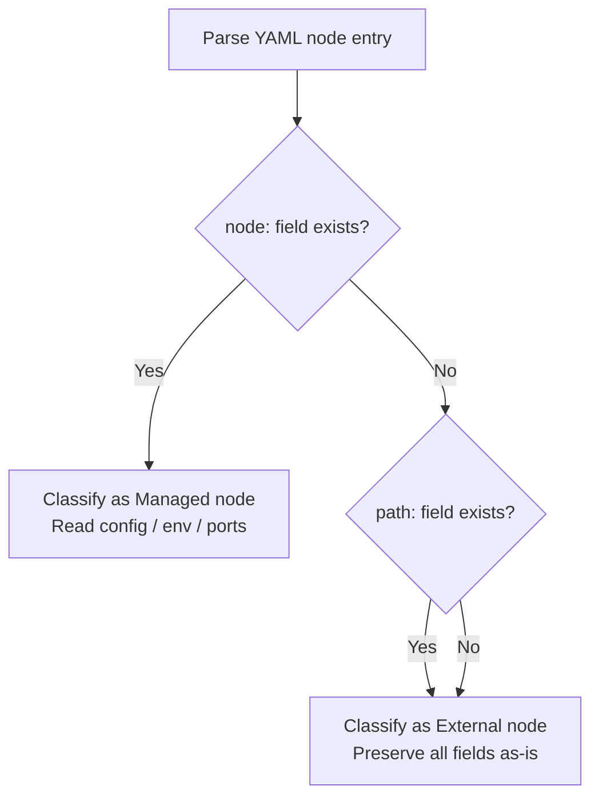
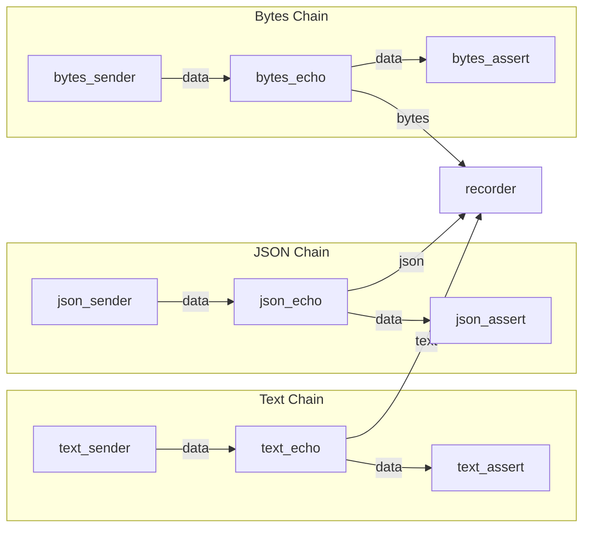
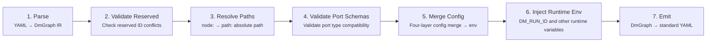
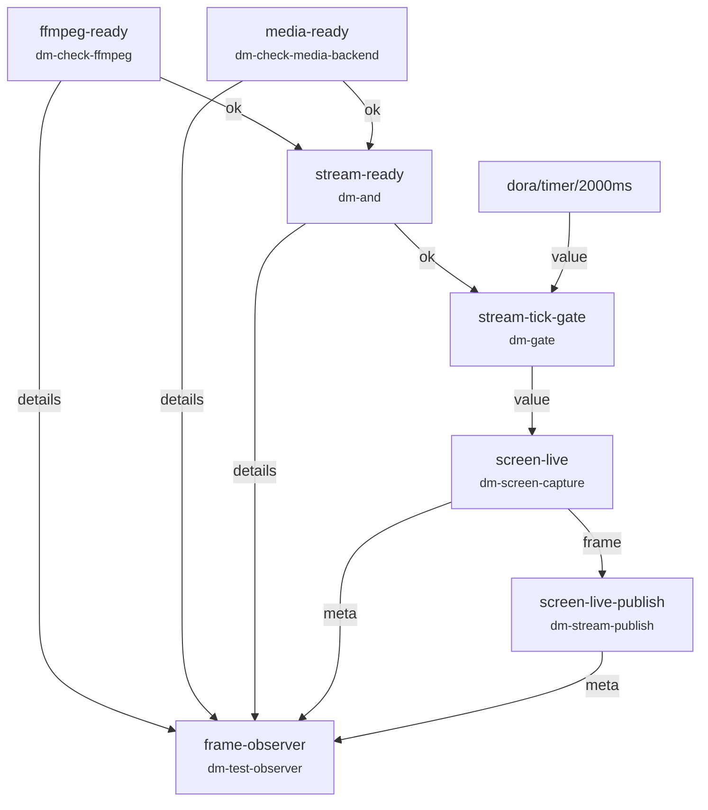

Dataflow is the most core abstraction in Dora Manager — a YAML file defines a **directed data graph** where nodes are computational units on the graph and edges are data transmission channels between nodes. This article walks you through understanding YAML topology syntax rules, connection methods between nodes, and how dataflows are stored and managed in the system. If you haven't read [Node (Node): dm.json Contract and Executable Unit](04-node-concept.md), it is recommended to understand the node concept first before continuing.

Sources: [interaction-demo.yml](https://github.com/l1veIn/dora-manager/blob/master/tests/dataflows/interaction-demo.yml#L1-L25), [model.rs](https://github.com/l1veIn/dora-manager/blob/master/crates/dm-core/src/dataflow/model.rs#L1-L168)

## What is a Dataflow: A Directed Data Graph

A dataflow is essentially a **Directed Acyclic Graph (DAG)**, declared in YAML format. Each dataflow file describes which nodes participate in computation, how nodes connect through ports, and the configuration parameters each node needs at runtime. When a dataflow is started (i.e., a "run instance" is created), data flows along the defined connection paths in the graph, from upstream node output ports to downstream node input ports.

The Mermaid diagram below shows the topology of a minimal dataflow — the connection relationship of three nodes in `interaction-demo.yml`. User input generated by `dm-text-input` is passed to `dora-echo` via the `value` port, then to `dm-display` for display:



Sources: [interaction-demo.yml](https://github.com/l1veIn/dora-manager/blob/master/tests/dataflows/interaction-demo.yml#L1-L25)

## YAML File Structure

The top-level structure of a dataflow YAML file is very simple — just a `nodes` list, plus possible other dora-rs top-level fields (like `communication`, `deploy`, etc.). The core skeleton is as follows:

```yaml
nodes:
  - id: <yaml_id>
    node: <node_id>         # Managed node (recommended)
    # or
    path: /path/to/binary   # External node (directly specify executable path)

    inputs:                  # Optional: define input connections
      <port_name>: <source>

    outputs:                 # Optional: declare output ports
      - <port_name>

    config:                  # Optional: inline configuration parameters
      &lt;key&gt;: &lt;value&gt;

    env:                     # Optional: environment variables
      <KEY>: <VALUE>

    args: "--flag value"     # Optional: command-line arguments
```

Each node entry consists of the following key fields. The table below summarizes their meaning and usage scenarios:

| Field | Type | Required | Description |
|------|------|------|------|
| `id` | string | ✅ | Unique instance identifier within the dataflow scope (yaml_id), used for connection references |
| `node` | string | One of two | Managed node's node ID, corresponding to `~/.dm/nodes/<node_id>/dm.json` |
| `path` | string | One of two | Absolute path to the external node's executable file |
| `inputs` | mapping | ❌ | Mapping from input ports to data sources, format: `port_name: source_node/source_port` |
| `outputs` | list | ❌ | List of output port names exposed by this node |
| `config` | mapping | ❌ | Inline configuration parameters, merged with `config_schema` in `dm.json` |
| `env` | mapping | ❌ | Directly injected environment variables, superimposed on merged config results |
| `args` | string | ❌ | Command-line arguments passed to the node executable |

Sources: [passes.rs#L15-L95](https://github.com/l1veIn/dora-manager/blob/master/crates/dm-core/src/dataflow/transpile/passes.rs#L15-L95), [model.rs#L8-L38](https://github.com/l1veIn/dora-manager/blob/master/crates/dm-core/src/dataflow/transpile/model.rs#L8-L38)

## Two Types of Nodes: Managed and External

Nodes in dataflows are divided into two types, which is a key distinction for understanding YAML topology.

**Managed Nodes** use the `node:` field declaration. These nodes have complete `dm.json` metadata files in `~/.dm/nodes/<node_id>/`, and Dora Manager is responsible for their installation, path resolution, config merging, and port validation. The vast majority of built-in and community nodes are managed nodes. In YAML, you only need to write the node ID, and the system automatically resolves it to the absolute executable path during the transpilation phase.

**External Nodes** use the `path:` field declaration. These nodes directly point to an absolute path of an executable file, bypassing Dora Manager's management flow — no config merging, no port validation, passed as-is to the dora-rs runtime. Suitable for integrating third-party standalone programs or temporary debugging.

The transpiler classifies each node based on the presence of `node:` and `path:` during the parse phase. The classification logic is defined in `passes::parse()`:



Sources: [passes.rs#L15-L95](https://github.com/l1veIn/dora-manager/blob/master/crates/dm-core/src/dataflow/transpile/passes.rs#L15-L95), [model.rs#L16-L38](https://github.com/l1veIn/dora-manager/blob/master/crates/dm-core/src/dataflow/transpile/model.rs#L16-L38)

## Connection Syntax: source_node/source_port

Data connections between nodes are the most core syntax of dataflow YAML. Connections are defined in the downstream node's `inputs` field, with the format:

```yaml
inputs:
  <this_node_input_port_name>: <upstream_node_id>/<upstream_output_port_name>
```

Using the data chain from `system-test-happy.yml` as an example, the `text_echo` node receives data from the `data` port of `text_sender`:

```yaml
- id: text_echo
  node: dora-echo
  inputs:
    data: text_sender/data    # ← Connect to the data output port of text_sender
  outputs:
    - data
```

This connection means: every message produced on the `data` output port of the `text_sender` node is automatically routed to the `data` input port of the `text_echo` node. The diagram below shows the complete topology of this dataflow — three parallel chains, each from sender to echo to assert:



Note that the `recorder` node demonstrates the **multi-input mapping** syntax — a node can receive data from multiple upstream sources through different input port names:

```yaml
- id: recorder
  node: dora-parquet-recorder
  inputs:
    text: text_echo/data       # Input port "text" ← data from text_sender
    json: json_echo/data       # Input port "json" ← data from json_sender
    bytes: bytes_echo/data     # Input port "bytes" ← data from bytes_sender
```

Sources: [system-test-happy.yml](https://github.com/l1veIn/dora-manager/blob/master/tests/dataflows/system-test-happy.yml#L1-L83), [passes.rs#L120-L258](https://github.com/l1veIn/dora-manager/blob/master/crates/dm-core/src/dataflow/transpile/passes.rs#L120-L258)

## Dora Built-in Data Sources

In addition to connecting to other nodes, `inputs` values can also reference **built-in data sources provided by the dora-rs runtime**. These data sources are identified by the `dora/` prefix, with timers being the most common:

| Built-in Data Source | Description |
|-----------|------|
| `dora/timer/millis/<N>` | Sends a heartbeat signal every N milliseconds |
| `dora/timer/secs/<N>` | Sends a heartbeat signal every N seconds |

Built-in data sources are commonly used to drive nodes that require periodic triggering. For example, in `system-test-downloader.yml`, the downloader is triggered by a timer every 2 seconds:

```yaml
- id: dl-test
  node: dm-downloader
  inputs:
    tick: dora/timer/millis/2000    # ← dora built-in timer, triggers every 2 seconds
```

The transpiler automatically skips built-in sources with the `dora` prefix when validating port schemas, performing no type compatibility checks on them.

Sources: [system-test-downloader.yml](https://github.com/l1veIn/dora-manager/blob/master/tests/dataflows/system-test-downloader.yml#L1-L15), [passes.rs#L162-L170](https://github.com/l1veIn/dora-manager/blob/master/crates/dm-core/src/dataflow/transpile/passes.rs#L162-L170)

## Configuration Passing: config and env

Nodes can receive configuration at runtime through two methods: the **structured `config` field** and the **raw `env` field**.

The `config` field is a declarative configuration method — you only need to fill in field names and values defined in `config_schema` from `dm.json` in the YAML. The transpiler automatically performs the four-layer priority merge — **inline config > node-level config file > schema default** — then converts the merged results into environment variables for injection. For example:

```yaml
- id: display
  node: dm-display
  config:
    label: "Echo Output"    # config_schema defines the label field, env is "LABEL"
    render: text            # config_schema defines the render field, env is "RENDER"
```

The `env` field directly sets environment variables, suitable for passing runtime parameters not included in `config_schema`, or overriding merged config results. For example, in `qwen-dev.yml`, the Whisper node directly passes `TARGET_LANGUAGE` via `env`:

```yaml
- id: dora-distil-whisper
  node: dora-distil-whisper
  inputs:
    text_noise: dora-qwen/text
    input: dora-vad/audio
  outputs:
    - text
  env:
    TARGET_LANGUAGE: english    # Directly set environment variable
```

Sources: [qwen-dev.yml#L164-L172](https://github.com/l1veIn/dora-manager/blob/master/tests/dataflows/qwen-dev.yml#L164-L172), [passes.rs#L349-L416](https://github.com/l1veIn/dora-manager/blob/master/crates/dm-core/src/dataflow/transpile/passes.rs#L349-L416)

## Dataflow Storage Structure

Each dataflow has an independent project directory under `DM_HOME` (default `~/.dm`), stored in `dataflows/&lt;name&gt;/`. A complete project directory contains the following files:

| File | Purpose |
|------|------|
| `dataflow.yml` | Dataflow YAML topology definition (core file) |
| `flow.json` | Metadata (name, description, tags, creation/update time) |
| `view.json` | Canvas layout state in the visual editor |
| `config.json` | Node-level configuration defaults (independent of YAML inline config) |
| `.history/` | Version history snapshot directory, automatically archived each time changes are saved |

Example directory structure:

```
~/.dm/dataflows/
├── interaction-demo/
│   ├── dataflow.yml        ← YAML topology definition
│   ├── flow.json           ← Metadata
│   ├── view.json           ← Editor canvas state
│   └── .history/
│       ├── 20250406T120000Z.yml
│       └── 20250406T130000Z.yml
├── system-test-happy/
│   ├── dataflow.yml
│   └── flow.json
└── qwen-dev/
    ├── dataflow.yml
    └── flow.json
```

When saving a dataflow, if the YAML content has changed, the system automatically archives the old version with a timestamp name into the `.history/` directory, supporting version rollback.

Sources: [paths.rs](https://github.com/l1veIn/dora-manager/blob/master/crates/dm-core/src/dataflow/paths.rs#L1-L36), [repo.rs#L59-L79](https://github.com/l1veIn/dora-manager/blob/master/crates/dm-core/src/dataflow/repo.rs#L59-L79), [repo.rs#L314-L325](https://github.com/l1veIn/dora-manager/blob/master/crates/dm-core/src/dataflow/repo.rs#L314-L325)

## Executability Check: Ready / MissingNodes / InvalidYaml

Before starting a dataflow, Dora Manager performs an **executability check** on the YAML file to determine whether the dataflow is in a runnable state. The check logic is defined in the `inspect` module, which scans all managed nodes that declare `node:`, verifying whether their `dm.json` exists in `~/.dm/nodes/`.

The check results are divided into three states:

| State | can_run | Description |
|------|---------|------|
| `Ready` | ✅ | All managed nodes are installed, YAML format is valid |
| `MissingNodes` | ❌ | Some managed nodes are not installed, `missing_nodes` lists missing items |
| `InvalidYaml` | ❌ | YAML format is invalid, cannot be parsed |

Additionally, the check identifies which nodes have the `media` capability flag (e.g., `dm-screen-capture`, `dm-stream-publish`), and sets the `requires_media_backend` flag, reminding the runtime that additional media backend services are needed.

Sources: [inspect.rs](https://github.com/l1veIn/dora-manager/blob/master/crates/dm-core/src/dataflow/inspect.rs#L1-L131), [model.rs#L40-L75](https://github.com/l1veIn/dora-manager/blob/master/crates/dm-core/src/dataflow/model.rs#L40-L75)

## From YAML to Runtime: Transpiler Pipeline Overview

The `node: dm-display` written in the YAML file cannot be directly consumed by the dora-rs runtime — the runtime needs `path: /absolute/path/to/binary`. This conversion from "DM-style YAML" to "standard dora-rs YAML" is called **transpilation (Transpile)**, performed by a multi-Pass pipeline.



Each Pass has the following responsibilities:

1. **Parse**: Parses raw YAML text into a typed `DmGraph` intermediate representation, classifying nodes as managed or external [passes.rs#L15-L95](https://github.com/l1veIn/dora-manager/blob/master/crates/dm-core/src/dataflow/transpile/passes.rs#L15-L95)
2. **Validate Reserved**: Checks whether node IDs conflict with system-reserved names (currently an empty implementation) [passes.rs#L103-L108](https://github.com/l1veIn/dora-manager/blob/master/crates/dm-core/src/dataflow/transpile/passes.rs#L103-L108)
3. **Resolve Paths**: Resolves managed nodes' `node:` to the absolute executable path via the `executable` field in `~/.dm/nodes/&lt;id&gt;/dm.json` [passes.rs#L272-L341](https://github.com/l1veIn/dora-manager/blob/master/crates/dm-core/src/dataflow/transpile/passes.rs#L272-L341)
4. **Validate Port Schemas**: Checks Arrow type compatibility between upstream output ports and downstream input ports along declared connections in `inputs` [passes.rs#L120-L258](https://github.com/l1veIn/dora-manager/blob/master/crates/dm-core/src/dataflow/transpile/passes.rs#L120-L258)
5. **Merge Config**: Executes four-layer priority config merge (inline config > node config file > schema default), writing results to `env` [passes.rs#L349-L416](https://github.com/l1veIn/dora-manager/blob/master/crates/dm-core/src/dataflow/transpile/passes.rs#L349-L416)
6. **Inject Runtime Env**: Injects runtime environment variables such as `DM_RUN_ID`, `DM_NODE_ID`, `DM_RUN_OUT_DIR`, `DM_SERVER_URL` [passes.rs#L422-L449](https://github.com/l1veIn/dora-manager/blob/master/crates/dm-core/src/dataflow/transpile/passes.rs#L422-L449)
7. **Emit**: Serializes the `DmGraph` IR into standard dora-rs consumable YAML format [passes.rs#L457-L509](https://github.com/l1veIn/dora-manager/blob/master/crates/dm-core/src/dataflow/transpile/passes.rs#L457-L509)

Diagnostic information during transpilation (such as uninstalled nodes, incompatible port types) does not interrupt the pipeline. Instead, it is collected into a `TranspileDiagnostic` list for unified output, allowing users to view and fix all issues at once.

Sources: [mod.rs](https://github.com/l1veIn/dora-manager/blob/master/crates/dm-core/src/dataflow/transpile/mod.rs#L1-L82), [error.rs](https://github.com/l1veIn/dora-manager/blob/master/crates/dm-core/src/dataflow/transpile/error.rs#L1-L62)

## Practical Case: Streaming Readiness Check Chain

`system-test-stream.yml` demonstrates a dataflow topology with **conditional gating** — it first checks whether ffmpeg and the media backend are ready, then starts screen capture and streaming only after readiness:



Several noteworthy topology patterns in this dataflow:

- **dm-and convergence**: The `stream-ready` node waits until both `ffmpeg-ready/ok` and `media-ready/ok` boolean inputs are true before outputting true, implementing "all ready" semantics
- **dm-gate gating**: `stream-tick-gate` only passes the timer signal on the `value` port after the `enabled` port receives true, implementing conditional triggering
- **dora built-in source mixing**: The timer `dora/timer/millis/2000` participates in connections as a regular input port, indistinguishable from node outputs
- **Fan-out observation**: `frame-observer` simultaneously receives inputs from 5 different upstream sources, aggregating system state

Sources: [system-test-stream.yml](https://github.com/l1veIn/dora-manager/blob/master/tests/dataflows/system-test-stream.yml#L1-L77)

## Best Practices for Writing Dataflows

Based on actual patterns in the codebase and the transpiler pipeline's design, here are key recommendations for writing dataflow YAML:

**Naming conventions**. The `id` field must be unique within the dataflow scope. Using `kebab-case` naming (e.g., `screen-live-publish`) is recommended, reflecting the node's functional semantics rather than simply reusing the node ID. This makes connection relationships more readable — `screen-live/frame` is much clearer than `node5/out1`.

**Prefer managed nodes**. Use `node:` instead of `path:` to declare nodes, so you can enjoy managed capabilities like automatic path resolution, config merging, and port validation. Use `path:` only when integrating third-party programs not managed by Dora Manager.

**Use config instead of env**. Place parameters in `config:` so the system can perform type checking and default value filling within the `config_schema` framework of `dm.json`. This is safer and more maintainable than hardcoding environment variables directly in `env:`.

**Keep topology concise**. It's recommended to control the number of nodes in a dataflow to a reasonable range. `qwen-dev.yml` contains about 20 nodes, covering the complete AI voice assistant pipeline of audio capture → voice activity detection → ASR → LLM → TTS, serving as an upper complexity reference.

Sources: [qwen-dev.yml](https://github.com/l1veIn/dora-manager/blob/master/tests/dataflows/qwen-dev.yml#L1-L257), [interaction-demo.yml](https://github.com/l1veIn/dora-manager/blob/master/tests/dataflows/interaction-demo.yml#L1-L25)

---

After understanding the dataflow YAML topology, you can continue exploring:

- [Run Instance (Run): Lifecycle, State, and Metrics Tracking](06-run-lifecycle.md) — Learn about runtime management after dataflow startup
- [Architecture Overview: dm-core / dm-cli / dm-server Layered Design](07-architecture-overview.md) — Deep dive into the backend's layered design
- [Dataflow Transpiler: Multi-Pass Pipeline and Four-Layer Config Merge](08-transpiler.md) — Complete technical details of the transpilation pipeline