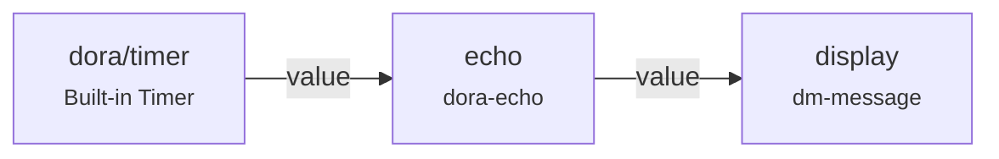
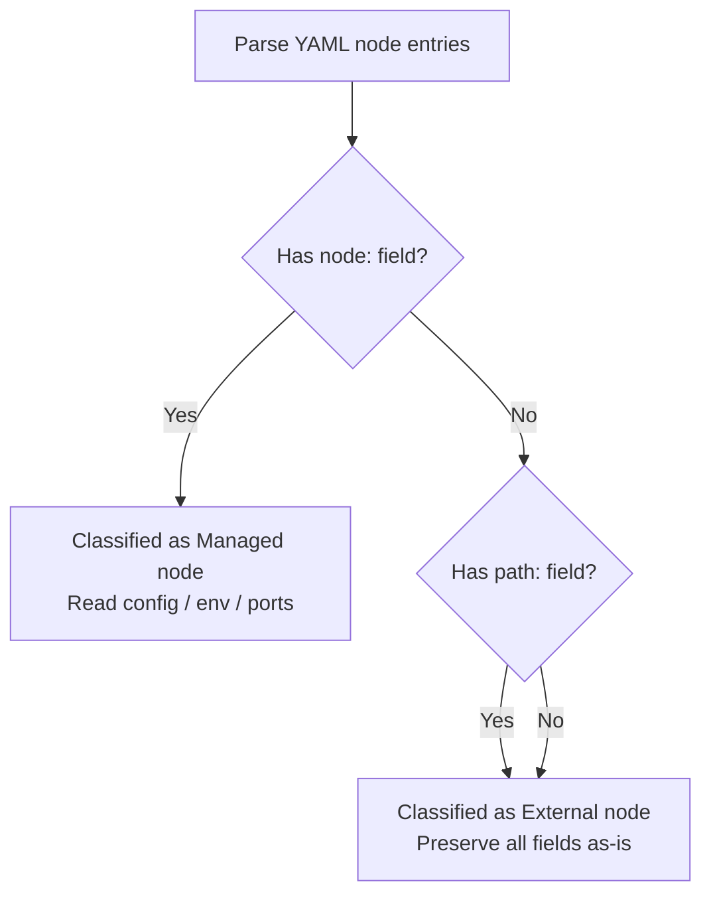
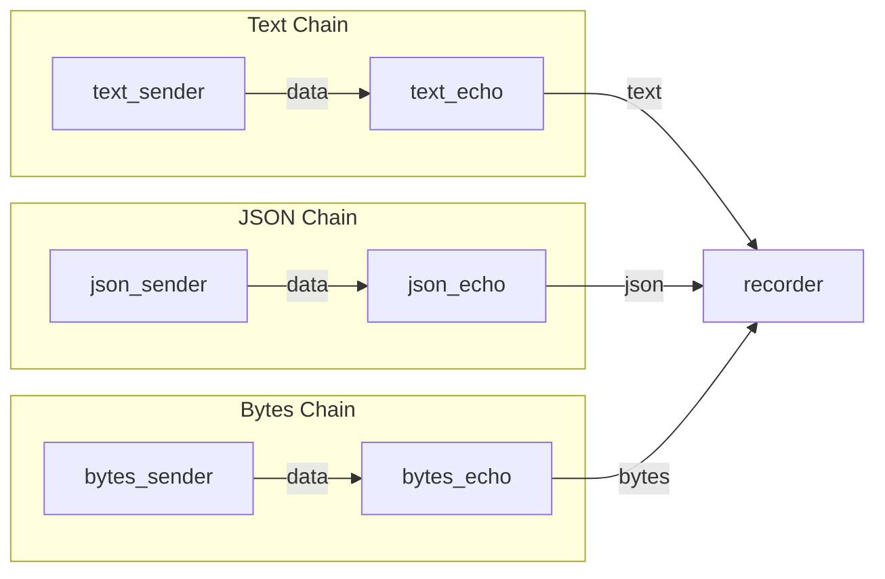
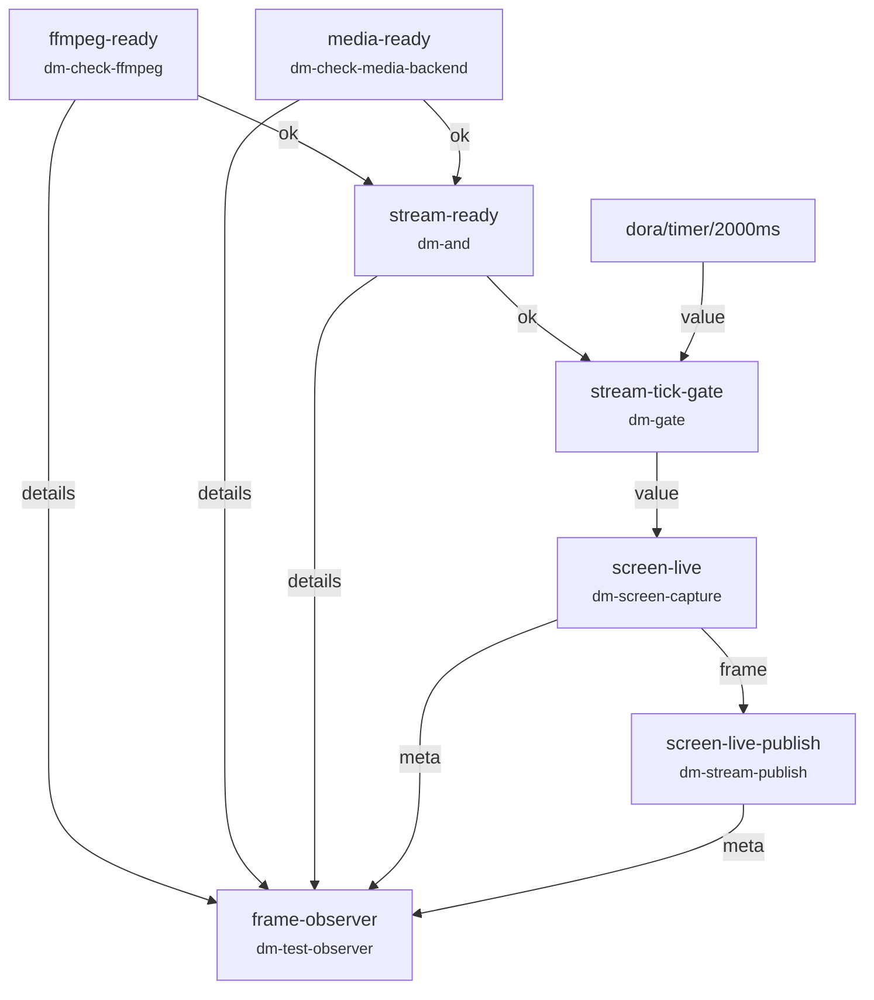
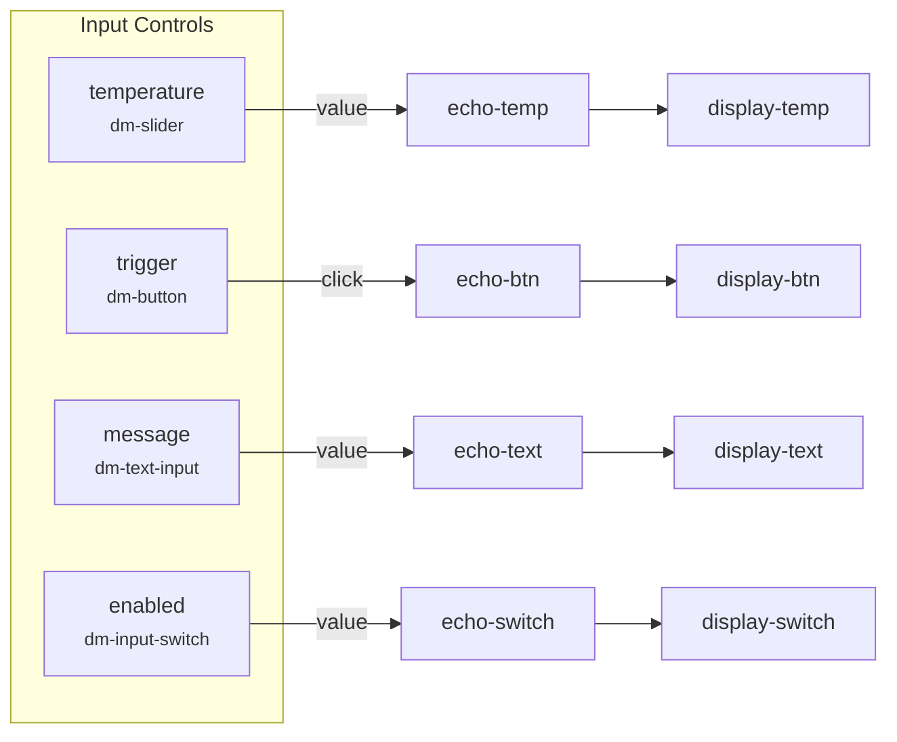
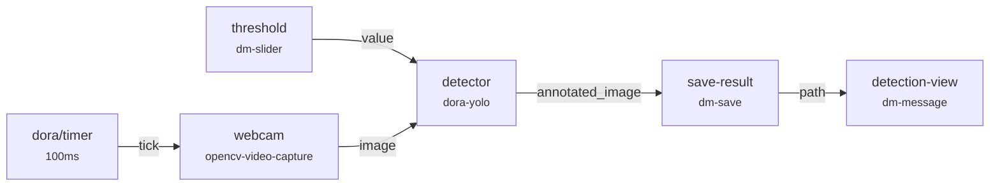

A dataflow is the most core abstraction in Dora Manager -- a YAML file defines a **directed data graph**: nodes are computation units on the graph, and edges are data transfer channels between nodes. This article starts from the basic structure of a YAML file and progressively walks you through node declarations, connection syntax, configuration passing, and how the system transforms this declarative description into a runnable pipeline.

Sources: [demo-hello-timer.yml](demos/demo-hello-timer.yml#L1-L39), [model.rs](https://github.com/l1veIn/dora-manager/blob/main/crates/dm-core/src/dataflow/model.rs#L1-L172)

## What is a Dataflow: A Directed Data Graph

A dataflow is essentially a **directed acyclic graph (DAG)**, declared in YAML format. Each dataflow file describes which nodes participate in computation, how nodes are connected through ports, and the configuration parameters each node needs at runtime. When a dataflow is started (i.e., a "run instance" is created), data flows along the declared connection edges from upstream nodes to downstream nodes, driving the entire pipeline.

The following Mermaid diagram shows the topology of a minimal dataflow -- the connection between two nodes in `demo-hello-timer.yml`. `dora-echo` receives heartbeat signals from the built-in timer and then forwards data to `dm-message` for display in the Web UI:



Sources: [demo-hello-timer.yml](demos/demo-hello-timer.yml#L22-L39)

## YAML File Structure

The top-level structure of a dataflow YAML file is very concise -- the core is a `nodes` list, where each entry describes a node participating in computation. Additionally, the YAML can include other top-level fields for the dora-rs runtime (such as `communication`, `deploy`, etc.), which are preserved as-is by the system. The basic skeleton is as follows:

```yaml
nodes:
  - id: <yaml_id>              # Required: unique identifier within the dataflow scope
    node: <node_id>             # Managed node (recommended)
    # or
    path: /path/to/binary       # External node (directly specify executable path)

    inputs:                     # Optional: define input connections
      <port_name>: <source>

    outputs:                    # Optional: declare output ports
      - <port_name>

    config:                     # Optional: inline configuration parameters
      <key>: <value>

    env:                        # Optional: environment variables
      <KEY>: <VALUE>

    args: "--flag value"        # Optional: command-line arguments
```

Each node entry consists of the following key fields. The table below summarizes their meanings and use cases:

| Field | Type | Required | Description |
|------|------|------|------|
| `id` | String | ✅ | Unique instance identifier within the dataflow scope (yaml_id), used for connection references |
| `node` | String | Choose one | Managed node's node ID, corresponding to `~/.dm/nodes/<node_id>/dm.json` |
| `path` | String | Choose one | Absolute path to the executable file for an external node |
| `inputs` | Map | ❌ | Mapping from input ports to data sources, in the format `port_name: source_node/source_port` |
| `outputs` | List | ❌ | List of output port names exposed by the node |
| `config` | Map | ❌ | Inline configuration parameters, merged with `config_schema` in `dm.json` |
| `env` | Map | ❌ | Environment variables injected directly, layered on top of the merged config result |
| `args` | String | ❌ | Command-line arguments passed to the node's executable |

Sources: [passes.rs](https://github.com/l1veIn/dora-manager/blob/main/crates/dm-core/src/dataflow/transpile/passes.rs#L15-L101), [model.rs](https://github.com/l1veIn/dora-manager/blob/main/crates/dm-core/src/dataflow/transpile/model.rs#L8-L38)

## Two Node Types: Managed and External

Nodes in a dataflow are divided into two types, which is a key distinction for understanding the YAML topology.

**Managed Nodes** are declared using the `node:` field. These nodes have complete `dm.json` metadata files in `~/.dm/nodes/<node_id>/`, and Dora Manager is responsible for their installation, path resolution, configuration merging, and port validation. The vast majority of built-in and community nodes are managed nodes. The transpiler automatically resolves `node: dm-message` to the corresponding executable's absolute path and merges `config` parameters into environment variables for injection.

**External Nodes** are declared using the `path:` field. These nodes point directly to an absolute path of an executable file, bypassing Dora Manager's management process -- no configuration merging, no port validation, passed as-is to the dora-rs runtime. Suitable for integrating third-party standalone programs or temporary debugging.

During the parsing phase, the transpiler classifies each node based on the presence or absence of `node:` and `path:`. The classification logic is defined in `passes::parse()` -- entries with a `node:` field are classified as `DmNode::Managed`, and the rest as `DmNode::External`:



Sources: [passes.rs](https://github.com/l1veIn/dora-manager/blob/main/crates/dm-core/src/dataflow/transpile/passes.rs#L15-L101), [model.rs](https://github.com/l1veIn/dora-manager/blob/main/crates/dm-core/src/dataflow/transpile/model.rs#L16-L38)

## Connection Syntax: source_node/source_port

Data connections between nodes are the most essential syntax in a dataflow YAML. Connections are defined in the downstream node's `inputs` field, in the format:

```yaml
inputs:
  <this_node_input_port_name>: <upstream_node_id>/<upstream_output_port_name>
```

Using `demo-hello-timer.yml` as an example, the `echo` node receives data from the built-in timer `dora/timer/millis/1000`, and the `display` node receives data from the `echo` node's `value` output port:

```yaml
- id: echo
  node: dora-echo
  inputs:
    value: dora/timer/millis/1000     # Built-in timer as data source
  outputs:
    - value

- id: message
  node: dm-message
  inputs:
    message: echo/value                  # ← Connects to echo node's value output port
```

This connection means: every message produced on the `value` output port of the `echo` node will be automatically routed to the `data` input port of the `display` node.

### Multi-Input Mapping

A node can receive data streams from multiple upstream sources through different input port names. The `recorder` node in `system-test-happy.yml` simultaneously receives data from three parallel chains, demonstrating this fan-in pattern:



In the corresponding YAML declaration, the three input ports of `recorder` are each mapped to different upstream sources:

```yaml
- id: recorder
  node: dora-parquet-recorder
  inputs:
    text: text_echo/data       # Input port "text" ← text_echo's data
    json: json_echo/data       # Input port "json" ← json_echo's data
    bytes: bytes_echo/data     # Input port "bytes" ← bytes_echo's data
```

Sources: [system-test-happy.yml](https://github.com/l1veIn/dora-manager/blob/main/tests/dataflows/system-test-happy.yml#L1-L83), [demo-hello-timer.yml](demos/demo-hello-timer.yml#L22-L39)

## Dora Built-in Data Sources

In addition to connecting to other nodes, the value of `inputs` can also reference **built-in data sources provided by the dora-rs runtime**. These data sources are identified by the `dora/` prefix, with the most common being timers:

| Built-in Data Source | Description |
|-----------|------|
| `dora/timer/millis/<N>` | Sends a heartbeat signal every N milliseconds |
| `dora/timer/secs/<N>` | Sends a heartbeat signal every N seconds |

Built-in data sources are commonly used to drive nodes that need periodic triggering. For example, in `demo-hello-timer.yml`, the `echo` node is triggered by the timer once every 1 second:

```yaml
- id: echo
  node: dora-echo
  inputs:
    value: dora/timer/millis/1000    # ← Dora built-in timer, triggers every 1 second
```

During port validation, the transpiler automatically skips built-in sources with the `dora` prefix -- when parsing `source_str`, if the first part from `split_once('/')` is not a valid node `yaml_id` (e.g., `dora` in `dora/timer/...` has additional `/` after it), no type compatibility check is performed on it.

Sources: [demo-hello-timer.yml](demos/demo-hello-timer.yml#L22-L29), [passes.rs](https://github.com/l1veIn/dora-manager/blob/main/crates/dm-core/src/dataflow/transpile/passes.rs#L168-L176)

## Configuration Passing: config and env

Nodes can receive configuration at runtime through two methods: the **structured `config` field** and the **raw `env` field**.

The `config` field is a declarative configuration method. You simply fill in the field names and values defined by `dm.json`'s `config_schema` in the YAML. The transpiler automatically handles priority merging -- **inline config > node-level config file (config.json) > schema defaults** -- and then converts the merged result into environment variables to inject into the node process. In the following example, the `label` and `render` config fields are looked up by the transpiler for their corresponding `env` mapping names and written into environment variables:

```yaml
- id: message
  node: dm-message
  config:
    label: "Echo Output"    # label field defined in config_schema
    render: text            # render field defined in config_schema
```

The `env` field directly sets environment variables, suitable for passing runtime parameters not included in `config_schema`, or for overriding results after config merging. For example, in `system-test-happy.yml`, sender nodes pass data directly via `env`:

```yaml
- id: text_sender
  node: pyarrow-sender
  outputs:
    - data
  env:
    DATA: "'system-test-text'"    # Directly set environment variable
```

Sources: [passes.rs](https://github.com/l1veIn/dora-manager/blob/main/crates/dm-core/src/dataflow/transpile/passes.rs#L349-L422), [system-test-happy.yml](https://github.com/l1veIn/dora-manager/blob/main/tests/dataflows/system-test-happy.yml#L1-L24)

## Dataflow Storage Structure

Each dataflow has its own project directory under `DM_HOME` (default `~/.dm`), stored in `dataflows/<name>/`. The storage paths are managed uniformly by the `paths` module:

| File | Constant Name | Purpose |
|------|--------|------|
| `dataflow.yml` | `DATAFLOW_FILE` | Dataflow YAML topology definition (core file) |
| `flow.json` | `FLOW_META_FILE` | Metadata (name, description, tags, creation/update timestamps) |
| `view.json` | `FLOW_VIEW_FILE` | Canvas layout state in the visual editor |
| `config.json` | `FLOW_CONFIG_FILE` | Node-level configuration defaults (independent of YAML inline config) |
| `.history/` | `FLOW_HISTORY_DIR` | Version history snapshot directory; automatically archived on each save |

Directory structure example:

```
~/.dm/dataflows/
├── interaction-demo/
│   ├── dataflow.yml        ← YAML topology definition
│   ├── flow.json           ← Metadata
│   ├── view.json           ← Editor canvas state
│   └── .history/
│       ├── 20250406T120000Z.yml
│       └── 20250406T130000Z.yml
├── system-test-happy/
│   ├── dataflow.yml
│   └── flow.json
└── qwen-dev/
    ├── dataflow.yml
    └── flow.json
```

When saving a dataflow, `repo::write_yaml` compares the new and old YAML content -- if the content has changed, the system archives the old version with a timestamp-based name into the `.history/` directory, supporting version rollback.

Sources: [paths.rs](https://github.com/l1veIn/dora-manager/blob/main/crates/dm-core/src/dataflow/paths.rs#L1-L36), [repo.rs](https://github.com/l1veIn/dora-manager/blob/main/crates/dm-core/src/dataflow/repo.rs#L59-L79)

## Executability Check: Ready / MissingNodes / InvalidYaml

Before starting a dataflow, Dora Manager performs an **executability check** on the YAML file to determine whether the dataflow is in a runnable state. The check logic is defined in the `inspect` module, which scans all managed nodes declared with `node:` and verifies one by one whether their `dm.json` exists in `~/.dm/nodes/`.

The check results are divided into three states:

| State | `can_run` | Description |
|------|-----------|------|
| `Ready` | ✅ | All managed nodes are installed, YAML format is valid |
| `MissingNodes` | ❌ | Some managed nodes are not installed; `missing_nodes` lists the missing items |
| `InvalidYaml` | ❌ | YAML format is invalid and cannot be parsed |

Additionally, the check identifies which nodes have the `media` capability tag (such as `dm-screen-capture`, `dm-stream-publish`) and sets the `requires_media_backend` flag, reminding the runtime that additional media backend services are needed. The `inspect_graph` function iterates through the YAML's `nodes` list, performing `resolve_node_dir` for each entry that contains a `node:` field to check existence, while also determining whether a media backend is needed via `node_requires_media_backend`.

Sources: [inspect.rs](https://github.com/l1veIn/dora-manager/blob/main/crates/dm-core/src/dataflow/inspect.rs#L1-L161), [model.rs](https://github.com/l1veIn/dora-manager/blob/main/crates/dm-core/src/dataflow/model.rs#L40-L77)

## From YAML to Runtime: Transpile Pipeline Overview

The `node: dm-message` written in a YAML file cannot be directly consumed by the dora-rs runtime -- the runtime needs `path: /absolute/path/to/binary`. This conversion process from "DM-style YAML" to "standard dora-rs YAML" is called **Transpilation**, completed by a multi-pass pipeline. The pipeline is defined in `transpile::transpile_graph_for_run`:

```mermaid
flowchart LR
    A["1. Parse<br/><small>YAML → DmGraph IR</small>"] --> B["2. Validate Reserved<br/><small>Check reserved ID conflicts</small>"]
    B --> C["3. Resolve Paths<br/><small>node: → path: absolute paths</small>"]
    C --> D["4. Validate Port Schemas<br/><small>Verify port type compatibility</small>"]
    D --> E["5. Merge Config<br/><small>Four-layer config merge → env</small>"]
    E --> F["6. Inject Runtime Env<br/><small>DM_RUN_ID and other runtime vars</small>"]
    F --> G["7. Inject Bridge<br/><small>Capability binding nodes</small>"]
    G --> H["8. Emit<br/><small>DmGraph → standard YAML</small>"]
```



A brief description of each pass's responsibilities:

| Pass | Function | Responsibility |
|------|------|------|
| 1. Parse | `parse()` | Parses the raw YAML text into a typed `DmGraph` intermediate representation, classifying nodes as managed or external types |
| 2. Validate Reserved | `validate_reserved()` | Checks whether node IDs conflict with system reserved names (currently a no-op, reserved as an extension point) |
| 3. Resolve Paths | `resolve_paths()` | Resolves managed nodes' `node:` to absolute executable paths via the `executable` field in `~/.dm/nodes/<id>/dm.json` |
| 4. Validate Port Schemas | `validate_port_schemas()` | Checks Arrow type compatibility between upstream output ports and downstream input ports along connections declared in `inputs` |
| 5. Merge Config | `merge_config()` | Performs priority-based config merging (inline config > node config file > schema defaults), writes results into `env` |
| 6. Inject Runtime Env | `inject_runtime_env()` | Injects runtime environment variables such as `DM_RUN_ID`, `DM_NODE_ID`, `DM_RUN_OUT_DIR` |
| 7. Inject Bridge | `inject_dm_bridge()` | Injects hidden bridge nodes for nodes with capability bindings, implementing interaction system bridging |
| 8. Emit | `emit()` | Serializes the `DmGraph` IR into standard dora-rs consumable YAML format |

Diagnostic information during transpilation (such as uninstalled nodes, incompatible port types) does not interrupt the pipeline. Instead, it is collected as a `TranspileDiagnostic` list and output to stderr in a unified manner, allowing users to review and fix all issues at once.

Sources: [mod.rs](https://github.com/l1veIn/dora-manager/blob/main/crates/dm-core/src/dataflow/transpile/mod.rs#L1-L85), [passes.rs](https://github.com/l1veIn/dora-manager/blob/main/crates/dm-core/src/dataflow/transpile/passes.rs#L1-L654), [error.rs](https://github.com/l1veIn/dora-manager/blob/main/crates/dm-core/src/dataflow/transpile/error.rs#L1-L62)

## Practical Example Analysis

### Minimal Topology: Timer → Echo → Display

`demo-hello-timer.yml` is the simplest ready-to-use example. It contains only two nodes, using the built-in timer to drive the dataflow:

```yaml
nodes:
  - id: echo
    node: dora-echo
    inputs:
      value: dora/timer/millis/1000
    outputs:
      - value

  - id: message
    node: dm-message
    inputs:
      message: echo/value
    config:
      label: "Timer Tick"
      render: text
```

This dataflow demonstrates three core elements: a **built-in data source** (`dora/timer/millis/1000`) as the input driver, **inter-node connection** (`echo/value → display/data`), and **config configuration** (`label` and `render`).

Sources: [demo-hello-timer.yml](demos/demo-hello-timer.yml#L1-L39)

### Conditional Gating: Readiness Check Chain

`system-test-stream.yml` demonstrates a complex topology with **conditional gating** -- it first checks whether ffmpeg and the media backend are ready, and only starts screen capture and streaming after both are confirmed ready:



This dataflow contains several noteworthy **topology patterns**:

- **dm-and convergence**: The `stream-ready` node waits until both `ffmpeg-ready/ok` and `media-ready/ok` boolean inputs are true before outputting true, implementing "all ready" semantics
- **dm-gate gating**: `stream-tick-gate` only passes through the timer signal on the `value` port after receiving true on the `enabled` port, implementing conditional triggering
- **Dora built-in source mixing**: The timer `dora/timer/millis/2000` participates in connections as a regular input port, no different from node outputs
- **Fan-out observation**: `frame-observer` simultaneously receives input from 5 different upstream sources, aggregating system status for debugging

Sources: [system-test-stream.yml](https://github.com/l1veIn/dora-manager/blob/main/tests/dataflows/system-test-stream.yml#L1-L77)

### Interactive Controls: Input-Display Closed Loop

`demo-interactive-widgets.yml` demonstrates how four types of interactive controls (slider, button, text input, switch) form a complete "input → forward → display" closed loop through a dataflow. Each control runs as an independent node, with output forwarded through `dora-echo` and echoed back by `dm-message`:



Sources: [demo-interactive-widgets.yml](demos/demo-interactive-widgets.yml#L1-L129)

### Robotics Pipeline: Real-Time Object Detection

`robotics-object-detection.yml` demonstrates a classic robotics perception pipeline -- camera capture → YOLO inference → annotated display, along with a slider control for real-time adjustment of detection confidence:



This example demonstrates **multi-source input convergence** -- the `detector` node simultaneously receives image data from `webcam` and confidence threshold from `threshold`, with two input ports updating independently. The node triggers processing upon receiving either input.

Sources: [robotics-object-detection.yml](demos/robotics-object-detection.yml#L1-L76)

## Best Practices for Writing Dataflows

Based on actual patterns in the codebase and the design of the transpile pipeline, here are key recommendations for writing dataflow YAML:

**Naming conventions**. The `id` field must be unique within the dataflow scope. It is recommended to use `kebab-case` naming (e.g., `screen-live-publish`) and reflect the node's functional semantics rather than simply reusing the node ID. This makes connections more readable -- `screen-live/frame` is much clearer than `node5/out1`.

**Prefer managed nodes**. Use `node:` instead of `path:` to declare nodes, so you can benefit from managed capabilities such as automatic path resolution, configuration merging, and port validation. Use `path:` only when integrating third-party programs not managed by Dora Manager.

**Use config rather than directly writing env**. Placing parameters in `config:` allows the system to perform type validation and default value filling under the `dm.json`'s `config_schema` framework, which is safer and more maintainable than hardcoding environment variables directly in `env:`. The transpiler's `merge_config` pass automatically merges by priority: `inline > node_config > schema_default`.

**Keep topologies simple**. It is recommended to keep the number of nodes in a dataflow within a reasonable range. Examples in the demos directory range from 2 to 10 nodes, covering various complexity levels from the simplest timer to a complete AI voice assistant pipeline.

**Use comments to document topologies**. YAML natively supports `#` comments. It is recommended to add an ASCII topology diagram before the node list (such as the `# Dataflow:` section in demo files) to help other developers quickly understand the overall structure.

Sources: [demo-logic-gate.yml](demos/demo-logic-gate.yml#L1-L120), [passes.rs](https://github.com/l1veIn/dora-manager/blob/main/crates/dm-core/src/dataflow/transpile/passes.rs#L349-L422)

---

After understanding the YAML topology of dataflows, you can continue exploring:

- [Run Instance: Lifecycle State Machine and Metrics Tracking](6-yun-xing-shi-li-run-sheng-ming-zhou-qi-zhuang-tai-ji-yu-zhi-biao-zhui-zong) -- Understand runtime management after a dataflow is started
- [Dataflow Transpiler: Multi-Pass Pipeline and Four-Layer Config Merging](8-shu-ju-liu-zhuan-yi-qi-transpiler-duo-pass-guan-xian-yu-si-ceng-pei-zhi-he-bing) -- Complete technical details of the transpile pipeline
- [Built-in Nodes Overview: From Media Capture to AI Inference](7-nei-zhi-jie-dian-zong-lan-cong-mei-ti-cai-ji-dao-ai-tui-li) -- Learn about available node types
