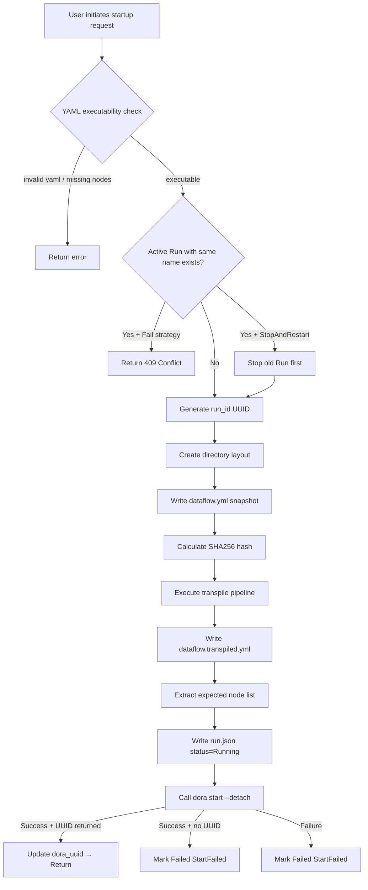

**Run Instance (Run)** is the core abstraction in Dora Manager that connects "static definition" with "dynamic execution". When you hand a dataflow YAML file to the system for execution, it transforms from a plain text configuration into a run instance with its own identity, lifecycle, and observability. This article systematically dissects the Run's data model, state machine, persistence strategy, metrics collection mechanism, and frontend-backend collaboration, helping you understand the complete journey of a Run from birth to termination.

Sources: [dm-run-instance-design.md](https://github.com/l1veIn/dora-manager/blob/master/docs/dm-run-instance-design.md#L1-L103), [model.rs](https://github.com/l1veIn/dora-manager/blob/master/crates/dm-core/src/runs/model.rs#L1-L145)

## Three-Layer Abstraction: Dataflow → Run → Panel Session

Dora Manager uses a classic three-layer model to organize the executable lifecycle of dataflows. **Dataflow** (definition layer) is the YAML file under `~/.dm/dataflows/`, describing node topology and connection relationships; **Run Instance** (execution layer) is the independent record produced by each execution, stored in `~/.dm/runs/<run_uuid>/`; **Panel Session** (data layer) is the interaction data during runtime, nested in the `panel/` subdirectory within the Run directory. This layering allows the same definition to be executed repeatedly, with each execution retaining a complete configuration snapshot and logs, while interaction data naturally belongs to the corresponding runtime context.

```
~/.dm/
├── dataflows/
│   └── qwen-dev.yml          ← Dataflow definition layer
├── runs/
│   └── <run_uuid>/
│       ├── run.json           ← Run metadata (state, timestamps, metrics snapshot)
│       ├── dataflow.yml       ← YAML snapshot at startup (immutable snapshot)
│       ├── dataflow.transpiled.yml  ← Transpiled executable YAML
│       ├── view.json          ← Editor view layout snapshot
│       ├── logs/              ← Per-node logs
│       │   ├── node-a.log
│       │   └── node-b.log
│       └── out/               ← Dora runtime raw output (log_<node>.txt)
│           └── <dora_uuid>/
└── config.toml
```

Sources: [dm-run-instance-design.md](https://github.com/l1veIn/dora-manager/blob/master/docs/dm-run-instance-design.md#L16-L37), [repo.rs](https://github.com/l1veIn/dora-manager/blob/master/crates/dm-core/src/runs/repo.rs#L9-L48)

## RunInstance Data Model

`RunInstance` is the core data structure of the Run system, persisted as JSON in `run.json`. It carries five dimensions of information: identity, state tracking, failure diagnosis, transpilation metadata, and log synchronization.

Sources: [model.rs](https://github.com/l1veIn/dora-manager/blob/master/crates/dm-core/src/runs/model.rs#L119-L174)

### State Enum: RunStatus

The state of a Run is driven by the `RunStatus` enum, with four terminal states and one active state:

| State | Meaning | Reachable Path |
|------|------|---------|
| **Running** | Dataflow is executing in the Dora runtime | Entered after successful startup |
| **Succeeded** | All nodes completed normally | Dora runtime reports Succeeded |
| **Stopped** | Externally stopped or runtime actively terminated | User manual stop / RuntimeStopped / RuntimeLost |
| **Failed** | Startup failure or node crash | StartFailed / NodeFailed |

Sources: [model.rs](https://github.com/l1veIn/dora-manager/blob/master/crates/dm-core/src/runs/model.rs#L5-L28)

### Termination Reason: TerminationReason

Each terminal state is associated with a `TerminationReason`, providing richer diagnostic context than the state itself:

| Termination Reason | Corresponding Terminal State | Trigger Scenario |
|----------|---------|---------|
| `Completed` | Succeeded | All dataflow nodes exited normally |
| `StoppedByUser` | Stopped | User initiated stop via Web UI or CLI |
| `StartFailed` | Failed | `dora start` returned non-zero exit code or no UUID |
| `NodeFailed` | Failed | A node crashed at runtime, Dora reported Failed |
| `RuntimeLost` | Stopped | `dora list` no longer reports this dataflow (daemon restart, etc.) |
| `RuntimeStopped` | Stopped | Dora runtime actively stopped this dataflow |

Sources: [model.rs](https://github.com/l1veIn/dora-manager/blob/master/crates/dm-core/src/runs/model.rs#L51-L74)

### Source Tracking: RunSource

Each Run startup records the trigger source, facilitating auditing and statistics:

| Source | Description |
|------|------|
| `Cli` | Triggered via `dm start` command line |
| `Server` | Triggered via dm-server HTTP API |
| `Web` | Triggered via frontend Web UI |
| `Unknown` | Compatible with legacy data or unspecified source |

Sources: [model.rs](https://github.com/l1veIn/dora-manager/blob/master/crates/dm-core/src/runs/model.rs#L30-L49)

## Lifecycle State Machine

The Run lifecycle can be precisely described by the following state machine. Each state transition has clear trigger conditions and side effects (such as log synchronization, failure inference):

```mermaid
stateDiagram-v2
    [*] --> Running : dm start / API POST /runs/start

    Running --> Succeeded : dora list reports Succeeded\n→ sync_run_outputs\n→ TerminationReason::Completed
    Running --> Stopped : User manual stop\n→ TerminationReason::StoppedByUser
    Running --> Failed : dora list reports Failed\n→ infer_failure_details\n→ TerminationReason::NodeFailed
    Running --> Stopped : dora list no longer reports\n→ TerminationReason::RuntimeLost
    Running --> Stopped : dora list reports Stopped\n→ TerminationReason::RuntimeStopped
    Running --> Failed : dora start returns error\n→ TerminationReason::StartFailed

    Succeeded --> [*]
    Stopped --> [*]
    Failed --> [*]

    note right of Running
        refresh_run_statuses periodic polling
        dora list syncs actual state
    end note

    note right of Failed
        Failure diagnosis chain:
        1. parse_failure_details (dora output)
        2. infer_failure_details (node logs)
        3. Extract AssertionError / panic / Traceback
    end note
```

**Key design decision**: When `dora list` call fails (e.g., daemon temporarily unreachable), the system chooses a **conservative strategy** — maintaining the Running state unchanged, rather than hastily marking it as Stopped. This avoids misjudgments caused by transient network fluctuations.

Sources: [service_runtime.rs](https://github.com/l1veIn/dora-manager/blob/master/crates/dm-core/src/runs/service_runtime.rs#L99-L214), [state.rs](https://github.com/l1veIn/dora-manager/blob/master/crates/dm-core/src/runs/state.rs#L59-L80)

## Startup Flow Details

A complete Run startup goes through the following stages:



The **conflict strategy** (`StartConflictStrategy`) in the startup flow is an important UX design: `Fail` mode directly rejects duplicate startups, returning 409 status code; `StopAndRestart` mode gracefully stops the old instance before starting a new one, corresponding to the frontend's `force=true` parameter and CLI's `--force` flag.

Sources: [service_start.rs](https://github.com/l1veIn/dora-manager/blob/master/crates/dm-core/src/runs/service_start.rs#L72-L220), [handlers/runs.rs](https://github.com/l1veIn/dora-manager/blob/master/crates/dm-server/src/handlers/runs.rs#L189-L256)

## Stop Flow and Fault Tolerance

The stop flow embodies a "best-effort + state-consistency-first" design philosophy:

1. Read `dora_uuid` from `run.json`
2. Call `dora stop <dora_uuid>` (15-second timeout)
3. **Success path**: Sync log output → Mark `Stopped / StoppedByUser`
4. **Failure path**: Call `dora list` again to check — if the dataflow is no longer in the list, still mark as `Stopped` (tolerant stop); if still running, mark as `Failed`

The server's `stop_run` handler uses a **fire-and-forget** pattern: immediately returns a `{"status": "stopping"}` response, then executes the actual stop operation in the background via `tokio::spawn`, avoiding prolonged HTTP blocking.

Sources: [service_runtime.rs](https://github.com/l1veIn/dora-manager/blob/master/crates/dm-core/src/runs/service_runtime.rs#L16-L97), [handlers/runs.rs](https://github.com/l1veIn/dora-manager/blob/master/crates/dm-server/src/handlers/runs.rs#L258-L284)

## State Refresh and Runtime Synchronization

`refresh_run_statuses` is the **heartbeat mechanism** of the Run system. Each query (whether list or detail) triggers a state refresh:

1. Load all local Run instances
2. Call `dora list` to get the list of dataflows actually present in the runtime
3. For each locally-marked Running Run, match the runtime state using `dora_uuid`
4. Execute corresponding state transitions and log synchronization based on match results (Running / Succeeded / Failed / Stopped / not found)

Log synchronization (`sync_run_outputs`) copies the `log_<node>.txt` files output by the Dora runtime to `logs/<node>.log` in the Run directory, while updating `nodes_observed` and `node_count_observed`, achieving a closed-loop validation from "expected nodes" to "actually observed nodes".

Sources: [service_runtime.rs](https://github.com/l1veIn/dora-manager/blob/master/crates/dm-core/src/runs/service_runtime.rs#L99-L263)

## Failure Diagnosis System

When a Run enters the Failed state, the system activates a **multi-level failure diagnosis chain** to extract meaningful error information:

1. **Dora output parsing** (`parse_failure_details`): Extracts patterns like `"Node &lt;name&gt; failed: <message>"` from `dora start` / `dora list` output
2. **Node log scanning** (`infer_failure_details`): Iterates through all observed node log files, searching by priority for patterns like `AssertionError:`, `thread 'main' panicked at`, `panic:`, `ERROR`
3. **Python Traceback fallback**: If none of the above patterns match, takes the last non-empty line from the log
4. **Text compression** (`compact_error_text`): Compresses multi-line error messages into a single line, capped at 240 characters

Diagnosis results are written to `failure_node`, `failure_message`, and `outcome.summary`, directly displayed by the frontend via the `RunFailureBanner` component.

Sources: [state.rs](https://github.com/l1veIn/dora-manager/blob/master/crates/dm-core/src/runs/state.rs#L18-L150)

## Metrics Collection System

The Run system implements **two-level metrics collection** — dataflow level and node level:

**Dataflow level** is obtained via `dora list --format json`, with each line being a JSON object containing `uuid`, `cpu` (percentage), `memory` (GB, internally converted to MB by the system).

**Node level** is obtained via `dora node list --format json --dataflow <uuid>`, containing each node's `node` (ID), `status`, `pid`, `cpu` (string like `"23.7%"`), and `memory` (string like `"1143 MB"`).

These metrics are delivered to the frontend through two channels:
- **HTTP polling**: `GET /api/runs/{id}?include_metrics=true` and `GET /api/runs/{id}/metrics`
- **WebSocket push**: After connecting to `ws://.../api/runs/{id}/ws`, `Metrics` messages are automatically pushed every second

Sources: [service_metrics.rs](https://github.com/l1veIn/dora-manager/blob/master/crates/dm-core/src/runs/service_metrics.rs#L1-L197), [run_ws.rs](https://github.com/l1veIn/dora-manager/blob/master/crates/dm-server/src/handlers/run_ws.rs#L207-L228)

## WebSocket Real-Time Channel

Each active Run supports a WebSocket connection (`/api/runs/{id}/ws`), providing four real-time message types:

| Message Type | Direction | Trigger Condition | Data Content |
|----------|------|---------|---------|
| `metrics` | Server → Client | Pushed every second | Per-node CPU, memory, PID, status |
| `logs` | Server → Client | Log file changes (`notify` crate monitoring) | New log lines |
| `io` | Server → Client | `[DM-IO]` marker appears in logs | Filtered IO event lines |
| `status` | Server → Client | Checked every second | Run current state string |
| `ping` | Server → Client | Every 10 seconds | Empty heartbeat |

Internally, WebSocket uses the `notify` crate for file system monitoring of the log directory. When the Dora runtime writes new log lines, change events are passed to the WebSocket loop via an `mpsc` channel, achieving **incremental log stream pushing**. Meanwhile, metrics collection and state checking are performed every second, ensuring the frontend always displays the latest runtime state.

Sources: [run_ws.rs](https://github.com/l1veIn/dora-manager/blob/master/crates/dm-server/src/handlers/run_ws.rs#L1-L237)

## HTTP API Route Overview

Below is the complete list of HTTP API endpoints related to Runs, all paths prefixed with `/api`:

| Method | Path | Description |
|------|------|------|
| GET | `/runs?limit=&offset=&status=&search=` | Paginated list with status filtering and search |
| GET | `/runs/active?metrics=` | Get all active Runs (optionally with metrics) |
| GET | `/runs/{id}?include_metrics=` | Single Run details (including node list) |
| GET | `/runs/{id}/metrics` | Runtime metrics (CPU / memory / node-level) |
| GET | `/runs/{id}/dataflow` | Original YAML snapshot |
| GET | `/runs/{id}/transpiled` | Transpiled YAML |
| GET | `/runs/{id}/view` | Editor view layout JSON |
| GET | `/runs/{id}/logs/{node_id}` | Complete node log |
| GET | `/runs/{id}/logs/{node_id}/tail?offset=` | Incremental log tail (with resume support) |
| POST | `/runs/start` | Start new Run (body: yaml, name, force, view_json) |
| POST | `/runs/{id}/stop` | Stop specified Run (async execution) |
| POST | `/runs/delete` | Batch delete (body: run_ids) |
| WS | `/runs/{id}/ws` | Real-time WebSocket channel |

Sources: [handlers/runs.rs](https://github.com/l1veIn/dora-manager/blob/master/crates/dm-server/src/handlers/runs.rs#L1-L333), [main.rs](https://github.com/l1veIn/dora-manager/blob/master/crates/dm-server/src/main.rs#L173-L200)

## Frontend Integration: List Page and Workspace

**List page** (`/runs`) provides paginated browsing, status filtering, keyword search, and batch deletion. Each row displays the Run's name, status badge, start time, and node count; active Runs additionally show CPU and memory metrics. The `RecentRunCard` component is used for quick previews in dashboard scenarios, with a colored left border for intuitive status differentiation.

**Workspace page** (`/runs/[id]`) is the interaction hub during Run execution. It includes the following core areas:
- **RunHeader**: Name, status badge, Stop button, YAML/Transpiled/Graph viewing entry
- **RunSummaryCard**: Run ID, Dora UUID, start/end time, duration, exit code, node count, transpilation details
- **RunNodeList**: Node list, click to view logs in the Terminal panel
- **Workspace**: Customizable grid layout system, supporting five widget types: Message, Input, Chart, Video, Terminal

The workspace page uses 3-second polling to keep Run details and metrics refreshed, while receiving real-time log and state change notifications via WebSocket. Layout configuration is persisted to `localStorage`, isolated by dataflow name.

Sources: [RecentRunCard.svelte](https://github.com/l1veIn/dora-manager/blob/master/web/src/lib/components/runs/RecentRunCard.svelte#L1-L130), [RunStatusBadge.svelte](https://github.com/l1veIn/dora-manager/blob/master/web/src/lib/components/runs/RunStatusBadge.svelte#L1-L34), [+page.svelte](https://github.com/l1veIn/dora-manager/blob/master/web/src/routes/runs/%5Bid%5D/+page.svelte#L1-L393), [RunHeader.svelte](https://github.com/l1veIn/dora-manager/blob/master/web/src/routes/runs/%5Bid%5D/RunHeader.svelte#L1-L200), [RunSummaryCard.svelte](https://github.com/l1veIn/dora-manager/blob/master/web/src/routes/runs/%5Bid%5D/RunSummaryCard.svelte#L1-L199)

## Management Operations: Deletion and Cleanup

**Single/batch deletion** is implemented via `POST /api/runs/delete`, accepting a `run_ids` array, deleting directories one by one and synchronously cleaning up associated EventStore event records. Return results distinguish between `deleted` and `failed` lists, using 207 Multi-Status status code to indicate partial success.

**Auto-cleanup** (`clean_runs`) retains the most recent N records, deleting older historical Runs, suitable for disk space management scenarios.

Sources: [service_admin.rs](https://github.com/l1veIn/dora-manager/blob/master/crates/dm-core/src/runs/service_admin.rs#L1-L28), [handlers/runs.rs](https://github.com/l1veIn/dora-manager/blob/master/crates/dm-server/src/handlers/runs.rs#L286-L333)

## Backend Code Organization

Run-related code under `crates/dm-core/src/runs/` is clearly layered by responsibility:

| File | Responsibility |
|------|------|
| `model.rs` | All data structure definitions (RunInstance, RunStatus, RunMetrics, etc.) |
| `repo.rs` | File system persistence (read/write run.json, directory layout management, log reading) |
| `runtime.rs` | RuntimeBackend trait + DoraCliBackend implementation (dora start/stop/list) |
| `state.rs` | State transition logic (apply_terminal_state, failure diagnosis, outcome construction) |
| `graph.rs` | YAML parsing utilities (node ID extraction, transpilation metadata construction) |
| `service_start.rs` | Startup flow orchestration (validation, conflict handling, snapshot, transpilation, dora calls) |
| `service_runtime.rs` | Stop flow, state refresh, log synchronization |
| `service_metrics.rs` | Metrics collection (dora list/node list parsing) |
| `service_query.rs` | Query service (pagination, filtering, detail aggregation) |
| `service_admin.rs` | Management operations (deletion, cleanup) |

The `RuntimeBackend` trait abstraction enables fully isolated unit testing of the entire Run system via `TestBackend`, without a real Dora runtime environment.

Sources: [mod.rs](https://github.com/l1veIn/dora-manager/blob/master/crates/dm-core/src/runs/mod.rs#L1-L26), [service.rs](https://github.com/l1veIn/dora-manager/blob/master/crates/dm-core/src/runs/service.rs#L1-L45), [service_tests.rs](https://github.com/l1veIn/dora-manager/blob/master/crates/dm-core/src/runs/service_tests.rs#L1-L53)

---

**Further reading**: After understanding the Run lifecycle, you can explore the following topics — [Runtime Service: Startup Orchestration, State Refresh, and Metrics Collection](10-runtime-service) dives into the backend service layer implementation details, [Runtime Workspace: Grid Layout, Panel System, and Real-Time Interaction](16-runtime-workspace) shows how the frontend transforms this data into interactive work interfaces, and [Event System: Observability Model and XES-Compatible Storage](11-event-system) reveals the event tracking mechanism during Run execution.