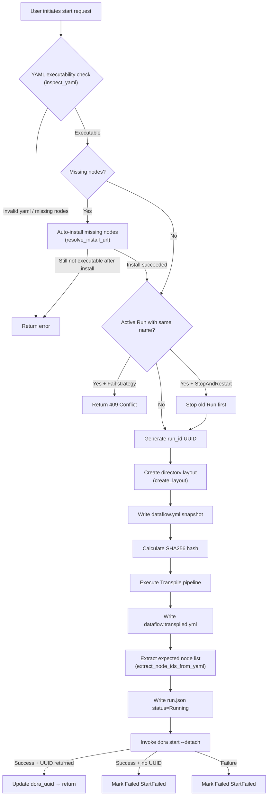
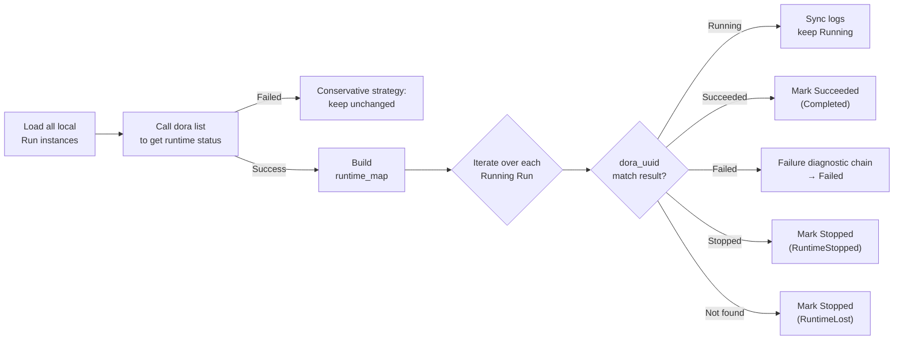

**Run Instance (Run)** is the core abstraction in Dora Manager that bridges "static dataflow definitions" and "dynamic execution processes." When you hand a dataflow YAML file to the system for execution, it transforms from a plain-text configuration into a running instance with its own identity, complete lifecycle, and rich observability. This article systematically breaks down the Run's data model, state machine transitions, start/stop orchestration, metrics collection mechanism, and frontend/backend integration, helping you understand the full-chain design of the Run subsystem from creation to termination.

Sources: [dm-run-instance-design.md](https://github.com/l1veIn/dora-manager/blob/main/docs/dm-run-instance-design.md#L1-L103), [model.rs](https://github.com/l1veIn/dora-manager/blob/main/crates/dm-core/src/runs/model.rs#L119-L184)

## Three-Layer Abstraction: Dataflow → Run → Panel Session

Dora Manager adopts a classic three-layer model to organize the executable lifecycle of dataflows. **Dataflow** (definition layer) is a YAML file under `~/.dm/dataflows/`, describing node topology and connections; **Run Instance** (execution layer) is an independent record produced by each execution, stored in `~/.dm/runs/<run_uuid>/`; **Panel Session** (data layer) contains the interactive data generated by each node during runtime. This layering cleanly decouples "what is defined," "how it executes," and "what it produces."

The filesystem layout of a Run instance is as follows -- note that both the original YAML snapshot and the transpiled executable YAML are preserved, ensuring full auditability and traceability for every run:

```
~/.dm/
├── dataflows/
│   └── qwen-dev.yml               ← Dataflow definition layer (source file)
├── runs/
│   └── <run_uuid>/
│       ├── run.json                ← Run metadata (status, timestamps, failure diagnostics)
│       ├── dataflow.yml            ← Original YAML snapshot at start time (immutable)
│       ├── dataflow.transpiled.yml ← Executable YAML after Transpiler pipeline
│       ├── view.json               ← Graph editor view layout snapshot
│       └── out/                    ← Dora runtime raw output
│           └── <dora_uuid>/
│               ├── log_node-a.txt
│               └── log_node-b.txt
└── config.toml
```

Sources: [repo.rs](https://github.com/l1veIn/dora-manager/blob/main/crates/dm-core/src/runs/repo.rs#L9-L46), [dm-run-instance-design.md](https://github.com/l1veIn/dora-manager/blob/main/docs/dm-run-instance-design.md#L16-L37)

## RunInstance Data Model

`RunInstance` is the core data structure of the Run system, persisted as JSON in `run.json`. It carries information across five dimensions: **identity** (run_id, dora_uuid, dataflow_hash), **state tracking** (status, termination_reason, outcome), **failure diagnostics** (failure_node, failure_message), **transpilation metadata** (transpile, nodes_expected), and **log synchronization** (log_sync, nodes_observed).

The structure uses the `#[serde(default)]` annotation to ensure forward compatibility -- when `schema_version` is upgraded and new fields are added, deserializing older `run.json` files will not fail; missing fields are automatically filled with default values. Persistence uses an atomic write pattern (write to `.tmp` file first, then `rename`), preventing data corruption from process interruptions.

Sources: [model.rs](https://github.com/l1veIn/dora-manager/blob/main/crates/dm-core/src/runs/model.rs#L127-L184), [repo.rs](https://github.com/l1veIn/dora-manager/blob/main/crates/dm-core/src/runs/repo.rs#L56-L64)

### Status Enum: RunStatus

The Run's status is driven by the `RunStatus` enum, with four terminal states and one active state:

| Status | Meaning | Reachable Path |
|--------|---------|----------------|
| **Running** | Dataflow is executing in the Dora runtime | Entered after successful start (default value) |
| **Succeeded** | All nodes completed normally | `dora list` reports Succeeded |
| **Stopped** | Externally stopped or runtime actively terminated | User manual stop / RuntimeStopped / RuntimeLost |
| **Failed** | Start failure or node crash | StartFailed / NodeFailed |

Sources: [model.rs](https://github.com/l1veIn/dora-manager/blob/main/crates/dm-core/src/runs/model.rs#L5-L28)

### Termination Reason: TerminationReason

Each terminal state is associated with a `TerminationReason`, providing richer diagnostic context than the status alone. Note that the same terminal state (e.g., Stopped) can correspond to multiple different reasons, which is critical for troubleshooting:

| Termination Reason | Terminal State | Trigger Scenario |
|--------------------|----------------|------------------|
| `Completed` | Succeeded | All dataflow nodes exited normally |
| `StoppedByUser` | Stopped | User initiated stop via Web UI or CLI |
| `StartFailed` | Failed | `dora start` returned a non-zero exit code or no UUID |
| `NodeFailed` | Failed | A node crashed at runtime, Dora reported Failed |
| `RuntimeLost` | Stopped | `dora list` no longer reports this dataflow (daemon restart, etc.) |
| `RuntimeStopped` | Stopped | Dora runtime actively stopped this dataflow |

Sources: [model.rs](https://github.com/l1veIn/dora-manager/blob/main/crates/dm-core/src/runs/model.rs#L51-L74)

### Source Tracking: RunSource

Each Run records its trigger source at startup for auditing and statistics:

| Source | Description |
|--------|-------------|
| `Cli` | Triggered via `dm start` command line |
| `Server` | Triggered via dm-server HTTP API |
| `Web` | Triggered via frontend Web UI |
| `Unknown` | For backward compatibility with old data or unspecified sources |

Sources: [model.rs](https://github.com/l1veIn/dora-manager/blob/main/crates/dm-core/src/runs/model.rs#L30-L49)

### Conflict Strategy: StartConflictStrategy

When a dataflow already has an active Run, the system provides two strategies:

| Strategy | Behavior | Corresponding Parameter |
|----------|----------|------------------------|
| `Fail` | Reject duplicate start immediately, return 409 | Default behavior |
| `StopAndRestart` | Gracefully stop the old instance first, then start new one | Frontend `force=true` / CLI `--force` |

Sources: [model.rs](https://github.com/l1veIn/dora-manager/blob/main/crates/dm-core/src/runs/model.rs#L192-L196)

## Lifecycle State Machine

The Run's lifecycle can be precisely described by the following state machine. Each state transition has clear trigger conditions and side effects (log synchronization, failure inference):

```mermaid
stateDiagram-v2
    [*] --> Running : dm start / API POST /runs/start

    Running --> Succeeded : dora list reports Succeeded
    Running --> Stopped : User manual stop\n(TerminationReason::StoppedByUser)
    Running --> Failed : dora list reports Failed\n→ infer_failure_details
    Running --> Stopped : dora list no longer reports\n(TerminationReason::RuntimeLost)
    Running --> Stopped : dora list reports Stopped\n(TerminationReason::RuntimeStopped)
    Running --> Failed : dora start returns error\n(TerminationReason::StartFailed)

    Succeeded --> [*]
    Stopped --> [*]
    Failed --> [*]

    note right of Running
        refresh_run_statuses periodically polls
        dora list to sync actual state
        When dora list fails, conservatively keeps Running
    end note

    note right of Failed
        Failure diagnostic chain:
        1. parse_failure_details (dora output)
        2. infer_failure_details (node logs)
        3. Extract AssertionError / panic / Traceback
    end note
```

**Key design decision**: When the `dora list` call fails (e.g., daemon is briefly unreachable), the system chooses a **conservative strategy** -- keeping the Running state unchanged rather than rashly marking it as Stopped. This avoids false positives caused by transient network glitches, reflected in the `refresh_run_statuses_with_backend` function: `Err(_) => return Ok(())` directly skips the refresh.

Sources: [service_runtime.rs](https://github.com/l1veIn/dora-manager/blob/main/crates/dm-core/src/runs/service_runtime.rs#L132-L262), [state.rs](https://github.com/l1veIn/dora-manager/blob/main/crates/dm-core/src/runs/state.rs#L59-L82)

## Startup Flow in Detail

A complete Run startup goes through the following stages. Note the important user experience optimization of **automatic missing node installation** -- the system attempts to resolve installation sources from `source.git` declared in YAML or the global registry:



The **conflict strategy** in the startup flow is a key point of user experience design: `Fail` mode directly rejects duplicate starts, returning a 409 status code; `StopAndRestart` mode first finds the active instance via `find_active_run_by_name_with_backend`, gracefully stops it, and then starts the new one.

Sources: [service_start.rs](https://github.com/l1veIn/dora-manager/blob/main/crates/dm-core/src/runs/service_start.rs#L99-L283), [handlers/runs.rs](https://github.com/l1veIn/dora-manager/blob/main/crates/dm-server/src/handlers/runs.rs#L314-L380)

## Stop Flow and Fault Tolerance Mechanism

The stop flow embodies the design philosophy of **"best-effort + state consistency priority."** The core logic is implemented in `stop_run_with_backend`, following this decision path:

1. First, `mark_stop_requested` records the stop request timestamp in `run.json` -- this ensures the frontend can immediately see a "stopping" state even if the background stop operation takes time
2. Call `dora stop <dora_uuid>` (15-second timeout, controlled by the `STOP_TIMEOUT_SECS` constant)
3. **Success path**: Sync log output → mark `Stopped / StoppedByUser` → clear stop_request
4. **Failure path**: Call `dora list` again to check -- if the dataflow is no longer in the list, still mark as `Stopped` (**tolerant stop**); only mark as `Failed` if it is truly still running
5. **Timeout path**: If `dora stop` times out but the runtime still reports Running, keep the `Running` state unchanged and only update `stop_request.last_error` -- the next `refresh_run_statuses` will continue trying to sync

The server-side `stop_run` handler uses a **fire-and-forget** pattern: it immediately returns a `{"status": "stopping"}` response, then executes the actual stop operation in the background via `tokio::spawn`, avoiding long HTTP blocking.

Sources: [service_runtime.rs](https://github.com/l1veIn/dora-manager/blob/main/crates/dm-core/src/runs/service_runtime.rs#L16-L121), [handlers/runs.rs](https://github.com/l1veIn/dora-manager/blob/main/crates/dm-server/src/handlers/runs.rs#L383-L412), [runtime.rs](https://github.com/l1veIn/dora-manager/blob/main/crates/dm-core/src/runs/runtime.rs#L13-L16)

## Status Refresh and Runtime Synchronization

`refresh_run_statuses` is the **heartbeat mechanism** of the Run system. Every list query (whether `/api/runs` or `/api/runs/active`) triggers a complete status refresh, ensuring local records are always consistent with the Dora runtime:



Log synchronization (`sync_run_outputs`) scans the `log_<node>.txt` files output by the Dora runtime, updating `nodes_observed` and `node_count_observed`, achieving a closed-loop verification from "expected nodes" to "actually observed nodes." This design allows the `get_run` query to display the expected node list even before node logs are produced, avoiding blank periods in the UI.

Sources: [service_runtime.rs](https://github.com/l1veIn/dora-manager/blob/main/crates/dm-core/src/runs/service_runtime.rs#L123-L298), [service_query.rs](https://github.com/l1veIn/dora-manager/blob/main/crates/dm-core/src/runs/service_query.rs#L50-L76)

## Failure Diagnostic System

When a Run enters the Failed state, the system initiates a **multi-level failure diagnostic chain** to extract meaningful error information. The diagnostic chain follows a priority order from precise to fuzzy:

| Level | Function | Strategy | Match Pattern |
|-------|----------|----------|---------------|
| 1 | `parse_failure_details` | Dora output parsing | `"Node <name> failed: <message>"` |
| 2 | `infer_failure_details` | Node log scanning | Search for known error patterns by priority |
| 3 | Python Traceback fallback | Log tail line extraction | `"Traceback (most recent call last):"` |

The priority search patterns for log scanning include (from highest to lowest):
1. `AssertionError:` -- Assertion failure
2. `thread 'main' panicked at` -- Rust panic
3. `panic:` -- Generic panic
4. `ERROR` -- Log error level

All error information is ultimately compressed into a single line via `compact_error_text` (240 character limit, truncated with `...` appended for overflow), written to `failure_node`, `failure_message`, and `outcome.summary`. The frontend displays diagnostic results directly through the `RunFailureBanner` component.

Sources: [state.rs](https://github.com/l1veIn/dora-manager/blob/main/crates/dm-core/src/runs/state.rs#L18-L152)

## Metrics Collection System

The Run system implements **two-level metrics collection** -- dataflow level (aggregated) and node level (fine-grained):

**Dataflow level** is obtained via `dora list --format json`, one JSON object per line, in a format such as:
```json
{"uuid":"019cd2f0-...","name":"bunny","status":"Running","nodes":8,"cpu":23.16,"memory":1.83}
```
Here `memory` is returned in GB, and the system automatically converts it to MB internally (`memory_mb = memory * 1024.0`).

**Node level** is obtained via `dora node list --format json --dataflow <uuid>`, in a format such as:
```json
{"node":"dora-qwen","status":"Running","pid":"67842","cpu":"23.7%","memory":"1143 MB"}
```
Note that node-level `cpu` and `memory` are string formats (e.g., `"23.7%"`, `"1143 MB"`), and the frontend is responsible for parsing and displaying them.

The two types of metrics are implemented through different collection functions: `collect_dataflow_metrics` batch-fetches aggregated metrics for all active dataflows, while `collect_node_metrics` fetches per-node metrics for a specific dataflow.

Sources: [service_metrics.rs](https://github.com/l1veIn/dora-manager/blob/main/crates/dm-core/src/runs/service_metrics.rs#L1-L197)

## WebSocket Real-Time Channel

Each active Run supports a WebSocket connection (`/api/runs/{id}/ws`), providing five real-time message types:

| Message Type | Direction | Trigger Condition | Data Content |
|--------------|-----------|-------------------|--------------|
| `metrics` | Server → Client | Pushed every second on a timer | Per-node CPU, memory, PID, status |
| `logs` | Server → Client | Log file changes (monitored by `notify` crate) | `{nodeId, lines}` -- newly added log lines |
| `io` | Server → Client | Log lines contain `[DM-IO]` marker | `{nodeId, lines}` -- filtered IO events |
| `status` | Server → Client | Checked every second on a timer | `{status}` -- current Run status string |
| `ping` | Server → Client | Every 10 seconds | Empty heartbeat keepalive |

Internally, the WebSocket uses the `notify` crate for filesystem monitoring of the log directory. The core event loop multiplexes four event sources through `tokio::select!`: log file change notifications, metrics collection timer (1 second), heartbeat timer (10 seconds), and client messages. When a log file triggers a `Modify` or `Create` event, the change event is passed to the WebSocket loop via an `mpsc` channel, implementing **incremental log streaming** -- only sending content added since the last read, with `log_offsets: HashMap<PathBuf, u64>` tracking the byte position already sent for each file.

Sources: [run_ws.rs](https://github.com/l1veIn/dora-manager/blob/main/crates/dm-server/src/handlers/run_ws.rs#L1-L237)

## HTTP API Routes Overview

Below is the complete list of Run-related HTTP API endpoints, all paths prefixed with `/api`:

| Method | Path | Description |
|--------|------|-------------|
| GET | `/runs?limit=&offset=&status=&search=` | Paginated list with status filtering and keyword search |
| GET | `/runs/active?metrics=` | Get all active Runs (with optional real-time metrics) |
| GET | `/runs/{id}?include_metrics=` | Single Run details (including node list, optional metrics) |
| GET | `/runs/{id}/metrics` | Runtime metrics (dataflow level + node level) |
| GET | `/runs/{id}/dataflow` | Original YAML snapshot (plain text) |
| GET | `/runs/{id}/transpiled` | Transpiled YAML (plain text) |
| GET | `/runs/{id}/view` | Editor view layout JSON |
| GET | `/runs/{id}/logs/{node_id}` | Complete node logs |
| GET | `/runs/{id}/logs/{node_id}/stream` | SSE log stream (supports tail_lines parameter) |
| GET | `/runs/{id}/logs/{node_id}/tail?offset=` | Incremental log tail read (resumable) |
| POST | `/runs/start` | Start a new Run (body: yaml, name, force, view_json) |
| POST | `/runs/{id}/stop` | Stop a specific Run (async fire-and-forget) |
| POST | `/runs/delete` | Batch delete (body: run_ids, returns 207 Multi-Status) |
| WS | `/runs/{id}/ws` | Real-time WebSocket channel |

Sources: [handlers/runs.rs](https://github.com/l1veIn/dora-manager/blob/main/crates/dm-server/src/handlers/runs.rs#L58-L461), [main.rs](https://github.com/l1veIn/dora-manager/blob/main/crates/dm-server/src/main.rs#L180-L223)

## Frontend Integration

**List page** (`/runs`) implements paginated browsing, status filtering, keyword search, and batch deletion via `GET /api/runs`. The `RunStatusBadge` component renders different colored badges based on status -- Running in blue, Succeeded in green, Stopped in gray, Failed in red, plus an additional "stopping" amber transition state (when `stopRequestedAt` is set but status is still Running). The `RecentRunCard` component is used for quick preview in dashboard scenarios.

**Workspace page** (`/runs/[id]`) is the interaction center during Run execution, containing the following core areas:
- **RunHeader**: Name, status badge, Stop button, YAML/Transpiled/Graph view entry points
- **RunSummaryCard**: Run ID, Dora UUID, start/end time, duration, exit code, node count
- **RunFailureBanner**: Displays `failureNode` and `failureMessage` diagnostics on failure
- **RunNodeList**: Node list, click to view logs in the Terminal panel
- **Workspace**: Customizable grid layout system supporting five widget types: Message, Input, Chart, Video, and Terminal

Sources: [RunStatusBadge.svelte](https://github.com/l1veIn/dora-manager/blob/main/web/src/lib/components/runs/RunStatusBadge.svelte#L1-L43), [RunFailureBanner.svelte](https://github.com/l1veIn/dora-manager/blob/main/web/src/routes/runs/[id]/RunFailureBanner.svelte#L1-L38)

## Administrative Operations

**Batch deletion** is implemented via `POST /api/runs/delete`, accepting a `run_ids` array and calling `delete_run` one by one (deleting the directory + cleaning up associated EventStore event records). The return result distinguishes between `deleted` and `failed` lists, returning a `207 Multi-Status` status code for partial success.

**Auto cleanup** (`clean_runs`) retains the most recent N records and deletes older historical Runs, suitable for disk space management. This function first obtains the full list via `list_runs` (sorted by time in descending order), then deletes the tail records that exceed the retention count one by one.

Sources: [service_admin.rs](https://github.com/l1veIn/dora-manager/blob/main/crates/dm-core/src/runs/service_admin.rs#L1-L28), [handlers/runs.rs](https://github.com/l1veIn/dora-manager/blob/main/crates/dm-server/src/handlers/runs.rs#L414-L461)

## Backend Code Organization

Run-related code under `crates/dm-core/src/runs/` is cleanly layered by responsibility, with each file focusing on a single concern:

| File | Responsibility | Key Exports |
|------|----------------|-------------|
| `model.rs` | All data structure definitions | `RunInstance`, `RunStatus`, `RunMetrics`, `NodeMetrics`, etc. |
| `repo.rs` | Filesystem persistence | `save_run`, `load_run`, `create_layout`, log reading |
| `runtime.rs` | `RuntimeBackend` trait + `DoraCliBackend` implementation | `start_detached`, `stop`, `list` |
| `state.rs` | State transition logic | `apply_terminal_state`, failure diagnostic chain, `build_outcome` |
| `graph.rs` | YAML parsing utilities | `extract_node_ids_from_yaml`, `build_transpile_metadata` |
| `service_start.rs` | Startup flow orchestration | Conflict handling, snapshots, transpilation, auto-install missing nodes |
| `service_runtime.rs` | Stop flow, status refresh | `stop_run`, `refresh_run_statuses`, `sync_run_outputs` |
| `service_metrics.rs` | Metrics collection | `get_run_metrics`, `collect_all_active_metrics` |
| `service_query.rs` | Query services | `list_runs_filtered`, `get_run`, resumable log reading |
| `service_admin.rs` | Administrative operations | `delete_run`, `clean_runs` |
| `service_tests.rs` | Integration tests | Uses `TestBackend` for isolated testing of all core flows |

The abstraction of the `RuntimeBackend` trait allows the entire Run system to undergo fully isolated unit testing via `TestBackend` -- `TestBackend` uses `Arc<Mutex<Vec<String>>>` to record stop call history, enabling tests to verify the precise behavior of stop operations without a real Dora runtime environment.

Sources: [mod.rs](https://github.com/l1veIn/dora-manager/blob/main/crates/dm-core/src/runs/mod.rs#L1-L28), [service.rs](https://github.com/l1veIn/dora-manager/blob/main/crates/dm-core/src/runs/service.rs#L1-L47), [service_tests.rs](https://github.com/l1veIn/dora-manager/blob/main/crates/dm-core/src/runs/service_tests.rs#L1-L647)

---

**Next reading**: After understanding the Run lifecycle, it is recommended to continue exploring the following topics --

- [Runtime Service: Startup orchestration, status refresh, and CPU/memory metrics collection](13-yun-xing-shi-fu-wu-qi-dong-bian-pai-zhuang-tai-shua-xin-yu-cpu-nei-cun-zhi-biao-cai-ji) -- How the backend service layer orchestrates `dora` CLI calls
- [Run Workspace: Grid layout, panel system, and real-time log viewing](19-yun-xing-gong-zuo-tai-wang-ge-bu-ju-mian-ban-xi-tong-yu-shi-shi-ri-zhi-cha-kan) -- How the frontend consumes Run WebSocket real-time data
- [Event System: Observability model and XES-compatible event storage](14-shi-jian-xi-tong-ke-guan-ce-xing-mo-xing-yu-xes-jian-rong-shi-jian-cun-chu) -- How Run lifecycle events are recorded and queried
