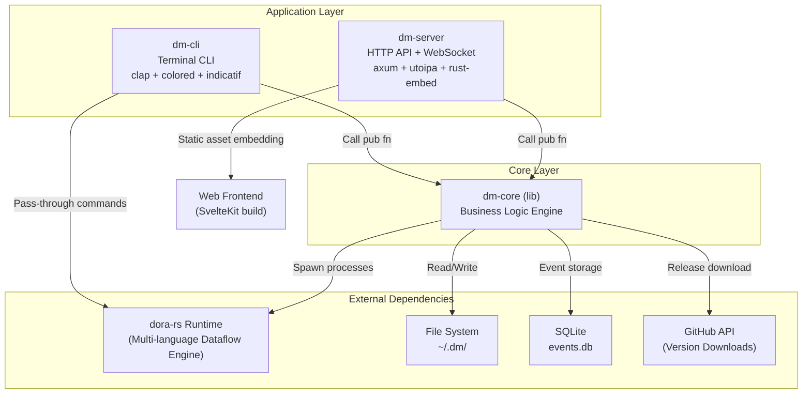
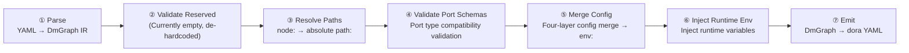
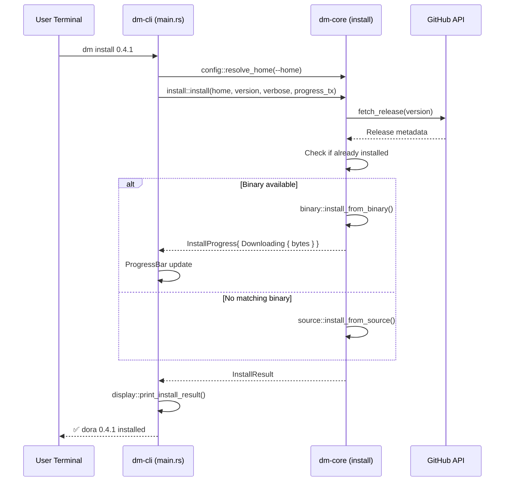

Dora Manager adopts a classic **three-layer separation architecture**, decoupling business logic, CLI interaction, and HTTP services into three independent Rust crates. `dm-core` serves as the pure logic kernel, carrying all core capabilities for interacting with the dora-rs runtime; `dm-cli` and `dm-server` serve as terminal and web access layers respectively, calling the public API exposed by dm-core as thin adapters. This layering allows the same core logic to serve both command-line scripts and browser-based visual dashboards — with zero code duplication.

Sources: [Cargo.toml](https://github.com/l1veIn/dora-manager/blob/master/Cargo.toml), [crates/dm-core/Cargo.toml](https://github.com/l1veIn/dora-manager/blob/master/crates/dm-core/Cargo.toml#L1-L7), [crates/dm-cli/Cargo.toml](https://github.com/l1veIn/dora-manager/blob/master/crates/dm-cli/Cargo.toml#L1-L7), [crates/dm-server/Cargo.toml](https://github.com/l1veIn/dora-manager/blob/master/crates/dm-server/Cargo.toml#L1-L7)

## Layered Architecture Overview

The Mermaid diagram below shows the dependency relationships and responsibility boundaries between the three crates. Prerequisite for reading this diagram: **arrow direction indicates "dependency"** — both dm-cli and dm-server depend on dm-core, while dm-core does not depend on any upper-layer crate.



Sources: [Cargo.toml](https://github.com/l1veIn/dora-manager/blob/master/Cargo.toml), [crates/dm-cli/Cargo.toml](https://github.com/l1veIn/dora-manager/blob/master/crates/dm-cli/Cargo.toml#L13), [crates/dm-server/Cargo.toml](https://github.com/l1veIn/dora-manager/blob/master/crates/dm-server/Cargo.toml#L13)

## dm-core: Core Logic Layer

dm-core is the **headless engine** of the entire system — it doesn't care whether requests come from the terminal or browser, it only handles pure business operations like "install dora version", "start dataflow", and "collect runtime metrics". It exists as a `lib` crate, exposing functionality through `pub fn`, organized internally by domain modules.

### Module Map

dm-core contains **9 core domain modules**, each following a consistent internal structure: `model` (data structures), `repo` (file system read/write), `service` (business orchestration), forming self-contained vertical slices.

```text
dm-core/src/
├── api/              ← Top-level public API (setup, doctor, up/down, versions)
├── config.rs         ← DM_HOME configuration system (config.toml parsing, path conventions)
├── dataflow/         ← Dataflow management (CRUD + import + transpiler)
│   └── transpile/    ← Multi-Pass transpilation pipeline (see separate chapter)
├── dora.rs           ← dora CLI process wrapper (run_dora, exec_dora)
├── env.rs            ← Environment detection (Python, uv, Rust availability)
├── events/           ← Observability event storage (SQLite + XES export)
├── install/          ← dora version installation (GitHub Release download + source compilation)
├── node/             ← Node management (installation, import, dm.json contract)
│   └── schema/       ← Port Schema validation (Arrow type system)
├── runs/             ← Run instance lifecycle (startup, state refresh, metrics collection)
│   ├── service_admin.rs     ← Cleanup, deletion
│   ├── service_query.rs     ← Queries, listing
│   ├── service_runtime.rs   ← State sync, stopping
│   └── service_start.rs     ← Startup orchestration
└── types.rs          ← Cross-module shared data structures (StatusReport, DoctorReport...)
```

Sources: [crates/dm-core/src/lib.rs](https://github.com/l1veIn/dora-manager/blob/master/crates/dm-core/src/lib.rs#L1-L22), [crates/dm-core/src/runs/mod.rs](https://github.com/l1veIn/dora-manager/blob/master/crates/dm-core/src/runs/mod.rs#L1-L26), [crates/dm-core/src/dataflow/mod.rs](https://github.com/l1veIn/dora-manager/blob/master/crates/dm-core/src/dataflow/mod.rs#L1-L23)

### Core Architecture Principle: Node-Agnostic

dm-core follows a key design constraint — **it does not know the existence of any specific node**. This principle ensures the core engine's extensibility: adding new nodes does not require modifying any dm-core code. The transpiler resolves node paths and validates port schemas by reading `dm.json` metadata, rather than hardcoding node IDs.

Sources: [docs/architecture-principles.md](https://github.com/l1veIn/dora-manager/blob/master/docs/architecture-principles.md#L48-L65), [crates/dm-core/src/dataflow/transpile/passes.rs](https://github.com/l1veIn/dora-manager/blob/master/crates/dm-core/src/dataflow/transpile/passes.rs#L101-L108)

### Dataflow Transpiler (Transpiler): Multi-Pass Pipeline

The transpiler is the most core subsystem in dm-core, responsible for translating user-written DM-flavour YAML into standard dora-rs executable YAML. The entire pipeline consists of **6 sequential Passes**, each focusing on a single responsibility:



| Pass | Responsibility | Dependencies |
|------|------|------|
| Parse | Parses raw YAML into a typed `DmGraph` IR, distinguishing Managed (`node:` reference) and External (`path:` direct specification) nodes | None |
| Validate Reserved | Reserved slot, originally used for checking reserved node ID conflicts; now emptied following the node-agnostic principle | None |
| Resolve Paths | Resolves `node: dora-qwen` to the absolute executable path under `~/.dm/nodes/dora-qwen/` | dm.json metadata |
| Validate Port Schemas | Validates port schema type compatibility between connected ports (based on Arrow type system) | dm.json ports declaration |
| Merge Config | Merges inline config → flow config → node config → schema default, then injects into `env:` field | dm.json config_schema |
| Inject Runtime Env | Injects runtime environment variables (e.g., run_id) | TranspileContext |
| Emit | Serializes processed `DmGraph` IR into standard dora-rs YAML | None |

Sources: [crates/dm-core/src/dataflow/transpile/mod.rs](https://github.com/l1veIn/dora-manager/blob/master/crates/dm-core/src/dataflow/transpile/mod.rs#L1-L82), [crates/dm-core/src/dataflow/transpile/passes.rs](https://github.com/l1veIn/dora-manager/blob/master/crates/dm-core/src/dataflow/transpile/passes.rs#L1-L95)

### Configuration System: DM_HOME

All persistent state is organized under the `~/.dm/` root directory. Path resolution follows a priority chain: `--home` command-line parameter > `DM_HOME` environment variable > `~/.dm` default path. The core configuration file is `config.toml`, with type-safe read/write via `serde`.

```text
~/.dm/
├── config.toml           ← Global config (active_version, media settings)
├── events.db             ← SQLite event storage (WAL mode)
├── versions/             ← Installed dora binaries
│   └── 0.4.1/dora
├── nodes/                ← Installed nodes
│   └── dora-qwen/
│       ├── dm.json       ← Node metadata contract
│       └── ...
├── dataflows/            ← Imported dataflow projects
└── runs/                 ← Run instance history
    └── <uuid>/
        ├── run.json      ← Run state snapshot
        ├── snapshot.yml  ← Original YAML snapshot
        ├── transpiled.yml← Transpiled dora YAML
        └── logs/         ← Node logs
```

Sources: [crates/dm-core/src/config.rs](https://github.com/l1veIn/dora-manager/blob/master/crates/dm-core/src/config.rs#L105-L166), [crates/dm-core/src/runs/repo.rs](https://github.com/l1veIn/dora-manager/blob/master/crates/dm-core/src/runs/mod.rs#L13-L17)

### Event System: SQLite + XES

dm-core includes a **thread-safe SQLite event store** using `Mutex<Connection>` + WAL mode for concurrency safety. All critical operations (version installation, dataflow transpilation, run start/stop) automatically emit structured events, supporting filtered queries by source, case_id, activity, time range, and other dimensions, with export to XES format for process mining analysis.

Sources: [crates/dm-core/src/events/mod.rs](https://github.com/l1veIn/dora-manager/blob/master/crates/dm-core/src/events/mod.rs#L1-L16), [crates/dm-core/src/events/store.rs](https://github.com/l1veIn/dora-manager/blob/master/crates/dm-core/src/events/store.rs#L10-L44)

## dm-cli: Terminal Access Layer

dm-cli is an ultra-thin command-line adapter. Its entire responsibility can be summarized in three points: **parse arguments** (via `clap`), **call dm-core** (via `dm_core::xxx`), and **format output** (via `colored` + `indicatif`). It contains no business logic — even progress bar callback data comes from dm-core's `mpsc` channel.

### Command Structure

```text
dm
├── setup          ← One-click install (Python + uv + dora)
├── doctor         ← Environment health diagnosis
├── install        ← Install specified dora version
├── uninstall      ← Uninstall version
├── use            ← Switch active version
├── versions       ← List installed and available versions
├── up             ← Start dora coordinator + daemon
├── down           ← Stop runtime
├── status         ← Runtime status overview
├── node           ← Node management subcommands
│   ├── install
│   ├── import
│   ├── list
│   └── uninstall
├── dataflow       ← Dataflow management subcommands
│   └── import
├── start          ← Start dataflow (auto-ensures runtime is up)
├── runs           ← Run history management
│   ├── stop
│   ├── delete
│   ├── logs
│   └── clean
└── --              ← Pass-through to native dora CLI
```

Sources: [crates/dm-cli/src/main.rs](https://github.com/l1veIn/dora-manager/blob/master/crates/dm-cli/src/main.rs#L11-L106), [crates/dm-cli/src/cmd/mod.rs](https://github.com/l1veIn/dora-manager/blob/master/crates/dm-cli/src/cmd/mod.rs#L1-L4)

### Typical Call Flow

Using `dm install` as an example, the complete call chain is as follows:



Sources: [crates/dm-cli/src/main.rs](https://github.com/l1veIn/dora-manager/blob/master/crates/dm-cli/src/main.rs#L304-L351), [crates/dm-core/src/install/mod.rs](https://github.com/l1veIn/dora-manager/blob/master/crates/dm-core/src/install/mod.rs#L18-L90)

## dm-server: HTTP Access Layer

dm-server is built on **Axum**, adding HTTP routing, WebSocket real-time pushing, Swagger documentation generation, and frontend static asset embedding capabilities on top of dm-core. It listens on `127.0.0.1:3210`, providing a complete RESTful API for the web visual dashboard.

### Service State Model

The global state of dm-server is managed through the `AppState` struct, wrapped in `Arc` for zero-cost sharing:

```text
AppState (Clone)
├── home: Arc<PathBuf>           ← DM_HOME path
├── events: Arc<EventStore>      ← SQLite event store
├── messages: broadcast::Sender  ← Message notification broadcast channel
└── media: Arc<MediaRuntime>     ← Media backend runtime
```

Sources: [crates/dm-server/src/state.rs](https://github.com/l1veIn/dora-manager/blob/master/crates/dm-server/src/state.rs#L1-L25)

### API Route Structure

HTTP APIs are organized into 9 route groups by functional domain, totaling approximately 50+ endpoints:

| Route Prefix | Functional Domain | dm-core Delegation Target |
|----------|--------|------------------|
| `/api/doctor`, `/api/versions`, `/api/status` | Environment management | `api::doctor`, `api::versions`, `api::status` |
| `/api/install`, `/api/uninstall`, `/api/use`, `/api/up`, `/api/down` | Runtime management | `api::install`, `api::up/down` |
| `/api/nodes` | Node management | `node::list_nodes`, `node::install_node`, `node::import_*` |
| `/api/dataflows` | Dataflow management | `dataflow::list`, `dataflow::get`, `dataflow::save` |
| `/api/dataflow/start`, `/api/dataflow/stop` | Dataflow execution | `runs::start_run_from_yaml`, `runs::stop_run` |
| `/api/runs` | Run history | `runs::list_runs`, `runs::get_run`, `runs::delete_run` |
| `/api/runs/{id}/messages`, `/api/runs/{id}/streams` | Interactive messages | `services::message` (dm-server private) |
| `/api/runs/{id}/ws` | WebSocket real-time push | File system monitoring + `notify` crate |
| `/api/events` | Observability | `events::EventStore` |

Sources: [crates/dm-server/src/main.rs](https://github.com/l1veIn/dora-manager/blob/master/crates/dm-server/src/main.rs#L96-L225), [crates/dm-server/src/handlers/mod.rs](https://github.com/l1veIn/dora-manager/blob/master/crates/dm-server/src/handlers/mod.rs#L1-L43)

### Handler Delegation Pattern

Each handler in dm-server follows a uniform **thin delegation pattern** — extracting parameters from HTTP requests, calling the corresponding dm-core function, and serializing the result as JSON for return. The handler layer contains no business logic, only handling HTTP semantics (status codes, error formatting).

Using `GET /api/doctor` as an example, the handler implementation has only 4 lines of effective code:

```rust
pub async fn doctor(State(state): State<AppState>) -> impl IntoResponse {
    match dm_core::doctor(&state.home).await {
        Ok(report) => Json(report).into_response(),
        Err(e) => err(e).into_response(),
    }
}
```

Sources: [crates/dm-server/src/handlers/system.rs](https://github.com/l1veIn/dora-manager/blob/master/crates/dm-server/src/handlers/system.rs#L13-L19)

### WebSocket Real-Time Push

dm-server provides real-time data pushing for running instances through the `run_ws` handler. The WebSocket connection uses the `notify` crate to monitor file change events in the log directory, and cooperates with a timer to push metrics data every second. Pushed message types include: `Ping` (heartbeat), `Metrics` (node metrics), `Logs` (node logs), `Io` (interaction messages marked with `[DM-IO]`), `Status` (run state changes).

Sources: [crates/dm-server/src/handlers/run_ws.rs](https://github.com/l1veIn/dora-manager/blob/master/crates/dm-server/src/handlers/run_ws.rs#L16-L149)

### Frontend Static Embedding

dm-server embeds the compiled SvelteKit artifacts (`web/build/` directory) into the Rust binary at compile time via `rust_embed`. At runtime, unmatched API requests are directed to frontend static resource serving through a `fallback` route, achieving **single-binary deployment** — no need for additional nginx or CDN.

Sources: [crates/dm-server/src/main.rs](https://github.com/l1veIn/dora-manager/blob/master/crates/dm-server/src/main.rs#L20-L22), [crates/dm-server/src/main.rs](https://github.com/l1veIn/dora-manager/blob/master/crates/dm-server/src/main.rs#L225)

### Server-Exclusive Modules

dm-server has two **server-exclusive modules** that don't exist in dm-core:

- **`services::media`**: Manages the complete lifecycle of the MediaMTX media backend (download, startup, health probe), supporting RTSP/HLS/WebRTC streaming protocols. This module encapsulates process management and configuration file generation logic, only needed in dm-server, hence placed in the server layer rather than core.
- **`services::message`**: SQLite-based run instance interactive message persistence, handling bidirectional message passing between nodes and the web frontend.

Sources: [crates/dm-server/src/services/media.rs](https://github.com/l1veIn/dora-manager/blob/master/crates/dm-server/src/services/media.rs#L1-L106), [crates/dm-server/src/services/mod.rs](https://github.com/l1veIn/dora-manager/blob/master/crates/dm-server/src/services/mod.rs#L1-L57)

### Background Tasks

In addition to the main service, dm-server starts a background idle monitoring coroutine that checks every 30 seconds for active run instances. When all runs end, it automatically executes `dm_core::auto_down_if_idle` to release dora runtime resources.

Sources: [crates/dm-server/src/main.rs](https://github.com/l1veIn/dora-manager/blob/master/crates/dm-server/src/main.rs#L234-L241)

## Three-Layer Comparison Quick Reference

| Dimension | dm-core | dm-cli | dm-server |
|------|---------|--------|-----------|
| **Crate type** | `lib` | `bin` (`dm`) | `bin` (`dm-server`) |
| **Core responsibility** | All business logic | CLI argument parsing + terminal rendering | HTTP routing + WebSocket + static resources |
| **Dependency direction** | Being depended on (zero upper dependencies) | → dm-core | → dm-core |
| **Unique dependencies** | rusqlite, sha2, zip | clap, colored, indicatif, dora-core | axum, utoipa, rust-embed, notify |
| **State management** | Stateless functions + file system | Stateless (each command is an independent process) | `AppState` (Arc shared) |
| **Output method** | Returns `Result<T>` | `println!` + colored + progress bars | `Json` + HTTP status codes |
| **Testing strategy** | Unit tests (tempdir isolation) | Integration tests (`assert_cmd`) | Handler-level tests |

Sources: [crates/dm-core/Cargo.toml](https://github.com/l1veIn/dora-manager/blob/master/crates/dm-core/Cargo.toml#L1-L30), [crates/dm-cli/Cargo.toml](https://github.com/l1veIn/dora-manager/blob/master/crates/dm-cli/Cargo.toml#L1-L30), [crates/dm-server/Cargo.toml](https://github.com/l1veIn/dora-manager/blob/master/crates/dm-server/Cargo.toml#L1-L35)

## Design Decisions and Trade-offs

### Why Three-Layer Separation Instead of Two?

Splitting CLI and Server into separate crates rather than distinguishing them with subcommands in the same binary is based on the following considerations:

1. **Dependency isolation**: dm-cli needs `dora-core` for YAML parsing (for the `start` command), while dm-server needs `axum` + `utoipa` and other HTTP ecosystem; merging would introduce unnecessary compilation dependencies.
2. **Deployment flexibility**: CI/CD environments may only need the `dm` CLI, while web dashboard scenarios need `dm-server`. Independent distribution avoids carrying unnecessary dependencies.
3. **Compilation speed**: When dm-core changes, only dm-core + dependent crates need recompilation; if CLI and Server were in the same crate, any change would require full recompilation.

Sources: [Cargo.toml](https://github.com/l1veIn/dora-manager/blob/master/Cargo.toml), [docs/architecture-principles.md](https://github.com/l1veIn/dora-manager/blob/master/docs/architecture-principles.md#L48-L65)

### Why Does dm-core Use a Functional API Instead of Trait-Based Architecture?

dm-core exposes a set of `pub async fn` and `pub fn` rather than object-oriented trait interfaces. This choice enables:
- **Zero boilerplate for callers**: CLI and Server can directly call `dm_core::up(&home, verbose)`, without implementing traits or constructing complex context objects.
- **Test-friendly**: Internal modules achieve testability through the `RuntimeBackend` trait (visible in `service_start.rs`), but this abstraction is limited to internal use and not exposed to callers.
- **Progressive complexity**: Traits are only introduced at boundaries that truly need polymorphism (e.g., runtime backend), avoiding over-engineering.

Sources: [crates/dm-core/src/lib.rs](https://github.com/l1veIn/dora-manager/blob/master/crates/dm-core/src/lib.rs#L18-L22), [crates/dm-core/src/runs/service.rs](https://github.com/l1veIn/dora-manager/blob/master/crates/dm-core/src/runs/service.rs#L34-L44)

## Further Reading

- To deep dive into the dataflow transpiler's multi-Pass pipeline and four-layer config merge mechanism, read [Dataflow Transpiler: Multi-Pass Pipeline and Four-Layer Config Merge](08-transpiler.md).
- To understand node installation, import, and path resolution details, read [Node Management: Installation, Import, Path Resolution, and Sandbox Isolation](09-node-management.md).
- To learn about run instance startup orchestration and metrics collection flow, read [Runtime Service: Startup Orchestration, State Refresh, and Metrics Collection](10-runtime-service).
- For the complete HTTP API endpoint list and Swagger documentation, read [HTTP API Route Overview and Swagger Documentation](12-http-api).
- For the DM_HOME directory structure and config.toml configuration system, read [Configuration System: DM_HOME Directory Structure and config.toml](13-config-system).