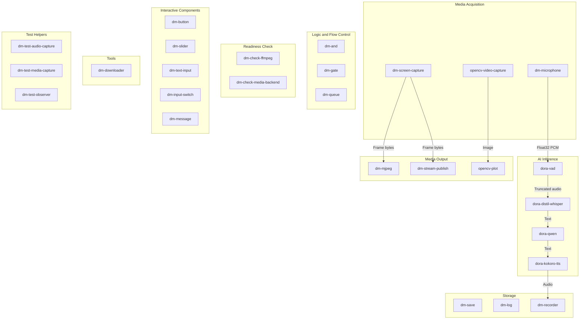
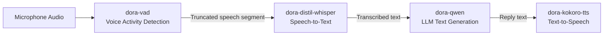
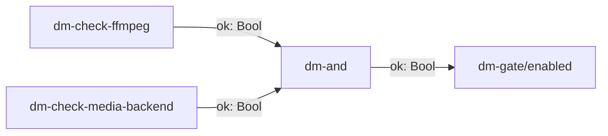
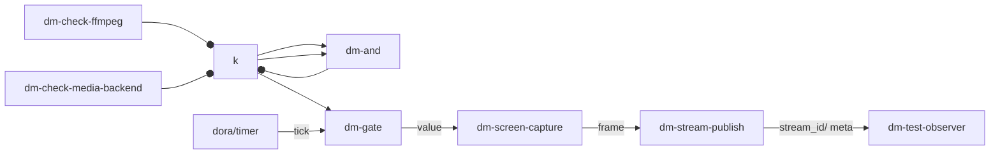
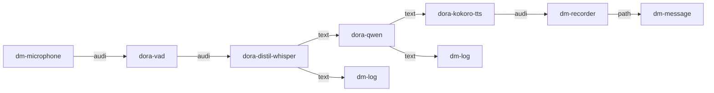

Dora Manager's `nodes/` directory includes **27 built-in nodes**, covering the complete dataflow construction needs from signal acquisition, logic control, and AI inference to storage persistence. These nodes are described through a unified `dm.json` contract that defines ports, configuration, and runtime metadata. They can be referenced directly in YAML dataflows without additional installation (unless you need to pull precompiled packages from the Hub). Node discovery order is: `~/.dm/nodes` (user-installed) takes priority over the repository's built-in `nodes/` directory, and the latter can be extended via the `DM_NODE_DIRS` environment variable.

Sources: [README.md](https://github.com/l1veIn/dora-manager/blob/main/nodes/README.md#L1-L12)

## Node Overview and Categories

Before diving into each node, let's establish an overall understanding. The diagram below shows the grouping and typical data flow directions of all 27 built-in nodes by functional domain:



The connections in the diagram above illustrate the data flow direction of the most classic AI voice pipeline (Microphone -> VAD -> Whisper -> Qwen -> TTS) and media pipeline (Screen -> Stream Publish -> Web UI). Below, we expand on each functional domain one by one.

Sources: [README.md](https://github.com/l1veIn/dora-manager/blob/main/nodes/README.md#L1-L12)

### Quick Reference Table

| Category | Node ID | Language | Summary | Core Capability Tag |
|----------|---------|----------|---------|---------------------|
| Media Acquisition | `dm-microphone` | Python | Microphone audio capture with device selection | `media` |
| Media Acquisition | `dm-screen-capture` | Python | Screen capture | `configurable` |
| Media Acquisition | `opencv-video-capture` | Python | OpenCV camera capture | — |
| Media Output | `dm-mjpeg` | Rust | MJPEG-over-HTTP preview endpoint | `media` |
| Media Output | `dm-stream-publish` | Python | Frame stream publishing to media backend | `media` |
| Media Output | `opencv-plot` | Python | OpenCV image annotation drawing | — |
| AI Inference | `dora-distil-whisper` | Python | Whisper speech-to-text | — |
| AI Inference | `dora-vad` | Python | Silero VAD voice activity detection | — |
| AI Inference | `dora-qwen` | Python | Qwen LLM text generation | — |
| AI Inference | `dora-kokoro-tts` | Python | Kokoro text-to-speech | — |
| AI Inference | `dora-yolo` | Python | YOLOv8 object detection | `configurable` |
| Logic Flow Control | `dm-and` | Python | Boolean AND aggregation | `configurable` |
| Logic Flow Control | `dm-gate` | Python | Conditional gate (enable/disable passthrough) | `configurable` |
| Logic Flow Control | `dm-queue` | Rust | FIFO buffering and flush control | `streaming` |
| Readiness Check | `dm-check-ffmpeg` | Python | Check FFmpeg availability | `configurable` |
| Readiness Check | `dm-check-media-backend` | Python | Check media backend readiness | `configurable` |
| Interactive Components | `dm-button` | Python | Button trigger widget | `widget_input` |
| Interactive Components | `dm-slider` | Python | Numeric slider widget | `widget_input` |
| Interactive Components | `dm-text-input` | Python | Text input widget | `widget_input` |
| Interactive Components | `dm-input-switch` | Python | Boolean switch widget | `widget_input` |
| Interactive Components | `dm-message` | Python | Content display (text/image/audio, etc.) | `display` |
| Storage | `dm-save` | Python | Binary file persistence | `configurable` |
| Storage | `dm-log` | Python | Append-only log serialization | `configurable` |
| Storage | `dm-recorder` | Python | Audio WAV recording | `media` |
| Tools | `dm-downloader` | Python | Model weight download with hash verification | `configurable` |
| Test | `dm-test-audio-capture` | Python | Fixed-duration microphone capture | — |
| Test | `dm-test-media-capture` | Python | Screenshot/screen recording capture | — |
| Test | `dm-test-observer` | Python | Multimodal event aggregation observer | — |

Sources: [registry.json](https://github.com/l1veIn/dora-manager/blob/main/registry.json)

## Media Acquisition Nodes

Media acquisition nodes are responsible for obtaining raw data from physical devices or the operating system, serving as the "source" end of the dataflow.

### dm-microphone: Microphone Audio Capture

**dm-microphone** captures microphone input via the `sounddevice` library, outputting a Float32 PCM audio stream. It supports runtime device switching — at startup, the node publishes a list of available devices (JSON) on the `devices` port, and the UI layer can dynamically switch devices via the `device_id` input port. The capture buffer is controlled by `max_duration` (default 0.1 seconds); once enough data is collected, it is sent to the `audio` port in one batch. `sample_rate` supports five options: 8000/16000/24000/44100/48000.

| Port | Direction | Type | Description |
|------|-----------|------|-------------|
| `audio` | Output | Float32 PCM | Continuous audio stream |
| `devices` | Output | UTF-8 JSON | List of available devices |
| `device_id` | Input | UTF-8 | Selected device ID |
| `tick` | Input | null | Heartbeat keep-alive |

Key configuration: `sample_rate` (default 16000Hz), `max_duration` (buffer duration, default 0.1s).

Sources: [dm.json](https://github.com/l1veIn/dora-manager/blob/main/nodes/dm-microphone/dm.json#L34-L75), [main.py](https://github.com/l1veIn/dora-manager/blob/main/nodes/dm-microphone/dm_microphone/main.py)

### dm-screen-capture: Screen Capture

**dm-screen-capture** captures screen frames via the FFmpeg backend, encoding them as PNG or JPEG bytes for output. It supports three capture modes: `once` (capture a single frame at startup and exit), `repeat` (continuously capture at a fixed interval), and `triggered` (capture a single frame each time the `trigger` port receives an event). In `triggered` mode, it can precisely coordinate with timer or gate nodes for on-demand capture.

| Port | Direction | Type | Description |
|------|-----------|------|-------------|
| `trigger` | Input | null | Optional trigger signal (triggered mode) |
| `frame` | Output | UInt8 encoded frame | PNG or JPEG image bytes |
| `meta` | Output | UTF-8 JSON | Frame metadata |

Key configuration: `mode` (once/repeat/triggered), `width`/`height` (default 1280x720), `output_format` (png/jpeg), `interval_sec` (repeat mode interval).

Sources: [dm.json](https://github.com/l1veIn/dora-manager/blob/main/nodes/dm-screen-capture/dm.json#L33-L77), [main.py](https://github.com/l1veIn/dora-manager/blob/main/nodes/dm-screen-capture/dm_screen_capture/main.py)

### opencv-video-capture: OpenCV Camera Capture

**opencv-video-capture** is a community node from Dora Hub that uses OpenCV's `VideoCapture` interface to capture camera frames. Frame capture is triggered via the `tick` port, outputting image arrays with width/height/encoding metadata. This node's `dm.json` does not declare `ports`; port information comes from its README documentation conventions.

Key environment variables: `PATH` (camera index, default 0), `IMAGE_WIDTH`/`IMAGE_HEIGHT`, `JPEG_QUALITY` (encoding quality).

Sources: [dm.json](https://github.com/l1veIn/dora-manager/blob/main/nodes/opencv-video-capture/dm.json#L1-L39), [main.py](https://github.com/l1veIn/dora-manager/blob/main/nodes/opencv-video-capture/opencv_video_capture/main.py)

## Media Output Nodes

Media output nodes are responsible for rendering frames or images from the dataflow to the user or pushing them to downstream services.

### dm-mjpeg: MJPEG-over-HTTP Live Preview

**dm-mjpeg** is one of only two Rust native nodes in Dora Manager (the other being `dm-queue`). It starts a local `axum`-based HTTP server that exposes frames from the Dora dataflow to browsers in MJPEG format. It supports three HTTP endpoints: `/stream` (continuous MJPEG stream), `/snapshot.jpg` (single frame snapshot), and `/healthz` (health check).

| Port | Direction | Type | Description |
|------|-----------|------|-------------|
| `frame` | Input | UInt8 | Image bytes (supports jpeg/rgb8/rgba8/yuv420p) |

Internally, it uses the `tokio` async runtime to separate the Dora event loop from the HTTP service thread, passing frame data through a `watch` channel. The `drop_if_no_client` configuration (default true) skips frame processing when no HTTP client is connected, saving CPU. The `FrameProcessor` implements frame rate limiting via the `max_fps` configuration to avoid browser-side CPU overload.

Sources: [dm.json](https://github.com/l1veIn/dora-manager/blob/main/nodes/dm-mjpeg/dm.json#L1-L102), [main.rs](https://github.com/l1veIn/dora-manager/blob/main/nodes/dm-mjpeg/src/main.rs#L1-L131), [lib.rs](https://github.com/l1veIn/dora-manager/blob/main/nodes/dm-mjpeg/src/lib.rs#L1-L200)

### dm-stream-publish: Stream Publishing

**dm-stream-publish** receives encoded image frames and pushes them to the dm-server media backend (based on mediamtx) via an FFmpeg pipeline, enabling the Web UI's `VideoPanel` to render live video streams. At startup, it registers the stream with dm-server via HTTP API, then continuously pushes H.264 encoded data to RTSP/RTMP endpoints. It outputs `stream_id` (stream identifier) and `meta` (stream metadata JSON) for downstream node consumption.

| Port | Direction | Type | Description |
|------|-----------|------|-------------|
| `frame` | Input | UInt8 | PNG/JPEG encoded image |
| `stream_id` | Output | UTF-8 | Published stream identifier |
| `meta` | Output | UTF-8 JSON | Stream metadata |

Typical composition pattern: `dm-screen-capture` (triggered mode) -> `dm-stream-publish`, with a complete example in [system-test-stream.yml](https://github.com/l1veIn/dora-manager/blob/main/tests/dataflows/system-test-stream.yml#L39-L65).

Sources: [dm.json](https://github.com/l1veIn/dora-manager/blob/main/nodes/dm-stream-publish/dm.json#L1-L123), [main.py](https://github.com/l1veIn/dora-manager/blob/main/nodes/dm-stream-publish/dm_stream_publish/main.py)

### opencv-plot: OpenCV Image Annotation

**opencv-plot** draws bounding boxes (bbox), text, and annotations on a base image, with the typical use case being visualization of object detection results. Inputs include `image` (base image array), `bbox` (detection boxes/confidence/labels), and `text` (annotation text), with the output being the annotated image. This node follows the interface conventions of Dora Hub community nodes.

Sources: [dm.json](https://github.com/l1veIn/dora-manager/blob/main/nodes/opencv-plot/dm.json#L1-L38), [main.py](https://github.com/l1veIn/dora-manager/blob/main/nodes/opencv-plot/opencv_plot/main.py)

## AI Inference Nodes

AI inference nodes encapsulate model inference capabilities in the domains of speech, language, and vision, forming Dora Manager's most valuable "intelligence layer."



### dora-vad: Voice Activity Detection

**dora-vad** is based on the Silero VAD model, detecting the start and end points of speech in a continuous audio stream, outputting only audio segments that contain valid speech. It continuously accumulates an audio buffer and only triggers output when speech end is detected (silence persists beyond `MIN_SILENCE_DURATION_MS`, default 200ms). `MAX_AUDIO_DURATION_S` (default 75s) limits the maximum length of a single output audio segment to avoid memory overflow.

| Port | Direction | Type | Description |
|------|-----------|------|-------------|
| `audio` | Input | Float32 | Continuous audio stream (8kHz or 16kHz) |
| `audio` | Output | Float32 | Truncated speech segment |
| `timestamp_start` | Output | Int | Speech start timestamp |
| `timestamp_end` | Output | Int | Speech end timestamp |

Key environment variables: `THRESHOLD` (detection threshold, default 0.4), `MIN_SILENCE_DURATION_MS` (silence判定duration), `MIN_SPEECH_DURATION_MS` (minimum speech duration).

Sources: [main.py](https://github.com/l1veIn/dora-manager/blob/main/nodes/dora-vad/dora_vad/main.py#L1-L90), [dm.json](https://github.com/l1veIn/dora-manager/blob/main/nodes/dora-vad/dm.json#L1-L39)

### dora-distil-whisper: Speech-to-Text

**dora-distil-whisper** wraps the OpenAI Whisper model series (default `whisper-large-v3-turbo`), transcribing audio to text. On macOS, it automatically switches to MLX Whisper for accelerated inference; on Linux, it uses HuggingFace Transformers with CUDA inference. The node includes built-in denoising logic (`remove_text_noise`) and repeated text detection (`cut_repetition`), automatically filtering common noise text produced by model hallucinations.

| Port | Direction | Type | Description |
|------|-----------|------|-------------|
| `input` | Input | Float32 audio | Speech segment from VAD |
| `text` | Output | UTF-8 | Transcribed text |

Key environment variables: `TARGET_LANGUAGE` (default english), `MODEL_NAME_OR_PATH`, `TRANSLATE` (whether to use translation mode). The node also accepts a `text_noise` input port for removing repeated noise from LLM replies.

Sources: [main.py](https://github.com/l1veIn/dora-manager/blob/main/nodes/dora-distil-whisper/dora_distil_whisper/main.py#L1-L200), [dm.json](https://github.com/l1veIn/dora-manager/blob/main/nodes/dora-distil-whisper/dm.json#L1-L39)

### dora-qwen: Qwen LLM Inference

**dora-qwen** wraps the Qwen2.5 series language models, supporting multi-turn conversation. On macOS, it uses `llama-cpp-python` (GGUF format); on Linux, it uses HuggingFace Transformers + CUDA. The default model is `Qwen/Qwen2.5-0.5B-Instruct-GGUF`, which can be replaced with a larger model via the `MODEL_NAME_OR_PATH` environment variable.

This node maintains conversation history (a `history` list) and supports injecting system prompts, images, and tool call results through special prefixes (`<|im_start|>`, `<|vision_start|>`, `<|tool|>`). The `ACTIVATION_WORDS` environment variable can restrict reply generation to only when user input contains specific keywords.

| Port | Direction | Type | Description |
|------|-----------|------|-------------|
| `text` / `system_prompt` / `tools` | Input | UTF-8 | Conversation input, system prompt, tool definitions |
| `text` | Output | UTF-8 | Model-generated text |

Sources: [main.py](https://github.com/l1veIn/dora-manager/blob/main/nodes/dora-qwen/dora_qwen/main.py#L1-L230), [dm.json](https://github.com/l1veIn/dora-manager/blob/main/nodes/dora-qwen/dm.json#L1-L39)

### dora-kokoro-tts: Text-to-Speech

**dora-kokoro-tts** converts text to speech based on the Kokoro-82M model. It supports automatic Chinese/English detection — when Chinese characters are detected, it automatically switches to the `lang_code="z"` pipeline. It outputs a 24kHz Float32 audio stream, sent in sentence segments. Text preprocessing removes `<think...</think` tag content (from LLM reasoning chains), ensuring only valid text is synthesized.

| Port | Direction | Type | Description |
|------|-----------|------|-------------|
| `text` | Input | UTF-8 | Text to synthesize |
| `audio` | Output | Float32 | 24kHz PCM audio |

Key environment variables: `LANGUAGE` (default "a", i.e., American English), `VOICE` (default "af_heart"), `REPO_ID` (default "hexgrad/Kokoro-82M").

Sources: [main.py](https://github.com/l1veIn/dora-manager/blob/main/nodes/dora-kokoro-tts/dora_kokoro_tts/main.py#L1-L81), [dm.json](https://github.com/l1veIn/dora-manager/blob/main/nodes/dora-kokoro-tts/dm.json#L1-L39)

### dora-yolo: YOLO Object Detection

**dora-yolo** implements real-time object detection based on Ultralytics YOLOv8. It accepts image frame input and outputs bounding boxes (bbox, including coordinates, confidence, and class labels) as well as annotated images. It supports both `xyxy` and `xywh` bounding box formats. The unique `confidence` input port allows runtime dynamic adjustment of the detection threshold — a typical usage pattern is real-time parameter tuning via the `dm-slider` widget.

| Port | Direction | Type | Description |
|------|-----------|------|-------------|
| `image` | Input | UInt8 | Image frame (bgr8/rgb8/jpeg/png) |
| `confidence` | Input | Float64 | Runtime confidence threshold override (0.0-1.0) |
| `bbox` | Output | Struct Array | Bounding box + confidence + class label |
| `annotated_image` | Output | UInt8 JPEG | Annotated image |

Key configuration: `model` (default yolov8n.pt), `format` (xyxy/xywh), `confidence` (default 0.25).

Sources: [main.py](https://github.com/l1veIn/dora-manager/blob/main/nodes/dora-yolo/dora_yolo/main.py#L1-L149), [dm.json](https://github.com/l1veIn/dora-manager/blob/main/nodes/dora-yolo/dm.json#L29-L83)

## Logic and Flow Control Nodes

Logic nodes are responsible for conditional branching, signal aggregation, and buffer control of dataflows — they do not produce "new" data, but rather determine "when and how data flows."

### dm-and: Boolean AND Aggregation

**dm-and** performs a logical AND operation on multiple boolean inputs, typically used to aggregate multiple readiness check signals. It predefines 4 boolean input ports (a/b/c/d), and the `expected_inputs` configuration specifies the subset of inputs participating in the AND operation. When `require_all_seen=true` (default), all expected inputs must have received at least one value before the result can be true. Output includes `ok` (boolean result) and `details` (detailed status in JSON format).

| Port | Direction | Type | Description |
|------|-----------|------|-------------|
| `a`/`b`/`c`/`d` | Input | Bool | Boolean inputs |
| `ok` | Output | Bool | AND result |
| `details` | Output | UTF-8 JSON | Detailed information including each input's status |

Typical usage: aggregate `dm-check-ffmpeg/ok` and `dm-check-media-backend/ok`, starting the streaming pipeline only when both are ready.

Sources: [dm.json](https://github.com/l1veIn/dora-manager/blob/main/nodes/dm-and/dm.json#L1-L103), [main.py](https://github.com/l1veIn/dora-manager/blob/main/nodes/dm-and/dm_and/main.py#L1-L94)

### dm-gate: Conditional Gate

**dm-gate** implements a simple "on/off gate" — only when the `enabled` input is `true` are events from the `value` input forwarded to the output. When the gate is closed, events are silently discarded. The `emit_on_enable` configuration (default false) controls whether the cached previous value is immediately forwarded when the gate opens. For timer pulse payloads that cannot be directly serialized, the node falls back to sending a `pa.nulls(1)` empty pulse, ensuring trigger-based downstream nodes still work.

| Port | Direction | Type | Description |
|------|-----------|------|-------------|
| `enabled` | Input | Bool | Gate control switch |
| `value` | Input | Any | Value to be gated |
| `value` | Output | Any | Forwarded value |

Typical usage: `dm-and/ok` -> `dm-gate/enabled`, combined with a timer to implement a "only trigger on schedule after ready" pattern.

Sources: [dm.json](https://github.com/l1veIn/dora-manager/blob/main/nodes/dm-gate/dm.json#L1-L72), [main.py](https://github.com/l1veIn/dora-manager/blob/main/nodes/dm-gate/dm_gate/main.py#L1-L82)

### dm-queue: FIFO Buffering and Flow Control

**dm-queue** is a Rust native node providing FIFO buffering, flush signaling, ring overwrite, and disk overflow capabilities. It is the core tool in dataflows for handling rate mismatch issues — when the producer is faster than the consumer, data queues up in the buffer and is flushed in one batch when conditions are met.

| Port | Direction | Type | Description |
|------|-----------|------|-------------|
| `data` | Input | Binary | Arbitrary data to buffer |
| `control` | Input | UTF-8 | Control commands (flush/reset/stop) |
| `tick` | Input | null | Timed heartbeat (triggers timeout flush) |
| `flushed` | Output | Binary | Data after flush |
| `buffering` | Output | UTF-8 JSON | Buffer status |
| `error` | Output | UTF-8 JSON | Error information |

Flush strategy is configured via `flush_on`: `signal` (flush when a control command is received) or `full` (auto-flush when buffer is full). `flush_timeout` supports timeout-based auto-flush. `max_size_bytes` (default 2MB) and `max_size_buffers` (default 100) limit the buffer size.

Sources: [dm.json](https://github.com/l1veIn/dora-manager/blob/main/nodes/dm-queue/dm.json#L1-L154), [main.rs](https://github.com/l1veIn/dora-manager/blob/main/nodes/dm-queue/src/main.rs)

## Readiness Check Nodes

Readiness Check nodes follow a unified output pattern: `ok` (Bool) and `details` (UTF-8 JSON), supporting three runtime modes — `once` (check once at startup), `repeat` (periodically repeat checks), and `triggered` (check when a trigger event is received).



### dm-check-ffmpeg

Checks whether the FFmpeg executable is installed on the local system. Specifies the path via the `ffmpeg_path` configuration (default `ffmpeg`), attempts to execute `ffmpeg -version`, and parses the result.

Sources: [dm.json](https://github.com/l1veIn/dora-manager/blob/main/nodes/dm-check-ffmpeg/dm.json#L1-L84)

### dm-check-media-backend

Checks whether the dm-server media backend service is ready. Probes the health check endpoint of `server_url` (default `http://127.0.0.1:3210`) via HTTP request.

Sources: [dm.json](https://github.com/l1veIn/dora-manager/blob/main/nodes/dm-check-media-backend/dm.json#L1-L84)

## Interactive Component Nodes

Interactive nodes are Dora Manager's "two-way bridge" — they make the Web UI a first-class participant in the dataflow. These nodes declare `widget_input` or `display` capabilities in the `capabilities` field of `dm.json`, marking them as participants in the interactive system.

> For the complete architecture of the interactive system, see [Interactive System Architecture: dm-input / dm-message / Bridge Node Injection Principles](22-jiao-hu-xi-tong-jia-gou-dm-input-dm-message-bridge-jie-dian-zhu-ru-yuan-li).

### dm-button: Button Widget

A pure output node. When the user clicks the button in the UI, the `click` port emits a UTF-8 event. Typical scenarios include one-time operations like "trigger download" or "start recording." Widget registration and event bridging are declared via the `widget_input` capability.

Configuration: `label` (button label, default "Run"), `poll_interval` (reconnection interval, default 1000ms).

Sources: [dm.json](https://github.com/l1veIn/dora-manager/blob/main/nodes/dm-button/dm.json#L1-L99)

### dm-slider: Numeric Slider

A pure output node. When the user drags the slider, the `value` port emits a Float64 value. Supports `min_val` (default 0) / `max_val` (default 100) / `step` (default 1) / `default_value` (default 50) configuration. Typical use case: connect to the `dora-yolo/confidence` port for real-time detection threshold adjustment.

Sources: [dm.json](https://github.com/l1veIn/dora-manager/blob/main/nodes/dm-slider/dm.json#L1-L119)

### dm-text-input: Text Input

A pure output node. When the user submits text, the `value` port emits a UTF-8 string. Supports `multiline` (multiline text area) and `placeholder` configuration.

Sources: [dm.json](https://github.com/l1veIn/dora-manager/blob/main/nodes/dm-text-input/dm.json#L1-L114)

### dm-input-switch: Boolean Switch

A pure output node. When the user toggles the switch, the `value` port emits a boolean value. The `default_value` configuration controls the initial state. Typical use case: controlling whether the microphone is enabled (`dm-microphone/enabled`).

Sources: [dm.json](https://github.com/l1veIn/dora-manager/blob/main/nodes/dm-input-switch/dm.json#L1-L104)

### dm-message: Content Display

A pure input node. It receives two types of data and pushes them via WebSocket to dm-server for display in the Web UI's run workbench:

- **`path` port**: receives file paths (typically from `dm-save`, etc.), automatically inferring the rendering mode based on file extension (`.png` -> image, `.wav` -> audio, `.json` -> json, etc.)
- **`data` port**: receives inline content (text/JSON), pushing it directly to the UI without going through the filesystem

The `render` configuration supports seven modes: `auto`/`text`/`image`/`audio`/`video`/`json`/`markdown`. In `auto` mode, the rendering mode is automatically selected based on the input port and content type. This node declares the `display` capability, using the `bindings` array to precisely describe that the `data` port supports `text/json/markdown` media types, and the `path` port supports `image/audio/video/text/json/markdown` media types.

Sources: [dm.json](https://github.com/l1veIn/dora-manager/blob/main/nodes/dm-message/dm.json#L1-L114)

## Storage Nodes

Storage nodes persist content from the dataflow to disk. They share a convention: write paths are under the current run's `runs/:id/out/` directory, injected via the `DM_RUN_OUT_DIR` environment variable.

### dm-save: File Persistence

**dm-save** writes binary payloads to disk, outputting the absolute path of the written file. It is a key intermediate node in the "frame -> file -> display" pattern, typically used in combination with `dm-message`.

Configuration highlights:
- **Naming template**: `{timestamp}_{seq}` supports timestamp and sequence number variables
- **Capacity control**: three-dimensional limits via `max_files`/`max_total_size`/`max_age`
- **Overwrite mode**: when `overwrite_latest=true`, maintains a stable `latest` file

| Port | Direction | Type | Description |
|------|-----------|------|-------------|
| `data` | Input | Binary | Binary payload to persist |
| `path` | Output | UTF-8 | Absolute path of the written file |

Sources: [dm.json](https://github.com/l1veIn/dora-manager/blob/main/nodes/dm-save/dm.json#L1-L108)

### dm-log: Append-Only Log

**dm-log** serializes input events and appends them to a log file, implemented based on the `loguru` library. It supports three serialization formats (`text`/`json`/`csv`) and log rotation strategies such as `rotation` (e.g., "50 MB") and `retention` (e.g., "7 days").

| Port | Direction | Type | Description |
|------|-----------|------|-------------|
| `data` | Input | UTF-8 | Text/JSON data to serialize |
| `path` | Output | UTF-8 | Absolute path of the log file |

Sources: [dm.json](https://github.com/l1veIn/dora-manager/blob/main/nodes/dm-log/dm.json#L1-L103)

### dm-recorder: Audio WAV Recording

**dm-recorder** aggregates Float32 PCM audio chunks into complete WAV files. The output path can be used with the `dm-message` node's `path` port for audio playback. Supports `sample_rate` (default 16000) and `channels` (default 1) configuration.

| Port | Direction | Type | Description |
|------|-----------|------|-------------|
| `data` | Input | Binary | Audio PCM data chunks |
| `path` | Output | UTF-8 | Absolute path of the WAV file |

Sources: [dm.json](https://github.com/l1veIn/dora-manager/blob/main/nodes/dm-recorder/dm.json#L1-L88)

## Tools and Test Nodes

### dm-downloader: Model Weight Downloader

**dm-downloader** is a downloader node with UI feedback. It supports `sha256:hex` format hash verification, automatic extraction of `tar.gz`/`zip` and other formats, atomic writes (download to `.dm-tmp` then rename), and failure retry. Lifecycle: Checking -> Ready/Waiting -> Downloading -> Verifying -> (Extracting ->) Done. Progress status is pushed to the Web UI via the `ui` port.

| Port | Direction | Type | Description |
|------|-----------|------|-------------|
| `download` | Input | null | Trigger signal |
| `tick` | Input | null | Heartbeat keep-alive |
| `path` | Output | UTF-8 | File/directory path after download completes |
| `ui` | Output | UTF-8 JSON | Widget status updates |

Sources: [dm.json](https://github.com/l1veIn/dora-manager/blob/main/nodes/dm-downloader/dm.json#L1-L101), [README.md](https://github.com/l1veIn/dora-manager/blob/main/nodes/dm-downloader/README.md)

### Test Helper Nodes

Three test nodes are used in system test dataflows, simulating the behavior of real nodes without depending on actual hardware:

| Node | Function |
|------|----------|
| `dm-test-audio-capture` | Fixed-duration microphone capture, outputs `audio`/`audio_stream`/`meta` |
| `dm-test-media-capture` | Screenshot/screen recording capture, outputs `image`/`video`/`meta` |
| `dm-test-observer` | Aggregates multi-source metadata, outputs human-readable summaries and machine-readable JSON |

Sources: [registry.json](https://github.com/l1veIn/dora-manager/blob/main/registry.json)

## Typical Pipeline Compositions

Below are two real-world dataflows demonstrating how nodes work together.

### Object Detection Pipeline: Camera + YOLO + Real-Time Parameter Tuning

```yaml
# From demos/robotics-object-detection.yml
nodes:
  - id: webcam
    node: opencv-video-capture
    inputs:
      tick: dora/timer/millis/100
    config:
      encoding: jpeg

  - id: threshold
    node: dm-slider
    config:
      label: "Detection Confidence"
      min_val: 0.05
      max_val: 0.95
      step: 0.05

  - id: detector
    node: dora-yolo
    inputs:
      image: webcam/image
      confidence: threshold/value
    config:
      model: yolov8n.pt

  - id: save-result
    node: dm-save
    inputs:
      data: detector/annotated_image

  - id: detection-view
    node: dm-message
    inputs:
      path: save-result/path
    config:
      render: image
```

This pipeline demonstrates the complete pattern of "acquire -> infer -> store -> display," while also enabling runtime dynamic parameter adjustment via `dm-slider`.

Sources: [robotics-object-detection.yml](demos/robotics-object-detection.yml#L1-L76)

### Streaming Pipeline: Conditional Start + Live Streaming



This pipeline demonstrates the complete pattern of "readiness check -> AND aggregation -> gated timer -> capture -> publish." Only when both FFmpeg and the media backend are ready does the timer signal pass through the gate to trigger screen capture, and the captured frames are pushed to the Web UI via `dm-stream-publish`.

Sources: [system-test-stream.yml](https://github.com/l1veIn/dora-manager/blob/main/tests/dataflows/system-test-stream.yml#L1-L77)

### AI Voice Conversation Pipeline



This is the core path of the complete pipeline in [qwen-dev.yml](https://github.com/l1veIn/dora-manager/blob/main/tests/dataflows/qwen-dev.yml#L1-L257): microphone capture -> VAD speech detection -> Whisper transcription -> Qwen reply generation -> Kokoro TTS speech synthesis -> Recorder audio file recording -> Display playback. The output of each AI stage is also connected to `dm-log` for debug tracing, while `dm-input-switch` controls the microphone's enabled state.

Sources: [qwen-dev.yml](https://github.com/l1veIn/dora-manager/blob/main/tests/dataflows/qwen-dev.yml#L1-L257)

## Design Pattern Summary

Looking across all built-in nodes, several recurring design patterns can be identified:

**Readiness Signal Pattern**: `dm-check-*` nodes output a unified `{ok, details}` pair, aggregated via `dm-and` to control `dm-gate`, ensuring downstream pipelines only start when dependencies are ready.

**Storage Family Pattern**: `dm-save`/`dm-log`/`dm-recorder` share the "write file -> output path -> dm-message display" chain, with the `DM_RUN_OUT_DIR` environment variable centrally managing the output directory.

**Interactive Widget Pattern**: `dm-button`/`dm-slider`/`dm-text-input`/`dm-input-switch` are all pure output nodes that declare widget types via the `widget_input` capability, with the Web UI runtime automatically rendering the corresponding Widget.

**Port Schema Declaration**: Nodes with the Dora Manager prefix (`dm-*`) declare complete Arrow type schemas in the `ports` array of `dm.json`, while nodes with the Dora Hub prefix (`dora-*`/`opencv-*`) mostly have empty arrays, with port information depending on README documentation conventions. For the complete specification on port validation, see [Port Schema and Port Type Validation](8-port-schema-yu-duan-kou-lei-xing-xiao-yan).

Sources: [dm.json example](https://github.com/l1veIn/dora-manager/blob/main/nodes/dm-and/dm.json#L1-L103), [registry.json](https://github.com/l1veIn/dora-manager/blob/main/registry.json)

## Further Reading

- [Port Schema and Port Type Validation](8-port-schema-yu-duan-kou-lei-xing-xiao-yan) — Understanding the design principles of the port type system and Arrow type declarations
- [Interactive System Architecture: dm-input / dm-message / Bridge Node Injection Principles](22-jiao-hu-xi-tong-jia-gou-dm-input-dm-message-bridge-jie-dian-zhu-ru-yuan-li) — Runtime communication architecture and WebSocket message flow of interactive nodes
- [Custom Node Development Guide: Complete dm.json Field Reference](9-zi-ding-yi-jie-dian-kai-fa-zhi-nan-dm-json-wan-zheng-zi-duan-can-kao) — How to develop and register your own nodes
- [Testing Strategy: Unit Tests, Dataflow Integration Tests, and System Test CheckList](26-ce-shi-ce-lue-dan-yuan-ce-shi-shu-ju-liu-ji-cheng-ce-shi-yu-xi-tong-ce-shi-checklist) — Use cases of built-in test nodes
