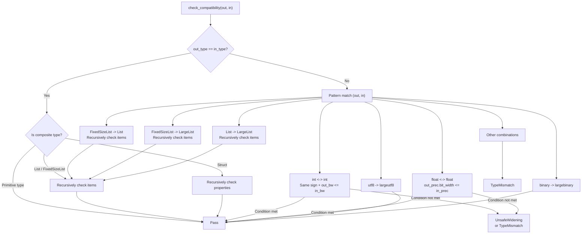
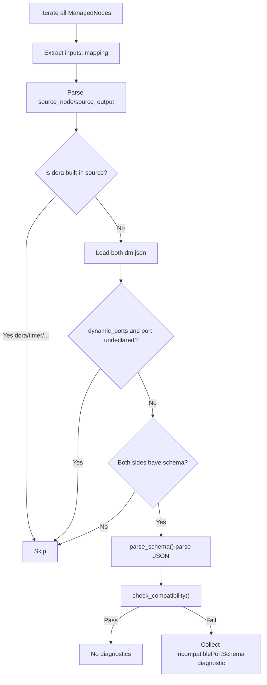

In the dora-rs dataflow model, nodes transmit data between each other via **Apache Arrow Arrays**. However, the traditional `dm.json` port declaration only includes `id`, `direction`, and free-text `description` -- when users write `nodeA/output -> nodeB/input` connections in YAML, the system **cannot verify data type compatibility before startup**, until runtime errors surface. **Port Schema** is a machine-readable data contract introduced precisely to solve this problem: it statically checks the output->input type compatibility of each connection at transpile-time, moving type errors from "runtime crash" to "pre-startup diagnosis".

Sources: [dm-port-schema.md](https://github.com/l1veIn/dora-manager/blob/main/docs/design/dm-port-schema.md#L1-L8), [mod.rs](https://github.com/l1veIn/dora-manager/blob/main/crates/dm-core/src/node/schema/mod.rs#L1-L16)

## Design Principles

The design of Port Schema follows four core principles, which are strictly adhered to in the implementation:

1. **Arrow-native types** -- The `type` field directly uses the JSON Type object defined by the Arrow Integration Testing specification, with no additional abstraction layer or mapping table. This is the foundation of the entire type system.
2. **JSON Schema engineering experience** -- Borrows keywords such as `$id`, `$ref`, `title`, `description`, `properties`, `required`, `items` from JSON Schema to organize structure and documentation, but does **not** claim to be a valid JSON Schema document.
3. **Minimal keyword set** -- Only includes keywords with practical significance for Arrow data; does not support complex JSON Schema features such as `if/then/else`, `patternProperties`, `prefixItems`.
4. **Gradual validation** -- Validation is triggered only when **both** the output port and the input port declare a `schema`; connections where one or both sides lack a `schema` are silently skipped. Nodes declaring `dynamic_ports: true` are allowed to define ports in YAML that are not pre-declared in `ports`; these ports are likewise skipped.

Sources: [dm-port-schema.md](https://github.com/l1veIn/dora-manager/blob/main/docs/design/dm-port-schema.md#L9-L14)

## Data Model Prerequisites

All data transmitted between dora-rs nodes is fundamentally an **Apache Arrow Array**. Even scalar values must be wrapped in an array (`pa.array(["hello"])` in Python, a single-element `StringArray` in Rust). **Port Schema describes the element type of this Arrow Array, not the array itself.** When a schema declares `"type": { "name": "utf8" }`, it means "this port transmits a `Utf8Array` where each element is a UTF-8 string". The array-level wrapping is implicit and global -- schema authors never need to describe it.

Sources: [dm-port-schema.md](https://github.com/l1veIn/dora-manager/blob/main/docs/design/dm-port-schema.md#L16-L20)

## Core Data Model

The Rust implementation of the Port Schema system consists of three tightly cooperating modules: `model.rs` defines the type structures, `parse.rs` handles JSON parsing and `$ref` resolution, and `compat.rs` implements type compatibility checking. The following Mermaid diagram illustrates their collaboration:

```mermaid
graph TB
    subgraph "dm.json Port Declaration"
        DJ["NodePort.schema<br/>(serde_json::Value)"]
    end

    subgraph "Schema Module"
        P["parse_schema()<br/>JSON -> PortSchema"]
        M["PortSchema<br/>arrow_type / items / properties"]
        AT["ArrowType Enum<br/>18 Arrow Types"]
        C["check_compatibility()<br/>Output <-> Input Subtype Check"]
        E["SchemaError<br/>7 Incompatibility Reasons"]
    end

    subgraph "Transpile Pipeline"
        VP["validate_port_schemas()<br/>Pass 1.6"]
    end

    DJ --> "|JSON Parsing + $ref Resolution|" P
    P --> M
    M --> AT
    M --> C
    C --> E
    VP --> P
    VP --> C
```

Sources: [mod.rs](https://github.com/l1veIn/dora-manager/blob/main/crates/dm-core/src/node/schema/mod.rs#L1-L17), [model.rs](https://github.com/l1veIn/dora-manager/blob/main/crates/dm-core/src/node/schema/model.rs#L1-L10)

### ArrowType Enum

`ArrowType` is the type core of the entire system. As a Rust enum, it precisely maps all data types defined in the Arrow Integration Testing JSON format, covering 18 variants divided into six families:

| Family | Variants | JSON `name` Values | Carried Parameters |
|---|---|---|---|
| Null/Boolean | `Null`, `Bool` | `"null"`, `"bool"` | -- |
| Integer | `Int` | `"int"` | `bitWidth: u16`, `isSigned: bool` |
| Floating Point | `FloatingPoint` | `"floatingpoint"` | `precision: FloatPrecision` |
| String/Binary | `Utf8`, `LargeUtf8`, `Binary`, `LargeBinary` | Corresponding `name` | -- |
| Fixed-Size Binary | `FixedSizeBinary` | `"fixedsizebinary"` | `byteWidth: usize` |
| Temporal | `Date`, `Time`, `Timestamp`, `Duration` | Corresponding `name` | `unit`, optional `timezone` |
| Nested Types | `List`, `LargeList`, `FixedSizeList`, `Struct`, `Map` | Corresponding `name` | `listSize`, `keysSorted`, etc. |

The `FloatPrecision` enum defines three precision levels: `HALF` (16-bit), `SINGLE` (32-bit), and `DOUBLE` (64-bit), each exposing a `bit_width()` method for bit-width comparison in compatibility checks. The `TimeUnit` enum covers four time granularities: `SECOND`, `MILLISECOND`, `MICROSECOND`, and `NANOSECOND`, shared by the three temporal types `Timestamp`, `Time`, and `Duration`.

Sources: [model.rs](https://github.com/l1veIn/dora-manager/blob/main/crates/dm-core/src/node/schema/model.rs#L62-L152)

### PortSchema Struct

`PortSchema` is the top-level schema object representing the data contract of a single port. The `arrow_type` field is always present (required by the specification), while the structured fields `items`, `properties`, and `required` are only meaningful under the corresponding Arrow nested types:

```rust
pub struct PortSchema {
    pub id: Option<String>,           // "$id": unique identifier
    pub title: Option<String>,        // "title": human-readable name
    pub description: Option<String>,  // "description": detailed description
    pub arrow_type: ArrowType,        // "type": Arrow type (required)
    pub nullable: bool,               // "nullable": defaults to false
    pub items: Option<Box<PortSchema>>,            // "items": list element schema
    pub properties: Option<BTreeMap<String, PortSchema>>, // "properties": struct fields
    pub required: Option<Vec<String>>,            // "required": required field names
    pub metadata: Option<serde_json::Value>,      // "metadata": free-form annotations
}
```

Note that `items` uses `Box<PortSchema>` to implement a recursive structure, and `properties` uses `BTreeMap` to ensure stable ordering of field names. This recursive design enables precise description of deeply nested types such as `list<struct<list<utf8>>>`.

Sources: [model.rs](https://github.com/l1veIn/dora-manager/blob/main/crates/dm-core/src/node/schema/model.rs#L158-L184)

### Schema Field in NodePort

In the `dm.json` port declaration model, the `NodePort` struct holds the raw JSON value through the `schema: Option<serde_json::Value>` field. This means the schema remains unparsed at the node metadata level and is only parsed into the strongly-typed `PortSchema` during the validation phase of the transpile pipeline. This lazy parsing strategy ensures lightweight node loading while complying with the gradual validation principle -- ports without schemas incur zero overhead.

Sources: [model.rs](https://github.com/l1veIn/dora-manager/blob/main/crates/dm-core/src/node/model.rs#L164-L181)

## Keyword System

The Port Schema specification defines three layers of keywords, each with a clear scope and semantics.

### Common Keywords

Common keywords can be used in **all** schema objects, regardless of the Arrow type:

| Keyword | Type | Description |
|---|---|---|
| `$id` | `string` | Schema unique identifier, supports cross-file references. Convention format: `"dm-schema://<name>"` |
| `$ref` | `string` | References another schema, supports relative paths (`"schema/audio.json"`) or schema IDs (`"dm-schema://audio-pcm"`) |
| `title` | `string` | Short human-readable name |
| `description` | `string` | Detailed human-readable description |
| `type` | `ArrowType` | **Required.** Arrow JSON Type object |
| `nullable` | `boolean` | Whether the value can be null, defaults to `false` |
| `metadata` | `object` | Application-level free-form key-value annotations |

### Structured Keywords

Only available when the Arrow type implies a nested structure:

| Keyword | Applicable Arrow Types | Type | Description |
|---|---|---|---|
| `items` | `list`, `largelist`, `fixedsizelist` | `Schema` | Schema of list elements |
| `properties` | `struct` | `{ [name]: Schema }` | Named child fields of a struct |
| `required` | `struct` | `string[]` | List of required property key names |

### Constraint Keywords (documentation purposes only)

These keywords do **not** affect transpile-time type compatibility checking; they merely provide machine-readable documentation hints for node developers:

| Keyword | Applicable Arrow Types | Type | Description |
|---|---|---|---|
| `minimum` | `int`, `floatingpoint`, `decimal` | `number` | Minimum value hint |
| `maximum` | `int`, `floatingpoint`, `decimal` | `number` | Maximum value hint |
| `enum` | `utf8`, `largeutf8`, `int` | `array` | Allowed value enumeration |
| `default` | any | any | Default value hint |

Sources: [dm-port-schema.md](https://github.com/l1veIn/dora-manager/blob/main/docs/design/dm-port-schema.md#L24-L59)

## Type System Details

The `type` field uses the JSON Type object defined by the Arrow Integration Testing specification. The following is the precise mapping between the JSON declaration form of each type and the corresponding Rust enum variant.

### Primitive Types

```jsonc
// Null -- typically used for trigger signals, heartbeats
{ "name": "null" }
// -> ArrowType::Null

// Boolean -- logic gates, switch states
{ "name": "bool" }
// -> ArrowType::Bool

// Signed integer (8/16/32/64-bit)
{ "name": "int", "bitWidth": 32, "isSigned": true }
// -> ArrowType::Int { bit_width: 32, is_signed: true }

// Unsigned integer (8/16/32/64-bit)
{ "name": "int", "bitWidth": 8, "isSigned": false }
// -> ArrowType::Int { bit_width: 8, is_signed: false }

// Floating point (HALF=16bit, SINGLE=32bit, DOUBLE=64bit)
{ "name": "floatingpoint", "precision": "SINGLE" }
// -> ArrowType::FloatingPoint { precision: FloatPrecision::Single }
```

### Binary and String Types

```jsonc
{ "name": "utf8" }           // UTF-8 string (32-bit offset)
{ "name": "largeutf8" }      // UTF-8 string (64-bit offset)
{ "name": "binary" }         // Variable-length binary (32-bit offset)
{ "name": "largebinary" }    // Variable-length binary (64-bit offset)
{ "name": "fixedsizebinary", "byteWidth": 16 }  // Fixed-size binary
```

### Temporal Types

```jsonc
{ "name": "date", "unit": "DAY" }
{ "name": "timestamp", "unit": "MICROSECOND", "timezone": "UTC" }
{ "name": "time", "unit": "NANOSECOND", "bitWidth": 64 }
{ "name": "duration", "unit": "MILLISECOND" }
```

### Nested Types

```jsonc
// Variable-length list -- use items to define element schema
{ "name": "list" }

// Fixed-size list -- use items to define element schema, listSize specifies element count
{ "name": "fixedsizelist", "listSize": 1600 }

// Struct -- use properties and required to define fields
{ "name": "struct" }

// Map
{ "name": "map", "keysSorted": false }
```

Sources: [dm-port-schema.md](https://github.com/l1veIn/dora-manager/blob/main/docs/design/dm-port-schema.md#L63-L128), [parse.rs](https://github.com/l1veIn/dora-manager/blob/main/crates/dm-core/src/node/schema/parse.rs#L103-L229)

## JSON Parsing and $ref Resolution

The `parse_schema()` function is the bridge from JSON to the strongly-typed `PortSchema`. Its core logic is divided into two phases:

**Phase 1: `$ref` resolution.** If the top-level JSON object contains a `$ref` field, the parser treats it as a relative path (relative to `base_dir`, typically the node directory), reads the referenced JSON file, and re-enters the parsing flow. The current implementation only supports relative file paths; resolution of the `dm-schema://` URI scheme is deferred to Phase 2.

**Phase 2: Recursive structure parsing.** `parse_schema_inner()` handles the actual structure parsing: extracts the required `type` field and converts it to an `ArrowType` enum via `parse_arrow_type()`; recursively parses `items` (nested call to itself); expands the `properties` object into `BTreeMap<String, PortSchema>`; collects the `required` array into `Vec<String>`. If the top-level JSON lacks a `type` field, parsing immediately fails with an error.

Sources: [parse.rs](https://github.com/l1veIn/dora-manager/blob/main/crates/dm-core/src/node/schema/parse.rs#L1-L97), [parse.rs](https://github.com/l1veIn/dora-manager/blob/main/crates/dm-core/src/node/schema/parse.rs#L246-L255)

## Type Compatibility Checking

Type compatibility checking is the core value of the Port Schema system. The `check_compatibility(output, input)` function implements a one-way check based on **subtype semantics**: **whether the data from the output port can be safely consumed by the input port without data loss or type errors.** The checking logic is a layered pattern-matching process.

### Check Decision Flow



### Safe Widening Rules

The core of compatibility checking is the concept of **safe widening** -- allowing implicit conversions from narrow types to wide types, but prohibiting reverse narrowing and cross-domain conversions:

| Output Type | Input Type | Result | Rule |
|---|---|---|---|
| `int(32, signed)` | `int(64, signed)` | Pass | Same sign, bit width increases |
| `int(64, signed)` | `int(32, signed)` | UnsafeWidening | Bit width decreases, possible truncation |
| `int(32, signed)` | `int(32, unsigned)` | TypeMismatch | Different sign |
| `floatingpoint(SINGLE)` | `floatingpoint(DOUBLE)` | Pass | Precision increases |
| `floatingpoint(DOUBLE)` | `floatingpoint(SINGLE)` | UnsafeWidening | Precision decreases |
| `utf8` | `largeutf8` | Pass | Offset bit width increases |
| `binary` | `largebinary` | Pass | Offset bit width increases |
| `fixedsizelist(N)` | `list` | Pass | Fixed-size is a subtype of variable-size |
| `fixedsizelist(N)` | `largelist` | Pass | Double widening |
| `list` | `largelist` | Pass | Offset bit width increases |
| `utf8` | `int(32, signed)` | TypeMismatch | Cross-domain incompatible |
| `fixedsizelist(100)` | `fixedsizelist(200)` | TypeMismatch | Different fixed sizes |

Sources: [compat.rs](https://github.com/l1veIn/dora-manager/blob/main/crates/dm-core/src/node/schema/compat.rs#L98-L195)

### List Element Compatibility

For list type compatibility checking, the logic follows a three-way branch:

- **Both sides have `items`**: Recursively call `check_compatibility` to check element schema compatibility
- **Input side has no `items`**: Input accepts any element type, passes directly
- **Output side has no `items` but input side does**: Cannot verify, raises a `MissingNestedSchema` error

This reflects the design philosophy of "the more permissive the input side, the easier it passes".

Sources: [compat.rs](https://github.com/l1veIn/dora-manager/blob/main/crates/dm-core/src/node/schema/compat.rs#L197-L212)

### Struct Field Compatibility

Struct compatibility checking uses **subset semantics**: the output struct must provide all fields required by the input struct. The specific checking is done in two rounds:

**Round 1: Check `required` fields.** For each field name in the input schema's `required` list, verify that the field exists in the output's `properties` and recursively check field schema compatibility. If the output is missing any required field, a `MissingStructField` error is returned.

**Round 2: Check co-existing optional fields.** For all non-`required` fields in the input `properties`, if the output also defines a field with the same name, recursively check compatibility. Non-required fields missing from the output do not cause errors -- this means the output can be a "superset" struct providing more fields than the input requires.

Sources: [compat.rs](https://github.com/l1veIn/dora-manager/blob/main/crates/dm-core/src/node/schema/compat.rs#L214-L267)

### Error Type System

The `SchemaError` enum precisely identifies seven incompatibility reasons, each carrying sufficient context information for generating diagnostic messages:

| Error Variant | Semantics | Typical Scenario |
|---|---|---|
| `TypeMismatch` | Top-level type family mismatch | utf8 vs int |
| `UnsafeWidening` | Bit width/precision cannot be safely widened | int64 -> int32 |
| `ListSizeMismatch` | Fixed-size list sizes differ | FixedSizeList(100) vs (200) |
| `IncompatibleItems` | List element types incompatible (wraps inner error) | list\<utf8\> vs list\<int\> |
| `MissingStructField` | Output struct missing a field required by input | struct{a} vs struct{a,b} |
| `IncompatibleStructField` | Struct field type incompatible (wraps inner error) | struct.a type differs |
| `MissingNestedSchema` | Output missing nested schema required by input | Output has no items but input does |

Both `IncompatibleItems` and `IncompatibleStructField` use `Box<SchemaError>` to wrap inner errors, forming an **error chain** traceable to the root cause.

Sources: [compat.rs](https://github.com/l1veIn/dora-manager/blob/main/crates/dm-core/src/node/schema/compat.rs#L8-L85)

## Transpile Pipeline Integration

Port Schema validation is integrated into the dataflow transpile pipeline as **Pass 1.6**. The full execution order of the transpile pipeline is as follows:

```
Pass 1:   Parse -- YAML -> DmGraph IR
Pass 1.5: Validate Reserved -- reserved node ID conflict check (currently empty implementation)
Pass 2:   Resolve Paths -- node: -> absolute path:
Pass 1.6: Validate Port Schemas -- port schema compatibility check <- here
Pass 3:   Merge Config -- four-layer config merge -> env:
Pass 4:   Inject Runtime Env -- inject runtime environment variables
Pass 5:   Inject DM Bridge -- Bridge node injection
Pass 6:   Emit -- DmGraph -> dora YAML
```

Note that `validate_port_schemas` executes **after** `resolve_paths` -- this is because schema parsing needs to know the node's disk path (for the `base_dir` of `$ref` references), and path information is only determined during the `resolve_paths` phase.

Sources: [mod.rs](https://github.com/l1veIn/dora-manager/blob/main/crates/dm-core/src/dataflow/transpile/mod.rs#L1-L81), [passes.rs](https://github.com/l1veIn/dora-manager/blob/main/crates/dm-core/src/dataflow/transpile/passes.rs#L115-L263)

### validate_port_schemas Execution Flow

This Pass's execution logic precisely implements the "gradual validation" principle. The following flowchart illustrates the complete decision path:



Specific steps:

1. **Build lookup table**: Collect all `ManagedNode` `yaml_id -> node_id` mappings into a HashMap
2. **Iterate each Managed node's `inputs:` mapping**: Extract the YAML-raw `inputs:` field from `extra_fields`
3. **Parse connection source**: Split the `input_port: source_node/source_output` format into source node ID and source output port ID
4. **Skip dora built-in sources**: Built-in sources like `dora/timer/...` are skipped directly
5. **Load both sides' dm.json metadata**: Locate and deserialize via `resolve_dm_json_path()`
6. **Dynamic port exemption**: If the node declares `dynamic_ports: true` and the port is not declared in `ports`, silently skip
7. **Both-side schema existence check**: Only enter validation when **both sides declare a schema**
8. **Parse schema**: Call `parse_schema()` to parse JSON, handling `$ref` references
9. **Compatibility check**: Call `check_compatibility()` and collect errors as `IncompatiblePortSchema` diagnostics

All diagnostics are handled in a **collect rather than short-circuit** manner -- users can see all connection issues at once rather than fixing them one by one.

Sources: [passes.rs](https://github.com/l1veIn/dora-manager/blob/main/crates/dm-core/src/dataflow/transpile/passes.rs#L125-L263)

### Diagnostic Types

The transpile pipeline defines two diagnostic types related to Port Schema, both carrying `yaml_id` and `node_id` for precise location:

| Diagnostic Type | Trigger Condition | Output Format |
|---|---|---|
| `InvalidPortSchema` | Schema JSON parsing fails (syntax error, missing `type` field, etc.) | `node "yaml_id" (id: node_id): port 'xxx' has an invalid schema: ...` |
| `IncompatiblePortSchema` | Type compatibility check fails | `node "yaml_id" (id: node_id): incompatible connection source/output -> input: ...` |

Sources: [error.rs](https://github.com/l1veIn/dora-manager/blob/main/crates/dm-core/src/dataflow/transpile/error.rs#L15-L61)

## Schema Declaration in dm.json

Ports declare their data contracts through the `schema` key -- supporting both inline and `$ref` reference forms. The following shows schema declaration patterns **actually used** in the project.

### Inline Declaration (Most Common)

Most nodes use concise inline declarations. The following table summarizes the schema patterns already declared by various nodes in the project:

| Node | Port ID | Direction | Arrow Type | Description |
|---|---|---|---|---|
| dm-microphone | `audio` | output | `floatingpoint(SINGLE)` | Float32 PCM audio stream |
| dm-microphone | `devices` | output | `utf8` | JSON-encoded device list |
| dm-microphone | `device_id` | input | `utf8` | Device ID for microphone selection |
| dm-microphone | `tick` | input | `null` | Heartbeat timer |
| dm-screen-capture | `frame` | output | `int(8, unsigned)` | Encoded image frame bytes |
| dm-screen-capture | `meta` | output | `utf8` | JSON frame metadata |
| dm-screen-capture | `trigger` | input | `null` | Single capture trigger |
| dm-mjpeg | `frame` | input | `int(8, unsigned)` | Raw image bytes |
| dm-and | `a`, `b`, `c`, `d` | input | `bool` | Boolean inputs |
| dm-and | `ok` | output | `bool` | Combined result |
| dm-and | `details` | output | `utf8` | JSON evaluation details |
| dm-gate | `enabled` | input | `bool` | Boolean enable signal |
| dm-gate | `value` | input/output | `null` | Pass-through value |
| dm-message | `path`, `data` | input | `utf8` | Path / lightweight display content |

Sources: [dm-microphone dm.json](https://github.com/l1veIn/dora-manager/blob/main/nodes/dm-microphone/dm.json#L34-L75), [dm-screen-capture dm.json](https://github.com/l1veIn/dora-manager/blob/main/nodes/dm-screen-capture/dm.json#L33-L77), [dm-and dm.json](https://github.com/l1veIn/dora-manager/blob/main/nodes/dm-and/dm.json), [dm-gate dm.json](https://github.com/l1veIn/dora-manager/blob/main/nodes/dm-gate/dm.json), [dm-message dm.json](https://github.com/l1veIn/dora-manager/blob/main/nodes/dm-message/dm.json), [dm-mjpeg dm.json](https://github.com/l1veIn/dora-manager/blob/main/nodes/dm-mjpeg/dm.json)

### $ref References (External Files)

When a schema needs to be reused across nodes, it can be stored in a `schema/` subdirectory under the node directory and referenced via `$ref`. The conventionally agreed directory structure is as follows:

```
nodes/
  dm-microphone/
    dm.json
    schema/
      audio-pcm.json        <- shared schema file
      device-list.json
    dm_microphone/
      main.py
```

Reference method in `dm.json`:

```jsonc
{
  "ports": [
    {
      "id": "audio",
      "direction": "output",
      "schema": { "$ref": "schema/audio-pcm.json" }
    }
  ]
}
```

Downstream nodes can also reference a registered schema via `$id`:

```jsonc
{
  "ports": [
    {
      "id": "audio_in",
      "direction": "input",
      "schema": { "$ref": "dm-schema://audio-pcm" }
    }
  ]
}
```

> **Current status**: `dm-schema://` URI resolution is not yet implemented (planned for Phase 2); currently only relative file path `$ref` is supported.

Sources: [parse.rs](https://github.com/l1veIn/dora-manager/blob/main/crates/dm-core/src/node/schema/parse.rs#L246-L255), [dm-port-schema.md](https://github.com/l1veIn/dora-manager/blob/main/docs/design/dm-port-schema.md#L132-L179)

## Type Validation Scenarios in Real Dataflows

Using [demo-logic-gate.yml](demos/demo-logic-gate.yml) as an example, when the transpiler processes the following connection:

```yaml
# switch-a/value -> and-gate/a
# Output type: boolean (dm-input-switch) -> Input type: bool (dm-and)
```

The transpiler loads the `dm.json` of `dm-input-switch` and the `dm.json` of `dm-and`, parses the `schema` of both sides' ports respectively, and then calls `check_compatibility()`. Since `dm-input-switch` currently declares `"type": { "name": "boolean" }` (a non-standard Arrow type name), the parser will produce an `InvalidPortSchema` diagnostic, indicating `unknown Arrow type name: 'boolean'` -- this is precisely the value of Port Schema: catching declaration errors before runtime.

Sources: [demo-logic-gate.yml](demos/demo-logic-gate.yml#L32-L63), [passes.rs](https://github.com/l1veIn/dora-manager/blob/main/crates/dm-core/src/dataflow/transpile/passes.rs#L125-L263)

## Common Pitfalls

In actual node development, the following are schema declaration errors that are easy to make:

| Error Pattern | Error Example | Correct Form | Diagnostic Result |
|---|---|---|---|
| Using non-standard type names | `"name": "boolean"` | `"name": "bool"` | `InvalidPortSchema: unknown Arrow type name` |
| Using non-standard float shorthand | `"name": "float64"` | `{"name": "floatingpoint", "precision": "DOUBLE"}` | `InvalidPortSchema: unknown Arrow type name` |
| Empty schema object | `"schema": {}` | `"schema": {"type": {"name": "utf8"}}` | `InvalidPortSchema: missing required 'type' field` |
| Missing int parameters | `{"name": "int"}` | `{"name": "int", "bitWidth": 32, "isSigned": true}` | `InvalidPortSchema: int type requires 'bitWidth'` |

> **Development tip**: When writing `dm.json`, always cross-reference the `parse_arrow_type()` match branches in [parse.rs](https://github.com/l1veIn/dora-manager/blob/main/crates/dm-core/src/node/schema/parse.rs#L103-L229) to validate the `name` values and required parameters of the `type` field.

Sources: [parse.rs](https://github.com/l1veIn/dora-manager/blob/main/crates/dm-core/src/node/schema/parse.rs#L103-L229), [dm-input-switch dm.json](https://github.com/l1veIn/dora-manager/blob/main/nodes/dm-input-switch/dm.json), [dora-yolo dm.json](https://github.com/l1veIn/dora-manager/blob/main/nodes/dora-yolo/dm.json)

## Complete Schema Examples

The following examples show schema declaration patterns ranging from simple to complex, all sourced from the specification design document.

### PCM Audio Stream (Fixed-Size List + Floating-Point Elements)

```json
{
  "$id": "dm-schema://audio-pcm",
  "title": "PCM Audio Chunk",
  "description": "Float32 PCM audio samples, single channel",
  "type": { "name": "fixedsizelist", "listSize": 1600 },
  "nullable": false,
  "items": {
    "type": { "name": "floatingpoint", "precision": "SINGLE" },
    "minimum": -1.0,
    "maximum": 1.0
  }
}
```

### Object Detection Results (List Nested Struct)

```json
{
  "$id": "dm-schema://detections",
  "title": "Object Detection Results",
  "type": { "name": "list" },
  "items": {
    "type": { "name": "struct" },
    "required": ["bbox", "label", "confidence"],
    "properties": {
      "bbox": {
        "description": "Bounding box [x1, y1, x2, y2]",
        "type": { "name": "fixedsizelist", "listSize": 4 },
        "items": { "type": { "name": "floatingpoint", "precision": "SINGLE" } }
      },
      "label": { "type": { "name": "utf8" } },
      "confidence": {
        "type": { "name": "floatingpoint", "precision": "SINGLE" },
        "minimum": 0, "maximum": 1
      }
    }
  }
}
```

### RGB Image Frame (Variable-Length List + Unsigned Integer Elements)

```json
{
  "$id": "dm-schema://image-rgb",
  "title": "RGB Image",
  "description": "HxWx3 interleaved RGB image as flat uint8 array",
  "type": { "name": "list" },
  "nullable": false,
  "items": {
    "type": { "name": "int", "bitWidth": 8, "isSigned": false },
    "minimum": 0,
    "maximum": 255
  }
}
```

### Control Signal (with enum Constraint)

```json
{
  "$id": "dm-schema://control-signal",
  "title": "Control Signal",
  "type": { "name": "utf8" },
  "enum": ["flush", "reset", "stop"]
}
```

Sources: [dm-port-schema.md](https://github.com/l1veIn/dora-manager/blob/main/docs/design/dm-port-schema.md#L185-L268)

## Test Coverage

[tests.rs](https://github.com/l1veIn/dora-manager/blob/main/crates/dm-core/src/node/schema/tests.rs) provides 22 test cases for the schema system, covering both parsing and compatibility checking. Parsing tests verify correct deserialization of all major Arrow types (`null`, `bool`, `int32`, `uint8`, `float32`, `utf8`, `binary`, `fixedsizelist`, `struct`, `timestamp`), including complete schemas with `$id`/`title`/`nullable`/`metadata`. Compatibility tests cover positive and negative scenarios for safe widening:

| Test Scenario | Expected Result |
|---|---|
| Exact match (utf8 == utf8) | Pass |
| Int safe widening (int32 -> int64) | Pass |
| Int narrowing (int64 -> int32) | Fail |
| Int sign mismatch (signed vs unsigned) | Fail |
| Float safe widening (SINGLE -> DOUBLE) | Pass |
| Float narrowing (DOUBLE -> SINGLE) | Fail |
| utf8 -> largeutf8 | Pass |
| Cross-domain mismatch (utf8 vs int32) | Fail |
| FixedSizeList -> List (compatible elements) | Pass |
| FixedSizeList size mismatch | Fail |
| List element incompatibility | Fail |
| Struct superset (output has extra fields) | Pass |
| Struct missing required field | Fail |
| Struct field type mismatch | Fail |
| Null exact match | Pass |
| Input with no items accepts any list | Pass |

Sources: [tests.rs](https://github.com/l1veIn/dora-manager/blob/main/crates/dm-core/src/node/schema/tests.rs#L1-L333)

## Roadmap: Schema as a First-Class Citizen

In the current Phase 1 implementation, schema files are stored within each node's `schema/` subdirectory. As the number of shared schemas grows, the specification plans to introduce a layered schema discovery chain similar to the node discovery mechanism:

```
Phase 1 (current):   schema/ exists within each node directory
Phase 2 (planned):   ~/.dm/schemas/           (user-level, highest priority)
                     repository schemas/       (workspace-level)
                     DM_SCHEMA_DIRS env var     (additional directories)
```

Cross-node `$ref` via `$id` (e.g., `"dm-schema://audio-pcm"`) will be resolved within this discovery chain, making schemas truly reusable first-class resources.

Sources: [dm-port-schema.md](https://github.com/l1veIn/dora-manager/blob/main/docs/design/dm-port-schema.md#L325-L337)

---

**Related reading**:
- Position of port schema in the transpile pipeline: [Dataflow Transpiler: Multi-Pass Pipeline and Four-Layer Config Merge](08-transpiler)
- Complete field reference for port declarations in dm.json: [Custom Node Development Guide: dm.json Complete Field Reference](22-custom-node-guide)
- Overview of built-in nodes that use schema declarations: [Built-in Nodes Overview: From Media Capture to AI Inference](19-builtin-nodes)
