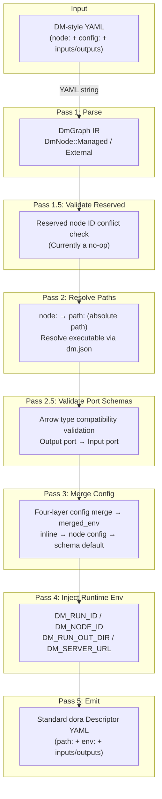
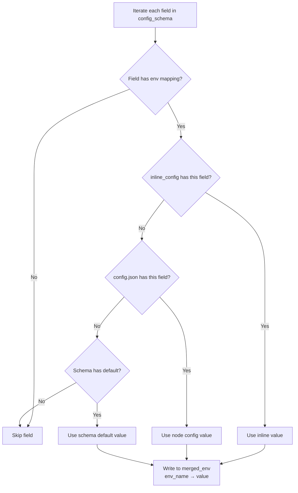
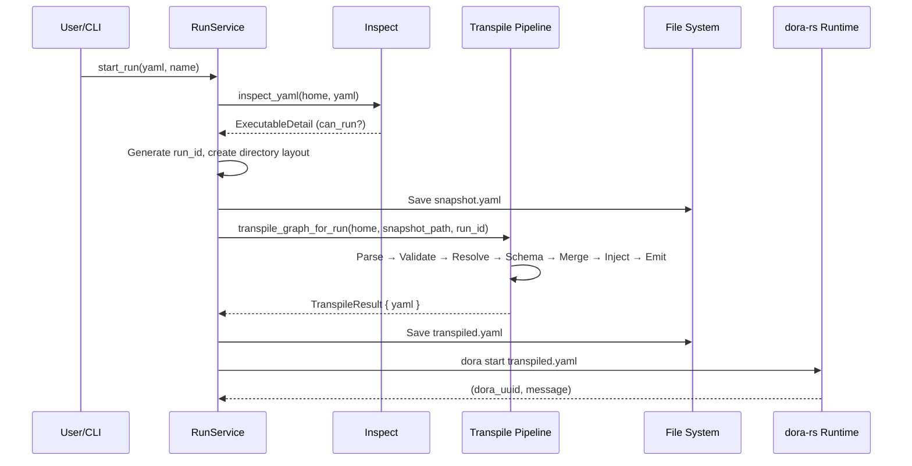

The dataflow (Dataflow) is Dora Manager's core execution unit, but it is not directly consumed by the dora-rs runtime. The DM-style YAML written by users contains declarative `node:` references, inline `config:` blocks, and port topology. These semantics must be **transpiled** into standard `Descriptor` YAML that dora-rs can understand — i.e., absolute `path:`, merged `env:` environment variables, and runtime-injected context information. This conversion is performed by the transpile module in `dm-core`, which uses a **multi-Pass pipeline** architecture to gradually transform raw text into a typed intermediate representation (IR), then enrich it across Passes to resolve paths, validate port types, merge configuration, inject runtime environment, and finally serialize to standard YAML output. This article provides an in-depth analysis of the pipeline's six stages, four-layer configuration merge strategy, and diagnostic collection model.

Sources: [mod.rs](https://github.com/l1veIn/dora-manager/blob/master/crates/dm-core/src/dataflow/transpile/mod.rs#L1-L82)

## Pipeline Overview: From DM YAML to dora Descriptor

The transpiler's entry function `transpile_graph_for_run` receives the DM_HOME path and YAML file path, executing six Passes in fixed order. The entire process does not use short-circuit error handling; instead, it uses a diagnostic collection mechanism to let users see all issues at once. The diagram below shows the complete data flow of the pipeline:



The core design principle of the pipeline is **progressive enrichment**: each Pass is responsible for only one concern, filling specific fields in the IR. `DmGraph` serves as the mutable state shared by all Passes, with its fields gradually filled — `resolved_path` by `resolve_paths`, `merged_env` by `merge_config` and `inject_runtime_env`.

Sources: [mod.rs](https://github.com/l1veIn/dora-manager/blob/master/crates/dm-core/src/dataflow/transpile/mod.rs#L44-L81)

## Typed Intermediate Representation: DmGraph IR

The transpiler does not directly operate on raw `serde_yaml::Value` trees. Instead, it parses each node into one of three strongly typed variants, only converting back to YAML in the final emit stage. This design decouples **semantic parsing** from **serialization**, allowing each Pass to operate on type-safe structures.

```rust
// DmGraph — core IR shared by all Passes
pub(crate) struct DmGraph {
    pub nodes: Vec<DmNode>,
    pub extra_fields: serde_yaml::Mapping, // Pass-through top-level unknown fields
}

pub(crate) enum DmNode {
    Managed(ManagedNode),      // Managed node with node: field
    External { _yaml_id, raw }, // External node (path: specified), pass-through as-is
}

pub(crate) struct ManagedNode {
    pub yaml_id: String,            // id field in YAML
    pub node_id: String,            // Value of the node: field (node identifier)
    pub inline_config: Value,       // Inline config from config: block in YAML
    pub resolved_path: Option<String>, // Absolute executable path filled by Pass 2
    pub merged_env: Mapping,        // Environment variables filled by Pass 3/4
    pub extra_fields: Mapping,      // Pass-through of other fields like inputs/outputs
}
```

The distinction between **Managed** and **External** is the core classification logic of the entire transpiler. In the Parse stage, only nodes with a `node:` field are classified as `Managed`, entering subsequent path resolution, config merging, and other processing flows; nodes with only `path:` or neither `node:` nor `path:` are classified as `External`, output as-is in the emit stage. The `extra_fields` field uses a **whitelist exclusion** strategy — after removing fields explicitly managed by the IR (`id`, `node`, `path`, `config`, `env`), all other fields (like `inputs`, `outputs`, `args`) are passed through to the final output.

Sources: [model.rs](https://github.com/l1veIn/dora-manager/blob/master/crates/dm-core/src/dataflow/transpile/model.rs#L1-L39), [passes.rs](https://github.com/l1veIn/dora-manager/blob/master/crates/dm-core/src/dataflow/transpile/passes.rs#L15-L95)

## Pass 1: Parse — YAML Text to Typed IR

The Parse stage converts the raw YAML string into a `DmGraph` IR. For each node entry, it first extracts the `id`, `node`, and `path` fields, then determines the node's classification based on whether a `node:` field exists. Managed nodes additionally extract the `config:` block (as `inline_config`) and any existing `env:` mapping (as the initial value of `merged_env`), while External nodes retain the original YAML Mapping without any transformation. All top-level fields other than `nodes` (such as `communication`, `deploy`, `debug` and other dora standard fields) are saved to `extra_fields`, ensuring unknown or future-added dora fields are never discarded.

Sources: [passes.rs](https://github.com/l1veIn/dora-manager/blob/master/crates/dm-core/src/dataflow/transpile/passes.rs#L8-L95)

## Pass 2: Resolve Paths — node: to Absolute path:

This is the first **side-effect-bearing** Pass of the transpiler. For each Managed node, it uses `node::resolve_node_dir` to find the node directory across all configured node directories (`~/.dm/nodes/` → built-in `nodes/` → `DM_NODE_DIRS` environment variable additional paths), then reads `dm.json` to get the `executable` field, concatenating it into an absolute path stored in `resolved_path`.

| Search Order | Path | Description |
|----------|------|------|
| 1 | `~/.dm/nodes/<node_id>/` | User-installed nodes |
| 2 | `<repo_root>/nodes/<node_id>/` | Built-in nodes (during development) |
| 3 | `DM_NODE_DIRS` environment variable | Custom additional node paths |

When resolution fails, the pipeline is not interrupted; instead, a diagnostic is recorded (`NodeNotInstalled`, `MetadataUnreadable`, `MissingExecutable`). In the final emit stage, unresolved nodes retain the original `node:` field, allowing dora-rs to give a clear error message at startup rather than failing silently during transpilation. A noteworthy implementation detail: `resolve_paths` temporarily stores the `dm.json` path in `extra_fields` with the key `__dm_meta_path` for the subsequent `merge_config` Pass to read. After config merging is complete, this temporary marker is cleared.

Sources: [passes.rs](https://github.com/l1veIn/dora-manager/blob/master/crates/dm-core/src/dataflow/transpile/passes.rs#L267-L341), [paths.rs](https://github.com/l1veIn/dora-manager/blob/master/crates/dm-core/src/node/paths.rs#L11-L23)

## Pass 2.5: Validate Port Schemas — Arrow Type Compatibility Check

This Pass performs **compile-time type checking** on port connections between Managed nodes. It iterates through each Managed node's `inputs:` mapping, parses connection declarations in `source_node/source_output` format, then looks up the source node's output port and target node's input port from the `dm.json` `ports` array, using an Arrow type system-based schema validator to check compatibility.

Validation follows the **dual-declaration** principle: checking is only triggered when both the source and target ports declare a schema. If either side lacks a schema declaration, it is silently skipped; if a node declares `dynamic_ports: true`, ports not found in the `ports` array are also skipped. Schema supports referencing external JSON Schema files via `$ref`, resolved relative to the node directory during parsing. Incompatible connections are recorded as `IncompatiblePortSchema` diagnostics.

Sources: [passes.rs](https://github.com/l1veIn/dora-manager/blob/master/crates/dm-core/src/dataflow/transpile/passes.rs#L110-L266)

## Pass 3: Merge Config — Four-Layer Configuration Merge

This is the most complex Pass in the transpiler, implementing a **four-layer configuration priority** strategy that merges configuration values scattered across different locations into a unified environment variable mapping. Understanding this mechanism is crucial for correctly using the DM configuration system.

### Four-Layer Priority Model

Configuration values are merged according to the following priority, from highest to lowest (higher priority overrides lower):

| Priority | Layer | Source | Storage Location | Typical Scenario |
|--------|------|------|----------|----------|
| 1 (highest) | **Inline Config** | `config:` block in dataflow YAML | Dataflow YAML file | Override parameters for a specific run |
| 2 | **Node Config** | `config.json` under the node directory | `~/.dm/nodes/&lt;id&gt;/config.json` | User-set global defaults for a node |
| 3 (lowest) | **Schema Default** | `config_schema.*.default` in `dm.json` | `~/.dm/nodes/&lt;id&gt;/dm.json` | Node developer's out-of-the-box default values |

> **Note**: The transpiler comments mention "four layers" including the design-reserved "flow" layer (dataflow-level config file), but in the current implementation, the actual config lookup chain is three layers: `inline_config → config_defaults → schema default`. The `inspect_config` service function at the API layer also shows the same `inline → node → default` three-layer structure.

### Merge Algorithm Details

The merge process iterates through each field in `config_schema` in `dm.json`, executing the following steps:



For each field, the system first checks whether `config_schema[field].env` exists — this is the mapping from field to environment variable name. Only fields that declare `env` are included in the merge. Value selection follows the priority chain `inline_config.get(key) → config_defaults.get(key) → field_schema.get("default")` via `or_else` cascading. Non-string type values are automatically converted via `.to_string()`. The final key-value pair is written to `ManagedNode.merged_env`.

Sources: [passes.rs](https://github.com/l1veIn/dora-manager/blob/master/crates/dm-core/src/dataflow/transpile/passes.rs#L343-L416), [local.rs](https://github.com/l1veIn/dora-manager/blob/master/crates/dm-core/src/node/local.rs#L173-L186), [service.rs](https://github.com/l1veIn/dora-manager/blob/master/crates/dm-core/src/dataflow/service.rs#L101-L200)

### config_schema Declaration Format

The `config_schema` in `dm.json` uses a flat object structure, where each key represents a configurable item and the value is a description object:

```json
{
  "config_schema": {
    "mode": {
      "env": "MODE",
      "default": "once",
      "x-widget": { "type": "select", "options": ["once", "continuous"] }
    },
    "duration_sec": {
      "env": "DURATION_SEC",
      "default": 3,
      "x-widget": { "type": "slider", "min": 1, "max": 60, "step": 1 }
    }
  }
}
```

| Field | Type | Description |
|------|------|------|
| `env` | `string` | **Required**. Mapped environment variable name; config items without this field do not participate in merging |
| `default` | `any` | Schema-level default value, lowest priority |
| `description` | `string` | Optional, config item description |
| `x-widget` | `object` | Optional, frontend UI control declaration (`select`, `slider`, `switch`, etc.) |

Using the `dm-test-audio-capture` node as an example, its `dm.json` declares 7 configuration items (mode, duration_sec, sample_rate, channels, output_dir, reference_audio, enable_vad), each mapping to corresponding environment variables. The `config.json` under the node directory stores user-level persistent configuration (e.g., `"mode": "once"`, `"sample_rate": 16000`), which are read and participate in the merge during each transpilation.

Sources: [dm-test-audio-capture/dm.json](https://github.com/l1veIn/dora-manager/blob/master/nodes/dm-test-audio-capture/dm.json#L74-L142), [config.json](https://github.com/l1veIn/dora-manager/blob/master/nodes/dm-test-audio-capture/config.json#L1-L9)

### Complete Merge Example

The following demonstrates a specific end-to-end configuration merge process. Assume the dataflow YAML declares a `dm-test-audio-capture` node and overrides `mode` and `duration_sec`:

**Dataflow YAML (inline config)**:
```yaml
- id: microphone
  node: dm-test-audio-capture
  config:
    mode: repeat
    duration_sec: 2
```

**Node config.json (node-level config)**:
```json
{
  "channels": 1,
  "duration_sec": 3,
  "mode": "once",
  "sample_rate": 16000
}
```

**dm.json config_schema (default level)**:
```json
{
  "mode": { "env": "MODE", "default": "once" },
  "duration_sec": { "env": "DURATION_SEC", "default": 3 },
  "sample_rate": { "env": "SAMPLE_RATE", "default": 16000 },
  "channels": { "env": "CHANNELS", "default": 1 }
}
```

**Merge result (merged_env)**:

| Config Item | env Variable | inline | node config | schema default | Final Value | Source |
|--------|----------|--------|-------------|----------------|--------|------|
| mode | MODE | `repeat` | `once` | `once` | `repeat` | inline |
| duration_sec | DURATION_SEC | `2` | `3` | `3` | `2` | inline |
| sample_rate | SAMPLE_RATE | — | `16000` | `16000` | `16000` | node config |
| channels | CHANNELS | — | `1` | `1` | `1` | node config |
| output_dir | OUTPUT_DIR | — | — | `/tmp/dora-audio` | `/tmp/dora-audio` | schema default |

Sources: [passes.rs](https://github.com/l1veIn/dora-manager/blob/master/crates/dm-core/src/dataflow/transpile/passes.rs#L349-L416)

## Pass 4: Inject Runtime Env — Runtime Environment Injection

After config merging completes, the transpiler injects four **runtime context environment variables** for each Managed node. These variables are transparently available to node code, allowing nodes to interact with the runtime management system without hardcoding server addresses or computing runtime directories.

| Environment Variable | Value Source | Purpose |
|----------|--------|------|
| `DM_RUN_ID` | `uuid::Uuid::new_v4()` | Unique identifier for the current run instance |
| `DM_NODE_ID` | Node's `yaml_id` (the `id` field in YAML) | Node's identity in the dataflow |
| `DM_RUN_OUT_DIR` | `~/.dm/runs/<run_id>/out/` | Run instance output directory (artifact storage) |
| `DM_SERVER_URL` | Fixed value `http://127.0.0.1:3210` | dm-server HTTP API address |

These environment variables are directly appended to the `merged_env` mapping. Since `merged_env` is serialized to the node's `env:` field during the emit stage, dora-rs sets them as actual environment variables when launching node processes, and node code can read them directly via `os.environ` (Python) or `std::env` (Rust).

Sources: [passes.rs](https://github.com/l1veIn/dora-manager/blob/master/crates/dm-core/src/dataflow/transpile/passes.rs#L418-L449)

## Pass 5: Emit — IR Serialization to Standard YAML

The Emit stage is the endpoint of the pipeline, converting the enriched `DmGraph` IR back to `serde_yaml::Value`. For Managed nodes, it constructs a new YAML Mapping, sequentially writing `id`, `path` (the resolved absolute path), `env` (merged environment variable mapping), and all `extra_fields` (inputs, outputs, args, etc.). For External nodes, it directly clones the original YAML Mapping. Finally, the node sequence and top-level `extra_fields` are combined into a complete YAML document.

The key design decision is: **nodes with unresolved paths retain the `node:` field**. If `resolved_path` is `None` (path resolution failed), emit does not generate a `path:` field but outputs the original `node:` declaration. This ensures dora-rs can give a meaningful error message ("unknown operator") when attempting to start, rather than a broken path generated by the transpiler.

Sources: [passes.rs](https://github.com/l1veIn/dora-manager/blob/master/crates/dm-core/src/dataflow/transpile/passes.rs#L451-L509)

## Diagnostic Collection Model

The transpiler uses **accumulated diagnostics** rather than short-circuit error propagation. Each validation Pass appends discovered issues as `TranspileDiagnostic` items to a `Vec`. The pipeline does not interrupt due to a single diagnostic. After transpilation completes, all diagnostics are printed to stderr with the `[dm-core] transpile warning` prefix.

| Diagnostic Type | Trigger Condition | Severity |
|----------|----------|--------|
| `NodeNotInstalled` | `resolve_node_dir` returns `None` | Warning (node cannot run) |
| `MetadataUnreadable` | `dm.json` doesn't exist or cannot be parsed | Warning (node metadata missing) |
| `MissingExecutable` | `dm.json` `executable` field is empty | Warning (node cannot start) |
| `InvalidPortSchema` | Port schema cannot be parsed | Warning (type check skipped) |
| `IncompatiblePortSchema` | Output port and input port types are incompatible | Warning (may error at runtime) |

This model lets users see **all** issues in a single transpilation, rather than wasting time in a "fix → re-run → discover next issue" loop. Diagnostic information includes dual positioning via `yaml_id` (node ID in YAML) and `node_id` (node identifier), facilitating quick problem localization.

Sources: [error.rs](https://github.com/l1veIn/dora-manager/blob/master/crates/dm-core/src/dataflow/transpile/error.rs#L1-L62), [mod.rs](https://github.com/l1veIn/dora-manager/blob/master/crates/dm-core/src/dataflow/transpile/mod.rs#L68-L71)

## Shared Context: TranspileContext

All Passes share a read-only `TranspileContext` struct containing only two fields: `home` (DM_HOME directory path) and `run_id` (run instance UUID). This minimalist context design embodies the **minimum knowledge principle** — each Pass only obtains the information it truly needs, accessing node directories, config files, and other resources through parameter passing rather than global state.

Sources: [context.rs](https://github.com/l1veIn/dora-manager/blob/master/crates/dm-core/src/dataflow/transpile/context.rs#L1-L10)

## Transpiler's Position in the Runtime Flow

When a user starts a dataflow via API or CLI, the run service (`service_start`) first calls `inspect_yaml` to check the dataflow's executable state. Only after confirming all nodes are installed and YAML format is valid does it enter the transpilation flow. The transpiler's output (standard dora Descriptor YAML) is persisted to `~/.dm/runs/<run_id>/transpiled.yaml`, then handed to the dora-rs runtime for startup. This means transpilation is a one-time compilation step — the runtime doesn't need to re-parse DM-specific semantics.



Sources: [service_start.rs](https://github.com/l1veIn/dora-manager/blob/master/crates/dm-core/src/runs/service_start.rs#L72-L146)

## API-Layer Configuration Aggregation: inspect_config

In addition to config merging within the transpiler pipeline, the `dataflow::service` module provides an `inspect_config` function for HTTP API use. It shares the same configuration sources (inline, node config, schema default) with the transpiler's `merge_config` Pass, but outputs not only the merged result but also exposes the raw values at each layer. This enables the frontend UI to display configuration "source tracing" — users can clearly see whether a config value comes from YAML inline, node config file, or schema default.

The `AggregatedConfigField` struct stores `inline_value`, `node_value`, `default_value`, `effective_value`, and `effective_source` for each config field, achieving complete **configuration traceability**.

Sources: [model.rs](https://github.com/l1veIn/dora-manager/blob/master/crates/dm-core/src/dataflow/model.rs#L137-L168), [service.rs](https://github.com/l1veIn/dora-manager/blob/master/crates/dm-core/src/dataflow/service.rs#L101-L200)

## Extended Reading

The transpiler is the bridge connecting dataflow definitions with the runtime in the backend architecture. To fully understand its context, it is recommended to read in the following order:

1. **Node Contract** → [Node (Node): dm.json Contract and Executable Unit](04-node-concept.md): Understand how `dm.json`'s `executable`, `config_schema`, and `ports` fields are consumed by the transpiler
2. **Dataflow Format** → [Dataflow (Dataflow): YAML Topology and Node Connections](05-dataflow-concept.md): Understand the `node:` / `config:` / `inputs:` syntax of DM YAML
3. **Port Type System** → [Port Schema Specification: Arrow Type System-Based Port Validation](20-port-schema): Understand the Arrow type compatibility validation used by Pass 2.5
4. **Runtime Invocation** → [Runtime Service: Startup Orchestration, State Refresh, and Metrics Collection](10-runtime-service): Understand how the transpiled result is consumed by `service_start`
5. **Configuration System** → [Configuration System: DM_HOME Directory Structure and config.toml](13-config-system): Understand the `DM_HOME` directory structure and node path resolution