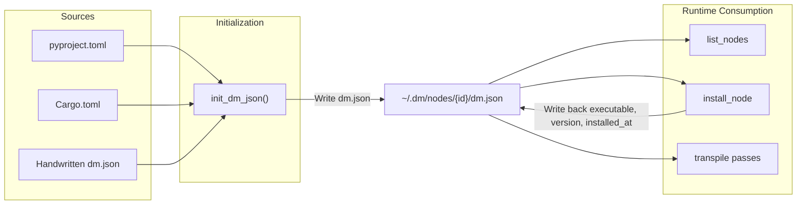
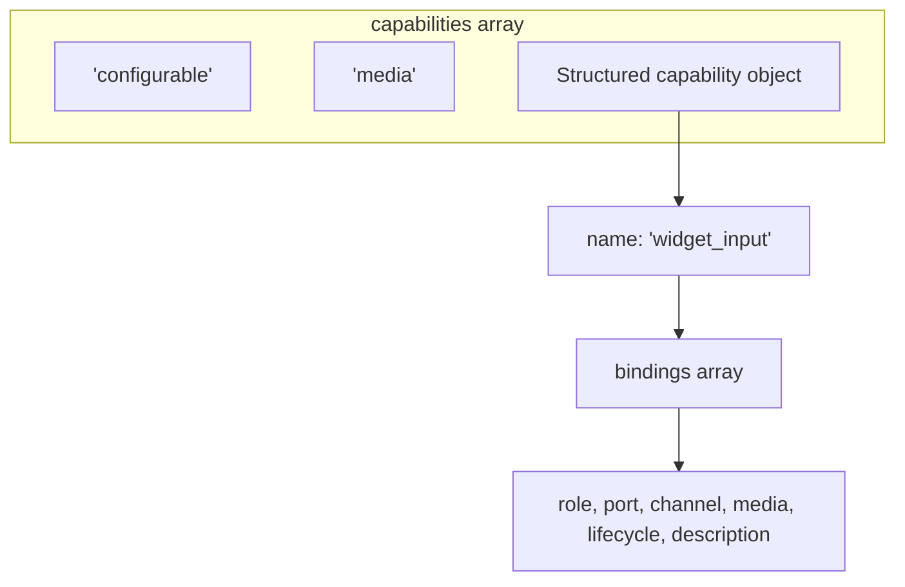
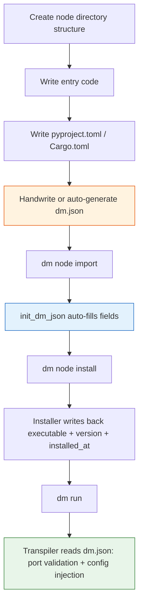
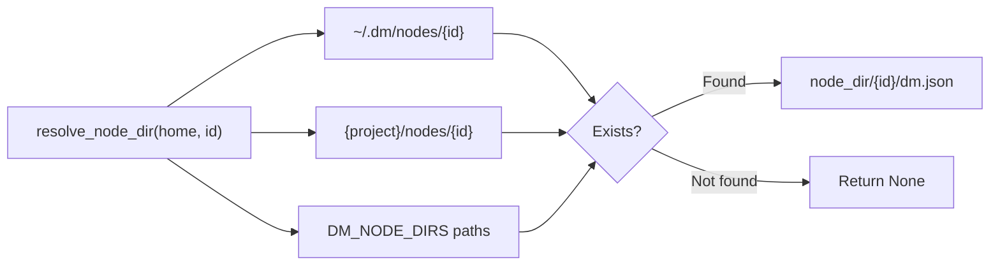

**dm.json** is the **single source of truth** for Dora Manager nodes — every node directory must contain this JSON file, through which the system handles the entire lifecycle of node discovery, metadata loading, port validation, configuration injection, and installation orchestration. Starting from the type definitions in the Rust source code, this document provides precise semantics, default value strategies, and auto-inference rules for each field, helping you build a compliant dm.json from scratch.

Sources: [model.rs](https://github.com/l1veIn/dora-manager/blob/main/crates/dm-core/src/node/model.rs#L217-L288), [mod.rs](https://github.com/l1veIn/dora-manager/blob/main/crates/dm-core/src/node/mod.rs)

## The Role of dm.json in the System

dm.json is not just a static description file — it is read and written during three critical phases:

1. **Import/Creation phase**: When running `dm node import`, the `init_dm_json` function automatically infers metadata from `pyproject.toml` / `Cargo.toml` and generates dm.json. If dm.json already exists, it is directly deserialized and the `id` field is updated.
2. **Installation phase**: After `dm node install` executes the build command, it writes back the `executable`, `version`, and `installed_at` fields to dm.json.
3. **Transpilation phase**: When the dataflow YAML is transpiled into the Dora native format, the transpiler reads `ports[].schema` from dm.json for port compatibility validation, and reads `config_schema` for environment variable injection.



Sources: [init.rs](https://github.com/l1veIn/dora-manager/blob/main/crates/dm-core/src/node/init.rs#L21-L112), [install.rs](https://github.com/l1veIn/dora-manager/blob/main/crates/dm-core/src/node/install.rs#L11-L75), [local.rs](https://github.com/l1veIn/dora-manager/blob/main/crates/dm-core/src/node/local.rs)

## Top-Level Field Overview

The `Node` struct is the Rust projection of dm.json. The table below lists all fields, where "required" is determined based on the `serde` default value strategy — in practice all fields have defaults, so a valid dm.json can be extremely minimal.

| Field | Type | Required | Default | Semantics |
|-------|------|----------|---------|-----------|
| `id` | `string` | Yes | — | Unique node identifier, must match the directory name |
| `name` | `string` | — | `""` | Human-readable display name |
| `version` | `string` | Yes | `""` | Semantic version number |
| `installed_at` | `string` | Yes | `""` | Unix timestamp (seconds), automatically written at install time |
| `source` | `object` | Yes | — | Build source information, containing `build` and optional `github` |
| `description` | `string` | — | `""` | Brief description of node functionality |
| `executable` | `string` | — | `""` | Executable file path relative to the node directory |
| `repository` | `object?` | — | `null` | Source repository metadata |
| `maintainers` | `array` | — | `[]` | Maintainer list |
| `license` | `string?` | — | `null` | SPDX license identifier |
| `display` | `object` | — | `{}` | Display metadata (category, tags, avatar) |
| `dm` | `object?` | — | `null` | **Deprecated**. Legacy capability binding declaration, automatically merged into `capabilities` during deserialization |
| `capabilities` | `array` | — | `[]` | Runtime capability declarations (supports string labels or structured objects) |
| `runtime` | `object` | — | `{}` | Runtime language and platform information |
| `ports` | `array` | — | `[]` | Port declaration list |
| `files` | `object` | — | `{}` | File index within the node |
| `examples` | `array` | — | `[]` | Example entry list |
| `config_schema` | `object?` | — | `null` | Configuration field definitions |
| `dynamic_ports` | `bool` | — | `false` | Whether to accept unregistered ports declared in YAML |

**Regarding the `path` field**: This is a **runtime-only field** annotated with `#[serde(skip_deserializing)]` and will not appear in the JSON file. After the system loads dm.json, this field is attached via `node.with_path(node_dir)`. Regarding the **legacy field `interaction`**: Some built-in interactive nodes include this field in their dm.json, but in the Rust model it is declared as `Option<NodeInteractionLegacy>`, which is a compatibility pass-through field. New nodes should not use it.

Sources: [model.rs](https://github.com/l1veIn/dora-manager/blob/main/crates/dm-core/src/node/model.rs#L222-L300), [model.rs (legacy)](https://github.com/l1veIn/dora-manager/blob/main/crates/dm-core/src/node/model.rs#L148-L154)

## source — Build Source

```json
"source": {
  "build": "pip install -e .",
  "github": null
}
```

| Field | Type | Semantics |
|-------|------|-----------|
| `build` | `string` | Installation command. The system uses this to determine the installation strategy: commands starting with `pip`/`uv` go through the Python venv flow, commands starting with `cargo` go through the Rust compilation flow |
| `github` | `string?` | Optional GitHub repository URL, inferred from the `repository` field in `pyproject.toml` during `init_dm_json` |

**Decisive effect of build command on installation flow**: The installer determines the build type via `build_type.trim().to_lowercase()`. `pip install -e .` and `uv pip install -e .` trigger local Python installation (creating `.venv`), `pip install {package}` triggers remote PyPI installation, `cargo install --path .` triggers Rust compilation to the `bin/` directory. Other values will result in an "Unsupported build type" error.

**Auto-inference logic**: `infer_build_command` follows this priority — if `pyproject.toml` exists and `build-backend` is `maturin`, it generates `pip install {id}`; if it is a regular Python project, it generates `pip install -e .`; if `Cargo.toml` exists, it generates `cargo install {id}`; the final fallback is `pip install {id}`.

Sources: [model.rs](https://github.com/l1veIn/dora-manager/blob/main/crates/dm-core/src/node/model.rs#L6-L10), [install.rs](https://github.com/l1veIn/dora-manager/blob/main/crates/dm-core/src/node/install.rs#L29-L61), [init.rs](https://github.com/l1veIn/dora-manager/blob/main/crates/dm-core/src/node/init.rs#L230-L250)

## repository — Source Repository

```json
"repository": {
  "url": "https://github.com/user/repo",
  "default_branch": "main",
  "reference": "v1.0.0",
  "subdir": "nodes/my-node"
}
```

| Field | Type | Default | Semantics |
|-------|------|---------|-----------|
| `url` | `string` | `""` | Repository URL |
| `default_branch` | `string?` | `null` | Default branch name |
| `reference` | `string?` | `null` | Git reference (branch name, tag, or commit hash) |
| `subdir` | `string?` | `null` | Subdirectory path within the repository |

**Git operations during import**: The `import_git` function parses the GitHub URL structure and supports the `https://github.com/{owner}/{repo}/tree/{ref}/{path}` format. When a subdirectory path exists, the system uses `git sparse-checkout` to fetch only the target subdirectory, combined with `--depth 1 --filter=blob:none --sparse` for minimal cloning.

Sources: [model.rs](https://github.com/l1veIn/dora-manager/blob/main/crates/dm-core/src/node/model.rs#L13-L23), [import.rs](https://github.com/l1veIn/dora-manager/blob/main/crates/dm-core/src/node/import.rs#L86-L176)

## maintainers — Maintainers

```json
"maintainers": [
  { "name": "Dora Manager", "email": "dev@example.com", "url": "https://example.com" }
]
```

| Field | Type | Default | Semantics |
|-------|------|---------|-----------|
| `name` | `string` | `""` | Maintainer name |
| `email` | `string?` | `null` | Contact email |
| `url` | `string?` | `null` | Personal homepage |

`init_dm_json` infers the maintainer list from the `[project.authors]` array in `pyproject.toml`, extracting only the `name` field. During Rust serialization, `skip_serializing_if = "Option::is_none"` automatically omits null values for `email` and `url`.

Sources: [model.rs](https://github.com/l1veIn/dora-manager/blob/main/crates/dm-core/src/node/model.rs#L25-L33), [init.rs](https://github.com/l1veIn/dora-manager/blob/main/crates/dm-core/src/node/init.rs#L66-L78)

## display — Display Metadata

```json
"display": {
  "category": "Builtin/Logic",
  "tags": ["logic", "bool", "and"],
  "avatar": null
}
```

| Field | Type | Default | Semantics |
|-------|------|---------|-----------|
| `category` | `string` | `""` | Category path (supports `/`-separated hierarchy), the CLI `dm node list` displays it in `[category]` format |
| `tags` | `string[]` | `[]` | Search tag array |
| `avatar` | `string?` | `null` | Node icon path (relative to the node directory) |

Categories actually used in the project include `Builtin/Logic`, `Builtin/Interaction`, `Builtin/Media`, `Builtin/Utility`, `Builtin/Storage`, `Builtin/Flow Control`, `Audio/Input`, `AI/Vision`, etc. Custom nodes are recommended to follow the `major-category/sub-category` path naming convention.

Sources: [model.rs](https://github.com/l1veIn/dora-manager/blob/main/crates/dm-core/src/node/model.rs#L35-L43)

## capabilities — Capability Declarations

`capabilities` is a mixed-type array supporting two forms:



### Form 1: Simple String Labels

```json
"capabilities": ["configurable", "media"]
```

The system currently recognizes the following label values:

| Value | Semantics |
|-------|-----------|
| `"configurable"` | The node declares `config_schema` and supports a configuration panel |
| `"media"` | The node handles media streams (audio/video), used by the runtime for media-related routing |
| `"streaming"` | The node involves streaming data processing |

### Form 2: Structured Capability Objects (with Bindings)

```json
"capabilities": [
  "configurable",
  {
    "name": "widget_input",
    "bindings": [
      {
        "role": "widget",
        "channel": "register",
        "media": ["widgets"],
        "lifecycle": ["run_scoped", "stop_aware"],
        "description": "Registers a button widget with the DM interaction plane."
      },
      {
        "role": "widget",
        "port": "click",
        "channel": "input",
        "media": ["pulse"],
        "lifecycle": ["run_scoped", "stop_aware"],
        "description": "Emits a click pulse on the click output port."
      }
    ]
  }
]
```

Fields for each binding object:

| Field | Type | Semantics |
|-------|------|-----------|
| `role` | `string` | Role identifier (e.g. `"widget"`, `"source"`) |
| `port` | `string?` | Associated port ID |
| `channel` | `string?` | Communication channel identifier (e.g. `"register"`, `"input"`, `"inline"`, `"artifact"`) |
| `media` | `string[]` | Media type labels (e.g. `["widgets"]`, `["text", "json"]`, `["pulse"]`) |
| `lifecycle` | `string[]` | Lifecycle constraints (e.g. `["run_scoped", "stop_aware"]`) |
| `description` | `string?` | Human-readable description of the binding's purpose |

### Auto-Merge of Legacy `dm` Field

Older versions of dm.json used the `dm.bindings` array to declare capability bindings. The Rust deserializer automatically calls `merge_legacy_dm_into_capabilities` during loading, grouping `dm.bindings` by `family` and merging them into the `capabilities` array. After merging, the `dm` field is set to `None` and will no longer appear in the serialized output. This means **new nodes should directly use the structured form of `capabilities`** without setting the `dm` field.

Sources: [model.rs](https://github.com/l1veIn/dora-manager/blob/main/crates/dm-core/src/node/model.rs#L71-L146), [model.rs (merge)](https://github.com/l1veIn/dora-manager/blob/main/crates/dm-core/src/node/model.rs#L466-L505)

## runtime — Runtime Information

```json
"runtime": {
  "language": "python",
  "python": ">=3.10",
  "platforms": []
}
```

| Field | Type | Default | Semantics |
|-------|------|---------|-----------|
| `language` | `string` | `""` | `"python"`, `"rust"`, or `"node"` |
| `python` | `string?` | `null` | Python version constraint (e.g. `">=3.10"`) |
| `platforms` | `string[]` | `[]` | Supported platform list (currently all empty arrays in the project, reserved for future extension) |

**Auto-inference**: The `infer_runtime` function determines the value by priority — if `pyproject.toml` exists, it is `"python"` (also extracting `requires-python`); if `Cargo.toml` exists, it is `"rust"`; if `package.json` exists, it is `"node"`.

Sources: [model.rs](https://github.com/l1veIn/dora-manager/blob/main/crates/dm-core/src/node/model.rs#L183-L191), [init.rs](https://github.com/l1veIn/dora-manager/blob/main/crates/dm-core/src/node/init.rs#L271-L291)

## ports — Port Declarations

Port declarations are the most structured part of dm.json and directly participate in **port compatibility validation** during the dataflow transpilation phase.

```json
"ports": [
  {
    "id": "audio",
    "name": "audio",
    "direction": "output",
    "description": "Continuous audio stream (Float32 PCM)",
    "required": true,
    "multiple": false,
    "schema": {
      "title": "PCM Audio Chunk",
      "description": "Float32 PCM audio samples",
      "type": { "name": "floatingpoint", "precision": "SINGLE" }
    }
  }
]
```

| Field | Type | Default | Semantics |
|-------|------|---------|-----------|
| `id` | `string` | `""` | Port identifier, must match the key in `inputs`/`outputs` in the YAML |
| `name` | `string` | `""` | Human-readable port name |
| `direction` | `"input"` \| `"output"` | `"input"` | Data flow direction |
| `description` | `string` | `""` | Port purpose description |
| `required` | `bool` | `true` | Whether this is a required port |
| `multiple` | `bool` | `false` | Whether it accepts multiple connections |
| `schema` | `object?` | `null` | Port data schema (see next section) |

**Serialization format of direction**: The Rust enum `NodePortDirection` uses `#[serde(rename_all = "snake_case")]`, so in JSON it is written as `"input"` or `"output"`.

**Role of ports in transpilation**: When the dataflow YAML connects two managed nodes, the transpiler looks up the corresponding `id` in the `ports` of both nodes' dm.json. If **both sides declare a `schema`**, Arrow type compatibility validation is performed. If either side lacks a `schema`, validation is silently skipped. When `dynamic_ports` is `true`, ports not registered in `ports` are also silently skipped.

Sources: [model.rs](https://github.com/l1veIn/dora-manager/blob/main/crates/dm-core/src/node/model.rs#L156-L181), [passes.rs](https://github.com/l1veIn/dora-manager/blob/main/crates/dm-core/src/dataflow/transpile/passes.rs#L182-L209)

### schema — Port Data Types (Arrow Type System)

The port's `schema` field follows the **DM Port Schema** specification, declaring data contracts based on the Apache Arrow type system. The complete Port Schema structure is as follows:

```json
{
  "$id": "dm-schema://audio-pcm",
  "title": "PCM Audio Chunk",
  "description": "Float32 PCM audio samples",
  "type": { "name": "floatingpoint", "precision": "SINGLE" },
  "nullable": false,
  "items": { },
  "properties": { },
  "required": [],
  "metadata": {}
}
```

| Field | Type | Semantics |
|-------|------|-----------|
| `$id` | `string?` | Unique schema identifier (URI format), e.g. `"dm-schema://audio-pcm"` |
| `title` | `string?` | Short name |
| `description` | `string?` | Detailed description |
| `type` | `object` | **Required**. Arrow type declaration, structure varies by type |
| `nullable` | `bool` | Default `false`, whether the value can be null |
| `items` | `object?` | Element schema for list types (recursive) |
| `properties` | `object?` | Sub-fields for struct types (recursive map) |
| `required` | `string[]?` | List of required field names for struct types |
| `metadata` | `any?` | Free-form additional annotations |

`schema` can also use `$ref` to reference external files: `{ "$ref": "schemas/audio.json" }`. The resolver loads referenced files relative to the node directory.

Sources: [schema/model.rs](https://github.com/l1veIn/dora-manager/blob/main/crates/dm-core/src/node/schema/model.rs#L158-L184), [parse.rs](https://github.com/l1veIn/dora-manager/blob/main/crates/dm-core/src/node/schema/parse.rs#L15-L97)

#### Arrow Type Quick Reference

The `name` in the `type` field determines how the type is resolved. Below are all supported Arrow types and their required additional fields:

| `type.name` | Additional Fields | Example | Common Use Cases |
|-------------|-------------------|---------|------------------|
| `"null"` | None | `{"name": "null"}` | Trigger signals, heartbeats |
| `"bool"` | None | `{"name": "bool"}` | Boolean control |
| `"int"` | `bitWidth`, `isSigned` | `{"name": "int", "bitWidth": 8, "isSigned": false}` | Image bytes (uint8), integers |
| `"floatingpoint"` | `precision` | `{"name": "floatingpoint", "precision": "SINGLE"}` | PCM audio (float32), numeric values |
| `"utf8"` | None | `{"name": "utf8"}` | Text, JSON-encoded data |
| `"largeutf8"` | None | `{"name": "largeutf8"}` | Large text |
| `"binary"` | None | `{"name": "binary"}` | Binary data chunks |
| `"largebinary"` | None | `{"name": "largebinary"}` | Large binary data |
| `"fixedsizebinary"` | `byteWidth` | `{"name": "fixedsizebinary", "byteWidth": 16}` | Fixed-length binary |
| `"date"` | `unit` | `{"name": "date", "unit": "DAY"}` | Dates |
| `"time"` | `unit`, `bitWidth` | `{"name": "time", "unit": "MICROSECOND", "bitWidth": 64}` | Times |
| `"timestamp"` | `unit`, `timezone?` | `{"name": "timestamp", "unit": "MICROSECOND", "timezone": "UTC"}` | Timestamps |
| `"duration"` | `unit` | `{"name": "duration", "unit": "SECOND"}` | Time durations |
| `"list"` | None + `items` | `{"name": "list"}` | Variable-length lists |
| `"largelist"` | None + `items` | `{"name": "largelist"}` | Large variable-length lists |
| `"fixedsizelist"` | `listSize` + `items` | `{"name": "fixedsizelist", "listSize": 1600}` | Fixed-length lists (e.g. audio frames) |
| `"struct"` | None + `properties` | `{"name": "struct"}` | Structured records |
| `"map"` | `keysSorted` | `{"name": "map", "keysSorted": true}` | Key-value mappings |

**precision enum values**: `"HALF"` (float16), `"SINGLE"` (float32), `"DOUBLE"` (float64). **unit enum values**: `"SECOND"`, `"MILLISECOND"`, `"MICROSECOND"`, `"NANOSECOND"`.

Sources: [schema/parse.rs](https://github.com/l1veIn/dora-manager/blob/main/crates/dm-core/src/node/schema/parse.rs#L103-L256), [schema/model.rs](https://github.com/l1veIn/dora-manager/blob/main/crates/dm-core/src/node/schema/model.rs#L67-L152)

#### Port Compatibility Validation Rules

When two managed nodes are connected through a dataflow, the transpiler calls `check_compatibility(output_schema, input_schema)` to perform **subtype** semantic checks. The core rules are as follows:

| Rule | Description |
|------|-------------|
| Exact match | Same types are always compatible |
| Safe integer widening | `int32 -> int64` is allowed, `int64 -> int32` is rejected, signedness must be consistent |
| Safe float widening | `float32 -> float64` is allowed, reverse is rejected |
| utf8 -> largeutf8 | Small text to large text is safe |
| binary -> largebinary | Small binary to large binary is safe |
| fixedsizelist -> list / largelist | Fixed lists are subtypes of variable-length lists |
| list -> largelist | Variable-length list to large variable-length list is safe |
| struct field coverage | The output struct must contain all `required` fields of the input struct |

Incompatible connections generate a `TranspileDiagnostic` but do not block the transpilation flow (they are diagnostic warnings, not hard errors).

Sources: [schema/compat.rs](https://github.com/l1veIn/dora-manager/blob/main/crates/dm-core/src/node/schema/compat.rs#L91-L195)

## files — File Index

```json
"files": {
  "readme": "README.md",
  "entry": "dm_and/main.py",
  "config": "config.json",
  "tests": ["tests", "tests/test_basic.py"],
  "examples": []
}
```

| Field | Type | Default | Semantics |
|-------|------|---------|-----------|
| `readme` | `string` | `"README.md"` | README file relative path |
| `entry` | `string?` | `null` | Entry file path |
| `config` | `string?` | `null` | Configuration file path (config.json / config.toml / config.yaml) |
| `tests` | `string[]` | `[]` | Test file or directory list |
| `examples` | `string[]` | `[]` | Example file or directory list |

**Entry file inference**: For Python projects, probing follows the order `{module}/main.py` -> `src/{module}/main.py` -> `main.py` (where `module` is the `id` with `-` replaced by `_`); for Rust projects, probing follows `src/main.rs` -> `main.rs`; for Node projects, `index.js` is checked. Configuration files are probed in the order `config.json` -> `config.toml` -> `config.yaml` -> `config.yml`.

Sources: [model.rs](https://github.com/l1veIn/dora-manager/blob/main/crates/dm-core/src/node/model.rs#L193-L205), [init.rs](https://github.com/l1veIn/dora-manager/blob/main/crates/dm-core/src/node/init.rs#L293-L338)

## config_schema — Configuration Field Definitions

`config_schema` is a free-form JSON object where each key corresponds to a configuration item. This is the core of the **declarative configuration** system. The transpiler reads this field during the configuration merge pass, resolves values with priority `inline_config > config.json persisted value > default`, and injects them into environment variables.

```json
"config_schema": {
  "sample_rate": {
    "default": 16000,
    "description": "Audio sample rate in Hz",
    "env": "SAMPLE_RATE",
    "x-widget": {
      "type": "select",
      "options": [8000, 16000, 24000, 44100, 48000]
    }
  }
}
```

Fields for each configuration item:

| Field | Type | Semantics |
|-------|------|-----------|
| `default` | `any` | Default value. If not present, the environment variable will not be set |
| `description` | `string?` | Human-readable description of the configuration item |
| `env` | `string?` | Mapped environment variable name. **Only configuration items with `env` declared will be injected into the runtime environment** |
| `x-widget` | `object?` | Frontend UI control hints (see next section) |

**Environment variable injection flow**: The transpiler iterates over each key in `config_schema`, reads its `env` field as the environment variable name, then looks up the value following the priority chain `inline_config -> config.json persisted value -> default`. If the value is a string, it is used directly; otherwise, `.to_string()` is called to convert it before writing to `merged_env`. Values that are `null` are skipped.

Sources: [model.rs](https://github.com/l1veIn/dora-manager/blob/main/crates/dm-core/src/node/model.rs#L274-L275), [passes.rs](https://github.com/l1veIn/dora-manager/blob/main/crates/dm-core/src/dataflow/transpile/passes.rs#L392-L419)

### x-widget — Frontend Control Hints

`x-widget` is an extension field in `config_schema` entries that tells the frontend node detail page which UI control to use when rendering the configuration item. The frontend `SettingsTab.svelte` directly reads `s?.["x-widget"]?.type` to determine the rendering logic.

| `type` value | Additional Fields | Renders as | Example |
|-------------|-------------------|------------|---------|
| `"select"` | `options: (string\|number)[]` | Dropdown select | `{"type": "select", "options": ["jpeg", "rgb8", "rgba8"]}` |
| `"slider"` | `min`, `max`, `step` | Slider | `{"type": "slider", "min": 0, "max": 100, "step": 1}` |
| `"switch"` | None | Toggle switch | `{"type": "switch"}` |
| `"radio"` | `options` | Radio button group | `{"type": "radio", "options": ["a", "b"]}` |
| `"checkbox"` | `options` | Multi-select checkboxes | `{"type": "checkbox", "options": ["x", "y"]}` |
| `"file"` | None | File picker | `{"type": "file"}` |
| `"directory"` | None | Directory picker | `{"type": "directory"}` |

**Auto-inference when no x-widget is present**: The frontend automatically infers based on the value type — strings render as text input (`<Input>`), numbers render as number input, booleans render as toggle switches, and other types render as monospaced textarea (`<Textarea>`) that attempts to JSON-parse the input value.

Sources: [SettingsTab.svelte](https://github.com/l1veIn/dora-manager/blob/main/web/src/routes/nodes/[id]/components/SettingsTab.svelte#L73-L244)

## dynamic_ports — Dynamic Port Toggle

```json
"dynamic_ports": false
```

When set to `true`, the dataflow transpiler **skips** validation for ports declared in YAML but not registered in the `ports` array. When the transpiler looks up a port, if no matching ID is found in the dm.json's `ports` and `dynamic_ports` is `true`, it silently skips; otherwise, if the port is unregistered and `dynamic_ports` is `false`, it is also skipped (but schema matching will not occur). This is crucial for generic forwarding nodes that need to dynamically create ports based on user configuration.

Sources: [model.rs](https://github.com/l1veIn/dora-manager/blob/main/crates/dm-core/src/node/model.rs#L277-L280), [passes.rs](https://github.com/l1veIn/dora-manager/blob/main/crates/dm-core/src/dataflow/transpile/passes.rs#L191-L197)

## Developing a Custom Node from Scratch: Complete Workflow

The following flowchart shows the complete path from an empty directory to a runnable managed node:



### Step 1: Create the Directory Structure

Using a Python node `my-upper` as an example, the standard directory structure is as follows:

```
my-upper/
├── pyproject.toml
├── dm.json              ← Optional to handwrite, auto-inferred on import
├── my_upper/
│   └── main.py          ← Entry file
└── README.md
```

Sources: [init.rs (infer_files)](https://github.com/l1veIn/dora-manager/blob/main/crates/dm-core/src/node/init.rs#L293-L338)

### Step 2: Write pyproject.toml

```toml
[project]
name = "my-upper"
version = "0.1.0"
description = "Converts input text to uppercase"
requires-python = ">=3.10"
authors = [
    { name = "Your Name" }
]
```

`init_dm_json` will automatically read the `name`, `version`, `description`, `requires-python`, `authors`, and `license` fields.

Sources: [init.rs (parse_pyproject)](https://github.com/l1veIn/dora-manager/blob/main/crates/dm-core/src/node/init.rs#L175-L193)

### Step 3: Handwrite a Minimal dm.json

If you want to manually specify ports and configuration (recommended), you can pre-place dm.json in the directory:

```json
{
  "id": "my-upper",
  "version": "0.1.0",
  "installed_at": "",
  "source": { "build": "pip install -e ." },
  "description": "Converts input text to uppercase.",
  "ports": [
    {
      "id": "text_in",
      "direction": "input",
      "description": "Input text to transform",
      "required": true,
      "schema": { "type": { "name": "utf8" } }
    },
    {
      "id": "text_out",
      "direction": "output",
      "description": "Uppercased text",
      "required": true,
      "schema": { "type": { "name": "utf8" } }
    }
  ],
  "config_schema": {
    "prefix": {
      "default": "",
      "description": "Optional prefix added to output",
      "env": "PREFIX"
    }
  }
}
```

Note that `installed_at` is left empty — it will be automatically written back during installation.

### Step 4: Import and Install

```bash
dm node import ./my-upper     # Import to ~/.dm/nodes/my-upper
dm node install my-upper       # Install (create .venv, install dependencies, write back dm.json)
```

After installation is complete, the dm.json `executable` field is written back as `.venv/bin/my-upper` (macOS/Linux) or `.venv/Scripts/my-upper.exe` (Windows), and `installed_at` is set to the current Unix timestamp.

Sources: [install.rs](https://github.com/l1veIn/dora-manager/blob/main/crates/dm-core/src/node/install.rs#L11-L75), [install.rs (executable)](https://github.com/l1veIn/dora-manager/blob/main/crates/dm-core/src/node/install.rs#L39-L58)

### Step 5: Use in a Dataflow

```yaml
nodes:
  - id: producer
    build: pip install -e .
    path: producer
    outputs:
      - text_out
  - id: upper
    node_id: my-upper          # Reference a managed node
    inputs:
      text_in: producer/text_out
```

When processing this YAML, the transpiler will look up `~/.dm/nodes/my-upper/dm.json`, perform port schema compatibility validation (`utf8 -> utf8`, exact match, passes), and inject configuration items that have `env` declared in `config_schema` into environment variables.

Sources: [passes.rs](https://github.com/l1veIn/dora-manager/blob/main/crates/dm-core/src/dataflow/transpile/passes.rs#L170-L260)

## Summary of Auto-Inference Rules for Fields

The core design philosophy of `init_dm_json` is **zero-configuration first** — developers do not need to handwrite most fields in dm.json, as the system automatically infers them from standard project files.

| dm.json field | Inference source | Priority |
|---------------|-----------------|----------|
| `id` | Directory name | Fixed |
| `name` | `pyproject.toml` `[project.name]` / `Cargo.toml` `[package.name]` / directory name | pyproject > cargo > fallback |
| `version` | `pyproject.toml` `[project.version]` / `Cargo.toml` `[package.version]` | pyproject > cargo > fallback |
| `description` | CLI argument / `pyproject.toml` `[project.description]` / `Cargo.toml` `[package.description]` | hints > pyproject > cargo |
| `source.build` | Inferred by `build-backend` / file type | See `infer_build_command` |
| `repository` | `pyproject.toml` `[project.urls.Repository]` | pyproject only |
| `maintainers` | `pyproject.toml` `[project.authors]` | pyproject only |
| `license` | `pyproject.toml` `[project.license]` / `Cargo.toml` `[package.license]` | pyproject > cargo |
| `runtime.language` | File existence detection: pyproject.toml -> python, Cargo.toml -> rust, package.json -> node | By priority |
| `runtime.python` | `pyproject.toml` `[project.requires-python]` | pyproject only |
| `files.readme` | File detection `README.md` | Default `"README.md"` |
| `files.entry` | Path detection (Python/Rust/Node each have candidate lists) | By candidate order |
| `files.config` | File detection `config.json` -> `config.toml` -> `config.yaml` -> `config.yml` | In order |
| `files.tests` | Files and directories containing `test`/`tests` in the directory | Auto-collected |
| `files.examples` | Files and directories containing `example`/`examples`/`demo` in the directory | Auto-collected |

Sources: [init.rs](https://github.com/l1veIn/dora-manager/blob/main/crates/dm-core/src/node/init.rs#L21-L362)

## Common Pitfalls and Best Practices

**1. `id` must match the directory name**: `init_dm_json` forcibly overrides `id` to the directory name when loading an existing dm.json. When manually editing, ensure consistency.

**2. `source.build` determines the installation path**: An incorrect build command will cause installation to fail. Python nodes must start with `pip` or `uv`, and Rust nodes must start with `cargo`. `cargo install --path .` is the standard way for local Rust development.

**3. Only entries with `env` declared in `config_schema` are injected**: If you want a configuration item to be available at runtime, you must provide the `env` field name, otherwise the transpiler will skip the entry during iteration.

**4. Missing port schemas do not cause errors but skip validation**: The transpiler only performs compatibility checks when both ends of a port declare a schema. If your node requires type safety, be sure to provide a `schema` for each port.

**5. `executable` is written back after installation**: Python nodes become `.venv/bin/{id}` (macOS/Linux) or `.venv/Scripts/{id}.exe` (Windows), Rust nodes become `bin/dora-{id}` or `bin/{id}` (if the id already starts with `dora-`, no prefix is added). Before installation, this field is an empty string.

**6. The `name` in structured capabilities is the grouping key**: Multiple binding objects belong to the same capability family through the same `name` value. The transpiler groups by `name` and passes them to the interaction system.

Sources: [init.rs](https://github.com/l1veIn/dora-manager/blob/main/crates/dm-core/src/node/init.rs#L31-L32), [install.rs](https://github.com/l1veIn/dora-manager/blob/main/crates/dm-core/src/node/install.rs#L29-L58), [passes.rs](https://github.com/l1veIn/dora-manager/blob/main/crates/dm-core/src/dataflow/transpile/passes.rs#L392-L419)

## Node Path Resolution Mechanism

The system locates node directories and dm.json files through multi-level path searching. The `resolve_node_dir` function searches in the following order:

1. `~/.dm/nodes/{id}/` — User installation directory (highest priority)
2. `{project root}/nodes/{id}/` — Built-in node directory
3. Additional directories specified by the `DM_NODE_DIRS` environment variable



This means built-in nodes (such as `nodes/dm-and/`) can be discovered by the system even when not installed to `~/.dm/nodes/`.

Sources: [paths.rs](https://github.com/l1veIn/dora-manager/blob/main/crates/dm-core/src/node/paths.rs#L11-L42)

---

**Next reading**: For a deeper understanding of the mathematical foundations and compatibility algorithms of port type validation, see [Port Schema and Port Type Validation](8-port-schema-yu-duan-kou-lei-xing-xiao-yan); for how dm.json participates in the complete multi-pass pipeline of dataflow transpilation, see [Dataflow Transpiler: Multi-Pass Pipeline and Four-Layer Configuration Merging](11-shu-ju-liu-zhuan-yi-qi-transpiler-duo-pass-guan-xian-yu-si-ceng-pei-zhi-he-bing); for examples of built-in node dm.json files, see [Built-in Nodes Overview: From Media Capture to AI Inference](7-nei-zhi-jie-dian-zong-lan-cong-mei-ti-cai-ji-dao-ai-tui-li).
