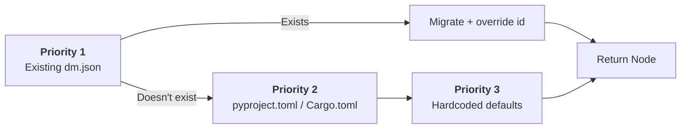
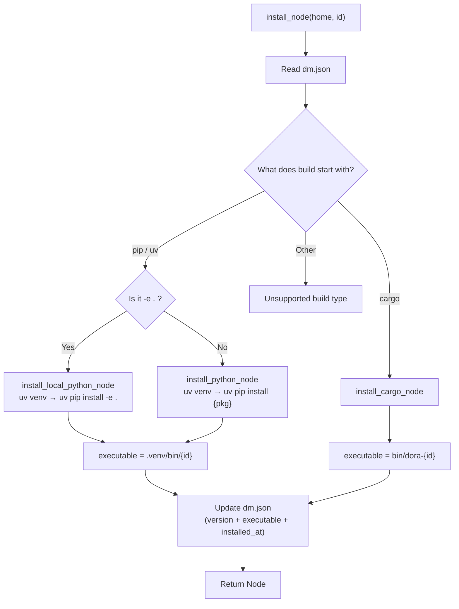
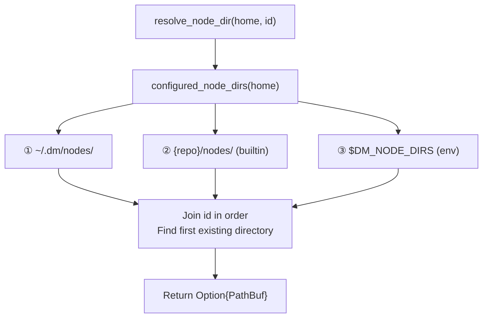

Dora Manager's node system is built on a clear principle: **every node is a self-contained directory with `dm.json` as the sole metadata contract**. This article provides an in-depth analysis of the complete node lifecycle — from "discovery" to "execution" — covering installation (pip/uv/cargo), import (local/GitHub), multi-directory path resolution, and per-node sandbox isolation. Understanding these mechanisms is a key prerequisite for grasping the `node: → path:` conversion in [Dataflow Transpiler: Multi-Pass Pipeline and Four-Layer Config Merge](08-transpiler.md).

Sources: [mod.rs](https://github.com/l1veIn/dora-manager/blob/master/crates/dm-core/src/node/mod.rs#L1-L34), [model.rs](https://github.com/l1veIn/dora-manager/blob/master/crates/dm-core/src/node/model.rs#L105-L168)

## Node Model: dm.json Contract

`dm.json` is the **single source of truth** for a node. It is persisted at the root of the node directory, precisely mapped by the `Node` struct, serialized to disk, and returned directly to the frontend via HTTP API.

The core fields of `Node` are divided into the following groups:

| Field Group | Key Fields | Purpose |
|--------|----------|------|
| **Identity** | `id`, `name`, `version` | Globally unique node ID, human-readable name, semantic version |
| **Source** | `source.build`, `source.github` | Build command (e.g., `pip install -e .`) and GitHub repository URL |
| **Runtime** | `executable`, `runtime.language` | Relative path to executable after installation, language tag |
| **Contract** | `ports[]`, `config_schema`, `dynamic_ports` | Port declarations, config schema, whether dynamic ports are allowed |
| **Display** | `display.category`, `display.tags`, `maintainers[]` | Frontend category display, tags, maintainer info |
| **File Index** | `files.readme`, `files.entry`, `files.tests` | Relative paths to key files, for browser viewing |
| **Runtime Path** | `path` (skip_deserializing) | Not stored in JSON, dynamically filled at load time |

A typical installed Python node `dm-log` has the following `dm.json` snippet — note that `executable` points to the binary entry in the node's private `.venv`:

```json
{
  "id": "dm-log",
  "version": "0.1.0",
  "source": { "build": "pip install -e ." },
  "executable": ".venv/bin/dm-log",
  "runtime": { "language": "python", "python": ">=3.10" }
}
```

For the Rust node `dm-queue`, `executable` points to `bin/dora-dm-queue`, and `source.build` is `cargo install --path .`. The two languages use different sandbox directory layouts but are consumed by the same path resolution pipeline.

Sources: [model.rs](https://github.com/l1veIn/dora-manager/blob/master/crates/dm-core/src/node/model.rs#L44-L168), [dm-log/dm.json](https://github.com/l1veIn/dora-manager/blob/master/nodes/dm-log/dm.json#L1-L103), [dm-queue/dm.json](https://github.com/l1veIn/dora-manager/blob/master/nodes/dm-queue/dm.json#L1-L154)

## Four Node Sources and Corresponding Operations

Nodes enter Dora Manager's jurisdiction through four paths, each with independent upstream API and CLI subcommands:

```mermaid
flowchart TD
    A["Node Sources"] --> B["`**create**`
    Scaffold new
    `dm node create`"]
    A --> C["`**import_local**
    Copy local directory
    `dm node import ./path`"]
    A --> D["`**import_git**
    Clone GitHub repo
    `dm node import https://...`"]
    A --> E["`**builtin**
    Repository built-in nodes
    Auto-discovered`"]
    B --> F["~/.dm/nodes/{id}/"]
    C --> F
    D --> F
    E --> G["{repo}/nodes/{id}/"]
    F --> H["init_dm_json
    Generate/migrate dm.json"]
    G --> H
    H --> I["install_node
    Build executable"]
```

### create: Scaffold Creation

`create_node` generates a complete Python node skeleton for the specified ID, including `pyproject.toml` (with `dora-rs` dependency), `{module}/main.py` (with input handling template), `README.md`, then calls `init_dm_json` to generate `dm.json`. The scaffold uses `pip install -e .` as the build command, indicating "editable install" mode.

Sources: [local.rs](https://github.com/l1veIn/dora-manager/blob/master/crates/dm-core/src/node/local.rs#L13-L86)

### import_local: Local Directory Import

`import_local` copies all contents from the source directory (in `content_only` mode) to `~/.dm/nodes/{id}/`, then executes `init_dm_json`. This operation has two safety checks: the target directory must not already exist (prevents overwrite), and the source directory must be valid.

Sources: [import.rs](https://github.com/l1veIn/dora-manager/blob/master/crates/dm-core/src/node/import.rs#L21-L55)

### import_git: GitHub Repository Clone

`import_git` supports cloning node code from any GitHub URL. It has sophisticated **sparse-checkout** capability — when the URL contains a subdirectory path (e.g., `https://github.com/org/repo/tree/main/nodes/demo`), only the specified subdirectory is cloned rather than the entire repository.

The URL parsing logic `parse_github_source` breaks down GitHub URLs into three components:

| URL Component | Example | Extraction Result |
|----------|------|----------|
| `https://github.com/acme/project` | Repository root | `repo_url=acme/project.git`, no ref/path |
| `.../tree/release-1/examples/demo` | Branch + subdirectory | `git_ref=release-1`, `repo_path=examples/demo` |
| `.../blob/main/README.md` | File view | Parsed same as above, but sparse-checkout for file-level path |

The clone strategy uses `--depth 1 --filter=blob:none --sparse` for minimal download. If cloning fails, the created target directory is automatically cleaned up (rollback on error).

Sources: [import.rs](https://github.com/l1veIn/dora-manager/blob/master/crates/dm-core/src/node/import.rs#L58-L206)

### builtin: Built-in Node Auto-Discovery

The `nodes/` directory under the project repository root contains built-in nodes (e.g., `dm-mjpeg`, `dm-queue`) that don't require explicit import. `builtin_nodes_dir()` in `paths.rs` locates `{repo}/nodes/` via `CARGO_MANIFEST_DIR` relative path, serving as the fallback search directory in the path resolution chain.

Sources: [paths.rs](https://github.com/l1veIn/dora-manager/blob/master/crates/dm-core/src/node/paths.rs#L7-L9)

## init_dm_json: Metadata Initialization Priority Chain

All four source paths ultimately converge at `init_dm_json` — the "initializer" for `dm.json`. This function implements a **three-level priority chain** to populate node metadata:



Specifically, when `dm.json` doesn't exist, each field is populated as follows:

| Field | pyproject.toml Source | Cargo.toml Source | Default |
|------|---------------------|-----------------|--------|
| `name` | `project.name` | `package.name` | Directory ID |
| `version` | `project.version` | `package.version` | Empty string |
| `description` | `project.description` or hints | `package.description` | Empty string |
| `source.build` | `maturin` backend → `pip install {id}`; otherwise → `pip install -e .` | — | `cargo install {id}` |
| `runtime.language` | `"python"` | `"rust"` | `package.json` exists → `"node"`, otherwise empty |
| `files.entry` | `{module}/main.py` → `src/{module}/main.py` → `main.py` | `src/main.rs` → `main.rs` | `None` |

**Build command inference** (`infer_build_command`) is particularly noteworthy: when the `pyproject.toml` `build-system.build-backend` is `maturin`, the system infers this is a Rust/Python hybrid project that cannot be compiled locally, so it uses `pip install {id}` (download precompiled wheel from PyPI). For pure Python projects, it uses `pip install -e .` (editable install).

Sources: [init.rs](https://github.com/l1veIn/dora-manager/blob/master/crates/dm-core/src/node/init.rs#L21-L112), [init.rs](https://github.com/l1veIn/dora-manager/blob/master/crates/dm-core/src/node/init.rs#L228-L248), [init.rs](https://github.com/l1veIn/dora-manager/blob/master/crates/dm-core/src/node/init.rs#L269-L289), [init.rs](https://github.com/l1veIn/dora-manager/blob/master/crates/dm-core/src/node/init.rs#L291-L336)

## Node Installation: Dual-Language Build Pipeline

`install_node` dispatches to different installation paths based on the first keyword of `source.build` in `dm.json`:



### Python Installation Sandbox

The core isolation strategy for Python nodes is **per-node `.venv`**. Each node has an independent virtual environment under `{node_dir}/.venv/`, without interference. The installation flow is:

1. **Clean old venv**: If `.venv` already exists, delete it first to avoid `uv venv` interactive prompts
2. **Create venv**: Prefer `uv venv` (faster Rust implementation), fallback to `python3 -m venv`
3. **Install dependencies**: Local mode uses `uv pip install -e .`, package mode uses `uv pip install {package_spec}`
4. **Extract version**: Read the real version number from the installed package via `importlib.metadata.version()`

After installation, `executable` is set to `.venv/bin/{id}` (Unix) or `.venv/Scripts/{id}.exe` (Windows), pointing to the entry point declared by `[project.scripts]` in `pyproject.toml`.

### Rust Installation Sandbox

Rust nodes use `cargo install --root {node_dir}` to output build artifacts to `bin/` under the node directory. For local source nodes (`build` contains `--path .`), `cargo install --path .` is executed within the node directory; otherwise, the `dora-{id}` package is installed from crates.io.

The executable is named `bin/dora-{id}` (automatically prefixed with `dora-` for IDs without it), ensuring naming consistency with the dora ecosystem.

Sources: [install.rs](https://github.com/l1veIn/dora-manager/blob/master/crates/dm-core/src/node/install.rs#L11-L75), [install.rs](https://github.com/l1veIn/dora-manager/blob/master/crates/dm-core/src/node/install.rs#L77-L133), [install.rs](https://github.com/l1veIn/dora-manager/blob/master/crates/dm-core/src/node/install.rs#L135-L194), [install.rs](https://github.com/l1veIn/dora-manager/blob/master/crates/dm-core/src/node/install.rs#L235-L274)

## Multi-Directory Path Resolution

Node path resolution is the bridge connecting "node management" and "dataflow execution". `resolve_node_dir` implements an **ordered search chain** to find nodes across multiple candidate directories:



The search chain is built by `configured_node_dirs`, containing three levels:

| Priority | Directory | Description |
|--------|------|------|
| 1 | `~/.dm/nodes/` | User-installed/imported nodes (writable, uninstallable) |
| 2 | `{repo}/nodes/` | Repository built-in nodes (read-only, cannot be deleted via `uninstall`) |
| 3 | `$DM_NODE_DIRS` | Additional search paths specified by environment variable (supports multiple directories, separated by system path separator) |

The `push_unique` helper function ensures the same absolute path doesn't appear twice. `resolve_dm_json_path` appends `dm.json` on top of `resolve_node_dir`, while `is_managed_node` only checks the first level (`~/.dm/nodes/{id}/`), used to distinguish "uninstallable nodes" from "built-in nodes".

`list_nodes` uses `BTreeSet` for deduplication — when multiple search directories contain nodes with the same name, only the first occurrence is adopted. This ensures priority semantics: user-installed nodes can "shadow" built-in nodes with the same name.

Sources: [paths.rs](https://github.com/l1veIn/dora-manager/blob/master/crates/dm-core/src/node/paths.rs#L1-L53), [local.rs](https://github.com/l1veIn/dora-manager/blob/master/crates/dm-core/src/node/local.rs#L88-L136), [local.rs](https://github.com/l1veIn/dora-manager/blob/master/crates/dm-core/src/node/local.rs#L138-L163)

## File Access Security: Path Traversal Protection

Nodes support browsing their directory contents via the API (file tree + file content), which introduces path traversal attack risks. `resolve_safe_node_file` implements two layers of protection:

**First layer: Component whitelist**. Iterates through each `Component` of the request path, only allowing `Normal` (regular filename) and `CurDir` (`.`). Upon encountering `ParentDir` (`..`), `RootDir` (`/`), or `Prefix` (Windows drive letter), it immediately rejects.

**Second layer: Canonicalization check**. After `root.join(requested)`, calls `canonicalize()` on the result, then verifies the canonicalized path still has the node root directory as its prefix. This blocks escape attempts via symlinks and other bypass methods.

```rust
// Core protection logic (simplified)
let candidate = root.join(requested);
let resolved = candidate.canonicalize()?;
if !resolved.starts_with(root) {
    bail!("Invalid node file path");
}
```

Additionally, `collect_node_files` filters out common non-content directories (`.git`, `.venv`, `node_modules`, `target`, etc.) when building the file tree, ensuring the browser only displays meaningful files.

Sources: [local.rs](https://github.com/l1veIn/dora-manager/blob/master/crates/dm-core/src/node/local.rs#L279-L324)

## Node Resolution in the Transpilation Pipeline

In the multi-Pass pipeline of [Dataflow Transpiler: Multi-Pass Pipeline and Four-Layer Config Merge](08-transpiler.md), **Pass 2: resolve_paths** is the core consumer of the node management system. It converts the `node: dm-log` declared by users in YAML into the absolute `path: /home/user/.dm/nodes/dm-log/.venv/bin/dm-log` required by the dora runtime.

The diagnostic strategy for resolution uses a **collection approach** (non-short-circuit) — even if one node fails to resolve, the pipeline continues processing remaining nodes, reporting all issues at once. Diagnostic types include:

| Diagnostic Type | Meaning | Trigger Condition |
|----------|------|----------|
| `NodeNotInstalled` | Node directory doesn't exist | `resolve_node_dir` returns `None` |
| `MetadataUnreadable` | dm.json missing or format error | File doesn't exist or deserialization fails |
| `MissingExecutable` | Node not installed | `executable` field is empty |

When a node cannot be resolved, the transpiler does not abort; instead, it preserves the original `node:` field in the emit stage — allowing the dora runtime to give a more precise error message.

Sources: [passes.rs](https://github.com/l1veIn/dora-manager/blob/master/crates/dm-core/src/dataflow/transpile/passes.rs#L267-L341), [error.rs](https://github.com/l1veIn/dora-manager/blob/master/crates/dm-core/src/dataflow/transpile/error.rs#L1-L62)

## Runtime Sandbox and Environment Injection

Node sandbox isolation is reflected in three dimensions:

**Dependency isolation**: Each Python node has an independent `.venv`, and each Rust node has an independent `bin/`. Different nodes can depend on different versions of the same library without conflict. During installation, if an old venv exists, it is deleted and rebuilt to ensure a clean state.

**Environment variable injection**: The transpiler pipeline's Pass 4 `inject_runtime_env` injects four standard environment variables for each managed node:

| Environment Variable | Value | Purpose |
|----------|-----|------|
| `DM_RUN_ID` | UUID | Current run instance identifier |
| `DM_NODE_ID` | Node ID from YAML | Node's identity in the dataflow |
| `DM_RUN_OUT_DIR` | `~/.dm/runs/{id}/out/` | Run output artifacts directory |
| `DM_SERVER_URL` | `http://127.0.0.1:3210` | dm-server address |

These variables allow nodes to interact with the management system without hardcoding any infrastructure addresses.

**File system boundaries**: Nodes write artifacts via `DM_RUN_OUT_DIR` and communicate with the frontend via `DM_SERVER_URL`. The path traversal protection in the file browsing API ensures the node directory becomes a natural file system sandbox boundary.

Sources: [passes.rs](https://github.com/l1veIn/dora-manager/blob/master/crates/dm-core/src/dataflow/transpile/passes.rs#L418-L449), [install.rs](https://github.com/l1veIn/dora-manager/blob/master/crates/dm-core/src/node/install.rs#L30-L44)

## Future Evolution: Precompiled Binary Distribution

The current installation pipeline requires users to locally install the corresponding language toolchain (Python/uv or Rust/cargo). The design document `dm-node-install.md` describes a **precompiled binary-first** strategy inspired by `cargo-binstall`:

1. Read the new `source.binary` field in `dm.json`
2. Detect current platform target triple
3. Prefer downloading precompiled binaries from GitHub Releases (seconds to complete)
4. Fall back to existing local compilation path when no precompiled version is found

This evolution will be implemented in three phases: first establish multi-platform CI build artifacts, then add download logic to `install_node`, and finally unify the installation experience for Python/Rust nodes.

Sources: [dm-node-install.md](https://github.com/l1veIn/dora-manager/blob/master/docs/design/dm-node-install.md#L1-L118)

## Further Reading

- [Node (Node): dm.json Contract and Executable Unit](04-node-concept.md) — User-oriented introduction to the node concept
- [Dataflow Transpiler: Multi-Pass Pipeline and Four-Layer Config Merge](08-transpiler.md) — Position of node path resolution in the transpilation pipeline
- [Built-in Nodes Overview: From Media Capture to AI Inference](19-builtin-nodes) — Overview of built-in node functionality
- [Port Schema Specification: Arrow Type System-Based Port Validation](20-port-schema) — Type system for node port declarations