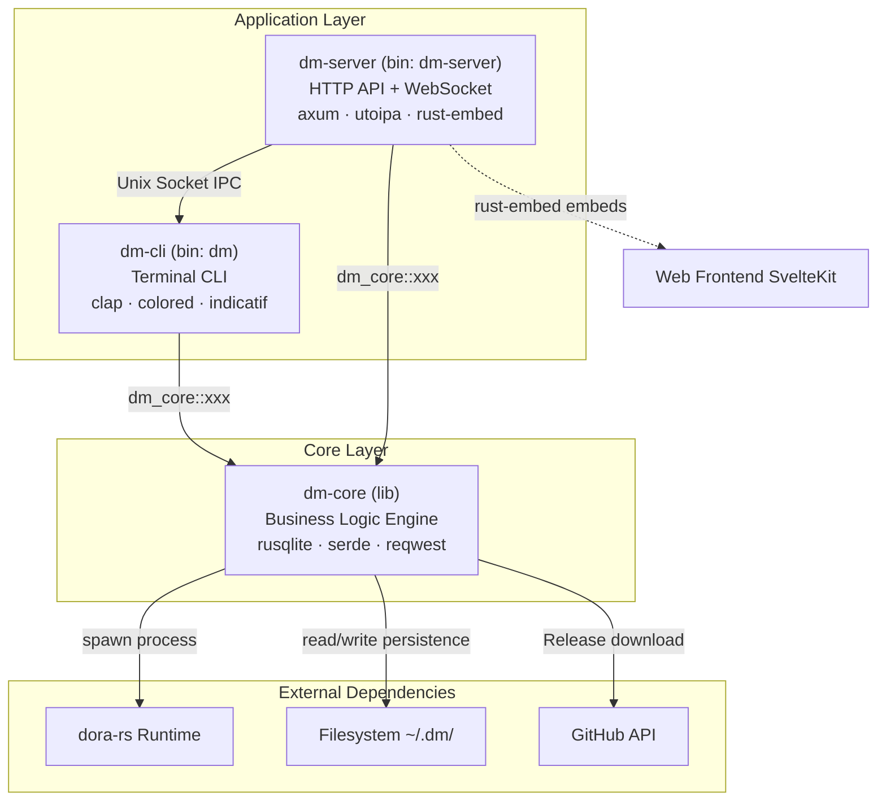
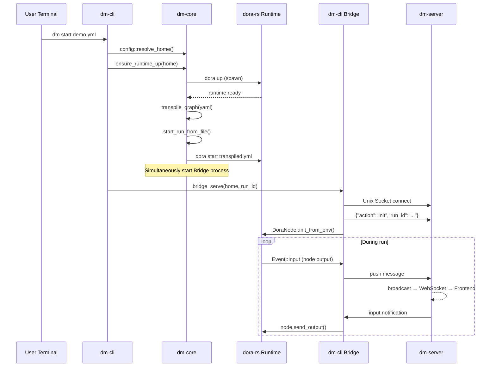

The backend of Dora Manager adopts a classic **three-tier separated architecture**, organizing all Rust code into three independent crates: `dm-core` hosts all business logic, `dm-cli` provides terminal command-line access, and `dm-server` provides HTTP/WebSocket access. Their relationship can be summarized in one phrase -- **one headless engine, two thin adapter shells**. This document systematically analyzes the responsibility boundaries, module organization, and interaction patterns of each tier, helping you build a clear mental model before diving into individual subsystems.

Sources: [Cargo.toml](https://github.com/l1veIn/dora-manager/blob/main/Cargo.toml), [crates/dm-core/Cargo.toml](https://github.com/l1veIn/dora-manager/blob/main/crates/dm-core/Cargo.toml#L1-L8), [crates/dm-cli/Cargo.toml](https://github.com/l1veIn/dora-manager/blob/main/crates/dm-cli/Cargo.toml#L1-L12), [crates/dm-server/Cargo.toml](https://github.com/l1veIn/dora-manager/blob/main/crates/dm-server/Cargo.toml#L1-L12)

## Tier Overview and Dependency Relationships

The Mermaid diagram below shows the dependency direction between the three crates. Reading prerequisite: **arrows indicate "depends on"**, meaning both dm-cli and dm-server depend on dm-core, while dm-core does not depend on any upper-tier crate.



The core design constraint is very clear: **there is no direct dependency between dm-cli and dm-server**. Both are merely consumers of dm-core, providing differentiated access experiences for terminal users and web browsers respectively. The only exception is the Bridge IPC mechanism (via Unix Socket), which allows the Bridge process in dm-cli to establish a real-time communication channel with dm-server at runtime.

Sources: [Cargo.toml](https://github.com/l1veIn/dora-manager/blob/main/Cargo.toml), [crates/dm-cli/Cargo.toml](https://github.com/l1veIn/dora-manager/blob/main/crates/dm-cli/Cargo.toml#L15), [crates/dm-server/Cargo.toml](https://github.com/l1veIn/dora-manager/blob/main/crates/dm-server/Cargo.toml#L15)

## dm-core: Headless Business Engine

dm-core is the **heart** of the entire system -- it does not care whether requests come from a terminal or a browser, and is solely responsible for pure business operations such as "installing a dora version", "starting a dataflow", and "collecting run metrics". It exists as a `lib` crate, exposing functionality through `pub fn`, and is internally organized into self-contained vertical slices by domain modules.

### Module Map

dm-core internally contains **9 core domain modules**. Each module follows a consistent layered structure internally: `model` (data structure definitions), `repo` (filesystem read/write), and `service` (business orchestration), forming a clear separation of concerns.

```text
dm-core/src/
├── api/              ← Top-level public API (setup, doctor, up/down, versions)
├── config.rs         ← DM_HOME configuration system (config.toml parsing, path conventions)
├── dataflow/         ← Dataflow management (CRUD + import + transpiler)
│   └── transpile/    ← Multi-pass transpilation pipeline
├── dora.rs           ← dora CLI process wrapper (run_dora, exec_dora)
├── env.rs            ← Environment detection (Python, uv, Rust availability)
├── events/           ← Observability event storage (SQLite + XES export)
├── install/          ← dora version installation (GitHub Release download + source compilation)
├── node/             ← Node management (installation, import, dm.json contract)
│   └── schema/       ← Port Schema validation (Arrow type system)
├── runs/             ← Run instance lifecycle (start, status refresh, metrics collection)
│   ├── service_admin.rs    ← Cleanup, deletion
│   ├── service_query.rs    ← Query, listing
│   ├── service_runtime.rs  ← Status sync, stop
│   └── service_start.rs    ← Start orchestration
├── types.rs          ← Cross-module shared data structures (StatusReport, DoctorReport...)
└── util.rs           ← Utility functions
```

The dependencies between these modules form a directed acyclic graph: `api` is the highest-level facade module that coordinates lower-level modules such as `install`, `dora`, `config`, and `runs` to complete complex business flows. `types.rs` and `util.rs` serve as infrastructure shared by all modules.

Sources: [crates/dm-core/src/lib.rs](https://github.com/l1veIn/dora-manager/blob/main/crates/dm-core/src/lib.rs#L1-L22), [crates/dm-core/src/runs/mod.rs](https://github.com/l1veIn/dora-manager/blob/main/crates/dm-core/src/runs/mod.rs#L1-L27), [crates/dm-core/src/node/mod.rs](https://github.com/l1veIn/dora-manager/blob/main/crates/dm-core/src/node/mod.rs#L1-L35), [crates/dm-core/src/dataflow/mod.rs](https://github.com/l1veIn/dora-manager/blob/main/crates/dm-core/src/dataflow/mod.rs#L1-L22)

### Public API Surface

dm-core exposes a set of **top-level convenience functions** through `pub use` in `lib.rs`. These functions constitute the most commonly used entry points for external crates:

| Function | Purpose | Underlying Module |
|----------|---------|-------------------|
| `setup(home, verbose, progress_tx)` | One-click install Python + uv + dora | `api::setup` |
| `doctor(home)` | Environment health diagnosis | `api::doctor` |
| `install(home, version, ...)` | Install a specific dora version | `install` |
| `up(home, verbose)` | Start dora coordinator + daemon | `api::runtime` |
| `down(home, verbose)` | Stop dora runtime | `api::runtime` |
| `status(home, verbose)` | Runtime status overview | `api::runtime` |
| `versions(home)` | List installed and available versions | `api::version` |
| `auto_down_if_idle(home, verbose)` | Auto-shutdown runtime when idle | `api::runtime` |

In addition, each domain module exposes more fine-grained APIs, such as `runs::start_run_from_yaml()`, `node::install_node()`, `dataflow::import_sources()`, etc. dm-cli and dm-server can choose to call either the top-level convenience functions or the fine-grained domain module APIs as needed.

Sources: [crates/dm-core/src/lib.rs](https://github.com/l1veIn/dora-manager/blob/main/crates/dm-core/src/lib.rs#L18-L22), [crates/dm-core/src/api/mod.rs](https://github.com/l1veIn/dora-manager/blob/main/crates/dm-core/src/api/mod.rs#L1-L12)

### Core Design Principle: Node-Agnostic

dm-core follows a key constraint -- **it does not know about the existence of any specific node**. This means that specific node names such as `dora-qwen` or `dm-button` never appear in dm-core's code. Adding a new node only requires writing that node's code and declaring metadata in its `dm.json`, without modifying a single line of dm-core code. The transpiler reads `dm.json` to resolve node paths and validate port schemas, achieving fully data-driven extensibility.

Sources: [crates/dm-core/src/dataflow/transpile/mod.rs](https://github.com/l1veIn/dora-manager/blob/main/crates/dm-core/src/dataflow/transpile/mod.rs), [crates/dm-core/src/node/schema/mod.rs](https://github.com/l1veIn/dora-manager/blob/main/crates/dm-core/src/node/schema/mod.rs)

### dora Process Wrapper Layer

The `dora.rs` module wraps all process-level interactions between dm-core and the dora-rs runtime. It provides two invocation modes:

- **`run_dora()`**: Captures stdout/stderr and returns an `(exit_code, stdout, stderr)` tuple, used for commands like `check` and `list` that need to parse output
- **`exec_dora()`**: Inherits stdio and returns the raw exit code, used for commands like `start` that require interactive output

Both functions follow a unified pattern: first resolve the currently active version's dora binary path from configuration via `active_dora_bin(home)`, then execute it as a child process. This wrapper enables dm-core to transparently point to the correct binary after version switching.

Sources: [crates/dm-core/src/dora.rs](https://github.com/l1veIn/dora-manager/blob/main/crates/dm-core/src/dora.rs#L20-L78)

### Run Instance Service: Internal Layering

The `runs` module is one of the most complex subsystems in dm-core. It splits the run instance business logic into 5 service files, each focused on a single responsibility:

| File | Responsibility |
|------|---------------|
| `service_start.rs` | Start orchestration: transpile YAML → launch dora process → record run.json |
| `service_runtime.rs` | Status sync: poll dora list → refresh run status → stop runs |
| `service_query.rs` | Query: listing, details, log reading, transpiled artifact reading |
| `service_admin.rs` | Administration: delete run records, clean up history |
| `service_metrics.rs` | Metrics: CPU/memory collection and aggregation |

Notably, `service.rs` assembles these 5 files into a unified public API surface via the `#[path = "..."]` attribute, exposing 20+ functions externally. This organizational approach maintains manageable file granularity while presenting a cohesive module externally.

Sources: [crates/dm-core/src/runs/service.rs](https://github.com/l1veIn/dora-manager/blob/main/crates/dm-core/src/runs/service.rs#L1-L47), [crates/dm-core/src/runs/mod.rs](https://github.com/l1veIn/dora-manager/blob/main/crates/dm-core/src/runs/mod.rs#L8-L27)

### Event System

dm-core includes a **thread-safe SQLite event store** (`EventStore`) that uses `Mutex<Connection>` + WAL mode to guarantee concurrency safety. All key operations (version installation, dataflow start, run stop) automatically emit structured events, supporting filtered queries by `source` (core / server / frontend / ci), `case_id`, `activity`, time range, and more. Events can be exported in XES format for process mining analysis.

Sources: [crates/dm-core/src/events/mod.rs](https://github.com/l1veIn/dora-manager/blob/main/crates/dm-core/src/events/mod.rs#L1-L16), [crates/dm-core/src/events/store.rs](https://github.com/l1veIn/dora-manager/blob/main/crates/dm-core/src/events/store.rs#L10-L44)

## dm-cli: Terminal Access Layer

dm-cli is an **extremely thin command-line adapter**. Its entire responsibility can be summarized in three points: **parse arguments** (via `clap`), **call dm-core**, and **format output** (via `colored` + `indicatif`). It contains no business logic whatsoever -- even the progress bar callback data comes from dm-core's `mpsc::UnboundedSender<InstallProgress>` channel.

### Command Tree

```text
dm (clap Parser)
├── setup          ← One-click install (Python + uv + dora)
├── doctor         ← Environment health diagnosis
├── install        ← Install a specific dora version
├── uninstall      ← Uninstall version
├── use            ← Switch active version
├── versions       ← List installed and available versions
├── up             ← Start dora coordinator + daemon
├── down           ← Stop runtime
├── status         ← Runtime status overview
├── node           ← Node management subcommand group
│   ├── install
│   ├── import
│   ├── list
│   └── uninstall
├── dataflow       ← Dataflow management subcommand group
│   └── import
├── start          ← Start dataflow (auto-ensure runtime up)
├── runs           ← Run history management
│   ├── stop
│   ├── delete
│   ├── logs [--follow]
│   └── clean
├── bridge         ← (hidden) Bridge IPC service
└── --             ← Pass-through to native dora CLI
```

Sources: [crates/dm-cli/src/main.rs](https://github.com/l1veIn/dora-manager/blob/main/crates/dm-cli/src/main.rs#L13-L115), [crates/dm-cli/src/cmd/mod.rs](https://github.com/l1veIn/dora-manager/blob/main/crates/dm-cli/src/cmd/mod.rs#L1-L4)

### Invocation Pattern: Pure Delegation + Terminal Rendering

dm-cli's main function follows a fixed three-step pattern: **parse CLI arguments → resolve DM_HOME path → call dm-core function → render output**. Taking `dm doctor` as an example:

```rust
Commands::Doctor => {
    let report = dm_core::doctor(&home).await?;
    display::print_doctor_report(&report);
}
```

The entire handler has only 3 lines of effective code. The `display.rs` module is responsible for rendering the structured data returned by dm-core into colored terminal output, without containing any conditional branching logic or state judgment.

Sources: [crates/dm-cli/src/main.rs](https://github.com/l1veIn/dora-manager/blob/main/crates/dm-cli/src/main.rs#L186-L265), [crates/dm-cli/src/display.rs](https://github.com/l1veIn/dora-manager/blob/main/crates/dm-cli/src/display.rs#L1-L65)

### Bridge Process: dm-cli's Special Role

dm-cli contains a special `bridge` command (hidden, not exposed to users). The Bridge process runs as a node within a dora dataflow, responsible for building an IPC bridge between the dora event system and dm-server. It maintains a persistent connection with dm-server via Unix Socket (`~/.dm/bridge.sock`), enabling bidirectional message forwarding:

- **Uplink direction**: Forwards output events from dora nodes (such as text messages from `dm-message` or stream metadata from `dm-mjpeg`) to dm-server
- **Downlink direction**: Injects user input from the web frontend (such as button clicks, slider changes) back into the dora dataflow

This makes dm-cli not only a terminal tool for direct user interaction, but also a critical **communication intermediary** role during the run instance lifecycle.

Sources: [crates/dm-cli/src/bridge.rs](https://github.com/l1veIn/dora-manager/blob/main/crates/dm-cli/src/bridge.rs#L57-L193)

## dm-server: HTTP Access Layer

dm-server is built on **Axum** and adds four unique capabilities on top of dm-core: HTTP routing, WebSocket real-time push, Swagger document auto-generation, and frontend static resource embedding. It listens on `127.0.0.1:3210` and provides a complete RESTful API for the web visualization panel.

### Service State Model

dm-server's global state is managed through the `AppState` struct, wrapped in `Arc` for zero-cost Clone sharing. All handlers access shared state via Axum's `State<AppState>` extractor:

```text
AppState (Clone)
├── home: Arc<PathBuf>           ← DM_HOME path
├── events: Arc<EventStore>      ← SQLite event store (from dm-core)
├── messages: broadcast::Sender  ← Message notification broadcast channel
└── media: Arc<MediaRuntime>     ← Media backend runtime (dm-server exclusive)
```

Sources: [crates/dm-server/src/state.rs](https://github.com/l1veIn/dora-manager/blob/main/crates/dm-server/src/state.rs#L1-L25), [crates/dm-server/src/main.rs](https://github.com/l1veIn/dora-manager/blob/main/crates/dm-server/src/main.rs#L79-L96)

### Handler Delegation Pattern

Each handler in dm-server follows a unified **thin delegation pattern** -- extract parameters from the HTTP request, call the corresponding dm-core function, and serialize the result as JSON to return. The handler layer contains no business logic and only handles HTTP semantics (status codes, error formatting).

Taking `GET /api/runs` as an example, the complete implementation is as follows:

```rust
pub async fn list_runs(
    State(state): State<AppState>,
    Query(params): Query<PaginationParams>,
) -> impl IntoResponse {
    let limit = params.limit.unwrap_or(20);
    let offset = params.offset.unwrap_or(0);
    let filter = dm_core::runs::RunListFilter { ... };
    match dm_core::runs::list_runs_filtered(&state.home, limit, offset, &filter) {
        Ok(result) => Json(result).into_response(),
        Err(e) => err(e).into_response(),
    }
}
```

Sources: [crates/dm-server/src/handlers/runs.rs](https://github.com/l1veIn/dora-manager/blob/main/crates/dm-server/src/handlers/runs.rs#L58-L75), [crates/dm-server/src/handlers/mod.rs](https://github.com/l1veIn/dora-manager/blob/main/crates/dm-server/src/handlers/mod.rs#L43-L46)

### API Route Structure

The HTTP API is organized into 9 route groups by functional domain, totaling 50+ endpoints. The table below shows the mapping between route prefixes and dm-core modules:

| Route Prefix | Functional Domain | Core Delegation Target |
|--------------|-------------------|----------------------|
| `/api/doctor`, `/api/versions`, `/api/status` | Environment Management | `api::doctor`, `api::versions`, `api::status` |
| `/api/install`, `/api/uninstall`, `/api/use`, `/api/up`, `/api/down` | Runtime Management | `api::install`, `api::up/down` |
| `/api/nodes` | Node Management | `node::list_nodes`, `node::install_node` |
| `/api/dataflows` | Dataflow CRUD | `dataflow::list`, `dataflow::save` |
| `/api/dataflow/start`, `/api/dataflow/stop` | Dataflow Execution | `runs::start_run_from_yaml` |
| `/api/runs` | Run History | `runs::list_runs`, `runs::get_run` |
| `/api/runs/{id}/messages`, `/api/runs/{id}/streams` | Interaction Messages | `services::message` (dm-server private) |
| `/api/runs/{id}/ws` | WebSocket Real-time Push | Filesystem watcher + `notify` crate |
| `/api/events` | Observability | `events::EventStore` |

Sources: [crates/dm-server/src/main.rs](https://github.com/l1veIn/dora-manager/blob/main/crates/dm-server/src/main.rs#L97-L235), [crates/dm-server/src/handlers/mod.rs](https://github.com/l1veIn/dora-manager/blob/main/crates/dm-server/src/handlers/mod.rs#L1-L41)

### Server-Exclusive Modules

dm-server has two **server-exclusive modules** that do not exist in dm-core. They handle HTTP-side concerns that are not appropriate for the core layer:

- **`services::media`** (`MediaRuntime`): Manages the full lifecycle of the MediaMTX media backend -- from downloading the binary from GitHub, generating configuration files, launching child processes, and liveness probes, to exposing RTSP/HLS/WebRTC streaming endpoints. This module encapsulates process management and network configuration logic that is only needed in dm-server, so it is placed in the server layer rather than the core layer.

- **`services::message`** (`MessageService`): SQLite-based **run instance interaction message persistence**. Each run instance maintains an independent `interaction.db` under `runs/<uuid>/`, recording upstream messages from dora nodes and downstream input from the web frontend. This service achieves real-time push through `broadcast::Sender<MessageNotification>` -- when new messages are written, all WebSocket connections subscribed to the channel receive immediate notification.

Sources: [crates/dm-server/src/services/media.rs](https://github.com/l1veIn/dora-manager/blob/main/crates/dm-server/src/services/media.rs#L70-L106), [crates/dm-server/src/services/message.rs](https://github.com/l1veIn/dora-manager/blob/main/crates/dm-server/src/services/message.rs#L104-L161)

### Bridge Socket: IPC Channel Between dm-server and dm-cli

dm-server creates a Unix Domain Socket (`~/.dm/bridge.sock`) at startup for receiving real-time connections from the dm-cli Bridge process. `bridge_socket_loop` performs a two-phase handshake for each connection in the main loop:

1. **Initialization phase**: Reads the `{"action":"init","run_id":"..."}` message and binds the connection to a specific run instance
2. **Bidirectional forwarding phase**: Uses `tokio::select!` to simultaneously listen for upstream messages (reading from Bridge and writing to the interaction database) and downstream notifications (reading from the broadcast channel and writing back to Bridge)

Sources: [crates/dm-server/src/handlers/bridge_socket.rs](https://github.com/l1veIn/dora-manager/blob/main/crates/dm-server/src/handlers/bridge_socket.rs#L28-L123)

### Background Tasks

In addition to the main HTTP service, dm-server starts an **idle monitoring coroutine** that checks every 30 seconds whether there are active run instances. When all runs have ended, it automatically executes `dm_core::auto_down_if_idle` to release dora runtime resources. This is a resource optimization strategy -- in the web panel scenario, users may forget to manually run `dm down`, and idle auto-shutdown avoids unnecessary resource consumption.

Sources: [crates/dm-server/src/main.rs](https://github.com/l1veIn/dora-manager/blob/main/crates/dm-server/src/main.rs#L244-L251)

### Frontend Static Embedding

dm-server uses `rust_embed` to embed the compiled SvelteKit artifacts (`web/build/` directory) into the Rust binary at compile time. At runtime, unmatched API requests are directed to the frontend static resource service via the `fallback` route, achieving **single-binary deployment** -- no additional nginx or CDN is needed.

Sources: [crates/dm-server/src/main.rs](https://github.com/l1veIn/dora-manager/blob/main/crates/dm-server/src/main.rs#L20-L22), [crates/dm-server/src/main.rs](https://github.com/l1veIn/dora-manager/blob/main/crates/dm-server/src/main.rs#L234-L235)

## Three-Tier Comparison Quick Reference

| Dimension | dm-core | dm-cli | dm-server |
|-----------|---------|--------|-----------|
| **Crate type** | `lib` | `bin` (`dm`) | `bin` (`dm-server`) |
| **Core responsibility** | All business logic | CLI argument parsing + terminal rendering | HTTP routing + WebSocket + static resources |
| **Dependency direction** | Depended upon (zero upper-layer dependencies) | → dm-core | → dm-core |
| **Unique dependencies** | rusqlite, sha2, zip | clap, colored, indicatif, dora-core | axum, utoipa, rust-embed, notify |
| **State management** | Stateless functions + filesystem | Stateless (each command is an independent process) | `AppState` (Arc sharing + broadcast channel) |
| **Output method** | Returns `Result<T>` | `println!` + colored + progress bars | `Json` + HTTP status codes + WebSocket frames |
| **Testing strategy** | Unit tests (tempdir isolation) | Integration tests (`assert_cmd`) | Handler-level tests |

Sources: [crates/dm-core/Cargo.toml](https://github.com/l1veIn/dora-manager/blob/main/crates/dm-core/Cargo.toml#L1-L30), [crates/dm-cli/Cargo.toml](https://github.com/l1veIn/dora-manager/blob/main/crates/dm-cli/Cargo.toml#L1-L35), [crates/dm-server/Cargo.toml](https://github.com/l1veIn/dora-manager/blob/main/crates/dm-server/Cargo.toml#L1-L37)

## Design Decisions and Trade-offs

### Why Three-Tier Separation Instead of Two-Tier?

Splitting CLI and Server into independent crates rather than distinguishing them with subcommands in the same binary is based on three considerations:

1. **Dependency isolation**: dm-cli needs `dora-core` for YAML parsing (used by the `start` command), while dm-server needs the HTTP ecosystem such as `axum` + `utoipa`; merging them would introduce unnecessary compilation dependencies, increasing build time and binary size.
2. **Deployment flexibility**: CI/CD environments may only need the `dm` CLI, while web panel scenarios need `dm-server`; independent distribution avoids carrying unused dependencies.
3. **Compilation speed**: When dm-core changes, only dm-core + the crates that depend on it need to be recompiled; if CLI and Server were in the same crate, any change would require a full recompilation.

Sources: [Cargo.toml](https://github.com/l1veIn/dora-manager/blob/main/Cargo.toml)

### Why Does dm-core Use a Functional API Instead of a Trait-Based Architecture?

dm-core exposes a set of `pub async fn` and `pub fn` rather than object-oriented trait interfaces. This choice enables zero-boilerplate code for callers -- CLI and Server can simply call `dm_core::up(&home, verbose)` directly, without implementing traits or constructing complex context objects. Internal modules achieve testability through the `RuntimeBackend` trait (visible in `service_start.rs`), but this abstraction is limited to internal use and not exposed to external callers. This is a **progressive complexity** strategy -- traits are introduced only at boundaries that truly need polymorphism, avoiding over-engineering.

Sources: [crates/dm-core/src/lib.rs](https://github.com/l1veIn/dora-manager/blob/main/crates/dm-core/src/lib.rs#L18-L22), [crates/dm-core/src/runs/service.rs](https://github.com/l1veIn/dora-manager/blob/main/crates/dm-core/src/runs/service.rs#L1-L47)

## Complete Dataflow Example: From Terminal to Runtime

Using the `dm start demo.yml` command as an example, the complete call chain spans all three tiers, demonstrating the collaboration between layers:



Sources: [crates/dm-cli/src/main.rs](https://github.com/l1veIn/dora-manager/blob/main/crates/dm-cli/src/main.rs#L364-L385), [crates/dm-cli/src/bridge.rs](https://github.com/l1veIn/dora-manager/blob/main/crates/dm-cli/src/bridge.rs#L57-L193), [crates/dm-server/src/handlers/bridge_socket.rs](https://github.com/l1veIn/dora-manager/blob/main/crates/dm-server/src/handlers/bridge_socket.rs#L28-L123)

## Further Reading

- To learn more about the multi-pass pipeline and four-layer configuration merging mechanism of the dataflow transpiler, read [Dataflow Transpiler: Multi-Pass Pipeline and Four-Layer Configuration Merging](11-shu-ju-liu-zhuan-yi-qi-transpiler-duo-pass-guan-xian-yu-si-ceng-pei-zhi-he-bing)
- To understand node installation, import, and path resolution details, read [Node Management System: Installation, Import, Path Resolution, and Sandbox Isolation](12-jie-dian-guan-li-xi-tong-an-zhuang-dao-ru-lu-jing-jie-xi-yu-sha-xiang-ge-chi)
- To learn about run instance start orchestration and metrics collection workflows, read [Runtime Service: Start Orchestration, Status Refresh, and CPU/Memory Metrics Collection](13-yun-xing-shi-fu-wu-qi-dong-bian-pai-zhuang-tai-shua-xin-yu-cpu-nei-cun-zhi-biao-cai-ji)
- For the complete HTTP API endpoint catalog, read [HTTP API Overview: REST Routes, WebSocket Real-time Channels, and Swagger Documentation](15-http-api-quan-lan-rest-lu-you-websocket-shi-shi-tong-dao-yu-swagger-wen-dang)
- To understand the DM_HOME directory structure and config.toml configuration system, read [Configuration System: DM_HOME Directory Structure and config.toml](16-pei-zhi-ti-xi-dm_home-mu-lu-jie-gou-yu-config-toml)
