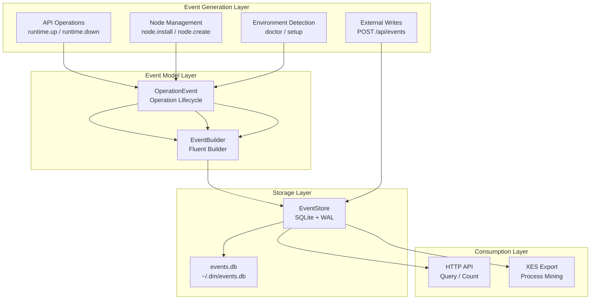
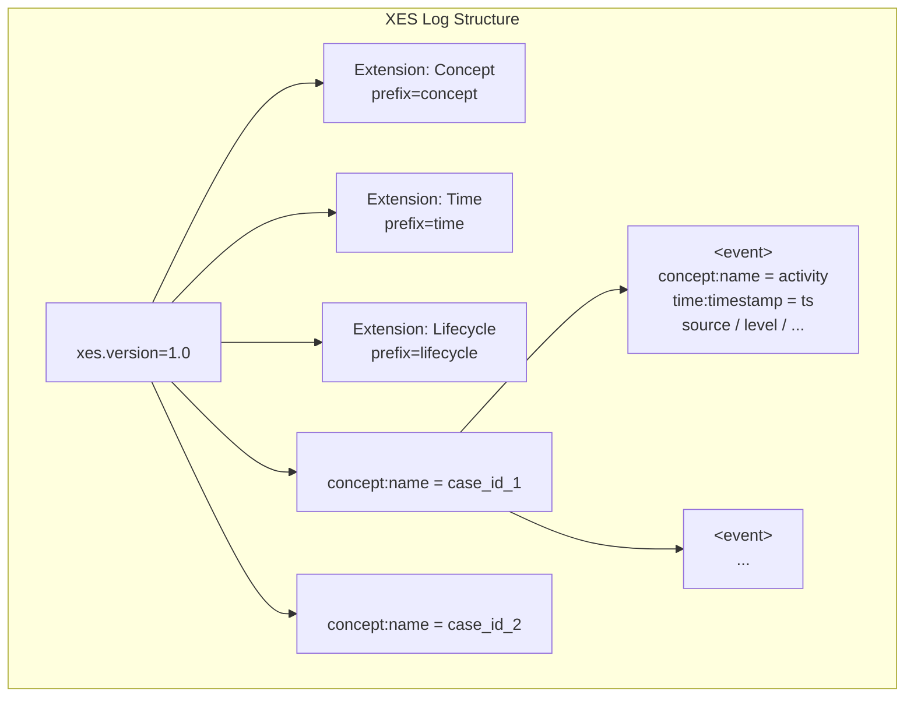
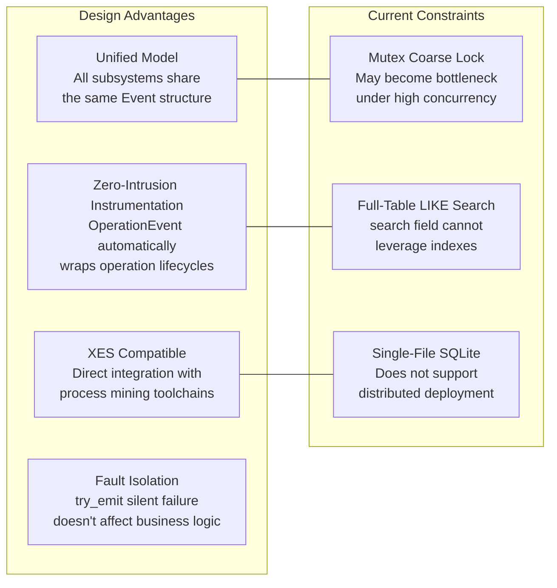

Dora Manager's event system is a **unified observability infrastructure** that normalizes system logs, dataflow execution traces, HTTP request records, frontend analytics, and CI metrics into a single event model, stored in a SQLite database. The model is designed to be compatible with the **XES (eXtensible Event Stream) standard**, enabling direct export to XES XML format for consumption by process mining tools such as PM4Py. This article provides an in-depth analysis across five dimensions: data model, storage engine, operational semantics, HTTP API, and XES export mechanism.

Sources: [mod.rs](https://github.com/l1veIn/dora-manager/blob/master/crates/dm-core/src/events/mod.rs#L1-L5)

## Design Philosophy: Events as the Single Source of Truth

The core design principle of the event system is **"Event as Single Source of Truth."** All critical operations in dm-core — runtime start/stop, version switching, node installation, environment diagnostics, dataflow startup — automatically generate paired start/result events through the `OperationEvent` abstraction. This pattern eliminates the need for manual instrumentation in business logic; full-chain tracing is achieved simply by wrapping operation code between `op.emit_start()` and `op.emit_result(&result)`.



Sources: [mod.rs](https://github.com/l1veIn/dora-manager/blob/master/crates/dm-core/src/events/mod.rs#L12-L15), [op.rs](https://github.com/l1veIn/dora-manager/blob/master/crates/dm-core/src/events/op.rs#L1-L67)

## Data Model: Event and Type Enums

### Event Core Structure

`Event` is the atomic data unit of the entire system. Its field design directly maps to the **Trace → Event** hierarchy in the XES standard:

| Field | Type | XES Mapping | Description |
|-------|------|-------------|-------------|
| `id` | `i64` | — | Auto-incrementing primary key, assigned by storage layer |
| `timestamp` | `String` | `time:timestamp` | ISO 8601 / RFC 3339 format |
| `case_id` | `String` | `concept:name` (Trace) | Association identifier — typically a session ID, run ID, or request ID |
| `activity` | `String` | `concept:name` (Event) | Operation name, e.g., `node.install`, `runtime.up` |
| `source` | `String` | `source` | Event source classification |
| `level` | `String` | `level` | Severity level |
| `node_id` | `Option<String>` | `node_id` | Optional node identifier |
| `message` | `Option<String>` | `message` | Human-readable description |
| `attributes` | `Option<String>` | — | JSON-serialized arbitrary extension attributes |

Sources: [model.rs](https://github.com/l1veIn/dora-manager/blob/master/crates/dm-core/src/events/model.rs#L80-L92)

### EventSource: Five-Domain Classification

Event sources are divided into five orthogonal domains, covering all subsystems that Dora Manager's runtime may involve:

| Enum Value | Serialization | Responsibility Domain |
|-----------|--------------|----------------------|
| `Core` | `"core"` | Core engine operations: runtime management, node installation, version switching, environment diagnostics |
| `Dataflow` | `"dataflow"` | Dataflow lifecycle: node scheduling, output events, topology changes |
| `Server` | `"server"` | HTTP service layer: API request logging, WebSocket connections |
| `Frontend` | `"frontend"` | Frontend interactions: UI operations, user behavior analytics |
| `Ci` | `"ci"` | Continuous integration: build warnings, test results, deployment events |

`EventSource` implements `Display`, `FromStr`, and `Serialize`/`Deserialize` (all with `lowercase` rename strategy), ensuring consistent string representation at serialization boundaries and in SQL queries.

Sources: [model.rs](https://github.com/l1veIn/dora-manager/blob/master/crates/dm-core/src/events/model.rs#L4-L40)

### EventLevel: Five-Level Severity

| Enum Value | Serialization | Semantics |
|-----------|--------------|-----------|
| `Trace` | `"trace"` | Extremely fine-grained execution path tracing |
| `Debug` | `"debug"` | Debug diagnostic information |
| `Info` | `"info"` | Routine operation records (**default value**) |
| `Warn` | `"warn"` | Non-fatal exceptions or degradation alerts |
| `Error` | `"error"` | Operation failure, typically accompanied by error details |

Sources: [model.rs](https://github.com/l1veIn/dora-manager/blob/master/crates/dm-core/src/events/model.rs#L42-L78)

## EventBuilder: Fluent Event Constructor

`EventBuilder` adopts the Rust Builder pattern, providing a fluent chaining API for constructing event objects. Key design points:

- **Automatic Timestamp**: `build()` automatically injects a UTC timestamp via `chrono::Utc::now().to_rfc3339()`, callers need not worry about time synchronization
- **Deferred Attribute Aggregation**: The `attr()` method accepts any `Serialize` value, gradually accumulating into a `serde_json::Map`, and serializing to a JSON string all at once during `build()`
- **Zero ID Strategy**: `Event.id` is set to `0` during construction; the real ID is assigned by SQLite's `AUTOINCREMENT` during `emit()`

```rust
// Typical usage: chaining to build an event with rich attributes
let event = EventBuilder::new(EventSource::Ci, "clippy.warn")
    .case_id("commit_abc123")
    .level(EventLevel::Warn)
    .message("unused variable")
    .attr("file", "src/main.rs")
    .attr("line", 42)
    .attr("severity", "warning")
    .build();
```

Sources: [builder.rs](https://github.com/l1veIn/dora-manager/blob/master/crates/dm-core/src/events/builder.rs#L1-L74)

## OperationEvent: Operation Lifecycle Tracking

`OperationEvent` is the **core operational semantics layer** of the event system, providing automated start/result event pairs for long-running operations:

1. **Creation Phase**: `OperationEvent::new(home, source, activity)` initializes the context, automatically generating a `case_id` in `session_{UUID}` format
2. **Start Signal**: `op.emit_start()` emits an Info-level event with `message = "START"`
3. **Result Signal**: `op.emit_result(&result)` automatically branches based on `Result<T>` status:
   - `Ok(_)` → Info level, `message = "OK"`
   - `Err(e)` → Error level, `message = {error description}`

This pattern ensures that every critical operation leaves **paired start/end markers** in the event stream, supporting complete execution path reconstruction based on `case_id`.

### Complete Operation Instrumentation List

The following table lists all operations tracked via `OperationEvent` in dm-core:

| Module | Activity | Trigger Scenario |
|--------|----------|-----------------|
| `api/runtime.rs` | `runtime.up` | Start dora coordinator and daemon |
| `api/runtime.rs` | `runtime.down` | Stop dora runtime |
| `api/runtime.rs` | `passthrough` | Direct passthrough of dora CLI commands |
| `api/version.rs` | `versions` | Query installed version list |
| `api/version.rs` | `version.uninstall` | Uninstall specified version |
| `api/version.rs` | `version.switch` | Switch active version |
| `api/doctor.rs` | `doctor` | Execute environment health check |
| `api/setup.rs` | `setup` | Execute first-time installation and dependency check |
| `node/local.rs` | `node.create` | Create new node scaffold |
| `node/local.rs` | `node.list` | List all available nodes |
| `node/local.rs` | `node.uninstall` | Uninstall specified node |
| `node/local.rs` | `node.status` | Query node status |
| `node/import.rs` | `node.import_local` | Import node from local directory |
| `node/import.rs` | `node.import_git` | Import node from Git repository |
| `node/install.rs` | `node.install` | Install node dependencies and build |

Sources: [op.rs](https://github.com/l1veIn/dora-manager/blob/master/crates/dm-core/src/events/op.rs#L1-L67), [runtime.rs](https://github.com/l1veIn/dora-manager/blob/master/crates/dm-core/src/api/runtime.rs#L134-L279), [doctor.rs](https://github.com/l1veIn/dora-manager/blob/master/crates/dm-core/src/api/doctor.rs#L10-L59), [setup.rs](https://github.com/l1veIn/dora-manager/blob/master/crates/dm-core/src/api/setup.rs#L14-L52), [local.rs](https://github.com/l1veIn/dora-manager/blob/master/crates/dm-core/src/node/local.rs#L14-L223), [import.rs](https://github.com/l1veIn/dora-manager/blob/master/crates/dm-core/src/node/import.rs#L22-L62), [install.rs](https://github.com/l1veIn/dora-manager/blob/master/crates/dm-core/src/node/install.rs#L12-L73)

## EventStore: SQLite Storage Engine

### Storage Location and Initialization

The event database is located at `<DM_HOME>/events.db`, where `DM_HOME` resolution priority is: `--home` CLI flag > `DM_HOME` environment variable > `~/.dm` default path. It is globally initialized as part of the application state when dm-server starts:

```rust
// dm-server main.rs
let events = EventStore::open(&home).expect("Failed to open event store");
let state = AppState {
    home: Arc::new(home),
    events: Arc::new(events),  // Arc-wrapped, globally shared
    // ...
};
```

Sources: [store.rs](https://github.com/l1veIn/dora-manager/blob/master/crates/dm-core/src/events/store.rs#L14-L44), [main.rs](https://github.com/l1veIn/dora-manager/blob/master/crates/dm-server/src/main.rs#L82-L93)

### Schema and Index Strategy

`EventStore::open()` executes the following DDL during initialization:

```sql
CREATE TABLE IF NOT EXISTS events (
    id          INTEGER PRIMARY KEY AUTOINCREMENT,
    timestamp   TEXT    NOT NULL,
    case_id     TEXT    NOT NULL,
    activity    TEXT    NOT NULL,
    source      TEXT    NOT NULL,
    level       TEXT    NOT NULL DEFAULT 'info',
    node_id     TEXT,
    message     TEXT,
    attributes  TEXT
);
```

Four indexes cover the most commonly used query dimensions: `idx_events_case` (case_id), `idx_events_source` (source), `idx_events_time` (timestamp), `idx_events_activity` (activity). **Note that the `activity` index supports `LIKE` prefix matching queries** (although the index cannot fully leverage B-tree characteristics in `%pattern%` mode, it remains effective for exact classification queries). `PRAGMA journal_mode=WAL` is also enabled to support concurrent read/write scenarios.

Sources: [store.rs](https://github.com/l1veIn/dora-manager/blob/master/crates/dm-core/src/events/store.rs#L22-L39)

### Thread Safety Model

`EventStore` achieves thread safety through `Mutex<Connection>`. This is a **coarse-grained locking strategy** — every `emit()`, `query()`, or `count()` operation requires acquiring the global mutex. Under the current event throughput scenario (operation-level instrumentation, not high-frequency logging), this design strikes a reasonable balance between simplicity and performance. For future high-concurrency write scenarios (e.g., dataflow node high-frequency output events), migration to a connection pool or segmented locking scheme could be considered.

Sources: [store.rs](https://github.com/l1veIn/dora-manager/blob/master/crates/dm-core/src/events/store.rs#L10-L12)

### Dynamic Query Construction

The `query()` method uses **dynamic SQL concatenation**, progressively appending `WHERE` conditions based on non-`None` fields in `EventFilter`. Filter dimensions include:

| Filter Field | SQL Operation | Match Mode |
|-------------|--------------|-----------|
| `source` | `=` | Exact match |
| `case_id` | `=` | Exact match |
| `activity` | `LIKE` | Fuzzy match (`%pattern%`) |
| `level` | `=` | Exact match |
| `node_id` | `=` | Exact match |
| `since` | `>=` | Time range start |
| `until` | `<=` | Time range end |
| `search` | `LIKE` (3-field OR) | Full-text fuzzy search across activity + message + source |
| `limit` | `LIMIT` | Page size (default 500) |
| `offset` | `OFFSET` | Page offset |

Results are sorted by `id DESC` (newest events first). The `count()` method reuses the same filter logic but executes `SELECT COUNT(*)` aggregation.

Sources: [store.rs](https://github.com/l1veIn/dora-manager/blob/master/crates/dm-core/src/events/store.rs#L70-L204)

### Cascade Deletion: Run and Event Lifecycle Binding

When a run instance is deleted via `runs::service_admin::delete_run()`, the event system automatically cleans up all associated events:

```rust
pub fn delete_run(home: &Path, run_id: &str) -> Result<()> {
    repo::delete_run(home, run_id)?;
    let store = crate::events::EventStore::open(home)?;
    let _ = store.delete_by_case_id(run_id);  // Delete associated events using run_id as case_id
    Ok(())
}
```

This ensures consistency between run instances and their observability data. The `clean_runs()` batch cleanup function follows the same pattern.

Sources: [service_admin.rs](https://github.com/l1veIn/dora-manager/blob/master/crates/dm-core/src/runs/service_admin.rs#L7-L27)

## XES Export: Process Mining Compatibility Layer

### XES Standard Mapping

XES (eXtensible Event Stream) is an event log format defined by the IEEE 1849 standard, widely supported by process mining tools such as ProM and PM4Py. The export module `render_xes()` maps events to the XES hierarchy according to the following rules:



Specific mapping rules:
- **Log level**: Declares three standard extensions (Concept, Time, Lifecycle)
- **Trace level**: Groups by `case_id`; each unique `case_id` generates a `<trace>` element with `concept:name` set to `case_id`
- **Event level**: `activity` → `concept:name`, `timestamp` → `time:timestamp`, `source`/`level`/`node_id`/`message` as additional `<string>` attributes

Events are first grouped by `case_id` into a `BTreeMap` (guaranteeing dictionary-order output), then iterated in original order within each group.

Sources: [export.rs](https://github.com/l1veIn/dora-manager/blob/master/crates/dm-core/src/events/export.rs#L1-L71)

### XML Escaping and Security

The `escape_xml()` function escapes five XML special characters (`& < > " '`), ensuring that user-controlled fields like `message` do not break XML structure. This is particularly important in scenarios such as node installation error messages and dataflow execution exceptions.

Sources: [export.rs](https://github.com/l1veIn/dora-manager/blob/master/crates/dm-core/src/events/export.rs#L65-L71)

## HTTP API: Event Consumption Endpoints

dm-server exposes the full read/write capabilities of the event system through four HTTP endpoints, all sharing the same `AppState.events: Arc<EventStore>` instance:

| Endpoint | Method | Function | Response Type |
|----------|--------|----------|--------------|
| `/api/events` | GET | Query event list by conditions | `application/json` |
| `/api/events/count` | GET | Count events by conditions | `application/json` |
| `/api/events` | POST | Write a single event | `application/json` |
| `/api/events/export` | GET | Export as XES XML | `application/xml` |

### Query Parameters

GET endpoints directly deserialize URL Query Strings into `EventFilter`, supporting all filter fields:

```
GET /api/events?source=core&case_id=session_001&limit=50&offset=100
GET /api/events/count?level=error&since=2025-01-01T00:00:00Z
GET /api/events/export?source=dataflow&format=xes
```

### Event Writing

The POST endpoint accepts a complete `Event` JSON body (`id` field is ignored, assigned by database auto-increment), and returns the newly created event ID:

```json
// POST /api/events
{
  "case_id": "run_abc123",
  "activity": "node.output",
  "source": "dataflow",
  "level": "info",
  "node_id": "opencv-plot",
  "message": "Frame rendered",
  "attributes": "{\"fps\": 30, \"resolution\": \"640x480\"}"
}

// Response: { "id": 42 }
```

Sources: [events.rs (handler)](https://github.com/l1veIn/dora-manager/blob/master/crates/dm-server/src/handlers/events.rs#L1-L52), [main.rs (routes)](https://github.com/l1veIn/dora-manager/blob/master/crates/dm-server/src/main.rs#L214-L218)

## try_emit: Fault-Tolerant Emission

The `try_emit()` function provides a **silent failure** event emission strategy — it opens the EventStore and attempts to write; if the database is unavailable (insufficient permissions, disk full, etc.), the error is silently swallowed. This ensures that event system failures do not affect the normal execution of core business logic. `OperationEvent`'s `emit_start()` and `emit_result()` both indirectly call `store.emit()` through this function.

Sources: [op.rs](https://github.com/l1veIn/dora-manager/blob/master/crates/dm-core/src/events/op.rs#L9-L14)

## Architecture Summary and Design Trade-offs



The event system makes clear design choices between **simplicity** and **extensibility**: single-table SQLite storage simplifies deployment and backup (a single `events.db` file can migrate all observability data); the XES-compatible model ensures long-term analytical value of event data; the `OperationEvent` pattern reduces the cognitive burden of instrumentation. For the current monolithic deployment scenario of Dora Manager, these trade-offs are reasonable.

Sources: [mod.rs](https://github.com/l1veIn/dora-manager/blob/master/crates/dm-core/src/events/mod.rs#L1-L15)

---

**Next Steps**: To understand how the event system is consumed by dm-server's HTTP layer, see [HTTP API Route Overview and Swagger Documentation](12-http-api); for deep insight into the run instance lifecycle tracked by events, see [Runtime Service: Startup Orchestration, Status Refresh, and Metrics Collection](10-runtime-service); for the storage location context of the event database, see [Configuration System: DM_HOME Directory Structure and config.toml](13-config-system).
