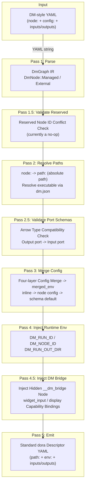
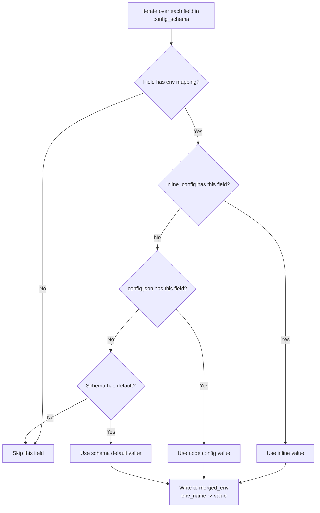
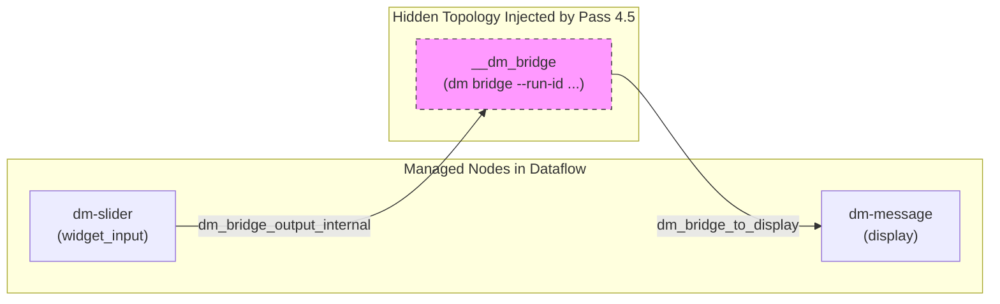
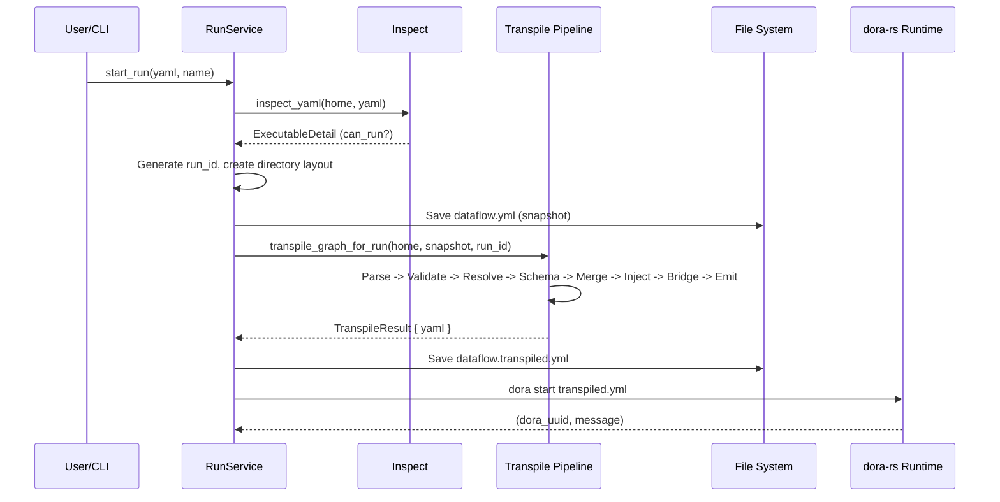

Dataflow is the core execution unit of Dora Manager, but it is not directly consumed by the dora-rs runtime. The DM-style YAML written by users contains declarative `node:` references, inline `config:` blocks, and port topologies. These semantics must be **transpiled** into the standard `Descriptor` format that dora-rs understands -- replacing symbolic references with absolute `path:`, injecting merged configuration values via `env:`, and injecting interaction capabilities via implicit Bridge nodes. The Transpiler is the multi-pass pipeline that performs this transformation. It resides in the `dm-core` crate and is the key compilation layer that bridges "user intent" with "runtime execution."

Sources: [mod.rs](https://github.com/l1veIn/dora-manager/blob/main/crates/dm-core/src/dataflow/transpile/mod.rs#L1-L11)

## Pipeline Overview: From DM YAML to dora Descriptor

The transpiler entry function `transpile_graph_for_run` receives the DM_HOME path and YAML file path, executing seven passes in a fixed order. The entire process does not use short-circuit error handling; instead, it employs a diagnostic collection mechanism (diagnostics) that lets users see all issues at once. The following diagram illustrates the complete data flow of the pipeline:



The core design principle of the pipeline is **progressive enrichment**: each pass is responsible for a single concern, populating specific fields in the IR. `DmGraph` serves as the mutable state shared across all passes, with its fields progressively populated by each pass -- `resolved_path` is filled by `resolve_paths`, and `merged_env` is enriched by three passes: `merge_config`, `inject_runtime_env`, and `inject_dm_bridge`.

Sources: [mod.rs](https://github.com/l1veIn/dora-manager/blob/main/crates/dm-core/src/dataflow/transpile/mod.rs#L47-L80)

## Typed Intermediate Representation: DmGraph IR

The transpiler does not operate directly on the raw `serde_yaml::Value` tree. Instead, it parses each node into one of two strongly-typed variants, converting back to YAML only at the final emit stage. This design decouples **semantic parsing** from **serialization**, enabling each pass to operate on type-safe structures.

```rust
// DmGraph -- the core IR shared by all passes
pub(crate) struct DmGraph {
    pub nodes: Vec<DmNode>,
    pub extra_fields: serde_yaml::Mapping, // pass through unknown top-level fields
}

pub(crate) enum DmNode {
    Managed(ManagedNode),      // managed nodes with a node: field
    External { _yaml_id, raw }, // external nodes (specified via path:), passed through as-is
}

pub(crate) struct ManagedNode {
    pub yaml_id: String,            // id field in YAML
    pub node_id: String,            // value of node: field (node identifier)
    pub inline_config: Value,       // inline config from config: block in YAML
    pub resolved_path: Option<String>, // absolute executable path filled by Pass 2
    pub merged_env: Mapping,        // environment variables filled by Pass 3/4/4.5
    pub extra_fields: Mapping,      // pass through other fields like inputs/outputs
}
```

The distinction between **Managed** and **External** is the core classification logic of the entire transpiler. During the Parse stage, only nodes that have a `node:` field are classified as `Managed` and enter the subsequent path resolution, config merge, and other processing flows. Nodes that have only `path:` or neither `node:` nor `path:` are classified as `External`, remaining as raw mappings throughout the pipeline and being output as-is only at emit time. Top-level non-`nodes` fields (such as `communication`, `deploy`, `debug`, etc.) are stored in `extra_fields` and left untouched by the pipeline, ensuring that unknown dora fields are never dropped.

Sources: [model.rs](https://github.com/l1veIn/dora-manager/blob/main/crates/dm-core/src/dataflow/transpile/model.rs#L1-L39), [passes.rs](https://github.com/l1veIn/dora-manager/blob/main/crates/dm-core/src/dataflow/transpile/passes.rs#L14-L100)

## Pass 1: Parse -- YAML Text to Typed IR

The Parse stage converts the raw YAML string into the `DmGraph` IR. For each node entry, it first extracts the `id`, `node`, and `path` fields, then determines the node classification based on the presence of the `node:` field. Managed nodes additionally extract the `config:` block (as `inline_config`) and any existing `env:` mapping (as the initial value of `merged_env`), while all other fields (`inputs`, `outputs`, `args`, etc.) are stored in `extra_fields` for subsequent passes to pass through. The node classification logic is clear and strict: `node_field.is_some()` means Managed; everything else is External.

Sources: [passes.rs](https://github.com/l1veIn/dora-manager/blob/main/crates/dm-core/src/dataflow/transpile/passes.rs#L14-L100)

## Pass 1.5: Validate Reserved -- Reserved Node ID Check

This pass is currently a no-op. The code comments explicitly state that `dm-core` no longer hardcodes knowledge of specific node IDs, and reserved ID conflict checking is delegated to higher-level business logic or the runtime. Its existence is a product of architectural evolution -- earlier versions checked reserved node IDs (such as `__dm_bridge`) here, but as the Bridge injection logic matured, this check became redundant, though the interface was preserved to maintain the stability of the pipeline structure.

Sources: [passes.rs](https://github.com/l1veIn/dora-manager/blob/main/crates/dm-core/src/dataflow/transpile/passes.rs#L102-L113)

## Pass 2: Resolve Paths -- Resolving node: to Absolute path:

This is the first pass with **side effects** in the transpiler. For each Managed node, it uses `node::resolve_node_dir` to look up the node directory across all configured node directories, then reads `dm.json` to obtain the `executable` field, concatenating it with the node directory to form an absolute path. Node directory lookup follows a carefully designed priority chain:

| Lookup Order | Path | Description |
|--------------|------|-------------|
| 1 | `~/.dm/nodes/<node_id>/` | User-installed nodes |
| 2 | `<repo_root>/nodes/<node_id>/` | Built-in nodes (during development) |
| 3 | `DM_NODE_DIRS` environment variable | Custom additional node paths |

On resolution failure, the pipeline is not interrupted; instead, diagnostic information is recorded (`NodeNotInstalled`, `MetadataUnreadable`, `MissingExecutable`). An important implementation detail: this pass stores the file path of `dm.json` as a temporary `__dm_meta_path` key in `extra_fields`, for reuse by the subsequent `merge_config` pass, avoiding duplicate lookups and file I/O. This temporary key is cleared after `merge_config` completes.

Sources: [passes.rs](https://github.com/l1veIn/dora-manager/blob/main/crates/dm-core/src/dataflow/transpile/passes.rs#L272-L346), [paths.rs](https://github.com/l1veIn/dora-manager/blob/main/crates/dm-core/src/node/paths.rs#L11-L42)

## Pass 2.5: Validate Port Schemas -- Arrow Type Compatibility Check

This pass performs **compile-time type checking** on port connections between Managed nodes. It traverses the `inputs:` mapping of each Managed node, parses connection declarations in the `source_node/source_output` format, then looks up the source node's output port and the target node's input port from the `ports` array in `dm.json`, parses their Schemas respectively, and finally calls `check_compatibility` to verify type compatibility.

Validation follows the **bidirectional declaration** principle: type checking is triggered only when both the source port and the target port have declared a Schema. If either side has no declared Schema, it is silently skipped; if a node declares `dynamic_ports: true`, ports not found in the `ports` array are also skipped. Schemas support referencing external JSON Schema files via `$ref`, resolved using the node directory as the base path. The compatibility check implements subtype semantics -- allowing safe widening (e.g., `int32 -> int64`, `utf8 -> large_utf8`, `list -> large_list`) and rejecting narrowing or mismatches.

Sources: [passes.rs](https://github.com/l1veIn/dora-manager/blob/main/crates/dm-core/src/dataflow/transpile/passes.rs#L118-L270), [compat.rs](https://github.com/l1veIn/dora-manager/blob/main/crates/dm-core/src/node/schema/compat.rs#L91-L195)

## Pass 3: Merge Config -- Four-layer Config Merge

This is the most complex pass in the transpiler, implementing a **three-layer config priority** strategy (with a fourth "flow layer" reserved by design). It merges configuration values scattered across different locations into a unified environment variable mapping. Understanding this mechanism is crucial for correctly using DM's configuration system.

### Three-layer Priority Model

Configuration values are merged from highest to lowest priority (higher priority overrides lower):

| Priority | Layer | Source | Storage Location | Typical Scenario |
|----------|-------|--------|------------------|------------------|
| 1 (highest) | **Inline Config** | `config:` block in the dataflow YAML | Dataflow YAML file | Overriding parameters for a specific run |
| 2 | **Node Config** | `config.json` in the node directory | `~/.dm/nodes/<id>/config.json` | User-set global defaults for the node |
| 3 (lowest) | **Schema Defaults** | `config_schema.*.default` in `dm.json` | `~/.dm/nodes/<id>/dm.json` | Out-of-the-box defaults provided by the node developer |

> **Note on "four-layer"**: The transpiler module comments mention "four-layer config merge," which includes the design-reserved "flow layer" (a dataflow-level config file). In the current implementation, the actual config resolution chain is three layers: `inline_config -> config_defaults (config.json) -> schema default`. The reserved flow layer sits between inline and node config, corresponding to a `config.json` in the same directory as `dataflow.yml`, but it is not yet consumed by the transpilation pipeline.

### Merge Algorithm in Detail

The merge process iterates over each field in `config_schema` in `dm.json`, performing the following steps:



For each field, it first checks whether `config_schema[field].env` exists -- this is the mapping from the field to an environment variable name. Only fields that declare `env` are included in the merge. Value selection follows the priority chain `inline_config.get(key) -> config_defaults.get(key) -> field_schema.get("default")` in an `or_else`-style short-circuit merge -- the first non-`null` value wins. The final value is written to `merged_env`, with the key being the environment variable name (e.g., `LABEL`) and the value being the stringified config value.

Sources: [passes.rs](https://github.com/l1veIn/dora-manager/blob/main/crates/dm-core/src/dataflow/transpile/passes.rs#L348-L421), [local.rs](https://github.com/l1veIn/dora-manager/blob/main/crates/dm-core/src/node/local.rs#L173-L186)

### config_schema Declaration Format

The `config_schema` in `dm.json` uses a flat object structure, where each key represents a configurable item and the value is a descriptor object:

```json
{
  "config_schema": {
    "label": {
      "env": "LABEL",
      "default": "Value",
      "description": "Slider label shown in the UI."
    },
    "min_val": {
      "env": "MIN_VAL",
      "default": 0,
      "description": "Minimum value."
    },
    "step": {
      "env": "STEP",
      "default": 1,
      "description": "Step interval."
    }
  }
}
```

| Field | Type | Description |
|-------|------|-------------|
| `env` | `string` | **Required**. The environment variable name to map to. Config items without this field do not participate in the merge. |
| `default` | `any` | Schema-level default value, lowest priority. |
| `description` | `string` | Optional. Description of the config item. |
| `x-widget` | `object` | Optional. Frontend UI control declaration (`select`, `slider`, `switch`, etc.). |

Taking the [dm-slider](https://github.com/l1veIn/dora-manager/blob/main/nodes/dm-slider/dm.json#L85-L116) node as an example, its `config_schema` declares 6 config items (label, min_val, max_val, step, default_value, poll_interval), each mapped to a corresponding environment variable. The `config.json` in the node directory stores user-level persistent configuration, structured as a flat key-value object where key names correspond to field names in `config_schema`.

Sources: [dm-slider/dm.json](https://github.com/l1veIn/dora-manager/blob/main/nodes/dm-slider/dm.json#L85-L116), [dm-test-audio-capture/config.json](https://github.com/l1veIn/dora-manager/blob/main/nodes/dm-test-audio-capture/config.json#L1-L9)

### Complete Merge Example

The following demonstrates a concrete end-to-end config merge process. Suppose the dataflow YAML declares a `dm-test-audio-capture` node and overrides `mode` and `duration_sec`:

**Dataflow YAML (inline config)**:
```yaml
- id: microphone
  node: dm-test-audio-capture
  config:
    mode: repeat
    duration_sec: 2
```

**Node config.json (node-level config)**:
```json
{
  "channels": 1,
  "duration_sec": 3,
  "mode": "once",
  "sample_rate": 16000
}
```

**dm.json config_schema (default-level)**:
```json
{
  "mode": { "env": "MODE", "default": "once" },
  "duration_sec": { "env": "DURATION_SEC", "default": 3 },
  "sample_rate": { "env": "SAMPLE_RATE", "default": 16000 },
  "channels": { "env": "CHANNELS", "default": 1 }
}
```

**Merge result (merged_env)**:

| Config Item | env Variable | inline | node config | schema default | Final Value | Source |
|-------------|--------------|--------|-------------|----------------|-------------|--------|
| mode | MODE | `repeat` | `once` | `once` | `repeat` | inline |
| duration_sec | DURATION_SEC | `2` | `3` | `3` | `2` | inline |
| sample_rate | SAMPLE_RATE | -- | `16000` | `16000` | `16000` | node config |
| channels | CHANNELS | -- | `1` | `1` | `1` | node config |

Sources: [passes.rs](https://github.com/l1veIn/dora-manager/blob/main/crates/dm-core/src/dataflow/transpile/passes.rs#L394-L419)

## Pass 4: Inject Runtime Env -- Runtime Environment Injection

After config merging is complete, the transpiler injects three **runtime context environment variables** for each Managed node. These variables are transparently available to node code, eliminating the need for nodes to hardcode run directories or derive their own identity.

| Environment Variable | Value Source | Purpose |
|----------------------|--------------|---------|
| `DM_RUN_ID` | `uuid::Uuid::new_v4()` | Unique identifier for the current run instance |
| `DM_NODE_ID` | The node's `yaml_id` (the `id` field in YAML) | Node identity within the dataflow |
| `DM_RUN_OUT_DIR` | `~/.dm/runs/<run_id>/out/` | Output directory for the run instance (artifact storage) |

These environment variables are directly appended to the `merged_env` mapping. Since `merged_env` is serialized as the node's `env:` field during the emit stage, dora-rs sets them as actual environment variables when launching the node process, and node code can read them directly via `os.environ` (Python) or `std::env` (Rust). This pass does not accept a diagnostic list parameter (`&mut Vec<TranspileDiagnostic>`) because it is a deterministic operation with no possibility of validation failure.

Sources: [passes.rs](https://github.com/l1veIn/dora-manager/blob/main/crates/dm-core/src/dataflow/transpile/passes.rs#L423-L450)

## Pass 4.5: Inject DM Bridge -- Hidden Bridge Node Injection

This is the most architecturally significant pass in the transpilation pipeline. It scans the `dm.json` of all Managed nodes, extracts nodes that declare `widget_input` or `display` capabilities, and **lowers** their capability bindings into a hidden `__dm_bridge` node. This hidden node is invisible to users in the transpiled YAML output (its ID starts with a double underscore), but it is the core of the interaction system -- serving as the message routing hub for all UI controls and display panels.

### How Bridge Injection Works

The injection process is divided into four stages:

1. **Scan**: Iterate over all Managed nodes, load their `dm.json`, and call `build_bridge_node_spec` to extract capability bindings of type `widget_input` and `display`.
2. **Connection Rewriting**: For each node with `display` capability, create an input mapping to the Bridge (`dm_bridge_input_internal -> __dm_bridge/dm_bridge_to_<yaml_id>`). For each node with `widget_input` capability, create an output port (`dm_bridge_output_internal`) and have the Bridge subscribe to it.
3. **Environment Injection**: Inject `DM_BRIDGE_INPUT_PORT` and `DM_BRIDGE_OUTPUT_PORT` environment variables into the nodes, informing them of their communication port names with the Bridge.
4. **Bridge Node Creation**: Serialize all collected binding specs into JSON and inject them into the Bridge node as the `DM_CAPABILITIES_JSON` environment variable.



### Final Form of the Bridge Node

After injection is complete, the `__dm_bridge` node is appended to the end of `DmGraph.nodes`, with the following structure:

| Field | Value | Description |
|-------|-------|-------------|
| `yaml_id` | `__dm_bridge` | Hidden identifier, not visible from the user's perspective |
| `node_id` | `dm` | Points to the dm CLI itself |
| `resolved_path` | Absolute path to the dm CLI executable | Resolved by `resolve_dm_cli_exe` |
| `args` | `bridge --run-id <run_id>` | Bridge subcommand |
| `env.DM_CAPABILITIES_JSON` | Serialized `Vec<HiddenBridgeNodeSpec>` | Interaction capability declarations from all nodes |
| `inputs` | Port mappings from each display node | Bridge receives display content |
| `outputs` | Port list sent to each widget_input node | Bridge distributes UI control input |

Sources: [passes.rs](https://github.com/l1veIn/dora-manager/blob/main/crates/dm-core/src/dataflow/transpile/passes.rs#L453-L570), [bridge.rs](https://github.com/l1veIn/dora-manager/blob/main/crates/dm-core/src/dataflow/transpile/bridge.rs#L1-L161)

### Idempotency Protection

Pass 4.5 checks whether a node with `yaml_id == "__dm_bridge"` already exists in `DmGraph` before execution. If it exists, it returns immediately without performing any operations. This guarantees the transpiler's idempotency -- even if accidentally called multiple times, no duplicate Bridge nodes will be produced. Additionally, if no nodes declare `widget_input` or `display` capabilities (i.e., `all_specs` is empty), the Bridge node will not be created either.

Sources: [passes.rs](https://github.com/l1veIn/dora-manager/blob/main/crates/dm-core/src/dataflow/transpile/passes.rs#L460-L517)

## Pass 5: Emit -- IR Serialization to Standard YAML

The Emit stage is the endpoint of the pipeline, converting the enriched `DmGraph` IR back to `serde_yaml::Value`. For Managed nodes, it constructs a brand-new YAML Mapping, writing `id`, `path` (the resolved absolute path), `env` (the merged environment variable mapping), and all `extra_fields` (inputs, outputs, args, etc.) in sequence, ensuring that the emit order is consistent with field logic. External nodes use their stored raw mappings directly without any modifications.

A key design decision: **nodes with unresolved paths retain the `node:` field**. If `resolved_path` is `None` (path resolution failed), emit does not generate a `path:` field but instead outputs the original `node:` declaration. This ensures that dora-rs can produce meaningful error messages ("unknown operator") when attempting to start, rather than the transpiler generating an invalid empty path on its own. Top-level `extra_fields` (non-`nodes` fields) are merged into the root mapping at the end, ensuring the correct placement of standard dora fields such as `communication`.

Sources: [passes.rs](https://github.com/l1veIn/dora-manager/blob/main/crates/dm-core/src/dataflow/transpile/passes.rs#L594-L653)

## Diagnostic Collection Model

The transpiler uses **accumulated diagnostics** rather than short-circuit error propagation. Each validation pass appends discovered issues as `TranspileDiagnostic` to a `Vec<TranspileDiagnostic>`, and the pipeline is not interrupted by any single diagnostic. After transpilation is complete, all diagnostics are printed to stderr with the prefix `[dm-core] transpile warning`. This model lets users see **all** issues in a single transpilation, rather than wasting time in a "fix -> re-run -> discover the next issue" loop.

| Diagnostic Type | Trigger Condition | Severity |
|-----------------|-------------------|----------|
| `NodeNotInstalled` | `resolve_node_dir` returns `None` | Warning (node cannot run) |
| `MetadataUnreadable` | `dm.json` does not exist or cannot be parsed | Warning (node metadata missing) |
| `MissingExecutable` | `executable` field in `dm.json` is empty | Warning (node cannot start) |
| `InvalidPortSchema` | Port Schema cannot be parsed | Warning (type check skipped) |
| `IncompatiblePortSchema` | Output port and input port types are incompatible | Warning (runtime may error) |

Diagnostic messages include both `yaml_id` (the node's ID in YAML) and `node_id` (the node identifier) for dual-level localization, making it easy for users to quickly pinpoint issues. Notably, `inject_runtime_env` and `inject_dm_bridge` do not produce diagnostics -- the former is a deterministic operation, and the failure modes of the latter (dm.json unreadable) are already captured during the `resolve_paths` stage.

Sources: [error.rs](https://github.com/l1veIn/dora-manager/blob/main/crates/dm-core/src/dataflow/transpile/error.rs#L1-L62), [mod.rs](https://github.com/l1veIn/dora-manager/blob/main/crates/dm-core/src/dataflow/transpile/mod.rs#L71-L74)

## Shared Context: TranspileContext

All passes share a read-only `TranspileContext` structure that contains only two fields: `home` (the DM_HOME directory path) and `run_id` (the run instance UUID). This minimalist context design embodies the **principle of least knowledge** -- each pass receives only the information it truly needs, obtaining dependencies through parameter passing rather than global state. All mutable state is concentrated on `DmGraph` and its internal `ManagedNode` fields. Data flow between passes is expressed entirely through field changes to the IR, rather than implicit context modifications.

Sources: [context.rs](https://github.com/l1veIn/dora-manager/blob/main/crates/dm-core/src/dataflow/transpile/context.rs#L1-L10)

## Transpiler's Position in the Runtime Flow

When a user starts a dataflow via the API or CLI, the run service (`service_start`) first calls `inspect_yaml` to check the dataflow's executable status. Only after confirming that all nodes are installed and the YAML format is valid does it enter the transpilation flow. The transpiler's output (standard dora Descriptor YAML) is persisted to `~/.dm/runs/<run_id>/dataflow.transpiled.yml`, and is finally consumed by the `dora start` command to launch the runtime.



Before transpilation, `service_start` also attempts to auto-install missing nodes: it first checks the `source.git` field in the YAML, then queries the compile-time-embedded `registry.json`. Upon finding the git URL, it automatically executes `node import` + `node install`, and then re-runs `inspect_yaml` to update the executable status. This "self-healing" mechanism ensures that users only need to provide the dataflow YAML, and the system automatically fills in the runtime dependencies.

Sources: [service_start.rs](https://github.com/l1veIn/dora-manager/blob/main/crates/dm-core/src/runs/service_start.rs#L99-L283), [repo.rs](https://github.com/l1veIn/dora-manager/blob/main/crates/dm-core/src/runs/repo.rs#L21-L31)

## API Layer Config Aggregation: inspect_config

In addition to the config merging within the transpilation pipeline, the `dataflow::service` module provides an `inspect_config` function for use by the HTTP API. It shares the same config sources as the transpiler's `merge_config` pass (inline, node config, schema default), but instead of only outputting the merged result, it also exposes the raw values and effective source from each layer, enabling the frontend Inspector panel to display a "config traceability" view -- users can see exactly where a value comes from: an inline override, a node-level config, or a schema default.

The `AggregatedConfigField` structure stores `inline_value`, `node_value`, `default_value`, `effective_value`, and `effective_source` for each config field, implementing full **config traceability**. The value domain of `effective_source` is four variants: `inline`, `node`, `default`, and `unset`, corresponding to the three source layers plus a "no value" state.

Sources: [model.rs](https://github.com/l1veIn/dora-manager/blob/main/crates/dm-core/src/dataflow/model.rs#L141-L172), [service.rs](https://github.com/l1veIn/dora-manager/blob/main/crates/dm-core/src/dataflow/service.rs#L101-L200)

## Further Reading

The transpiler is the bridge in the backend architecture that connects dataflow definitions with the runtime. To fully understand its context, the following reading order is recommended:

1. **Node Contract** -> [Node: dm.json Contract and Executable Unit](4-jie-dian-node-dm-json-qi-yue-yu-ke-zhi-xing-dan-yuan): Understand how the `executable`, `config_schema`, `ports`, and `capabilities` fields in `dm.json` are consumed by the transpiler.
2. **Dataflow Format** -> [Dataflow: YAML Topology Definition and Node Connections](5-shu-ju-liu-dataflow-yaml-tuo-bu-ding-yi-yu-jie-dian-lian-jie): Understand the DM YAML `node:` / `config:` / `inputs:` syntax.
3. **Interaction System** -> [Interaction System Architecture: dm-input / dm-message / Bridge Node Injection Principles](22-jiao-hu-xi-tong-jia-gou-dm-input-dm-message-bridge-jie-dian-zhu-ru-yuan-li): Deep dive into how the Bridge node injected by Pass 4.5 drives UI controls and panels.
4. **Port Type System** -> [Port Schema and Port Type Validation](8-port-schema-yu-duan-kou-lei-xing-xiao-yan): Understand the Arrow type compatibility check used by Pass 2.5.
5. **Runtime Invocation** -> [Runtime Service: Start Orchestration, Status Refresh, and CPU/Memory Metrics Collection](13-yun-xing-shi-fu-wu-qi-dong-bian-pai-zhuang-tai-shua-xin-yu-cpu-nei-cun-zhi-biao-cai-ji): Understand how transpilation results are consumed by `service_start`.
6. **Configuration System** -> [Configuration System: DM_HOME Directory Structure and config.toml](16-pei-zhi-ti-xi-dm_home-mu-lu-jie-gou-yu-config-toml): Understand the `DM_HOME` directory structure and node path resolution.
