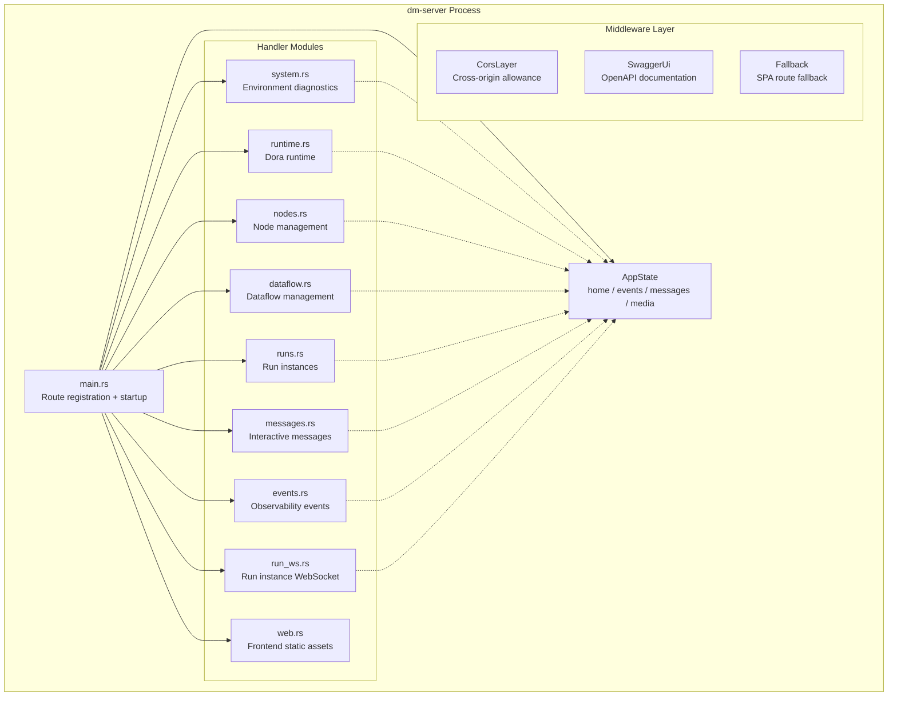

Dora Manager's HTTP API layer is hosted by the **dm-server** crate, built on the Axum framework, using utoipa to auto-generate OpenAPI 3.0 specifications and providing interactive documentation through Swagger UI. All API endpoints are mounted under the `/api` prefix, with the server defaulting to listen on `127.0.0.1:3210`. This article comprehensively covers every route endpoint, its request/response schemas, WebSocket protocol, and Swagger documentation usage from an architectural perspective, helping you quickly understand the full API landscape without diving into source code.

Sources: [main.rs](https://github.com/l1veIn/dora-manager/blob/master/crates/dm-server/src/main.rs#L1-L245), [Cargo.toml](https://github.com/l1veIn/dora-manager/blob/master/crates/dm-server/Cargo.toml#L1-L35)

## API Architecture Overview

dm-server's HTTP layer adopts a **Handler modular split** architecture — organizing handler functions into independent files by domain, then unifying exports through `handlers/mod.rs` and re-exporting to the route registry. The entire service depends on a shared `AppState` state object, injected into each handler through Axum's `State` extractor.



`AppState` holds four key fields: `home` (DM_HOME directory path), `events` (SQLite event store), `messages` (tokio broadcast channel for WebSocket message notifications), `media` (MediaMTX integration runtime). All handlers access these shared resources through `State(state): State<AppState>`, without global variables or environment variable passing.

Sources: [state.rs](https://github.com/l1veIn/dora-manager/blob/master/crates/dm-server/src/state.rs#L1-L25), [handlers/mod.rs](https://github.com/l1veIn/dora-manager/blob/master/crates/dm-server/src/handlers/mod.rs#L1-L43)

## Swagger UI and OpenAPI Specification

Swagger UI is integrated through **utoipa + utoipa-swagger-ui**, requiring no manual OpenAPI YAML maintenance. Developers add `#[utoipa::path(...)]` macro annotations to handler functions, which are automatically aggregated into the `ApiDoc` struct at compile time, generating a complete OpenAPI JSON specification.

**Access Points**:

| Entry | URL | Description |
|-------|-----|-------------|
| Swagger UI | `http://127.0.0.1:3210/swagger-ui/` | Interactive API testing interface |
| OpenAPI JSON | `http://127.0.0.1:3210/api-docs/openapi.json` | Raw OpenAPI 3.0 specification |

Swagger UI supports "Try it out" mode, allowing you to construct requests and view responses directly in the browser — ideal for debugging and frontend integration. All endpoints annotated with `#[utoipa::path]` automatically appear in the documentation, including path parameters, query parameters, and request body Schema definitions.

Sources: [main.rs](https://github.com/l1veIn/dora-manager/blob/master/crates/dm-server/src/main.rs#L24-L76), [main.rs](https://github.com/l1veIn/dora-manager/blob/master/crates/dm-server/src/main.rs#L222-L223)

## Route Group Overview

dm-server's routes are divided into **6 logical domains** by responsibility. The following table provides each domain's URL prefix and core capabilities overview.

| Route Domain | Prefix | Handler File | Core Responsibilities |
|-------------|--------|-------------|----------------------|
| Environment & System | `/api/doctor`, `/api/status`, `/api/config`, `/api/media/*` | [system.rs](https://github.com/l1veIn/dora-manager/blob/master/crates/dm-server/src/handlers/system.rs) | Health diagnostics, version management, config read/write, media backend status |
| Runtime Management | `/api/install`, `/api/uninstall`, `/api/use`, `/api/up`, `/api/down` | [runtime.rs](https://github.com/l1veIn/dora-manager/blob/master/crates/dm-server/src/handlers/runtime.rs) | Dora version install/uninstall/switch, runtime start/stop |
| Node Management | `/api/nodes/*` | [nodes.rs](https://github.com/l1veIn/dora-manager/blob/master/crates/dm-server/src/handlers/nodes.rs) | Node list, install/import/create/uninstall, config read/write, file browsing |
| Dataflow Management | `/api/dataflows/*` | [dataflow.rs](https://github.com/l1veIn/dora-manager/blob/master/crates/dm-server/src/handlers/dataflow.rs) | Dataflow CRUD, import, version history, view persistence |
| Run Instances | `/api/runs/*` | [runs.rs](https://github.com/l1veIn/dora-manager/blob/master/crates/dm-server/src/handlers/runs.rs) | Run instance start/stop, metrics collection, log viewing, batch deletion |
| Interaction & Messages | `/api/runs/{id}/messages/*`, `/api/runs/{id}/streams/*` | [messages.rs](https://github.com/l1veIn/dora-manager/blob/master/crates/dm-server/src/handlers/messages.rs) | Message push/query, snapshots, stream descriptors, WebSocket |
| Observability Events | `/api/events/*` | [events.rs](https://github.com/l1veIn/dora-manager/blob/master/crates/dm-server/src/handlers/events.rs) | Event query/count/ingestion/XES export |

Sources: [main.rs](https://github.com/l1veIn/dora-manager/blob/master/crates/dm-server/src/main.rs#L96-L225)

## Environment and System Endpoints

These endpoints are used for system self-inspection and environment awareness. The frontend typically calls `/api/status` first when loading a page to obtain global state.

### Endpoint List

| Method | Path | Description | Request Body |
|--------|------|-------------|-------------|
| GET | `/api/doctor` | System health diagnostic report | — |
| GET | `/api/versions` | List of installed dora versions | — |
| GET | `/api/status` | Runtime status + run instance overview | — |
| GET | `/api/media/status` | Media backend (MediaMTX) status | — |
| POST | `/api/media/install` | Install or resolve media backend | — |
| GET | `/api/config` | Read DM configuration (config.toml) | — |
| POST | `/api/config` | Update DM configuration | `ConfigUpdate` |

`/api/doctor` is the system-level diagnostic entry point, checking prerequisites such as whether the dora binary is installed and whether the DM_HOME directory is ready. `/api/status` returns a comprehensive status object containing whether the runtime is started and current active runs. `/api/media/status` and `/api/media/install` manage the readiness state of the media streaming backend, critical for dataflows requiring video/audio streams.

The `ConfigUpdate` schema is defined as:

```json
{
  "active_version": "string (optional) — switch to the specified dora version",
  "media": "object (optional) — media backend configuration"
}
```

Sources: [system.rs](https://github.com/l1veIn/dora-manager/blob/master/crates/dm-server/src/handlers/system.rs#L1-L108)

## Runtime Management Endpoints

These endpoints handle dora runtime lifecycle management — installing specific dora versions, switching active versions, and starting/stopping the coordinator + daemon.

| Method | Path | Description | Request Body |
|--------|------|-------------|-------------|
| POST | `/api/install` | Install dora version | `InstallRequest` |
| POST | `/api/uninstall` | Uninstall specified version | `UninstallRequest` |
| POST | `/api/use` | Switch active version | `UseRequest` |
| POST | `/api/up` | Start dora runtime (coordinator + daemon) | — |
| POST | `/api/down` | Stop dora runtime | — |

Key behavior: `/api/install` accepts an optional `version` field; when empty, it installs the latest version. `/api/up` starts the dora coordinator and daemon processes. Additionally, dm-server starts a **background idle monitoring task** that checks every 30 seconds — if there are no active runs, it automatically executes `down` to release system resources.

Sources: [runtime.rs](https://github.com/l1veIn/dora-manager/blob/master/crates/dm-server/src/handlers/runtime.rs#L1-L85), [main.rs](https://github.com/l1veIn/dora-manager/blob/master/crates/dm-server/src/main.rs#L234-L241)

## Node Management Endpoints

The node management domain provides complete node lifecycle operations, including installation from the registry, import from local paths or Git URLs, custom creation, and node configuration and file browsing.

| Method | Path | Description | Request Body |
|--------|------|-------------|-------------|
| GET | `/api/nodes` | List all installed nodes | — |
| GET | `/api/nodes/{id}` | Get node details | — |
| POST | `/api/nodes/install` | Install node from registry | `InstallNodeRequest` |
| POST | `/api/nodes/import` | Import node from path or URL | `ImportNodeRequest` |
| POST | `/api/nodes/create` | Create empty node scaffold | `CreateNodeRequest` |
| POST | `/api/nodes/uninstall` | Uninstall node | `UninstallNodeRequest` |
| GET | `/api/nodes/{id}/readme` | Get node README | — |
| GET | `/api/nodes/{id}/files` | Get node file tree | — |
| GET | `/api/nodes/{id}/files/{*path}` | Get node file content | — |
| GET | `/api/nodes/{id}/config` | Read node configuration (dm.json) | — |
| POST | `/api/nodes/{id}/config` | Save node configuration | JSON Value |

`/api/nodes/import` is a smart endpoint that automatically determines the import method based on the `source` field prefix — URLs starting with `https://` or `http://` use Git clone logic, otherwise treated as local paths. The `id` field is optional; when not provided, it is inferred from the source path. `/api/nodes/{id}/files` returns a Git-like file tree structure, and `/api/nodes/{id}/files/{*path}` supports wildcard path reading of arbitrary file content, providing the frontend node editor with complete file browsing capabilities.

Sources: [nodes.rs](https://github.com/l1veIn/dora-manager/blob/master/crates/dm-server/src/handlers/nodes.rs#L1-L212)

## Dataflow Management Endpoints

The dataflow management domain covers the complete lifecycle from YAML creation/editing/import/deletion to version history and view persistence. These endpoints are the core support for the frontend graph editor.

| Method | Path | Description | Request Body |
|--------|------|-------------|-------------|
| GET | `/api/dataflows` | List all dataflows | — |
| GET | `/api/dataflows/{name}` | Get dataflow YAML content | — |
| POST | `/api/dataflows/{name}` | Save dataflow YAML | `SaveDataflowRequest` |
| POST | `/api/dataflows/import` | Batch import dataflows | `ImportDataflowsRequest` |
| POST | `/api/dataflows/{name}/delete` | Delete dataflow | — |
| GET | `/api/dataflows/{name}/inspect` | Inspect dataflow (post-transpilation details) | — |
| GET | `/api/dataflows/{name}/meta` | Get dataflow metadata | — |
| POST | `/api/dataflows/{name}/meta` | Save dataflow metadata | `FlowMeta` |
| GET | `/api/dataflows/{name}/config-schema` | Get dataflow config schema | — |
| GET | `/api/dataflows/{name}/history` | Get version history list | — |
| GET | `/api/dataflows/{name}/history/{version}` | Get specific version YAML | — |
| POST | `/api/dataflows/{name}/history/{version}/restore` | Restore to specified version | — |
| GET | `/api/dataflows/{name}/view` | Get visualization view data | — |
| POST | `/api/dataflows/{name}/view` | Save visualization view data | JSON Value |

**Version History Mechanism**: Each time a dataflow is saved via `POST /api/dataflows/{name}`, the system automatically records a history version. Frontend can browse and roll back history versions through the `/history` series of endpoints, enabling time-travel-style dataflow management.

**View Persistence**: The `/view` endpoint stores frontend SvelteFlow canvas node positions, connection styles, and other visual information, decoupled from the dataflow YAML — YAML describes logical topology, View describes layout aesthetics.

Sources: [dataflow.rs](https://github.com/l1veIn/dora-manager/blob/master/crates/dm-server/src/handlers/dataflow.rs#L1-L275)

## Run Instance Endpoints

A Run (run instance) is an execution record of a dataflow. These endpoints cover starting, stopping, querying, metrics collection, log reading, and batch deletion.

| Method | Path | Description | Request Body / Query Parameters |
|--------|------|-------------|-------------------------------|
| GET | `/api/runs` | Paginated run instance query | `?limit=&offset=&status=&search=` |
| GET | `/api/runs/active` | Get current active runs | `?metrics=true` |
| POST | `/api/runs/start` | Start new run | `StartRunRequest` |
| GET | `/api/runs/{id}` | Get run details | `?include_metrics=true` |
| GET | `/api/runs/{id}/metrics` | Get run metrics | — |
| POST | `/api/runs/{id}/stop` | Stop specified run | — |
| POST | `/api/runs/delete` | Batch delete runs | `DeleteRunsRequest` |
| GET | `/api/runs/{id}/dataflow` | Get run's associated original YAML | — |
| GET | `/api/runs/{id}/transpiled` | Get run's transpiled YAML | — |
| GET | `/api/runs/{id}/view` | Get run's associated view data | — |
| GET | `/api/runs/{id}/logs/{node_id}` | Read full node log | — |
| GET | `/api/runs/{id}/logs/{node_id}/tail` | Incremental node log read | `?offset=` |

**Startup Flow Guards**: `POST /api/runs/start` performs two checks before actual execution: (1) If the dataflow contains media nodes (e.g., dm-mjpeg, dm-stream-publish), it checks whether the media backend is ready, returning a 400 error with installation guidance if not; (2) Automatically ensures the dora runtime is started (calling `up` if not already running). The `force` parameter controls conflict strategy — when `true`, it stops the current active run before starting a new one.

**Async Stop Design**: `POST /api/runs/{id}/stop` adopts a fire-and-forget pattern — first verifying run existence, then executing the actual stop in a tokio background task. The HTTP response immediately returns `{ "status": "stopping" }`, preventing the frontend from blocking while waiting for the stop to complete.

Sources: [runs.rs](https://github.com/l1veIn/dora-manager/blob/master/crates/dm-server/src/handlers/runs.rs#L1-L333)

## Interaction and Message Endpoints

These endpoints support dm-server's core architecture as **the single source of truth for interaction state**. The frontend, dm-input, and dm-display all exchange messages through these interfaces.

| Method | Path | Description | Key Parameters |
|--------|------|-------------|---------------|
| GET | `/api/runs/{id}/interaction` | Interaction snapshot (streams + inputs) | — |
| POST | `/api/runs/{id}/messages` | Push message | `PushMessageRequest` |
| GET | `/api/runs/{id}/messages` | Query message list | `?after_seq=&from=&tag=&limit=&desc=` |
| GET | `/api/runs/{id}/messages/snapshots` | Get latest snapshots | — |
| GET | `/api/runs/{id}/streams` | List stream descriptors | — |
| GET | `/api/runs/{id}/streams/{stream_id}` | Get single stream descriptor | — |
| GET | `/api/runs/{id}/artifacts/{*path}` | Access run artifact files | Wildcard path |

**Message Types and Tag System**:

| Tag Value | Purpose | Payload Characteristics |
|-----------|---------|------------------------|
| `input` | User input events | Free format, directly forwarded to dm-input |
| `stream` | Stream media declaration | Must contain `path`, `stream_id`, `kind` fields |
| Other | Custom messages | Optional `file` field, path will be normalized |

**Stream Descriptors**: `StreamDescriptor` returned by the `/streams` endpoint contains stream media metadata (resolution, frame rate, encoding format) and viewer URL. When the media backend is ready, WebRTC and HLS playback addresses are automatically injected, which the frontend can directly use in `<video>` tags.

Sources: [messages.rs](https://github.com/l1veIn/dora-manager/blob/master/crates/dm-server/src/handlers/messages.rs#L1-L558)

## Observability Event Endpoints

The event system is based on SQLite storage and provides XES-compatible process mining export capabilities.

| Method | Path | Description | Query Parameters |
|--------|------|-------------|-----------------|
| GET | `/api/events` | Query event list | `?source=&case_id=&limit=` |
| GET | `/api/events/count` | Count events | Same as above |
| POST | `/api/events` | Ingest new event | `Event` JSON |
| GET | `/api/events/export` | Export XES format | `?source=&format=xes` |

`/api/events/export` returns an XES file in `application/xml` format, which can be directly imported into process mining tools (such as ProM, Celonis) for analysis.

Sources: [events.rs](https://github.com/l1veIn/dora-manager/blob/master/crates/dm-server/src/handlers/events.rs#L1-L52)

## WebSocket Endpoints

dm-server provides three WebSocket endpoints, each serving different real-time communication scenarios.

### Run WebSocket — `/api/runs/{id}/ws`

This is the **comprehensive real-time push channel** for run instances, monitoring log file changes via the `notify` crate and pushing metrics data every second. Pushed message types include:

| Message Type | Fields | Description |
|-------------|--------|-------------|
| `ping` | — | Heartbeat, every 10 seconds |
| `metrics` | `data: NodeMetrics[]` | CPU/memory metrics for each node |
| `logs` | `nodeId`, `lines: string[]` | New log lines for nodes |
| `io` | `nodeId`, `lines: string[]` | IO log lines with `[DM-IO]` marker |
| `status` | `status: string` | Run status change notification |

This WebSocket internally uses a **file system watcher** (notify crate) to monitor log directory changes, supporting automatic log source switching between active and historical runs. Active runs read the dora daemon's real-time output directory, while historical runs read the archived log directory.

### Messages WebSocket — `/api/runs/{id}/messages/ws`

The **notification channel** for interactive messages. When new messages are written via `POST /api/runs/{id}/messages`, the broadcast channel notifies all subscribers. The frontend should then pull the latest data via HTTP — this is a **notify-only** design.

Pushed message format:
```json
{ "run_id": "...", "seq": 42, "from": "web", "tag": "input" }
```

### Node WebSocket — `/api/runs/{id}/messages/ws/{node_id}?since=`

A **downstream channel dedicated to dm-input**. After connection is established, it first replays historical messages after `since`, then continuously receives new input events. The frontend generally does not use this endpoint directly.

Sources: [run_ws.rs](https://github.com/l1veIn/dora-manager/blob/master/crates/dm-server/src/handlers/run_ws.rs#L1-L237), [messages.rs](https://github.com/l1veIn/dora-manager/blob/master/crates/dm-server/src/handlers/messages.rs#L223-L360)

## Request/Response Schemas and Frontend Communication

The frontend communicates with the backend through a unified API communication layer [`web/src/lib/api.ts`](https://github.com/l1veIn/dora-manager/blob/master/web/src/lib/api.ts), which encapsulates four basic methods: `get`, `getText`, `post`, and `del`, unified with the `/api` prefix, and throws exceptions on non-200 status codes.

**Error Response Conventions**:

| HTTP Status Code | Meaning | Typical Scenarios |
|-----------------|---------|-------------------|
| 200 | Success | Normal JSON return |
| 400 | Bad Request | Missing parameters, config format error, media backend not ready |
| 404 | Not Found | Node/dataflow/run not found |
| 409 | Conflict | Active run already running |
| 500 | Internal Server Error | Unexpected runtime error |

Most handlers follow a unified error handling pattern — converting `anyhow::Error` to `(500, error_message)` responses through the `handlers::err()` helper function, while business-level errors (e.g., "node not found") return the appropriate 4xx status code.

Sources: [api.ts](https://github.com/l1veIn/dora-manager/blob/master/web/src/lib/api.ts#L1-L33), [handlers/mod.rs](https://github.com/l1veIn/dora-manager/blob/master/crates/dm-server/src/handlers/mod.rs#L40-L42)

## Static Assets and SPA Fallback

All requests not matching the `/api` prefix are handled by `web.rs`'s `serve_web` handler, which uses `rust_embed` to embed compiled frontend assets (`web/build/` directory) into the binary. For unknown paths, it returns `index.html` (SPA route fallback), implementing HTML5 History mode support for frontend routing. This means **dm-server's single binary simultaneously serves the API and frontend** — no additional static file server is needed for deployment.

Sources: [web.rs](https://github.com/l1veIn/dora-manager/blob/master/crates/dm-server/src/handlers/web.rs#L1-L28), [main.rs](https://github.com/l1veIn/dora-manager/blob/master/crates/dm-server/src/main.rs#L224-L225)

## Further Reading

- To understand the core business logic behind the handlers, see [Runtime Service: Startup Orchestration, Status Refresh, and Metrics Collection](10-runtime-service)
- To understand how the frontend calls these APIs, see [SvelteKit Project Structure and API Communication Layer](14-sveltekit-structure)
- To understand the complete lifecycle of interactive messages, see [Interaction System: dm-input / dm-display / WebSocket Message Flow](21-interaction-system)
- To understand the underlying implementation of event storage, see [Event System: Observability Model and XES-Compatible Storage](11-event-system)
