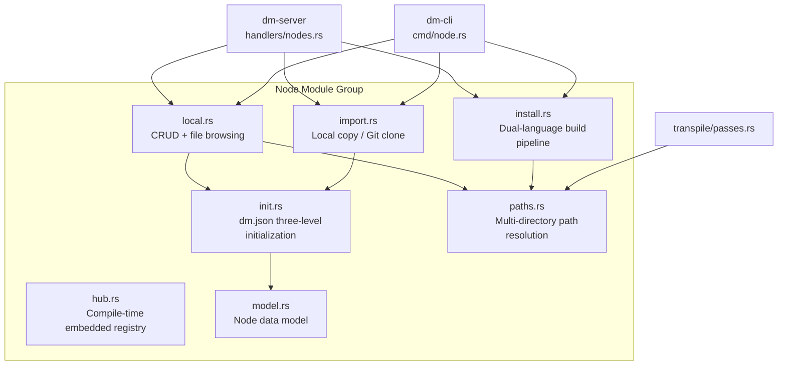
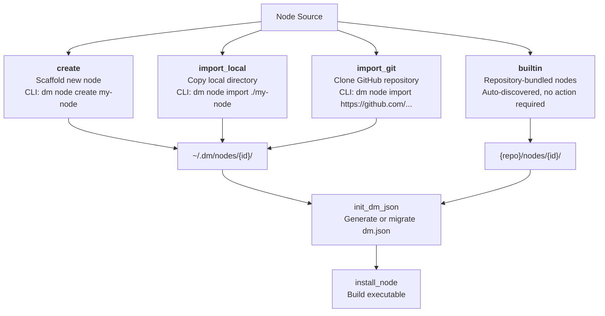
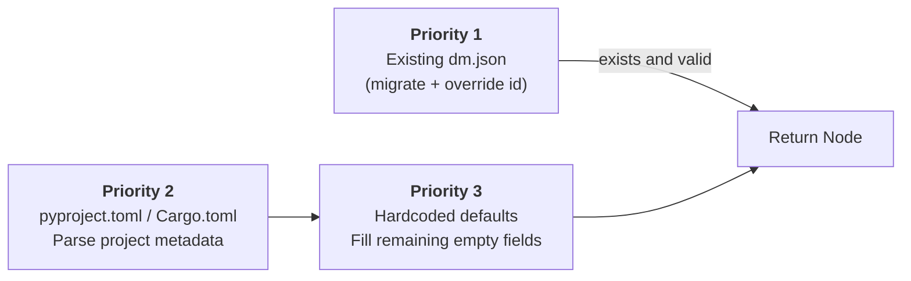
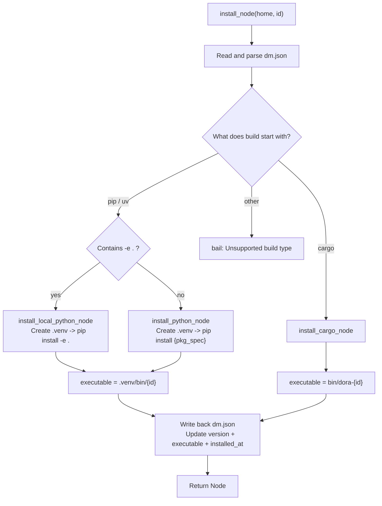
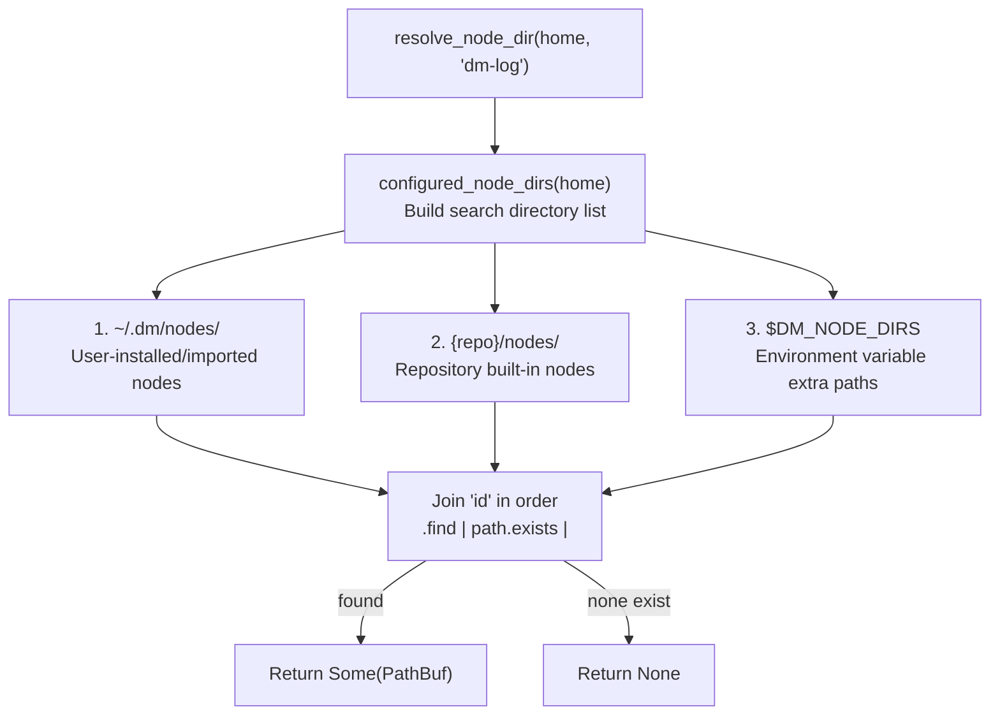

Dora Manager's node management subsystem is located in the `dm-core/src/node/` module and is responsible for the complete lifecycle of a node from "discovered" to "executable." This article provides an in-depth analysis of the system's four core capabilities: **multi-source import**, **dual-language installation pipeline**, **multi-directory path resolution**, and **file access sandbox isolation** -- these mechanisms together form the complete bridge from the user's declaration `node: dm-log` to the dora runtime executing the absolute path `/home/user/.dm/nodes/dm-log/.venv/bin/dm-log`.

Sources: [mod.rs](https://github.com/l1veIn/dora-manager/blob/main/crates/dm-core/src/node/mod.rs#L1-L35)

## Architecture Overview: Module Responsibilities and Data Flow

Node management is accomplished through the collaboration of seven modules, each with a single responsibility and clear boundaries:



| Module | Core Responsibility | Key Exposed Functions |
|--------|---------------------|-----------------------|
| `model.rs` | `Node` struct and dm.json serialization contract | `Node`, `NodeSource`, `NodePort` |
| `paths.rs` | Multi-directory search chain and path resolution | `resolve_node_dir`, `resolve_dm_json_path`, `is_managed_node` |
| `init.rs` | Infer and generate dm.json from pyproject.toml/Cargo.toml | `init_dm_json` |
| `import.rs` | Copy nodes from external sources (local/GitHub) to the managed directory | `import_local`, `import_git` |
| `install.rs` | Execute installation based on build type (venv/cargo) | `install_node` |
| `local.rs` | Node listing, status queries, file browsing, config read/write | `list_nodes`, `node_status`, `read_node_file` |
| `hub.rs` | Compile-time embedded `registry.json` node registry | `resolve_node_source`, `list_registry_nodes` |

Sources: [mod.rs](https://github.com/l1veIn/dora-manager/blob/main/crates/dm-core/src/node/mod.rs#L17-L29), [hub.rs](https://github.com/l1veIn/dora-manager/blob/main/crates/dm-core/src/node/hub.rs#L1-L98)

## Node Data Model: The dm.json Contract

`dm.json` is the node's **single source of truth**, persisted at the root of the node directory. The `Node` struct is defined in `model.rs` using standard `Serialize` / `Deserialize` derives.

The core fields of a Node are divided into seven semantic groups:

| Field Group | Key Fields | Purpose |
|-------------|------------|---------|
| **Identity** | `id`, `name`, `version` | Globally unique ID, human-readable name, semantic version |
| **Source** | `source.build`, `source.github` | Build command (e.g., `pip install -e .`) and optional GitHub URL |
| **Runtime** | `executable`, `runtime.language`, `runtime.python` | Relative path to the installed executable and language/version markers |
| **Contract** | `ports[]`, `config_schema`, `dynamic_ports` | Port declarations (with Schema), config schema, whether dynamic ports are allowed |
| **Capabilities** | `capabilities[]` | Runtime capability declarations (Tag or structured Detail) |
| **Display** | `display.category`, `display.tags[]`, `maintainers[]` | Frontend category display, tag filtering, maintainer information |
| **File Index** | `files.readme`, `files.entry`, `files.tests[]` | Relative paths to key files, used for in-browser file viewing |

A typical dm.json structure for an installed Python node `dm-message` is shown below -- note that `executable` points to the node's private `.venv` entry point, and `capabilities` contains both simple tags (`"configurable"`) and detail objects carrying structured binding information:

```json
{
  "id": "dm-message",
  "version": "0.1.0",
  "source": { "build": "pip install -e ." },
  "executable": ".venv/bin/dm-message",
  "runtime": { "language": "python", "python": ">=3.10" },
  "capabilities": [
    "configurable",
    { "name": "display", "bindings": [
      { "role": "source", "port": "data", "channel": "inline", "media": ["text", "json"] }
    ]}
  ],
  "ports": [
    { "id": "data", "direction": "input", "schema": { "type": { "name": "utf8" } } }
  ]
}
```

Sources: [model.rs](https://github.com/l1veIn/dora-manager/blob/main/crates/dm-core/src/node/model.rs#L183-L288), [dm-message/dm.json](https://github.com/l1veIn/dora-manager/blob/main/nodes/dm-message/dm.json#L1-L114)

## Four Sources and Corresponding Operations

Nodes enter Dora Manager's jurisdiction through four paths, each corresponding to an independent CLI subcommand and HTTP API endpoint:



### create: Scaffold Creation

`create_node` generates a complete Python node skeleton under `~/.dm/nodes/{id}/`. The generated artifacts include three files: `pyproject.toml` (declaring `dora-rs >= 0.3.9` and `pyarrow` dependencies, registering the `[project.scripts]` entry point), `{module}/main.py` (containing a dora Node event loop template), and `README.md` (with a YAML usage example). It then calls `init_dm_json` to generate dm.json, with the build command inferred as `pip install -e .` (editable install).

Sources: [local.rs](https://github.com/l1veIn/dora-manager/blob/main/crates/dm-core/src/node/local.rs#L13-L86)

### import_local: Local Directory Import

`import_local` copies the entire contents of the source directory in `content_only` mode (copying only the directory's contents, not the directory itself) to `~/.dm/nodes/{id}/`, and then executes `init_dm_json`. This operation has two safety prerequisite checks: the target directory must not already exist (to prevent overwriting), and the source path must be a valid directory. The CLI layer resolves relative paths to absolute paths before passing them to the core function.

Sources: [import.rs](https://github.com/l1veIn/dora-manager/blob/main/crates/dm-core/src/node/import.rs#L21-L55), [cmd/node.rs](https://github.com/l1veIn/dora-manager/blob/main/crates/dm-cli/src/cmd/node.rs#L89-L162)

### import_git: GitHub Repository Clone

`import_git` supports cloning node code from any GitHub URL, with a sophisticated **sparse-checkout** capability. When the URL contains a subdirectory path (e.g., `https://github.com/org/repo/tree/main/nodes/demo`), only the specified subdirectory is cloned instead of the entire repository, dramatically reducing download size.

The URL parsing logic `parse_github_source` breaks down a GitHub URL into three components:

| URL Format | Example | Parsed Result |
|------------|---------|---------------|
| Repository root | `https://github.com/acme/project` | `repo_url=acme/project.git`, no ref/path |
| Branch + subdirectory | `.../tree/release-1/examples/demo` | `git_ref=release-1`, `repo_path=examples/demo` |
| Non-GitHub domain | `https://example.com/...` | Direct error: `Invalid GitHub URL format` |

The clone strategy uses `--depth 1 --filter=blob:none --sparse` for minimal downloads, with `--branch {ref} --single-branch` appended for a specified branch. If the clone or subsequent operations fail, the created target directory is automatically cleaned up (rollback on error), ensuring no residual state is left behind.

Sources: [import.rs](https://github.com/l1veIn/dora-manager/blob/main/crates/dm-core/src/node/import.rs#L58-L156), [import.rs](https://github.com/l1veIn/dora-manager/blob/main/crates/dm-core/src/node/import.rs#L178-L206)

### builtin: Built-in Node Auto-discovery

The `nodes/` directory at the project repository root contains all built-in nodes (such as `dm-mjpeg`, `dm-queue`, `dora-yolo`, etc.), which require no explicit import or installation. `builtin_nodes_dir()` in `paths.rs` locates the repository's `nodes/` directory via the `CARGO_MANIFEST_DIR` relative path `../../nodes`, serving as the second-priority search directory in the path resolution chain. Additionally, `hub.rs` embeds the repository root's [registry.json](https://github.com/l1veIn/dora-manager/blob/main/registry.json) at compile time via `include_str!`, providing a static mapping of node IDs to source paths, currently containing 27 node entries.

Sources: [paths.rs](https://github.com/l1veIn/dora-manager/blob/main/crates/dm-core/src/node/paths.rs#L7-L9), [hub.rs](https://github.com/l1veIn/dora-manager/blob/main/crates/dm-core/src/node/hub.rs#L26-L58), [registry.json](https://github.com/l1veIn/dora-manager/blob/main/registry.json)

## init_dm_json: Three-Level Priority Chain for Metadata Initialization

All four source paths ultimately converge at `init_dm_json`. This function implements a **three-level priority chain** to populate node metadata:



When `dm.json` does not exist, the system parses project configuration files and populates each field according to the following rules:

| Field | pyproject.toml Extraction Path | Cargo.toml Extraction Path | Final Default Value |
|-------|-------------------------------|---------------------------|---------------------|
| `name` | `project.name` | `package.name` | Directory ID |
| `version` | `project.version` | `package.version` (stringified) | Empty string |
| `description` | `project.description` or `hints.description` | `package.description` | Empty string |
| `source.build` | See table below | -- | `pip install {id}` |
| `runtime.language` | `"python"` | `"rust"` | `"node"` if `package.json` exists, otherwise empty |
| `files.entry` | `{module}/main.py` -> `src/{module}/main.py` -> `main.py` | `src/main.rs` -> `main.rs` | `None` |
| `files.config` | Scan for `config.json/toml/yaml/yml` | Same as left | `None` |

The **build command inference** (`infer_build_command`) logic is particularly elegant -- it distinguishes three scenarios based on `build-system.build-backend`:

| build-backend | Inferred Build Command | Rationale |
|---------------|------------------------|-----------|
| `maturin` | `pip install {id}` | Rust/Python hybrid project; cannot compile locally, downloads pre-compiled wheel from PyPI |
| Other Python backends | `pip install -e .` | Pure Python project; editable install |
| Cargo.toml exists | `cargo install {id}` | Rust project |
| None exist | `pip install {id}` | Fallback: assumes a package with the same name exists on PyPI |

Sources: [init.rs](https://github.com/l1veIn/dora-manager/blob/main/crates/dm-core/src/node/init.rs#L21-L114), [init.rs](https://github.com/l1veIn/dora-manager/blob/main/crates/dm-core/src/node/init.rs#L228-L250), [init.rs](https://github.com/l1veIn/dora-manager/blob/main/crates/dm-core/src/node/init.rs#L271-L291)

## Node Installation: Dual-Language Build Pipeline

`install_node` is the critical transition from a node "having source code" to being "executable." It reads dm.json and dispatches to different installation paths based on the first keyword of the `source.build` field:



### Python Installation Sandbox: Per-node .venv

The core isolation strategy for Python nodes is that **each node has its own independent virtual environment**. The installation process consists of four steps:

1. **Clean old venv**: If `.venv` already exists, it is first deleted with `remove_dir_all` -- this avoids interactive prompts from `uv venv` blocking the installation flow when a directory already exists
2. **Create venv**: Prefers `uv venv` (a blazing-fast virtual environment tool implemented in Rust), falling back to `python3 -m venv`
3. **Install dependencies**: Local editable mode (when `build` contains `-e .`) uses `uv pip install -e .`; package mode uses `uv pip install {package_spec}` -- where `package_spec` is extracted from the end of the build command or inferred via the `dora-{id}` naming convention
4. **Extract version number**: After installation, the real installed version is obtained by executing `importlib.metadata.version('{pkg}')` via the Python interpreter in the virtual environment

After installation, `executable` is set to `.venv/bin/{id}` (Unix) or `.venv/Scripts/{id}.exe` (Windows), pointing to the entry point function declared in `[project.scripts]` in `pyproject.toml`.

Sources: [install.rs](https://github.com/l1veIn/dora-manager/blob/main/crates/dm-core/src/node/install.rs#L11-L75), [install.rs](https://github.com/l1veIn/dora-manager/blob/main/crates/dm-core/src/node/install.rs#L77-L133), [install.rs](https://github.com/l1veIn/dora-manager/blob/main/crates/dm-core/src/node/install.rs#L135-L194)

### Rust Installation Sandbox: Per-node bin/

Rust nodes use `cargo install --root {node_dir}` to output compiled artifacts to the `bin/` subdirectory under the node directory. The build strategy has two cases: if the `build` field contains `--path .`, a local compilation is performed within the node directory; otherwise, the `dora-{id}` package is installed from crates.io. The executable is uniformly named `bin/dora-{id}` -- for node IDs without the `dora-` prefix, the prefix is automatically prepended to ensure consistency with the dora ecosystem naming convention.

Before installation, `cargo --version` availability is checked, and if unavailable, a clear error message is given: `Cargo is not installed. Please install Rust first.`

Sources: [install.rs](https://github.com/l1veIn/dora-manager/blob/main/crates/dm-core/src/node/install.rs#L235-L274)

### Post-Installation Directory Layout Comparison

| Characteristic | Python Nodes | Rust Nodes |
|----------------|--------------|------------|
| Sandbox directory | `{node_dir}/.venv/` | `{node_dir}/bin/` |
| Executable path | `.venv/bin/{id}` | `bin/dora-{id}` |
| Dependency isolation | venv level, fully isolated | Compile-time linked, no runtime dependencies |
| Version retrieval | `importlib.metadata.version()` | Currently returns `"unknown"` |
| Rebuild mechanism | Delete `.venv` then reinstall | Delete `bin/` then recompile |

Sources: [install.rs](https://github.com/l1veIn/dora-manager/blob/main/crates/dm-core/src/node/install.rs#L40-L58)

## Multi-Directory Path Resolution: Three-Layer Search Chain

Path resolution is the core bridge connecting "node management" and "dataflow execution." `resolve_node_dir` implements an **ordered search chain** that searches for nodes across multiple candidate directories by priority:



The search chain is built by `configured_node_dirs` and contains three layers:

| Priority | Directory Source | Path | Characteristics |
|----------|-----------------|------|-----------------|
| 1 | `nodes_dir(home)` | `~/.dm/nodes/` | Writable, supports `uninstall` deletion |
| 2 | `builtin_nodes_dir()` | `{repo}/nodes/` | Read-only, cannot be deleted via `uninstall` |
| 3 | `DM_NODE_DIRS` environment variable | User-defined paths | Supports multiple directories (separated by system path separator) |

The `push_unique` helper function ensures the same absolute path does not appear multiple times in the search list. On top of this, the system provides a set of semantically clear foundational functions:

- **`resolve_node_dir(home, id)`**: Searches through the three-layer search chain, returning the first existing `dir/id/` path
- **`resolve_dm_json_path(home, id)`**: Appends `dm.json` to the found node directory
- **`is_managed_node(home, id)`**: Only checks the first layer (`~/.dm/nodes/{id}/`), used to distinguish "uninstallable nodes" from "non-uninstallable built-in nodes"

`list_nodes` iterates over all search directories and uses `BTreeSet` for deduplication -- when multiple directories contain nodes with the same name, only the first occurrence is accepted. This guarantees **priority shadowing** semantics: user-installed nodes can override same-named built-in nodes without conflict.

Sources: [paths.rs](https://github.com/l1veIn/dora-manager/blob/main/crates/dm-core/src/node/paths.rs#L1-L53), [local.rs](https://github.com/l1veIn/dora-manager/blob/main/crates/dm-core/src/node/local.rs#L88-L136), [local.rs](https://github.com/l1veIn/dora-manager/blob/main/crates/dm-core/src/node/local.rs#L138-L163)

## File Access Security: Path Traversal Protection

Nodes support browsing files within their directories through the HTTP API (file tree listing + file content reading), which introduces the risk of path traversal attacks. `resolve_safe_node_file` in [local.rs](https://github.com/l1veIn/dora-manager/blob/main/crates/dm-core/src/node/local.rs#L291-L317) implements two layers of defense-in-depth:

**First layer: Component whitelist validation.** It iterates over each `std::path::Component` of the requested path, only allowing `Normal` (regular file names) and `CurDir` (`.`). Upon encountering `ParentDir` (`..`), `RootDir` (`/`), or `Prefix` (Windows drive letters), it immediately rejects the request and returns an error. Additionally, empty paths and absolute paths are directly rejected.

**Second layer: Normalized prefix validation.** After `root.join(requested)`, it calls `canonicalize()` on the result (resolving symbolic links and `.`), then verifies that the normalized absolute path still has the node root directory as its prefix. This blocks attack vectors such as symlink escapes that bypass the first layer of checks.

```rust
// Core protection logic (simplified illustration)
let candidate = root.join(requested);
let resolved = candidate.canonicalize()?;
if !resolved.starts_with(root) {
    bail!("Invalid node file path");
}
```

Additionally, `collect_node_files` filters out 13 common non-content directories when building the file tree, including `.git`, `.venv`, `node_modules`, `target`, `__pycache__`, etc., ensuring that the browser only displays meaningful source files.

Sources: [local.rs](https://github.com/l1veIn/dora-manager/blob/main/crates/dm-core/src/node/local.rs#L261-L336)

## Node Resolution in the Transpilation Pipeline

In the [Dataflow Transpiler: Multi-Pass Pipeline and Four-Layer Config Merge](08-transpiler), **Pass 2: resolve_paths** is the core consumer of the node management system. It converts the user-declared `node: dm-log` in YAML into the absolute `path:` required by the dora runtime.

The resolution process consists of four steps:

1. Call `resolve_node_dir(home, &node_id)` to find the node directory
2. Call `resolve_dm_json_path(home, &node_id)` to locate the metadata file
3. Read and deserialize dm.json to obtain the `executable` field
4. Concatenate `node_cache_dir.join(&meta.executable)` to get the absolute path

The diagnostic strategy uses a **collective** (non-short-circuit) approach -- even if a particular node resolution fails, the pipeline continues processing the remaining nodes, ultimately reporting all issues at once:

| Diagnostic Type | Meaning | Trigger Condition |
|-----------------|---------|-------------------|
| `NodeNotInstalled` | Node directory does not exist | `resolve_node_dir` returns `None` |
| `MetadataUnreadable` | dm.json is missing or malformed | File does not exist or deserialization fails |
| `MissingExecutable` | Node is not yet installed | `executable` field is an empty string |

When a node cannot be resolved, the transpiler does not abort; instead, it preserves the original `node:` field during the emit phase -- allowing the dora runtime to provide more precise error messages rather than losing context at the transpilation stage.

Sources: [passes.rs](https://github.com/l1veIn/dora-manager/blob/main/crates/dm-core/src/dataflow/transpile/passes.rs#L277-L346)

## Runtime Sandbox and Environment Injection

Node sandbox isolation is reflected in three dimensions:

**Dependency isolation**: Each Python node has its own independent `.venv`, and each Rust node has its own independent `bin/`. Different nodes can depend on different versions of the same library without conflict. During installation, if an old venv exists, it is deleted and rebuilt to ensure a clean state.

**Environment variable injection**: Pass 4 of the transpilation pipeline, `inject_runtime_env`, injects three standard environment variables for each managed node:

| Environment Variable | Example Value | Purpose |
|----------------------|---------------|---------|
| `DM_RUN_ID` | `a1b2c3d4-...` | Unique identifier for the current run instance |
| `DM_NODE_ID` | `my_detector` | The node's ID in the dataflow YAML |
| `DM_RUN_OUT_DIR` | `~/.dm/runs/{id}/out/` | Directory for writing run output artifacts |

These variables allow nodes to write output artifacts via `DM_RUN_OUT_DIR` and identify themselves via `DM_NODE_ID`, without hardcoding any infrastructure addresses.

**File system boundary**: The file browsing API's `resolve_safe_node_file` uses the node directory as a natural sandbox boundary, rejecting any file access request that attempts to escape it.

Sources: [passes.rs](https://github.com/l1veIn/dora-manager/blob/main/crates/dm-core/src/dataflow/transpile/passes.rs#L427-L450), [install.rs](https://github.com/l1veIn/dora-manager/blob/main/crates/dm-core/src/node/install.rs#L30-L44)

## Future Evolution: Pre-compiled Binary Distribution

The current installation pipeline requires users to have the corresponding language toolchain installed locally (Python/uv or Rust/cargo), and the first compilation of Rust nodes may take 2-5 minutes. The design document [dm-node-install.md](https://github.com/l1veIn/dora-manager/blob/main/docs/design/dm-node-install.md#L1-L118) describes a **pre-compiled binary first** strategy inspired by `cargo-binstall`:

1. Add a new `source.binary` field in dm.json (containing the GitHub repository and asset naming pattern)
2. Detect the current platform target triple at installation time (e.g., `aarch64-apple-darwin`)
3. Prefer downloading matching pre-compiled binaries from GitHub Releases (completes in seconds)
4. Fall back to the existing local compilation path when no pre-compiled version is found

| Phase | Content | User Experience |
|-------|---------|-----------------|
| **Current** | Pure `cargo install` / `uv pip install` | Requires toolchain, functional |
| **Phase 1** | GitHub Actions multi-platform CI -> Release assets | Build side ready |
| **Phase 2** | `install_node` adds pre-compiled download logic + fallback | Second-level installation, no toolchain required |
| **Phase 3** | Python nodes also support PyInstaller pre-compilation | Unified installation experience |

Sources: [dm-node-install.md](https://github.com/l1veIn/dora-manager/blob/main/docs/design/dm-node-install.md#L1-L118)

## Further Reading

- [Node: dm.json Contract and Executable Unit](04-jie-dian-node-dm-json-qi-yue-yu-ke-zhi-xing-dan-yuan) -- User-facing introduction to the node concept
- [Dataflow Transpiler: Multi-Pass Pipeline and Four-Layer Config Merge](08-shu-ju-liu-zhuan-yi-qi-transpiler-duo-pass-guan-xian-yu-si-ceng-pei-zhi-he-bing) -- The full position of node path resolution within the transpilation pipeline
- [Runtime Service: Launch Orchestration, Status Refresh, and CPU/Memory Metric Collection](13-yun-xing-shi-fu-wu-qi-dong-bian-pai-zhuang-tai-shua-xin-yu-cpu-nei-cun-zhi-biao-cai-ji) -- How run instances consume resolved node paths
- [Built-in Node Overview: From Media Capture to AI Inference](19-nei-zhi-jie-dian-zong-lan-cong-mei-ti-cai-ji-dao-ai-tui-li) -- Functional category overview of built-in nodes
- [Port Schema and Port Type Validation](20-port-schema-yu-duan-kou-lei-xing-xiao-yan) -- The Arrow type system for node port declarations
