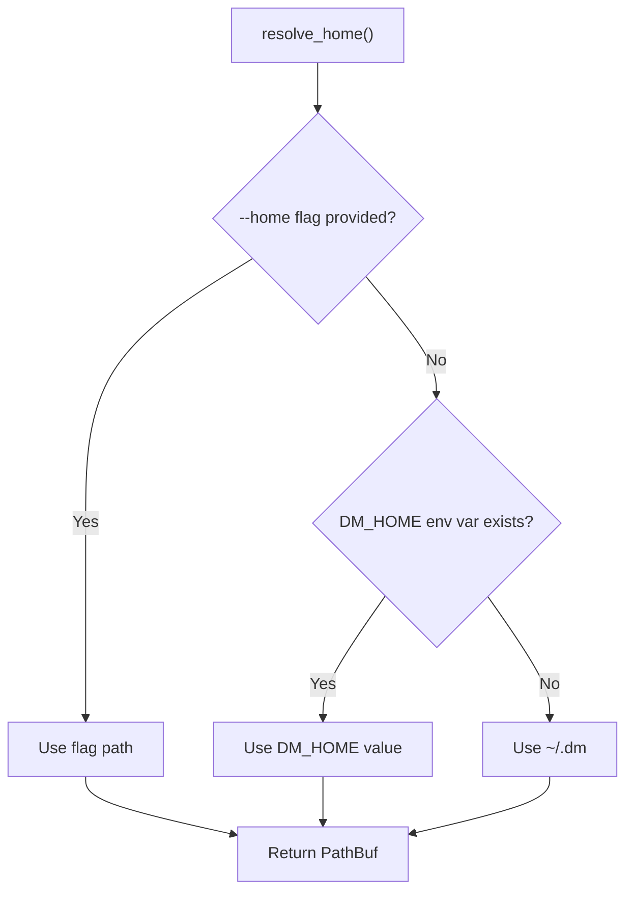
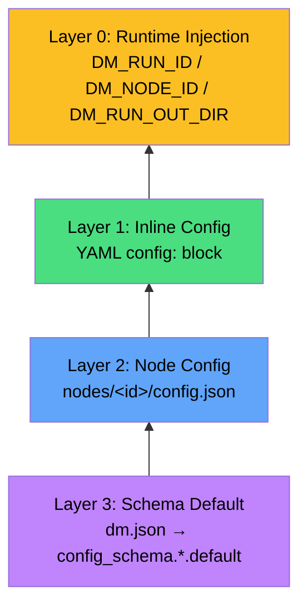
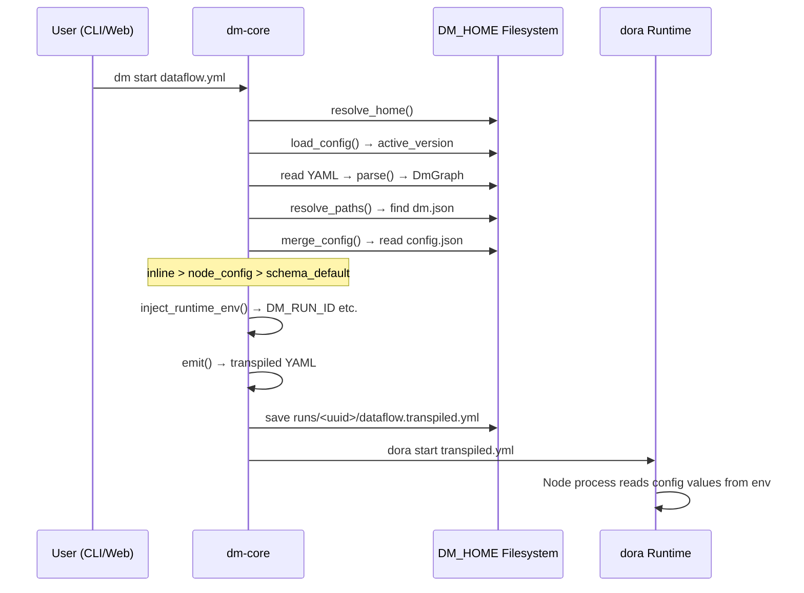

All persistent state in Dora Manager — from dora binary versions, node installations, dataflow projects, and run instances to event logs — converges on a single root directory **DM_HOME**. This design philosophy consolidates the scattered problem of "installation as configuration" into a clear single point of management: the `resolve_home()` function resolves the root path through a three-level priority chain of `--home flag > DM_HOME environment variable > ~/.dm default`, and all subsystems (node management, dataflow transpilation, runtime orchestration, event storage) derive subdirectories from this anchor point. This article systematically analyzes the complete directory topology of DM_HOME, the field semantics of the global configuration file `config.toml`, how the four-layer configuration merge pipeline layers configuration from schema defaults to runtime environment variables, and how developers can dynamically adjust configuration through environment variables and APIs.

Sources: [config.rs](https://github.com/l1veIn/dora-manager/blob/master/crates/dm-core/src/config.rs#L105-L118)

## DM_HOME Resolution: Three-Level Priority Chain

`resolve_home()` is the entry function for the entire configuration system. Its resolution logic strictly follows the following priority:

| Priority | Source | Use Case |
|----------|--------|----------|
| 1 (highest) | `--home` CLI flag | CI/CD pipelines, automated test isolation |
| 2 | `DM_HOME` environment variable | Development environment persistent overrides, multi-instance parallelism |
| 3 (lowest) | `~/.dm` (`dirs::home_dir()`) | Default behavior, zero-configuration out of the box |



On the CLI side, the `clap` parser injects the `--home` flag into the `Cli` struct via `#[arg(long, global = true)]`, then passes the resolution result to all subcommands in `main()` through `dm_core::config::resolve_home(cli.home)`. On the dm-server side, the server calls `resolve_home(None)` at startup, following the environment variable or default path. This means **the server does not support the `--home` flag** — to isolate server instances, use the `DM_HOME` environment variable.

Sources: [config.rs](https://github.com/l1veIn/dora-manager/blob/master/crates/dm-core/src/config.rs#L105-L118), [main.rs (CLI)](https://github.com/l1veIn/dora-manager/blob/master/crates/dm-cli/src/main.rs#L17-L28), [main.rs (CLI)](https://github.com/l1veIn/dora-manager/blob/master/crates/dm-cli/src/main.rs#L178-L181), [main.rs (Server)](https://github.com/l1veIn/dora-manager/blob/master/crates/dm-server/src/main.rs#L79-L80)

## DM_HOME Directory Structure Panorama

DM_HOME does not create the complete directory tree at install time; instead, each subsystem lazily creates subdirectories as needed. The following is a typical directory structure after full usage:

```
~/.dm/                              ← DM_HOME root directory
├── config.toml                     ← Global configuration (DmConfig)
├── active                          ← Current active dora version identifier
├── versions/                       ← Installed dora runtimes
│   └── 0.4.1/
│       └── dora                    ← Executable binary (Windows: dora.exe)
├── dataflows/                      ← Imported dataflow projects
│   └── system-test-full/
│       ├── dataflow.yml            ← YAML topology definition
│       ├── flow.json               ← Project metadata (FlowMeta)
│       ├── view.json               ← Visual editor layout
│       ├── config.json             ← Dataflow-level config overrides
│       └── .history/               ← Version snapshot history
│           └── 20250101T120000Z.yml
├── nodes/                          ← Installed managed nodes
│   └── dm-microphone/
│       ├── dm.json                 ← Node metadata and config schema
│       ├── config.json             ← Node-level config overrides
│       ├── pyproject.toml          ← Python build definition
│       └── dm_microphone/          ← Source code / build artifacts
├── runs/                           ← Run instance history
│   └── <uuid>/
│       ├── run.json                ← Run metadata (RunInstance)
│       ├── dataflow.yml            ← Runtime dataflow snapshot
│       ├── dataflow.transpiled.yml ← Transpiled dora YAML
│       ├── view.json               ← Editor layout snapshot
│       ├── logs/                   ← Node logs (e.g., microphone.log)
│       └── out/                    ← Node output artifacts
└── events.db                       ← SQLite event store (WAL mode)
```

Each subsystem's path resolution is implemented as pure functions accepting `home: &Path` parameters rather than global state, ensuring testability and isolation. The following table maps key path functions:

| Subsystem | Path Function | Target Path | Responsibility |
|-----------|--------------|-------------|----------------|
| Global config | `config_path()` | `home/config.toml` | DmConfig persistence |
| Version management | `versions_dir()` | `home/versions` | dora binary storage |
| Active link | `active_link()` | `home/active` | Current version identifier |
| Node management | `nodes_dir()` | `home/nodes` | Hosted node directory |
| Dataflow | `dataflows_dir()` | `home/dataflows` | Project YAML + metadata |
| Run instances | `runs_dir()` | `home/runs` | Run history and logs |
| Event storage | `EventStore::open()` | `home/events.db` | SQLite observability |

Sources: [paths.rs (dataflow)](https://github.com/l1veIn/dora-manager/blob/master/crates/dm-core/src/dataflow/paths.rs#L1-L36), [paths.rs (node)](https://github.com/l1veIn/dora-manager/blob/master/crates/dm-core/src/node/paths.rs#L1-L27), [repo.rs (runs)](https://github.com/l1veIn/dora-manager/blob/master/crates/dm-core/src/runs/repo.rs#L9-L48), [store.rs (events)](https://github.com/l1veIn/dora-manager/blob/master/crates/dm-core/src/events/store.rs#L14-L44), [config.rs](https://github.com/l1veIn/dora-manager/blob/master/crates/dm-core/src/config.rs#L120-L145)

## config.toml: Global Configuration Model

`config.toml` is the sole global configuration file in the DM_HOME root directory, serializing the `DmConfig` struct in TOML format. Its design follows the **progressive configuration** principle: when the file does not exist, it returns `DmConfig::default()`, with all fields providing sensible defaults — no manual creation required.

### DmConfig Complete Fields

```toml
# Currently active dora version identifier (e.g., "0.4.1"), None means not installed
active_version = "0.4.1"

[media]
# Whether to enable media backend (streaming support)
enabled = false
# Backend type, currently only supports "media_mtx"
backend = "media_mtx"

[media.mediamtx]
# mediamtx binary path (None = auto-download)
path = "/usr/local/bin/mediamtx"
# Specified version (None = latest)
version = "1.11.3"
# Whether to auto-download mediamtx
auto_download = true
# API port (mediamtx management interface)
api_port = 9997
# RTSP port (stream push/pull)
rtsp_port = 8554
# HLS port (HTTP live streaming)
hls_port = 8888
# WebRTC port (low-latency browser streaming)
webrtc_port = 8889
# Listen address (typically 127.0.0.1)
host = "127.0.0.1"
# Public access address (deployment scenario, overrides host)
public_host = "192.168.1.100"
# Full public WebRTC URL (overrides host:port combination)
public_webrtc_url = "http://192.168.1.100:8889"
# Full public HLS URL
public_hls_url = "http://192.168.1.100:8888"
```

### Configuration Loading and Persistence

`load_config()` and `save_config()` form the complete configuration I/O loop. When loading, if the file does not exist, a default instance is returned; when saving, `toml::to_string_pretty()` generates human-readable TOML, while `create_dir_all()` ensures the parent directory exists. dm-server exposes online configuration read/write capabilities through `GET /api/config` and `POST /api/config` endpoints.

Sources: [config.rs](https://github.com/l1veIn/dora-manager/blob/master/crates/dm-core/src/config.rs#L6-L103), [config.rs](https://github.com/l1veIn/dora-manager/blob/master/crates/dm-core/src/config.rs#L147-L166), [system.rs](https://github.com/l1veIn/dora-manager/blob/master/crates/dm-server/src/handlers/system.rs#L58-L107)

### Runtime Role of MediaConfig

`MediaConfig` is loaded and injected into `MediaRuntime` when dm-server starts. When `media.enabled = true`, the server initializes the mediamtx process as the streaming backend, using the port numbers from the configuration to generate the mediamtx config file. The `public_host`, `public_webrtc_url`, `public_hls_url` fields are dedicated to **non-local deployment scenarios**, allowing the frontend to access streaming endpoints via public addresses.

Sources: [media.rs](https://github.com/l1veIn/dora-manager/blob/master/crates/dm-server/src/services/media.rs#L77-L166), [main.rs (Server)](https://github.com/l1veIn/dora-manager/blob/master/crates/dm-server/src/main.rs#L79-L87)

## Four-Layer Configuration Merge Pipeline

Dora Manager's configuration system is not a flat key-value store but a **four-layer merge pipeline from schema definition to runtime injection**. This pipeline executes during dataflow transpilation (transpile), ensuring that each managed node's environment variables are layered from multiple configuration sources by priority.



### Merge Logic Details

| Priority | Layer | Source File | Scope | Example |
|----------|-------|------------|-------|---------|
| 1 (highest) | Inline Config | YAML `config:` block | Single dataflow instance | `config: { sample_rate: 16000 }` |
| 2 | Node Config | `nodes/&lt;id&gt;/config.json` | All usage scenarios for the node | `{"sample_rate": 48000}` |
| 3 | Schema Default | `dm.json` → `config_schema` | Default values at node definition | `"default": 44100` |
| 4 (runtime) | Runtime Injection | Auto-injected by transpiler | All managed nodes | `DM_RUN_ID`, `DM_NODE_ID` |

The core logic of the `merge_config` pass is implemented in `passes.rs`: for each field declared in `config_schema`, it takes the first non-`null` value in the order `inline_config > node_config_defaults > field_schema.default`, then writes it to the `merged_env` mapping. The field's `env` key specifies the environment variable name, which is ultimately output to the transpiled YAML as an `env:` block in the `emit` pass.

Sources: [passes.rs](https://github.com/l1veIn/dora-manager/blob/master/crates/dm-core/src/dataflow/transpile/passes.rs#L343-L416), [passes.rs](https://github.com/l1veIn/dora-manager/blob/master/crates/dm-core/src/dataflow/transpile/passes.rs#L418-L449), [local.rs](https://github.com/l1veIn/dora-manager/blob/master/crates/dm-core/src/node/local.rs#L173-L220)

### config.json: Node-Level Configuration Persistence

The `config.json` in each managed node directory is a **node-level configuration override** saved by the user through the frontend or API. Its value sits between schema defaults and inline config — the same node can use different inline values in different dataflows, but `config.json` provides a persistent default for the node across dataflows.

```json
// nodes/dm-microphone/config.json
{
  "sample_rate": 48000,
  "channels": 1
}
```

`get_node_config()` automatically handles the case where the file does not exist during read (returns empty object `{}`), while `save_node_config()` writes formatted JSON via `serde_json::to_string_pretty()`. The frontend interacts through `GET/POST /api/nodes/{id}/config` endpoints.

Sources: [local.rs](https://github.com/l1veIn/dora-manager/blob/master/crates/dm-core/src/node/local.rs#L173-L220)

### Configuration Aggregation API: inspect_config

The `inspect_config()` function implements **configuration aggregation queries** — it scans three configuration sources for each managed node in the dataflow, returning a `DataflowConfigAggregation` structure containing each field's `inline_value`, `node_value`, `default_value`, `effective_value`, and `effective_source`. This API supports the frontend configuration panel's "source traceability" feature, letting users clearly see the effective source of each configuration value.

| effective_source | Meaning |
|-----------------|---------|
| `"inline"` | From YAML `config:` block |
| `"node"` | From `config.json` persistent configuration |
| `"default"` | From `dm.json` schema default |
| `"unset"` | None of the three layers provided a value |

Sources: [service.rs](https://github.com/l1veIn/dora-manager/blob/master/crates/dm-core/src/dataflow/service.rs#L101-L215), [model.rs](https://github.com/l1veIn/dora-manager/blob/master/crates/dm-core/src/dataflow/model.rs#L136-L167)

## Node Search Path: DM_NODE_DIRS

Node path resolution is not limited to `DM_HOME/nodes/` — `configured_node_dirs()` builds an **ordered search chain**:

1. `DM_HOME/nodes/` — User-installed/imported nodes
2. `builtin_nodes_dir()` — Project repository `nodes/` directory (built-in nodes)
3. Additional paths in the `DM_NODE_DIRS` environment variable (PATH separator delimited)

`resolve_node_dir()` traverses the search chain and returns the first directory containing the target node ID. `push_unique()` ensures no wasted search due to duplicate paths. This mechanism allows developers to mount external node repositories via environment variables without modifying DM_HOME.

Sources: [paths.rs (node)](https://github.com/l1veIn/dora-manager/blob/master/crates/dm-core/src/node/paths.rs#L3-L52)

## Runtime Environment Variable Injection

The last pass of the transpilation pipeline, `inject_runtime_env()`, injects four **runtime environment variables** for each managed node. These variables are not declared in any configuration file but dynamically generated by the transpiler based on the runtime context:

| Environment Variable | Source | Purpose |
|---------------------|--------|---------|
| `DM_RUN_ID` | Auto-generated UUID v4 | Run instance unique identifier |
| `DM_NODE_ID` | `id` field in YAML | Node identifier in the dataflow |
| `DM_RUN_OUT_DIR` | `DM_HOME/runs/<run_id>/out` | Node output artifact directory |
| `DM_SERVER_URL` | Fixed value `http://127.0.0.1:3210` | dm-server interaction endpoint |

These variables enable nodes to be aware of their runtime context — for example, the `dm-save` node knows where to write files via `DM_RUN_OUT_DIR`, and the `dm-input` node interacts with the frontend via `DM_SERVER_URL`.

Sources: [passes.rs](https://github.com/l1veIn/dora-manager/blob/master/crates/dm-core/src/dataflow/transpile/passes.rs#L422-L449)

## Event Storage: events.db

`EventStore` maintains a SQLite database `events.db` in the DM_HOME root directory, with WAL (Write-Ahead Logging) mode enabled to support concurrent read/write. It records all operation events (node installation, dataflow transpilation, runtime start/stop, etc.), providing underlying data support for the [Event System: Observability Model and XES-Compatible Storage](11-event-system). The database is automatically created and schema-initialized on the first call to `EventStore::open()`.

Sources: [store.rs](https://github.com/l1veIn/dora-manager/blob/master/crates/dm-core/src/events/store.rs#L14-L44)

## Configuration API Endpoints

dm-server exposes two endpoints for runtime configuration management:

| Method | Path | Behavior |
|--------|------|----------|
| `GET` | `/api/config` | Read current `config.toml`, return JSON |
| `POST` | `/api/config` | Merge update (`active_version` and/or `media`), write back to `config.toml` |

`POST /api/config` accepts a `ConfigUpdate` request body, executing **read-modify-write** semantics: first load existing configuration, then only override fields provided in the request, finally serialize back to disk. This avoids full overwrites during concurrent writes.

Sources: [system.rs](https://github.com/l1veIn/dora-manager/blob/master/crates/dm-server/src/handlers/system.rs#L58-L107)

## Complete Configuration Flow: From User Operation to Node Process



Sources: [transpile/mod.rs](https://github.com/l1veIn/dora-manager/blob/master/crates/dm-core/src/dataflow/transpile/mod.rs#L31-L81), [config.rs](https://github.com/l1veIn/dora-manager/blob/master/crates/dm-core/src/config.rs#L147-L166)

## Further Reading

- **Four-layer configuration merge transpilation pipeline details**: See [Dataflow Transpiler: Multi-Pass Pipeline and Four-Layer Config Merging](08-transpiler)
- **Complete field definitions for node dm.json**: See [Developing Custom Nodes: dm.json Complete Field Reference](22-custom-node-guide)
- **Run instance lifecycle and state management**: See [Run Instance: Lifecycle, State, and Metrics Tracking](06-run-lifecycle)
- **Event storage query and export**: See [Event System: Observability Model and XES-Compatible Storage](11-event-system)
