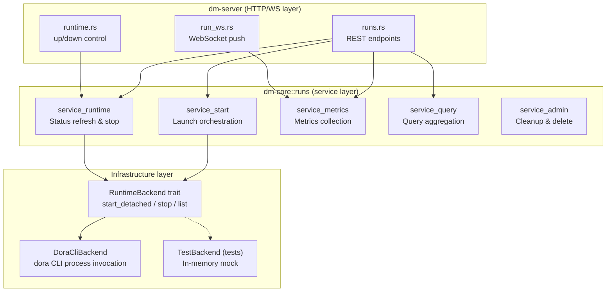
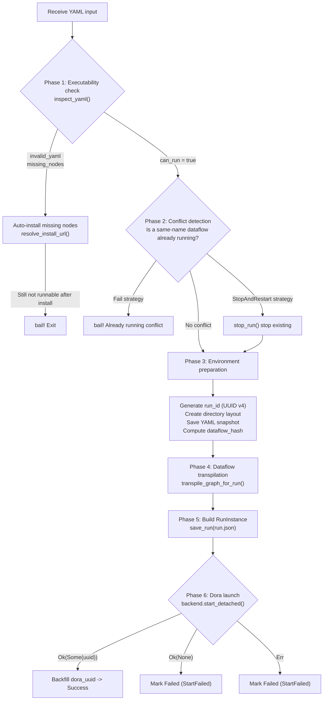
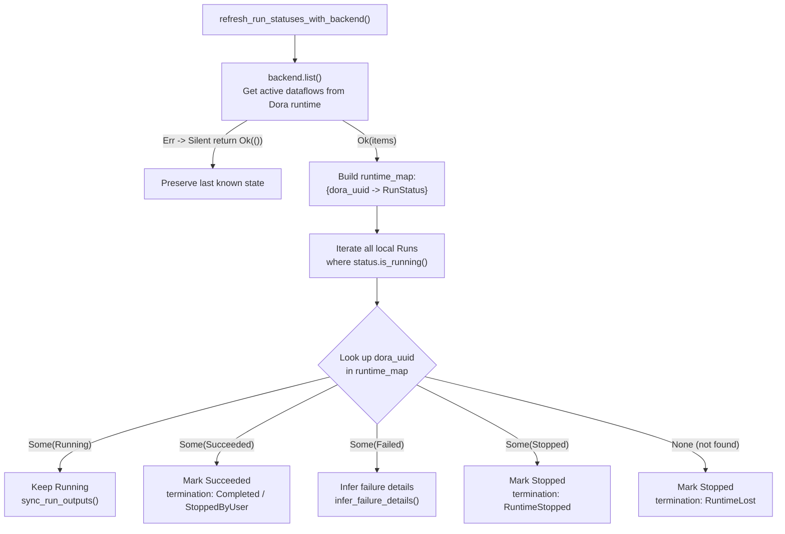

The Runtime Service is the core engine of the Dora Manager backend, responsible for transforming a YAML dataflow topology into a managed **Run** and continuously tracking its status until termination. This service spans the `runs` module in `dm-core` and the HTTP/WebSocket layer in `dm-server`, forming a complete lifecycle management pipeline: "launch -> monitor -> stop -> archive". This article provides an in-depth analysis across six dimensions: architectural layering, data model, launch orchestration, state synchronization, metrics collection, and real-time push.

Sources: [mod.rs](https://github.com/l1veIn/dora-manager/blob/main/crates/dm-core/src/runs/mod.rs#L1-L27), [service.rs](https://github.com/l1veIn/dora-manager/blob/main/crates/dm-core/src/runs/service.rs#L1-L47)

## Architecture Overview: Three-Layer Separation and the Backend Abstraction

The runtime service code organization follows the **separation of concerns** principle: the `model` layer defines pure data structures, the `repo` layer encapsulates filesystem I/O, and the `service` layer composes business logic. This layering is unified through `service.rs`, which serves as a facade file -- internally splitting into five `#[path]` modules (`service_start`, `service_runtime`, `service_metrics`, `service_query`, `service_admin`), so external callers only need to interact with a concise set of public function signatures.

Above all layers, there is a key design abstraction -- the **`RuntimeBackend` trait**. This trait encapsulates all interactions with the Dora CLI binary (start, stop, list) as a replaceable backend interface, allowing the core business logic to be mocked with `TestBackend` in tests while using `DoraCliBackend` in production. This "trait abstraction + parameter injection" pattern permeates the entire `runs` module.



Sources: [runtime.rs](https://github.com/l1veIn/dora-manager/blob/main/crates/dm-core/src/runs/runtime.rs#L24-L34), [service.rs](https://github.com/l1veIn/dora-manager/blob/main/crates/dm-core/src/runs/service.rs#L1-L47)

## RunInstance Data Model and Filesystem Layout

Each run instance corresponds to a `$DM_HOME/runs/<run_id>/` directory on disk, containing the complete state snapshot, transpiled artifacts, logs, and output files. `RunInstance` is the core persistence model, stored as `run.json` in JSON format. Persistence operations guarantee data integrity through a "write temp file + atomic rename" approach -- `save_run()` first writes to `run.json.<pid>.tmp`, then atomically replaces via `fs::rename`, avoiding data corruption from concurrent writes.

**Filesystem layout**:

| Path | Purpose |
|---|---|
| `run.json` | Run instance metadata (status, timestamps, dora_uuid, etc.) |
| `dataflow.yml` | Original YAML snapshot (the raw input saved at launch time) |
| `view.json` | Optional canvas view state (editor node positions/zoom info) |
| `dataflow.transpiled.yml` | Executable YAML produced by the transpilation pipeline |
| `out/<dora_uuid>/log_<node>.txt` | Dora runtime raw output directory (real-time logs) |

Sources: [repo.rs](https://github.com/l1veIn/dora-manager/blob/main/crates/dm-core/src/runs/repo.rs#L9-L46), [repo.rs](https://github.com/l1veIn/dora-manager/blob/main/crates/dm-core/src/runs/repo.rs#L56-L64)

**RunInstance core field analysis**:

| Field | Type | Description |
|---|---|---|
| `run_id` | `String` | UUID v4, globally unique identifier |
| `dora_uuid` | `Option<String>` | Dataflow UUID assigned by the Dora runtime, backfilled after successful launch |
| `status` | `RunStatus` | Four-state enum: `Running` / `Succeeded` / `Stopped` / `Failed` |
| `termination_reason` | `Option<TerminationReason>` | Termination reason enum (`Completed` / `StoppedByUser` / `StartFailed` / `NodeFailed` / `RuntimeLost` / `RuntimeStopped`) |
| `failure_node` / `failure_message` | `Option<String>` | Pinpoints the specific node and error summary on failure |
| `outcome` | `RunOutcome` | Human-readable summary containing `status`, `termination_reason`, and `summary` |
| `node_count_expected` / `node_count_observed` | `u32` | Expected node count vs. actually observed node count |
| `log_sync` | `RunLogSync` | Log sync state (`Pending` / `Synced`) and last sync timestamp |
| `source` | `RunSource` | Launch origin: `Cli` / `Server` / `Web` / `Unknown` |
| `stop_request` | `RunStopRequest` | Stop request timestamp and last stop error message |
| `dataflow_hash` | `String` | `sha256:`-prefixed hash of the original YAML content, used for change detection |

Sources: [model.rs](https://github.com/l1veIn/dora-manager/blob/main/crates/dm-core/src/runs/model.rs#L127-L184)

## Launch Orchestration: From YAML to Run Instance

Launching a Run is a multi-stage orchestration process. Whether triggered via the CLI's `dm run` or the HTTP API's `POST /api/runs/start`, everything ultimately converges on the `start_run_from_yaml_with_source_and_strategy` function. The following flowchart illustrates the complete six-stage orchestration path:



Sources: [service_start.rs](https://github.com/l1veIn/dora-manager/blob/main/crates/dm-core/src/runs/service_start.rs#L99-L283)

### Phase 1: Executability Check and Auto-Install

Before launching, `inspect_yaml()` is called to perform static analysis on the YAML. This function parses the YAML and checks each node's declared path one by one, confirming whether the corresponding `dm.json` file exists in the `$DM_HOME/nodes/` directory. If missing nodes are detected, the system does not immediately report an error but instead enters an **auto-install flow**:

1. For each missing `node_id`, calls `resolve_install_url()` to attempt to obtain an installation source. Resolution priority is: **`source.git` field in the YAML > global registry**.
2. If a git URL is found, sequentially executes `node::import_git()` and `node::install_node()` to complete the import and installation.
3. After installation, calls `inspect_yaml()` again to verify executability.
4. If nodes are still missing after installation or the YAML is invalid, it finally `bail!` exits.

This "best-effort recovery" strategy significantly improves user experience -- users do not need to manually install dependency nodes one by one.

Sources: [service_start.rs](https://github.com/l1veIn/dora-manager/blob/main/crates/dm-core/src/runs/service_start.rs#L18-L43), [service_start.rs](https://github.com/l1veIn/dora-manager/blob/main/crates/dm-core/src/runs/service_start.rs#L108-L142)

### Phase 2: Conflict Detection and Strategy Selection

The `StartConflictStrategy` enum defines two conflict handling strategies: **`Fail`** (the default, which reports an error directly when encountering a running dataflow with the same name) and **`StopAndRestart`** (stops the existing run before restarting). Conflict detection is implemented via `find_active_run_by_name_with_backend()` -- this function first refreshes all Run statuses (to ensure the latest runtime state is detected), then searches for an active Run matching the target `dataflow_name`.

At the HTTP layer, `POST /api/runs/start` maps the `force` parameter to strategy selection. When `force` is unspecified or `force=false`, the `Fail` strategy is used; when `force=true`, the `StopAndRestart` strategy is used.

Sources: [service_start.rs](https://github.com/l1veIn/dora-manager/blob/main/crates/dm-core/src/runs/service_start.rs#L167-L180), [runs.rs](https://github.com/l1veIn/dora-manager/blob/main/crates/dm-server/src/handlers/runs.rs#L346-L353)

### Phase 3-5: Environment Preparation and Transpilation

A `run_id` is generated via UUID v4, and `repo::create_layout()` is called to create the complete directory structure (including the `out/` subdirectory for Dora output). The original YAML is saved as a `dataflow.yml` snapshot. Then `transpile_graph_for_run()` is called to execute the multi-pass transpilation pipeline (path resolution, port validation, config merging, runtime environment injection), producing `dataflow.transpiled.yml`.

After transpilation, helper functions in `graph.rs` extract the node manifest and build `RunTranspileMetadata` (containing working directories and resolved node path mappings), ultimately constructing the complete `RunInstance` and persisting it as `run.json`. At this point, the Run's `status` is `Running` and `dora_uuid` is still `None` -- awaiting backfill in the next phase.

Sources: [service_start.rs](https://github.com/l1veIn/dora-manager/blob/main/crates/dm-core/src/runs/service_start.rs#L182-L237), [graph.rs](https://github.com/l1veIn/dora-manager/blob/main/crates/dm-core/src/runs/graph.rs#L7-L44)

### Phase 6: Dora Process Launch and UUID Backfill

`DoraCliBackend::start_detached()` executes `dora start <transpiled_path> --detach` via `tokio::process::Command`. This command launches the dataflow in detached mode, so the dataflow continues running in the background after the Dora CLI returns. The key signal of a successful launch is the output containing `dataflow start triggered: <uuid>` or `dataflow started: <uuid>` -- the `extract_dataflow_id()` function parses both prefix formats from the output.

If the launch succeeds but no UUID is returned, the `RunInstance` is immediately marked as `Failed` (`termination_reason: StartFailed`), recording the "did not return a runtime UUID" error. If the launch process itself throws an exception, it is similarly marked as `Failed` with the exception details recorded. Only when the UUID is successfully obtained is it backfilled into `RunInstance.dora_uuid` and `save_run()` called again.

Sources: [runtime.rs](https://github.com/l1veIn/dora-manager/blob/main/crates/dm-core/src/runs/runtime.rs#L44-L76), [runtime.rs](https://github.com/l1veIn/dora-manager/blob/main/crates/dm-core/src/runs/runtime.rs#L133-L143), [service_start.rs](https://github.com/l1veIn/dora-manager/blob/main/crates/dm-core/src/runs/service_start.rs#L239-L283)

### Additional Safeguards at the Server Layer

The `start_run` handler in `dm-server` adds two safeguards before calling the core launch logic. **Media backend readiness check**: if `inspect_yaml()` detects that the dataflow contains media nodes (`requires_media_backend`), but `MediaBackendStatus` is not `Ready`, it returns a 400 error with remediation guidance. **Runtime auto-start**: calls `ensure_runtime_up()` to detect whether the Dora daemon is running; if not, it automatically executes `dora up`, waiting up to 5 seconds (10 attempts x 500ms) to confirm successful startup.

Sources: [runs.rs](https://github.com/l1veIn/dora-manager/blob/main/crates/dm-server/src/handlers/runs.rs#L314-L380), [api/runtime.rs](https://github.com/l1veIn/dora-manager/blob/main/crates/dm-core/src/api/runtime.rs#L274-L282)

## Status Refresh: Synchronization Protocol with the Dora Runtime

`refresh_run_statuses()` is the core function for state management, responsible for synchronizing locally recorded Run statuses with the actual state of the Dora runtime. This function is called before any query operation (`list_runs`, `get_run`, `list_active_runs`), ensuring that callers see the freshest state.

### Synchronization Algorithm



**`RuntimeLost`** is a noteworthy state -- when the local record shows a Run is running, but the Dora runtime no longer reports that dataflow, it indicates an unexpected loss of the runtime (e.g., Dora daemon restart, process crash). The system marks it as `Stopped` with a `RuntimeLost` reason, ensuring eventual state consistency.

The synchronization algorithm also includes a **fault-tolerance design**: when `backend.list()` itself fails (Dora daemon unreachable), the function silently returns `Ok(())` without misjudging any active Run as failed. This is a defensive choice -- it is better for the state to be temporarily stale than to produce false positives during runtime fluctuations.

Sources: [service_runtime.rs](https://github.com/l1veIn/dora-manager/blob/main/crates/dm-core/src/runs/service_runtime.rs#L138-L268)

### Log Synchronization: sync_run_outputs()

When a Run's status changes, `sync_run_outputs()` is called to synchronize the Dora runtime's output. This function scans the `out/<dora_uuid>/` directory, matches filenames in the `log_<node_id>.txt` format, extracts the list of observed nodes, updates `nodes_observed` and `node_count_observed`, and marks `log_sync.state` as `Synced`.

Sources: [service_runtime.rs](https://github.com/l1veIn/dora-manager/blob/main/crates/dm-core/src/runs/service_runtime.rs#L270-L304)

### Failure Inference: infer_failure_details()

When Dora reports a dataflow failure, it only provides coarse-grained status information. `infer_failure_details()` uses a two-step strategy to enrich the failure details: first, it checks whether `failure_node` and `failure_message` are already recorded on the `RunInstance`; if empty, it iterates through all observed nodes' log files, calling `extract_error_summary()` to search for known error patterns in the log content (`AssertionError:`, `thread 'main' panicked at`, `panic:`, `ERROR`, Python Traceback, etc.), compressing matched error lines into a summary text of no more than 240 characters.

Sources: [state.rs](https://github.com/l1veIn/dora-manager/blob/main/crates/dm-core/src/runs/state.rs#L34-L57), [state.rs](https://github.com/l1veIn/dora-manager/blob/main/crates/dm-core/src/runs/state.rs#L118-L152)

### Terminal State Transition: apply_terminal_state()

`apply_terminal_state()` is the unified entry point for all terminal state transitions. It applies the information from `TerminalStateUpdate` to the `RunInstance`, while calling `build_outcome()` to generate a human-readable summary text. This function ensures that the `stopped_at` timestamp is set on the first transition (idempotent) and clears `stop_request` to prevent stale stop state from lingering.

The summary generation logic of `build_outcome()` is as follows:

| Status | Condition | Summary Text |
|---|---|---|
| `Running` | -- | `"Running"` |
| `Succeeded` | -- | `"Succeeded"` |
| `Stopped` | `StoppedByUser` | `"Stopped by user"` |
| `Stopped` | `RuntimeLost` | `"Stopped after Dora runtime lost track of the dataflow"` |
| `Stopped` | `RuntimeStopped` | `"Stopped by Dora runtime"` |
| `Stopped` | Other | `"Stopped"` |
| `Failed` | Has node + message | `"Failed: <node> <message>"` |
| `Failed` | Only node | `"Failed: <node>"` |
| `Failed` | Only message | `"Failed: <message>"` |
| `Failed` | Neither | `"Failed"` |

Sources: [state.rs](https://github.com/l1veIn/dora-manager/blob/main/crates/dm-core/src/runs/state.rs#L59-L116)

### Stale Run Reconciliation: reconcile_stale_running_runs

When the Dora runtime is entirely unavailable (daemon process has exited), the local system may retain many Run records with `status=Running`. `reconcile_stale_running_runs_if_runtime_down()` probes the runtime state via the `dora check` command -- if the runtime is indeed stopped, all locally Running Runs are marked as `Stopped(RuntimeLost)`. This reconciliation mechanism is automatically triggered within `refresh_run_statuses()` and is also executed as a cleanup step in `runtime::down()`.

Sources: [service_runtime.rs](https://github.com/l1veIn/dora-manager/blob/main/crates/dm-core/src/runs/service_runtime.rs#L306-L353), [api/runtime.rs](https://github.com/l1veIn/dora-manager/blob/main/crates/dm-core/src/api/runtime.rs#L200-L262)

## Metrics Collection: CPU, Memory, and Node-Level Monitoring

The metrics collection system calls two CLI commands via `DoraCliBackend`: `dora list --format json` and `dora node list --format json --dataflow <uuid>`, to obtain dataflow-level and node-level real-time metrics respectively.

### Two-Level Metrics Structure

**Dataflow level** (`RunMetrics`):

| Field | Type | Source |
|---|---|---|
| `cpu` | `Option<f64>` | `cpu` field in `dora list` JSON (percentage, e.g., `23.16`) |
| `memory_mb` | `Option<f64>` | `memory` field in `dora list` JSON (GB -> MB auto-conversion, e.g., `1.83` -> `1874.0`) |
| `nodes` | `Vec<NodeMetrics>` | Per-node details from `dora node list` |

**Node level** (`NodeMetrics`):

| Field | Type | Source Example |
|---|---|---|
| `id` | `String` | `"dora-qwen"` |
| `status` | `String` | `"Running"` |
| `pid` | `Option<String>` | `"67842"` |
| `cpu` | `Option<String>` | `"23.7%"` |
| `memory` | `Option<String>` | `"1143 MB"` |

Sources: [service_metrics.rs](https://github.com/l1veIn/dora-manager/blob/main/crates/dm-core/src/runs/service_metrics.rs#L1-L96), [model.rs](https://github.com/l1veIn/dora-manager/blob/main/crates/dm-core/src/runs/model.rs#L219-L233)

### Collection Patterns and NDJSON Parsing

The system provides two collection functions. **`get_run_metrics(home, run_id)`** is for single Run metrics collection -- it first loads the Run to confirm it is in the `Running` state and holds a `dora_uuid`, then sequentially calls dataflow-level and node-level metrics collection. **`collect_all_active_metrics(home)`** is for batch collection -- it first retrieves aggregated metrics for all dataflows at once, then collects node-level metrics for each UUID individually, returning a `HashMap` keyed by `dora_uuid`.

Both functions parse **newline-delimited JSON** (NDJSON) format -- the Dora CLI outputs results as one JSON object per line. The parser is fault-tolerant to format errors: unparseable lines are silently skipped, and missing fields return `None`. In dataflow-level parsing, memory values are converted from GB to MB (`gb * 1024.0`); in node-level parsing, `cpu` and `memory` are kept as strings (e.g., `"23.7%"`, `"1143 MB"`) because the Dora CLI directly returns formatted text.

Sources: [service_metrics.rs](https://github.com/l1veIn/dora-manager/blob/main/crates/dm-core/src/runs/service_metrics.rs#L98-L154)

## Stop and Cleanup

### Stop Process

`stop_run()` executes `dora stop <dora_uuid>` via `DoraCliBackend::stop()` with a 15-second timeout (`STOP_TIMEOUT_SECS`). The stop process includes a **fault-tolerant secondary confirmation mechanism**:

1. First calls `mark_stop_requested()` to record the stop request timestamp on the `RunInstance` (`stop_request.requested_at`).
2. Then calls `backend.stop()` to execute `dora stop`.
3. If `dora stop` succeeds, marks as `Stopped(StoppedByUser)`.
4. If `dora stop` fails, calls `backend.list()` again to check whether the dataflow is actually no longer in the running list.
5. If no longer in the running list, still marks as `Stopped(StoppedByUser)` (fault-tolerant success).
6. If still running and it is a timeout error, keeps `Running` status but records the timeout error message.
7. If still running and it is a non-timeout error, marks as `Failed(NodeFailed)`.

At the HTTP layer, `POST /api/runs/:id/stop` uses a **fire-and-forget** pattern -- the stop operation is `tokio::spawn`ed into a background task, and the HTTP response immediately returns `{"status": "stopping"}`, avoiding client blocking due to waiting for `dora stop` to time out.

Sources: [service_runtime.rs](https://github.com/l1veIn/dora-manager/blob/main/crates/dm-core/src/runs/service_runtime.rs#L16-L121), [runs.rs](https://github.com/l1veIn/dora-manager/blob/main/crates/dm-server/src/handlers/runs.rs#L383-L412)

### Cleanup and Deletion

`delete_run()` deletes the Run directory and all files within it, as well as associated event records (`EventStore::delete_by_case_id()`). `clean_runs(home, keep)` retains the most recent `keep` records, sorting by `started_at` in descending order and deleting excess historical records.

Sources: [service_admin.rs](https://github.com/l1veIn/dora-manager/blob/main/crates/dm-core/src/runs/service_admin.rs#L1-L28)

## Real-Time Push: WebSocket Endpoint

`dm-server` provides a WebSocket endpoint via `GET /api/runs/:id/ws`, implementing real-time log streaming and metrics push for runs. After the endpoint is established, a `tokio::select!` event loop runs in the background, simultaneously handling four types of events:

| Event Source | Interval | Push Content |
|---|---|---|
| File change notification (`notify` crate) | Real-time | `WsMessage::Logs` (new log lines) and `WsMessage::Io` (interaction lines containing `[DM-IO]` markers) |
| Metrics polling | 1 second | `WsMessage::Metrics` (node-level metrics) + `WsMessage::Status` (Run status) |
| Heartbeat | 10 seconds | `WsMessage::Ping` |
| Client message | -- | Detects `Close` frames to disconnect |

The file watcher uses `notify::recommended_watcher` to monitor the log directory. Each metrics tick checks whether the log directory has changed -- when the log directory changes from `out/<dora_uuid>/` (Dora real-time output) to an empty path, the watcher automatically switches. Each log read maintains a `log_offsets` hash table (`HashMap<PathBuf, u64>`), pushing only incremental content to avoid duplicate transmission.

Lines marked with `[DM-IO]` are separately filtered and pushed as `WsMessage::Io` messages -- this is the message channel for the interaction system (buttons, sliders, and other controls) -- nodes write interaction events to logs, and the frontend receives them in real-time via WebSocket.

Sources: [run_ws.rs](https://github.com/l1veIn/dora-manager/blob/main/crates/dm-server/src/handlers/run_ws.rs#L1-L149), [run_ws.rs](https://github.com/l1veIn/dora-manager/blob/main/crates/dm-server/src/handlers/run_ws.rs#L207-L228)

## Background Idle Monitoring

On startup, `dm-server` registers a background task that periodically executes `auto_down_if_idle()`. This function first calls `refresh_run_statuses()` to update all Run statuses (which can detect naturally completed dataflows), then checks whether any active Runs remain. If none, it automatically executes `dora down` to shut down the Dora runtime and free system resources. This "shut down when done" strategy is suitable for resource-constrained development environments.

Sources: [api/runtime.rs](https://github.com/l1veIn/dora-manager/blob/main/crates/dm-core/src/api/runtime.rs#L286-L296)

## RuntimeBackend Design Analysis

The `RuntimeBackend` trait defines three methods, covering the complete lifecycle of runtime interactions:

```rust
pub trait RuntimeBackend {
    fn start_detached<'a>(&'a self, home: &'a Path, transpiled_path: &'a Path)
        -> BoxFutureResult<'a, (Option<String>, String)>;
    fn stop<'a>(&'a self, home: &'a Path, dora_uuid: &'a str)
        -> BoxFutureResult<'a, ()>;
    fn list(&self, home: &Path) -> Result<Vec<RuntimeDataflow>>;
}
```

As the default implementation, `DoraCliBackend`'s methods correspond to Dora CLI commands as follows:

| Trait Method | CLI Command | Return Value |
|---|---|---|
| `start_detached` | `dora start <path> --detach` | `(Option<uuid>, output_text)` |
| `stop` | `dora stop <uuid>` (15s timeout) | `()` |
| `list` | `dora list` | `Vec<RuntimeDataflow>` |

`start_detached` and `stop` return `BoxFutureResult` (i.e., `Pin<Box<dyn Future<Output = Result<T>> + Send>>`) because these two operations need to asynchronously wait for child processes to complete. `list` is synchronous (using `std::process::Command`) because the status refresh path needs to return quickly and the caller does not need to await. All functions accepting a `RuntimeBackend` parameter are named with the `_with_backend` suffix, and internal implementation functions are marked `pub(super)`, forming clear visibility boundaries.

Sources: [runtime.rs](https://github.com/l1veIn/dora-manager/blob/main/crates/dm-core/src/runs/runtime.rs#L24-L34), [runtime.rs](https://github.com/l1veIn/dora-manager/blob/main/crates/dm-core/src/runs/runtime.rs#L43-L123)

## HTTP API Route Overview

The following table summarizes all HTTP endpoints exposed by the runtime service and their mapping to core functions:

| Method | Path | Core Function | Description |
|---|---|---|---|
| GET | `/api/runs` | `list_runs_filtered` | Paginated query, supports `status`/`search` filtering |
| GET | `/api/runs/active` | `list_runs_filtered` + `collect_all_active_metrics` | Active Run list (`?metrics=true` includes metrics) |
| GET | `/api/runs/:id` | `get_run` + `get_run_metrics` | Run details (`?include_metrics=true` includes metrics) |
| GET | `/api/runs/:id/metrics` | `get_run_metrics` | Single Run real-time metrics |
| POST | `/api/runs/start` | `start_run_from_yaml_with_source_and_strategy` | Start a new Run (supports `force` parameter) |
| POST | `/api/runs/:id/stop` | `stop_run` (background async) | Stop a Run (fire-and-forget) |
| POST | `/api/runs/delete` | `delete_run` | Batch delete Runs |
| GET | `/api/runs/:id/dataflow` | `read_run_dataflow` | Original YAML snapshot |
| GET | `/api/runs/:id/transpiled` | `read_run_transpiled` | Transpiled YAML |
| GET | `/api/runs/:id/view` | `read_run_view` | Canvas view JSON |
| GET | `/api/runs/:id/logs/:node` | `read_run_log` | Full node log |
| GET | `/api/runs/:id/logs/:node/tail` | `read_run_log_chunk` | Incremental log (`offset` parameter) |
| GET | `/api/runs/:id/logs/:node/stream` | SSE log stream | Real-time log push (`tail_lines` parameter) |
| GET | `/api/runs/:id/ws` | WebSocket handler | Real-time log + metrics + status push |
| POST | `/api/up` | `ensure_runtime_up` | Start Dora runtime |
| POST | `/api/down` | `down` | Shut down Dora runtime |

Sources: [runs.rs](https://github.com/l1veIn/dora-manager/blob/main/crates/dm-server/src/handlers/runs.rs#L1-L461), [runtime.rs](https://github.com/l1veIn/dora-manager/blob/main/crates/dm-server/src/handlers/runtime.rs#L69-L84)

## Design Highlights and Trade-offs

**Defensive state management**: `refresh_run_statuses_with_backend()` silently returns `Ok(())` when `backend.list()` fails, rather than propagating the error. This is a deliberate design choice -- when the Dora daemon is unreachable, the system does not misjudge all active Runs as failed, but instead preserves the last known state, waiting for the next refresh to re-synchronize.

**Detached mode launch**: Using the `--detach` flag to launch dataflows means the `dm-server` process does not become the parent process of the dataflow. Even if the server restarts, already-launched dataflows continue running under the Dora daemon's management -- after server restart, these "orphaned" Runs are rediscovered and taken over via `refresh_run_statuses()`.

**Fault-tolerant stop**: `dora stop` may return errors in certain edge cases (node has already exited on its own, timeout, etc.), but the dataflow is actually already stopped. The secondary confirmation mechanism (`backend.list()` check) avoids misclassifying such scenarios as `Failed`.

**Performance considerations for metrics collection**: `collect_all_active_metrics()` calls `dora node list` for every active dataflow, meaning N active dataflows trigger N+1 CLI process invocations (1 `dora list` + N `dora node list`). The current design trades process invocation overhead for implementation simplicity -- there is no need to maintain long-lived connections or additional metrics pipelines. In typical development scenarios (1-3 concurrent dataflows), this overhead is acceptable.

Sources: [service_runtime.rs](https://github.com/l1veIn/dora-manager/blob/main/crates/dm-core/src/runs/service_runtime.rs#L138-L146), [service_start.rs](https://github.com/l1veIn/dora-manager/blob/main/crates/dm-core/src/runs/service_start.rs#L239-L243), [service_runtime.rs](https://github.com/l1veIn/dora-manager/blob/main/crates/dm-core/src/runs/service_runtime.rs#L36-L121)

---

**Further reading**: For the complete lifecycle concepts and state machine model of run instances, see [Run Instance: Lifecycle State Machine and Metrics Tracking](6-yun-xing-shi-li-run-sheng-ming-zhou-qi-zhuang-tai-ji-yu-zhi-biao-zhui-zong). For multi-pass processing details of the dataflow transpilation pipeline, see [Dataflow Transpiler: Multi-Pass Pipeline and Four-Layer Config Merging](11-shu-ju-liu-zhuan-yi-qi-transpiler-duo-pass-guan-xian-yu-si-ceng-pei-zhi-he-bing). For the complete route design and Swagger documentation integration of the HTTP API, see [HTTP API Overview: REST Routes, WebSocket Real-Time Channels, and Swagger Documentation](15-http-api-quan-lan-rest-lu-you-websocket-shi-shi-tong-dao-yu-swagger-wen-dang). For how the frontend run workbench consumes these metrics and logs, see [Run Workbench: Grid Layout, Panel System, and Real-Time Log Viewer](19-yun-xing-gong-zuo-tai-wang-ge-bu-ju-mian-ban-xi-tong-yu-shi-shi-ri-zhi-cha-kan).
