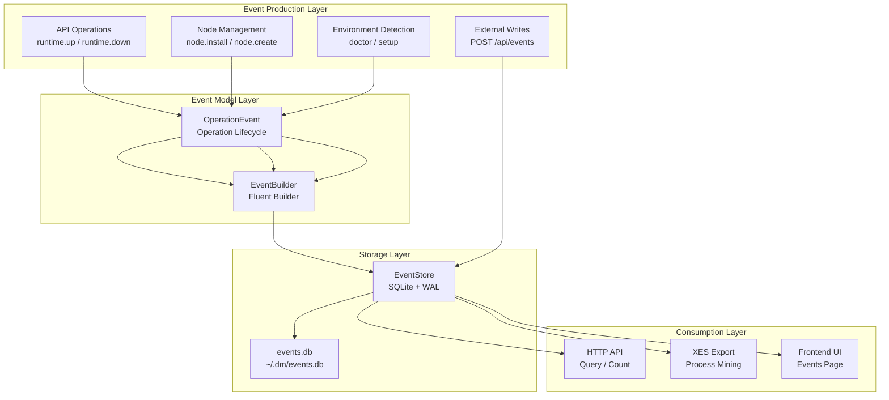
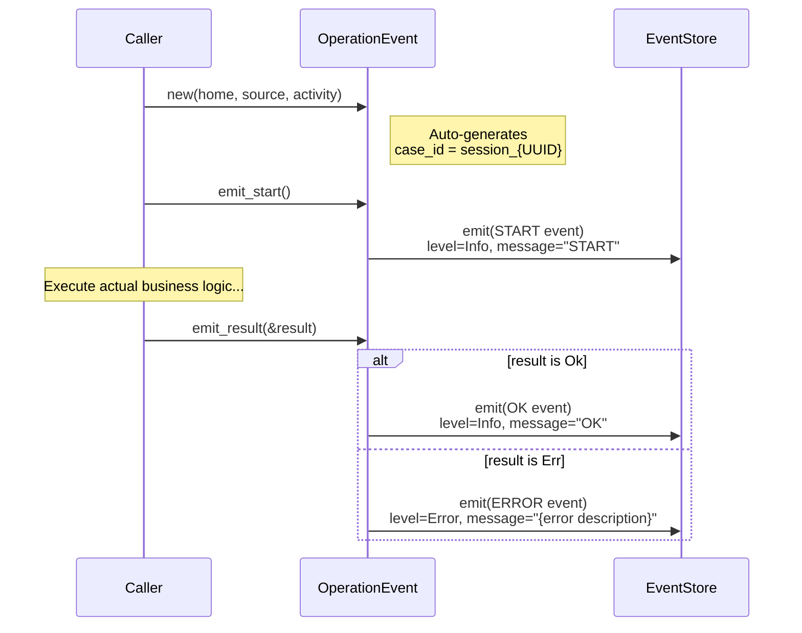
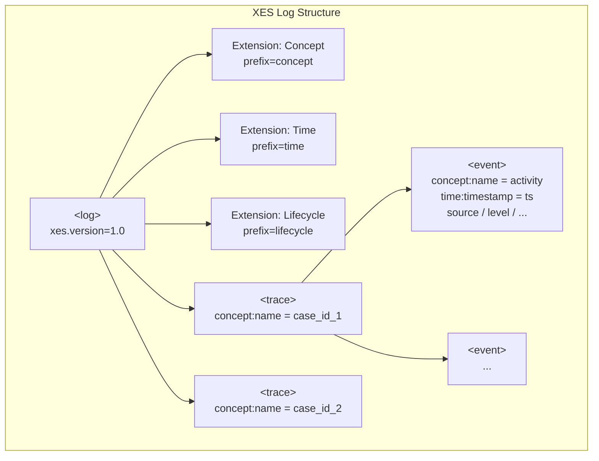
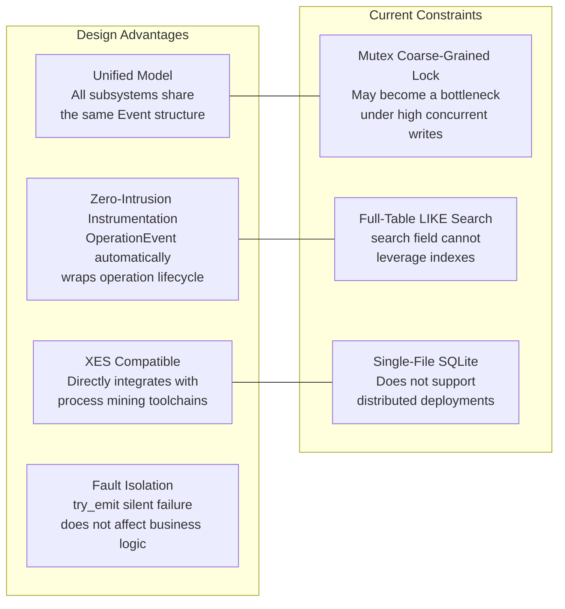

The Dora Manager event system is a **unified observability infrastructure** that normalizes system logs, dataflow execution traces, HTTP request records, frontend analytics, and CI metrics into a single event model, stored in a SQLite database. The model is designed to be compatible with the **XES (eXtensible Event Stream) standard** -- `case_id` maps to a Trace, `activity` maps to an Event, and it can be directly exported to XML format consumable by process mining tools such as PM4Py / ProM. This article will break down the complete implementation of this system layer by layer, from the data model, builder pattern, storage engine, and XES export, to the HTTP API and frontend UI.

Sources: [mod.rs](https://github.com/l1veIn/dora-manager/blob/main/crates/dm-core/src/events/mod.rs#L1-L5)

## Design Philosophy: Event as Single Source of Truth

The core design principle of the event system is **"Event as Single Source of Truth"**. All critical operations in dm-core -- runtime start/stop, version switching, node installation, environment diagnostics -- automatically produce paired start/result events through the `OperationEvent` abstraction. This pattern eliminates the need to manually insert logging calls in business logic; instead, operation wrappers automatically generate complete execution traces, ensuring the consistency and completeness of observability data.



Sources: [mod.rs](https://github.com/l1veIn/dora-manager/blob/main/crates/dm-core/src/events/mod.rs#L12-L15), [op.rs](https://github.com/l1veIn/dora-manager/blob/main/crates/dm-core/src/events/op.rs#L1-L67)

## Data Model: Event and Type Enums

### Event Core Structure

`Event` is the atomic data unit of the entire system. Its field design directly maps to the **Trace -> Event** hierarchy in the XES standard. All fields are stored as strings at serialization boundaries (JSON API, SQLite columns), ensuring maximum compatibility:

| Field | Type | XES Mapping | Description |
|-------|------|-------------|-------------|
| `id` | `i64` | -- | Auto-increment primary key, assigned by the storage layer |
| `timestamp` | `String` | `time:timestamp` | ISO 8601 / RFC 3339 format, automatically injected by `EventBuilder` |
| `case_id` | `String` | `concept:name` (Trace level) | Correlation identifier -- typically a session ID, run ID, or request ID |
| `activity` | `String` | `concept:name` (Event level) | Operation name, e.g. `node.install`, `runtime.up` |
| `source` | `String` | `source` | Event source category |
| `level` | `String` | `level` | Severity level, defaults to `"info"` |
| `node_id` | `Option<String>` | `node_id` | Optional node identifier |
| `message` | `Option<String>` | `message` | Human-readable description |
| `attributes` | `Option<String>` | -- | JSON-serialized arbitrary extension attributes |

Sources: [model.rs](https://github.com/l1veIn/dora-manager/blob/main/crates/dm-core/src/events/model.rs#L80-L92)

### EventSource: Five-Domain Classification

Event sources are divided into five orthogonal domains, covering all subsystems that the Dora Manager runtime may involve. Each variant uses `#[serde(rename_all = "lowercase")]` to ensure serialized output is lowercase, while implementing `Display` and `FromStr` traits to maintain consistency between SQL queries and JSON boundaries:

| Enum Value | Serialized Value | Responsibility Domain |
|------------|------------------|-----------------------|
| `Core` | `"core"` | Core engine operations: runtime management, node installation, version switching, environment diagnostics |
| `Dataflow` | `"dataflow"` | Dataflow lifecycle: node scheduling, output events, topology changes |
| `Server` | `"server"` | HTTP service layer: API request logs, WebSocket connections |
| `Frontend` | `"frontend"` | Frontend interactions: UI operations, user behavior analytics |
| `Ci` | `"ci"` | Continuous integration: build warnings, test results, deployment events |

Sources: [model.rs](https://github.com/l1veIn/dora-manager/blob/main/crates/dm-core/src/events/model.rs#L4-L40)

### EventLevel: Five-Level Severity

The severity hierarchy follows the semantic conventions of standard log levels. `EventBuilder` defaults the level to `Info`, and only `OperationEvent` automatically elevates to `Error` when the result is an error:

| Enum Value | Serialized Value | Semantics |
|------------|------------------|-----------|
| `Trace` | `"trace"` | Extremely fine-grained execution path tracing |
| `Debug` | `"debug"` | Debugging diagnostics |
| `Info` | `"info"` | Normal operation records (**default value**) |
| `Warn` | `"warn"` | Non-fatal anomalies or degraded warnings |
| `Error` | `"error"` | Operation failure, usually accompanied by error details |

Sources: [model.rs](https://github.com/l1veIn/dora-manager/blob/main/crates/dm-core/src/events/model.rs#L42-L78)

## EventBuilder: Fluent Event Builder

`EventBuilder` adopts the Rust Builder pattern, providing a fluent chainable API for constructing event objects. Three core design decisions are worth noting:

- **Automatic timestamp**: At `build()` time, a UTC timestamp is automatically injected via `chrono::Utc::now().to_rfc3339()`, so callers don't need to worry about time synchronization
- **Deferred attribute aggregation**: The `attr()` method accepts any `impl Serialize` value, gradually accumulating them into an internal `serde_json::Map`, which is serialized to a JSON string in one shot at `build()` time
- **Zero ID strategy**: `Event.id` is hardcoded to `0` during construction; the real ID is assigned by SQLite's `AUTOINCREMENT` at `emit()` time

```rust
// Typical usage: chain-build an event with rich attributes
let event = EventBuilder::new(EventSource::Ci, "clippy.warn")
    .case_id("commit_abc123")
    .level(EventLevel::Warn)
    .message("unused variable")
    .attr("file", "src/main.rs")
    .attr("line", 42)
    .attr("severity", "warning")
    .build();
```

Sources: [builder.rs](https://github.com/l1veIn/dora-manager/blob/main/crates/dm-core/src/events/builder.rs#L1-L74)

## OperationEvent: Operation Lifecycle Tracking

`OperationEvent` is the **core operational semantic layer** of the event system, providing automated start/result event pairs for long-running operations. Its design transforms observability from "retroactively adding logs" to "declarative operation tracking":



This pattern ensures that every critical operation leaves **paired start/end markers** in the event stream, supporting complete execution path reconstruction based on `case_id`.

Sources: [op.rs](https://github.com/l1veIn/dora-manager/blob/main/crates/dm-core/src/events/op.rs#L17-L67)

### Complete Operation Instrumentation List

The table below lists all operations tracked through `OperationEvent` in dm-core. Each row represents a pair of start/result events, with `case_id` in the `session_{UUID}` format:

| Module | Activity | Trigger Scenario |
|--------|----------|------------------|
| [runtime.rs](https://github.com/l1veIn/dora-manager/blob/main/crates/dm-core/src/api/runtime.rs#L137-L196) | `runtime.up` | Start dora coordinator and daemon |
| [runtime.rs](https://github.com/l1veIn/dora-manager/blob/main/crates/dm-core/src/api/runtime.rs#L201-L261) | `runtime.down` | Stop dora runtime |
| [runtime.rs](https://github.com/l1veIn/dora-manager/blob/main/crates/dm-core/src/api/runtime.rs#L300-L306) | `passthrough` | Directly pass through dora CLI commands |
| [version.rs](https://github.com/l1veIn/dora-manager/blob/main/crates/dm-core/src/api/version.rs#L10-L59) | `versions` | Query the list of installed versions |
| [version.rs](https://github.com/l1veIn/dora-manager/blob/main/crates/dm-core/src/api/version.rs#L64-L88) | `version.uninstall` | Uninstall a specific version |
| [version.rs](https://github.com/l1veIn/dora-manager/blob/main/crates/dm-core/src/api/version.rs#L93-L120) | `version.switch` | Switch the active version |
| [doctor.rs](https://github.com/l1veIn/dora-manager/blob/main/crates/dm-core/src/api/doctor.rs#L10-L60) | `doctor` | Execute environment health checks |
| [setup.rs](https://github.com/l1veIn/dora-manager/blob/main/crates/dm-core/src/api/setup.rs#L14-L53) | `setup` | Execute first-time installation and dependency checks |
| [local.rs](https://github.com/l1veIn/dora-manager/blob/main/crates/dm-core/src/node/local.rs#L14-L85) | `node.create` | Create a new node scaffold |
| [local.rs](https://github.com/l1veIn/dora-manager/blob/main/crates/dm-core/src/node/local.rs#L89-L135) | `node.list` | List all available nodes |
| [local.rs](https://github.com/l1veIn/dora-manager/blob/main/crates/dm-core/src/node/local.rs#L139-L140) | `node.uninstall` | Uninstall a specific node |
| [local.rs](https://github.com/l1veIn/dora-manager/blob/main/crates/dm-core/src/node/local.rs#L235-L236) | `node.status` | Query node status |
| [import.rs](https://github.com/l1veIn/dora-manager/blob/main/crates/dm-core/src/node/import.rs#L22-L54) | `node.import_local` | Import a node from a local directory |
| [import.rs](https://github.com/l1veIn/dora-manager/blob/main/crates/dm-core/src/node/import.rs#L59) | `node.import_git` | Import a node from a Git repository |
| [install.rs](https://github.com/l1veIn/dora-manager/blob/main/crates/dm-core/src/node/install.rs#L12-L13) | `node.install` | Install node dependencies and build |

Sources: [op.rs](https://github.com/l1veIn/dora-manager/blob/main/crates/dm-core/src/events/op.rs#L1-L67)

## EventStore: SQLite Storage Engine

### Storage Location and Initialization

The event database is located at `<DM_HOME>/events.db`, where `DM_HOME` resolution priority is: `--home` command-line argument > `DM_HOME` environment variable > `~/.dm` default path. dm-server initializes `EventStore` globally as part of the application state at startup, wrapped in `Arc` and shared across all request handlers:

```rust
// dm-server main.rs at startup
let events = EventStore::open(&home).expect("Failed to open event store");
let state = AppState {
    home: Arc::new(home),
    events: Arc::new(events),  // Arc-wrapped, globally shared
    // ...
};
```

Sources: [store.rs](https://github.com/l1veIn/dora-manager/blob/main/crates/dm-core/src/events/store.rs#L14-L44), [main.rs](https://github.com/l1veIn/dora-manager/blob/main/crates/dm-server/src/main.rs#L82-L92), [state.rs](https://github.com/l1veIn/dora-manager/blob/main/crates/dm-server/src/state.rs#L6-L13), [config.rs](https://github.com/l1veIn/dora-manager/blob/main/crates/dm-core/src/config.rs#L107-L118)

### Schema and Index Strategy

`EventStore::open()` executes DDL at initialization, creating a single `events` table with four indexes:

```sql
CREATE TABLE IF NOT EXISTS events (
    id          INTEGER PRIMARY KEY AUTOINCREMENT,
    timestamp   TEXT    NOT NULL,
    case_id     TEXT    NOT NULL,
    activity    TEXT    NOT NULL,
    source      TEXT    NOT NULL,
    level       TEXT    NOT NULL DEFAULT 'info',
    node_id     TEXT,
    message     TEXT,
    attributes  TEXT
);
```

| Index Name | Target Column | Supported Query Scenario |
|------------|---------------|--------------------------|
| `idx_events_case` | `case_id` | Trace complete event chain by run instance/session |
| `idx_events_source` | `source` | Filter by source domain (core/server/dataflow, etc.) |
| `idx_events_time` | `timestamp` | Time range queries (since/until) |
| `idx_events_activity` | `activity` | Search by operation type |

The database runs in **WAL (Write-Ahead Log) mode** (`PRAGMA journal_mode=WAL`), allowing concurrent reads and writes without blocking read operations -- critical for dm-server's scenario of "writing events while the frontend queries the list."

Sources: [store.rs](https://github.com/l1veIn/dora-manager/blob/main/crates/dm-core/src/events/store.rs#L22-L39)

### Thread Safety Model

`EventStore` achieves thread safety through `Mutex<Connection>`. This is a **coarse-grained locking strategy** -- every `emit()`, `query()`, or `count()` operation requires acquiring the global mutex. Under the current event throughput scenario (operation-level instrumentation, not high-frequency logging), this design strikes a reasonable balance between simplicity and performance. The singleton pattern of `Arc<EventStore>` in `AppState` further simplifies lifecycle management.

Sources: [store.rs](https://github.com/l1veIn/dora-manager/blob/main/crates/dm-core/src/events/store.rs#L10-L12), [state.rs](https://github.com/l1veIn/dora-manager/blob/main/crates/dm-server/src/state.rs#L10-L16)

### Dynamic Query Building

The `query()` method uses a **dynamic SQL concatenation** pattern, progressively appending `WHERE` conditions based on non-`None` fields in `EventFilter`. The filtering dimensions cover all core attributes of an event:

| Filter Field | SQL Operator | Match Mode |
|--------------|--------------|------------|
| `source` | `=` | Exact match |
| `case_id` | `=` | Exact match |
| `activity` | `LIKE` | Fuzzy match (`%pattern%`) |
| `level` | `=` | Exact match |
| `node_id` | `=` | Exact match |
| `since` | `>=` | Time range start |
| `until` | `<=` | Time range end |
| `search` | `LIKE` (three-field OR) | Full-text fuzzy search across activity + message + source |
| `limit` | `LIMIT` | Page size (default 500) |
| `offset` | `OFFSET` | Pagination offset |

Results are sorted by `id DESC` (newest events first). The `count()` method reuses the same filtering logic but executes a `SELECT COUNT(*)` aggregate, used for frontend pagination calculations.

Sources: [store.rs](https://github.com/l1veIn/dora-manager/blob/main/crates/dm-core/src/events/store.rs#L70-L204), [model.rs](https://github.com/l1veIn/dora-manager/blob/main/crates/dm-core/src/events/model.rs#L94-L107)

### Cascading Deletion: Run and Event Lifecycle Binding

When a run instance is deleted via `runs::service_admin::delete_run()`, the event system automatically cleans up all associated events. This cascading deletion mechanism ensures consistency between run instances and their observability data -- there are no "orphaned events":

```rust
pub fn delete_run(home: &Path, run_id: &str) -> Result<()> {
    repo::delete_run(home, run_id)?;
    let store = crate::events::EventStore::open(home)?;
    let _ = store.delete_by_case_id(run_id);  // Delete associated events using run_id as case_id
    Ok(())
}
```

The `clean_runs()` batch cleanup function follows the same pattern, cleaning up all associated events for run instances that are not among the most recent N retained.

Sources: [service_admin.rs](https://github.com/l1veIn/dora-manager/blob/main/crates/dm-core/src/runs/service_admin.rs#L7-L27), [store.rs](https://github.com/l1veIn/dora-manager/blob/main/crates/dm-core/src/events/store.rs#L213-L220)

## XES Export: Process Mining Compatibility Layer

### XES Standard Mapping

XES (eXtensible Event Stream) is an event log format defined by the IEEE 1849 standard, widely supported by process mining tools such as ProM and PM4Py. The export module `render_xes()` maps the internal event model to XES's three-tier structure -- Log -> Trace -> Event:



Specific mapping rules:

- **Log level**: Declares three standard extensions (Concept, Time, Lifecycle), declares `xes.version="1.0"` and `xes.features="nested-attributes"`
- **Trace level**: Grouped by `case_id`, each unique `case_id` generates a `<trace>` element, with `concept:name` set to the `case_id` value
- **Event level**: `activity` -> `concept:name`, `timestamp` -> `time:timestamp`, `source`/`level`/`node_id`/`message` as additional `<string>` attributes

Events are first grouped by `case_id` into a `BTreeMap` (guaranteeing lexicographic output order), then traversed in original order within each group, producing output that is well-formatted and reproducible.

Sources: [export.rs](https://github.com/l1veIn/dora-manager/blob/main/crates/dm-core/src/events/export.rs#L1-L63)

### XML Escaping and Security

The `escape_xml()` function performs entity escaping on five XML special characters (`& < > " '`), ensuring that user-controllable fields like `message` cannot break the XML structure. This is especially important in scenarios such as node installation error messages and dataflow execution exceptions -- user-generated error information may contain arbitrary characters.

Sources: [export.rs](https://github.com/l1veIn/dora-manager/blob/main/crates/dm-core/src/events/export.rs#L65-L71)

## HTTP API: Event Consumption Endpoints

dm-server exposes the full read/write capabilities of the event system through four HTTP endpoints, all sharing the same `AppState.events: Arc<EventStore>` instance:

| Endpoint | Method | Function | Response Type |
|----------|--------|----------|---------------|
| `/api/events` | GET | Query event list by conditions | `application/json` |
| `/api/events/count` | GET | Count events by conditions | `application/json` |
| `/api/events` | POST | Write a single event | `application/json` |
| `/api/events/export` | GET | Export as XES XML | `application/xml` |

### Query Examples

The GET endpoint directly deserializes the URL Query String into `EventFilter`, supporting flexible combinations of all filter fields:

```
GET /api/events?source=core&case_id=session_001&limit=50&offset=100
GET /api/events/count?level=error&since=2025-01-01T00:00:00Z
GET /api/events/export?source=dataflow&format=xes
```

### Event Writing

The POST endpoint accepts a complete `Event` JSON body (the `id` field is ignored, assigned by database auto-increment), returning the newly created event ID:

```json
// POST /api/events
{
  "case_id": "run_abc123",
  "activity": "node.output",
  "source": "dataflow",
  "level": "info",
  "node_id": "opencv-plot",
  "message": "Frame rendered",
  "attributes": "{\"fps\": 30, \"resolution\": \"640x480\"}"
}

// Response: { "id": 42 }
```

Sources: [events.rs](https://github.com/l1veIn/dora-manager/blob/main/crates/dm-server/src/handlers/events.rs#L1-L52), [main.rs](https://github.com/l1veIn/dora-manager/blob/main/crates/dm-server/src/main.rs#L224-L228)

## try_emit: Fault-Tolerant Emission

The `try_emit()` function provides a **silent failure** event emission strategy -- it opens the EventStore and attempts to write; if the database is unavailable (insufficient permissions, disk full, etc.), the error is silently swallowed. This ensures that failures in the event system **never affect the normal execution of core business logic**:

```rust
pub fn try_emit(home: &Path, event: Event) {
    if let Ok(store) = EventStore::open(home) {
        let _ = store.emit(&event);
    }
}
```

Both `emit_start()` and `emit_result()` inside `OperationEvent` use this function to emit events, achieving complete decoupling of observability from business logic.

Sources: [op.rs](https://github.com/l1veIn/dora-manager/blob/main/crates/dm-core/src/events/op.rs#L9-L14)

## Frontend Events Page

The frontend provides a full visual event browser through the `/events` route. This page implements the following interactive capabilities:

- **Multi-dimensional filtering**: Source (core/server/dataflow/frontend), Level (info/warn/error/debug), full-text search (300ms debounce)
- **Paginated browsing**: 50 items per page, parallel requests to `/api/events/count` and `/api/events` to optimize loading speed
- **Event detail panel**: Click any event row to open a Sheet sidebar, displaying the full JSON attribute payload (with syntax highlighting)
- **XES export**: Passes current filter conditions through to `/api/events/export`, downloading the XML file in a new browser window
- **Visual encoding**: Source uses different colored Badges (core=blue, server=purple, dataflow=green, frontend=orange), Level uses semantic variants (error=red, warn=outline, info=default)

Sources: [+page.svelte](https://github.com/l1veIn/dora-manager/blob/main/web/src/routes/events/+page.svelte#L1-L316), [EventDetailsSheet.svelte](https://github.com/l1veIn/dora-manager/blob/main/web/src/routes/events/EventDetailsSheet.svelte#L1-L91)

## Architecture Summary and Design Trade-offs



The event system makes clear design choices between **simplicity** and **scalability**: single-table SQLite storage simplifies deployment and backup (a single `events.db` file migrates all observability data); the XES-compatible model ensures the long-term analytical value of event data; the `OperationEvent` pattern reduces the cognitive burden of instrumentation. For the current single-machine deployment scenario, this architecture provides sufficient observability capabilities while reserving interface space for future migration to more complex storage backends.

Sources: [mod.rs](https://github.com/l1veIn/dora-manager/blob/main/crates/dm-core/src/events/mod.rs#L1-L15)

---

**Next reading**: To understand how the event system is consumed by dm-server's HTTP layer, see [HTTP API Overview: REST Routes, WebSocket Real-time Channels, and Swagger Documentation](15-http-api-quan-lan-rest-lu-you-websocket-shi-shi-tong-dao-yu-swagger-wen-dang); for a deeper look at the run instance lifecycle tracked by events, see [Runtime Service: Startup Orchestration, Status Refresh, and CPU/Memory Metrics Collection](13-yun-xing-shi-fu-wu-qi-dong-bian-pai-zhuang-tai-shua-xin-yu-cpu-nei-cun-zhi-biao-cai-ji); to learn about the event database storage location configuration, see [Configuration System: DM_HOME Directory Structure and config.toml](16-pei-zhi-ti-xi-dm_home-mu-lu-jie-gou-yu-config-toml).
