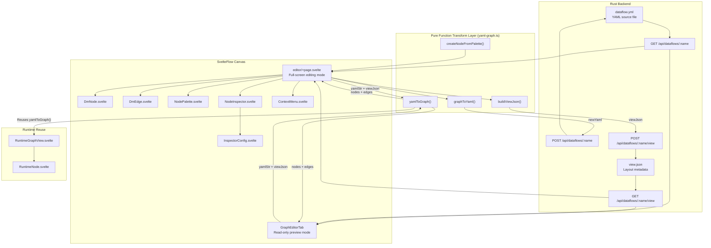

Dora Manager's visual graph editor is a bidirectional editing system built on **SvelteFlow**, whose core mission is to transform Dora dataflow YAML topology definitions into interactive node graph canvases, while ensuring that every editing operation on the canvas can be precisely serialized back into valid YAML output. The system spans three collaborative layers: the **pure functional transformation engine** (`yaml-graph.ts`) handles bidirectional translation between YAML text and graph data structures; the **SvelteFlow canvas layer** (`GraphEditorTab.svelte` / `editor/+page.svelte`) hosts interaction and state management; the **backend persistence layer** (Rust `repo.rs`) handles `view.json` and `dataflow.yml` read/write. Starting from an architectural overview, this article dissects each module's design decisions and implementation details layer by layer.

Sources: [yaml-graph.ts](https://github.com/l1veIn/dora-manager/blob/master/web/src/routes/dataflows/[id]/components/graph/yaml-graph.ts#L1-L5), [GraphEditorTab.svelte](https://github.com/l1veIn/dora-manager/blob/master/web/src/routes/dataflows/[id]/components/GraphEditorTab.svelte#L1-L41), [repo.rs](https://github.com/l1veIn/dora-manager/blob/master/crates/dm-core/src/dataflow/repo.rs#L86-L105)

## Architecture Overview

The following diagram shows the core data flow and component collaboration of the graph editor. A key premise to understand: **YAML is the dataflow's single Source of Truth**, while `view.json` only stores canvas layout metadata (node coordinates and viewport state). Both are written to separate backend endpoints during save.



### Dual-Mode Design: Read-Only Preview vs. Full-Screen Editing

The system provides two canvas forms, serving "viewing" and "editing" scenarios respectively. **Read-only preview mode** (`GraphEditorTab`) is embedded in the dataflow details page's Graph Editor Tab — nodes are non-draggable, non-connectable, non-deletable, offering only pan/zoom and MiniMap capabilities. **Full-screen editing mode** (`editor/+page.svelte`) enters the independent `:id/editor` route via the "Open Editor" button, unlocking complete topology editing capabilities — including node creation, port connections, deletion, undo/redo, configuration editing, and more. This layered design ensures zero risk of accidental operations in viewing scenarios, while providing a full-screen immersive experience for deep editing.

Sources: [GraphEditorTab.svelte](https://github.com/l1veIn/dora-manager/blob/master/web/src/routes/dataflows/[id]/components/GraphEditorTab.svelte#L52-L72), [editor/+page.svelte](https://github.com/l1veIn/dora-manager/blob/master/web/src/routes/dataflows/[id]/editor/+page.svelte#L573-L634)

## Transform Engine: yamlToGraph and graphToYaml

The transform engine is the core backbone of the entire graph editor, implemented in [yaml-graph.ts](https://github.com/l1veIn/dora-manager/blob/master/web/src/routes/dataflows/[id]/components/graph/yaml-graph.ts), providing pure functional transformation in both directions. This design ensures testability and side-effect-free characteristics — functions do not depend on any external state, and the same input parameters always produce the same results.

### YAML → Graph: Two-Pass Scanning Algorithm

The `yamlToGraph()` function accepts a YAML string and a `ViewJson` object, outputting the `nodes` and `edges` arrays required by SvelteFlow. Internally, it uses a **two-pass scanning** strategy:

**First Pass (node creation)**: Iterates through `parsed.nodes`, generating a `DmFlowNode` for each YAML node. Node IDs directly reuse the `id` field from YAML, positions are prioritized from `viewJson.nodes[id]`, defaulting to zero. Each node carries `inputs` (key set from YAML `inputs`), `outputs` (from YAML `outputs` array), and `nodeType` (from YAML `node` or `path` field).

**Second Pass (edge derivation + virtual node generation)**: Iterates through all YAML nodes' `inputs` mappings again, calling `classifyInput()` for each input value:

| Input Format | Classification Result | Graph Representation |
|-------------|----------------------|---------------------|
| `microphone/audio` | `{ type: 'node', sourceId, outputPort }` | Regular edge: `microphone → current node` |
| `dora/timer/millis/2000` | `{ type: 'dora', raw }` | Virtual Timer node + edge |
| `panel/device_id` | `{ type: 'panel', widgetId }` | Virtual Panel node + edge |

Sources: [yaml-graph.ts](https://github.com/l1veIn/dora-manager/blob/master/web/src/routes/dataflows/[id]/components/graph/yaml-graph.ts#L63-L200), [types.ts](https://github.com/l1veIn/dora-manager/blob/master/web/src/routes/dataflows/[id]/components/graph/types.ts#L27-L47)

### Virtual Node System

Dora's dataflow YAML contains a class of special input sources — `dora/timer/*` and `panel/*` — which are not real executable nodes but built-in signal sources within the framework. To let users visually see these connections on the graph, the transform engine introduces the concept of **Virtual Nodes**.

Virtual nodes do not exist in the first pass but are created on demand during the second pass. Timer virtual nodes generate IDs in the format `__virtual_dora_timer_millis_2000`, carrying `isVirtual: true` and `virtualKind: 'timer'` markers, and automatically have a `tick` output port. Panel virtual nodes are more special — they are a shared single node (ID fixed to `__virtual_panel`), whose output port list dynamically appends as `panel/*` references are discovered in the YAML. In `DmNode.svelte` rendering, virtual nodes are visually distinguished from real nodes through dashed borders and color coding (Timer in blue, Panel in purple).

Sources: [yaml-graph.ts](https://github.com/l1veIn/dora-manager/blob/master/web/src/routes/dataflows/[id]/components/graph/yaml-graph.ts#L98-L187), [DmNode.svelte](https://github.com/l1veIn/dora-manager/blob/master/web/src/routes/dataflows/[id]/components/graph/DmNode.svelte#L17-L19), [DmNode.svelte](https://github.com/l1veIn/dora-manager/blob/master/web/src/routes/dataflows/[id]/components/graph/DmNode.svelte#L85-L108)

### Graph → YAML: Preservation Serialization

`graphToYaml()` implements the reverse conversion — serializing canvas nodes and edges into a valid YAML string. Its core design principle is **preservation serialization**: the function accepts not only the current graph state but also `originalYamlStr` (the last saved YAML source), extracting each node's `config`, `env`, `widgets`, and other non-topology fields from it, and preserving them as-is in the output. This means the graph editor can safely modify topology (add/remove nodes, connections) without losing environment variables or runtime parameters manually configured in YAML.

The key step in deserialization is `resolveEdgeToInputValue()` — it restores SvelteFlow edge objects to input value strings in YAML syntax. For edges connected to virtual nodes, the function correctly restores original reference formats like `dora/timer/millis/2000` or `panel/device_id`, ensuring the serialized YAML is fully compatible with what the Dora engine expects.

Sources: [yaml-graph.ts](https://github.com/l1veIn/dora-manager/blob/master/web/src/routes/dataflows/[id]/components/graph/yaml-graph.ts#L249-L320), [yaml-graph.ts](https://github.com/l1veIn/dora-manager/blob/master/web/src/routes/dataflows/[id]/components/graph/yaml-graph.ts#L223-L243)

### Input Classifier: classifyInput

The [classification logic for YAML input values](https://github.com/l1veIn/dora-manager/blob/master/web/src/routes/dataflows/[id]/components/graph/types.ts#L33-L47) is the connection parsing infrastructure. The function classifies based on input value prefix patterns: prefixed with `dora/` identifies framework built-in sources, prefixed with `panel/` identifies panel interaction sources, containing `/` but not prefixed with `dora/` or `panel/` identifies inter-node references (format `sourceNodeId/outputPort`). This prefix-based conventional classification directly maps Dora framework input source semantics.

Sources: [types.ts](https://github.com/l1veIn/dora-manager/blob/master/web/src/routes/dataflows/[id]/components/graph/types.ts#L28-L47)

## Type System

The graph editor's type system is defined in [types.ts](https://github.com/l1veIn/dora-manager/blob/master/web/src/routes/dataflows/[id]/components/graph/types.ts), built on SvelteFlow's `Node` and `Edge` generics:

| Type | Definition | Purpose |
|------|-----------|---------|
| `DmNodeData` | `Node` data payload | Carries label, nodeType, inputs/outputs, virtual node markers |
| `ViewJson` | Viewport + node coordinate mapping | Persist canvas layout state |
| `DmFlowNode` | `Node<DmNodeData, 'dmNode'>` | SvelteFlow node type constraint |
| `DmFlowEdge` | `Edge` | SvelteFlow edge type |
| `InputSource` | Union of three input source types | Drives `classifyInput` return values |

`inputs` and `outputs` in `DmNodeData` are string arrays storing port ID lists. These port IDs are also SvelteFlow Handle IDs (format `in-{portId}` and `out-{portId}`), forming the addressing foundation for edge connections.

Sources: [types.ts](https://github.com/l1veIn/dora-manager/blob/master/web/src/routes/dataflows/[id]/components/graph/types.ts#L1-L47)

## Auto-Layout: Dagre LR

When `yamlToGraph()` detects nodes on the canvas that have "zero position and no record in `viewJson`", it automatically triggers the [Dagre layout algorithm](https://github.com/l1veIn/dora-manager/blob/master/web/src/routes/dataflows/[id]/components/graph/auto-layout.ts#L13-L44). Dagre is a classic hierarchical directed graph layout library, configured with `rankdir: 'LR'` (left-to-right arrangement), combined with `nodesep: 60` (same-layer node spacing) and `ranksep: 120` (layer spacing) parameters, producing layouts that follow the natural reading direction from input to output.

Node height estimation uses the formula `NODE_HEIGHT_BASE + max(inputs, outputs) * PORT_ROW_HEIGHT`, with a base height of 60px and 22px per port row, width fixed at 260px. This heuristic estimation ensures Dagre does not produce node overlap when allocating space. Users can also manually trigger re-layout via the "Auto Layout" button in the toolbar in full-screen editing mode.

Sources: [auto-layout.ts](https://github.com/l1veIn/dora-manager/blob/master/web/src/routes/dataflows/[id]/components/graph/auto-layout.ts#L1-L44)

## Canvas Component Details

### DmNode: Custom Node Rendering

[DmNode.svelte](https://github.com/l1veIn/dora-manager/blob/master/web/src/routes/dataflows/[id]/components/graph/DmNode.svelte) is the unified rendering component for all canvas nodes, registered to SvelteFlow via `nodeTypes: { dmNode: DmNode }`. The component structure is divided into three layers: **Header** displays node label and type; **Body** shows input and output ports in left-right columns; each port binds a SvelteFlow `Handle` component as a connection anchor.

Port Handle IDs follow the `{direction}-{portId}` naming convention (e.g., `in-audio`, `out-tick`), consistently used throughout the system — from `yamlToGraph` edge creation, to `graphToYaml` edge restoration, to `NodeInspector` connection queries — all rely on this convention for port addressing.

Visually, DmNode implements complete light/dark theme adaptation. Virtual nodes switch to dashed borders via the `isVirtual` class, Timer nodes have a light blue header background (`rgba(59, 130, 246, 0.08)`), Panel nodes have a light purple background (`rgba(139, 92, 246, 0.08)`), and each virtual node type's left color strip also corresponds to different colors for quick visual classification.

Sources: [DmNode.svelte](https://github.com/l1veIn/dora-manager/blob/master/web/src/routes/dataflows/[id]/components/graph/DmNode.svelte#L1-L55), [DmNode.svelte](https://github.com/l1veIn/dora-manager/blob/master/web/src/routes/dataflows/[id]/components/graph/DmNode.svelte#L57-L197)

### DmEdge: Custom Edge with Delete Button

[DmEdge.svelte](https://github.com/l1veIn/dora-manager/blob/master/web/src/routes/dataflows/[id]/components/graph/DmEdge.svelte) replaces SvelteFlow's default edge rendering, providing two enhanced features: **bezier curve paths** (smooth curves via `getBezierPath`) and **hover delete button**. The delete button uses `foreignObject` overlaid at the edge's midpoint, defaulting to transparent, only appearing when the mouse hovers over the edge to avoid visual noise. Clicking the delete button calls SvelteFlow's `deleteElements` API, triggering the editor's deletion flow through the `ondelete` callback.

Sources: [DmEdge.svelte](https://github.com/l1veIn/dora-manager/blob/master/web/src/routes/dataflows/[id]/components/graph/DmEdge.svelte#L1-L111)

### NodePalette: Node Selection Panel

[NodePalette.svelte](https://github.com/l1veIn/dora-manager/blob/master/web/src/routes/dataflows/[id]/components/graph/NodePalette.svelte) is presented as a Dialog popup, loading metadata for all installed nodes from `GET /api/nodes`. The panel supports **keyword search** (matching name, id, tags) and **category filtering** (based on `display.category` field in `dm.json`). Users can add nodes in two ways: **click to select** (create at the position specified in the context menu) or **drag and drop** (drag nodes from the panel onto the canvas, using HTML5 Drag & Drop API to pass serialized node template data).

Node template data is extracted from API responses via `getPaletteData()` — filtering the `ports` array for entries with `direction === 'input'` and `direction === 'output'`, mapping to port ID lists, and finally passed to `createNodeFromPalette()` to generate new `DmFlowNode`.

Sources: [NodePalette.svelte](https://github.com/l1veIn/dora-manager/blob/master/web/src/routes/dataflows/[id]/components/graph/NodePalette.svelte#L1-L93)

### NodeInspector: Property Inspector

[NodeInspector.svelte](https://github.com/l1veIn/dora-manager/blob/master/web/src/routes/dataflows/[id]/components/graph/NodeInspector.svelte) is a draggable, resizable floating panel displaying selected node details. The panel supports two interaction modes: the **Info & Ports** tab shows node ID (inline-renamable), type, and connection status for all input/output ports; the **Configuration** tab loads and edits node configuration via the `InspectorConfig` sub-component.

The inspector's window position and size are persisted via `localStorage` (key name `dm-inspector-bounds`), ensuring users don't need to readjust panel position when reopening the editor. The panel also implements mouse-event-based drag and resize logic, constraining within viewport bounds to prevent the window from moving off-screen.

Sources: [NodeInspector.svelte](https://github.com/l1veIn/dora-manager/blob/master/web/src/routes/dataflows/[id]/components/graph/NodeInspector.svelte#L1-L128), [NodeInspector.svelte](https://github.com/l1veIn/dora-manager/blob/master/web/src/routes/dataflows/[id]/components/graph/NodeInspector.svelte#L130-L284)

### InspectorConfig: Four-Layer Configuration Aggregation Editing

[InspectorConfig.svelte](https://github.com/l1veIn/dora-manager/blob/master/web/src/routes/dataflows/[id]/components/graph/InspectorConfig.svelte) is the core configuration editing component, loading **aggregated configuration fields** from `GET /api/dataflows/:name/config-schema`. Each field carries `effective_value` (currently effective value), `effective_source` (value source layer), and `schema` (type description and widget declaration).

Field source indicators are presented with color-coded labels:

| Source | Label Color | Meaning |
|--------|------------|---------|
| `inline` | Blue | From YAML `config` field |
| `node` | Purple | From node's global configuration |
| `default` / `unset` | Gray | From `dm.json` default values |

The component dynamically selects UI controls based on `schema["x-widget"].type`: `select` → dropdown selector, `slider` → slider + numeric input, `switch` → toggle, `radio` → radio button group, `checkbox` → multi-select checkbox, `file` / `directory` → path selector. For fields without declared widgets, it falls back to standard form controls based on `schema.type` (`string` → Input, `number` → numeric Input, `boolean` → checkbox, other → Textarea). Fields marked as `secret` use password input boxes and write to global config instead of inline YAML, with a security warning displayed.

Sources: [InspectorConfig.svelte](https://github.com/l1veIn/dora-manager/blob/master/web/src/routes/dataflows/[id]/components/graph/InspectorConfig.svelte#L1-L120), [InspectorConfig.svelte](https://github.com/l1veIn/dora-manager/blob/master/web/src/routes/dataflows/[id]/components/graph/InspectorConfig.svelte#L131-L339)

### ContextMenu: Right-Click Context Menu

[ContextMenu.svelte](https://github.com/l1veIn/dora-manager/blob/master/web/src/routes/dataflows/[id]/components/graph/ContextMenu.svelte) provides right-click shortcut operations, with three menu forms based on click target:

- **Canvas blank area**: Add node, select all, auto-layout
- **Node**: Copy, inspect properties, delete
- **Edge**: Delete connection

The menu renders with fixed positioning at `z-[101]`, paired with a full-screen transparent `z-[100]` background layer to capture outside clicks for closing. This two-layer separation design avoids SvelteFlow canvas pointer-events interference.

Sources: [ContextMenu.svelte](https://github.com/l1veIn/dora-manager/blob/master/web/src/routes/dataflows/[id]/components/graph/ContextMenu.svelte#L1-L101)

## Editor State Management and Operations

### Undo/Redo System

The full-screen editor implements an undo/redo system based on a **Snapshot stack**. Before each edit operation, `pushUndo()` is called to deep-copy current `nodes` and `edges` onto the `undoStack` (retaining up to 30 levels), while clearing the `redoStack`. Undo pops from `undoStack` and pushes to `redoStack`, redo does the reverse. The `isDirty` flag is set to `true` after any state change, driving the save button's visual state change (outline → default highlighted).

Notably, `handleUpdateConfig` deliberately omits the `pushUndo()` call to avoid every keystroke/slider drag during configuration editing from producing a history snapshot, which would flood the undo stack with intermediate states.

Sources: [editor/+page.svelte](https://github.com/l1veIn/dora-manager/blob/master/web/src/routes/dataflows/[id]/editor/+page.svelte#L67-L111)

### Connection Validation

`isValidConnection()` is called when users attempt to drag a wire from an output port to an input port, performing two validations: **no self-connections** (reject when `source === target`); **no duplicate inbound edges to the same port** (dataflow semantics require each input port to have at most one data source). It also checks whether an identical connection already exists (source + target + sourceHandle + targetHandle quadruple match), preventing duplicate edges.

Sources: [editor/+page.svelte](https://github.com/l1veIn/dora-manager/blob/master/web/src/routes/dataflows/[id]/editor/+page.svelte#L283-L318)

### Node Renaming

`handleRenameNode()` implements node ID renaming. This operation has cascading effects — it not only modifies the node's own `id` and `data.label`, but also needs to iterate all edges, replacing `source` and `target` fields referencing the old ID with the new one, and synchronously updating edge `id` (edge ID is composed of `e-{source}-{sourcePort}-{target}-{targetPort}` format). If the currently selected inspector node is the renamed node, the `selectedNode` reference also needs updating.

Sources: [editor/+page.svelte](https://github.com/l1veIn/dora-manager/blob/master/web/src/routes/dataflows/[id]/editor/+page.svelte#L239-L264)

### Keyboard Shortcuts

The editor registers global keyboard event listeners, supporting the following shortcut operations:

| Shortcut | Function |
|----------|----------|
| `⌘/Ctrl + S` | Save |
| `⌘/Ctrl + Z` | Undo |
| `⌘/Ctrl + Shift + Z` | Redo |
| `⌘/Ctrl + D` | Duplicate selected node |
| `Backspace / Delete` | Delete selected elements (native SvelteFlow handling) |

Sources: [editor/+page.svelte](https://github.com/l1veIn/dora-manager/blob/master/web/src/routes/dataflows/[id]/editor/+page.svelte#L441-L458)

## Save Flow and view.json Persistence

The save operation is driven by the `saveAll()` function, executing two independent API calls:

1. **`graphToYaml(nodes, edges, lastYaml)`** → `POST /api/dataflows/:name`: Serialize the current graph state to YAML and write to backend. The `lastYaml` parameter ensures non-topology fields (config, env, widgets) are preserved as-is.
2. **`buildViewJson(nodes)`** → `POST /api/dataflows/:name/view`: Serialize all node positions to `view.json` and write to backend. `view.json` structure is simple, containing only `nodes: { [nodeId]: { x, y } }` mapping, with no topology information stored.

On the backend, `view.json` is stored in the dataflow directory (alongside `dataflow.yml`), written by [repo.rs](https://github.com/l1veIn/dora-manager/blob/master/crates/dm-core/src/dataflow/repo.rs#L96-L105)'s `write_view` function. On first load, if the file does not exist, `read_view` returns an empty object `{}`, triggering Dagre auto-layout.

Sources: [editor/+page.svelte](https://github.com/l1veIn/dora-manager/blob/master/web/src/routes/dataflows/[id]/editor/+page.svelte#L423-L438), [repo.rs](https://github.com/l1veIn/dora-manager/blob/master/crates/dm-core/src/dataflow/repo.rs#L86-L105), [yaml-graph.ts](https://github.com/l1veIn/dora-manager/blob/master/web/src/routes/dataflows/[id]/components/graph/yaml-graph.ts#L206-L217)

## Runtime Graph View Reuse

The graph editor's transform engine is not only used in editing scenarios but also reused by the runtime view. [RuntimeGraphView.svelte](https://github.com/l1veIn/dora-manager/blob/master/web/src/routes/runs/[id]/graph/RuntimeGraphView.svelte) directly imports the `yamlToGraph` function to render dataflow YAML as a runtime monitoring display, but uses an independent `RuntimeNode.svelte` component instead of `DmNode` — RuntimeNode adds **runtime status indicators** (running/failed/stopped icons), **resource metrics display** (CPU, memory), and **log flash animation** on top of basic node rendering.

The runtime view receives real-time pushes via WebSocket connection (`/api/runs/:runId/ws`), handling three message types: `status` updates the dataflow global state and switches edge animation effects; `metrics` injects per-node CPU/memory data; `logs`/`io` triggers log indicator flashing on nodes (500ms auto-disappear). This reuse architecture demonstrates the generality of the `yamlToGraph` transform function — the same YAML data is consumed by different components in both editing and monitoring contexts.

Sources: [RuntimeGraphView.svelte](https://github.com/l1veIn/dora-manager/blob/master/web/src/routes/runs/[id]/graph/RuntimeGraphView.svelte#L1-L167)

## File Structure Overview

```
web/src/routes/dataflows/[id]/
├── +page.svelte                          # Dataflow details page (Graph/YAML/Meta/History tabs)
├── editor/+page.svelte                   # Full-screen editor page
└── components/
    ├── GraphEditorTab.svelte             # Read-only graph preview component
    ├── YamlEditorTab.svelte              # CodeMirror YAML editor
    ├── MetaTab.svelte                    # flow.json metadata editing
    ├── HistoryTab.svelte                 # History version browsing
    └── graph/
        ├── types.ts                      # Type definitions and classifyInput
        ├── yaml-graph.ts                 # Bidirectional transform engine core
        ├── auto-layout.ts                # Dagre LR auto-layout
        ├── DmNode.svelte                 # Custom node rendering
        ├── DmEdge.svelte                 # Custom edge rendering (with delete button)
        ├── NodePalette.svelte            # Node selection panel (Dialog)
        ├── NodeInspector.svelte          # Property inspector (floating panel)
        ├── InspectorConfig.svelte        # Four-layer config aggregation editing
        └── ContextMenu.svelte            # Right-click context menu
```

Sources: [Directory structure](https://github.com/l1veIn/dora-manager/blob/master/web/src/routes/dataflows/[id]/)

## Design Evolution: Four-Phase Delivery Model

The graph editor's development follows a documented four-phase incremental delivery strategy:

| Phase | Document | Core Deliverables | Status |
|-------|----------|------------------|--------|
| P1 | [P1-readonly-canvas.md](https://github.com/l1veIn/dora-manager/blob/master/docs/nodeEditor/P1-readonly-canvas.md) | Read-only canvas + view.json backend + Dagre layout | ✅ Completed |
| P2 | [P2-editable-canvas.md](https://github.com/l1veIn/dora-manager/blob/master/docs/nodeEditor/P2-editable-canvas.md) | Topology editing + graphToYaml serialization | ✅ Completed |
| P3 | [P3-palette-inspector.md](https://github.com/l1veIn/dora-manager/blob/master/docs/nodeEditor/P3-palette-inspector.md) | NodePalette + NodeInspector + config editing | ✅ Completed |
| P4 | [P4-schema-validation-polish.md](https://github.com/l1veIn/dora-manager/blob/master/docs/nodeEditor/P4-schema-validation-polish.md) | Port Schema validation + undo/redo + theme adaptation | 🔄 Partially completed |

The undo/redo system, theme adaptation, and node duplication features in P4 have been implemented, but Port Schema-based connection validation (obtaining type compatibility diagnostic info via `GET /api/dataflows/:name/validate` endpoint and coloring edges) has not yet been implemented. Current edge rendering does not carry validation state, using only unified gray/blue styling.

Sources: [P1-readonly-canvas.md](https://github.com/l1veIn/dora-manager/blob/master/docs/nodeEditor/P1-readonly-canvas.md#L1-L30), [P2-editable-canvas.md](https://github.com/l1veIn/dora-manager/blob/master/docs/nodeEditor/P2-editable-canvas.md#L1-L19), [P3-palette-inspector.md](https://github.com/l1veIn/dora-manager/blob/master/docs/nodeEditor/P3-palette-inspector.md#L1-L20), [P4-schema-validation-polish.md](https://github.com/l1veIn/dora-manager/blob/master/docs/nodeEditor/P4-schema-validation-polish.md#L1-L24)

## Key Dependencies

| Dependency | Version | Purpose |
|-----------|---------|---------|
| `@xyflow/svelte` | ^1.5.1 | SvelteFlow canvas engine |
| `@dagrejs/dagre` | ^2.0.4 | Hierarchical directed graph auto-layout |
| `yaml` (npm) | — | YAML parsing and serialization (used in `yaml-graph.ts`) |
| `svelte-codemirror-editor` | ^2.1.0 | YAML text editor (YamlEditorTab) |
| `@codemirror/lang-yaml` | ^6.1.2 | CodeMirror YAML syntax highlighting |
| `mode-watcher` | ^1.1.0 | Light/dark theme state tracking |

Sources: [package.json](https://github.com/l1veIn/dora-manager/blob/master/web/package.json)

## Next Steps

- To understand how SvelteFlow canvas performs in runtime monitoring scenarios, see [Run Workspace: Grid Layout, Panel System, and Real-Time Interaction](16-runtime-workspace).
- To understand the backend implementation of the four-layer configuration aggregation mechanism that InspectorConfig depends on, see [Dataflow Transpiler: Multi-Pass Pipeline and Four-Layer Config Merging](08-transpiler).
- To understand the node metadata sources consumed by the graph editor, see [Built-In Node Overview: From Media Capture to AI Inference](19-builtin-nodes) and [Port Schema Specification: Arrow Type System-Based Port Validation](20-port-schema).
