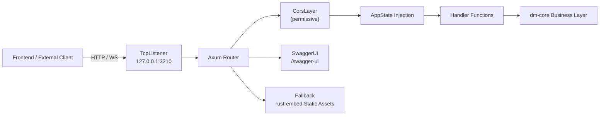
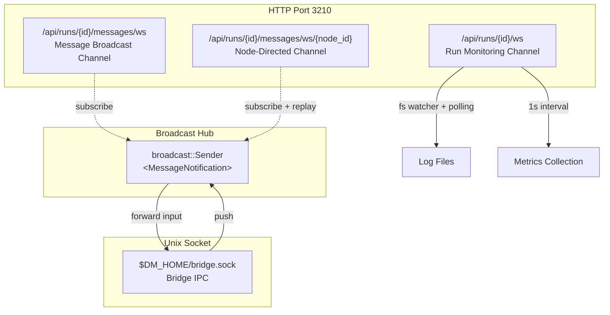

dm-server is the HTTP service layer of Dora Manager, built on the **Axum** framework, and always listens on `127.0.0.1:3210`. It exposes two types of communication interfaces to the upper-layer SvelteKit frontend: **REST API** (request-response pattern, used for resource CRUD and command execution) and **WebSocket / SSE real-time channels** (push pattern, used for log streaming, metrics collection, and interactive messaging). All REST endpoints are automatically annotated with `utoipa` to generate an OpenAPI specification, which can be browsed interactively through Swagger UI. This chapter will systematically break down all routes, request/response structures, real-time channel protocols by functional domain, and how to access the full documentation in Swagger.

Sources: [main.rs](https://github.com/l1veIn/dora-manager/blob/main/crates/dm-server/src/main.rs#L1-L270), [Cargo.toml](https://github.com/l1veIn/dora-manager/blob/main/crates/dm-server/Cargo.toml#L1-L38)

## Service Startup and Global Architecture

On startup, dm-server performs four initializations: parsing the `DM_HOME` directory and loading configuration, opening the event store (SQLite), initializing the media runtime (MediaMTX bridge), and building the Axum router table and binding the listening port. Additionally, it starts two background tasks -- an idle monitor that runs every 30 seconds (auto `dora down`) and a Unix Domain Socket listener (`$DM_HOME/bridge.sock`) for IPC communication with Bridge nodes within the dataflow.

Sources: [main.rs](https://github.com/l1veIn/dora-manager/blob/main/crates/dm-server/src/main.rs#L79-L269)

### Global State Model

All handlers share an `AppState` struct, which is automatically passed via Axum's state injection mechanism:

```rust
pub struct AppState {
    pub home: Arc<PathBuf>,                      // DM_HOME root directory
    pub events: Arc<EventStore>,                 // Observability event store
    pub messages: broadcast::Sender<MessageNotification>,  // Message broadcast channel (capacity 512)
    pub media: Arc<MediaRuntime>,                // Media backend runtime
}
```

`broadcast::Sender<MessageNotification>` is the core broadcast hub of the interaction system -- any message from REST pushes, WebSocket input, or Bridge IPC is fanned out to all subscribed WebSocket clients through this channel.

Sources: [state.rs](https://github.com/l1veIn/dora-manager/blob/main/crates/dm-server/src/state.rs#L1-L25), [main.rs](https://github.com/l1veIn/dora-manager/blob/main/crates/dm-server/src/main.rs#L90-L95)

### Route Registration Overview

The entire route table is registered in a `Router::new()` chained call, divided into seven functional domains by comments. The following Mermaid diagram shows the complete path from the network layer to the handler:



Sources: [main.rs](https://github.com/l1veIn/dora-manager/blob/main/crates/dm-server/src/main.rs#L97-L235)

## Complete REST API Route Table

Below is a complete listing of all REST endpoints categorized by functional domain, with HTTP methods, paths, request body structures, and core purposes noted.

### Environment and System Management

| Method | Path | Purpose | Key Parameters |
|--------|------|---------|----------------|
| GET | `/api/doctor` | System health diagnostic report | -- |
| GET | `/api/versions` | List of installed dora versions | -- |
| GET | `/api/status` | Runtime and active Run status | -- |
| GET | `/api/media/status` | Media backend status | -- |
| POST | `/api/media/install` | Install/configure media backend | -- |
| GET | `/api/config` | Read DM configuration | -- |
| POST | `/api/config` | Update DM configuration | `ConfigUpdate { active_version, media }` |

Sources: [system.rs](https://github.com/l1veIn/dora-manager/blob/main/crates/dm-server/src/handlers/system.rs#L1-L108)

### Runtime Lifecycle Management

| Method | Path | Purpose | Request Body |
|--------|------|---------|--------------|
| POST | `/api/install` | Install a specific dora version | `InstallRequest { version? }` |
| POST | `/api/uninstall` | Uninstall a specific dora version | `UninstallRequest { version }` |
| POST | `/api/use` | Switch the active dora version | `UseRequest { version }` |
| POST | `/api/up` | Start the dora coordinator daemon | -- |
| POST | `/api/down` | Stop the dora coordinator | -- |

Sources: [runtime.rs](https://github.com/l1veIn/dora-manager/blob/main/crates/dm-server/src/handlers/runtime.rs#L1-L85)

### Node Management

| Method | Path | Purpose | Key Parameters |
|--------|------|---------|----------------|
| GET | `/api/nodes` | List all installed nodes | -- |
| GET | `/api/nodes/{id}` | Get node status details | Path: `id` |
| POST | `/api/nodes/install` | Install node from registry | `InstallNodeRequest { id }` |
| POST | `/api/nodes/import` | Import from local path / Git URL | `ImportNodeRequest { source, id? }` |
| POST | `/api/nodes/create` | Create blank node scaffold | `CreateNodeRequest { id, description }` |
| POST | `/api/nodes/uninstall` | Uninstall node | `UninstallNodeRequest { id }` |
| POST | `/api/nodes/{id}/open` | Open in external tool | `OpenNodeRequest { target: "finder"\|"terminal"\|"vscode" }` |
| GET | `/api/nodes/{id}/readme` | Get node README | Path: `id` |
| GET | `/api/nodes/{id}/files` | Get node file tree | Path: `id` |
| GET | `/api/nodes/{id}/files/{*path}` | Read node file contents | Path: `id`, wildcard `path` |
| GET | `/api/nodes/{id}/artifacts/{*path}` | Get node binary artifacts | Path: `id`, wildcard `path` |
| GET | `/api/nodes/{id}/config` | Read node configuration | Path: `id` |
| POST | `/api/nodes/{id}/config` | Save node configuration | Path: `id`, Body: JSON Value |

Sources: [nodes.rs](https://github.com/l1veIn/dora-manager/blob/main/crates/dm-server/src/handlers/nodes.rs#L1-L289)

### Dataflow Management

| Method | Path | Purpose | Key Parameters |
|--------|------|---------|----------------|
| GET | `/api/dataflows` | List all dataflows | -- |
| GET | `/api/dataflows/{name}` | Get dataflow details | Path: `name` |
| POST | `/api/dataflows/{name}` | Save/update dataflow YAML | `SaveDataflowRequest { yaml }` |
| POST | `/api/dataflows/import` | Bulk import dataflows | `ImportDataflowsRequest { sources: Vec<String> }` |
| POST | `/api/dataflows/{name}/delete` | Delete dataflow | Path: `name` |
| GET | `/api/dataflows/{name}/inspect` | Inspect dataflow structure | Path: `name` |
| GET | `/api/dataflows/{name}/meta` | Get dataflow metadata | Path: `name` |
| POST | `/api/dataflows/{name}/meta` | Save dataflow metadata | Path: `name`, Body: `FlowMeta` |
| GET | `/api/dataflows/{name}/config-schema` | Get configuration schema | Path: `name` |
| GET | `/api/dataflows/{name}/history` | Version history list | Path: `name` |
| GET | `/api/dataflows/{name}/history/{version}` | Get specific version YAML | Path: `name`, `version` |
| POST | `/api/dataflows/{name}/history/{version}/restore` | Restore specific version | Path: `name`, `version` |
| GET | `/api/dataflows/{name}/view` | Get graph editor view data | Path: `name` |
| POST | `/api/dataflows/{name}/view` | Save graph editor view data | Path: `name`, Body: JSON Value |

Sources: [dataflow.rs](https://github.com/l1veIn/dora-manager/blob/main/crates/dm-server/src/handlers/dataflow.rs#L1-L275)

### Dataflow Execution (Legacy-Compatible Endpoints)

| Method | Path | Purpose | Request Body |
|--------|------|---------|--------------|
| POST | `/api/dataflow/start` | Start dataflow (internally forwards to `start_run`) | `RunDataflowRequest { yaml }` |
| POST | `/api/dataflow/stop` | Stop the currently active dataflow | -- |

Note that `/api/dataflow/start` and `/api/dataflow/stop` are legacy paths without the `s`. They internally forward requests to the runs domain's `start_run` and `stop_run`, maintaining backward compatibility.

Sources: [dataflow.rs](https://github.com/l1veIn/dora-manager/blob/main/crates/dm-server/src/handlers/dataflow.rs#L200-L238)

### Run Instance Management

| Method | Path | Purpose | Key Parameters |
|--------|------|---------|----------------|
| GET | `/api/runs` | Paginated query of run history | Query: `limit`, `offset`, `status`, `search` |
| POST | `/api/runs/start` | Start a new run instance | `StartRunRequest { yaml, name?, force?, view_json? }` |
| GET | `/api/runs/active` | Get the currently active run | Query: `metrics?` |
| GET | `/api/runs/{id}` | Get run details | Path: `id`, Query: `include_metrics?` |
| GET | `/api/runs/{id}/metrics` | Get CPU/memory metrics | Path: `id` |
| POST | `/api/runs/{id}/stop` | Stop a run | Path: `id` |
| POST | `/api/runs/delete` | Bulk delete run records | `DeleteRunsRequest { run_ids: Vec<String> }` |
| GET | `/api/runs/{id}/dataflow` | Get the original YAML used by the run | Path: `id` |
| GET | `/api/runs/{id}/transpiled` | Get the transpiled dataflow | Path: `id` |
| GET | `/api/runs/{id}/view` | Get the runtime view snapshot | Path: `id` |

Sources: [runs.rs](https://github.com/l1veIn/dora-manager/blob/main/crates/dm-server/src/handlers/runs.rs#L1-L461)

### Log Access (REST + SSE)

| Method | Path | Purpose | Key Parameters |
|--------|------|---------|----------------|
| GET | `/api/runs/{id}/logs/{node_id}` | One-time read of complete logs | Path: `id`, `node_id` |
| GET | `/api/runs/{id}/logs/{node_id}/tail` | Segmented log reading | Query: `offset` |
| GET | `/api/runs/{id}/logs/{node_id}/stream` | **SSE** real-time log stream | Query: `tail_lines` (50-5000, default 500) |

The SSE endpoint `/stream` returns four event types:
- **`snapshot`**: Initial tail logs sent upon connection establishment
- **`append`**: Subsequent new log lines (350ms polling interval)
- **`eof`**: Run has ended, with the final status attached
- **`error`**: Read exception occurred

Sources: [runs.rs](https://github.com/l1veIn/dora-manager/blob/main/crates/dm-server/src/handlers/runs.rs#L179-L265)

### Interaction Message System

| Method | Path | Purpose | Key Parameters |
|--------|------|---------|----------------|
| GET | `/api/runs/{id}/interaction` | Interaction summary (input controls + stream list) | Path: `id` |
| POST | `/api/runs/{id}/messages` | Push message (from Bridge or frontend) | `PushMessageRequest { from, tag, payload, timestamp? }` |
| GET | `/api/runs/{id}/messages` | Query message history | Query: `after_seq`, `before_seq`, `from`, `tag`, `limit`, `desc` |
| GET | `/api/runs/{id}/messages/snapshots` | Get the latest snapshots for each node | Path: `id` |
| GET | `/api/runs/{id}/streams` | List all stream descriptors | Path: `id` |
| GET | `/api/runs/{id}/streams/{stream_id}` | Get single stream details | Path: `id`, `stream_id` |
| GET | `/api/runs/{id}/artifacts/{*path}` | Get run output artifact files | Path: `id`, wildcard `path` |

The `tag` field determines the routing semantics of the message: `"input"` represents user input (frontend -> node), `"stream"` represents media stream declarations, and other tags are used for custom inter-node communication.

Sources: [messages.rs](https://github.com/l1veIn/dora-manager/blob/main/crates/dm-server/src/handlers/messages.rs#L1-L558), [message.rs](https://github.com/l1veIn/dora-manager/blob/main/crates/dm-server/src/services/message.rs#L1-L120)

### Events and Observability

| Method | Path | Purpose | Key Parameters |
|--------|------|---------|----------------|
| GET | `/api/events` | Query events by conditions | Query: `EventFilter` |
| POST | `/api/events` | Write an event | Body: `Event` |
| GET | `/api/events/count` | Count events | Query: `EventFilter` |
| GET | `/api/events/export` | Export in XES format | Query: `EventFilter`, `format` |

Sources: [events.rs](https://github.com/l1veIn/dora-manager/blob/main/crates/dm-server/src/handlers/events.rs#L1-L52)

## WebSocket Real-Time Channels

dm-server provides three WebSocket endpoints and one Unix Domain Socket IPC channel, covering runtime monitoring, interactive messaging, and Bridge node communication.



Sources: [main.rs](https://github.com/l1veIn/dora-manager/blob/main/crates/dm-server/src/main.rs#L214-L223), [run_ws.rs](https://github.com/l1veIn/dora-manager/blob/main/crates/dm-server/src/handlers/run_ws.rs#L1-L237), [messages.rs](https://github.com/l1veIn/dora-manager/blob/main/crates/dm-server/src/handlers/messages.rs#L223-L360)

### Run Monitoring WebSocket -- `/api/runs/{id}/ws`

This is the core real-time channel for the frontend run workbench. After the connection is established, the server uses the `notify` crate's filesystem watcher plus a 1-second polling interval to continuously push five types of message frames:

| Frame Type (`type`) | Fields | Trigger Condition |
|---------------------|--------|-------------------|
| **`ping`** | -- | Heartbeat every 10 seconds |
| **`metrics`** | `data: Vec<NodeMetrics>` | Collected every second (while running) |
| **`logs`** | `nodeId`, `lines: Vec<String>` | Log file changes (incremental append) |
| **`io`** | `nodeId`, `lines: Vec<String>` | Log lines containing the `[DM-IO]` marker |
| **`status`** | `status: String` | Run status change (e.g., `"Running"` -> `"Finished"`) |

This channel automatically re-watches the new directory when the log directory switches (e.g., from the live path to the archive path), ensuring the log stream is not interrupted.

Sources: [run_ws.rs](https://github.com/l1veIn/dora-manager/blob/main/crates/dm-server/src/handlers/run_ws.rs#L16-L149)

### Message Broadcast WebSocket -- `/api/runs/{id}/messages/ws`

This is a lightweight **full broadcast channel**. Upon connection, the client subscribes to `broadcast::Sender<MessageNotification>` and only receives notifications matching the current `run_id`. Each notification contains `run_id`, `seq` (sequence number), `from` (source node), and `tag`. After receiving a notification, the client can call REST `GET /api/runs/{id}/messages` to retrieve the full message body.

Sources: [messages.rs](https://github.com/l1veIn/dora-manager/blob/main/crates/dm-server/src/handlers/messages.rs#L223-L270)

### Node-Directed WebSocket -- `/api/runs/{id}/messages/ws/{node_id}?since=N`

This is a **replay + real-time** channel targeted at a specific node, primarily used by Bridge nodes to receive user input from the frontend. Upon connection establishment:

1. **Historical replay**: Queries all messages after sequence number `since` where `target_to == node_id`, sending them one by one
2. **Real-time subscription**: Subscribes to the broadcast channel, filters new messages where `run_id` matches and `from == "web"` and `tag == "input"`, and forwards them to the node

This "replay first, then subscribe" design ensures that Bridge nodes can recover missed input after a brief disconnection.

Sources: [messages.rs](https://github.com/l1veIn/dora-manager/blob/main/crates/dm-server/src/handlers/messages.rs#L272-L360)

### Bridge Unix Domain Socket -- `$DM_HOME/bridge.sock`

A non-HTTP IPC channel created by dm-server at startup. Bridge nodes within the dataflow (injected by the transpiler) communicate with the server through this socket. The protocol is **newline-delimited JSON**, consisting of two message types:

| Action | Direction | Format |
|--------|-----------|--------|
| **`init`** | Bridge -> Server | `{"action":"init","run_id":"..."}` |
| **`push`** | Bridge -> Server | `{"action":"push","from":"...","tag":"...","payload":{...},"timestamp":...}` |
| **`input`** | Server -> Bridge | `{"action":"input","to":"...","value":...}` |

After connecting, the Bridge first sends `init` to declare the `run_id`, followed by bidirectional communication: the Bridge pushes `display`/`stream` messages from the node, and the server forwards user `input` messages to the Bridge.

Sources: [bridge_socket.rs](https://github.com/l1veIn/dora-manager/blob/main/crates/dm-server/src/handlers/bridge_socket.rs#L1-L174)

## Swagger Documentation and OpenAPI Specification

dm-server integrates `utoipa` + `utoipa-swagger-ui`. All registered REST endpoints are automatically included in the OpenAPI specification via `#[utoipa::path(...)]` macro annotations.

### Access Methods

- **Swagger UI interactive interface**: `http://127.0.0.1:3210/swagger-ui/`
- **OpenAPI JSON specification**: `http://127.0.0.1:3210/api-docs/openapi.json`

In Swagger UI, you can directly test each endpoint -- enter path parameters, request bodies, execute, and view responses. All structs annotated with `ToSchema` (such as `StartRunRequest`, `PushMessageRequest`, `StreamDescriptor`, etc.) also automatically generate Schema definitions.

Sources: [main.rs](https://github.com/l1veIn/dora-manager/blob/main/crates/dm-server/src/main.rs#L24-L77), [main.rs](https://github.com/l1veIn/dora-manager/blob/main/crates/dm-server/src/main.rs#L233)

### Registered OpenAPI Path List

The current `ApiDoc` `openapi` macro registers the following paths (28 endpoints in total):

| Domain | Endpoint Count | Examples |
|--------|---------------|----------|
| System | 7 | `/api/doctor`, `/api/status`, `/api/config` |
| Runtime | 5 | `/api/install`, `/api/up`, `/api/down` |
| Nodes | 8 | `/api/nodes`, `/api/nodes/{id}/config` |
| Dataflows | 6 | `/api/dataflows`, `/api/dataflows/{name}` |
| Runs | 7 | `/api/runs`, `/api/runs/start`, `/api/runs/{id}/metrics` |
| Interaction | 7 | `/api/runs/{id}/messages`, `/api/runs/{id}/streams` |

Note: Some routes (such as `/api/dataflows/{name}/view`, `/api/runs/{id}/logs`, etc.) are registered but have not yet been added to the `openapi` macro. They are fully functional at runtime but will not appear in the Swagger documentation.

Sources: [main.rs](https://github.com/l1veIn/dora-manager/blob/main/crates/dm-server/src/main.rs#L25-L76)

## Frontend API Communication Layer

The frontend uniformly wraps four HTTP method functions through `web/src/lib/api.ts`:

```typescript
export async function get<T>(path: string): Promise<T>      // GET + JSON parsing
export async function getText(path: string): Promise<string> // GET + raw text
export async function post<T>(path: string, body?: unknown): Promise<T>  // POST + JSON
export async function del<T>(path: string): Promise<T>       // DELETE + JSON
```

All functions use `/api` as the base path prefix (`API_BASE = '/api'`). In `rust-embed` embedded mode, the frontend build artifacts are served directly by dm-server, so there are no cross-origin issues (but the server still configures `CorsLayer::permissive()` to support dev mode proxying).

For error handling, non-2xx responses are uniformly parsed as `ApiError`, which attempts to extract the `error`, `message`, or `detail` fields from the response body, ensuring consistency of error information between the frontend and backend.

Sources: [api.ts](https://github.com/l1veIn/dora-manager/blob/main/web/src/lib/api.ts#L1-L109)

## Error Handling Pattern

All handlers follow a unified error handling pattern: business logic returns `anyhow::Result`, and the handler layer maps errors to HTTP status codes through pattern matching:

| Scenario | HTTP Status Code | Example |
|----------|-----------------|---------|
| Resource not found | `404 Not Found` | Node/dataflow/Run ID does not exist |
| Invalid request parameters | `400 Bad Request` | Invalid JSON, missing required fields |
| Conflict | `409 Conflict` | An active run already exists |
| Internal error | `500 Internal Server Error` | File I/O failure, database exception |
| Partial batch success | `207 Multi-Status` | Some failures during bulk deletion |

Sources: [mod.rs](https://github.com/l1veIn/dora-manager/blob/main/crates/dm-server/src/handlers/mod.rs#L43-L45), [runs.rs](https://github.com/l1veIn/dora-manager/blob/main/crates/dm-server/src/handlers/runs.rs#L430-L460)

## Route Design Principles Summary

The API design of dm-server reflects the following architectural decisions:

1. **Functional domain prefix separation**: `/api/nodes/*`, `/api/dataflows/*`, `/api/runs/*`, `/api/events/*` -- four major domains are clearly isolated, avoiding naming conflicts
2. **Symmetric read/write routing**: The same path uses GET/POST to distinguish reads from writes (e.g., `/api/nodes/{id}/config`)
3. **Progressive real-time strategy**: Short requests use REST, continuous data uses WebSocket, and log streams use SSE -- each protocol serves its own purpose
4. **Run-scoped isolation**: All interaction message and stream endpoints are nested under `/api/runs/{id}/`, ensuring isolation between multiple run instances
5. **Swagger-first documentation**: Compile-time macro annotations maintain strong consistency between documentation and code

---

**Next reading**: To understand how the server manages persistent configuration, see [Configuration System: DM_HOME Directory Structure and config.toml](16-pei-zhi-ti-xi-dm_home-mu-lu-jie-gou-yu-config-toml); to understand how the frontend consumes these APIs to build the UI, see [SvelteKit Project Structure: Route Design, API Communication Layer, and State Management](17-sveltekit-xiang-mu-jie-gou-lu-you-she-ji-api-tong-xin-ceng-yu-zhuang-tai-guan-li); to understand the complete flow of interaction messages in Bridge nodes, see [Interaction System Architecture: dm-input / dm-message / Bridge Node Injection Principles](22-jiao-hu-xi-tong-jia-gou-dm-input-dm-message-bridge-jie-dian-zhu-ru-yuan-li).
