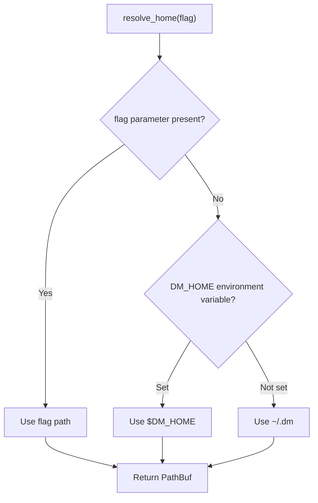
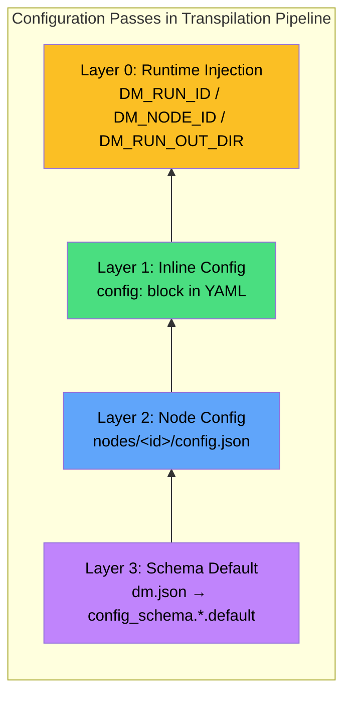
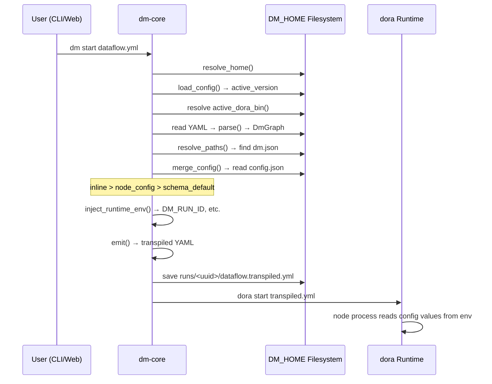

All persistent state in Dora Manager -- from the dora binary version, node installations, dataflow projects, run instances, to event logs -- converges in a single root directory **DM_HOME**. This design philosophy distills the scattered problem of "installation as configuration" into clear single-point management: one directory, one configuration file, one set of pure-function path resolution. This document systematically dissects DM_HOME's resolution mechanism, directory structure, config.toml configuration model, and the four-layer configuration merge strategy that runs through the entire dataflow transpilation pipeline.

Sources: [config.rs](https://github.com/l1veIn/dora-manager/blob/main/crates/dm-core/src/config.rs#L1-L167)

## DM_HOME Resolution: Three-Level Priority Chain

`resolve_home()` is the entry function for the entire configuration system. All CLI subcommands and the dm-server startup flow obtain the DM_HOME path through it, then pass this path as a `&Path` parameter to the path resolution functions of each subsystem. The resolution logic of this function strictly follows the following three-level priority:

| Priority | Source | Use Case |
|---|---|---|
| 1 (Highest) | `--home` CLI flag | CI/CD pipelines, automated test isolation |
| 2 | `DM_HOME` environment variable | Development environment persistent override, multi-instance parallelism |
| 3 (Default) | `~/.dm` (resolved via `dirs::home_dir()`) | Zero-config ready to use, out-of-the-box |



On the CLI side, the `clap` parser declares `--home` as a global flag via `#[arg(long, global = true)]`, making it available in all subcommands. The `main()` entry function calls `dm_core::config::resolve_home(cli.home)` to resolve the path, then passes the result as `&Path` layer by layer to each subcommand handler function. dm-server calls `resolve_home(None)` at startup, skipping the CLI flag layer and falling through to the environment variable or default path -- this means the server does not respond to the `--home` flag by default, but can be controlled via the `DM_HOME` environment variable.

Sources: [config.rs](https://github.com/l1veIn/dora-manager/blob/main/crates/dm-core/src/config.rs#L105-L118), [main.rs (CLI)](https://github.com/l1veIn/dora-manager/blob/main/crates/dm-cli/src/main.rs#L19-L30), [main.rs (Server)](https://github.com/l1veIn/dora-manager/blob/main/crates/dm-server/src/main.rs#L79-L81)

## DM_HOME Directory Structure Overview

DM_HOME does not create the complete directory tree at installation time; instead, each subsystem **lazily creates directories on demand**. Below is a typical directory structure after a complete usage cycle:

```
~/.dm/                              <- DM_HOME root directory
├── config.toml                     <- Global configuration (DmConfig)
├── versions/                       <- Installed dora runtimes
│   └── 0.4.1/
│       └── dora                    <- Executable binary (Windows: dora.exe)
├── dataflows/                      <- Imported dataflow projects
│   └── system-test-full/
│       ├── dataflow.yml            <- YAML topology definition
│       ├── flow.json               <- Project metadata (FlowMeta)
│       ├── view.json               <- Visual editor layout
│       ├── config.json             <- Dataflow-level configuration overrides
│       └── .history/               <- Version snapshot history
│           └── 20250101T120000Z.yml
├── nodes/                          <- Installed managed nodes
│   └── dm-microphone/
│       ├── dm.json                 <- Node metadata and configuration schema
│       ├── config.json             <- Node-level configuration overrides
│       ├── pyproject.toml          <- Python build definition
│       └── dm_microphone/          <- Source/build artifacts
├── runs/                           <- Run instance history
│   └── <uuid>/
│       ├── run.json                <- Run metadata (RunInstance)
│       ├── dataflow.yml            <- Runtime dataflow snapshot
│       ├── dataflow.transpiled.yml <- Transpiled dora YAML
│       ├── view.json               <- Editor layout snapshot
│       ├── logs/                   <- Node logs (e.g., microphone.log)
│       └── out/                    <- Node output artifacts
└── events.db                       <- SQLite event storage (WAL mode)
```

Each subsystem's path resolution is implemented as a **pure function** -- accepting `home: &Path` parameter rather than global mutable state. This design ensures testability (temporary directories can be used in tests) and isolation (multiple DM_HOME instances do not interfere with each other). Below is the complete mapping of key path functions:

| Subsystem | Path Function | Target Path | Responsibility |
|---|---|---|---|
| Global Config | `config_path()` | `home/config.toml` | DmConfig persistence |
| Version Management | `versions_dir()` | `home/versions` | dora binary storage |
| Node Management | `nodes_dir()` | `home/nodes` | Managed node directory |
| Dataflows | `dataflows_dir()` | `home/dataflows` | Project YAML + metadata |
| Run Instances | `runs_dir()` | `home/runs` | Run history and logs |
| Event Store | `EventStore::open()` | `home/events.db` | SQLite observability |

Sources: [paths.rs (dataflow)](https://github.com/l1veIn/dora-manager/blob/main/crates/dm-core/src/dataflow/paths.rs#L1-L36), [paths.rs (node)](https://github.com/l1veIn/dora-manager/blob/main/crates/dm-core/src/node/paths.rs#L1-L27), [repo.rs (runs)](https://github.com/l1veIn/dora-manager/blob/main/crates/dm-core/src/runs/repo.rs#L1-L46), [store.rs (events)](https://github.com/l1veIn/dora-manager/blob/main/crates/dm-core/src/events/store.rs#L14-L44)

### dataflows/ Subdirectory Details

Each imported dataflow project has its own subdirectory under `dataflows/`, containing multiple auxiliary files. The `initialize_flow_project()` function is responsible for creating the `.history/` directory and the initial `flow.json` metadata. Each time the YAML is saved, if the content has changed, the old version is automatically snapshotted into `.history/` with an ISO timestamp filename format (e.g., `20250101T120000Z.yml`), supporting full version rollback and recovery.

| File | Data Model | Created When |
|---|---|---|
| `dataflow.yml` | Raw YAML text | Import or first save |
| `flow.json` | `FlowMeta` (id, name, description, tags, author, etc.) | `initialize_flow_project()` |
| `view.json` | Visual editor node layout | After user operates in the frontend editor |
| `config.json` | Dataflow-level configuration override values | When user sets node-specific parameters for the dataflow |
| `.history/*.yml` | Historical version snapshots | Each time YAML content changes |

Sources: [repo.rs (dataflow)](https://github.com/l1veIn/dora-manager/blob/main/crates/dm-core/src/dataflow/repo.rs#L256-L325), [paths.rs (dataflow)](https://github.com/l1veIn/dora-manager/blob/main/crates/dm-core/src/dataflow/paths.rs#L1-L36)

### runs/ Subdirectory Details

The run instance directory contains the complete lifecycle record of a single dataflow execution. `create_layout()` creates the directory structure when starting a run, ensuring the `out/` output directory exists. Node logs have two storage locations: new runs use `out/<dora_uuid>/log_<node_id>.txt` (written directly by the dora runtime), while legacy runs use `logs/<node_id>.log`.

| File | Data Model | Written When |
|---|---|---|
| `run.json` | `RunInstance` (status, metrics, timestamps, etc.) | Run start/status change |
| `dataflow.yml` | Raw YAML snapshot | Run start |
| `dataflow.transpiled.yml` | Transpiled dora YAML | Transpilation pipeline output |
| `view.json` | Editor layout snapshot | Run start |
| `out/` | Node output artifacts | Written by nodes at runtime |
| `logs/` | Node logs (legacy) | Written by log collection at runtime |

Sources: [repo.rs (runs)](https://github.com/l1veIn/dora-manager/blob/main/crates/dm-core/src/runs/repo.rs#L9-L46), [model.rs (runs)](https://github.com/l1veIn/dora-manager/blob/main/crates/dm-core/src/runs/model.rs#L127-L184)

## config.toml: Global Configuration Model

`config.toml` is the **sole global configuration file** in the DM_HOME root directory, serializing the `DmConfig` struct in TOML format. Its design follows the **progressive configuration** principle: when the file does not exist, `load_config()` returns `DmConfig::default()`, all fields provide reasonable default values, and users can use the system normally without manually creating it.

### DmConfig Complete Field Reference

```toml
# Currently active dora version identifier (e.g., "0.4.1")
# None = no version installed yet, dm setup will auto-install
active_version = "0.4.1"

[media]
# Whether to enable the media backend (streaming support)
enabled = false
# Backend type, currently only supports "media_mtx"
backend = "media_mtx"

[media.mediamtx]
# mediamtx binary path (None = auto-download to DM_HOME)
path = "/usr/local/bin/mediamtx"
# Specify version (None = latest)
version = "1.11.3"
# Whether to auto-download mediamtx (on first use)
auto_download = true
# API port (mediamtx management interface)
api_port = 9997
# RTSP port (streaming push/pull)
rtsp_port = 8554
# HLS port (HTTP live stream)
hls_port = 8888
# WebRTC port (low-latency browser stream)
webrtc_port = 8889
# Listen address (typically 127.0.0.1)
host = "127.0.0.1"
# Public network access address (deployment scenarios, overrides host)
public_host = "192.168.1.100"
# Full public WebRTC URL (overrides host:port combination)
public_webrtc_url = "http://192.168.1.100:8889"
# Full public HLS URL
public_hls_url = "http://192.168.1.100:8888"
```

| Field | Type | Default | Purpose |
|---|---|---|---|
| `active_version` | `Option<String>` | `None` | Marks the currently used dora version, corresponding to a directory name under `versions/` |
| `media.enabled` | `bool` | `false` | Whether to enable the streaming media backend |
| `media.backend` | `MediaBackend` | `MediaMtx` | Backend type (currently only supports MediaMTX) |
| `media.mediamtx.path` | `Option<String>` | `None` | Manually specify mediamtx path; None means auto-download |
| `media.mediamtx.auto_download` | `bool` | `true` | Whether to auto-download mediamtx on first use |
| `media.mediamtx.api_port` | `u16` | `9997` | mediamtx management API port |
| `media.mediamtx.rtsp_port` | `u16` | `8554` | RTSP streaming port |
| `media.mediamtx.hls_port` | `u16` | `8888` | HLS live stream port |
| `media.mediamtx.webrtc_port` | `u16` | `8889` | WebRTC low-latency stream port |
| `media.mediamtx.host` | `String` | `"127.0.0.1"` | mediamtx listen address |
| `media.mediamtx.public_host` | `Option<String>` | `None` | External access address for public network deployment |
| `media.mediamtx.public_webrtc_url` | `Option<String>` | `None` | Full public WebRTC URL |
| `media.mediamtx.public_hls_url` | `Option<String>` | `None` | Full public HLS URL |

Sources: [config.rs](https://github.com/l1veIn/dora-manager/blob/main/crates/dm-core/src/config.rs#L6-L103)

### Configuration Loading and Persistence

`load_config()` and `save_config()` form a complete closed loop for configuration I/O. On load, if the file does not exist, a default instance is returned (without creating the file); on save, `toml::to_string_pretty()` generates human-readable TOML format, while `create_dir_all()` ensures the DM_HOME root directory exists. This means the first call to `save_config()` will automatically create the `~/.dm/` directory.

dm-server exposes runtime configuration management through two endpoints: `GET /api/config` and `POST /api/config`. The `POST` endpoint performs **read-merge-writeback (read-modify-write)** semantics: it first loads the existing configuration, only overwrites the fields provided in the request body (`active_version` and/or `media`), and finally serializes back to disk. This avoids full overwriting during concurrent writes.

Sources: [config.rs](https://github.com/l1veIn/dora-manager/blob/main/crates/dm-core/src/config.rs#L147-L166), [system.rs (handlers)](https://github.com/l1veIn/dora-manager/blob/main/crates/dm-server/src/handlers/system.rs#L58-L107)

### Runtime Role of MediaConfig

`MediaConfig` is loaded at dm-server startup and injected into `MediaRuntime`. When `media.enabled = true`, the server initializes the mediamtx process as a streaming media backend, using the port numbers from the configuration to generate the mediamtx configuration file. The `public_host`, `public_webrtc_url`, and `public_hls_url` fields are dedicated to **non-local deployment scenarios** -- when dm-server runs on a remote server, the frontend needs to access the streaming media through these public addresses rather than `127.0.0.1`.

Sources: [media.rs](https://github.com/l1veIn/dora-manager/blob/main/crates/dm-server/src/services/media.rs#L1-L50), [main.rs (Server)](https://github.com/l1veIn/dora-manager/blob/main/crates/dm-server/src/main.rs#L79-L95)

## Four-Layer Configuration Merge Pipeline

Dora Manager's configuration system is not a flat key-value store, but a **four-layer merge pipeline from schema definition to runtime injection**. This pipeline executes during the dataflow transpilation process, ensuring each managed node's environment variables are composed from multiple configuration sources by priority. The transpilation pipeline contains a total of 7 passes, of which the configuration-related passes are Pass 3 (`merge_config`) and Pass 4 (`inject_runtime_env`).



### Merge Logic Details

The `merge_config` pass iterates over each managed node (`DmNode::Managed`) in the dataflow, reading the node's `dm.json` metadata from `__dm_meta_path` (pre-stored by the `resolve_paths` pass). For each field declared in `config_schema`, it takes the first non-`null` value according to the following priority:

| Priority | Layer | Source File | Scope | Example |
|---|---|---|---|---|
| 1 (Highest) | Inline Config | YAML `config:` block | Single dataflow instance | `config: { sample_rate: 16000 }` |
| 2 | Node Config | `nodes/<id>/config.json` | All usages of this node | `{"sample_rate": 48000}` |
| 3 | Schema Default | `dm.json` → `config_schema` | Default value at node definition time | `"default": 44100` |
| 4 (Runtime) | Runtime Injection | Auto-generated by transpiler | All managed nodes | `DM_RUN_ID`, `DM_NODE_ID` |

The merged values are written to the `merged_env` map as **environment variables**, where the `env` key in the field schema specifies the target environment variable name. The final `emit` pass outputs `merged_env` to the dora YAML's `env:` block.

Sources: [passes.rs](https://github.com/l1veIn/dora-manager/blob/main/crates/dm-core/src/dataflow/transpile/passes.rs#L348-L421), [mod.rs (transpile)](https://github.com/l1veIn/dora-manager/blob/main/crates/dm-core/src/dataflow/transpile/mod.rs#L1-L84)

### config.json: Node-Level Configuration Persistence

The `config.json` under each managed node's directory is a **node-level configuration override** saved by the user via the frontend or API. Its values sit between schema defaults and inline config -- the same node can use different inline values in different dataflows, but `config.json` provides a unified cross-dataflow baseline for that node.

```json
// nodes/dm-microphone/config.json
{
  "sample_rate": 48000,
  "channels": 1
}
```

`get_node_config()` automatically handles the case where the file does not exist (returning an empty object `{}`), while `save_node_config()` writes formatted JSON via `serde_json::to_string_pretty()`. The frontend interacts through the `GET/POST /api/nodes/{id}/config` endpoints.

Sources: [local.rs (node)](https://github.com/l1veIn/dora-manager/blob/main/crates/dm-core/src/node/local.rs#L173-L232)

### Configuration Aggregation API: inspect_config

The `inspect_config()` function implements **configuration aggregation query**, scanning three configuration layers (inline, node config, schema default) for each managed node in a dataflow and returning a `DataflowConfigAggregation` struct. Each configuration field includes `inline_value`, `node_value`, `default_value`, `effective_value`, and `effective_source`, allowing the frontend to display provenance information indicating "where the current value comes from."

| effective_source | Meaning |
|---|---|
| `"inline"` | From the YAML `config:` block |
| `"node"` | From the `config.json` persisted configuration |
| `"default"` | From the `dm.json` schema default |
| `"unset"` | No value provided by any of the three layers |

This API is exposed through the `GET /api/dataflows/{name}/config-schema` endpoint. The frontend uses it to render parameter configuration panels for each node and annotate the source layer of each parameter value.

Sources: [service.rs (dataflow)](https://github.com/l1veIn/dora-manager/blob/main/crates/dm-core/src/dataflow/service.rs#L101-L215), [model.rs (dataflow)](https://github.com/l1veIn/dora-manager/blob/main/crates/dm-core/src/dataflow/model.rs#L140-L171), [dataflow.rs (handlers)](https://github.com/l1veIn/dora-manager/blob/main/crates/dm-server/src/handlers/dataflow.rs#L145-L154)

## Node Search Path: DM_NODE_DIRS

Node path resolution is not limited to `DM_HOME/nodes/` but builds an **ordered search chain** via `configured_node_dirs()`. `resolve_node_dir()` traverses the search chain and returns the first directory containing the target node ID. `push_unique()` ensures no wasted searches due to duplicate paths.

| Priority | Search Path | Source |
|---|---|---|
| 1 | `DM_HOME/nodes/` | User-installed/imported nodes |
| 2 | `builtin_nodes_dir()` (project repo `nodes/` directory) | Compile-time built-in nodes |
| 3 | Additional paths from the `DM_NODE_DIRS` environment variable | Developer-defined external node repositories |

```bash
# Example: mount external node repositories
export DM_NODE_DIRS="/opt/dora-nodes:/home/user/my-nodes"
```

This mechanism allows developers to mount external node repositories via environment variables without modifying DM_HOME, which is ideal for CI/CD environments and node development debugging.

Sources: [paths.rs (node)](https://github.com/l1veIn/dora-manager/blob/main/crates/dm-core/src/node/paths.rs#L1-L52)

## Runtime Environment Variable Injection

The transpilation pipeline's `inject_runtime_env` pass injects three **runtime environment variables** into each managed node. These variables are not declared in any configuration file but are dynamically generated by the transpiler based on the runtime context, with priority higher than all user configuration layers:

| Environment Variable | Source | Purpose |
|---|---|---|
| `DM_RUN_ID` | UUID v4 auto-generated | Unique run instance identifier |
| `DM_NODE_ID` | `id` field in YAML | Node identifier within the dataflow |
| `DM_RUN_OUT_DIR` | `DM_HOME/runs/<run_id>/out` | Node output artifacts directory |

These variables enable nodes to be aware of their own context at runtime -- for example, the `dm-save` node knows where to write files via `DM_RUN_OUT_DIR`, and the `dm-input` node interacts with the frontend via `DM_SERVER_URL` (injected by the Bridge).

Sources: [passes.rs](https://github.com/l1veIn/dora-manager/blob/main/crates/dm-core/src/dataflow/transpile/passes.rs#L427-L450)

## Event Store: events.db

`EventStore` maintains a SQLite database `events.db` in the DM_HOME root directory, with **WAL (Write-Ahead Logging)** mode enabled to support concurrent reads and writes. It records all operation events (node installation, dataflow transpilation, run start/stop, etc.), providing structured query capabilities for observability. The database is automatically created on `EventStore::open()`, containing an `events` table and four indexes (case_id, source, timestamp, activity), supporting efficient time-range and source-filtered queries.

Sources: [store.rs (events)](https://github.com/l1veIn/dora-manager/blob/main/crates/dm-core/src/events/store.rs#L14-L44)

## Configuration API Endpoints

dm-server exposes two endpoints for runtime configuration management:

| Method | Path | Behavior |
|---|---|---|
| `GET` | `/api/config` | Read current `config.toml`, return JSON |
| `POST` | `/api/config` | Merge update (`active_version` and/or `media`), write back to `config.toml` |

`POST /api/config` accepts a `ConfigUpdate` request body and performs **read-merge-writeback** semantics: it first loads the existing configuration, then only overwrites the fields provided in the request, and finally serializes back to disk. The `media` field is first validated through `serde_json::from_value::<MediaConfig>()` deserialization; invalid values will return a 400 error.

Sources: [system.rs (handlers)](https://github.com/l1veIn/dora-manager/blob/main/crates/dm-server/src/handlers/system.rs#L58-L107)

## Complete Configuration Flow: From User Action to Node Process

The following sequence diagram shows the complete data flow from the user initiating `dm start` to the node process reading configuration values:



Sources: [transpile/mod.rs](https://github.com/l1veIn/dora-manager/blob/main/crates/dm-core/src/dataflow/transpile/mod.rs#L33-L84), [config.rs](https://github.com/l1veIn/dora-manager/blob/main/crates/dm-core/src/config.rs#L147-L166), [dora.rs](https://github.com/l1veIn/dora-manager/blob/main/crates/dm-core/src/dora.rs#L20-L35)

## Design Principles Summary

| Principle | Implementation |
|---|---|
| **Single root directory** | All state converges in DM_HOME; backup/migration requires copying only one directory |
| **Progressive configuration** | Default values are used when `config.toml` does not exist; no manual creation needed |
| **Pure function paths** | All path functions accept `&Path` rather than global state, ensuring testability |
| **On-demand creation** | Subdirectories are created by each subsystem on first use, avoiding empty directory trees |
| **Four-layer merge** | Clear priority chain from schema default to runtime injection |
| **Environment variable passing** | Final configuration is passed to dora as `env:`, independent of node implementation language |

Sources: [config.rs](https://github.com/l1veIn/dora-manager/blob/main/crates/dm-core/src/config.rs#L1-L167), [tests_config.rs](https://github.com/l1veIn/dora-manager/blob/main/crates/dm-core/src/tests/tests_config.rs#L1-L148)

## Further Reading

- **Transpilation pipeline details of the four-layer configuration merge**: See [Dataflow Transpiler: Multi-Pass Pipeline and Four-Layer Configuration Merge](11-shu-ju-liu-zhuan-yi-qi-transpiler-duo-pass-guan-xian-yu-si-ceng-pei-zhi-he-bing)
- **Complete field definitions for node dm.json**: See [Custom Node Development Guide: dm.json Complete Field Reference](9-zi-ding-yi-jie-dian-kai-fa-zhi-nan-dm-json-wan-zheng-zi-duan-can-kao)
- **Run instance lifecycle and state management**: See [Run Instance (Run): Lifecycle State Machine and Metric Tracking](6-yun-xing-shi-li-run-sheng-ming-zhou-qi-zhuang-tai-ji-yu-zhi-biao-zhui-zong)
- **Event store query and export**: See [Event System: Observability Model and XES-Compatible Event Store](14-shi-jian-xi-tong-ke-guan-ce-xing-mo-xing-yu-xes-jian-rong-shi-jian-cun-chu)
- **Node management system path resolution and sandbox isolation**: See [Node Management System: Installation, Import, Path Resolution, and Sandbox Isolation](12-jie-dian-guan-li-xi-tong-an-zhuang-dao-ru-lu-jing-jie-xi-yu-sha-xiang-ge-chi)
