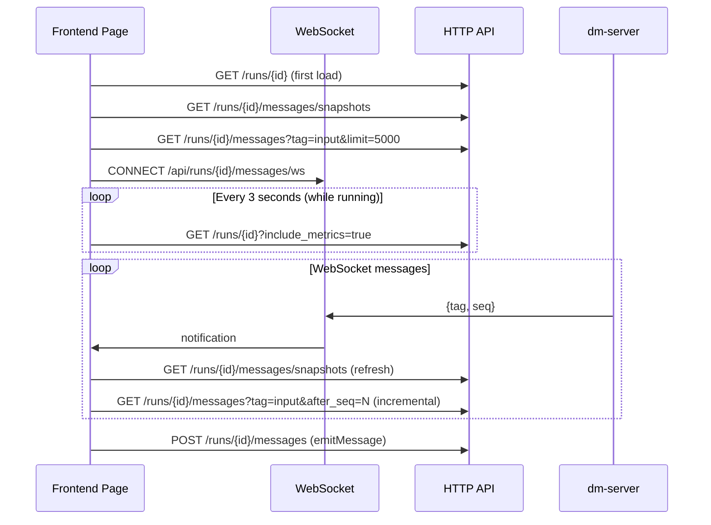

The Run Workspace is the core runtime interface of Dora Manager's frontend, responsible for integrating all observability information of a dataflow run instance (Run) — node logs, message flows, input controls, charts, video streams — into a freely layoutable panel system. This article provides an in-depth analysis across four dimensions: **page skeleton**, **GridStack grid engine**, **panel registry and rendering pipeline**, and **real-time communication model**.

Sources: [+page.svelte](https://github.com/l1veIn/dora-manager/blob/master/web/src/routes/runs/[id]/+page.svelte#L1-L510)

## Page Skeleton: Three-Zone Structure

The run workspace's page layout adopts the classic "Header + Sidebar + Main Content" three-zone structure, orchestrated by [`+page.svelte`](https://github.com/l1veIn/dora-manager/blob/master/web/src/routes/runs/[id]/+page.svelte):

```
┌──────────────────────────────────────────────────────────┐
│  RunHeader (h-14)                                        │
│  [← Runs / name] [Status] [Stop] [YAML] [Transpiled] [Graph] │
├────────────┬─────────────────────────────────────────────┤
│  Sidebar   │  Workspace Toolbar (h-10)                   │
│  (300px)   │  [Toggle] [Workspace]         [+ Add Panel] │
│            ├─────────────────────────────────────────────┤
│ RunSummary │  GridStack 12-Column Workspace              │
│ Card       │  ┌──────────────┬──────────┐               │
│            │  │ MessagePanel │ Input    │               │
│ Node List  │  │ (w:8 h:5)    │ (w:4 h:5)│               │
│ (scrollable)│  └──────────────┴──────────┘               │
│            │  ┌──────────────────────────┐               │
│            │  │ TerminalPanel (w:12 h:4) │               │
│            │  └──────────────────────────┘               │
└────────────┴─────────────────────────────────────────────┘
```

**Top bar RunHeader** provides run metadata (name, status badge), Stop control button, and three read-only view entries — YAML source, transpiled YAML, and runtime topology graph. The latter two are displayed through Dialog modal popups, with data lazily loaded on demand.

**Left sidebar** (controlled by `isRunSidebarOpen` for collapse) consists of [`RunSummaryCard`](https://github.com/l1veIn/dora-manager/blob/master/web/src/routes/runs/[id]/RunSummaryCard.svelte) and [`RunNodeList`](https://github.com/l1veIn/dora-manager/blob/master/web/src/routes/runs/[id]/RunNodeList.svelte). SummaryCard displays metadata such as Run ID, start time, duration, exit code, active node count, and CPU/memory global metric badges. NodeList presents all nodes in a scrollable list, each item with CPU and memory badges (from metrics when running) or log file size (when stopped). Clicking a node triggers `openNodeTerminal()` to automatically locate or inject a terminal panel in the Workspace.

**Right main area** contains a toolbar and GridStack grid container. The toolbar's left side has a sidebar collapse button, and the right side has an "Add Panel" dropdown menu supporting dynamic addition of five panel types.

Sources: [+page.svelte](https://github.com/l1veIn/dora-manager/blob/master/web/src/routes/runs/[id]/+page.svelte#L395-L510), [RunHeader.svelte](https://github.com/l1veIn/dora-manager/blob/master/web/src/routes/runs/[id]/RunHeader.svelte#L107-L188), [RunSummaryCard.svelte](https://github.com/l1veIn/dora-manager/blob/master/web/src/routes/runs/[id]/RunSummaryCard.svelte#L26-L198), [RunNodeList.svelte](https://github.com/l1veIn/dora-manager/blob/master/web/src/routes/runs/[id]/RunNodeList.svelte#L29-L110)

## GridStack Grid Engine: 12-Column Free Layout

The Workspace component ([`Workspace.svelte`](https://github.com/l1veIn/dora-manager/blob/master/web/src/lib/components/workspace/Workspace.svelte)) uses **GridStack.js** as the grid layout engine, configured as a responsive grid with 12 columns, 80px cell height, and 10px margin:

```typescript
GridStack.init({
    column: 12,
    cellHeight: 80,
    margin: 10,
    float: true,       // Allow vertical gaps
    animate: true,
    handle: '.grid-drag-handle',  // Only title bar draggable
    resizable: { handles: 's, e, se' },  // Resizable in three directions
});
```

### Svelte-GridStack Bridge: `gridWidget` Action

The core challenge is that GridStack needs to directly manipulate DOM element positions and sizes, while Svelte manages DOM lifecycle reactively through `{#each}`. The two are bridged through a **Svelte Action** `gridWidget`:

1. **Creation Phase**: When Svelte `{#each}` renders each `gridItems` entry, `use:gridWidget` writes `gs-id`/`gs-x`/`gs-y`/`gs-w`/`gs-h` attributes to the DOM node, then brings it under GridStack's physical engine control via `gridServer.makeWidget(node)`.
2. **Drag/Resize Changes**: In the GridStack `change` event callback, iterate changed items to sync back to the `gridItems` state array, then propagate upward via `onLayoutChange`.
3. **Destruction Phase**: When Svelte removes a DOM node, the Action's `destroy()` callback is triggered, calling `gridServer.removeWidget(node, false)` (`false` means don't destroy DOM, let Svelte handle it).

### Layout Persistence

Layout is persisted to `localStorage` via `handleLayoutChange()`, with key name `dm-workspace-layout-{run.name}`. On first page load, layout is restored from `localStorage` and passes through `normalizeWorkspaceLayout()` for schema migration — converting old fields like `subscribedSourceId` to the unified `nodes`/`tags` array format.

Sources: [Workspace.svelte](https://github.com/l1veIn/dora-manager/blob/master/web/src/lib/components/workspace/Workspace.svelte#L1-L175), [types.ts](https://github.com/l1veIn/dora-manager/blob/master/web/src/lib/components/workspace/types.ts#L49-L146)

## Panel Registry and Rendering Pipeline

The panel system adopts a **registry pattern**, with each panel type defined by a `PanelDefinition`:

| Field | Type | Description |
|-------|------|-------------|
| `kind` | `PanelKind` | Panel type identifier: `message` / `input` / `chart` / `table` / `video` / `terminal` |
| `title` | `string` | Panel title bar display name |
| `dotClass` | `string` | Title bar status dot CSS class (color identifier) |
| `sourceMode` | `"history" \| "snapshot" \| "external"` | Data fetching mode |
| `supportedTags` | `string[] \| "*"` | Message tags the panel cares about |
| `defaultConfig` | `PanelConfig` | Default config when creating new panels |
| `component` | `any` | Panel rendering component (Svelte component reference) |

The registry is maintained as `Record<PanelKind, PanelDefinition>` in [`registry.ts`](https://github.com/l1veIn/dora-manager/blob/master/web/src/lib/components/workspace/panels/registry.ts), queried via `getPanelDefinition(kind)`, falling back to `message` panel when not found.

### Six Panel Types at a Glance

| Panel | sourceMode | Default Tags | Core Function |
|-------|-----------|-------------|---------------|
| **Message** | `history` | `["*"]` | Node message stream, bidirectional infinite scroll, node/tag filtering |
| **Input** | `snapshot` | `["widgets"]` | Responsive control grid, 10 control types, real-time sending |
| **Chart** | `snapshot` | `["chart"]` | Line/bar charts, layerchart rendering, multi-series |
| **Table** | `snapshot` | `["table"]` | Reuses MessagePanel component |
| **Video** | `snapshot` | `["stream"]` | Plyr + HLS.js media playback, manual/message dual mode |
| **Terminal** | `external` | `[]` | Node log viewer, tail polling, download export |

### Rendering Pipeline

The Workspace's `{#each}` loop executes the following rendering pipeline for each `gridItems` entry:

```
gridItems[i] → getPanelDefinition(item.widgetType)
                    ↓
            PanelComponent (Svelte component)
                    ↗
RootWidgetWrapper (title bar + maximize + close)
```

[`RootWidgetWrapper`](https://github.com/l1veIn/dora-manager/blob/master/web/src/lib/components/workspace/widgets/RootWidgetWrapper.svelte) provides a unified shell for all panels — a 32px title bar with `.grid-drag-handle` class (panel name + colored dot + maximize/close buttons). Double-clicking the title bar or clicking the maximize button toggles full-screen overlay mode (`fixed inset-0 z-50`), exiting via Escape key.

Panel components receive unified `PanelRendererProps` (containing `item`/`api`/`context`/`onConfigChange`), where `PanelContext` is the core context for panel-runtime interaction:

```typescript
type PanelContext = {
    runId: string;
    snapshots: any[];                          // Message snapshot list
    inputValues: Record<string, any>;          // Input control current values
    nodes: any[];                              // Run node list
    refreshToken: number;                      // Data refresh token
    isRunActive: boolean;                      // Whether run is active
    emitMessage: (message: {...}) => Promise<void>;  // Send message to dataflow
};
```

Sources: [registry.ts](https://github.com/l1veIn/dora-manager/blob/master/web/src/lib/components/workspace/panels/registry.ts#L1-L80), [types.ts](https://github.com/l1veIn/dora-manager/blob/master/web/src/lib/components/workspace/panels/types.ts#L1-L41), [RootWidgetWrapper.svelte](https://github.com/l1veIn/dora-manager/blob/master/web/src/lib/components/workspace/widgets/RootWidgetWrapper.svelte#L1-L45)

## Five Panel Implementations in Detail

### Message Panel: Bidirectional Infinite Scroll Message Stream

The Message panel ([`MessagePanel.svelte`](https://github.com/l1veIn/dora-manager/blob/master/web/src/lib/components/workspace/panels/message/MessagePanel.svelte)) is one of the most complex panels. It uses `createMessageHistoryState()` to create a message state manager based on Svelte 5 `$state`, supporting three loading modes:

- **`loadInitial()`**: First load of latest 50 messages (`desc: true`), fetched in reverse then sorted forward
- **`loadNew()`**: Incremental fetch of new messages based on `newestSeq` (`after_seq`), for real-time push
- **`loadOld()`**: Upward pagination to load older history based on `oldestSeq` (`before_seq` + `desc: true`), maintaining scroll position

Message entries are rendered through [`MessageItem.svelte`](https://github.com/l1veIn/dora-manager/blob/master/web/src/lib/components/workspace/panels/message/MessageItem.svelte), automatically selecting rendering method based on `tag` field: `text` (monospace text), `image` (viewerjs full-screen preview), `video` (native player), `audio` (audio controls), `json` (JSON tree display), `markdown` (marked rendering), unknown tags fall back to default JSON view.

### Input Panel: Responsive Control Grid

The Input panel ([`InputPanel.svelte`](https://github.com/l1veIn/dora-manager/blob/master/web/src/lib/components/workspace/panels/input/InputPanel.svelte)) filters `snapshots` for `tag === "widgets"` snapshots, expanding each snapshot's `payload.widgets` into a control grid. Supports 10 control types:

| Control Type | Component | Interaction Method |
|-------------|-----------|-------------------|
| `input` | ControlInput | Text input, instant send |
| `textarea` | ControlTextarea | Multi-line text |
| `button` | ControlButton | Click trigger |
| `select` | ControlSelect | Dropdown selection |
| `slider` | ControlSlider | Slider adjustment |
| `switch` | ControlSwitch | Toggle switch |
| `radio` | ControlRadio | Radio button group |
| `checkbox` | ControlCheckbox | Multi-select checkbox |
| `path`/`file_picker`/`directory` | ControlPath | Path selector |
| `file` | Native `<input type="file">` | File upload (Base64 encoding) |

Control values are sent to the backend via `context.emitMessage()` in `{from: "web", tag: "input", payload: {to, output_id, value}}` format, then forwarded by dm-server to the corresponding node. The Input panel maintains a priority chain between `draftValues` local state and `context.inputValues` server state: `draftValues > inputValues > widget.default`.

### Chart Panel: Data Visualization

The Chart panel ([`ChartPanel.svelte`](https://github.com/l1veIn/dora-manager/blob/master/web/src/lib/components/workspace/panels/chart/ChartPanel.svelte)) uses the `layerchart` library to render line and bar charts. Data format requires snapshot `payload` to contain `labels` (X-axis label array) and `series` (data series array, each with `name`/`data`/`color`). Internally, two transform functions `dataset()` and `seriesDefs()` map payload to layerchart's required data structures.

### Video Panel: Dual-Mode Media Playback

The Video panel ([`VideoPanel.svelte`](https://github.com/l1veIn/dora-manager/blob/master/web/src/lib/components/workspace/panels/video/VideoPanel.svelte)) wraps [`PlyrPlayer`](https://github.com/l1veIn/dora-manager/blob/master/web/src/lib/components/workspace/panels/video/PlyrPlayer.svelte) (Plyr + HLS.js), providing two working modes:

- **Manual mode**: User directly inputs media URL, selects source type (HLS/Video/Audio/Auto)
- **Message mode**: Automatically extracts available sources from `tag === "stream"` snapshots, supporting multiple payload formats (`sources` array, `url`/`src` field, `hls_url` field, `viewer.hls_url` field, `path` legacy format), and automatically infers source type

PlyrPlayer internally handles HLS.js initialization, media type switching, error handling, and resource cleanup.

### Terminal Panel: Node Log Terminal

The Terminal panel ([`TerminalPanel.svelte`](https://github.com/l1veIn/dora-manager/blob/master/web/src/lib/components/workspace/panels/terminal/TerminalPanel.svelte)) is a panel wrapper for [`RunLogViewer`](https://github.com/l1veIn/dora-manager/blob/master/web/src/routes/runs/[id]/RunLogViewer.svelte). The log viewer supports full load (`fetchFullLog`) and incremental tail (`tailLog`, polling every 2 seconds), implementing incremental reads via the `offset` parameter. Log content is HTML-escaped, with `[DM-IO]` marked lines highlighted (`text-sky-500`).

Sources: [MessagePanel.svelte](https://github.com/l1veIn/dora-manager/blob/master/web/src/lib/components/workspace/panels/message/MessagePanel.svelte#L1-L212), [InputPanel.svelte](https://github.com/l1veIn/dora-manager/blob/master/web/src/lib/components/workspace/panels/input/InputPanel.svelte#L1-L249), [ChartPanel.svelte](https://github.com/l1veIn/dora-manager/blob/master/web/src/lib/components/workspace/panels/chart/ChartPanel.svelte#L1-L199), [VideoPanel.svelte](https://github.com/l1veIn/dora-manager/blob/master/web/src/lib/components/workspace/panels/video/VideoPanel.svelte#L1-L350), [TerminalPanel.svelte](https://github.com/l1veIn/dora-manager/blob/master/web/src/lib/components/workspace/panels/terminal/TerminalPanel.svelte#L1-L23), [RunLogViewer.svelte](https://github.com/l1veIn/dora-manager/blob/master/web/src/routes/runs/[id]/RunLogViewer.svelte#L1-L275), [message-state.svelte.ts](https://github.com/l1veIn/dora-manager/blob/master/web/src/lib/components/workspace/panels/message/message-state.svelte.ts#L1-L145)

## Real-Time Communication Model

The run workspace's real-time capabilities are achieved through three-layer mechanism collaboration:



### WebSocket Real-Time Notifications

The WebSocket connection (`/api/runs/{id}/messages/ws`) only pushes lightweight notifications (containing `tag` and `seq`). The frontend actively pulls full data after receiving notifications. This **"notify + pull"** pattern avoids the overhead of transmitting large payloads via WebSocket while maintaining data consistency. After WebSocket disconnection, it automatically reconnects after 1 second delay.

### Polling

Main polling (`mainPolling`) refreshes run details and metrics data every 3 seconds, only executing when `isRunActive` is `true`. After the run ends, metrics are cleared and polling stops.

### Incremental Data Fetching

`fetchNewInputValues()` only fetches new input values after the last `latestInputSeq` via the `after_seq` parameter, avoiding duplicate transmission. `fetchSnapshots()` fully refreshes the snapshot list (deduplicated via `snapshotRefreshInFlight` Promise to prevent concurrent requests). `messageRefreshToken` is a monotonically incrementing counter that increments after each data change, driving panel component `$effect` reactive updates.

Sources: [+page.svelte](https://github.com/l1veIn/dora-manager/blob/master/web/src/routes/runs/[id]/+page.svelte#L218-L393)

## Layout Management and Dynamic Panel Operations

### Dynamic Panel Addition

`addWidget()` is triggered via the "Add Panel" dropdown menu, calculating the maximum `y + h` value in the current layout and appending a new panel at the bottom of the grid (default w:6, h:4). The new panel's `config` is cloned from the registry's `defaultConfig`, ensuring the panel initializes with sensible defaults.

### Node Terminal Auto-Injection

`openNodeTerminal()` is the key interaction connecting the sidebar NodeList to the Workspace. When a user clicks a node in the sidebar, this function executes the following logic:

1. Find a terminal panel already bound to that `nodeId` → directly locate
2. Find any free terminal panel → reuse and reset `nodeId`
3. No terminal panel → call `mutateTreeInjectTerminal()` to inject a new full-width terminal panel at the bottom

After locating, it scrolls smoothly to the target panel via `scrollIntoView({ behavior: "smooth" })` and adds a 1.5-second `ring-2 ring-primary/80` highlight animation to guide user attention.

### Layout Schema Migration

`normalizeWorkspaceLayout()` is responsible for upgrading old layout schemas to the current version. Typical migrations include: renaming `stream` panel type to `message`; converting `subscribedSourceId` to `nodes` array; converting `subscribedInputs` to `nodes` array with default `tags: ["widgets"]`.

Sources: [+page.svelte](https://github.com/l1veIn/dora-manager/blob/master/web/src/routes/runs/[id]/+page.svelte#L58-L168), [types.ts](https://github.com/l1veIn/dora-manager/blob/master/web/src/lib/components/workspace/types.ts#L61-L146)

## Data Model Summary

### WorkspaceGridItem

Each grid panel is described by `WorkspaceGridItem`:

| Field | Type | Description |
|-------|------|-------------|
| `id` | `string` | Randomly generated unique identifier (7-char base36) |
| `widgetType` | `PanelKind` | Panel type enum |
| `config` | `PanelConfig` | Panel-specific config (nodes/tags/gridCols, etc.) |
| `x` / `y` | `number` | GridStack grid coordinates |
| `w` / `h` | `number` | GridStack grid dimensions |
| `min` | `{w, h}?` | Minimum size constraint (optional) |

### Default Layout

`getDefaultLayout()` creates a dual-panel default layout — left Message panel (8 columns × 5 rows) and right Input panel (4 columns × 5 rows), used on first visit with no localStorage cache.

Sources: [types.ts](https://github.com/l1veIn/dora-manager/blob/master/web/src/lib/components/workspace/types.ts#L1-L58)

## Relationships with Other Pages

The run workspace is the most complex page in Dora Manager's frontend architecture, integrating capabilities from multiple subsystems:

- Dataflow YAML topology definition and editing, see [Visual Graph Editor: SvelteFlow Canvas and YAML Synchronization](15-graph-editor)
- Complete control type definitions and rendering for Input controls in panels, see [Reactive Widgets: Control Registry and Dynamic Rendering](17-reactive-widgets)
- Backend message API and WebSocket endpoint implementation details, see [HTTP API Route Overview and Swagger Documentation](12-http-api)
- How dm-input / dm-display interaction nodes produce and consume panel data, see [Interaction System: dm-input / dm-display / WebSocket Message Flow](21-interaction-system)
- Run lifecycle and state model foundation, see [Run Instance: Lifecycle, State, and Metrics Tracking](06-run-lifecycle)
