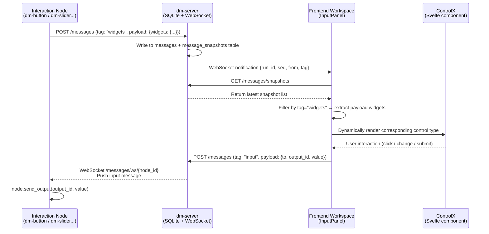
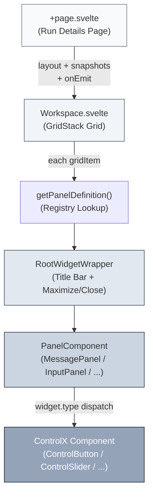

Dora Manager's Widget system is a **declarative, data-driven UI control protocol** — backend nodes register their control definitions (buttons, sliders, input boxes, etc.) as JSON snapshots to dm-server at startup. The frontend run workspace's InputPanel dynamically renders corresponding Svelte components based on these snapshots. After user interaction, the generated input values are sent back to nodes via HTTP/WebSocket. The entire process forms a complete closed loop: "node declaration → server relay → frontend rendering → user interaction → node reception." This article provides analysis across five dimensions: architecture overview, Widget protocol, panel registry, control type matrix, and real-time communication pipeline.

Sources: [registry.ts](https://github.com/l1veIn/dora-manager/blob/master/web/src/lib/components/workspace/panels/registry.ts#L1-L80), [InputPanel.svelte](https://github.com/l1veIn/dora-manager/blob/master/web/src/lib/components/workspace/panels/input/InputPanel.svelte#L1-L249)

## Architecture Overview: Widget's Declaration-Rendering-Feedback Loop

The Widget system's core design follows the principle of **"nodes don't touch UI, UI doesn't touch Arrow."** Nodes only need to know how to construct a JSON description, and the frontend only needs to know how to map that description to Svelte components. The two are decoupled through dm-server's messaging system.



The above diagram shows the complete data flow closed loop. Nodes push Widget declarations to dm-server's `message_snapshots` table via HTTP POST — this table uses `(node_id, tag)` as a composite primary key, meaning the same node's same tag only retains the latest snapshot (UPSERT semantics). After receiving change notifications via WebSocket, the frontend pulls the latest snapshot list. `InputPanel` parses the `payload.widgets` dictionary and dispatches to corresponding `ControlX` components by the `type` field.

Sources: [messages.rs (push)](https://github.com/l1veIn/dora-manager/blob/master/crates/dm-server/src/services/message.rs#L138-L161), [messages.rs (snapshots)](https://github.com/l1veIn/dora-manager/blob/master/crates/dm-server/src/services/message.rs#L226-L243), [+page.svelte (fetchSnapshots)](https://github.com/l1veIn/dora-manager/blob/master/web/src/routes/runs/[id]/+page.svelte#L218-L235)

## Widget Protocol: JSON Declaration Format

Each interaction node sends a message with `tag: "widgets"` to dm-server at startup, with the following `payload` structure:

```json
{
  "label": "Temperature Control",
  "widgets": {
    "temperature": {
      "type": "slider",
      "label": "Temperature",
      "min": 0,
      "max": 100,
      "step": 1,
      "default": 50
    },
    "mode": {
      "type": "select",
      "label": "Mode",
      "options": ["auto", "manual", "scheduled"]
    }
  }
}
```

**`payload.label`** is the node's overall display name (corresponding to the InputPanel card title), and **`payload.widgets`** is a dictionary with output_id as key and control definition as value. Each control definition must contain a `type` field, with other fields varying by type. Key semantics:

| Field | Meaning | Applicable Types |
|-------|---------|-----------------|
| `type` | Control type identifier | All |
| `label` | Control display label | All |
| `default` | Initial default value | input, textarea, slider, switch |
| `placeholder` | Placeholder text | input, textarea |
| `min` / `max` / `step` | Numeric range and step | slider |
| `options` | Option list (strings or `{value, label}` objects) | select, radio, checkbox |
| `value` | Button send value | button |
| `variant` | Button visual variant (default/outline/ghost) | button |
| `switchLabel` | Description text next to switch | switch |

When users operate controls, the frontend sends a message with `tag: "input"` to dm-server, with `payload` structure `{to: nodeId, output_id: outputId, value: ...}`. The backend pushes this message to the target node via WebSocket, and the node calls `node.send_output()` to inject the value into the dora dataflow.

Sources: [dm-button main.py](https://github.com/l1veIn/dora-manager/blob/master/nodes/dm-button/dm_button/main.py#L102-L112), [dm-slider main.py](https://github.com/l1veIn/dora-manager/blob/master/nodes/dm-slider/dm_slider/main.py#L96-L108), [InputPanel.svelte (emitMessage)](https://github.com/l1veIn/dora-manager/blob/master/web/src/lib/components/workspace/panels/input/InputPanel.svelte#L87-L104)

## Panel Registry: Type System and Component Mapping

The panel registry is the core routing layer of the Widget system, defined in [registry.ts](https://github.com/l1veIn/dora-manager/blob/master/web/src/lib/components/workspace/panels/registry.ts). It maps each panel type (`PanelKind`) to a complete `PanelDefinition`, including title, visual identifier, data source mode, tag filtering rules, and Svelte component reference.

```typescript
export type PanelKind = "message" | "input" | "chart" | "table" | "video" | "terminal";
```

The current system registers six panel types, each with its responsibilities and data consumption patterns:

| PanelKind | Title | Data Source Mode | Consumed Tags | Purpose |
|-----------|-------|-----------------|---------------|---------|
| `message` | Message | `history` (historical message flow) | `*` (all tags) | Message timeline, displaying all node communications |
| `input` | Input | `snapshot` (latest snapshot) | `widgets` | Widget control panel, dynamically rendering user input interfaces |
| `chart` | Chart | `snapshot` (latest snapshot) | `chart` | Data visualization charts (LineChart / BarChart) |
| `table` | Table | `snapshot` (latest snapshot) | `table` | Table data display |
| `video` | Plyr | `snapshot` (latest snapshot) | `stream` | Video stream player (HLS / WebRTC) |
| `terminal` | Terminal | `external` (external data source) | — | Node log terminal |

**`sourceMode`** determines how panels fetch data:

- **`history`**: Continuously pulls message history via `createMessageHistoryState`, supporting pagination (forward/backward loading), suitable for scenarios requiring complete message flow display (like MessagePanel)
- **`snapshot`**: Filters `context.snapshots` array via `createSnapshotViewState`, showing only the latest snapshots matching current filter conditions, suitable for "latest state first" scenarios like Widget controls and charts
- **`external`**: Panel self-manages data fetching logic (e.g., TerminalPanel obtains logs via independent WebSocket connection)

Each `PanelDefinition` also includes `defaultConfig`, used as the initial configuration value when creating new panel instances. For example, InputPanel's default config is `{nodes: ["*"], tags: ["widgets"], gridCols: 2}`, meaning it listens for all nodes' widgets tags and displays in a two-column grid layout.

Sources: [registry.ts](https://github.com/l1veIn/dora-manager/blob/master/web/src/lib/components/workspace/panels/registry.ts#L9-L79), [types.ts (PanelKind)](https://github.com/l1veIn/dora-manager/blob/master/web/src/lib/components/workspace/types.ts#L8), [types.ts (PanelDefinition)](https://github.com/l1veIn/dora-manager/blob/master/web/src/lib/components/workspace/panels/types.ts#L30-L40)

## Dynamic Rendering Mechanism: Workspace → RootWidgetWrapper → PanelComponent

The run workspace's rendering chain is divided into three layers, progressively delegating from outside to inside:



**First Layer: Workspace.svelte** is the GridStack grid container. It receives top-level properties like `layout` (`WorkspaceGridItem[]`), `snapshots`, `inputValues`, `onEmit`, assembling them into `PanelContext` passed to all panels. Each `gridItem` binds to GridStack via Svelte Action `gridWidget`, enabling drag and resize. During rendering, it first looks up the registry via `getPanelDefinition(dataItem.widgetType)`, then dynamically instantiates `definition.component`.

**Second Layer: RootWidgetWrapper.svelte** is the universal shell for all panels, providing a title bar (with colored dot identifier `definition.dotClass`), drag handle, maximize/restore button, and close button. It delegates the content area to the next layer through `{@render children()}`.

**Third Layer: Specific PanelComponent** (e.g., InputPanel) receives `PanelRendererProps`, including `item` (current panel config), `context` (runtime context), and `onConfigChange` callback. InputPanel is the core consumer of the Widget system — it filters `context.snapshots` for `tag === "widgets"` snapshots, extracts the `payload.widgets` dictionary, then dispatches to corresponding `ControlX` components by each widget's `type` field.

Sources: [Workspace.svelte](https://github.com/l1veIn/dora-manager/blob/master/web/src/lib/components/workspace/Workspace.svelte#L131-L161), [RootWidgetWrapper.svelte](https://github.com/l1veIn/dora-manager/blob/master/web/src/lib/components/workspace/widgets/RootWidgetWrapper.svelte#L1-L45), [+page.svelte (Workspace instantiation)](https://github.com/l1veIn/dora-manager/blob/master/web/src/routes/runs/[id]/+page.svelte#L494-L504)

## Control Type Matrix: Nine Built-In Widgets

InputPanel supports nine control types (eleven including aliases) through `{#if widget.type === "..."}` chain-conditional dispatch. Each type corresponds to an independent Svelte component, following a unified Props interface pattern.

| Control Type | Component | Key Props | Value Type | Trigger Method |
|-------------|-----------|-----------|------------|---------------|
| `button` | ControlButton | `variant`, `value` | `string` | Click |
| `input` | ControlInput | `placeholder` | `string` | Enter or click send button |
| `textarea` | ControlTextarea | `placeholder` | `string` | Cmd/Ctrl+Enter or click send |
| `slider` | ControlSlider | `min`, `max`, `step` | `number` | Drag release |
| `select` | ControlSelect | `options` | `string` | Immediate send after selection |
| `switch` | ControlSwitch | `switchLabel` | `boolean` | Immediate send after toggle |
| `radio` | ControlRadio | `options` | `string` | Click send after selection |
| `checkbox` | ControlCheckbox | `options` | `string[]` | Click send after checking |
| `path` / `file_picker` / `directory` | ControlPath | `mode` (file/directory) | `string` | Send after confirmation |
| `file` | Native `<input type="file">` | — | `string` (Base64) | Send after file selection |

From an interaction mode perspective, these controls fall into two categories:

**Instant send type** (slider, select, switch): Immediately calls `handleEmit()` after user operation, no additional confirmation step. Suitable for scenarios needing quick feedback like parameter adjustment.

**Confirmation send type** (input, textarea, radio, checkbox, path): User first modifies draft values (`draftValues`), explicitly submitting via Enter key, send button, or confirm button. Suitable for scenarios requiring careful editing before submission. ControlInput and ControlTextarea show a loading animation indicator next to the send button (spinning border when `sendingId === key`).

Sources: [InputPanel.svelte (widget dispatch)](https://github.com/l1veIn/dora-manager/blob/master/web/src/lib/components/workspace/panels/input/InputPanel.svelte#L219-L241), [ControlButton.svelte](https://github.com/l1veIn/dora-manager/blob/master/web/src/lib/components/workspace/panels/input/controls/ControlButton.svelte#L1-L27), [ControlSlider.svelte](https://github.com/l1veIn/dora-manager/blob/master/web/src/lib/components/workspace/panels/input/controls/ControlSlider.svelte#L1-L32), [ControlSwitch.svelte](https://github.com/l1veIn/dora-manager/blob/master/web/src/lib/components/workspace/panels/input/controls/ControlSwitch.svelte#L1-L27)

## Real-Time Communication Pipeline: WebSocket Dual-Channel Architecture

The Widget system's real-time capability relies on dm-server's two WebSocket channels, each serving different roles:

**Channel One: Frontend broadcast channel** (`/api/runs/{id}/messages/ws`). The frontend connects to this channel to receive notifications for all new messages. When `push_message` API is called, dm-server sends `MessageNotification` (containing `run_id, seq, from, tag`) to all subscribers via `tokio::sync::broadcast`. The frontend determines subsequent actions based on `tag`: if `input` type, it incrementally pulls latest input values (`fetchNewInputValues`); for other types, it refreshes the snapshot list (`fetchSnapshots`).

**Channel Two: Node feedback channel** (`/api/runs/{id}/messages/ws/{node_id}?since=N`). Interaction nodes connect to this channel to receive `input` messages destined for themselves. When the connection is established, dm-server first replays historical messages after `since` sequence (ensuring no data loss on reconnection), then continuously monitors the broadcast channel, filtering for messages with `from === "web" && tag === "input"` targeting the node, and pushes them.

Backend message storage uses SQLite's **dual-table design**: `messages` table stores complete history (INSERT ONLY), `message_snapshots` table stores the latest state for each `(node_id, tag)` combination (UPSERT). Widget declarations are stored in `message_snapshots` because the frontend only needs the "currently valid" control definitions, not historical change sequences. Input values are different — the frontend pulls all historical inputs via `GET /messages?tag=input&limit=5000`, building an `inputValues` mapping in key-value format (`${nodeId}:${outputId}` → `value`) to restore the last state of controls.

Sources: [messages.rs (messages_ws)](https://github.com/l1veIn/dora-manager/blob/master/crates/dm-server/src/handlers/messages.rs#L223-L270), [messages.rs (node_ws)](https://github.com/l1veIn/dora-manager/blob/master/crates/dm-server/src/handlers/messages.rs#L272-L360), [state.rs (MessageNotification)](https://github.com/l1veIn/dora-manager/blob/master/crates/dm-server/src/state.rs#L14-L24), [+page.svelte (emitMessage)](https://github.com/l1veIn/dora-manager/blob/master/web/src/routes/runs/[id]/+page.svelte#L284-L296)

## Value Resolution Strategy: Three-Level Fallback Chain and Draft Mechanism

Control value resolution in InputPanel follows a strict priority chain, implemented in the `initialValue()` function:

```typescript
function initialValue(binding, outputId, widget) {
    const key = widgetKey(binding.node_id, outputId);  // "nodeId:outputId"
    if (draftValues[key] !== undefined) return draftValues[key];      // 1. Draft value
    if (context.inputValues[key] !== undefined) return context.inputValues[key];  // 2. Historical input
    if (widget?.default !== undefined) return widget.default;         // 3. Declaration default
    if (widget?.type === "checkbox") return [];                       // 4. Type zero value
    if (widget?.type === "switch") return false;
    if (widget?.type === "slider") return widget?.min ?? 0;
    return "";
}
```

**First priority** is `draftValues` — unsubmitted edits in the current user session. These values are immediately written to `draftValues[key]` when users modify controls, ensuring user edits are not lost even if the component re-renders due to Svelte reactivity. **Second priority** is `context.inputValues` — historical input values pulled from the backend, used to restore the last run's control state. **Third priority** is `widget.default` — default values specified in the node declaration. The final fallback returns sensible zero values by control type (empty string, empty array, false, 0).

When users submit values through confirmation-send controls, `handleEmit()` first writes the value to `draftValues`, then calls `context.emitMessage()` to POST to the backend, and clears `sendingId` upon completion. This design ensures the UI immediately reflects user operations even during network latency.

Sources: [InputPanel.svelte (initialValue)](https://github.com/l1veIn/dora-manager/blob/master/web/src/lib/components/workspace/panels/input/InputPanel.svelte#L76-L85), [InputPanel.svelte (handleEmit)](https://github.com/l1veIn/dora-manager/blob/master/web/src/lib/components/workspace/panels/input/InputPanel.svelte#L87-L104)

## Layout Persistence and Panel Lifecycle

The Workspace layout information (`WorkspaceGridItem[]`) is persisted via `localStorage` by dataflow name, with key name `dm-workspace-layout-${run.name}`. Every layout change (drag, resize, add/remove panel) triggers `handleLayoutChange()`, serializing and storing the current layout.

**`WorkspaceGridItem`** structure includes position information (`x`, `y`, `w`, `h`) and panel configuration (`widgetType`, `config`):

```typescript
type WorkspaceGridItem = {
    id: string;              // Unique ID
    widgetType: PanelKind;   // Panel type
    config: PanelConfig;     // Filter conditions + type-specific config
    x: number; y: number;    // GridStack grid coordinates
    w: number; h: number;    // Width/height (in grid units)
    min?: { w: number; h: number };  // Minimum size
};
```

On first load, `normalizeWorkspaceLayout()` handles backward compatibility — converting old layout formats (deprecated fields like `subscribedSourceId`, `subscribedInputs`) to new formats and filling in missing default configurations. The default layout (`getDefaultLayout()`) generates a 12-column grid: left 8-unit-wide Message panel + right 4-unit-wide Input panel.

Users can dynamically add panels through the run page's "Add Panel" dropdown menu. `addWidget()` calculates the maximum Y coordinate in the current layout and places the new panel at the bottom. `mutateTreeInjectTerminal()` is a special helper function that automatically injects or reuses a Terminal panel focused on the node when users click a node from the node list.

Sources: [types.ts (WorkspaceGridItem)](https://github.com/l1veIn/dora-manager/blob/master/web/src/lib/components/workspace/types.ts#L49-L58), [types.ts (getDefaultLayout)](https://github.com/l1veIn/dora-manager/blob/master/web/src/lib/components/workspace/types.ts#L61-L76), [types.ts (normalizeWorkspaceLayout)](https://github.com/l1veIn/dora-manager/blob/master/web/src/lib/components/workspace/types.ts#L108-L146), [+page.svelte (addWidget)](https://github.com/l1veIn/dora-manager/blob/master/web/src/routes/runs/[id]/+page.svelte#L77-L95)

## Checklist for Adding New Control Types

To add a new Widget type, modifications are needed at three levels:

**1. Frontend: Create ControlX Component** — Create a new Svelte file under `web/src/lib/components/workspace/panels/input/controls/`, define a `Props` interface (at minimum containing `outputId`, `disabled`, `onSend` or `onValueChange`), and implement the corresponding UI interaction.

**2. Frontend: Register Dispatch Branch** — Add a new matching branch in InputPanel.svelte's `{#if widget.type === "..."}` chain, instantiate the new component and pass required props. Also add a sensible zero-value fallback for the new type in the `initialValue()` function.

**3. Backend: Node-Side Declaration** — In the interaction node's `main.py`, construct a widgets dictionary containing the new `type` field, and register to dm-server via the `emit()` function. Nodes need not understand how the frontend renders, only ensuring `output_id` matches the output port ID in the dora dataflow.

Notably, **no changes to dm-server code are needed**. The server completely passes through `payload.widgets` content — it only handles storage and forwarding, without type validation. This "dumb pipe" design is the key to the Widget system's extensibility.

Sources: [InputPanel.svelte (widget dispatch)](https://github.com/l1veIn/dora-manager/blob/master/web/src/lib/components/workspace/panels/input/InputPanel.svelte#L219-L241), [messages.rs (push passthrough)](https://github.com/l1veIn/dora-manager/blob/master/crates/dm-server/src/handlers/messages.rs#L69-L97)

## Further Reading

- [Run Workspace: Grid Layout, Panel System, and Real-Time Interaction](16-runtime-workspace) — Workspace's GridStack layout engine and panel management system details
- [Interaction System: dm-input / dm-display / WebSocket Message Flow](21-interaction-system) — Interaction node family's architecture positioning and message flow protocol
- [Built-In Node Overview: From Media Capture to AI Inference](19-builtin-nodes) — Complete field reference for dm-button, dm-slider, dm-text-input, and other interaction nodes
- [HTTP API Route Overview and Swagger Documentation](12-http-api) — Request/response formats for `/messages`, `/snapshots`, and other endpoints
