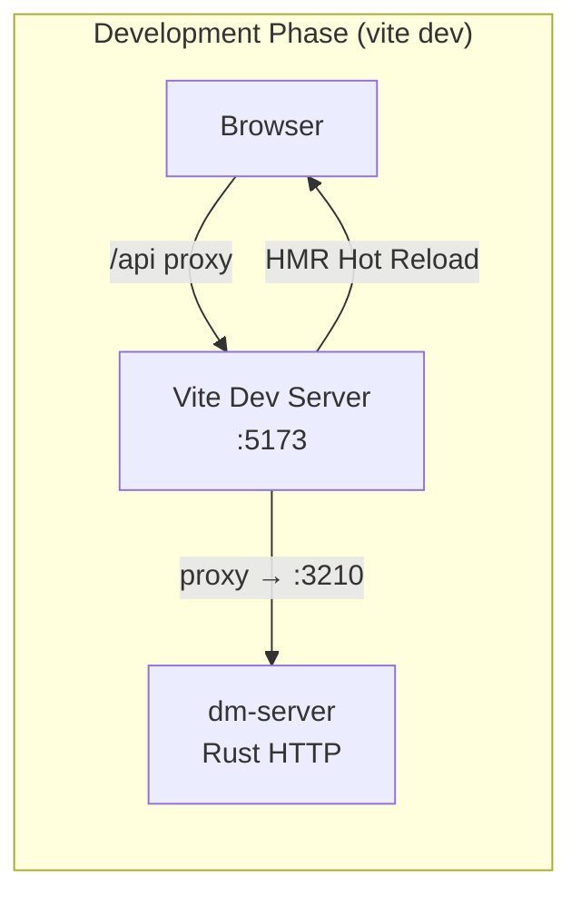
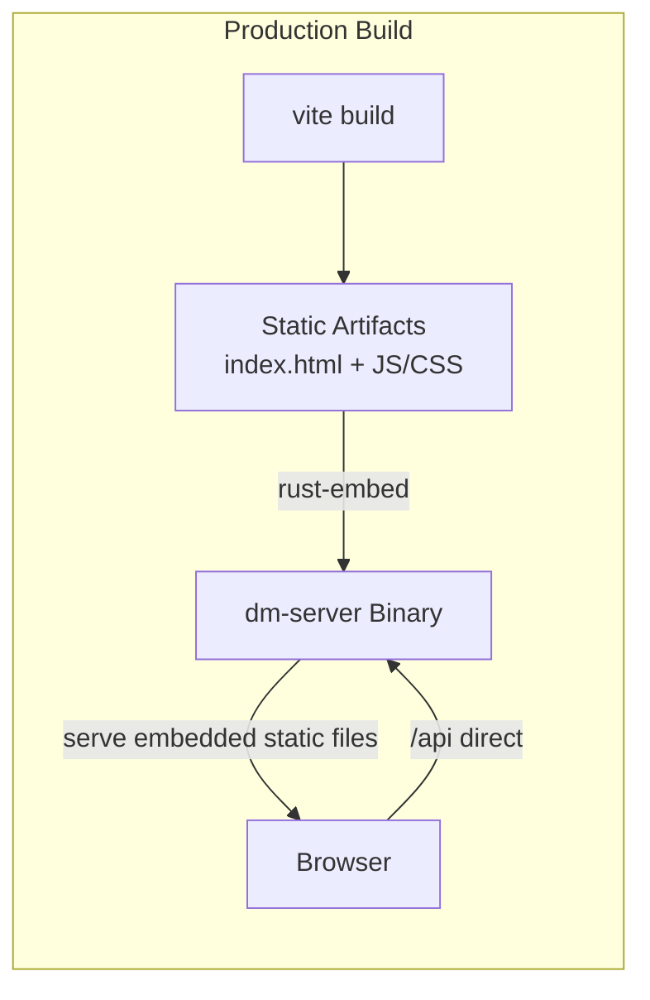
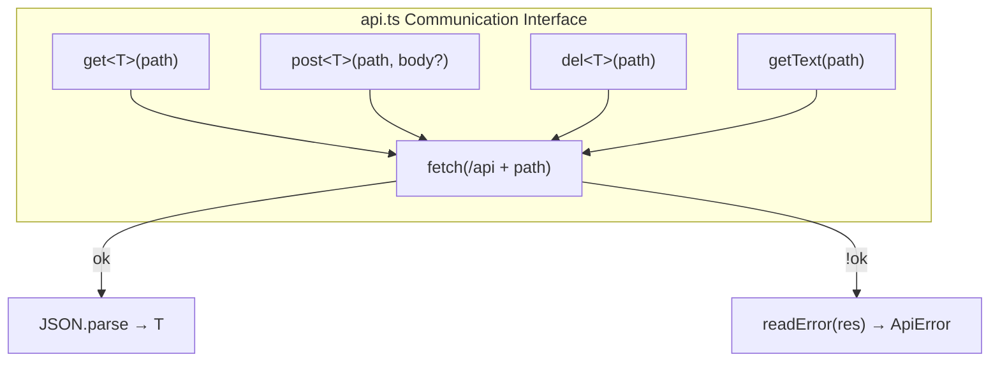
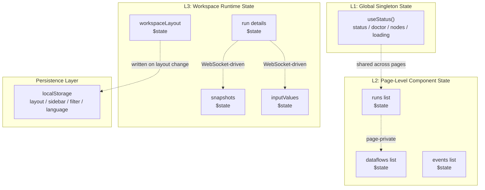
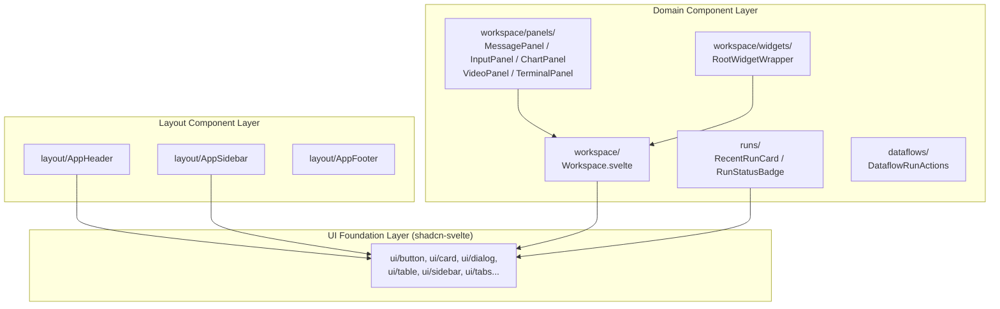

The frontend of Dora Manager is a single-page application (SPA) built on **SvelteKit 2 + Svelte 5**, outputting pure static artifacts via `adapter-static`, which are ultimately embedded into the Rust backend binary through `rust-embed`. This article will systematically deconstruct the architectural decisions and implementation patterns of the `web/` directory from the three pillars of the frontend engineering -- **routing design**, **API communication layer**, and **state management**.

Sources: [svelte.config.js](https://github.com/l1veIn/dora-manager/blob/main/web/svelte.config.js#L1-L15), [vite.config.ts](https://github.com/l1veIn/dora-manager/blob/main/web/vite.config.ts#L1-L16), [package.json](https://github.com/l1veIn/dora-manager/blob/main/web/package.json#L1-L68)

---

## Build & Deployment Model

Before diving into routing and state, it helps to understand the frontend's build topology -- it determines the design foundation of the entire communication layer.





There are three key decisions in the build configuration:

| Config | Value | Architectural Implication |
|--------|-------|---------------------------|
| `adapter-static` + `fallback: 'index.html'` | SPA mode | All routes are resolved on the client side, no server-side rendering needed |
| `ssr: false` + `prerender: false` | Pure CSR | Server-side rendering and pre-rendering are disabled, relying entirely on browser execution |
| `vite.proxy /api → :3210` | Dev proxy | During development, Vite forwards API requests to the local dm-server |

During development, Vite proxies bridge the frontend and backend; in production, the frontend static files are directly embedded into the Rust binary, and `dm-server` serves both the API and static files simultaneously -- this means the frontend always communicates with the backend through the `/api` prefix, and there are no cross-origin issues.

Sources: [svelte.config.js](https://github.com/l1veIn/dora-manager/blob/main/web/svelte.config.js#L6-L9), [+layout.ts](https://github.com/l1veIn/dora-manager/blob/main/web/src/routes/+layout.ts#L1-L3), [vite.config.ts](https://github.com/l1veIn/dora-manager/blob/main/web/vite.config.ts#L8-L15)

---

## Routing Architecture: File-System-Driven Page Topology

SvelteKit uses **file-system routing** -- the `src/routes/` directory structure is the URL structure. Dora Manager defines six top-level route domains, covering the complete workflow from node management to run monitoring:

```
routes/
├── +layout.svelte          ← Global Shell (Sidebar + Header + Content)
├── +layout.ts              ← ssr: false, prerender: false
├── +page.svelte            ← / Dashboard
├── dataflows/
│   ├── +page.svelte        ← /dataflows Dataflow list
│   └── [id]/
│       ├── +page.svelte    ← /dataflows/:id Dataflow workbench (Tab-based)
│       └── editor/
│           └── +page.svelte ← /dataflows/:id/editor Fullscreen graph editor
├── nodes/
│   ├── +page.svelte        ← /nodes Node catalog
│   └── [id]/
│       └── +page.svelte    ← /nodes/:id Node detail
├── runs/
│   ├── +page.svelte        ← /runs Run history list
│   └── [id]/
│       └── +page.svelte    ← /runs/:id Run workbench (Workspace panel system)
├── events/
│   └── +page.svelte        ← /events Event log viewer
└── settings/
    └── +page.svelte        ← /settings System settings
```

### Dual-Mode Layout System

The global layout `+layout.svelte` implements a **conditionally rendered dual-mode Shell**:

- **Standard mode**: `Sidebar.Provider` > `AppSidebar` + `AppHeader` + content area -- used for all regular pages
- **Editor mode**: When the URL ends with `/editor`, the Sidebar and Header are hidden, providing a fullscreen immersive canvas experience

This judgment is implemented through Svelte 5's `$derived` reactive computation, deriving in real time based on `page.url.pathname` from `$app/state`:

```svelte
let isEditorRoute = $derived(page.url?.pathname?.endsWith('/editor') ?? false);
```

The navigation structure in standard mode is hardcoded in the `AppSidebar` component as six navigation items (Dashboard, Nodes, Dataflows, Runs, Events, Settings). The sidebar's expand/collapse state is persisted to `localStorage`. `AppHeader` displays the current `dm` version number (obtained via the `useStatus()` global Store) and the sidebar toggle button.

Sources: [+layout.svelte](https://github.com/l1veIn/dora-manager/blob/main/web/src/routes/+layout.svelte#L1-L53), [AppSidebar.svelte](https://github.com/l1veIn/dora-manager/blob/main/web/src/lib/components/layout/AppSidebar.svelte#L14-L21), [AppHeader.svelte](https://github.com/l1veIn/dora-manager/blob/main/web/src/lib/components/layout/AppHeader.svelte#L1-L19)

### Route Feature Matrix

| Route | Primary Function | Data Fetching Method | Real-Time Updates |
|-------|-----------------|---------------------|-------------------|
| `/` (Dashboard) | Active run overview, quick launch, frequent dataflows | `onMount` + `Promise.all` concurrent requests | `setInterval` polling for active runs |
| `/dataflows` | Dataflow CRUD, search/filter, one-click run | `onMount` + `$effect` auto-refresh | None |
| `/dataflows/[id]` | Graph editor + YAML edit + metadata (Tab-based) | `onMount` to load dataflow details | None |
| `/dataflows/[id]/editor` | Fullscreen SvelteFlow graph editor | Inherits parent route data | None |
| `/nodes` | Node catalog, install/uninstall, search/filter | `onMount` to fetch node list | None |
| `/nodes/[id]` | Node detail (README/Code/Settings tabs) | `onMount` to load node details | None |
| `/runs` | Run history list, pagination, search, batch delete | `onMount` to fetch run list | None |
| `/runs/[id]` | **Run workbench** (Workspace panel system) | `onMount` + WebSocket + polling | **WebSocket + 3s polling** |
| `/events` | Event log viewer, filtering, XES export | `onMount` to fetch event list | None |
| `/settings` | Dora version management, MediaMTX configuration | `onMount` to load config/versions/diagnostics | None |

Sources: [+page.svelte (Dashboard)](https://github.com/l1veIn/dora-manager/blob/main/web/src/routes/+page.svelte#L1-L100), [dataflows/+page.svelte](https://github.com/l1veIn/dora-manager/blob/main/web/src/routes/dataflows/+page.svelte#L38-L56), [nodes/+page.svelte](https://github.com/l1veIn/dora-manager/blob/main/web/src/routes/nodes/+page.svelte#L41-L51), [runs/+page.svelte](https://github.com/l1veIn/dora-manager/blob/main/web/src/routes/runs/+page.svelte#L65-L86), [runs/[id]/+page.svelte](web/src/routes/runs/[id]/+page.svelte#L255-L303), [events/+page.svelte](https://github.com/l1veIn/dora-manager/blob/main/web/src/routes/events/+page.svelte#L37-L65), [settings/+page.svelte](https://github.com/l1veIn/dora-manager/blob/main/web/src/routes/settings/+page.svelte#L54-L94)

---

## API Communication Layer: Lightweight Fetch Wrapper

The entire frontend's HTTP communication layer is condensed into a single file -- [`$lib/api.ts`](https://github.com/l1veIn/dora-manager/blob/main/web/src/lib/api.ts). Its design philosophy is **minimal abstraction, maximum type safety**.

### Four-Function Communication Interface



| Function | HTTP Method | Request Body | Return Type | Typical Use |
|----------|------------|-------------|-------------|-------------|
| `get<T>(path)` | GET | -- | `Promise<T>` | Query resources (node list, run details, etc.) |
| `getText(path)` | GET | -- | `Promise<string>` | Get plain text response |
| `post<T>(path, body?)` | POST | `JSON.stringify(body)` | `Promise<T>` | Create/manipulate resources (start run, save config, etc.) |
| `del<T>(path)` | DELETE | -- | `Promise<T>` | Delete resources |

All functions share the `API_BASE = '/api'` prefix and uniformly send requests via `fetch()`. Non-`ok` responses uniformly throw `ApiError`.

### ApiError Structured Error Handling

`ApiError` is a custom class that extends `Error`, carrying rich error context:

```
ApiError {
  status: number       // HTTP status code
  message: string      // Extracted human-readable error message
  rawMessage: string   // Raw response body text
  details?: unknown    // Fully parsed JSON error body
}
```

Error extraction follows a **progressive degradation strategy**: first attempt to parse the `error`/`message`/`detail` fields from the JSON body, then fall back to raw text cleanup, and finally default to `status statusText`. This ensures that no matter what format the backend returns, the frontend always gets a readable error message.

Sources: [api.ts](https://github.com/l1veIn/dora-manager/blob/main/web/src/lib/api.ts#L1-L109)

---

## State Management: Multi-Layered Architecture Driven by Svelte 5 Runes

The Dora Manager frontend does not use any external state management libraries (such as Redux or Zustand). It relies entirely on **Svelte 5's Runes reactive primitives** (`$state`, `$derived`, `$effect`) to build a three-layer state architecture:



### Layer 1: Global Singleton Store (`useStatus()`)

[`$lib/stores/status.svelte.ts`](https://github.com/l1veIn/dora-manager/blob/main/web/src/lib/stores/status.svelte.ts) implements a classic **module-level singleton Store** pattern -- leveraging Svelte 5's `$state` to declare reactive variables at the module top level, then exposing read-only getters through closure functions:

```typescript
// Module-level reactive state -- the entire application shares the same instance
let status = $state<any>(null);
let doctor = $state<any>(null);
let nodes = $state<any[]>([]);
let loading = $state(true);

export function useStatus() {
    return {
        get status() { return status; },
        get doctor() { return doctor; },
        get nodes() { return nodes; },
        get loading() { return loading; },
        refresh,  // Concurrently fetch /status, /doctor, /nodes
    };
}
```

The `refresh()` function concurrently requests three endpoints via `Promise.all`; any single failure does not block the other requests (defensive handling with `.catch(() => null)`). This Store is consumed by `AppHeader` (displaying the version number) and the Dashboard page.

Sources: [status.svelte.ts](https://github.com/l1veIn/dora-manager/blob/main/web/src/lib/stores/status.svelte.ts#L1-L35)

### Layer 2: Page-Level Component State

Each route page declares its own `$state` variables in its `<script>` block, which is the most prevalent state management pattern. Taking the Runs list page as an example:

```typescript
let runs = $state<any[]>([]);
let loading = $state(true);
let totalRuns = $state(0);
let currentPage = $state(1);
let statusFilter = $state("all");
let searchQuery = $state("");
```

**All page-level state is private to the component** -- their lifecycle is bound to the page component and they are automatically destroyed when navigating away. State that needs to persist across pages (such as filter criteria, pagination position) is explicitly persisted via `localStorage`.

The typical way of sharing data between pages is **re-fetching**, rather than passing through a global Store. For example, when navigating from `/dataflows` to `/dataflows/:id`, the target page independently calls `get('/dataflows/:id')` to fetch the full data.

Sources: [runs/+page.svelte](https://github.com/l1veIn/dora-manager/blob/main/web/src/routes/runs/+page.svelte#L23-L34), [nodes/+page.svelte](https://github.com/l1veIn/dora-manager/blob/main/web/src/routes/nodes/+page.svelte#L21-L28)

### Layer 3: Workspace Runtime State

`/runs/[id]` is the page with the most complex state in the entire application. It simultaneously manages three different data flows at different frequencies:

| State Variable | Update Frequency | Data Source | Trigger Mechanism |
|----------------|-----------------|-------------|-------------------|
| `run` (run details) | ~3 seconds | `GET /runs/:id` | `setInterval` polling (only in running state) |
| `snapshots` (message snapshots) | Real-time | `GET /runs/:id/messages/snapshots` | **WebSocket `onmessage`** driven |
| `inputValues` (widget values) | Real-time | `GET /runs/:id/messages?tag=input` | **WebSocket `onmessage`** + incremental fetch |
| `workspaceLayout` (panel layout) | User action | `localStorage` | GridStack `change` event |
| `messageRefreshToken` | Incrementing counter | Local | +1 when WebSocket message arrives |

#### WebSocket Real-Time Channel

The run workbench establishes a WebSocket connection via `/api/runs/:id/messages/ws` for real-time message push. Connection management follows an **auto-reconnect** pattern:

```
onMount → connectMessageSocket()
  ├── onmessage → fetchSnapshots() + fetchNewInputValues() + messageRefreshToken++
  ├── onerror → socket.close()
  └── onclose → scheduleMessageSocketReconnect() (1s delay reconnection)
onDestroy → closeMessageSocket() + clearInterval
```

WebSocket is only responsible for **notification** (pushing a "new data available" signal); the actual payloads are still fetched via REST API -- this is a classic "notify-pull" pattern, avoiding WebSocket message body bloat and serialization complexity.

Sources: [runs/[id]/+page.svelte](web/src/routes/runs/[id]/+page.svelte#L438-L486), [runs/[id]/+page.svelte](web/src/routes/runs/[id]/+page.svelte#L305-L383)

### LocalStorage Persistence Strategy

The frontend uses `localStorage` to persist various UI states, with key names following the `dm-` prefix convention:

| localStorage Key | Scope | Data Type | Written When |
|-----------------|-------|-----------|-------------|
| `dm-app-sidebar-open` | Global | `"true"` / `"false"` | Sidebar toggle |
| `dm-language` | Global | locale string | Language switch |
| `dm-workspace-layout-{name}` | Per dataflow | JSON (WorkspaceGridItem[]) | GridStack layout change |
| `dm-run-sidebar-open-{name}` | Per run | `"true"` / `"false"` | Run sidebar toggle |
| `dm-run-interaction-notice-dismissed-{name}` | Per run | `"true"` | Dismiss interaction notice |
| `dm:nodes:catalog-state` | Node catalog | JSON (filter state) | Filter criteria change |

Sources: [+layout.svelte](https://github.com/l1veIn/dora-manager/blob/main/web/src/routes/+layout.svelte#L18-L29), [i18n.ts](https://github.com/l1veIn/dora-manager/blob/main/web/src/lib/i18n.ts#L15-L20), [runs/[id]/+page.svelte](web/src/routes/runs/[id]/+page.svelte#L76-L84), [nodes/+page.svelte](https://github.com/l1veIn/dora-manager/blob/main/web/src/routes/nodes/+page.svelte#L148-L163)

---

## Component System: Three-Layer Component Pyramid

Frontend components are divided into three layers by responsibility, forming a clear pyramid structure:



### shadcn-svelte UI Foundation Layer

The `$lib/components/ui/` directory contains 28 shadcn-svelte components, managed by the `components.json` configuration. These components are **purely presentational** and contain no business logic -- they provide standardized UI elements such as Button, Card, Dialog, Table, Sidebar, Tabs, Tooltip, etc., using the Tailwind CSS variant system for style customization.

`app.css` defines a complete light/dark theme token system (based on the oklch color space) through CSS custom properties, paired with `ModeWatcher` for automatic dark mode switching.

Sources: [components.json](https://github.com/l1veIn/dora-manager/blob/main/web/components.json#L1-L16), [app.css](https://github.com/l1veIn/dora-manager/blob/main/web/src/app.css#L1-L41)

### Workspace Panel System

Workspace is the core of the `/runs/[id]` page -- a draggable, resizable panel grid system based on **GridStack**. Its architecture revolves around a **registry pattern**:

The **Panel Registry** ([`panels/registry.ts`](https://github.com/l1veIn/dora-manager/blob/main/web/src/lib/components/workspace/panels/registry.ts)) defines six panel types:

| PanelKind | Title | Data Source Pattern | Supported Tags | Purpose |
|-----------|-------|--------------------|----------------|---------|
| `message` | Message | `history` | `"*"` (all) | Message stream viewer |
| `input` | Input | `snapshot` | `["widgets"]` | Interactive widget panel |
| `chart` | Chart | `snapshot` | `["chart"]` | Data chart |
| `table` | Table | `snapshot` | `["table"]` | Table display (reuses MessagePanel) |
| `video` | Plyr | `snapshot` | `["stream"]` | HLS/WebRTC video playback |
| `terminal` | Terminal | `external` | `[]` | xterm.js terminal (node logs) |

Each panel declares its metadata through the `PanelDefinition` interface: title, indicator color, data source pattern, default configuration, and rendering component. `PanelContext` serves as the unified injection context, providing all panels with runtime data such as `runId`, `snapshots`, `inputValues`, `nodes`, `emitMessage`, etc.

`RootWidgetWrapper` provides a unified visual wrapper for each panel -- title bar (with drag handle), maximize/restore button, close button. GridStack is seamlessly integrated into Svelte's `#each` rendering loop via a Svelte Action (`gridWidget`).

Sources: [panels/registry.ts](https://github.com/l1veIn/dora-manager/blob/main/web/src/lib/components/workspace/panels/registry.ts#L1-L79), [panels/types.ts](https://github.com/l1veIn/dora-manager/blob/main/web/src/lib/components/workspace/panels/types.ts#L1-L41), [Workspace.svelte](https://github.com/l1veIn/dora-manager/blob/main/web/src/lib/components/workspace/Workspace.svelte#L1-L175), [RootWidgetWrapper.svelte](https://github.com/l1veIn/dora-manager/blob/main/web/src/lib/components/workspace/widgets/RootWidgetWrapper.svelte#L1-L44)

### Layout Type System

Workspace layout data is described by the `WorkspaceGridItem` type:

```typescript
type WorkspaceGridItem = {
    id: string;           // Unique identifier
    widgetType: PanelKind; // Panel type
    config: PanelConfig;   // Panel configuration (node filter, tags, etc.)
    x: number; y: number;  // GridStack grid coordinates
    w: number; h: number;  // Grid width and height
    min?: { w: number; h: number }; // Minimum size
};
```

The grid system uses a **12-column layout** with a cell height of 80px, supporting floating positioning. Layout serialization/deserialization is handled by `normalizeWorkspaceLayout()` for backward compatibility (e.g., migrating the old `stream` type to `message`, migrating `subscribedSourceId` to a `nodes` array).

Sources: [types.ts](https://github.com/l1veIn/dora-manager/blob/main/web/src/lib/components/workspace/types.ts#L1-L147)

---

## Auxiliary Modules

In addition to the three pillars, there are several supporting auxiliary modules in `$lib/`:

**`$lib/nodes/catalog.ts`** -- A collection of utility functions for the node catalog, providing pure functions for node sorting (installation status priority -> source weight -> installation time), source identification (builtin/git/local), and runtime label extraction.

**`$lib/terminal/xterm.ts`** -- A managed wrapper for xterm.js, providing the `createManagedTerminal()` factory function that returns a unified `ManagedTerminal` interface (write, resetWithText, fit, dispose), configured with the JetBrains Mono font and a dark theme.

**`$lib/runs/outcomeSummary.ts`** -- A formatting utility for run outcome summaries, extracting the first-line summary and root cause from multi-line error stacks, used to display concise failure reasons on list pages.

**`$lib/utils.ts`** -- shadcn-svelte's standard utility function `cn()` (`clsx` + `tailwind-merge`), along with Svelte component type helpers.

**`$lib/hooks/is-mobile.svelte.ts`** -- A reactive breakpoint detection class based on `MediaQuery`, used for mobile adaptation.

Sources: [catalog.ts](https://github.com/l1veIn/dora-manager/blob/main/web/src/lib/nodes/catalog.ts#L1-L90), [xterm.ts](https://github.com/l1veIn/dora-manager/blob/main/web/src/lib/terminal/xterm.ts#L1-L50), [outcomeSummary.ts](https://github.com/l1veIn/dora-manager/blob/main/web/src/lib/runs/outcomeSummary.ts#L1-L48), [utils.ts](https://github.com/l1veIn/dora-manager/blob/main/web/src/lib/utils.ts#L1-L13), [is-mobile.svelte.ts](https://github.com/l1veIn/dora-manager/blob/main/web/src/lib/hooks/is-mobile.svelte.ts#L1-L9)

---

## Internationalization & Theming

**Internationalization** is implemented through `svelte-i18n`. [`$lib/i18n.ts`](https://github.com/l1veIn/dora-manager/blob/main/web/src/lib/i18n.ts) registers Chinese and English message bundles on module load, reads user preference from the `dm-language` key in `localStorage` at initialization time, falling back to the browser language. The `locale` subscription callback automatically writes changes back to `localStorage`.

**Dark mode** is implemented through the `<ModeWatcher />` component from the `mode-watcher` library, which automatically detects system preference and toggles the `dark` class on the `<html>` element. `app.css` defines a complete set of `:root` and `.dark` CSS custom properties, covering all design tokens for background, foreground, card, border, sidebar, etc.

Sources: [i18n.ts](https://github.com/l1veIn/dora-manager/blob/main/web/src/lib/i18n.ts#L1-L21), [app.css](https://github.com/l1veIn/dora-manager/blob/main/web/src/app.css#L1-L60)

---

## Tech Stack Overview

| Category | Technology | Version | Purpose |
|----------|-----------|---------|---------|
| Framework | SvelteKit | ^2.50 | Routing, SSR/CSR, file conventions |
| UI Runtime | Svelte | ^5.51 | Reactive components (Runes API) |
| CSS | Tailwind CSS | ^4.2 | Atomic styling |
| UI Component Library | shadcn-svelte (bits-ui) | ^2.16 | Headless UI components |
| Graph Editor | @xyflow/svelte | ^1.5 | Dataflow visual editing |
| Panel Grid | GridStack | ^12.4 | Draggable/resizable panel system |
| Terminal | @xterm/xterm | ^5.5 | Node log terminal |
| Charts | layerchart + d3-scale | ^2.0 / ^4.0 | Data visualization |
| Code Editor | svelte-codemirror-editor | ^2.1 | YAML/JSON editor |
| Video | plyr + hls.js | ^3.8 / ^1.6 | HLS/WebRTC video playback |
| Icons | lucide-svelte | ^0.575 | Unified icon set |
| i18n | svelte-i18n | ^4.0 | Internationalization |
| Dark Mode | mode-watcher | ^1.1 | System/manual dark toggle |
| YAML Parsing | yaml (js-yaml) | ^2.8 | Dataflow YAML processing |
| Graph Layout | @dagrejs/dagre | ^2.0 | Directed graph auto-layout |

Sources: [package.json](https://github.com/l1veIn/dora-manager/blob/main/web/package.json#L16-L67)

---

## Architectural Patterns Summary

| Pattern | Implementation | Advantage |
|---------|---------------|-----------|
| **Module-Level Singleton Store** | `$state` + closure getter | Zero-dependency global state, Svelte 5 native reactivity |
| **Notify-Pull Real-Time Model** | WebSocket notification -> REST pull payloads | Avoids large message body serialization, maintains API consistency |
| **Registry-Based Panel System** | `Record<PanelKind, PanelDefinition>` | Open-closed principle, adding new panel types without modifying Workspace |
| **Svelte Action Integration** | `use:gridWidget` | Seamless bridging of Svelte declarative rendering and GridStack imperative API |
| **Conditional Layout Shell** | `$derived` URL matching | Single layout entry point handling multiple modes |
| **localStorage UI Persistence** | Convention-based key naming + JSON serialization | Preserves user preferences across navigation without backend state |

---

## Further Reading

- [Visual Graph Editor: SvelteFlow Canvas, Context Menu, and YAML Bidirectional Sync](18-ke-shi-hua-tu-bian-ji-qi-svelteflow-hua-bu-you-jian-cai-dan-yu-yaml-shuang-xiang-tong-bu) -- Deep dive into the SvelteFlow graph editor implementation in the `/dataflows/[id]` route
- [Run Workbench: Grid Layout, Panel System, and Real-Time Log Viewer](19-yun-xing-gong-zuo-tai-wang-ge-bu-ju-mian-ban-xi-tong-yu-shi-shi-ri-zhi-cha-kan) -- Deep dive into the Workspace panel system's interaction design and real-time data flow
- [Reactive Widgets: Widget Registry, Dynamic Rendering, and WebSocket Parameter Injection](20-xiang-ying-shi-kong-jian-widgets-kong-jian-zhu-ce-biao-dong-tai-xuan-ran-yu-websocket-can-shu-zhu-ru) -- Deep dive into the InputPanel's widget registry and dynamic rendering mechanism
- [HTTP API Overview: REST Routes, WebSocket Real-Time Channels, and Swagger Documentation](15-http-api-quan-lan-rest-lu-you-websocket-shi-shi-tong-dao-yu-swagger-wen-dang) -- Complete reference for backend API endpoints, the communication counterpart of the frontend
- [Frontend-Backend Bundling & Release: rust-embed Static Embedding and CI/CD Pipeline](25-qian-hou-duan-lian-bian-yu-fa-bu-rust-embed-jing-tai-qian-ru-yu-ci-cd-liu-shui-xian) -- Understanding the complete build process of how static artifacts are embedded into the Rust binary
