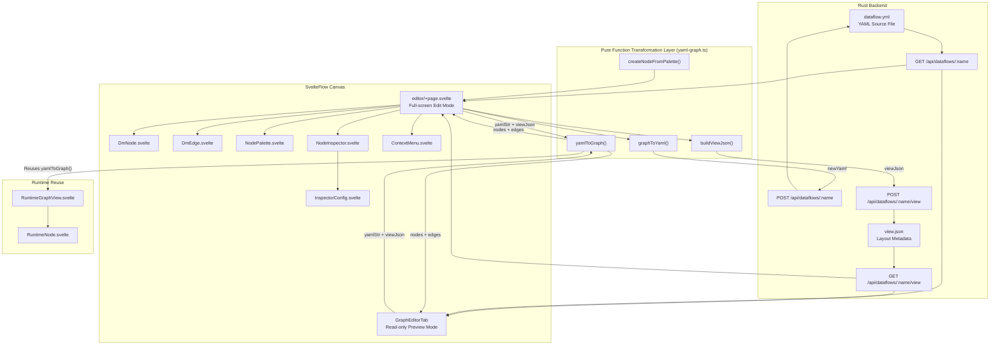

Dora Manager's visual graph editor is a bidirectional editing system built on **@xyflow/svelte**. Its core mission is to transform the YAML topology definition of a Dora dataflow into an interactive node graph canvas, while ensuring that every edit operation on the canvas—adding nodes, connecting edges, deleting, renaming—can be precisely serialized back into valid YAML output. The system spans both frontend and backend layers: the frontend handles SvelteFlow canvas rendering, interaction logic, and the transformation engine, while the backend handles persistent storage of the YAML source file and `view.json` layout metadata. This article provides an in-depth breakdown of its architectural design, data flow mechanisms, and key component implementations.

Sources: [yaml-graph.ts](https://github.com/l1veIn/dora-manager/blob/main/web/src/routes/dataflows/[id]/components/graph/yaml-graph.ts#L1-L5), [editor/+page.svelte](https://github.com/l1veIn/dora-manager/blob/main/web/src/routes/dataflows/[id]/editor/+page.svelte#L1-L55), [GraphEditorTab.svelte](https://github.com/l1veIn/dora-manager/blob/main/web/src/routes/dataflows/[id]/components/GraphEditorTab.svelte#L1-L25)

## Architecture Overview

The diagram below illustrates the core data flow and component collaboration of the graph editor. The key prerequisite for understanding this architecture is: **YAML is the sole Source of Truth for the dataflow**, while `view.json` only stores canvas layout metadata (node coordinates and viewport state). The two are written to separate backend endpoints when saving.



Sources: [yaml-graph.ts](https://github.com/l1veIn/dora-manager/blob/main/web/src/routes/dataflows/[id]/components/graph/yaml-graph.ts#L63-L200), [GraphEditorTab.svelte](https://github.com/l1veIn/dora-manager/blob/main/web/src/routes/dataflows/[id]/components/GraphEditorTab.svelte#L32-L36), [editor/+page.svelte](https://github.com/l1veIn/dora-manager/blob/main/web/src/routes/dataflows/[id]/editor/+page.svelte#L219-L239)

### Dual Mode Design: Read-only Preview vs Full-screen Editing

The system provides two canvas forms, each serving "viewing" and "editing" scenarios respectively. The **read-only preview mode** (`GraphEditorTab`) is embedded in the Graph Editor Tab of the dataflow detail page—nodes cannot be dragged, connected, or deleted, and only pan/zoom and MiniMap capabilities are provided. The **full-screen edit mode** (`editor/+page.svelte`) is a standalone route page, entered via the "Open Editor" button on the read-only canvas, unlocking full topology editing capabilities.

| Feature | Read-only Preview (GraphEditorTab) | Full-screen Edit (editor/+page.svelte) |
|---------|-----------------------------------|---------------------------------------|
| Node dragging | No `nodesDraggable={false}` | Yes |
| Port connecting | No `nodesConnectable={false}` | Yes, with validation |
| Element selection | No `elementsSelectable={false}` | Yes |
| Delete operation | No `deleteKey={null}` | Yes, Backspace/Delete |
| Context menu | No | Yes, three-level menu |
| Undo/Redo | No | Yes, 30-level snapshot stack |
| Node palette | No | Yes, Dialog popup |
| Property inspector | No | Yes, floating panel |
| Dirty flag/Save | No | Yes, `isDirty` + `saveAll()` |

Sources: [GraphEditorTab.svelte](https://github.com/l1veIn/dora-manager/blob/main/web/src/routes/dataflows/[id]/components/GraphEditorTab.svelte#L56-L71), [editor/+page.svelte](https://github.com/l1veIn/dora-manager/blob/main/web/src/routes/dataflows/[id]/editor/+page.svelte#L601-L621)

## Transformation Engine: yamlToGraph and graphToYaml

The transformation engine is the backbone of the entire graph editor, implemented in [yaml-graph.ts](https://github.com/l1veIn/dora-manager/blob/main/web/src/routes/dataflows/[id]/components/graph/yaml-graph.ts). It provides pure-function bidirectional transformations. This design ensures testability and side-effect-free conversion—functions depend on no external state, accepting only input parameters and returning deterministic results.

### YAML -> Graph: Two-pass Scanning Algorithm

The `yamlToGraph()` function accepts a YAML string and a `ViewJson` object, outputting the `nodes` and `edges` arrays required by SvelteFlow. Internally, it employs a **two-pass scanning** strategy:

**First pass (node creation)**: Iterates over `parsed.nodes`, generating a `DmFlowNode` for each YAML node. The node ID directly reuses the `id` field from the YAML. Position is read from `viewJson.nodes[id]` first, defaulting to zero if absent. Each node carries `inputs` (the key set from YAML `inputs`), `outputs` (from the YAML `outputs` array), and `nodeType` (from the `node` or `path` field).

**Second pass (edge derivation + virtual node generation)**: Iterates over all YAML nodes' `inputs` mapping again, calling `classifyInput()` on each input value for classification:

| Input Format | Classification Result | Representation on Graph |
|-------------|----------------------|------------------------|
| `microphone/audio` | `{ type: 'node', sourceId, outputPort }` | Normal edge: `microphone -> current node` |
| `dora/timer/millis/2000` | `{ type: 'dora', raw }` | Virtual Timer node + edge |
| `panel/device_id` | `{ type: 'panel', widgetId }` | Virtual Panel node + edge |

For the `node` type, an edge is directly created from the `out-{outputPort}` Handle of `sourceId` to the `in-{inputPort}` Handle of the current node. For `dora` and `panel` types, virtual nodes are created on demand (on first appearance) and connections are established.

Sources: [yaml-graph.ts](https://github.com/l1veIn/dora-manager/blob/main/web/src/routes/dataflows/[id]/components/graph/yaml-graph.ts#L63-L200), [types.ts](https://github.com/l1veIn/dora-manager/blob/main/web/src/routes/dataflows/[id]/components/graph/types.ts#L28-L47)

### Virtual Node System

Dora's dataflow YAML contains a special category of input sources—`dora/timer/*` and `panel/*`—which are not real executable nodes but built-in framework signal sources. To allow users to visually see these connection relationships on the graph, the transformation engine introduces the concept of **virtual nodes**.

Virtual nodes do not exist during the first pass but are created on demand during the second pass. Timer virtual nodes generate IDs in the format `__virtual_dora_timer_millis_2000`, carry the `isVirtual: true` and `virtualKind: 'timer'` flags, and automatically have a `tick` output port. Panel virtual nodes are more special—there is always only one instance, `__virtual_panel`, but its `outputs` array grows dynamically as `panel/*` inputs are discovered, meaning a single Panel virtual node can have multiple output ports, each corresponding to a widget ID.

Sources: [yaml-graph.ts](https://github.com/l1veIn/dora-manager/blob/main/web/src/routes/dataflows/[id]/components/graph/yaml-graph.ts#L98-L187), [DmNode.svelte](https://github.com/l1veIn/dora-manager/blob/main/web/src/routes/dataflows/[id]/components/graph/DmNode.svelte#L15-L19)

### Graph -> YAML: Preservative Serialization

`graphToYaml()` implements the reverse transformation—serializing the nodes and edges on the canvas back into valid YAML. Its core design principle is **preservative serialization**: the function not only accepts the current graph state but also receives `originalYamlStr` (the YAML text from the last save), extracting non-topology fields such as `config`, `env`, and `widgets` for each node and writing them back as-is. Additionally, top-level non-`nodes` fields (such as `communication` configuration) are fully preserved.

The key step in deserialization is `resolveEdgeToInputValue()`—which converts SvelteFlow edge objects back into input value strings in YAML syntax. For edges connected to virtual nodes, the function correctly restores the original reference format such as `dora/timer/millis/2000` or `panel/device_id`, ensuring the serialized YAML is semantically equivalent to the original format.

Sources: [yaml-graph.ts](https://github.com/l1veIn/dora-manager/blob/main/web/src/routes/dataflows/[id]/components/graph/yaml-graph.ts#L249-L320), [yaml-graph.ts](https://github.com/l1veIn/dora-manager/blob/main/web/src/routes/dataflows/[id]/components/graph/yaml-graph.ts#L223-L243)

### Input Classifier: classifyInput

The [YAML input value classification logic](https://github.com/l1veIn/dora-manager/blob/main/web/src/routes/dataflows/[id]/components/graph/types.ts#L33-L47) is the foundational infrastructure for connection parsing. The function classifies based on the prefix pattern of the input value: values starting with `dora/` are identified as built-in framework sources, values starting with `panel/` are identified as panel widget sources, the rest containing `/` are identified as inter-node references (`{sourceId}/{outputPort}`), with a final fallback to the `dora` type. This three-way branching ensures all possible YAML input values are correctly mapped to graph connection relationships.

Sources: [types.ts](https://github.com/l1veIn/dora-manager/blob/main/web/src/routes/dataflows/[id]/components/graph/types.ts#L33-L47)

## Type System

The graph editor's type system is defined in [types.ts](https://github.com/l1veIn/dora-manager/blob/main/web/src/routes/dataflows/[id]/components/graph/types.ts), built on top of SvelteFlow's `Node` and `Edge` generics:

| Type | Definition | Purpose |
|------|-----------|---------|
| `DmNodeData` | `Node`'s data payload | Carries label, nodeType, inputs/outputs, virtual node flags |
| `ViewJson` | Viewport + node coordinate mapping | Persists canvas layout state |
| `DmFlowNode` | `Node<DmNodeData, 'dmNode'>` | SvelteFlow node type constraint |
| `DmFlowEdge` | `Edge` | SvelteFlow edge type |
| `InputSource` | Union type of three input sources | Drives `classifyInput` return values |

The `inputs` and `outputs` in `DmNodeData` are string arrays storing port ID lists. These port IDs are also SvelteFlow Handle IDs (formatted as `in-{portId}` and `out-{portId}`), forming the addressing foundation for edge connections—from edge creation in `yamlToGraph`, to edge restoration in `graphToYaml`, to connection queries in `NodeInspector`, the entire system depends on this naming convention.

Sources: [types.ts](https://github.com/l1veIn/dora-manager/blob/main/web/src/routes/dataflows/[id]/components/graph/types.ts#L1-L47)

## Auto Layout: Dagre LR

When `yamlToGraph()` detects nodes on the canvas that have zero position and no record in `viewJson`, it automatically triggers the [Dagre layout algorithm](https://github.com/l1veIn/dora-manager/blob/main/web/src/routes/dataflows/[id]/components/graph/auto-layout.ts#L13-L44). Dagre is a classic directed graph hierarchical layout library, configured here for left-to-right (`rankdir: 'LR'`) arrangement with 60px node spacing and 120px rank spacing.

Node height estimation uses the formula `NODE_HEIGHT_BASE + max(inputs, outputs) * PORT_ROW_HEIGHT`, where the base height is 60px, each port row is 22px, and the width is fixed at 260px. This heuristic estimation ensures Dagre does not produce node overlaps when allocating space. After layout completes, node coordinates are converted from Dagre's center-point coordinates to SvelteFlow's top-left coordinates (subtracting half the width and height).

Users in full-screen edit mode can also manually trigger re-layout at any time via the toolbar button or the "Auto Layout" option in the context menu.

Sources: [auto-layout.ts](https://github.com/l1veIn/dora-manager/blob/main/web/src/routes/dataflows/[id]/components/graph/auto-layout.ts#L1-L44), [yaml-graph.ts](https://github.com/l1veIn/dora-manager/blob/main/web/src/routes/dataflows/[id]/components/graph/yaml-graph.ts#L189-L199)

## Canvas Component Details

### DmNode: Custom Node Rendering

[DmNode.svelte](https://github.com/l1veIn/dora-manager/blob/main/web/src/routes/dataflows/[id]/components/graph/DmNode.svelte) is the unified rendering component for all canvas nodes, registered to SvelteFlow via `nodeTypes: { dmNode: DmNode }`. The component structure is divided into three layers: the **header** displays the node label and type, with a 4px colored indicator bar on the left side; the **body** is split into left and right columns, with input ports and their Handles arranged on the left column and output ports and their Handles on the right column; the whole is wrapped in a rounded card.

Port Handle IDs follow the `{direction}-{portId}` naming convention (e.g., `in-audio`, `out-tick`), which permeates the entire system. Input ports display as `<- {portName}`, output ports display as `{portName} ->`, visually distinguishing the data flow direction.

Visually, DmNode implements full light/dark theme adaptation. Virtual nodes switch to dashed borders via the `isVirtual` class name; Timer nodes have a light blue header background (`rgba(59, 130, 246, 0.08)`), Panel nodes have a light purple header background (`rgba(139, 92, 246, 0.08)`), and the left color bar for each virtual node type corresponds to blue and purple respectively.

Sources: [DmNode.svelte](https://github.com/l1veIn/dora-manager/blob/main/web/src/routes/dataflows/[id]/components/graph/DmNode.svelte#L15-L55), [DmNode.svelte](https://github.com/l1veIn/dora-manager/blob/main/web/src/routes/dataflows/[id]/components/graph/DmNode.svelte#L57-L197)

### DmEdge: Custom Edge with Delete Button

[DmEdge.svelte](https://github.com/l1veIn/dora-manager/blob/main/web/src/routes/dataflows/[id]/components/graph/DmEdge.svelte) replaces SvelteFlow's default edge rendering, providing two enhancements: **Bezier curve paths** (calculated via `getBezierPath` for smooth curves) and a **hover delete button**. The delete button is embedded in the SVG using `foreignObject`, positioned at the midpoint of the edge, with a default opacity of 0, appearing only when the mouse hovers over the edge (`hover` state) or when the edge is selected. The button calls `deleteElements()` returned by `useSvelteFlow()` to perform deletion, without needing a callback from the editor page.

Sources: [DmEdge.svelte](https://github.com/l1veIn/dora-manager/blob/main/web/src/routes/dataflows/[id]/components/graph/DmEdge.svelte#L1-L111)

### NodePalette: Node Selection Panel

[NodePalette.svelte](https://github.com/l1veIn/dora-manager/blob/main/web/src/routes/dataflows/[id]/components/graph/NodePalette.svelte) is presented as a Dialog popup, loading metadata for all installed nodes from `GET /api/nodes`. The panel supports **keyword search** (matching name, id, tags) and **category filtering** (based on the `display.category` field in `dm.json`), with nodes displayed in a two-column grid.

Node template data is extracted from the API response via the `getPaletteData()` function—filtering entries with `direction === 'input'` and `direction === 'output'` from the `ports` array, mapping them to port ID lists, and ultimately passing them to `createNodeFromPalette()` to generate a new `DmFlowNode`. The panel supports both **click-to-add** and **drag-to-add** interactions—during drag, serialized node template data is passed via `dataTransfer`.

Sources: [NodePalette.svelte](https://github.com/l1veIn/dora-manager/blob/main/web/src/routes/dataflows/[id]/components/graph/NodePalette.svelte#L1-L93), [NodePalette.svelte](https://github.com/l1veIn/dora-manager/blob/main/web/src/routes/dataflows/[id]/components/graph/NodePalette.svelte#L66-L92)

### NodeInspector: Property Inspector

[NodeInspector.svelte](https://github.com/l1veIn/dora-manager/blob/main/web/src/routes/dataflows/[id]/components/graph/NodeInspector.svelte) is a draggable, resizable floating panel that displays detailed properties of the selected node. The panel supports two interaction modes: the **Info & Ports** tab shows the node ID (clickable to edit for renaming), node type, input/output port lists, and the connection status of each port (Connected / Unconnected); the **Configuration** tab embeds the `InspectorConfig` component for configuration editing.

The inspector's window position and size are persisted via `localStorage` (key name `dm-inspector-bounds`), ensuring users do not need to readjust the panel position when reopening the editor multiple times. The panel implements full boundary constraint logic (`clampBounds`), ensuring drag and resize operations do not push the window beyond the viewport. Size is constrained between 360-560px width and 320-760px height.

Sources: [NodeInspector.svelte](https://github.com/l1veIn/dora-manager/blob/main/web/src/routes/dataflows/[id]/components/graph/NodeInspector.svelte#L25-L151), [NodeInspector.svelte](https://github.com/l1veIn/dora-manager/blob/main/web/src/routes/dataflows/[id]/components/graph/NodeInspector.svelte#L152-L189)

### InspectorConfig: Four-layer Config Aggregation Editor

[InspectorConfig.svelte](https://github.com/l1veIn/dora-manager/blob/main/web/src/routes/dataflows/[id]/components/graph/InspectorConfig.svelte) is the core configuration editing component, loading **aggregated config fields** from `GET /api/dataflows/:name/config-schema`. Each field carries three dimensions of information: `effective_value`, `effective_source`, and `schema`, forming the frontend presentation of the four-layer config merge mechanism described in the [Dataflow Transpiler](08-transpiler).

The field's source identifier is presented as a color-coded label:

| Source | Label Color | Meaning |
|--------|------------|---------|
| `inline` | Blue | From the `config` field in YAML |
| `node` | Purple | From the node's global config (written via `POST /api/nodes/:type/config`) |
| `default` / `unset` | Gray | From default values in `dm.json` |

The component dynamically selects UI controls based on `schema["x-widget"].type`: `select` -> dropdown selector, `slider` -> slider + numeric input, `switch` -> toggle switch, `radio` -> radio button group, `checkbox` -> multi-select box, `file` / `directory` -> path selector. For fields without a declared widget, it falls back to basic controls based on `schema.type`: `string` -> text input, `number` -> numeric input, `boolean` -> checkbox, other types -> JSON text area.

An important design detail: fields marked as `secret: true` are written to the node's global config during editing rather than inline YAML, and a warning is displayed to remind users not to inline sensitive information in the dataflow file.

Sources: [InspectorConfig.svelte](https://github.com/l1veIn/dora-manager/blob/main/web/src/routes/dataflows/[id]/components/graph/InspectorConfig.svelte#L34-L119), [InspectorConfig.svelte](https://github.com/l1veIn/dora-manager/blob/main/web/src/routes/dataflows/[id]/components/graph/InspectorConfig.svelte#L168-L339)

### ContextMenu: Context Menu

[ContextMenu.svelte](https://github.com/l1veIn/dora-manager/blob/main/web/src/routes/dataflows/[id]/components/graph/ContextMenu.svelte) provides right-click-based quick actions, with three menu forms depending on the click target:

| Click Target | Available Actions |
|-------------|-------------------|
| Canvas blank area | Add node (open NodePalette), select all, auto layout |
| Node | Copy, inspect properties (open Inspector), delete |
| Edge | Delete connection |

The menu is rendered at a fixed position with `z-[101]` layer, paired with a full-screen transparent `z-[100]` background layer that captures external clicks to close the menu. This two-layer separation design avoids interference from SvelteFlow canvas pointer-events. Each menu item has a lucide-svelte icon, and delete-type operations use the `danger` class name to display a red warning effect on hover.

Sources: [ContextMenu.svelte](https://github.com/l1veIn/dora-manager/blob/main/web/src/routes/dataflows/[id]/components/graph/ContextMenu.svelte#L1-L101)

## Editor State Management and Operations

### Undo/Redo System

The full-screen editor implements an undo/redo system based on **snapshot stacks**. Before each edit operation, `pushUndo()` is called to push a deep copy of the current `nodes` and `edges` onto the `undoStack` (up to 30 levels), while simultaneously clearing the `redoStack`. On undo, the state is popped from `undoStack` and pushed onto `redoStack`; redo operates in reverse. Snapshots are deep-copied via `JSON.parse(JSON.stringify(val))`, ensuring complete state isolation between snapshots.

Notably, `handleUpdateConfig` intentionally omits the `pushUndo()` call, avoiding the creation of a history snapshot for every keystroke or slider drag during config editing, which would otherwise flood the undo stack with intermediate states.

Sources: [editor/+page.svelte](https://github.com/l1veIn/dora-manager/blob/main/web/src/routes/dataflows/[id]/editor/+page.svelte#L67-L114)

### Connection Validation

The `isValidConnection()` function is called when a user attempts to drag a wire from an output port to an input port, performing three validations:

| Validation Rule | Implementation |
|----------------|----------------|
| No self-connections | Returns `false` when `source === target` |
| No duplicate incoming edges on the same port | Checks whether `edges` already contains the same `target + targetHandle` |
| No fully duplicate connections | Checks whether the 4-tuple `(source, target, sourceHandle, targetHandle)` already exists |

The constraint of "at most one incoming edge per port" derives from the dataflow's semantics—each input port should receive messages from only one data source.

Sources: [editor/+page.svelte](https://github.com/l1veIn/dora-manager/blob/main/web/src/routes/dataflows/[id]/editor/+page.svelte#L291-L311)

### Node Renaming

`handleRenameNode()` implements node ID renaming. This operation has a cascading effect—not only does it modify the node's own `id` and `data.label`, but it also iterates over all edges, replacing the `source` and `target` fields that reference the old ID with the new ID, and synchronously updating the edge's `id` (edge IDs are composed in the format `e-{source}-{sourcePort}-{target}-{targetPort}`, so any change on either end requires rebuilding). If the renamed node is the currently selected node, `selectedNodeId` is also updated synchronously.

Sources: [editor/+page.svelte](https://github.com/l1veIn/dora-manager/blob/main/web/src/routes/dataflows/[id]/editor/+page.svelte#L250-L275)

### Keyboard Shortcuts

The editor registers global keyboard event listeners, supporting the following shortcuts:

| Shortcut | Function |
|----------|----------|
| `Cmd/Ctrl + S` | Save (triggers `saveAll()`) |
| `Cmd/Ctrl + Z` | Undo |
| `Cmd/Ctrl + Shift + Z` | Redo |
| `Cmd/Ctrl + D` | Duplicate selected node |
| `Backspace / Delete` | Delete selected element (handled natively by SvelteFlow, via the `ondelete` callback) |

Sources: [editor/+page.svelte](https://github.com/l1veIn/dora-manager/blob/main/web/src/routes/dataflows/[id]/editor/+page.svelte#L449-L466)

## Save Flow and view.json Persistence

The save operation is driven by the `saveAll()` function, executing two independent API calls:

1. **`graphToYaml(nodes, edges, lastYaml)`** -> `POST /api/dataflows/:name`: Serializes the current graph state into YAML and writes it to the backend. The `lastYaml` parameter ensures non-topology fields (config, env, widgets) are preserved as-is.
2. **`buildViewJson(nodes)`** -> `POST /api/dataflows/:name/view`: Serializes all nodes' current positions into `view.json` and writes it to the backend. The `view.json` structure is simple, containing only a `nodes: { [nodeId]: { x, y } }` mapping, without storing topology information.

After a successful save, `lastYaml` is updated to the new YAML and the `isDirty` flag is cleared. The save button in the top bar toggles its style based on the `isDirty` state—displaying a gray "Saved" when unmodified and a prominent "Save" button when there are changes.

Sources: [editor/+page.svelte](https://github.com/l1veIn/dora-manager/blob/main/web/src/routes/dataflows/[id]/editor/+page.svelte#L431-L446), [yaml-graph.ts](https://github.com/l1veIn/dora-manager/blob/main/web/src/routes/dataflows/[id]/components/graph/yaml-graph.ts#L206-L217), [yaml-graph.ts](https://github.com/l1veIn/dora-manager/blob/main/web/src/routes/dataflows/[id]/components/graph/yaml-graph.ts#L249-L320)

## YAML Editor: CodeMirror Integration

In addition to graphical editing, the system also provides [YamlEditorTab.svelte](https://github.com/l1veIn/dora-manager/blob/main/web/src/routes/dataflows/[id]/components/YamlEditorTab.svelte) as a plain text editing entry point, embedded in the "dataflow.yml" Tab of the dataflow detail page. The component is built on `svelte-codemirror-editor` and `@codemirror/lang-yaml`, supporting YAML syntax highlighting and a dark theme (`oneDark`).

The YAML editor's save logic is independent from the graph editor—clicking the "Save code" button directly writes the text content to the backend via `POST /api/dataflows/:name`, and upon successful save, re-fetches the latest dataflow object and notifies the parent component to refresh its state. This ensures that data remains consistent between the two Tabs regardless of whether modifications are made through the graphical interface or the text editor.

Sources: [YamlEditorTab.svelte](https://github.com/l1veIn/dora-manager/blob/main/web/src/routes/dataflows/[id]/components/YamlEditorTab.svelte#L1-L95), [+page.svelte](https://github.com/l1veIn/dora-manager/blob/main/web/src/routes/dataflows/[id]/+page.svelte#L414-L432)

## Runtime Graph View Reuse

The graph editor's transformation engine is used not only in editing scenarios but is also reused by the runtime view. [RuntimeGraphView.svelte](https://github.com/l1veIn/dora-manager/blob/main/web/src/routes/runs/[id]/graph/RuntimeGraphView.svelte) directly imports the `yamlToGraph` function to render the dataflow YAML as a runtime monitoring canvas, but uses a dedicated `RuntimeNode` instead of `DmNode`, the latter adding runtime status indicators on top of the basic node rendering: CPU usage (`{cpu}%`), memory usage (`{memory} MB`), status icons (running/stopped/failed/unknown), and a log blink indicator.

The runtime view receives real-time push messages via WebSocket connection (`/api/runs/:runId/ws`), processing three types of messages:

| Message Type | Processing Logic |
|-------------|------------------|
| `status` | Updates the dataflow's global status, toggles edge animation effects (blue animated line when running) |
| `metrics` | Injects CPU/memory data for each node, updates node border color |
| `logs` / `io` | Triggers the log indicator blink on nodes (blue pulse, automatically disappears after 500ms) |

Sources: [RuntimeGraphView.svelte](https://github.com/l1veIn/dora-manager/blob/main/web/src/routes/runs/[id]/graph/RuntimeGraphView.svelte#L1-L167), [RuntimeNode.svelte](https://github.com/l1veIn/dora-manager/blob/main/web/src/routes/runs/[id]/graph/RuntimeNode.svelte#L1-L116)

## File Structure Overview

```
web/src/routes/dataflows/[id]/
├── +page.svelte                          # Dataflow detail page (Graph/YAML/Meta/History tabs)
├── editor/+page.svelte                   # Full-screen editor page (~767 lines)
└── components/
    ├── GraphEditorTab.svelte             # Read-only graph preview component
    ├── YamlEditorTab.svelte              # CodeMirror YAML editor
    ├── MetaTab.svelte                    # flow.json metadata editing
    ├── HistoryTab.svelte                 # History version browsing
    └── graph/
        ├── types.ts                      # Type definitions and classifyInput
        ├── yaml-graph.ts                 # Bidirectional transformation engine core (~321 lines)
        ├── auto-layout.ts                # Dagre LR auto layout (~45 lines)
        ├── DmNode.svelte                 # Custom node rendering
        ├── DmEdge.svelte                 # Custom edge rendering (with delete button)
        ├── NodePalette.svelte            # Node selection panel (Dialog)
        ├── NodeInspector.svelte          # Property inspector (floating panel)
        ├── InspectorConfig.svelte        # Four-layer config aggregation editing
        └── ContextMenu.svelte            # Right-click context menu
```

Sources: [Directory structure](https://github.com/l1veIn/dora-manager/blob/main/web/src/routes/dataflows/[id]/)

## Design Evolution: Four-phase Delivery Model

The graph editor's development followed a documented four-phase progressive delivery strategy:

| Phase | Document | Core Deliverables | Status |
|-------|----------|-------------------|--------|
| P1 | [P1-readonly-canvas.md](https://github.com/l1veIn/dora-manager/blob/main/docs/nodeEditor/P1-readonly-canvas.md) | Read-only canvas + view.json backend + Dagre layout | Completed |
| P2 | [P2-editable-canvas.md](https://github.com/l1veIn/dora-manager/blob/main/docs/nodeEditor/P2-editable-canvas.md) | Topology editing + graphToYaml serialization | Completed |
| P3 | [P3-palette-inspector.md](https://github.com/l1veIn/dora-manager/blob/main/docs/nodeEditor/P3-palette-inspector.md) | NodePalette + NodeInspector + config editing | Completed |
| P4 | [P4-schema-validation-polish.md](https://github.com/l1veIn/dora-manager/blob/main/docs/nodeEditor/P4-schema-validation-polish.md) | Port Schema validation + undo/redo + theme adaptation | Partially completed |

In the P4 phase, the undo/redo system, theme adaptation, and node duplication features have been implemented, but Port Schema-based connection validation (obtaining type compatibility diagnostic information via the `GET /api/dataflows/:name/validate` endpoint and coloring edges accordingly) has not yet been delivered. Current edge rendering does not carry validation state, using only a uniform gray/blue (when selected) style.

Sources: [P1-readonly-canvas.md](https://github.com/l1veIn/dora-manager/blob/main/docs/nodeEditor/P1-readonly-canvas.md#L1-L30), [P2-editable-canvas.md](https://github.com/l1veIn/dora-manager/blob/main/docs/nodeEditor/P2-editable-canvas.md#L1-L19), [P3-palette-inspector.md](https://github.com/l1veIn/dora-manager/blob/main/docs/nodeEditor/P3-palette-inspector.md#L1-L19), [P4-schema-validation-polish.md](https://github.com/l1veIn/dora-manager/blob/main/docs/nodeEditor/P4-schema-validation-polish.md#L1-L19)

## Key Dependencies

| Dependency | Version | Purpose |
|-----------|---------|---------|
| `@xyflow/svelte` | ^1.5.1 | SvelteFlow canvas engine (node/edge rendering, viewport control, interaction events) |
| `@dagrejs/dagre` | ^2.0.4 | Hierarchical directed graph auto layout (LR direction) |
| `yaml` (npm) | ^2.8.3 | YAML parsing and serialization (used within `yaml-graph.ts`) |
| `svelte-codemirror-editor` | ^2.1.0 | YAML text editor (YamlEditorTab) |
| `@codemirror/lang-yaml` | ^6.1.2 | CodeMirror YAML syntax highlighting |
| `@codemirror/theme-one-dark` | ^6.1.3 | CodeMirror dark theme |
| `mode-watcher` | — | Light/dark theme state tracking |

Sources: [package.json](https://github.com/l1veIn/dora-manager/blob/main/web/package.json#L17-L66)

## Further Reading

- To understand how the SvelteFlow canvas behaves in the runtime monitoring scenario—including WebSocket real-time metric push, log panel, and RuntimeNode status visualization—see [Runtime Workbench: Grid Layout, Panel System, and Real-time Log Viewing](16-yun-xing-gong-zuo-tai-wang-ge-bu-ju-mian-ban-xi-tong-yu-shi-shi-ri-zhi-cha-kan).
- To understand the backend implementation of the four-layer config aggregation mechanism (default -> node global -> flow -> inline) that InspectorConfig depends on, see [Dataflow Transpiler: Multi-pass Pipeline and Four-layer Config Merge](08-shu-ju-liu-zhuan-yi-qi-transpiler-duo-pass-guan-xian-yu-si-ceng-pei-zhi-he-bing).
- To learn about the node metadata sources consumed by the graph editor (ports, display, config schema in `dm.json`), see [Built-in Node Overview: From Media Capture to AI Inference](19-nei-zhi-jie-dian-zong-lan-cong-mei-ti-cai-ji-dao-ai-tui-li) and [Port Schema and Port Type Validation](20-port-schema-yu-duan-kou-lei-xing-xiao-yan).
- To understand the frontend's overall route design, API communication layer, and state management paradigm, see [SvelteKit Project Structure: Route Design, API Communication Layer, and State Management](17-sveltekit-xiang-mu-jie-gou-lu-you-she-ji-api-tong-xin-ceng-yu-zhuang-tai-guan-li).
