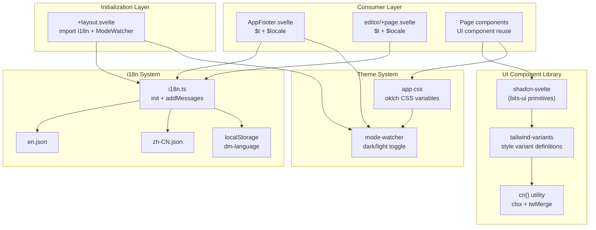

Dora Manager's front-end UI is built on two core infrastructure components: a runtime internationalization system based on **svelte-i18n**, and a component library based on **shadcn-svelte + Tailwind CSS v4**. This article provides an in-depth analysis of the architectural design, current implementation status, and extension patterns of both systems, helping you efficiently add multi-language support and reuse UI components within the existing design constraints.

Sources: [i18n.ts](https://github.com/l1veIn/dora-manager/blob/master/web/src/lib/i18n.ts#L1-L22), [components.json](https://github.com/l1veIn/dora-manager/blob/master/web/components.json#L1-L16)

## System Architecture Overview

The i18n system and UI component library in Dora Manager form a layered concern hierarchy — internationalization handles locale adaptation of text content, the component library ensures visual consistency and interaction patterns, and the theme system manages light/dark color scheme switching. The three collaborate loosely through a CSS variable layer and Svelte's reactive stores.



Sources: [+layout.svelte](https://github.com/l1veIn/dora-manager/blob/master/web/src/routes/+layout.svelte#L1-L53), [app.css](https://github.com/l1veIn/dora-manager/blob/master/web/src/app.css#L1-L149)

## Internationalization (i18n) System

### Engine Selection and Current State

Dora Manager's design documentation originally planned to use **Paraglide** (inlang's compile-time i18n solution), but the actual implementation adopted **svelte-i18n** — a store-based runtime internationalization library. This choice provides a simpler integration path: no compilation step is needed, and translation key substitution is done directly through Svelte's reactive `$t()` store syntax.

Key characteristics of the current i18n system:

| Dimension | Implementation |
|-----------|---------------|
| Engine | svelte-i18n v4.0.1 (runtime store) |
| Configuration entry | [i18n.ts](https://github.com/l1veIn/dora-manager/blob/master/web/src/lib/i18n.ts) |
| Language files | [en.json](https://github.com/l1veIn/dora-manager/blob/master/web/src/lib/locales/en.json), [zh-CN.json](https://github.com/l1veIn/dora-manager/blob/master/web/src/lib/locales/zh-CN.json) |
| Fallback language | `en` |
| Persistence | `localStorage` key `dm-language` |
| Supported languages | `en`, `zh-CN` |

Sources: [package.json](https://github.com/l1veIn/dora-manager/blob/master/web/package.json#L41), [i18n.ts](https://github.com/l1veIn/dora-manager/blob/master/web/src/lib/i18n.ts#L1-L22)

### Initialization Flow

The i18n system is initialized in the application's root layout through a side-effect import `import "$lib/i18n"`. The process is divided into three stages: **Register dictionaries** → **Detect initial language** → **Subscribe to persistence**.

[en.json](https://github.com/l1veIn/dora-manager/blob/master/web/src/lib/locales/en.json) and [zh-CN.json](https://github.com/l1veIn/dora-manager/blob/master/web/src/lib/locales/zh-CN.json) are statically registered into svelte-i18n's message dictionary via `addMessages()`. The initial language detection follows this priority: cached `dm-language` key in `localStorage` → browser `navigator.language` → fallback to `en`. Language changes are automatically synced back to `localStorage` via `locale.subscribe()`, ensuring cross-session consistency.

```typescript
// web/src/lib/i18n.ts — three stages of initialization logic
// Stage 1: Register dictionaries
addMessages('en', en);
addMessages('zh-CN', zhCN);

// Stage 2: Detect initial language (localStorage > navigator > fallback)
init({
    fallbackLocale: 'en',
    initialLocale: window.localStorage.getItem("dm-language") || getLocaleFromNavigator(),
});

// Stage 3: Persist on language change
locale.subscribe((newLocale) => {
    if (newLocale) window.localStorage.setItem("dm-language", newLocale);
});
```

Sources: [i18n.ts](https://github.com/l1veIn/dora-manager/blob/master/web/src/lib/i18n.ts#L1-L22)

### Current Translation Keys and Coverage

As of the current version, the i18n system's translation dictionary is extremely minimal, containing only **4 keys**:

| Key | `en` | `zh-CN` |
|-----|------|---------|
| `theme` | Theme | 主题 |
| `language` | Language | 语言 |
| `english` | English | English |
| `chinese` | 中文 | 中文 |

Only two components actually use `$t()`: the sidebar footer [AppFooter.svelte](https://github.com/l1veIn/dora-manager/blob/master/web/src/lib/components/layout/AppFooter.svelte) and the standalone editor page [editor/+page.svelte](https://github.com/l1veIn/dora-manager/blob/master/web/src/routes/dataflows/[id]/editor/+page.svelte). This means **the i18n system is in a state where the infrastructure is ready but not yet widely adopted** — most text in pages (Dashboard, Settings, Nodes, Runs, Events) remains hardcoded in English.

Sources: [en.json](https://github.com/l1veIn/dora-manager/blob/master/web/src/lib/locales/en.json#L1-L5), [zh-CN.json](https://github.com/l1veIn/dora-manager/blob/master/web/src/lib/locales/zh-CN.json#L1-L5)

### Language Switcher Implementation

The language switcher UI is embedded as a DropdownMenu in two locations: the bottom of AppSidebar and the standalone editor toolbar. The core pattern is directly assigning to the `$locale` store to trigger a global language switch.

```svelte
<!-- Simplified language switcher in AppFooter.svelte -->
<script>
    import { t, locale } from "svelte-i18n";
    import * as DropdownMenu from "$lib/components/ui/dropdown-menu/index.js";
</script>

<DropdownMenu.Root>
    <DropdownMenu.Trigger>
        <!-- Trigger button shows current language name + locale tag -->
        <span>{$t("language")} ({$locale?.toUpperCase()})</span>
    </DropdownMenu.Trigger>
    <DropdownMenu.Content side="top" align="start">
        {#each ["en", "zh-CN"] as tag}
            <DropdownMenu.Item>
                <button onclick={() => ($locale = tag)}>
                    {tag === "en" ? $t("english") : $t("chinese")}
                </button>
            </DropdownMenu.Item>
        {/each}
    </DropdownMenu.Content>
</DropdownMenu.Root>
```

Sources: [AppFooter.svelte](https://github.com/l1veIn/dora-manager/blob/master/web/src/lib/components/layout/AppFooter.svelte#L1-L46), [editor/+page.svelte](https://github.com/l1veIn/dora-manager/blob/master/web/src/routes/dataflows/[id]/editor/+page.svelte#L516-L536)

## UI Component Library Architecture

### Technology Selection and Layering

Dora Manager's UI component library is built on **shadcn-svelte**, a "copy, don't install" component pattern library. Unlike traditional npm dependencies, shadcn-svelte copies component source code directly into the project, giving developers full control and freedom to modify.

| Layer | Technology | Responsibility |
|-------|-----------|----------------|
| Primitive layer | **bits-ui** | Unstyled headless components providing accessibility (a11y) and keyboard interaction |
| Style layer | **tailwind-variants** (`tv`) | Declarative style variant system, replacing classnames approach |
| Merge layer | **cn()** = `clsx` + `twMerge` | Intelligent Tailwind class merging, resolving conflict overrides |
| Theme layer | **app.css** CSS variables | Semantic design tokens in oklch color space |

Sources: [components.json](https://github.com/l1veIn/dora-manager/blob/master/web/components.json#L1-L16), [utils.ts](https://github.com/l1veIn/dora-manager/blob/master/web/src/lib/utils.ts#L1-L14), [app.css](https://github.com/l1veIn/dora-manager/blob/master/web/src/app.css#L1-L149)

### Component Inventory and Categories

UI components in the project are located in `web/src/lib/components/ui/`, totaling **25 component families**. They can be categorized by function as follows:

| Category | Components | Typical Use |
|----------|-----------|-------------|
| **Layout containers** | Card, Resizable, ScrollArea, Separator, Tabs | Page area division and content organization |
| **Data display** | Table, Badge, Avatar, Skeleton, Tooltip | Information display and status indicators |
| **Form controls** | Button, Input, Textarea, Checkbox, Switch, Slider, RadioGroup, Select, Label | User input and configuration interaction |
| **Overlays** | Dialog, AlertDialog, Sheet, DropdownMenu, HoverCard | Modals, side drawers, context menus |
| **Navigation** | Sidebar (20+ sub-components) | Application main navigation framework |
| **Notifications** | Sonner (Toast) | Operation feedback and status prompts |
| **Custom** | PathPicker | Path selector (project-specific) |

Sources: [ui/ directory](https://github.com/l1veIn/dora-manager/blob/master/web/src/lib/components/ui)

### Component Variant Pattern (tailwind-variants)

shadcn-svelte components universally use `tailwind-variants` (`tv`) to define style variants. Taking the Button component as an example, its variant system supports **6 visual variants** and **6 sizes**, with defaults set via `defaultVariants`.

```typescript
// tv variant definition in button.svelte (simplified)
export const buttonVariants = tv({
    base: "inline-flex items-center justify-center ...",
    variants: {
        variant: {
            default: "bg-primary text-primary-foreground ...",
            destructive: "bg-destructive text-white ...",
            outline: "bg-background border shadow-xs ...",
            secondary: "bg-secondary text-secondary-foreground ...",
            ghost: "hover:bg-accent ...",
            link: "text-primary underline-offset-4 ...",
        },
        size: {
            default: "h-9 px-4 py-2",
            sm: "h-8 px-3",
            lg: "h-10 px-6",
            icon: "size-9",
            "icon-sm": "size-8",
            "icon-lg": "size-10",
        },
    },
    defaultVariants: { variant: "default", size: "default" },
});
```

The core advantage of this pattern is that component consumers drive style selection through `variant` and `size` props rather than directly concatenating class strings; externally passed `className` is intelligently merged with variant styles through the `cn()` function, ensuring extensibility without breaking base styles.

Sources: [button.svelte](https://github.com/l1veIn/dora-manager/blob/master/web/src/lib/components/ui/button/button.svelte#L1-L83), [badge.svelte](https://github.com/l1veIn/dora-manager/blob/master/web/src/lib/components/ui/badge/badge.svelte#L1-L51)

### cn() Utility Function

[cn()](https://github.com/l1veIn/dora-manager/blob/master/web/src/lib/utils.ts) is the style merging hub for the entire component library, combining the capabilities of two libraries: `clsx` handles conditional class concatenation (processing falsy values, arrays, objects), and `twMerge` resolves Tailwind CSS class conflicts (when both `px-4` and `px-6` are present, the latter wins).

```typescript
import { clsx, type ClassValue } from "clsx";
import { twMerge } from "tailwind-merge";

export function cn(...inputs: ClassValue[]) {
    return twMerge(clsx(inputs));
}
```

This function is called in the `class` attribute of every UI component: `class={cn(buttonVariants({ variant, size }), className)}` — first applying variant styles, then merging external overrides.

Sources: [utils.ts](https://github.com/l1veIn/dora-manager/blob/master/web/src/lib/utils.ts#L1-L14)

## Theme System

### oklch Color Space and CSS Variables

Dora Manager uses the **oklch color space** to define theme colors, which is a perceptually uniform color model in modern CSS. All semantic colors are defined via CSS custom properties in [app.css](https://github.com/l1veIn/dora-manager/blob/master/web/src/app.css), divided into two complete mappings for light (`:root`) and dark (`.dark`) modes.

| Semantic Token | Light Value | Purpose |
|---------------|-------------|---------|
| `--background` | `oklch(1 0 0)` (pure white) | Page background |
| `--foreground` | `oklch(0.129 0.042 264.695)` | Primary text |
| `--primary` | `oklch(0.208 0.042 265.755)` | Primary action buttons, accent color |
| `--destructive` | `oklch(0.577 0.245 27.325)` | Dangerous operations, error states |
| `--muted` | `oklch(0.968 0.007 247.896)` | Secondary information, disabled state background |
| `--border` | `oklch(0.929 0.013 255.508)` | Borders |
| `--sidebar-*` | Independent sidebar color system | Sidebar-specific tokens |

In dark mode, background and foreground values are swapped, primary becomes lighter, and destructive is darkened, creating visually comfortable contrast. These CSS variables are mapped to Tailwind color tokens (e.g., `--color-primary` → `bg-primary`) through the `@theme inline` block, enabling all Tailwind utility classes to directly reference semantic colors.

Sources: [app.css](https://github.com/l1veIn/dora-manager/blob/master/web/src/app.css#L1-L149)

### Mode Switching (mode-watcher)

Theme switching is driven by the **mode-watcher** library, globally registered via the `<ModeWatcher />` component in the root layout. This component listens for system color scheme preferences (`prefers-color-scheme`) and adds/removes the `.dark` class on the `<html>` element when users manually toggle.

Toggle entry points are located in two places: the Sun/Moon icon button at the bottom of the sidebar and the standalone editor toolbar. Both call the `toggleMode()` function to switch between light and dark modes, with the result automatically persisted to `localStorage`.

Sources: [+layout.svelte](https://github.com/l1veIn/dora-manager/blob/master/web/src/routes/+layout.svelte#L1-L53), [AppFooter.svelte](https://github.com/l1veIn/dora-manager/blob/master/web/src/lib/components/layout/AppFooter.svelte#L1-L46), [sonner.svelte](https://github.com/l1veIn/dora-manager/blob/master/web/src/lib/components/ui/sonner/sonner.svelte#L1-L35)

### Toast Notifications and Theme Integration

The [Sonner](https://github.com/l1veIn/dora-manager/blob/master/web/src/lib/components/ui/sonner/sonner.svelte) component (Toast notification container) is a typical example of theme integration. It reactively obtains the current theme state via `mode.current`, ensuring that toast popup background and text colors automatically adapt to light/dark switching:

```svelte
<Sonner
    theme={mode.current}
    style="--normal-bg: var(--color-popover);
           --normal-text: var(--color-popover-foreground);
           --normal-border: var(--color-border);"
>
```

This pattern of injecting CSS variables into third-party component styles is the core method for maintaining visual consistency throughout the project.

Sources: [sonner.svelte](https://github.com/l1veIn/dora-manager/blob/master/web/src/lib/components/ui/sonner/sonner.svelte#L1-L35)

## Component Usage Patterns and Best Practices

### Page Component Composition Pattern

Pages in Dora Manager commonly adopt the composition pattern of "importing base components from `$lib/components/ui` + importing icons from `lucide-svelte`." Taking the Settings page as an example, it simultaneously uses seven UI component families (Card, Button, Input, Label, Switch, Badge, Separator) along with multiple Lucide icons.

Typical component import conventions:

```typescript
// Namespace imports (for multi-sub-component families)
import * as Card from "$lib/components/ui/card/index.js";
import * as Dialog from "$lib/components/ui/dialog/index.js";

// Named imports (for single-component families)
import { Button } from "$lib/components/ui/button/index.js";
import { Badge } from "$lib/components/ui/badge/index.js";
import { Input } from "$lib/components/ui/input/index.js";

// Icon imports
import { Settings2, Download, Trash2 } from "lucide-svelte";
```

Sources: [settings/+page.svelte](https://github.com/l1veIn/dora-manager/blob/master/web/src/routes/settings/+page.svelte#L1-L22), [CreateNodeDialog.svelte](https://github.com/l1veIn/dora-manager/blob/master/web/src/routes/nodes/CreateNodeDialog.svelte#L1-L10)

### State-Driven Visual Variants

[RunStatusBadge](https://github.com/l1veIn/dora-manager/blob/master/web/src/lib/components/runs/RunStatusBadge.svelte) is a typical example of mapping state logic to Badge visual variants. It uses conditional branches to map run statuses (`running` / `succeeded` / `stopped` / `failed`) to different Badge variants and custom color classes:

| Status | Badge variant | Custom class | Visual effect |
|--------|--------------|-------------|---------------|
| running | outline | `bg-blue-50 text-blue-700 ...` | Blue outline |
| succeeded | default | `bg-emerald-600 ...` | Green solid |
| stopped | secondary | `bg-muted/50 text-muted-foreground` | Gray subdued |
| failed | destructive | `bg-red-600 ...` | Red warning |

This "variant + custom class" dual override pattern provides ample customization space for domain-specific visual semantics while maintaining shadcn-svelte base style consistency.

Sources: [RunStatusBadge.svelte](https://github.com/l1veIn/dora-manager/blob/master/web/src/lib/components/runs/RunStatusBadge.svelte#L1-L34)

### Sidebar State Management

The Sidebar component family is the most complex part of the UI library, containing 20+ sub-components and a state management system based on Svelte 5 classes. [context.svelte.ts](https://github.com/l1veIn/dora-manager/blob/master/web/src/lib/components/ui/sidebar/context.svelte.ts) injects `SidebarState` instances into the component tree via the `setContext` / `getContext` pattern, providing unified reactive interfaces such as `open`, `toggle()`, and `isMobile`.

The `SidebarState` class uses `$derived.by()` to implement computed properties (e.g., `state = expanded | collapsed`), and distinguishes desktop from mobile behavior through the `#isMobile` private field (based on the `MediaQuery` reactive class) — desktop uses sidebar collapse/expand, while mobile uses overlay coverage mode.

Sources: [context.svelte.ts](https://github.com/l1veIn/dora-manager/blob/master/web/src/lib/components/ui/sidebar/context.svelte.ts#L1-L82), [is-mobile.svelte.ts](https://github.com/l1veIn/dora-manager/blob/master/web/src/lib/hooks/is-mobile.svelte.ts#L1-L10)

## Design Intent vs. Implementation Differences

One noteworthy architectural fact: the design document [design_ui_system.md](https://github.com/l1veIn/dora-manager/blob/master/docs/design_ui_system.md) planned the i18n engine to be **Paraglide** (inlang's compile-time solution), but the actual implementation uses **svelte-i18n** (runtime store solution). The core differences between the two are:

| Dimension | Paraglide (planned) | svelte-i18n (actual) |
|-----------|-------------------|---------------------|
| Translation timing | Compile-time tree-shaking | Runtime store lookup |
| Usage | `import * as m from '$lib/paraglide/messages'` | `$t("key")` store auto-subscription |
| File path | `web/messages/en.json` | `web/src/lib/locales/en.json` |
| Runtime overhead | Zero (only bundles used translations) | Present (store subscription + dictionary lookup) |
| Type safety | Compile-time key validation | None (string keys) |

Choosing svelte-i18n means extending translations only requires adding key-value pairs in `locales/*.json`, then referencing them via `$t("new.key")` in components, without recompilation. The trade-off is the lack of compile-time key name validation — if a translation key is misspelled, it can only be discovered at runtime.

Sources: [design_ui_system.md](https://github.com/l1veIn/dora-manager/blob/master/docs/design_ui_system.md#L21-L22), [i18n.ts](https://github.com/l1veIn/dora-manager/blob/master/web/src/lib/i18n.ts#L1-L22)

## Extension Guide

### Adding New Translation Keys

To add internationalization support to a page, three locations need to be modified: the two language files and the target component.

1. Add corresponding key-value pairs in [en.json](https://github.com/l1veIn/dora-manager/blob/master/web/src/lib/locales/en.json) and [zh-CN.json](https://github.com/l1veIn/dora-manager/blob/master/web/src/lib/locales/zh-CN.json)
2. Import `import { t } from "svelte-i18n"` in the target component
3. Replace hardcoded text with `$t("your.key")`

The recommended JSON structure uses dot-separated hierarchical naming (e.g., `nodes.create.title`). Although the current implementation uses a flat structure, svelte18n natively supports dot-path access for nested JSON.

Sources: [en.json](https://github.com/l1veIn/dora-manager/blob/master/web/src/lib/locales/en.json#L1-L5), [AppFooter.svelte](https://github.com/l1veIn/dora-manager/blob/master/web/src/lib/components/layout/AppFooter.svelte#L6)

### Adding New shadcn-svelte Components

shadcn-svelte components are added via CLI tools (e.g., `npx shadcn-svelte@latest add popover`). The CLI copies component source code directly into the `$lib/components/ui/popover/` directory based on configuration in [components.json](https://github.com/l1veIn/dora-manager/blob/master/web/components.json). After adding, components can be imported and used in pages following the standard pattern.

Key configuration parameter descriptions: `aliases.ui` points to `$lib/components/ui` (component storage path), `aliases.utils` points to `$lib/utils` (cn function location), `tailwind.baseColor` is `slate` (affects default color scheme), and `registry` points to the official shadcn-svelte registry.

Sources: [components.json](https://github.com/l1veIn/dora-manager/blob/master/web/components.json#L1-L16)

## Further Reading

- To understand the SvelteKit project structure and API communication layer behind the component library, see [SvelteKit Project Structure and API Communication Layer](14-sveltekit-structure)
- To understand how components are used in the run workspace layout, see [Run Workspace: Grid Layout, Panel System, and Real-Time Interaction](16-runtime-workspace)
- To understand how UI artifacts are embedded into Rust binaries during front-end/back-end joint builds, see [Front-End/Back-End Joint Build: rust_embed Static Embedding and Release Process](23-build-and-embed)
