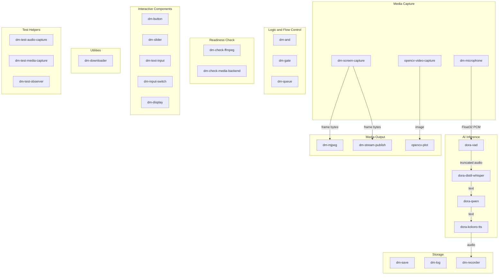
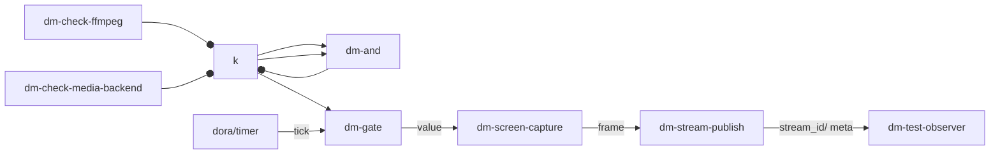
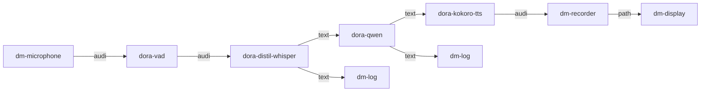

Dora Manager's `nodes/` directory includes **27 built-in nodes** covering the full spectrum of dataflow construction needs — from signal acquisition, logic control, and AI inference to storage persistence. These nodes are described through a unified `dm.json` contract for ports, configuration, and runtime metadata, and can be directly referenced in YAML dataflows without additional installation. This article provides a detailed analysis of each node's design intent, port model, and typical usage by functional domain, helping you quickly find the "parts" needed to build dataflows.

Sources: [README.md](https://github.com/l1veIn/dora-manager/blob/master/nodes/README.md#L1-L12), [dm.json example](https://github.com/l1veIn/dora-manager/blob/master/nodes/dm-and/dm.json#L1-L103)

## Node Panorama and Classification

Before diving into individual nodes, let's establish a holistic view. The diagram below shows all 27 built-in nodes grouped by functional domain with data flow directions:

Sources: [nodes/](https://github.com/l1veIn/dora-manager/blob/master/nodes/README.md#L1-L12)

The connections above illustrate the most classic AI voice pipeline (Microphone → VAD → Whisper → Qwen → TTS) and media pipeline (Screen → Stream Publish → Web UI) data flow directions. Below we expand on each functional domain.

### Quick Reference Table

| Category | Node ID | Language | Description | Core Capability Markers |
|----------|---------|----------|-------------|------------------------|
| Media Capture | `dm-microphone` | Python | Microphone audio capture with device selection | `media` |
| Media Capture | `dm-screen-capture` | Python | Screen capture | — |
| Media Capture | `opencv-video-capture` | Python | OpenCV camera capture | — |
| Media Output | `dm-mjpeg` | Rust | MJPEG-over-HTTP preview endpoint | `media` |
| Media Output | `dm-stream-publish` | Python | Frame stream publishing to media backend | `media` |
| Media Output | `opencv-plot` | Python | OpenCV image annotation drawing | — |
| AI Inference | `dora-distil-whisper` | Python | Whisper speech-to-text | — |
| AI Inference | `dora-vad` | Python | Silero VAD voice activity detection | — |
| AI Inference | `dora-qwen` | Python | Qwen LLM text generation | — |
| AI Inference | `dora-kokoro-tts` | Python | Kokoro text-to-speech | — |
| Logic Flow Control | `dm-and` | Python | Boolean AND aggregation | — |
| Logic Flow Control | `dm-gate` | Python | Conditional gating (enable/disable passthrough) | — |
| Logic Flow Control | `dm-queue` | Rust | FIFO buffering and flush control | `streaming` |
| Readiness Check | `dm-check-ffmpeg` | Python | Check FFmpeg availability | — |
| Readiness Check | `dm-check-media-backend` | Python | Check media backend readiness | — |
| Interactive Components | `dm-button` | Python | Button trigger control | `interaction` |
| Interactive Components | `dm-slider` | Python | Numeric slider control | `interaction` |
| Interactive Components | `dm-text-input` | Python | Text input control | `interaction` |
| Interactive Components | `dm-input-switch` | Python | Boolean switch control | `interaction` |
| Interactive Components | `dm-display` | Python | Content display (text/image/audio, etc.) | — |
| Storage | `dm-save` | Python | Binary file persistence | — |
| Storage | `dm-log` | Python | Append-only log serialization | — |
| Storage | `dm-recorder` | Python | Audio WAV recording | `media` |
| Utilities | `dm-downloader` | Python | Model weight download and hash verification | — |
| Test | `dm-test-audio-capture` | Python | Fixed-duration microphone capture | `media` |
| Test | `dm-test-media-capture` | Python | Screenshot/screen recording capture | `media` |
| Test | `dm-test-observer` | Python | Multimodal event aggregation observer | `media` |

Sources: [nodes/](https://github.com/l1veIn/dora-manager/blob/master/nodes/README.md#L1-L12)

## Media Capture Nodes

Media capture nodes are responsible for acquiring raw data from physical devices or the operating system — they are the "source" end of dataflows.

### dm-microphone: Microphone Audio Capture

**dm-microphone** captures microphone input through the `sounddevice` library, outputting Float32 PCM audio streams. It supports runtime device switching — the node publishes available device lists (JSON) on the `devices` port at startup, and the UI layer can dynamically switch devices through the `device_id` input port. The capture buffer is controlled by the `max_duration` configuration, defaulting to 0.1 seconds (100ms), meaning one audio chunk is sent every 100ms.

| Port | Direction | Type | Description |
|------|-----------|------|-------------|
| `audio` | output | Float32 PCM | Continuous audio stream |
| `devices` | output | UTF-8 JSON | Available device list |
| `device_id` | input | UTF-8 | Select device ID |
| `tick` | input | null | Heartbeat keepalive |

Key configurations: `sample_rate` (default 16000Hz), `max_duration` (buffer duration, default 0.1s).

Sources: [dm-microphone/dm.json](https://github.com/l1veIn/dora-manager/blob/master/nodes/dm-microphone/dm.json#L1-L105), [dm_microphone/main.py](https://github.com/l1veIn/dora-manager/blob/master/nodes/dm-microphone/dm_microphone/main.py#L1-L140)

### dm-screen-capture: Screen Capture

**dm-screen-capture** captures screen frames through the FFmpeg backend, encoding them as PNG or JPEG bytes for output. It supports three capture modes: `once` (capture one frame at startup then exit), `repeat` (continuous screenshots at fixed intervals), and `triggered` (capture one frame each time the `trigger` port receives an event). In `triggered` mode, it is typically combined with `dm-gate` and timers for throttling control.

| Port | Direction | Type | Description |
|------|-----------|------|-------------|
| `trigger` | input | null | Optional trigger signal (triggered mode) |
| `frame` | output | UInt8 encoded frame | PNG or JPEG image bytes |
| `meta` | output | UTF-8 JSON | Frame metadata |

Key configurations: `mode` (once/repeat/triggered), `width`/`height` (default 1280×720), `output_format` (png/jpeg), `interval_sec` (repeat mode interval).

Sources: [dm-screen-capture/dm.json](https://github.com/l1veIn/dora-manager/blob/master/nodes/dm-screen-capture/dm.json#L1-L133), [dm-screen-capture/README.md](https://github.com/l1veIn/dora-manager/blob/master/nodes/dm-screen-capture/README.md#L1-L28)

### opencv-video-capture: OpenCV Camera Capture

**opencv-video-capture** is a community node from Dora Hub that uses OpenCV's `VideoCapture` interface for camera capture. It triggers frame capture through the `tick` port, outputting image arrays with width/height/encoding metadata. This node's `dm.json` does not declare `ports`; port information comes from YAML example conventions in its README documentation.

Key environment variables: `PATH` (camera index, default 0), `IMAGE_WIDTH`/`IMAGE_HEIGHT`, `JPEG_QUALITY` (encoding quality).

Sources: [opencv-video-capture/README.md](https://github.com/l1veIn/dora-manager/blob/master/nodes/opencv-video-capture/README.md#L1-L75), [opencv-video-capture/dm.json](https://github.com/l1veIn/dora-manager/blob/master/nodes/opencv-video-capture/dm.json#L1-L39)

## Media Output Nodes

Media output nodes are responsible for presenting frames or images from the dataflow to users or pushing them to downstream services.

### dm-mjpeg: MJPEG-over-HTTP Real-Time Preview

**dm-mjpeg** is one of only two Rust native nodes in Dora Manager (the other being `dm-queue`). It starts a local HTTP server based on `axum`, exposing frames from the Dora dataflow in MJPEG format to browsers. It supports three endpoints: `/stream` (MJPEG stream), `/snapshot.jpg` (single frame snapshot), and `/healthz` (health check).

| Port | Direction | Type | Description |
|------|-----------|------|-------------|
| `frame` | input | UInt8 | Image bytes (supports jpeg/rgb8/rgba8/yuv420p) |

Internally uses the `tokio` async runtime to separate the Dora event loop and HTTP service threads, passing frame data through unbounded channels. The `drop_if_no_client` configuration (default true) skips frame processing when no HTTP clients are connected, saving CPU.

Sources: [dm-mjpeg/dm.json](https://github.com/l1veIn/dora-manager/blob/master/nodes/dm-mjpeg/dm.json#L1-L102), [dm-mjpeg/README.md](https://github.com/l1veIn/dora-manager/blob/master/nodes/dm-mjpeg/README.md#L1-L20), [dm-mjpeg/src/main.rs](https://github.com/l1veIn/dora-manager/blob/master/nodes/dm-mjpeg/src/main.rs#L1-L131)

### dm-stream-publish: Stream Media Publishing

**dm-stream-publish** receives encoded image frames and pushes them to the dm-server media backend (based on mediamtx) through an FFmpeg pipeline, enabling the Web UI's `VideoPanel` to render real-time video streams. It registers streams with dm-server via HTTP API at startup, then continuously pushes H.264 encoded data to RTSP/RTMP endpoints.

| Port | Direction | Type | Description |
|------|-----------|------|-------------|
| `frame` | input | UInt8 | PNG/JPEG encoded image |
| `stream_id` | output | UTF-8 | Published stream identifier |
| `meta` | output | UTF-8 JSON | Stream metadata |

Typical combination pattern: `dm-screen-capture` (triggered mode) → `dm-stream-publish`, with a complete example in [system-test-stream.yml](https://github.com/l1veIn/dora-manager/blob/master/tests/dataflows/system-test-stream.yml#L39-L65).

Sources: [dm-stream-publish/dm.json](https://github.com/l1veIn/dora-manager/blob/master/nodes/dm-stream-publish/dm.json#L1-L123), [dm-stream-publish/README.md](https://github.com/l1veIn/dora-manager/blob/master/nodes/dm-stream-publish/README.md#L1-L23)

### opencv-plot: OpenCV Image Annotation

**opencv-plot** draws bounding boxes (bbox), text, and annotations on base images, typically for visualizing object detection results. Inputs include `image` (base image array), `bbox` (detection boxes/confidence/labels), and `text` (annotation text), with output being the annotated image. This node follows Dora Hub's image data conventions, carrying width/height/encoding information through metadata.

Sources: [opencv-plot/README.md](https://github.com/l1veIn/dora-manager/blob/master/nodes/opencv-plot/README.md#L1-L94)

## AI Inference Nodes

AI inference nodes encapsulate model inference capabilities across speech, language, and vision domains, forming Dora Manager's most valuable "intelligence layer."

### dora-vad: Voice Activity Detection

**dora-vad** is based on the Silero VAD model, detecting speech start and end points in continuous audio streams, outputting only audio segments containing valid speech. It continuously accumulates audio buffers and triggers output only when speech end is detected (silence lasting more than `MIN_SILENCE_DURATION_MS`, default 200ms). `MAX_AUDIO_DURATION_S` (default 75s) limits maximum speech duration to avoid infinite waiting.

| Port | Direction | Type | Description |
|------|-----------|------|-------------|
| `audio` | input | Float32 | Continuous audio stream (8kHz or 16kHz) |
| `audio` | output | Float32 | Truncated speech segment |
| `timestamp_start` | output | Int | Speech start timestamp |
| `timestamp_end` | output | Int | Speech end timestamp |

Sources: [dora-vad/dora_vad/main.py](https://github.com/l1veIn/dora-manager/blob/master/nodes/dora-vad/dora_vad/main.py#L1-L90), [dora-vad/README.md](https://github.com/l1veIn/dora-manager/blob/master/nodes/dora-vad/README.md#L1-L44)

### dora-distil-whisper: Speech-to-Text

**dora-distil-whisper** wraps OpenAI Whisper series models (default `whisper-large-v3-turbo`), converting audio to text. On macOS it automatically switches to MLX Whisper for accelerated inference, while on Linux it uses HuggingFace Transformers CUDA inference. The node includes built-in denoising logic (`remove_text_noise`) and repetition detection (`cut_repetition`) to filter model hallucination outputs.

| Port (from README) | Direction | Type | Description |
|---------------------|-----------|------|-------------|
| `input` | input | Float32 audio | Speech segment from VAD |
| `text` | output | UTF-8 | Transcribed text |

Key environment variables: `TARGET_LANGUAGE` (default english), `MODEL_NAME_OR_PATH`, `TRANSLATE` (whether in translation mode).

Sources: [dora-distil-whisper/dora_distil_whisper/main.py](https://github.com/l1veIn/dora-manager/blob/master/nodes/dora-distil-whisper/dora_distil_whisper/main.py#L1-L200), [dora-distil-whisper/README.md](https://github.com/l1veIn/dora-manager/blob/master/nodes/dora-distil-whisper/README.md#L1-L29)

### dora-qwen: Qwen LLM Inference

**dora-qwen** wraps Qwen2.5 series language models, supporting multi-turn conversations. On macOS it uses `llama-cpp-python` (GGUF format), while on Linux it uses HuggingFace Transformers + CUDA. The default model is `Qwen/Qwen2.5-0.5B-Instruct-GGUF`, replaceable with larger parameter models via the `MODEL_NAME_OR_PATH` environment variable.

This node maintains conversation history (`history` list), supporting injection of system prompts, images, and tool call results through special prefixes (`<|im_start|>`, `<|vision_start|>`, `<|tool|>`). The `ACTIVATION_WORDS` environment variable can restrict generation to only when user input contains specific words.

| Port (from code conventions) | Direction | Type | Description |
|-------------------------------|-----------|------|-------------|
| `text` / `system_prompt` / `tools` | input | UTF-8 | Conversation input, system prompt, tool definitions |
| `text` | output | UTF-8 | Model generated text |

Sources: [dora-qwen/dora_qwen/main.py](https://github.com/l1veIn/dora-manager/blob/master/nodes/dora-qwen/dora_qwen/main.py#L1-L230), [dora-qwen/README.md](https://github.com/l1veIn/dora-manager/blob/master/nodes/dora-qwen/README.md#L1-L38)

### dora-kokoro-tts: Text-to-Speech

**dora-kokoro-tts** converts text to speech based on the Kokoro-82M model. It supports automatic Chinese/English detection — when Chinese characters are detected, it automatically switches to the `lang_code="z"` pipeline. It outputs 24kHz Float32 audio streams, sent in sentence segments. Text preprocessing removes `<think...</think>` tag content (from LLM internal reasoning) to avoid reading the reasoning process aloud.

| Port (from code conventions) | Direction | Type | Description |
|-------------------------------|-----------|------|-------------|
| `text` | input | UTF-8 | Text to synthesize |
| `audio` | output | Float32 | 24kHz PCM audio |

Key environment variables: `LANGUAGE` (default "a", i.e., American English), `VOICE` (default "af_heart"), `REPO_ID` (default "hexgrad/Kokoro-82M").

Sources: [dora-kokoro-tts/dora_kokoro_tts/main.py](https://github.com/l1veIn/dora-manager/blob/master/nodes/dora-kokoro-tts/dora_kokoro_tts/main.py#L1-L81), [dora-kokoro-tts/README.md](https://github.com/l1veIn/dora-manager/blob/master/nodes/dora-kokoro-tts/README.md#L1-L39)

## Logic and Flow Control Nodes

Logic nodes handle conditional branching, signal aggregation, and buffering control in dataflows — they don't produce "new" data but decide "when and how data flows."

### dm-and: Boolean AND Aggregation

**dm-and** performs logical AND operations on multiple boolean inputs, typically used for aggregating multiple readiness check signals. It predefines 4 boolean input ports (a/b/c/d), with `expected_inputs` configuration specifying the subset of inputs participating in the AND. When `require_all_seen=true` (default), all expected inputs must receive at least one event before outputting `true`.

| Port | Direction | Type | Description |
|------|-----------|------|-------------|
| `a`/`b`/`c`/`d` | input | Bool | Boolean inputs |
| `ok` | output | Bool | AND result |
| `details` | output | UTF-8 JSON | Detailed info containing each input's status |

Typical usage: aggregating `dm-check-ffmpeg/ok` and `dm-check-media-backend/ok`, only starting the streaming pipeline when both are ready.

Sources: [dm-and/dm.json](https://github.com/l1veIn/dora-manager/blob/master/nodes/dm-and/dm.json#L1-L103), [dm-and/dm_and/main.py](https://github.com/l1veIn/dora-manager/blob/master/nodes/dm-and/dm_and/main.py#L1-L94)

### dm-gate: Conditional Gating

**dm-gate** implements a simple "gate switch" — only when the `enabled` input is `true` will events from the `value` input be forwarded to the output. When the gate is closed, events are silently discarded. The `emit_on_enable` configuration (default false) controls whether to immediately forward the last cached value when the gate opens.

| Port | Direction | Type | Description |
|------|-----------|------|-------------|
| `enabled` | input | Bool | Gate switch |
| `value` | input | any | Value to gate |
| `value` | output | any | Forwarded value |

Typical usage: `dm-and/ok` → `dm-gate/enabled`, combined with timers to implement "trigger only after ready" patterns.

Sources: [dm-gate/dm.json](https://github.com/l1veIn/dora-manager/blob/master/nodes/dm-gate/dm.json#L1-L72), [dm-gate/dm_gate/main.py](https://github.com/l1veIn/dora-manager/blob/master/nodes/dm-gate/dm_gate/main.py#L1-L82)

### dm-queue: FIFO Buffering and Flow Control

**dm-queue** is a Rust native node providing FIFO buffering, flush signaling, ring overwrite, and disk spillover. It is the core tool for handling rate mismatch problems in dataflows — when producer speed exceeds consumer speed, data queues up and flushes all at once when conditions are met.

| Port | Direction | Type | Description |
|------|-----------|------|-------------|
| `data` | input | Binary | Arbitrary data to buffer |
| `control` | input | UTF-8 | Control commands (flush/reset/stop) |
| `tick` | input | null | Periodic heartbeat (triggers timeout flush) |
| `flushed` | output | Binary | Flushed data |
| `buffering` | output | UTF-8 JSON | Buffer status |
| `error` | output | UTF-8 JSON | Error information |

Flush strategy via `flush_on` configuration: `signal` (flush on control command) or `full` (auto-flush when buffer is full). `flush_timeout` supports timeout auto-flush. `max_size_bytes` (default 2MB) and `max_size_buffers` (default 100) limit buffer size.

Sources: [dm-queue/dm.json](https://github.com/l1veIn/dora-manager/blob/master/nodes/dm-queue/dm.json#L1-L154), [dm-queue/README.md](https://github.com/l1veIn/dora-manager/blob/master/nodes/dm-queue/README.md#L1-L18), [dm-queue/src/main.rs](https://github.com/l1veIn/dora-manager/blob/master/nodes/dm-queue/src/main.rs#L1-L185)

## Readiness Check Nodes

Readiness Check nodes follow a unified output pattern: `ok` (Bool) and `details` (UTF-8 JSON), supporting three run modes — `once` (check once at startup), `repeat` (periodic repeated checks), and `triggered` (check when receiving trigger events).

### dm-check-ffmpeg

Checks whether the FFmpeg executable is installed on the local system. Specifies the path via `ffmpeg_path` configuration (default `ffmpeg`), attempts to execute `ffmpeg -version` and parse the result.

Sources: [dm-check-ffmpeg/dm.json](https://github.com/l1veIn/dora-manager/blob/master/nodes/dm-check-ffmpeg/dm.json#L1-L84)

### dm-check-media-backend

Checks whether dm-server's media backend service is ready. Probes via HTTP request to `server_url`'s (default `http://127.0.0.1:3210`) health check endpoint.

Sources: [dm-check-media-backend/dm.json](https://github.com/l1veIn/dora-manager/blob/master/nodes/dm-check-media-backend/dm.json#L1-L84)

## Interactive Component Nodes

Interactive nodes are Dora Manager's "bidirectional bridges" — they make the Web UI a first-class participant in dataflows. These nodes declare an `interaction` field in `dm.json`, marking them as part of the interaction system.

> For the complete architecture of the interaction system, see [Interaction System: dm-input / dm-display / WebSocket Message Flow](21-interaction-system).

### dm-button: Button Control

Pure output node. When a user clicks the button in the UI, the `click` port emits a UTF-8 event. Typical scenarios are one-time operations like "trigger download" or "start recording."

Configuration: `label` (button label, default "Run").

Sources: [dm-button/dm.json](https://github.com/l1veIn/dora-manager/blob/master/nodes/dm-button/dm.json#L1-L74)

### dm-slider: Numeric Slider

Pure output node. When a user drags the slider, the `value` port emits a Float64 number. Supports `min_val`/`max_val`/`step`/`default_value` configuration.

Sources: [dm-slider/dm.json](https://github.com/l1veIn/dora-manager/blob/master/nodes/dm-slider/dm.json#L1-L84)

### dm-text-input: Text Input

Pure output node. When a user submits text, the `value` port emits a UTF-8 string. Supports `multiline` (multi-line text area) and `placeholder` configuration.

Sources: [dm-text-input/dm.json](https://github.com/l1veIn/dora-manager/blob/master/nodes/dm-text-input/dm.json#L1-L89)

### dm-input-switch: Boolean Switch

Pure output node. When a user toggles the switch, the `value` port emits a boolean value. Configuration `default_value` controls the initial state.

Sources: [dm-input-switch/dm.json](https://github.com/l1veIn/dora-manager/blob/master/nodes/dm-input-switch/dm.json#L1-L79)

### dm-display: Content Display

Pure input node. It receives two types of data and pushes them to dm-server via WebSocket for display in the Web UI's run workspace:
- **`path` port**: Receives file paths (typically from `dm-save`, etc.), automatically inferring rendering mode based on file extension (`.png` → image, `.wav` → audio, `.json` → json, etc.)
- **`data` port**: Receives inline content (text/JSON), pushing directly to UI without going through the filesystem

The `render` configuration supports seven modes: `auto`/`text`/`image`/`audio`/`video`/`json`/`markdown`. In `auto` mode, the input port and content type are used to automatically select.

Sources: [dm-display/dm.json](https://github.com/l1veIn/dora-manager/blob/master/nodes/dm-display/dm.json#L1-L86), [dm-display/dm_display/main.py](https://github.com/l1veIn/dora-manager/blob/master/nodes/dm-display/dm_display/main.py#L1-L185)

## Storage Nodes

Storage nodes persist content from the dataflow to disk. They share a convention: write paths are under the current run's `runs/:id/out/` directory, injected via the `DM_RUN_OUT_DIR` environment variable.

### dm-save: File Persistence

**dm-save** writes binary payloads to disk, outputting the absolute path of the written file. It is a key intermediate node in the "frame → file → display" pattern, typically combined with `dm-display`.

Configuration highlights:
- **Naming templates**: `{timestamp}_{seq}` supports timestamp and sequence number variables
- **Capacity control**: `max_files`/`max_total_size`/`max_age` three-dimensional limits
- **Overwrite mode**: When `overwrite_latest=true`, maintains a stable `latest` file

Sources: [dm-save/dm.json](https://github.com/l1veIn/dora-manager/blob/master/nodes/dm-save/dm.json#L1-L108), [dm-save/README.md](https://github.com/l1veIn/dora-manager/blob/master/nodes/dm-save/README.md#L1-L24)

### dm-log: Append-Only Logging

**dm-log** serializes input events and appends them to log files, implemented based on the `loguru` library. Supports `text`/`json`/`csv` serialization formats, along with log rotation strategies like `rotation` (e.g., "50 MB") and `retention` (e.g., "7 days").

Sources: [dm-log/dm.json](https://github.com/l1veIn/dora-manager/blob/master/nodes/dm-log/dm.json#L1-L103)

### dm-recorder: Audio WAV Recording

**dm-recorder** aggregates Float32 PCM audio chunks into complete WAV files. Output paths can be used with `dm-display`'s `path` port for audio playback. Supports `sample_rate` and `channels` configuration.

Sources: [dm-recorder/dm.json](https://github.com/l1veIn/dora-manager/blob/master/nodes/dm-recorder/dm.json#L1-L88)

## Utility and Test Nodes

### dm-downloader: Model Weight Downloader

**dm-downloader** is a downloader node with UI feedback. It supports `sha256:hex` format hash verification, automatic extraction of `tar.gz`/`zip` formats, atomic writes (download to `.dm-tmp` then rename), and failure retry. Lifecycle: Checking → Ready/Waiting → Downloading → Verifying → (Extracting) → Ready.

Download directories are automatically selected by platform: macOS uses `~/Library/Application Support/dm/downloads/`, Linux uses `~/.local/share/dm/downloads/`.

Sources: [dm-downloader/README.md](https://github.com/l1veIn/dora-manager/blob/master/nodes/dm-downloader/README.md#L1-L70), [dm-downloader/dm.json](https://github.com/l1veIn/dora-manager/blob/master/nodes/dm-downloader/dm.json#L1-L101)

### Test Helper Nodes

Three test nodes are used for system test dataflows, simulating actual node behavior without depending on real hardware:

| Node | Function |
|------|----------|
| `dm-test-audio-capture` | Fixed-duration microphone capture, outputs `audio`/`audio_stream`/`meta` |
| `dm-test-media-capture` | Screenshot/screen recording capture, outputs `image`/`video`/`meta` |
| `dm-test-observer` | Aggregates multi-source metadata, outputs human-readable summaries and machine-readable JSON |

Sources: [dm-test-audio-capture/dm.json](https://github.com/l1veIn/dora-manager/blob/master/nodes/dm-test-audio-capture/dm.json#L1-L143), [dm-test-media-capture/dm.json](https://github.com/l1veIn/dora-manager/blob/master/nodes/dm-test-media-capture/dm.json#L1-L102), [dm-test-observer/dm.json](https://github.com/l1veIn/dora-manager/blob/master/nodes/dm-test-observer/dm.json#L1-L102)

## Typical Pipeline Combinations

The following demonstrates two actual system test dataflows showing how nodes work together.

### Streaming Pipeline: Conditional Startup + Real-Time Publishing

This pipeline demonstrates the complete "readiness check → AND aggregation → gated timing → capture → publish" pattern. Only when both FFmpeg and the media backend are ready does the timer signal pass through the gate to trigger screenshots, with screenshot frames pushed to the Web UI via `dm-stream-publish`.

Sources: [system-test-stream.yml](https://github.com/l1veIn/dora-manager/blob/master/tests/dataflows/system-test-stream.yml#L1-L77)

### AI Voice Conversation Pipeline

This is the core path of the complete pipeline in [qwen-dev.yml](https://github.com/l1veIn/dora-manager/blob/master/tests/dataflows/qwen-dev.yml): microphone capture → VAD speech detection → Whisper transcription → Qwen response generation → Kokoro TTS speech synthesis → Recorder audio file recording → Display playback. Each AI node's output is simultaneously persisted via `dm-log` and displayed in real-time via `dm-display`.

Sources: [qwen-dev.yml](https://github.com/l1veIn/dora-manager/blob/master/tests/dataflows/qwen-dev.yml#L1-L257)

## Design Pattern Summary

Looking across all built-in nodes, several recurring design patterns emerge:

**Readiness Signal Pattern**: `dm-check-*` nodes output unified `{ok, details}` pairs, aggregated through `dm-and` to control `dm-gate`, ensuring downstream pipelines only start when dependencies are ready.

**Storage Family Pattern**: `dm-save`/`dm-log`/`dm-recorder` share the "write file → output path → dm-display display" link, with `DM_RUN_OUT_DIR` environment variable uniformly managing output directories.

**Interactive Control Pattern**: `dm-button`/`dm-slider`/`dm-text-input`/`dm-input-switch` are all pure output nodes that declare control types through `interaction` metadata, with the Web UI runtime automatically rendering corresponding widgets.

**Port Schema Declaration**: Dora Manager prefixed (`dm-*`) nodes declare complete Arrow type schemas in the `ports` array of `dm.json`, while Dora Hub prefixed (`dora-*`/`opencv-*`) nodes mostly have empty arrays, with port information relying on README documentation conventions. For the complete port validation specification, see [Port Schema Specification: Port Validation Based on Arrow Type System](20-port-schema).

Sources: [dm-exclusive-nodes.md](https://github.com/l1veIn/dora-manager/blob/master/docs/dm-exclusive-nodes.md#L1-L92)

## Further Reading

- [Port Schema Specification: Port Validation Based on Arrow Type System](20-port-schema) — Understand the design principles of the port type system
- [Interaction System: dm-input / dm-display / WebSocket Message Flow](21-interaction-system) — Runtime communication architecture of interactive nodes
- [Developing Custom Nodes: dm.json Complete Field Reference](22-custom-node-guide) — How to develop and register your own nodes
- [System Test Dataflows: Integration Test Strategy and Checklist](25-testing-strategy) — Usage scenarios of built-in test nodes
