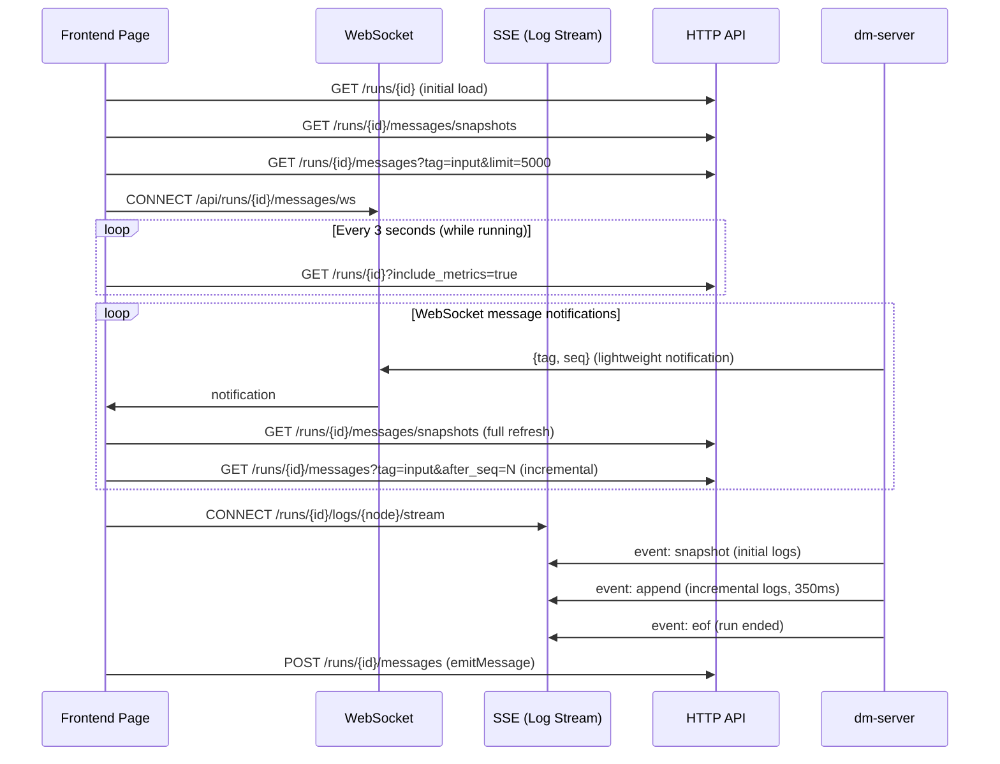

The Run Workspace is the most core and complex page in the Dora Manager frontend, hosting the full observability and interactivity capabilities for a single dataflow run instance. It integrates node logs, message streams, input controls, charts, and video streams into a free-layout panel system based on GridStack.js, where users can add, drag, resize, and maximize various panels on demand while observing the dataflow's running state in real time. This article breaks down its three-layer page skeleton, the 12-column grid engine and Svelte bridging mechanism, the registry architecture and rendering pipeline for six panel types, the real-time communication model (WebSocket + SSE + polling), and the layout persistence and migration strategy.

Sources: [+page.svelte](https://github.com/l1veIn/dora-manager/blob/main/web/src/routes/runs/[id]/+page.svelte#L1-L625), [Workspace.svelte](https://github.com/l1veIn/dora-manager/blob/main/web/src/lib/components/workspace/Workspace.svelte#L1-L175)

## Page Skeleton: Three-Layer Section Layout

The route entry for the Run Workspace is `web/src/routes/runs/[id]/+page.svelte`, using a classic "Header + Sidebar + Main Content" three-layer section layout. The entire page is vertically arranged with `flex flex-col`: the top is a fixed-height `RunHeader`, and below is a `flex-1` horizontal flex container containing a collapsible sidebar and the Workspace main area.

```
┌──────────────────────────────────────────────────────────────────┐
│  RunHeader                                                       │
│  [← Runs / run-name] [Status] [Stop] [YAML] [Transpiled] [Graph]│
├─────────────┬────────────────────────────────────────────────────┤
│  Sidebar    │  Workspace Toolbar (h-10)                          │
│  (300px,    │  [Toggle Sidebar] [Workspace]    [+ Add Panel ▾]   │
│  collapsible)├────────────────────────────────────────────────────┤
│             │  GridStack 12-Column Workspace                    │
│  ┌────────┐ │  ┌────────────────────┬──────────────┐            │
│  │Summary │ │  │  Message Panel     │ Input Panel  │            │
│  │Card    │ │  │  (w:8, h:5)        │ (w:4, h:5)   │            │
│  ├────────┤ │  └────────────────────┴──────────────┘            │
│  │Node    │ │  ┌───────────────────────────────────┐            │
│  │List    │ │  │  Terminal Panel (w:12, h:4)        │            │
│  │(scroll)│ │  └───────────────────────────────────┘            │
│  └────────┘ │                                                    │
└─────────────┴────────────────────────────────────────────────────┘
```

**RunHeader** is the fixed navigation bar at the top of the page, displaying the run name, a status badge (`RunStatusBadge`), and three read-only view entries -- YAML source, Transpiled YAML, and the Runtime Topology Graph. The first two are displayed in a Dialog modal via CodeMirror read-only editors, while Graph calls the `RuntimeGraphView` component to render the full node topology. All view data is lazily loaded on demand, with HTTP requests only triggered on first click. When the run is in `running` state, a Stop button also appears on the right side; clicking it triggers `stopRun()` to send a POST request and starts burst polling (4 times at 1-second intervals) to quickly capture state changes.

Sources: [RunHeader.svelte](https://github.com/l1veIn/dora-manager/blob/main/web/src/routes/runs/[id]/RunHeader.svelte#L117-L226), [+page.svelte](https://github.com/l1veIn/dora-manager/blob/main/web/src/routes/runs/[id]/+page.svelte#L489-L531)

## Left Sidebar: Run Summary and Node List

The left sidebar has a fixed width of 300px and its collapse/expand state is controlled by `isRunSidebarOpen`, with the collapsed state persisted to `localStorage` (key: `dm-run-sidebar-open-{run.name}`). The sidebar consists of two child components stacked vertically:

**RunSummaryCard** displays a summary of the run's metadata: Run ID, Dora UUID, start time, duration, exit code, observed node count (observed / expected), and run-level CPU and memory metric badges. When the run includes transpile details (`run.transpile`), it also shows Working Dir and Resolved Flow (the resolved path for each node).

**RunNodeList** displays all nodes in the run as a list. Each node entry shows the node ID and runtime-attached CPU / memory metric badges (from the `metrics.nodes` array). When a user clicks a node, it triggers the `onNodeSelect` callback (i.e., `openNodeTerminal()`), which automatically locates or creates a terminal panel for that node in the Workspace -- this is the core interaction path linking the sidebar with the main workspace.

Sources: [RunSummaryCard.svelte](https://github.com/l1veIn/dora-manager/blob/main/web/src/routes/runs/[id]/RunSummaryCard.svelte#L1-L195), [RunNodeList.svelte](https://github.com/l1veIn/dora-manager/blob/main/web/src/routes/runs/[id]/RunNodeList.svelte#L1-L111), [+page.svelte](https://github.com/l1veIn/dora-manager/blob/main/web/src/routes/runs/[id]/+page.svelte#L517-L531)

## GridStack Grid Engine and Svelte Bridging

The Workspace component is the physical container for the panel system, using **GridStack.js** as the underlying grid layout engine. GridStack is initialized as a 12-column responsive grid with 80px cell height and 10px margin, with `float: true` enabled to allow vertical gaps between panels. Dragging is triggered only through the `.grid-drag-handle` class on the title bar, and resize handles are restricted to south, east, and southeast directions.

```typescript
GridStack.init({
    column: 12,
    cellHeight: 80,
    margin: 10,
    float: true,
    animate: true,
    handle: '.grid-drag-handle',
    resizable: { handles: 's, e, se' },
}, gridContainer);
```

### Svelte Action Bridging: `gridWidget`

GridStack needs to directly manipulate DOM element positions and sizes, while Svelte reactively manages DOM lifecycle through `{#each}` -- these two systems have potential conflicts. Workspace achieves seamless bridging through a **Svelte Action** called `gridWidget`, with the following lifecycle:

1. **Creation phase**: When Svelte's `{#each}` loop renders each `gridItems` entry, `use:gridWidget={dataItem}` writes the GridStack-required `gs-id`/`gs-x`/`gs-y`/`gs-w`/`gs-h` attributes to the DOM node, then calls `gridServer.makeWidget(node)` after `tick()` to bring it under GridStack's physics engine control.
2. **Change synchronization**: GridStack's `change` event fires after the user drags or resizes; the callback iterates over all changed items, writes the new `x`/`y`/`w`/`h` back to the `gridItems` state array, and propagates changes upward to `+page.svelte` via `onLayoutChange`.
3. **Destruction phase**: When Svelte removes an entry from `{#each}`, the Action's `destroy()` callback is triggered, calling `gridServer.removeWidget(node, false)` (`false` means only clearing GridStack metadata; DOM destruction is left to Svelte).

Sources: [Workspace.svelte](https://github.com/l1veIn/dora-manager/blob/main/web/src/lib/components/workspace/Workspace.svelte#L48-L127)

### Layout Persistence and Schema Migration

Layout is automatically persisted to `localStorage` via `handleLayoutChange()`, with the key `dm-workspace-layout-{run.name}`. On first page load, when `fetchRunDetail()` detects a non-empty run node list and `workspaceLoaded` is false, it restores the saved layout from `localStorage` and runs it through `normalizeWorkspaceLayout()` for schema migration.

`normalizeWorkspaceLayout()` is responsible for upgrading old layout data to the current version. Typical migration rules include: renaming the old `stream` panel type to `message`; converting `subscribedSourceId` (a single string) to a `nodes` array; converting `subscribedInputs` to a `nodes` array with default `tags: ["widgets"]`; and removing deprecated `subscribedSourceId`/`subscribedSources`/`subscribedInputs` fields.

Sources: [types.ts](https://github.com/l1veIn/dora-manager/blob/main/web/src/lib/components/workspace/types.ts#L108-L146), [+page.svelte](https://github.com/l1veIn/dora-manager/blob/main/web/src/routes/runs/[id]/+page.svelte#L76-L84), [+page.svelte](https://github.com/l1veIn/dora-manager/blob/main/web/src/routes/runs/[id]/+page.svelte#L264-L281)

## Data Model: WorkspaceGridItem

Each grid panel is described by the `WorkspaceGridItem` type, which is the core data structure of the entire panel system:

| Field | Type | Description |
|---|---|---|
| `id` | `string` | Randomly generated 7-character base36 unique identifier |
| `widgetType` | `PanelKind` | Panel type enum: `message` / `input` / `chart` / `table` / `video` / `terminal` |
| `config` | `PanelConfig` | Panel-specific configuration (nodes/tags/nodeId/gridCols, etc.) |
| `x` / `y` | `number` | GridStack grid coordinates |
| `w` / `h` | `number` | GridStack grid dimensions (columns x rows) |
| `min` | `{w, h}?` | Minimum size constraint (optional) |

`getDefaultLayout()` creates a default dual-panel layout on first access when there is no localStorage cache -- a Message panel (8 columns x 5 rows) on the left occupying the main area, and an Input panel (4 columns x 5 rows) on the right for interactive controls.

Sources: [types.ts](https://github.com/l1veIn/dora-manager/blob/main/web/src/lib/components/workspace/types.ts#L1-L76)

## Panel Registry and Rendering Pipeline

The panel system uses the **Registry Pattern**, where each panel type is uniformly defined by a `PanelDefinition` object. The registry is maintained in `registry.ts` as a `Record<PanelKind, PanelDefinition>`, queried via `getPanelDefinition(kind)`, and falls back to a `message` panel when not found.

### PanelDefinition Structure

| Field | Type | Description |
|---|---|---|
| `kind` | `PanelKind` | Panel type identifier |
| `title` | `string` | Title bar display name |
| `dotClass` | `string` | Title bar colored dot CSS class |
| `sourceMode` | `"history" \| "snapshot" \| "external"` | Data fetching mode |
| `supportedTags` | `string[] \| "*"` | Message tags the panel cares about |
| `defaultConfig` | `PanelConfig` | Default configuration when creating a new panel |
| `component` | Svelte component | Panel rendering component reference |

### Three Data Fetching Modes

The way panels fetch data is distinguished by `sourceMode`, which determines how panels obtain data from the runtime:

| sourceMode | Mechanism | Applicable Panels |
|---|---|---|
| `history` | Seq-based incremental message history queries (`loadInitial`/`loadNew`/`loadOld`) | Message |
| `snapshot` | Filtering from `context.snapshots` array by nodes/tags | Input, Chart, Table, Video |
| `external` | Panel manages its own data fetching (e.g., SSE connection) | Terminal |

### Rendering Pipeline

The Workspace's `{#each gridItems}` loop executes a unified rendering pipeline for each entry:

```
gridItems[i]
    -> getPanelDefinition(item.widgetType)  // registry lookup
    -> <div use:gridWidget={dataItem}>      // Svelte Action bridging GridStack
        -> RootWidgetWrapper                // unified shell (title bar + maximize + close)
            -> PanelComponent               // specific panel component
                props: { item, api, context, onConfigChange }
```

**RootWidgetWrapper** provides a unified shell for all panels -- a 32px-tall `.grid-drag-handle` title bar containing a colored dot identifier, panel name, and maximize/close buttons. Double-clicking the title bar or clicking the maximize button expands the panel to a fullscreen overlay (`fixed inset-0 z-50` with a frosted glass background); pressing Escape restores it. The close button calls `api.close(item.id)` to remove the panel from the layout.

Panel components receive unified `PanelRendererProps`, where `PanelContext` is the core context object for panel-runtime interaction:

```typescript
type PanelContext = {
    runId: string;                                    // Run ID
    snapshots: any[];                                 // Message snapshot list
    inputValues: Record<string, any>;                 // Current values of input controls
    nodes: any[];                                     // Run node list
    refreshToken: number;                             // Data refresh token (monotonically increasing)
    isRunActive: boolean;                             // Whether the run is active
    emitMessage: (message: {...}) => Promise<void>;   // Send message to the dataflow
};
```

Sources: [registry.ts](https://github.com/l1veIn/dora-manager/blob/main/web/src/lib/components/workspace/panels/registry.ts#L1-L80), [types.ts](https://github.com/l1veIn/dora-manager/blob/main/web/src/lib/components/workspace/panels/types.ts#L1-L41), [RootWidgetWrapper.svelte](https://github.com/l1veIn/dora-manager/blob/main/web/src/lib/components/workspace/widgets/RootWidgetWrapper.svelte#L1-L45)

## Six Panel Implementations in Detail

### Message Panel: Bidirectional Infinite-Scroll Message Stream

The Message Panel is one of the most complex panels, using `createMessageHistoryState()` to create a Svelte 5 `$state`-based message state manager that supports incremental loading in three directions:

- **`loadInitial()`**: Loads the latest 50 messages on first access (fetched in reverse order with `desc: true` then arranged in chronological order), establishing `oldestSeq` and `newestSeq` baselines.
- **`loadNew()`**: Incrementally fetches new messages based on `newestSeq` with the `after_seq` parameter, triggered by `refreshToken` changes.
- **`loadOld()`**: When the user scrolls to the top (`scrollTop < 10`), loads historical messages upward based on `oldestSeq` with `before_seq` + `desc: true`, and preserves scroll position via `scrollHeight` delta to prevent jumping.

The top of the panel provides two dropdown filters -- filtering by node ID and by message tags (`text`/`image`/`json`/`markdown`/`audio`/`video` and dynamic tags). Message entries are rendered via the `MessageItem` component, which automatically selects the rendering method based on the `tag` field: `text` (monospace text block), `image` (Viewer.js fullscreen preview + download button), `video`/`audio` (native player), `json` (syntax-highlighted collapsible tree), `markdown` (prose layout), with unknown tags falling back to JSON view.

Sources: [MessagePanel.svelte](https://github.com/l1veIn/dora-manager/blob/main/web/src/lib/components/workspace/panels/message/MessagePanel.svelte#L1-L217), [message-state.svelte.ts](https://github.com/l1veIn/dora-manager/blob/main/web/src/lib/components/workspace/panels/message/message-state.svelte.ts#L1-L145), [MessageItem.svelte](https://github.com/l1veIn/dora-manager/blob/main/web/src/lib/components/workspace/panels/message/MessageItem.svelte#L1-L125)

### Input Panel: Responsive Control Grid

The Input Panel filters snapshots with `tag === "widgets"` from `context.snapshots`, expanding each snapshot's `payload.widgets` into a control grid. It supports 10 control types, each rendered by a dedicated Svelte component:

| Control Type | Component | Interaction |
|---|---|---|
| `input` | ControlInput | Single-line text input, Enter or click to send |
| `textarea` | ControlTextarea | Multi-line text |
| `button` | ControlButton | Click to trigger |
| `select` | ControlSelect | Dropdown selection |
| `slider` | ControlSlider | Range slider adjustment |
| `switch` | ControlSwitch | Toggle switch |
| `radio` | ControlRadio | Radio button group |
| `checkbox` | ControlCheckbox | Multi-select checkboxes |
| `path`/`file_picker`/`directory` | ControlPath | Path selector |
| `file` | Native `<input type="file">` | File upload (Base64 encoded) |

Control values are sent to the backend via `context.emitMessage()` in the format `{from: "web", tag: "input", payload: {to, output_id, value}}`, then forwarded by dm-server to the target node in the dataflow. The Input Panel maintains a value priority chain: `draftValues` (local drafts) > `context.inputValues` (server-sent values) > `widget.default` (control default values). The grid column count can be switched between 1/2/3 columns via a dropdown menu in the upper-right corner.

Sources: [InputPanel.svelte](https://github.com/l1veIn/dora-manager/blob/main/web/src/lib/components/workspace/panels/input/InputPanel.svelte#L1-L249)

### Chart Panel: Data Visualization

The Chart Panel uses the `layerchart` library to render line charts and bar charts. The data format requires the snapshot's `payload` to contain `labels` (X-axis label array) and `series` (data series array, each with `name`/`data`/`color`). The panel internally converts this structure into the flattened dataset format required by `layerchart`, and selects the `LineChart` or `BarChart` component based on the `payload.type` field. Each chart card displays a title, node ID, chart type badge, and optional description text.

Sources: [ChartPanel.svelte](https://github.com/l1veIn/dora-manager/blob/main/web/src/lib/components/workspace/panels/chart/ChartPanel.svelte#L1-L199)

### Video Panel: Dual-Mode Media Playback

The Video Panel wraps PlyrPlayer (based on Plyr + HLS.js), supporting two playback modes:

- **Manual Mode**: The user directly enters a media URL, selects the source type (HLS/Video/Audio/Auto), and can configure autoplay and muted toggles.
- **Message Mode**: Automatically extracts available media sources from snapshots with `tag === "stream"`. The `extractSources()` function is compatible with multiple payload formats -- `sources` array, `url`/`src` fields, `hls_url` field, `viewer.hls_url` field, and the legacy `path` format (automatically appending the MediaMTX HLS address). Source types are auto-detected via URL suffix and MIME type.

Mode switching uses a rounded toggle button group design, and node filtering and source selection use rounded Select dropdowns, maintaining a unified visual style.

Sources: [VideoPanel.svelte](https://github.com/l1veIn/dora-manager/blob/main/web/src/lib/components/workspace/panels/video/VideoPanel.svelte#L1-L350)

### Table Panel

The Table Panel currently reuses the MessagePanel component, displaying structured table data as a message stream with a default filter tag of `["table"]`.

Sources: [registry.ts](https://github.com/l1veIn/dora-manager/blob/main/web/src/lib/components/workspace/panels/registry.ts#L37-L45)

### Terminal Panel: Real-Time Node Log Terminal

The Terminal Panel is the only panel in the Run Workspace that uses the `external` data fetching mode; it manages its own data lifecycle, with core rendering delegated to the `RunLogViewer` component. The terminal is built on **xterm.js**, initialized via the `createManagedTerminal()` factory function -- configured with JetBrains Mono monospace font, 12px font size, 1.35 line height, 5000-line scrollback buffer, and a dark blue theme (`#0b1020` background). `FitAddon` ensures the terminal automatically adapts to container size.

The log fetching strategy is divided into two paths based on run state:

- **Running (`isRunActive = true`)**: Establishes a real-time log stream via **SSE (Server-Sent Events)** connecting to `/api/runs/{id}/logs/{nodeId}/stream?tail_lines=800`. The backend first sends a `snapshot` event (the last N lines of logs), then polls the log file every 350ms to send incremental `append` events, and sends an `eof` event to close the stream when the run ends.
- **Finished (`isRunActive = false`)**: Fetches the complete log file in one shot via HTTP GET `/api/runs/{id}/logs/{nodeId}`.

The state machine is driven by `viewKey` (a composite key of `{runId}:{nodeId}:{live|done}`): when any of `runId`, `nodeId`, or `isRunActive` changes, the `$effect` automatically triggers `loadView()` to switch to the corresponding data fetching strategy. The terminal toolbar provides a node selection dropdown (to switch between viewing different node logs), a refresh button, and a download button (exporting the full log as a `.log` file).

Sources: [TerminalPanel.svelte](https://github.com/l1veIn/dora-manager/blob/main/web/src/lib/components/workspace/panels/terminal/TerminalPanel.svelte#L1-L23), [RunLogViewer.svelte](https://github.com/l1veIn/dora-manager/blob/main/web/src/routes/runs/[id]/RunLogViewer.svelte#L1-L256), [xterm.ts](https://github.com/l1veIn/dora-manager/blob/main/web/src/lib/terminal/xterm.ts#L1-L51), [runs.rs](https://github.com/l1veIn/dora-manager/blob/main/crates/dm-server/src/handlers/runs.rs#L190-L265)

## Real-Time Communication Model

The real-time capabilities of the Run Workspace are achieved through a three-layer communication mechanism with clear division of responsibilities:



### WebSocket Real-Time Notifications

The WebSocket connection (`/api/runs/{id}/messages/ws`) only pushes lightweight notifications (containing `tag` and `seq`), and the frontend proactively fetches full data upon receiving them. This **"notify + pull"** pattern avoids the overhead of transmitting large payloads over WebSocket while maintaining data consistency. After a WebSocket disconnect, `scheduleMessageSocketReconnect()` automatically reconnects after 1 second. When a notification of type `input` is received, the frontend also calls `fetchNewInputValues()` to incrementally fetch new input values with the `after_seq` parameter.

Sources: [+page.svelte](https://github.com/l1veIn/dora-manager/blob/main/web/src/routes/runs/[id]/+page.svelte#L438-L467)

### Periodic Polling

The main polling (`mainPolling`) refreshes run details and metrics data every 3 seconds via `fetchRunDetail()`, executing only when `isRunActive` is true or there is a pending `stopRequest`. When the run ends, `metrics` is cleared and polling stops.

Sources: [+page.svelte](https://github.com/l1veIn/dora-manager/blob/main/web/src/routes/runs/[id]/+page.svelte#L469-L486)

### Incremental Data Fetching

`fetchNewInputValues()` only fetches new input values after the last `latestInputSeq` via the `after_seq` parameter, avoiding redundant data transfer. `fetchSnapshots()` performs a full refresh of the snapshot list but deduplicates via the `snapshotRefreshInFlight` Promise to prevent concurrent requests. `messageRefreshToken` is a monotonically increasing counter that increments after each WebSocket notification or `emitMessage`, driving panel `$effect` to detect data changes and trigger refreshes.

Sources: [+page.svelte](https://github.com/l1veIn/dora-manager/blob/main/web/src/routes/runs/[id]/+page.svelte#L305-L383)

### SSE Log Stream Protocol

The backend `stream_run_logs` handler builds the log stream via Axum's SSE response. The protocol includes four event types:

| Event | Data | Description |
|---|---|---|
| `snapshot` | Full text | Initially sends the last N lines of logs (`tail_lines` parameter, default 500, range 50-5000) |
| `append` | Incremental text | Polls the log file every 350ms and sends new content after the last offset |
| `eof` | Run status | The run has ended, stream closed |
| `error` | Error message | Read failure |

The backend implements efficient tail reading via `read_tail_text()` -- reading backward from the end of the file in 8KB blocks and counting newline characters to locate the starting position of the last N lines, avoiding loading the entire log file.

Sources: [runs.rs](https://github.com/l1veIn/dora-manager/blob/main/crates/dm-server/src/handlers/runs.rs#L190-L310)

## Dynamic Panel Operations

### Dynamically Adding Panels

The `addWidget()` function is triggered via the toolbar's "Add Panel" dropdown menu. It calculates the maximum `y + h` value in the current layout and appends a new panel at the bottom of the grid (default w:6, h:4), with `config` cloned from the registry's `defaultConfig`. Five panel types are supported: Message, Input, Chart, Video (Plyr), and Terminal.

Sources: [+page.svelte](https://github.com/l1veIn/dora-manager/blob/main/web/src/routes/runs/[id]/+page.svelte#L94-L112)

### Node Terminal Auto-Injection

`openNodeTerminal()` is the key interaction function linking the sidebar NodeList with the Workspace. When a user clicks a node in the sidebar, it executes the following logic in priority order:

1. **Find a terminal panel already bound to this `nodeId`** -- directly locate and scroll to it
2. **Find any idle terminal panel** -- reuse and reset its `config.nodeId`
3. **No terminal panel exists** -- call `mutateTreeInjectTerminal()` to inject a new full-width (w:12) terminal panel at the bottom

After locating, it smoothly scrolls to the target panel via `scrollIntoView({ behavior: "smooth" })` and adds a 1.5-second `ring-2 ring-primary/80` highlight animation, using a forced reflow trick to ensure the animation triggers correctly.

Sources: [+page.svelte](https://github.com/l1veIn/dora-manager/blob/main/web/src/routes/runs/[id]/+page.svelte#L114-L185), [types.ts](https://github.com/l1veIn/dora-manager/blob/main/web/src/lib/components/workspace/types.ts#L78-L106)

### Interaction Hint Bar

When the run contains snapshots with `tag === "widgets"`, an interaction hint bar appears below the Workspace toolbar, guiding users to use the Input panel to send values. The hint bar can be manually dismissed, and the dismissed state is persisted to `localStorage`.

Sources: [+page.svelte](https://github.com/l1veIn/dora-manager/blob/main/web/src/routes/runs/[id]/+page.svelte#L587-L607)

## Error State Handling

### Run Failure Banner

When the run contains `failure_node` or `failure_message` fields, a `RunFailureBanner` is displayed below the RunHeader -- a red warning banner showing the failed node name and error message, helping users quickly identify issues.

Sources: [RunFailureBanner.svelte](https://github.com/l1veIn/dora-manager/blob/main/web/src/routes/runs/[id]/RunFailureBanner.svelte#L1-L38), [+page.svelte](https://github.com/l1veIn/dora-manager/blob/main/web/src/routes/runs/[id]/+page.svelte#L510-L515)

### Stop Request State Machine

The Stop operation is managed by a `StopRequestState` state machine with three phases: `idle` (initial), `pending` (requested, awaiting response), and `delayed` (still not stopped after 15 seconds). The state machine synchronizes with the backend's `stop_requested_at` timestamp and is reflected in the UI as different button text and status badges. This design allows users to safely leave the page -- dm-server will continue managing the run lifecycle in the background.

Sources: [+page.svelte](https://github.com/l1veIn/dora-manager/blob/main/web/src/routes/runs/[id]/+page.svelte#L38-L243)

## Six Panel Comparison Overview

| Panel | sourceMode | Default Tags | Data Source | Core Interaction |
|---|---|---|---|---|
| **Message** | `history` | `["*"]` | HTTP incremental queries + seq | Bidirectional infinite scroll, node/tag filtering |
| **Input** | `snapshot` | `["widgets"]` | Snapshots | 10 control types, real-time sending, grid column switching |
| **Chart** | `snapshot` | `["chart"]` | Snapshots | Line/bar charts, multi-series |
| **Table** | `snapshot` | `["table"]` | Snapshots | Reuses Message Panel |
| **Video** | `snapshot` | `["stream"]` | Snapshots | Manual URL / auto message source, HLS playback |
| **Terminal** | `external` | `[]` | SSE real-time stream / HTTP full fetch | Node switching, real-time tailing, log download |

Sources: [registry.ts](https://github.com/l1veIn/dora-manager/blob/main/web/src/lib/components/workspace/panels/registry.ts#L9-L75)

## Relations to Other Pages

The Run Workspace integrates capabilities from multiple subsystems, and its upstream/downstream pages provide more in-depth topic coverage:

- For editing and visualizing dataflow YAML topology, see [Visual Graph Editor: SvelteFlow Canvas, Context Menu, and YAML Bidirectional Sync](18-ke-shi-hua-tu-bian-ji-qi-svelteflow-hua-bu-you-jian-cai-dan-yu-yaml-shuang-xiang-tong-bu)
- For complete type definitions and rendering mechanisms of controls in the Input Panel, see [Reactive Widgets: Widget Registry, Dynamic Rendering, and WebSocket Parameter Injection](20-xiang-ying-shi-kong-jian-widgets-kong-jian-zhu-ce-biao-dong-tai-xuan-ran-yu-websocket-can-shu-zhu-ru)
- For implementation details of backend message API, WebSocket endpoints, and SSE log streams, see [HTTP API Overview: REST Routes, WebSocket Real-Time Channels, and Swagger Documentation](15-http-api-quan-lan-rest-lu-you-websocket-shi-shi-tong-dao-yu-swagger-wen-dang)
- For how dm-input / dm-message interactive nodes produce and consume panel data, see [Interaction System Architecture: dm-input / dm-message / Bridge Node Injection Principles](22-jiao-hu-xi-tong-jia-gou-dm-input-dm-message-bridge-jie-dian-zhu-ru-yuan-li)
- For the fundamentals of Run lifecycle and state models, see [Run Instance: Lifecycle State Machine and Metrics Tracking](06-yun-xing-shi-li-run-sheng-ming-zhou-qi-zhuang-tai-ji-yu-zhi-biao-zhui-zong)
- For the frontend project's routing design and API communication layer, see [SvelteKit Project Structure: Route Design, API Communication Layer, and State Management](17-sveltekit-xiang-mu-jie-gou-lu-you-she-ji-api-tong-xin-ceng-yu-zhuang-tai-guan-li)
