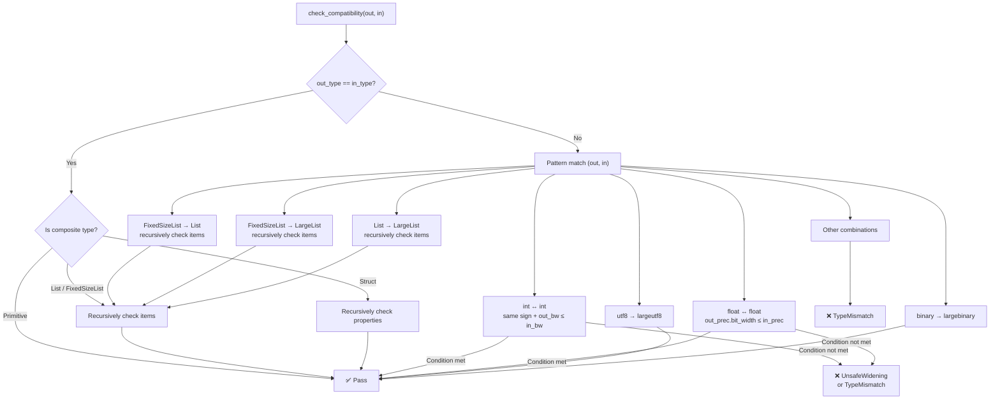

In dora-rs's dataflow model, nodes transmit data through **Apache Arrow Arrays**. However, traditional `dm.json` port declarations only contain `id`, `direction`, and free-text `description` — when users write `nodeA/output → nodeB/input` connections in YAML, the system **cannot validate data type compatibility before startup**, and type mismatch errors are only exposed at runtime. **DM Port Schema** is a type contract system designed precisely to solve this problem: it directly adopts Arrow's JSON Type representation as the type language, combined with JSON Schema's structured keywords (`$id`, `$ref`, `properties`, `required`, `items`), endowing each port with precise, machine-readable data type declarations, and automatically executing compatibility checks during the dataflow transpilation phase.

Sources: [dm-port-schema.md](https://github.com/l1veIn/dora-manager/blob/master/docs/design/dm-port-schema.md#L1-L21), [mod.rs](https://github.com/l1veIn/dora-manager/blob/master/crates/dm-core/src/node/schema/mod.rs#L1-L16)

## Design Principles

Port Schema's design follows four core principles, strictly enforced throughout implementation. **Arrow-native types** means the `type` field directly uses JSON Type objects defined by the Arrow Integration Testing specification, with no additional abstraction layers or mapping tables — this is the foundation of the entire type system. **JSON Schema ergonomics** borrows JSON Schema's `$id`, `$ref`, `title`, `description`, `properties`, `required`, `items` keywords for structure organization and documentation, but does **not** claim to be valid JSON Schema documents. **Minimal keyword set** only includes keywords that have practical significance for Arrow data, excluding complex JSON Schema features like `if/then/else`, `patternProperties`, and `prefixItems`. **Gradual validation** is the most pragmatic principle: validation is only triggered when both the output port and input port **have** declared a `schema`; ports lacking schemas are silently skipped, and nodes marked with `"dynamic_ports": true` can define ports in YAML that were not pre-declared.

Sources: [dm-port-schema.md](https://github.com/l1veIn/dora-manager/blob/master/docs/design/dm-port-schema.md#L9-L14)

## Data Model Prerequisites

All data transmitted between dora-rs nodes is essentially an **Apache Arrow Array**. Even scalar values must be wrapped in arrays (in Python: `pa.array(["hello"])`, in Rust: single-element `StringArray`). **Port Schema describes the element type of this Arrow Array, not the array itself.** When a schema declares `"type": { "name": "utf8" }`, its semantics are: "This port transmits a `Utf8Array` where each element is a UTF-8 string." The array-level wrapping is implicit and global — schema authors never need to concern themselves with it.

Sources: [dm-port-schema.md](https://github.com/l1veIn/dora-manager/blob/master/docs/design/dm-port-schema.md#L16-L20)

## Core Data Model

The Rust implementation of the Port Schema system consists of three closely collaborating modules: `model.rs` defines type structures, `parse.rs` handles JSON parsing and `$ref` resolution, and `compat.rs` implements type compatibility checking. The following Mermaid diagram shows their collaboration:

```mermaid
graph TB
    subgraph "dm.json Port Declaration"
        DJ["NodePort.schema<br/>(serde_json::Value)"]
    end

    subgraph "schema Module"
        P["parse_schema()<br/>JSON → PortSchema"]
        M["PortSchema<br/>arrow_type / items / properties"]
        AT["ArrowType Enum<br/>18 Arrow types"]
        C["check_compatibility()<br/>output ↔ input subtype check"]
        E["SchemaError<br/>7 incompatibility reasons"]
    end

    subgraph "transpile Pipeline"
        VP["validate_port_schemas()<br/>Pass 1.6"]
    end

    DJ --> "|JSON parsing + $ref resolution|" P
    P --> M
    M --> AT
    M --> C
    C --> E
    VP --> P
    VP --> C
```

### ArrowType Enum

`ArrowType` is the type core of the entire system. As a Rust enum, it precisely maps all data types defined in the Arrow Integration Testing JSON format, covering 18 variants across five families:

| Family | Variant | JSON `name` Value | Carried Parameters |
|--------|---------|-------------------|-------------------|
| Null/Boolean | `Null`, `Bool` | `"null"`, `"bool"` | — |
| Integer | `Int` | `"int"` | `bitWidth: u16`, `isSigned: bool` |
| Floating Point | `FloatingPoint` | `"floatingpoint"` | `precision: FloatPrecision` |
| String/Binary | `Utf8`, `LargeUtf8`, `Binary`, `LargeBinary` | Corresponding `name` | — |
| Fixed-Length Binary | `FixedSizeBinary` | `"fixedsizebinary"` | `byteWidth: usize` |
| Date/Time | `Date`, `Time`, `Timestamp`, `Duration` | Corresponding `name` | `unit`, optional `timezone` |
| Nested Types | `List`, `LargeList`, `FixedSizeList`, `Struct`, `Map` | Corresponding `name` | `listSize`, `keysSorted`, etc. |

The `FloatPrecision` enum defines three precision levels: `HALF` (16-bit), `SINGLE` (32-bit), and `DOUBLE` (64-bit), each exposing a `bit_width()` method for bit-width comparison during compatibility checks. The `TimeUnit` enum covers four time granularities: `SECOND`, `MILLISECOND`, `MICROSECOND`, and `NANOSECOND`, while `DateUnit` provides `DAY` and `MILLISECOND` date units.

Sources: [model.rs](https://github.com/l1veIn/dora-manager/blob/master/crates/dm-core/src/node/schema/model.rs#L62-L152)

### PortSchema Struct

`PortSchema` is the top-level schema object representing a single port's data contract. The `arrow_type` field always exists (required by specification), while structured fields `items`, `properties`, and `required` are only meaningful for corresponding Arrow nested types:

```rust
pub struct PortSchema {
    pub id: Option<String>,           // "$id": unique identifier
    pub title: Option<String>,        // "title": human-readable name
    pub description: Option<String>,  // "description": detailed description
    pub arrow_type: ArrowType,        // "type": Arrow type (required)
    pub nullable: bool,               // "nullable": default false
    pub items: Option<Box<PortSchema>>,            // "items": list element schema
    pub properties: Option<BTreeMap<String, PortSchema>>, // "properties": struct fields
    pub required: Option<Vec<String>>,            // "required": required field names
    pub metadata: Option<serde_json::Value>,      // "metadata": free annotations
}
```

Note that `items` uses `Box<PortSchema>` for recursive structures, and `properties` uses `BTreeMap` to ensure stable field name ordering. This recursive design allows precise description of deeply nested types like `list<struct<list<utf8>>>`.

Sources: [model.rs](https://github.com/l1veIn/dora-manager/blob/master/crates/dm-core/src/node/schema/model.rs#L158-L184)

### Schema Field in NodePort

In the `dm.json` port declaration model, the `NodePort` struct holds the raw JSON value through the `schema: Option<serde_json::Value>` field. This means the schema remains unparsed at the node metadata level and is only parsed into strongly-typed `PortSchema` during the transpilation pipeline's validation phase. This lazy parsing strategy avoids unnecessary I/O and parsing overhead.

Sources: [model.rs](https://github.com/l1veIn/dora-manager/blob/master/crates/dm-core/src/node/model.rs#L52-L69)

## Keyword System

The Port Schema specification defines three layers of keywords, each with clear scope and semantics.

### Universal Keywords

Universal keywords can be used in **all** schema objects regardless of Arrow type:

| Keyword | Type | Description |
|---------|------|-------------|
| `$id` | `string` | Schema unique identifier, supporting cross-file references. Convention format: `"dm-schema://&lt;name&gt;"` |
| `$ref` | `string` | Reference another schema, supporting relative paths (`"schema/audio.json"`) or schema IDs (`"dm-schema://audio-pcm"`) |
| `title` | `string` | Short human-readable name |
| `description` | `string` | Detailed human-readable description |
| `type` | `ArrowType` | **Required.** Arrow JSON Type object |
| `nullable` | `boolean` | Whether value can be null, default `false` |
| `metadata` | `object` | Application-level free key-value annotations |

### Structured Keywords

Only available when Arrow types imply nested structure:

| Keyword | Applicable Arrow Types | Type | Description |
|---------|----------------------|------|-------------|
| `items` | `list`, `largelist`, `fixedsizelist` | `Schema` | Schema of list elements |
| `properties` | `struct` | `{ [name]: Schema }` | Named sub-fields of struct |
| `required` | `struct` | `string[]` | List of required property key names |

### Constraint Keywords (Documentation Only)

These keywords **do not affect** transpilation-time type compatibility checks, serving only as machine-readable documentation hints for node developers:

| Keyword | Applicable Arrow Types | Type | Description |
|---------|----------------------|------|-------------|
| `minimum` | `int`, `floatingpoint`, `decimal` | `number` | Minimum value hint |
| `maximum` | `int`, `floatingpoint`, `decimal` | `number` | Maximum value hint |
| `enum` | `utf8`, `largeutf8`, `int` | `array` | Allowed value enumeration |
| `default` | any | any | Default value hint |

Sources: [dm-port-schema.md](https://github.com/l1veIn/dora-manager/blob/master/docs/design/dm-port-schema.md#L24-L59)

## Type System Deep Dive

The `type` field uses JSON Type objects defined by the Arrow Integration Testing specification. Below is the precise mapping between each type's JSON declaration form and corresponding Rust enum variants.

### Primitive Types

```jsonc
// Null — typically used for trigger signals, heartbeats
{ "name": "null" }
// → ArrowType::Null

// Boolean — logic gates, switch states
{ "name": "bool" }
// → ArrowType::Bool

// Signed integer (8/16/32/64-bit)
{ "name": "int", "bitWidth": 32, "isSigned": true }
// → ArrowType::Int { bit_width: 32, is_signed: true }

// Unsigned integer (8/16/32/64-bit)
{ "name": "int", "bitWidth": 8, "isSigned": false }
// → ArrowType::Int { bit_width: 8, is_signed: false }

// Floating point (HALF=16bit, SINGLE=32bit, DOUBLE=64bit)
{ "name": "floatingpoint", "precision": "SINGLE" }
// → ArrowType::FloatingPoint { precision: FloatPrecision::Single }
```

### Binary and String Types

```jsonc
{ "name": "utf8" }           // UTF-8 string (32-bit offset)
{ "name": "largeutf8" }      // UTF-8 string (64-bit offset)
{ "name": "binary" }         // Variable-length binary (32-bit offset)
{ "name": "largebinary" }    // Variable-length binary (64-bit offset)
{ "name": "fixedsizebinary", "byteWidth": 16 }  // Fixed-length binary
```

### Time Types

```jsonc
{ "name": "date", "unit": "DAY" }
{ "name": "timestamp", "unit": "MICROSECOND", "timezone": "UTC" }
{ "name": "time", "unit": "NANOSECOND", "bitWidth": 64 }
{ "name": "duration", "unit": "MILLISECOND" }
```

### Nested Types

```jsonc
// Variable-length list — use items to define element schema
{ "name": "list" }

// Fixed-length list — use items to define element schema, listSize specifies element count
{ "name": "fixedsizelist", "listSize": 1600 }

// Struct — use properties and required to define fields
{ "name": "struct" }

// Map
{ "name": "map", "keysSorted": false }
```

Sources: [dm-port-schema.md](https://github.com/l1veIn/dora-manager/blob/master/docs/design/dm-port-schema.md#L63-L128), [parse.rs](https://github.com/l1veIn/dora-manager/blob/master/crates/dm-core/src/node/schema/parse.rs#L103-L229)

## JSON Parsing and $ref Resolution

The `parse_schema()` function is the bridge from JSON to strongly-typed `PortSchema`. Its core logic is divided into two stages:

**Stage 1: `$ref` resolution.** If the top-level JSON object contains a `$ref` field, the parser treats it as a relative path (relative to `base_dir`, typically the node directory), reads the referenced JSON file, and re-enters the parsing flow. The current implementation only supports relative file paths; `dm-schema://` URI scheme resolution is planned for Phase 2.

**Stage 2: Recursive structure parsing.** `parse_schema_inner()` handles actual structure parsing: extracts the required `type` field and converts it to `ArrowType` enum via `parse_arrow_type()`; recursively parses `items` (calling itself); expands `properties` objects into `BTreeMap<String, PortSchema>`; parses `required` arrays into `Vec<String>`.

Sources: [parse.rs](https://github.com/l1veIn/dora-manager/blob/master/crates/dm-core/src/node/schema/parse.rs#L1-L97), [parse.rs](https://github.com/l1veIn/dora-manager/blob/master/crates/dm-core/src/node/schema/parse.rs#L246-L255)

## Type Compatibility Checking

Type compatibility checking is the core value of the Port Schema system. The `check_compatibility(output, input)` function implements a unidirectional check based on subtype semantics: **Can the output port's data be safely consumed by the input port without data loss or type errors?** The checking logic is a layered pattern match:

### Check Decision Flow



### Safe Widening Rules

The core of compatibility checking is the **safe widening** concept — allowing implicit conversion from narrow to wide types, but prohibiting reverse narrowing and cross-domain conversion:

| Output Type | Input Type | Result | Rule |
|-------------|-----------|--------|------|
| `int(32, signed)` | `int(64, signed)` | ✅ Pass | Same sign, bit-width increases |
| `int(64, signed)` | `int(32, signed)` | ❌ UnsafeWidening | Bit-width decreases, possible truncation |
| `int(32, signed)` | `int(32, unsigned)` | ❌ TypeMismatch | Different signs |
| `floatingpoint(SINGLE)` | `floatingpoint(DOUBLE)` | ✅ Pass | Precision increases |
| `floatingpoint(DOUBLE)` | `floatingpoint(SINGLE)` | ❌ UnsafeWidening | Precision decreases |
| `utf8` | `largeutf8` | ✅ Pass | Offset bit-width increases |
| `binary` | `largebinary` | ✅ Pass | Offset bit-width increases |
| `fixedsizelist(N)` | `list` | ✅ Pass | Fixed-size is subtype of variable-length |
| `fixedsizelist(N)` | `largelist` | ✅ Pass | Double widening |
| `list` | `largelist` | ✅ Pass | Offset bit-width increases |
| `utf8` | `int(32, signed)` | ❌ TypeMismatch | Cross-domain incompatible |
| `fixedsizelist(100)` | `fixedsizelist(200)` | ❌ TypeMismatch | Fixed-size lengths differ |

Sources: [compat.rs](https://github.com/l1veIn/dora-manager/blob/master/crates/dm-core/src/node/schema/compat.rs#L92-L195)

### List Element Compatibility

For list type compatibility checking, logic follows a three-way branch:

- **Both have `items`**: Recursively call `check_compatibility` to check element schema compatibility
- **Input has no `items`**: Input accepts any element type, passes ✅ directly
- **Output has no `items` but input does**: Cannot verify, returns `MissingNestedSchema` error ❌

This embodies the "the more lenient the input, the easier it passes" design philosophy.

Sources: [compat.rs](https://github.com/l1veIn/dora-manager/blob/master/crates/dm-core/src/node/schema/compat.rs#L197-L212)

### Struct Field Compatibility

Struct compatibility checking uses **subset semantics**: the output struct must provide all fields required by the input struct. Specific checking proceeds in two rounds:

**Round 1: Check `required` fields.** For each field name in the input schema's `required` list, verify that the field exists in the output's `properties` and recursively check field schema compatibility. If the output is missing any required field, return `MissingStructField` error.

**Round 2: Check co-existing non-required fields.** For all non-`required` fields in the input `properties`, if the output also defines a field with the same name, recursively check compatibility. Non-required fields missing from the output do not cause errors — this means the output can be a "superset" struct providing more fields than the input requires.

Sources: [compat.rs](https://github.com/l1veIn/dora-manager/blob/master/crates/dm-core/src/node/schema/compat.rs#L214-L267)

### Error Type System

The `SchemaError` enum precisely identifies seven incompatibility reasons, each carrying sufficient context for generating diagnostic messages:

| Error Variant | Semantics | Typical Scenario |
|--------------|-----------|-----------------|
| `TypeMismatch` | Top-level type family mismatch | utf8 vs int |
| `UnsafeWidening` | Bit-width/precision cannot safely widen | int64 → int32 |
| `ListSizeMismatch` | Fixed-size list lengths differ | FixedSizeList(100) vs (200) |
| `IncompatibleItems` | List element type incompatible (wraps internal error) | list\<utf8\> vs list\<int\> |
| `MissingStructField` | Output struct missing required input field | struct{a} vs struct{a,b} |
| `IncompatibleStructField` | Struct field type incompatible (wraps internal error) | struct.a type differs |
| `MissingNestedSchema` | Output missing nested schema required by input | Output has no items but input does |

Both `IncompatibleItems` and `IncompatibleStructField` use `Box<SchemaError>` to wrap internal errors, forming a **traceable error chain** to the root cause.

Sources: [compat.rs](https://github.com/l1veIn/dora-manager/blob/master/crates/dm-core/src/node/schema/compat.rs#L8-L85)

## Transpilation Pipeline Integration

Port Schema validation is integrated into the dataflow transpilation pipeline as **Pass 1.6**, located after Parse (Pass 1) and Reserved validation (Pass 1.5), and after Resolve Paths (Pass 2):

```
Pass 1:   Parse — YAML → DmGraph IR
Pass 1.5: Validate Reserved — reserved node ID conflict check
Pass 2:   Resolve Paths — node: → absolute path:
Pass 1.6: Validate Port Schemas — port schema compatibility check ← here
Pass 3:   Merge Config — four-layer config merge → env:
Pass 4:   Inject Runtime Env — inject runtime environment variables
Pass 5:   Emit — DmGraph → dora YAML
```

### validate_port_schemas Execution Flow

This pass's execution logic precisely implements the "gradual validation" principle:

1. **Build lookup table**: Collect all `ManagedNode`'s `yaml_id → node_id` mappings into a HashMap
2. **Iterate each Managed node's `inputs:` mapping**: Extract YAML's original `inputs:` field from `extra_fields`
3. **Parse connection source**: Split `input_port: source_node/source_output` format into source node ID and source output port ID
4. **Skip dora built-in sources**: `dora/timer/...` and other built-in sources are directly skipped
5. **Load both dm.json metadata**: Locate and deserialize via `resolve_dm_json_path()`
6. **Dynamic port exemption**: If the node declares `dynamic_ports: true` and the port is not declared in `ports`, silently skip
7. **Both-side schema existence check**: Only enter validation when **both sides have declared schemas**
8. **Parse schema**: Call `parse_schema()` to parse JSON, handling `$ref` references
9. **Compatibility check**: Call `check_compatibility()` and collect errors as `IncompatiblePortSchema` diagnostics

All diagnostics are handled in a **collect-don't-short-circuit** manner — users can see all connection issues at once rather than fixing them one by one.

Sources: [passes.rs](https://github.com/l1veIn/dora-manager/blob/master/crates/dm-core/src/dataflow/transpile/passes.rs#L111-L258), [mod.rs](https://github.com/l1veIn/dora-manager/blob/master/crates/dm-core/src/dataflow/transpile/mod.rs#L1-L81)

### Diagnostic Types

The transpilation pipeline defines two Port Schema-related diagnostic types, both carrying `yaml_id` and `node_id` for precise localization:

| Diagnostic Type | Trigger Condition | Output Format |
|----------------|-------------------|---------------|
| `InvalidPortSchema` | Schema JSON parsing failure (syntax errors, missing `type` field, etc.) | `node "yaml_id" (id: node_id): port 'xxx' has an invalid schema: ...` |
| `IncompatiblePortSchema` | Type compatibility check failure | `node "yaml_id" (id: node_id): incompatible connection source/output → input: ...` |

Sources: [error.rs](https://github.com/l1veIn/dora-manager/blob/master/crates/dm-core/src/dataflow/transpile/error.rs#L15-L61)

## Schema Declarations in dm.json

Ports declare their data contracts through the `schema` key — supporting both inline and `$ref` reference forms. Below shows schema declaration patterns **actually used** in the project.

### Inline Declaration (Most Common)

Most nodes use concise inline declarations. The following table summarizes the schema patterns declared by each node in the project:

| Node | Port ID | Direction | Arrow Type | Description |
|------|---------|-----------|-----------|-------------|
| dm-microphone | `audio` | output | `floatingpoint(SINGLE)` | Float32 PCM audio stream |
| dm-microphone | `devices` | output | `utf8` | JSON encoded device list |
| dm-microphone | `device_id` | input | `utf8` | Select microphone device ID |
| dm-microphone | `tick` | input | `null` | Heartbeat timer |
| dm-screen-capture | `frame` | output | `int(8, unsigned)` | Encoded image frame bytes |
| dm-screen-capture | `meta` | output | `utf8` | JSON frame metadata |
| dm-screen-capture | `trigger` | input | `null` | Single capture trigger |
| dm-and | `a`, `b`, `c`, `d` | input | `bool` | Boolean inputs |
| dm-and | `ok` | output | `bool` | Combined result |
| dm-and | `details` | output | `utf8` | JSON evaluation details |
| dm-gate | `enabled` | input | `bool` | Boolean enable signal |
| dm-gate | `value` | input/output | `null` | Passthrough value |
| dm-display | `path`, `data` | input | `utf8` | Path / lightweight display content |

Sources: [dm-microphone dm.json](https://github.com/l1veIn/dora-manager/blob/master/nodes/dm-microphone/dm.json#L34-L75), [dm-screen-capture dm.json](https://github.com/l1veIn/dora-manager/blob/master/nodes/dm-screen-capture/dm.json#L33-L77), [dm-and dm.json](https://github.com/l1veIn/dora-manager/blob/master/nodes/dm-and/dm.json#L27-L82), [dm-gate dm.json](https://github.com/l1veIn/dora-manager/blob/master/nodes/dm-gate/dm.json#L27-L54), [dm-display dm.json](https://github.com/l1veIn/dora-manager/blob/master/nodes/dm-display/dm.json#L33-L60)

### $ref Reference (External File)

When schemas need to be shared across nodes, they can be stored in a `schema/` subdirectory under the node directory and referenced via `$ref`. The specification's convention directory structure:

```
nodes/
  dm-microphone/
    dm.json
    schema/
      audio-pcm.json        ← shared schema file
      device-list.json
    dm_microphone/
      main.py
```

Reference method in `dm.json`:

```jsonc
{
  "ports": [
    {
      "id": "audio",
      "direction": "output",
      "schema": { "$ref": "schema/audio-pcm.json" }
    }
  ]
}
```

Downstream nodes can also reference registered schemas via `$id`:

```jsonc
{
  "ports": [
    {
      "id": "audio_in",
      "direction": "input",
      "schema": { "$ref": "dm-schema://audio-pcm" }
    }
  ]
}
```

> **Current status**: `dm-schema://` URI resolution is not yet implemented (planned for Phase 2); currently only relative file path `$ref` is supported.

Sources: [parse.rs](https://github.com/l1veIn/dora-manager/blob/master/crates/dm-core/src/node/schema/parse.rs#L246-L255), [dm-port-schema.md](https://github.com/l1veIn/dora-manager/blob/master/docs/design/dm-port-schema.md#L132-L179)

## Complete Schema Examples

The following examples demonstrate schema declaration patterns from simple to complex, all sourced from specification design documents.

### PCM Audio Stream (Fixed-Size List + Floating Point Elements)

```json
{
  "$id": "dm-schema://audio-pcm",
  "title": "PCM Audio Chunk",
  "description": "Float32 PCM audio samples, single channel",
  "type": { "name": "fixedsizelist", "listSize": 1600 },
  "nullable": false,
  "items": {
    "type": { "name": "floatingpoint", "precision": "SINGLE" },
    "minimum": -1.0,
    "maximum": 1.0
  }
}
```

### Object Detection Results (List Nested Struct)

```json
{
  "$id": "dm-schema://detections",
  "title": "Object Detection Results",
  "type": { "name": "list" },
  "items": {
    "type": { "name": "struct" },
    "required": ["bbox", "label", "confidence"],
    "properties": {
      "bbox": {
        "description": "Bounding box [x1, y1, x2, y2]",
        "type": { "name": "fixedsizelist", "listSize": 4 },
        "items": { "type": { "name": "floatingpoint", "precision": "SINGLE" } }
      },
      "label": { "type": { "name": "utf8" } },
      "confidence": {
        "type": { "name": "floatingpoint", "precision": "SINGLE" },
        "minimum": 0, "maximum": 1
      }
    }
  }
}
```

### Control Signal (with enum constraint)

```json
{
  "$id": "dm-schema://control-signal",
  "title": "Control Signal",
  "type": { "name": "utf8" },
  "enum": ["flush", "reset", "stop"]
}
```

Sources: [dm-port-schema.md](https://github.com/l1veIn/dora-manager/blob/master/docs/design/dm-port-schema.md#L185-L294)

## Test Coverage

`tests.rs` provides 22 test cases for the schema system, covering both parsing and compatibility checking. Parsing tests verify correct deserialization of all major Arrow types (`null`, `bool`, `int32`, `uint8`, `float32`, `utf8`, `binary`, `fixedsizelist`, `struct`, `timestamp`), including complete metadata with `$id`, `title`, `nullable`, and error paths for missing `type` fields or unknown type names. Compatibility tests cover the following scenario matrix:

| Test Scenario | Expected Result |
|--------------|-----------------|
| Exact match (utf8 == utf8) | ✅ Pass |
| int safe widening (int32 → int64) | ✅ Pass |
| int narrowing (int64 → int32) | ❌ Fail |
| int sign mismatch (signed vs unsigned) | ❌ Fail |
| float safe widening (SINGLE → DOUBLE) | ✅ Pass |
| float narrowing (DOUBLE → SINGLE) | ❌ Fail |
| utf8 → largeutf8 | ✅ Pass |
| Cross-domain mismatch (utf8 vs int32) | ❌ Fail |
| FixedSizeList → List (element compatible) | ✅ Pass |
| FixedSizeList size mismatch | ❌ Fail |
| List element incompatible | ❌ Fail |
| Struct superset (output has extra fields) | ✅ Pass |
| Struct missing required fields | ❌ Fail |
| Struct field type mismatch | ❌ Fail |
| null exact match | ✅ Pass |
| Input without items accepts any list | ✅ Pass |

Sources: [tests.rs](https://github.com/l1veIn/dora-manager/blob/master/crates/dm-core/src/node/schema/tests.rs#L1-L333)

## Roadmap: Schema as a First-Class Citizen

In the current Phase 1 implementation, schema files are stored in each node's `schema/` subdirectory. As shared schemas grow, the specification plans to introduce a hierarchical schema discovery chain similar to the node discovery mechanism:

```
Phase 1 (current):   schema/ exists within each node directory
Phase 2 (planned):   ~/.dm/schemas/           (user-level, highest priority)
                     repository schemas/       (workspace-level)
                     DM_SCHEMA_DIRS env var    (additional directories)
```

Cross-node `$ref` via `$id` (e.g., `"dm-schema://audio-pcm"`) will be resolved in this discovery chain, making schemas truly reusable first-class resources.

Sources: [dm-port-schema.md](https://github.com/l1veIn/dora-manager/blob/master/docs/design/dm-port-schema.md#L325-L337)

---

**Related Reading**:
- Port schema's position in the transpilation pipeline: [Dataflow Transpiler: Multi-Pass Pipeline and Four-Layer Configuration Merge](08-transpiler)
- Complete field reference for port declarations in dm.json: [Developing Custom Nodes: dm.json Complete Field Reference](22-custom-node-guide)
- Overview of built-in nodes using schema declarations: [Built-In Nodes: From Media Capture to AI Inference](19-builtin-nodes)
