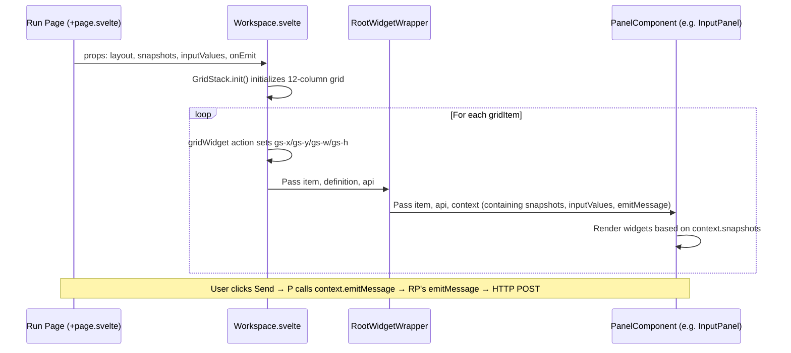
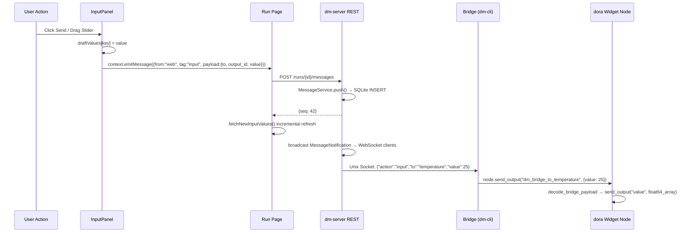

Dora Manager's reactive widget system is a bidirectional communication architecture spanning from dataflow nodes to the Web UI—nodes declare widget forms (buttons, sliders, switches, etc.), the frontend dynamically renders based on snapshot data, and user interactions are injected back into the dataflow via a WebSocket + HTTP pipeline. This document breaks down the panel registry, snapshot-driven dynamic rendering, and the Bridge-relayed parameter injection pipeline layer by layer.

Sources: [types.ts](https://github.com/l1veIn/dora-manager/blob/main/web/src/lib/components/workspace/types.ts#L1-L147), [registry.ts](https://github.com/l1veIn/dora-manager/blob/main/web/src/lib/components/workspace/panels/registry.ts#L1-L80), [InputPanel.svelte](https://github.com/l1veIn/dora-manager/blob/main/web/src/lib/components/workspace/panels/input/InputPanel.svelte#L1-L249)

## System Architecture Overview

Before diving into the details of each layer, it is important to understand the four-layer architecture of the widget system and how data flows between them. The entire system follows a clear design principle: **the frontend has zero awareness of nodes**—it does not connect directly to dora nodes, but uses dm-server's message service as an intermediary layer.

```mermaid
graph LR
    subgraph "Dora Dataflow Layer"
        WN[Widget Nodes<br/>dm-button / dm-slider / dm-text-input]
        DN[Display Nodes<br/>dm-message]
    end

    subgraph "Bridge Process (dm-cli)"
        BR[Bridge Serve<br/>Unix Socket ↔ DoraNode API]
    end

    subgraph "dm-server (Rust)"
        MS[MessageService<br/>SQLite + Snapshots]
        WS[/messages/ws<br/>WebSocket Channel]
        HTTP[REST API<br/>push / list / snapshots]
    end

    subgraph "Frontend (Svelte)"
        IP[InputPanel<br/>Dynamic Widget Rendering]
        MP[MessagePanel<br/>Message History Display]
    end

    WN -- "Receives input forwarded by Bridge" --> BR
    BR -- "tag=widgets<br/>Register snapshots" --> MS
    BR -- "tag=input<br/>Forward user input" --> MS
    DN -- "display output" --> BR
    BR -- "tag=text/chart/..." --> MS
    MS -- "broadcast" --> WS
    HTTP -- "REST" --> MS
    WS -- "Real-time notifications" --> IP
    WS -- "Real-time notifications" --> MP
    IP -- "POST /messages" --> HTTP
```

**Key dataflow nodes**: A Widget Node (such as `dm-slider`) does not communicate directly with the frontend. It runs as a regular node within the dora dataflow, using the Bridge process (`dm-cli bridge` command) as an intermediary: one end of the Bridge connects to dora's `DoraNode` API, and the other end connects to dm-server via Unix Socket. dm-server persists all messages to SQLite and broadcasts change notifications via WebSocket.

Sources: [bridge.rs](https://github.com/l1veIn/dora-manager/blob/main/crates/dm-cli/src/bridge.rs#L57-L193), [messages.rs](https://github.com/l1veIn/dora-manager/blob/main/crates/dm-server/src/services/message.rs#L104-L161), [messages handler](https://github.com/l1veIn/dora-manager/blob/main/crates/dm-server/src/handlers/messages.rs#L223-L270)

## Panel Registry

The panel registry is the core routing table of the frontend Workspace system—it maps each panel type (Panel Kind) to the corresponding Svelte component, default configuration, and filter rules.

### PanelKind Type Definitions

The system currently supports 6 panel types:

| Panel Kind | Component | Data Source Mode | Supported Tags | Purpose |
|---|---|---|---|---|
| `message` | MessagePanel | `history` | `*` (all) | Streaming message history display |
| `input` | InputPanel | `snapshot` | `widgets` | Interactive widget rendering |
| `chart` | ChartPanel | `snapshot` | `chart` | Chart data visualization |
| `table` | MessagePanel | `snapshot` | `table` | Table data display |
| `video` | VideoPanel | `snapshot` | `stream` | Media stream playback |
| `terminal` | TerminalPanel | `external` | `[]` (empty) | Node log terminal |

Sources: [types.ts](https://github.com/l1veIn/dora-manager/blob/main/web/src/lib/components/workspace/types.ts#L8-L8), [registry.ts](https://github.com/l1veIn/dora-manager/blob/main/web/src/lib/components/workspace/panels/registry.ts#L9-L75)

### Registry Structure

Each `PanelDefinition` contains the following key fields:

```typescript
type PanelDefinition = {
    kind: PanelKind;           // Panel type identifier
    title: string;             // Title bar display name
    dotClass: string;          // Title bar status dot CSS class
    sourceMode: PanelSourceMode; // Data fetching mode
    supportedTags: string[] | "*"; // Which message tags to subscribe to
    defaultConfig: PanelConfig;   // Default configuration when creating a new panel
    component: any;            // Svelte component reference
};
```

`sourceMode` determines how the panel fetches data—`history` mode uses paginated history queries (MessagePanel), `snapshot` mode uses the latest snapshot (InputPanel/ChartPanel), and `external` mode is entirely self-managed by the panel (TerminalPanel fetches logs via an independent run WebSocket).

Sources: [types.ts (panels)](https://github.com/l1veIn/dora-manager/blob/main/web/src/lib/components/workspace/panels/types.ts#L30-L40)

### Panel Lookup and Fallback

The `getPanelDefinition(kind)` function provides safe panel lookup, falling back to the `message` panel when an unknown `kind` is passed:

```typescript
export function getPanelDefinition(kind: PanelKind): PanelDefinition {
    return panelRegistry[kind] ?? panelRegistry.message;
}
```

This fallback strategy ensures that even if deprecated panel types (e.g., `stream`, which has been merged into `message`) are stored in the persisted layout, the `normalizeWorkspaceLayout` function can safely map them to the `message` type and merge default configurations.

Sources: [registry.ts](https://github.com/l1veIn/dora-manager/blob/main/web/src/lib/components/workspace/panels/registry.ts#L77-L79), [types.ts](https://github.com/l1veIn/dora-manager/blob/main/web/src/lib/components/workspace/types.ts#L108-L146)

## Workspace Grid and Widget Rendering Pipeline

Workspace is the container component for all panels, using the **GridStack** library to implement a drag-and-drop, resizable grid layout. Understanding its rendering pipeline helps diagnose why widgets are not displayed or why data is not updating.

### Rendering Pipeline Architecture



The Workspace component iterates over the layout array via `{#each gridItems as dataItem}`, performing the following steps for each `gridItem`:

1. **`getPanelDefinition(dataItem.widgetType)`** retrieves the panel definition
2. **`use:gridWidget`** Svelte Action registers the DOM node with GridStack
3. **`<RootWidgetWrapper>`** renders the title bar (with drag handle, maximize, and close buttons)
4. **`<PanelComponent>`** renders the actual panel content inside the Wrapper

`PanelContext` is the sole interface between the panel and the outside world, containing `runId`, `snapshots`, `inputValues`, `nodes`, `refreshToken`, `isRunActive`, and the `emitMessage` function.

Sources: [Workspace.svelte](https://github.com/l1veIn/dora-manager/blob/main/web/src/lib/components/workspace/Workspace.svelte#L1-L175), [RootWidgetWrapper.svelte](https://github.com/l1veIn/dora-manager/blob/main/web/src/lib/components/workspace/widgets/RootWidgetWrapper.svelte#L1-L45), [types.ts (panels)](https://github.com/l1veIn/dora-manager/blob/main/web/src/lib/components/workspace/panels/types.ts#L4-L28)

### Layout Persistence

The Workspace layout is persisted via `localStorage` under the key `dm-workspace-layout-{run.name}`. The `handleLayoutChange` callback is triggered on every GridStack change (drag, resize, add/remove panels), serializing and saving the latest `gridItems` array. On page reload, `normalizeWorkspaceLayout` handles backward compatibility (e.g., mapping the deprecated `stream` type to `message`, migrating the old `subscribedSourceId` to the `nodes` array).

Sources: [+page.svelte](https://github.com/l1veIn/dora-manager/blob/main/web/src/routes/runs/[id]/+page.svelte#L76-L84), [types.ts](https://github.com/l1veIn/dora-manager/blob/main/web/src/lib/components/workspace/types.ts#L108-L146)

## Bridge Relay and Widget Registration Protocol

The reason widgets can be "auto-discovered" by the frontend is that **the Bridge process pushes `tag=widgets` snapshots to dm-server at startup**. This is the registration protocol of the entire widget system.

### Transpiler Injects Bridge Nodes

When a user runs `dm start` to launch a dataflow containing interactive nodes (such as `dm-slider`), the Transpiler's Pass 4.5 (`inject_dm_bridge`) scans the `capabilities` of all Managed nodes. Upon discovering nodes that declare `widget_input` or `display` capabilities, it automatically injects a hidden `__dm_bridge` node into the dataflow. Key environment variables for this Bridge node include:

| Environment Variable | Value | Purpose |
|---|---|---|
| `DM_CAPABILITIES_JSON` | JSON array | Specifications of all nodes that need bridging |
| `DM_BRIDGE_INPUT_PORT` | `dm_bridge_input_internal` | Mapping of Bridge output port to node |
| `DM_BRIDGE_OUTPUT_ENV_KEY` | `dm_display_from_{id}` | Mapping of node output to Bridge |

Sources: [passes.rs](https://github.com/l1veIn/dora-manager/blob/main/crates/dm-core/src/dataflow/transpile/passes.rs#L456-L570), [bridge.rs (core)](https://github.com/l1veIn/dora-manager/blob/main/crates/dm-core/src/dataflow/transpile/bridge.rs#L10-L84)

### Bridge Registers Widgets

After the Bridge process starts, it constructs a widget description JSON for each node that declares the `widget_input` capability, and sends it to dm-server via the `push` action:

```json
{
  "action": "push",
  "from": "temperature",
  "tag": "widgets",
  "payload": {
    "label": "Temperature (°C)",
    "widgets": {
      "value": {
        "type": "slider",
        "label": "Temperature (°C)",
        "min": -20, "max": 50, "step": 1, "default": 20
      }
    }
  }
}
```

The `widget_payload` function dispatches different widget description construction logic based on `node_id`. It currently has built-in support for automatic descriptions of the following node types: `dm-text-input` (input/textarea), `dm-button` (button), `dm-slider` (slider), `dm-input-switch` (switch). Unrecognized node types will generate an empty `widgets: {}`.

Sources: [bridge.rs](https://github.com/l1veIn/dora-manager/blob/main/crates/dm-cli/src/bridge.rs#L244-L289)

### dm-server Snapshot Mechanism

`MessageService` uses SQLite's `UPSERT` semantics for the snapshot table—the `message_snapshots` table uses `(node_id, tag)` as its primary key. Each `push` operation writes to both the message history table and updates the snapshot table:

```sql
INSERT INTO message_snapshots (node_id, tag, payload, seq, updated_at)
VALUES (?1, ?2, ?3, ?4, ?5)
ON CONFLICT(node_id, tag) DO UPDATE SET
    payload = excluded.payload, seq = excluded.seq, updated_at = excluded.updated_at
```

This means that regardless of how many times the Bridge restarts or how many registration messages it sends, the frontend always retrieves the latest widget description for that node. `GET /api/runs/{id}/messages/snapshots` returns all snapshots, and the frontend filters for widget descriptions using `tag === "widgets"`.

Sources: [message.rs](https://github.com/l1veIn/dora-manager/blob/main/crates/dm-server/src/services/message.rs#L138-L161), [message.rs snapshots](https://github.com/l1veIn/dora-manager/blob/main/crates/dm-server/src/services/message.rs#L226-L243)

## InputPanel Dynamic Rendering Mechanism

InputPanel is the frontend core of the widget system—it reads snapshot data with `tag=widgets` and dynamically selects the corresponding Svelte control component for rendering based on the `widget.type` field.

### Widget Type Mapping Table

| `widget.type` | Component | Interaction Method | Output Type |
|---|---|---|---|
| `input` | ControlInput | Input box + Send button | `string` |
| `textarea` | ControlTextarea | Multi-line text box + Cmd/Ctrl+Enter to send | `string` |
| `button` | ControlButton | Single click trigger | `string` (constant `"clicked"`) |
| `select` | ControlSelect | Dropdown selection | `string` |
| `slider` | ControlSlider | Slider drag | `number` |
| `switch` | ControlSwitch | Toggle switch | `boolean` |
| `radio` | ControlRadio | Radio button group + Send | `string` |
| `checkbox` | ControlCheckbox | Multi-select checkboxes + Send | `string[]` |
| `path` / `file_picker` / `directory` | ControlPath | Path picker | `string` |
| `file` | Native `<input type="file">` | File upload | `string` (Base64) |

Sources: [InputPanel.svelte](https://github.com/l1veIn/dora-manager/blob/main/web/src/lib/components/workspace/panels/input/InputPanel.svelte#L219-L241)

### Snapshot Filtering and Widget Rendering

InputPanel uses `createSnapshotViewState` for reactive snapshot filtering—it receives the global `snapshots` array and the current panel's `nodes`/`tags` filters, returning the list of matching widgets. The core of the rendering logic is a **double iteration**:

```
Iterate over widgetSnapshots (each binding = one node's widget declaration)
  → Iterate over binding.payload.widgets (each widget = one output port widget of that node)
    → Select the corresponding Control* component based on widget.type
```

The title bar of each widget card displays `binding.payload.label` (node-level label) or falls back to `binding.node_id`. When a node declares multiple widgets, `widget.label ?? outputId` is displayed above each widget as a distinguishing label.

Sources: [InputPanel.svelte](https://github.com/l1veIn/dora-manager/blob/main/web/src/lib/components/workspace/panels/input/InputPanel.svelte#L198-L248), [message-state.svelte.ts](https://github.com/l1veIn/dora-manager/blob/main/web/src/lib/components/workspace/panels/message/message-state.svelte.ts#L121-L144)

### Initial Value State Resolution

Widget value resolution follows a three-level priority chain: `draftValues[key]` -> `context.inputValues[key]` -> `widget.default` -> type default value (checkbox is `[]`, switch is `false`, slider is `widget.min ?? 0`, others are `""`). The `key` format is `{nodeId}:{outputId}`, which ensures that identical output port names from different nodes within the same panel do not conflict.

`draftValues` is purely frontend state, temporarily storing values when the user interacts but has not yet sent; `context.inputValues` restores previously sent values fetched from the `GET /runs/{id}/messages?tag=input` history query.

Sources: [InputPanel.svelte](https://github.com/l1veIn/dora-manager/blob/main/web/src/lib/components/workspace/panels/input/InputPanel.svelte#L76-L104)

## WebSocket Parameter Injection Full Pipeline

When a user interacts with a widget in InputPanel and clicks send, the data travels through a complete frontend-to-backend pipeline to ultimately reach the dora dataflow node. Understanding this pipeline is key to troubleshooting issues where widgets "can't send" or nodes "don't receive."

### Send Pipeline Breakdown



Key step breakdown:

**Step 1: Frontend Send** — The `handleEmit` function constructs the message body `{from: "web", tag: "input", payload: {to: nodeId, output_id: outputId, value}}` and calls `context.emitMessage`, ultimately sending it to dm-server via `POST /api/runs/{id}/messages`.

**Step 2: Server Persistence** — The `push_message` handler calls `MessageService::push()`, writing the message to the `messages` history table and updating the `message_snapshots` snapshot table, then sending a `MessageNotification` via `broadcast::Sender`.

**Step 3: Bridge Receives** — `bridge_socket_loop` in dm-server listens on the Unix Socket connection. When there is a new `tag=input` message, it looks up the full message body and forwards it to the Bridge process: `{"action":"input","to":"temperature","value":25}`.

**Step 4: Bridge Forwards to dora** — The Bridge process receives the `InputNotification`, looks up the `widget_specs` routing table to find the corresponding output port, constructs the `{"value": 25}` JSON, and sends it to the `dm_bridge_to_temperature` port via `DoraNode::send_output`.

**Step 5: Widget Node Processing** — Taking `dm-slider` as an example, the node listens on the `dm_bridge_input_internal` port, decodes the JSON via `decode_bridge_payload`, extracts the `value` field and converts it to a `float64` Arrow array, and finally sends it to the next node in the dataflow via `node.send_output("value", ...)`.

Sources: [InputPanel.svelte](https://github.com/l1veIn/dora-manager/blob/main/web/src/lib/components/workspace/panels/input/InputPanel.svelte#L87-L104), [+page.svelte](https://github.com/l1veIn/dora-manager/blob/main/web/src/routes/runs/[id]/+page.svelte#L371-L383), [messages.rs handler](https://github.com/l1veIn/dora-manager/blob/main/crates/dm-server/src/handlers/messages.rs#L69-L97), [bridge_socket.rs](https://github.com/l1veIn/dora-manager/blob/main/crates/dm-server/src/handlers/bridge_socket.rs#L96-L113), [bridge.rs](https://github.com/l1veIn/dora-manager/blob/main/crates/dm-cli/src/bridge.rs#L168-L187), [dm_slider main.py](https://github.com/l1veIn/dora-manager/blob/main/nodes/dm-slider/dm_slider/main.py#L59-L76)

### Real-time Refresh Mechanism

The Run Page establishes a WebSocket connection to `/api/runs/{id}/messages/ws` during `onMount`. The server-side `handle_messages_ws` function subscribes to the `AppState.messages` broadcast channel, and when it receives a `MessageNotification` matching the current `run_id`, it pushes the notification JSON to the frontend:

```typescript
socket.onmessage = async (event) => {
    const notification = JSON.parse(event.data);
    await fetchSnapshots();        // Refresh all snapshots
    if (notification.tag === "input") {
        await fetchNewInputValues(); // Incrementally refresh input values
    }
    messageRefreshToken += 1;      // Trigger panel re-render
};
```

On WebSocket disconnection, automatic reconnection is handled with an exponential backoff strategy (starting with a 1-second delay). `messageRefreshToken` is a simple counter that increments each time a notification is received, and all panels listen to this token via `$effect` to trigger data refresh.

Sources: [+page.svelte](https://github.com/l1veIn/dora-manager/blob/main/web/src/routes/runs/[id]/+page.svelte#L438-L467), [messages handler ws](https://github.com/l1veIn/dora-manager/blob/main/crates/dm-server/src/handlers/messages.rs#L242-L270)

## Widget Development Guide

### Widget Declarations in Dataflows

The following YAML shows how four widget types work together in a dataflow:

```yaml
nodes:
  - id: temperature
    node: dm-slider
    outputs: [value]
    config:
      label: "Temperature (°C)"
      min_val: -20
      max_val: 50
      step: 1
      default_value: 20

  - id: trigger
    node: dm-button
    outputs: [click]
    config:
      label: "Send Greeting"

  - id: message
    node: dm-text-input
    outputs: [value]
    config:
      label: "Message"
      placeholder: "Type your message here..."

  - id: enabled
    node: dm-input-switch
    outputs: [value]
    config:
      label: "Feature Enabled"
      default_value: "true"
```

Environment variables in each widget's `config` (such as `label`, `min_val`) are injected as environment variables during the Transpiler's configuration merge pass, and the Bridge reads these variables to construct widget descriptions.

Sources: [demo-interactive-widgets.yml](demos/demo-interactive-widgets.yml#L26-L63)

### dm.json Capability Declarations

Interactive nodes must declare the `widget_input` capability in the `capabilities` array of `dm.json`, and define two bindings:

```json
{
  "capabilities": [
    "configurable",
    {
      "name": "widget_input",
      "bindings": [
        {
          "role": "widget",
          "channel": "register",
          "media": ["widgets"],
          "lifecycle": ["run_scoped", "stop_aware"]
        },
        {
          "role": "widget",
          "port": "value",
          "channel": "input",
          "media": ["number"],
          "lifecycle": ["run_scoped", "stop_aware"]
        }
      ]
    }
  ]
}
```

The binding with `channel: "register"` + `media: ["widgets"]` triggers the Bridge to send a widget registration snapshot at startup; the binding with `channel: "input"` + `port: "value"` defines which port user input is injected into the node through. The port name must match the port name used in `node.send_output` in the node's code.

Sources: [dm-slider/dm.json](https://github.com/l1veIn/dora-manager/blob/main/nodes/dm-slider/dm.json#L25-L56), [bridge.rs (core)](https://github.com/l1veIn/dora-manager/blob/main/crates/dm-core/src/dataflow/transpile/bridge.rs#L46-L84)

### Bridge Node Python Template

All Widget Nodes follow a unified processing pattern—listen on the Bridge input port, decode the JSON payload, extract the value, and forward it to the dataflow output port:

```python
def main():
    bridge_input_port = os.getenv("DM_BRIDGE_INPUT_PORT", "dm_bridge_input_internal")
    node = Node()
    for event in node:
        if event["type"] != "INPUT" or event["id"] != bridge_input_port:
            continue
        payload = decode_bridge_payload(event["value"])
        if payload is None:
            continue
        node.send_output("value", normalize_output(payload.get("value")))
```

`decode_bridge_payload` handles various encoding forms of Arrow data (single-element lists, UInt8Array byte sequences, etc.), uniformly converting them to a JSON dict. `normalize_output` converts Python types to the corresponding Arrow array types.

Sources: [dm_slider/main.py](https://github.com/l1veIn/dora-manager/blob/main/nodes/dm-slider/dm_slider/main.py#L59-L79), [dm-button/main.py](https://github.com/l1veIn/dora-manager/blob/main/nodes/dm-button/dm_button/main.py#L60-L77)

## Panel Addition and Terminal Injection

In addition to the Input panel appearing automatically in the default layout, users can manually add panels via the "Add Panel" button in the Workspace toolbar. The `addWidget` function appends a new `WorkspaceGridItem` at the bottom of the layout:

```typescript
function addWidget(type: PanelKind) {
    let maxY = 0;
    for (let item of workspaceLayout) {
        maxY = Math.max(maxY, item.y + item.h);
    }
    workspaceLayout = [...workspaceLayout, {
        id: generateId(),
        widgetType: type,
        config: { ...getPanelDefinition(type).defaultConfig },
        x: 0, y: maxY, w: 6, h: 4,
    }];
}
```

The Terminal panel has a special injection mechanism—when a user clicks a node in the node list, `openNodeTerminal` looks for an existing Terminal panel and switches its `nodeId`, or appends a new Terminal panel at the bottom of the layout. After injection, `scrollIntoView` + a highlight animation prompts the user to the panel's location.

Sources: [+page.svelte](https://github.com/l1veIn/dora-manager/blob/main/web/src/routes/runs/[id]/+page.svelte#L94-L185), [types.ts](https://github.com/l1veIn/dora-manager/blob/main/web/src/lib/components/workspace/types.ts#L78-L106)

## Troubleshooting Common Issues

| Symptom | Possible Cause | Troubleshooting Direction |
|---|---|---|
| InputPanel displays "No input controls available" | Bridge has not registered widgets | Check if `GET /snapshots` returns a snapshot with `tag=widgets`; check Bridge process logs |
| Node does not respond after widget interaction | Bridge routing table is missing | Check Bridge logs for `routed input ->` output; confirm `DM_CAPABILITIES_JSON` includes the node |
| Widget value resets to default | `inputValues` not loaded | Check if `GET /messages?tag=input` returns historical input messages |
| WebSocket frequently disconnects | Server restart or network issues | Check the WS connection status in the browser DevTools Network panel; confirm reconnection logic is working |
| Widget type displays "Unsupported" | `widget.type` not in the mapping table | Check if the Bridge's `widget_payload` function generates the correct widget description for that node type |

---

**Next reading**: After understanding the widget system, you can continue to explore [Interactive System Architecture: dm-input / dm-message / Bridge Node Injection Principles](22-jiao-hu-xi-tong-jia-gou-dm-input-dm-message-bridge-jie-dian-zhu-ru-yuan-li) for a deeper look at the Bridge's bidirectional communication mechanism, or check out [Run Workspace: Grid Layout, Panel System, and Real-time Log Viewing](19-yun-xing-gong-zuo-tai-wang-ge-bu-ju-mian-ban-xi-tong-yu-shi-shi-ri-zhi-cha-kan) for an overview of the panel system's overall layout design.
