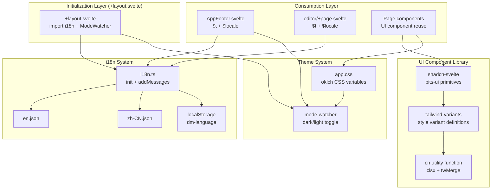

Dora Manager's frontend UI is built on two core infrastructure pillars: a runtime internationalization system based on **svelte-i18n**, and a component library based on **shadcn-svelte + Tailwind CSS v4**. This document provides an in-depth analysis of the architectural design, current implementation status, and extension patterns of both systems, helping you develop efficiently on top of the existing design patterns.

Sources: [i18n.ts](https://github.com/l1veIn/dora-manager/blob/main/web/src/lib/i18n.ts#L1-L22), [components.json](https://github.com/l1veIn/dora-manager/blob/main/web/components.json#L1-L17)

## System Architecture Overview

The i18n and UI component library form a layered separation of concerns in Dora Manager -- internationalization handles locale adaptation of text content, the component library ensures visual consistency and interaction patterns, and the theme system manages light/dark color scheme switching. All three collaborate in a loosely coupled manner through CSS variable layers and Svelte's reactive stores.

The architecture diagram below illustrates the complete data flow from the initialization layer to the consumption layer:



The entry point for the entire system is the root layout file [+layout.svelte](https://github.com/l1veIn/dora-manager/blob/main/web/src/routes/+layout.svelte#L1-L30). It completes i18n initialization through a side-effect import via `import "$lib/i18n"`, and registers a theme listener through the `<ModeWatcher />` component. Both are ready synchronously at application startup.

Sources: [+layout.svelte](https://github.com/l1veIn/dora-manager/blob/main/web/src/routes/+layout.svelte#L1-L54), [app.css](https://github.com/l1veIn/dora-manager/blob/main/web/src/app.css#L1-L149)

## Internationalization (i18n) System

### Engine Selection and Current Status

Dora Manager's design documentation originally planned to use **Paraglide** (inlang's compile-time i18n solution), but the actual implementation adopted **svelte-i18n** -- a store-based runtime internationalization library. This choice provides a simpler integration path: no compilation step is required, and translated text can be used directly in templates via Svelte's reactive syntax with the `$t()` store.

Key characteristics of the current i18n system:

| Dimension | Implementation |
|---|---|
| Engine | svelte-i18n v4.0.1 (runtime store) |
| Configuration entry | [i18n.ts](https://github.com/l1veIn/dora-manager/blob/main/web/src/lib/i18n.ts) |
| Language files | [en.json](https://github.com/l1veIn/dora-manager/blob/main/web/src/lib/locales/en.json), [zh-CN.json](https://github.com/l1veIn/dora-manager/blob/main/web/src/lib/locales/zh-CN.json) |
| Fallback language | `en` |
| Persistence | `localStorage` key `dm-language` |
| Supported languages | `en`, `zh-CN` |

Sources: [package.json](https://github.com/l1veIn/dora-manager/blob/main/web/package.json#L41), [i18n.ts](https://github.com/l1veIn/dora-manager/blob/main/web/src/lib/i18n.ts#L1-L22)

### Initialization Flow

The i18n system is initialized in the application's root layout through a side-effect import via `import "$lib/i18n"`. The specific flow is divided into three stages: **Register dictionaries** -> **Detect initial language** -> **Subscribe to persistence**.

[en.json](https://github.com/l1veIn/dora-manager/blob/main/web/src/lib/locales/en.json) and [zh-CN.json](https://github.com/l1veIn/dora-manager/blob/main/web/src/lib/locales/zh-CN.json) are statically registered into svelte-i18n's message dictionary via `addMessages()`. The initial language detection priority is: user preference saved in `localStorage` > browser language setting (`getLocaleFromNavigator()`) > fallback to `en`. Language changes are automatically written to `localStorage`, ensuring cross-session consistency.

```typescript
// web/src/lib/i18n.ts -- Three stages of initialization logic

// Stage 1: Register dictionaries
addMessages('en', en);
addMessages('zh-CN', zhCN);

// Stage 2: Detect initial language (localStorage > navigator > fallback)
init({
    fallbackLocale: 'en',
    initialLocale: window.localStorage.getItem("dm-language")
                    || getLocaleFromNavigator(),
});

// Stage 3: Persist language changes to localStorage
locale.subscribe((newLocale) => {
    if (newLocale) window.localStorage.setItem("dm-language", newLocale);
});
```

Sources: [i18n.ts](https://github.com/l1veIn/dora-manager/blob/main/web/src/lib/i18n.ts#L1-L22)

### Current Translation Keys and Coverage

As of the current version, the i18n system's translation dictionary is extremely minimal, containing only **4 keys**:

| Key | `en` | `zh-CN` |
|---|---|---|
| `theme` | Theme | 主题 |
| `language` | Language | 语言 |
| `english` | English | English |
| `chinese` | 中文 | 中文 |

Only two components currently use `$t()`: the [AppFooter.svelte](https://github.com/l1veIn/dora-manager/blob/main/web/src/lib/components/layout/AppFooter.svelte#L6) at the bottom of the sidebar, and the toolbar in the standalone editor page [editor/+page.svelte](https://github.com/l1veIn/dora-manager/blob/main/web/src/routes/dataflows/[id]/editor/+page.svelte#L36). This means a large amount of UI text is still hardcoded in English -- i18n coverage is in its early stages.

Sources: [en.json](https://github.com/l1veIn/dora-manager/blob/main/web/src/lib/locales/en.json#L1-L6), [zh-CN.json](https://github.com/l1veIn/dora-manager/blob/main/web/src/lib/locales/zh-CN.json#L1-L6)

### Language Switcher Implementation

The language switching UI is embedded as a DropdownMenu in two locations: the bottom of AppSidebar and the standalone editor toolbar. Its core pattern is to directly assign the `$locale` store to trigger a global language switch. The code below shows the implementation in AppFooter:

```svelte
<!-- Language switcher in AppFooter.svelte -->
<script>
    import { t, locale } from "svelte-i18n";
    import * as DropdownMenu from "$lib/components/ui/dropdown-menu/index.js";
</script>

<DropdownMenu.Root>
    <DropdownMenu.Trigger>
        {#snippet child({ props })}
            <Sidebar.MenuButton {...props} title={$t("language")}>
                <Languages class="size-4" />
                <span>{$t("language")} ({$locale?.toUpperCase()})</span>
            </Sidebar.MenuButton>
        {/snippet}
    </DropdownMenu.Trigger>
    <DropdownMenu.Content side="top" align="start">
        {#each ["en", "zh-CN"] as tag}
            <DropdownMenu.Item>
                <button onclick={() => ($locale = tag)}>
                    {tag === "en" ? $t("english") : $t("chinese")}
                </button>
            </DropdownMenu.Item>
        {/each}
    </DropdownMenu.Content>
</DropdownMenu.Root>
```

The key mechanism here is the `$locale = tag` assignment -- it simultaneously updates all `$t()` subscribers, achieving instant global switching, and automatically persists to localStorage through the `locale.subscribe()` in i18n.ts.

Sources: [AppFooter.svelte](https://github.com/l1veIn/dora-manager/blob/main/web/src/lib/components/layout/AppFooter.svelte#L1-L46), [editor/+page.svelte](https://github.com/l1veIn/dora-manager/blob/main/web/src/routes/dataflows/[id]/editor/+page.svelte#L524-L544)

## UI Component Library Architecture

### Technology Selection and Layering

Dora Manager's UI component library is built on **shadcn-svelte**. Unlike traditional npm dependencies, shadcn-svelte copies component source code directly into the project, giving developers full control and modification freedom. The entire component library is divided into four clear layers:

| Layer | Technology | Responsibility |
|---|---|---|
| **Primitive layer** | bits-ui v2.16 | Unstyled headless components providing accessibility (a11y) and keyboard interaction |
| **Style layer** | tailwind-variants (`tv`) | Declarative style variant system, replacing the classnames approach |
| **Merge layer** | `cn()` = `clsx` + `twMerge` | Intelligent merging of Tailwind classes, resolving conflicts and overrides |
| **Theme layer** | app.css CSS variables | Semantic design tokens in the oklch color space |

Sources: [components.json](https://github.com/l1veIn/dora-manager/blob/main/web/components.json#L1-L17), [utils.ts](https://github.com/l1veIn/dora-manager/blob/main/web/src/lib/utils.ts#L1-L14), [app.css](https://github.com/l1veIn/dora-manager/blob/main/web/src/app.css#L1-L149)

### Component Inventory and Classification

The UI components in the project are located in the `web/src/lib/components/ui/` directory, totaling **28 component families**. They can be categorized by function as follows:

| Category | Components | Typical Use |
|---|---|---|
| **Layout containers** | Card, Resizable, ScrollArea, Separator, Tabs | Page area division and content organization |
| **Data display** | Table, Badge, Avatar, Skeleton, Tooltip | Information display and status indication |
| **Form controls** | Button, Input, Textarea, Checkbox, Switch, Slider, RadioGroup, Select, Label | User input and configuration interaction |
| **Overlay layers** | Dialog, AlertDialog, Sheet, DropdownMenu, HoverCard | Modals, side drawers, context menus |
| **Navigation** | Sidebar (20+ sub-components) | Main application navigation framework |
| **Notifications** | Sonner (Toast) | Operation feedback and status notifications |
| **Custom** | PathPicker | File/directory path selection (project-specific) |

Sources: [ui/ directory](https://github.com/l1veIn/dora-manager/blob/main/web/src/lib/components/ui)

### Component Variant Pattern (tailwind-variants)

shadcn-svelte components widely adopt `tailwind-variants` (`tv`) for defining style variants. Taking the Button component as an example, its variant system supports **6 visual variants** and **6 sizes**, with defaults set via `defaultVariants`:

| variant | Visual Effect |
|---|---|
| `default` | Primary solid button with shadow |
| `destructive` | Red warning button |
| `outline` | White background with border |
| `secondary` | Gray secondary button |
| `ghost` | Transparent background, colored on hover |
| `link` | Text link style |

| size | Dimensions |
|---|---|
| `default` | h-9, px-4 |
| `sm` | h-8, px-3 |
| `lg` | h-10, px-6 |
| `icon` | 9x9 square (icon button) |
| `icon-sm` | 8x8 square |
| `icon-lg` | 10x10 square |

```typescript
// tv variant definition in button.svelte (simplified)
export const buttonVariants = tv({
    base: "inline-flex items-center justify-center ...",
    variants: {
        variant: {
            default: "bg-primary text-primary-foreground ...",
            destructive: "bg-destructive text-white ...",
            outline: "bg-background border shadow-xs ...",
            secondary: "bg-secondary text-secondary-foreground ...",
            ghost: "hover:bg-accent ...",
            link: "text-primary underline-offset-4 ...",
        },
        size: {
            default: "h-9 px-4 py-2",
            sm: "h-8 px-3",
            lg: "h-10 px-6",
            icon: "size-9",
        },
    },
    defaultVariants: { variant: "default", size: "default" },
});
```

The core advantage of this pattern is that component consumers drive style selection through `variant` and `size` props rather than directly concatenating class strings; externally passed `className` values are intelligently merged with variant styles through the `cn()` function, ensuring extensibility without breaking base styles.

Sources: [button.svelte](https://github.com/l1veIn/dora-manager/blob/main/web/src/lib/components/ui/button/button.svelte#L1-L83), [badge.svelte](https://github.com/l1veIn/dora-manager/blob/main/web/src/lib/components/ui/badge/badge.svelte#L1-L51)

### cn() Utility Function

[cn()](https://github.com/l1veIn/dora-manager/blob/main/web/src/lib/utils.ts) is the style merging hub for the entire component library, combining the capabilities of two libraries: `clsx` handles conditional class concatenation (processing falsy values, arrays, objects), and `twMerge` handles Tailwind CSS class conflict resolution (e.g., when `px-4` and `px-6` appear simultaneously, the latter takes precedence).

```typescript
import { clsx, type ClassValue } from "clsx";
import { twMerge } from "tailwind-merge";

export function cn(...inputs: ClassValue[]) {
    return twMerge(clsx(inputs));
}
```

This function is called in every UI component's `class` attribute: `class={cn(buttonVariants({ variant, size }), className)}` -- it first applies variant styles, then merges external overrides. This is why you can use `<Button class="my-extra-class" />` without breaking the base styles.

Sources: [utils.ts](https://github.com/l1veIn/dora-manager/blob/main/web/src/lib/utils.ts#L1-L14)

## Theme System

### oklch Color Space and CSS Variables

Dora Manager uses the **oklch color space** for defining theme colors, a perceptually uniform color model in modern CSS. All semantic colors are defined through CSS custom properties in [app.css](https://github.com/l1veIn/dora-manager/blob/main/web/src/app.css), with two complete color palettes for light (`:root`) and dark (`.dark`) modes.

Overview of core semantic tokens:

| Semantic Token | Light Value | Purpose |
|---|---|---|
| `--background` | `oklch(1 0 0)` (pure white) | Page background |
| `--foreground` | `oklch(0.129 0.042 264.695)` | Primary text |
| `--primary` | `oklch(0.208 0.042 265.755)` | Primary action buttons, accent color |
| `--destructive` | `oklch(0.577 0.245 27.325)` | Dangerous actions, error states |
| `--muted` | `oklch(0.968 0.007 247.896)` | Secondary information, disabled state background |
| `--border` | `oklch(0.929 0.013 255.508)` | Borders |
| `--sidebar-*` | Separate sidebar color set | Sidebar-specific tokens |

In dark mode, `background` and `foreground` values are swapped, `primary` becomes lighter, and `destructive` is adjusted darker, creating visually comfortable contrast. These CSS variables are mapped to Tailwind color tokens through the `@theme inline` block (e.g., `--color-primary` -> `bg-primary`), enabling all Tailwind utility classes to reference semantic colors directly.

Sources: [app.css](https://github.com/l1veIn/dora-manager/blob/main/web/src/app.css#L8-L113)

### Mode Switching (mode-watcher)

Theme switching is driven by the **mode-watcher** library, globally registered in the root layout through the `<ModeWatcher />` component. This component listens to the system color scheme preference (`prefers-color-scheme`), and adds/removes the `.dark` class on the `<html>` element when the user manually switches.

Switch entry points are distributed in two locations:
- **Sidebar bottom**: Sun/Moon icon button in [AppFooter.svelte](https://github.com/l1veIn/dora-manager/blob/main/web/src/lib/components/layout/AppFooter.svelte#L11-L18)
- **Editor toolbar**: Sun/Moon icon button in [editor/+page.svelte](https://github.com/l1veIn/dora-manager/blob/main/web/src/routes/dataflows/[id]/editor/+page.svelte#L516-L522)

Both call the `toggleMode()` function to toggle between light and dark modes, with the result automatically persisted to `localStorage`.

Sources: [+layout.svelte](https://github.com/l1veIn/dora-manager/blob/main/web/src/routes/+layout.svelte#L32), [AppFooter.svelte](https://github.com/l1veIn/dora-manager/blob/main/web/src/lib/components/layout/AppFooter.svelte#L11-L18)

### Toast Notifications and Theme Integration

The [Sonner](https://github.com/l1veIn/dora-manager/blob/main/web/src/lib/components/ui/sonner/sonner.svelte) component (Toast notification container) is a typical example of theme integration. It reactively obtains the current theme state through `mode.current`, ensuring that the toast popup's background and text colors automatically adapt to light/dark switching:

```svelte
<Sonner
    theme={mode.current}
    style="--normal-bg: var(--color-popover);
           --normal-text: var(--color-popover-foreground);
           --normal-border: var(--color-border);"
/>
```

This pattern of injecting CSS variables into third-party component styles is the core technique for maintaining visual consistency throughout the project -- all custom colors reference semantic tokens rather than hardcoded color values.

Sources: [sonner.svelte](https://github.com/l1veIn/dora-manager/blob/main/web/src/lib/components/ui/sonner/sonner.svelte#L1-L35)

## Component Usage Patterns and Best Practices

### Page Component Composition Pattern

Dora Manager's pages universally follow a composition pattern of "importing base components from `$lib/components/ui` + importing icons from `lucide-svelte`". The typical component import conventions are as follows:

```typescript
// Namespace imports (for multi-sub-component families)
import * as Card from "$lib/components/ui/card/index.js";
import * as Dialog from "$lib/components/ui/dialog/index.js";

// Named imports (for single-component families)
import { Button } from "$lib/components/ui/button/index.js";
import { Badge } from "$lib/components/ui/badge/index.js";
import { Input } from "$lib/components/ui/input/index.js";

// Icon imports
import { Settings2, Download, Trash2 } from "lucide-svelte";
```

Sources: [AppHeader.svelte](https://github.com/l1veIn/dora-manager/blob/main/web/src/lib/components/layout/AppHeader.svelte#L1-L7), [AppSidebar.svelte](https://github.com/l1veIn/dora-manager/blob/main/web/src/lib/components/layout/AppSidebar.svelte#L1-L11)

### State-Driven Visual Variants

[RunStatusBadge](https://github.com/l1veIn/dora-manager/blob/main/web/src/lib/components/runs/RunStatusBadge.svelte) is a typical example of mapping state logic to Badge visual variants. It maps run states to different Badge variants and custom classes through conditional branches:

| State | Badge variant | Custom class | Visual Effect |
|---|---|---|---|
| running | outline | `bg-blue-50 text-blue-700 ...` | Blue outline |
| succeeded | default | `bg-emerald-600 ...` | Green solid |
| stopped | secondary | `bg-muted/50 text-muted-foreground` | Gray muted |
| failed | destructive | `bg-red-600 ...` | Red warning |

This "variant + custom class" dual override pattern maintains shadcn-svelte base style consistency while leaving ample customization room for domain-specific visual semantics. Note the use of the `dark:` prefix (e.g., `dark:bg-blue-900/40 dark:text-blue-400`) to ensure good contrast in dark mode as well.

Sources: [RunStatusBadge.svelte](https://github.com/l1veIn/dora-manager/blob/main/web/src/lib/components/runs/RunStatusBadge.svelte#L1-L43)

### Sidebar State Management

The Sidebar component family is the most complex part of the UI library, containing 20+ sub-components and a state management system based on a Svelte 5 class. [context.svelte.ts](https://github.com/l1veIn/dora-manager/blob/main/web/src/lib/components/ui/sidebar/context.svelte.ts) injects `SidebarState` instances into the component tree through the `setContext` / `getContext` pattern.

Key design points of the `SidebarState` class:

- Uses `$derived.by()` for computed properties (e.g., `state = expanded | collapsed`)
- Differentiates desktop and mobile behavior through the `#isMobile` private field
- Desktop uses sidebar collapse/expand; mobile uses overlay mode
- Supports keyboard shortcut (`Ctrl/Cmd + B`) to toggle the sidebar

Mobile detection is based on Svelte 5's `MediaQuery` reactive class, with a default breakpoint of 768px.

Sources: [context.svelte.ts](https://github.com/l1veIn/dora-manager/blob/main/web/src/lib/components/ui/sidebar/context.svelte.ts#L1-L82), [is-mobile.svelte.ts](https://github.com/l1veIn/dora-manager/blob/main/web/src/lib/hooks/is-mobile.svelte.ts#L1-L10)

### Custom Component Example: PathPicker

[PathPicker](https://github.com/l1veIn/dora-manager/blob/main/web/src/lib/components/ui/path-picker/PathPicker.svelte) is one of the few custom UI components in the project (not a standard shadcn-svelte component). It combines the `Input` and `Button` base components to provide file/directory path input capability, with a reserved integration point for Tauri desktop native file picker. This demonstrates the standard pattern for building domain-specific components on top of shadcn-svelte base components.

Sources: [PathPicker.svelte](https://github.com/l1veIn/dora-manager/blob/main/web/src/lib/components/ui/path-picker/PathPicker.svelte#L1-L98)

## Design Intent vs. Implementation

A notable architectural fact is that the design document [design_ui_system.md](https://github.com/l1veIn/dora-manager/blob/main/docs/design_ui_system.md#L21-L22) planned the i18n engine as **Paraglide** (inlang's compile-time solution), but the actual implementation adopted **svelte-i18n** (runtime store solution). The core differences between the two:

| Dimension | Paraglide (planned) | svelte-i18n (actual) |
|---|---|---|
| Translation timing | Compile-time tree-shaking | Runtime store lookup |
| Usage | `import * as m from '$lib/paraglide/messages'` | `$t("key")` store auto-subscription |
| File path | `web/messages/en.json` | `web/src/lib/locales/en.json` |
| Runtime overhead | Zero (only bundles used translations) | Yes (store subscription + dictionary lookup) |
| Type safety | Compile-time key validation | None (string keys) |

The current choice of svelte-i18n means that when extending translations, you only need to add key-value pairs in `locales/*.json` and reference them in components via `$t("new.key")` -- no recompilation needed. The tradeoff is the lack of compile-time key validation -- if a translation key is misspelled, it can only be discovered at runtime.

Sources: [design_ui_system.md](https://github.com/l1veIn/dora-manager/blob/main/docs/design_ui_system.md#L21-L22), [i18n.ts](https://github.com/l1veIn/dora-manager/blob/main/web/src/lib/i18n.ts#L1-L22)

## Extension Guide

### Adding New Translation Keys

To add internationalization support to a page, you need to modify three locations: two language files and the target component.

**Step 1**: Add the corresponding key-value pairs in [en.json](https://github.com/l1veIn/dora-manager/blob/main/web/src/lib/locales/en.json) and [zh-CN.json](https://github.com/l1veIn/dora-manager/blob/main/web/src/lib/locales/zh-CN.json):

```json
{
    "theme": "Theme",
    "language": "Language",
    "nodes.create.title": "Create Node",
    "nodes.create.description": "Add a new node to your dataflow"
}
```

**Step 2**: Import the svelte-i18n store in the target component:

```typescript
import { t, locale } from "svelte-i18n";
```

**Step 3**: Replace hardcoded text with `$t()` calls:

```svelte
<!-- Before -->
<h1>Create Node</h1>

<!-- After -->
<h1>{$t("nodes.create.title")}</h1>
```

The recommended JSON structure uses dot-separated hierarchical naming (e.g., `nodes.create.title`). Although the current implementation uses a flat structure, svelte-i18n natively supports dot-path access for nested JSON.

Sources: [en.json](https://github.com/l1veIn/dora-manager/blob/main/web/src/lib/locales/en.json#L1-L6), [AppFooter.svelte](https://github.com/l1veIn/dora-manager/blob/main/web/src/lib/components/layout/AppFooter.svelte#L6)

### Adding New shadcn-svelte Components

shadcn-svelte components are added via a CLI tool, which copies component source code directly into the project based on the configuration in [components.json](https://github.com/l1veIn/dora-manager/blob/main/web/components.json#L1-L17). Key configuration parameters:

| Config item | Value | Meaning |
|---|---|---|
| `aliases.ui` | `$lib/components/ui` | Component storage path |
| `aliases.utils` | `$lib/utils` | cn function location |
| `tailwind.baseColor` | `slate` | Default color scheme |
| `registry` | shadcn-svelte official source | Component template download URL |
| `typescript` | `true` | Use TypeScript |

Adding a new component requires just one command:

```bash
npx shadcn-svelte@latest add popover
```

After adding, the component can be used via `import { Popover } from "$lib/components/ui/popover/index.js"`.

Sources: [components.json](https://github.com/l1veIn/dora-manager/blob/main/web/components.json#L1-L17)

## Further Reading

- To understand the SvelteKit project structure and API communication layer behind the component library, see [SvelteKit Project Structure: Route Design, API Communication Layer, and State Management](17-sveltekit-structure)
- To learn how the run workbench panels and layouts use these UI components, see [Run Workbench: Grid Layout, Panel System, and Real-time Log Viewing](19-run-workbench-grid-layout-panel-system-and-real-time-log-viewing)
- To learn how UI build artifacts are embedded into the Rust binary during front-end and back-end bundling, see [Front-end and Back-end Bundling and Release: rust-embed Static Embedding and CI/CD Pipeline](25-frontend-backend-bundling-and-release-rust-embed-static-embedding-and-cicd-pipeline)
