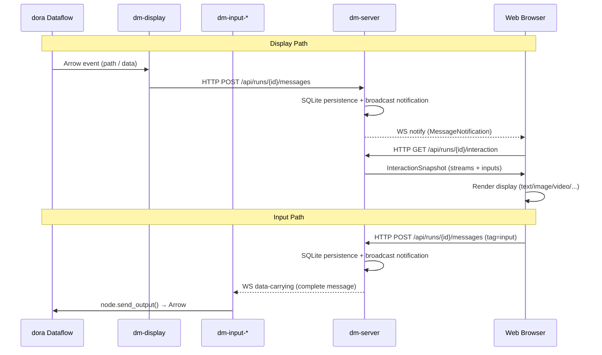
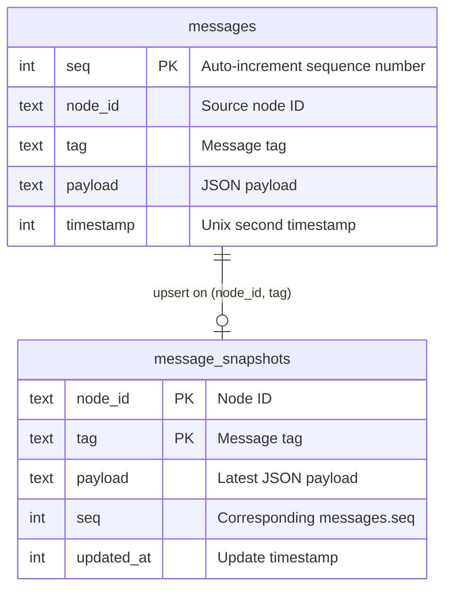

The interaction system is the core bridge for human-machine communication in Dora Manager. It establishes a **run-scoped message service model**: `dm-display` pushes content from within the dataflow to `dm-server`, which presents it to the Web frontend via WebSocket and HTTP API; conversely, frontend user operations are relayed through `dm-server` via dedicated downstream WebSocket to various `dm-input` nodes, ultimately injecting into the dora dataflow as Arrow data. The entire design follows one core constraint — **dm-server is the sole relay; all interaction messages must pass through it**.

Sources: [interaction-nodes.md](https://github.com/l1veIn/dora-manager/blob/master/docs/interaction-nodes.md#L1-L37), [run-scoped-interaction-messaging-milestone.md](https://github.com/l1veIn/dora-manager/blob/master/docs/run-scoped-interaction-messaging-milestone.md#L1-L18)

## Architecture Overview

Before understanding each component, let's establish a global perspective. The Mermaid diagram below shows the complete message chain of the interaction system — from dataflow computation nodes, through `dm-display` / `dm-input` nodes, relayed by `dm-server`, to the Web browser. Note two key characteristics: the **display side** (dataflow → display → server → web) and the **input side** (web → server → input → dataflow) are completely decoupled uplink/downlink chains.

> **Mermaid Prerequisites**: The following diagram uses `sequenceDiagram` format, solid arrows indicate synchronous requests (HTTP), dashed arrows indicate asynchronous pushes (WebSocket), and `participant` blocks represent independent processes.



Sources: [interaction-nodes.md](https://github.com/l1veIn/dora-manager/blob/master/docs/interaction-nodes.md#L9-L28), [main.rs](https://github.com/l1veIn/dora-manager/blob/master/crates/dm-server/src/main.rs#L192-L213)

## Core Design Principles

The interaction system follows five iteratively validated architectural principles that directly shape the contract between nodes and the server:

| Principle | Meaning | Consequence of Violation |
|-----------|---------|-------------------------|
| **Display side doesn't touch Arrow** | dm-display only receives path strings or lightweight text, no Arrow serialization | Nodes bear unnecessary serialization burden |
| **Nodes don't run servers** | Interaction nodes are lightweight HTTP/WS clients of dm-server, not listening on ports | Port conflicts, security risks |
| **Uplink/downlink decoupled** | Display and input are independent nodes, usable individually or combined | Increased coupling, difficult reuse |
| **dm-server is the sole relay** | All human-machine communication passes through dm-server | Multiple relays cause state inconsistency |
| **DB is the source of truth** | SQLite commits first, then exposes to clients; disconnection recovery relies on database + HTTP query | Memory state loss, unrecoverable |

Sources: [run-scoped-interaction-messaging-milestone.md](https://github.com/l1veIn/dora-manager/blob/master/docs/run-scoped-interaction-messaging-milestone.md#L30-L69)

## dm-display: Display Node

**dm-display** is the display-side node in the interaction family. Its sole responsibility is forwarding content from the dataflow that humans need to view to `dm-server`. It has two input ports — `path` (file path) and `data` (inline content) — corresponding to two different display modes.

### Dual-Port Input Model

| Port | Direction | Purpose | Typical Scenario |
|------|-----------|---------|-----------------|
| `path` | input | Receive file relative paths under `runs/:id/out/` | Images, audio, video, log files |
| `data` | input | Receive lightweight inline content | Text, JSON, Markdown |

The `path` port is designed to connect to outputs from storage family nodes (like dm-log, dm-save, dm-recorder) — dm-display reads artifact paths already persisted by these nodes, then notifies dm-server via HTTP that "new content is available for display." The `data` port bypasses the filesystem, directly passing text content, suitable for lightweight display scenarios that don't require persistence.

Sources: [dm.json](https://github.com/l1veIn/dora-manager/blob/master/nodes/dm-display/dm.json#L33-L59), [README.md](https://github.com/l1veIn/dora-manager/blob/master/nodes/dm-display/README.md#L1-L6)

### Render Mode Auto-Inference

dm-display's `render` configuration supports `"auto"` mode, where the node automatically selects the rendering method based on file extension:

```python
EXT_TO_RENDER = {
    ".log": "text", ".txt": "text",
    ".json": "json", ".md": "markdown",
    ".png": "image", ".jpg": "image", ".jpeg": "image",
    ".wav": "audio", ".mp3": "audio",
    ".mp4": "video",
}
```

For the `data` port, `auto` mode infers based on content type — `dict`/`list` parses as `json`, others parse as `text`. Developers can also force a specific render mode through the `RENDER` environment variable.

Sources: [main.py](https://github.com/l1veIn/dora-manager/blob/master/nodes/dm-display/dm_display/main.py#L15-L44), [main.py](https://github.com/l1veIn/dora-manager/blob/master/nodes/dm-display/dm_display/main.py#L93-L113)

### Message Sending Protocol

dm-display constructs a unified-format message and sends it to `dm-server` via HTTP POST upon receiving a dora INPUT event:

```
POST /api/runs/{run_id}/messages
{
  "from": "<node_id>",
  "tag": "<render_mode>",        // text, image, json, markdown, audio, video
  "payload": {
    "label": "<display title>",
    "kind": "file" | "inline",
    "file": "<relative path>",         // present when kind=file
    "content": "<content>"             // present when kind=inline
  },
  "timestamp": <unix_seconds>
}
```

Key implementation detail: the `tag` field directly uses the render mode name (e.g., `"text"`, `"image"`), enabling the server's snapshot query to filter different types of display content by tag.

Sources: [main.py](https://github.com/l1veIn/dora-manager/blob/master/nodes/dm-display/dm_display/main.py#L116-L178)

## dm-input Family: Input Nodes

Input nodes are the "human → dataflow" direction bridges of the interaction system. They register widget descriptions with `dm-server` at startup, then receive user operations from the Web frontend through dedicated WebSocket, ultimately injecting into the dora dataflow in Arrow format. Currently four input nodes are built in:

### Input Node Comparison Table

| Node | Widget Type | Output Port | Output Arrow Type | Typical Use |
|------|------------|-------------|-------------------|-------------|
| **dm-text-input** | `input` / `textarea` | `value` | `utf8` | Text prompts, multi-line input |
| **dm-button** | `button` | `click` | `utf8` | Trigger actions, flow control |
| **dm-slider** | `slider` | `value` | `float64` | Numeric adjustment, parameter control |
| **dm-input-switch** | `switch` | `value` | `boolean` | Toggle switching, mode selection |

Sources: [dm.json](https://github.com/l1veIn/dora-manager/blob/master/nodes/dm-text-input/dm.json#L54-L57), [dm.json](https://github.com/l1veIn/dora-manager/blob/master/nodes/dm-button/dm.json#L54-L57), [dm.json](https://github.com/l1veIn/dora-manager/blob/master/nodes/dm-slider/dm.json#L44-L47), [dm.json](https://github.com/l1veIn/dora-manager/blob/master/nodes/dm-input-switch/dm.json#L54-L57)

### Unified Lifecycle: Register → Listen → Output

All input nodes follow the exact same lifecycle pattern, clearly visible in their code structure:

**Phase 1: Widget Registration**. Immediately after startup, the node sends a message with `tag: "widgets"` to the server via HTTP POST, declaring which controls it provides:

```python
widgets = {
    "value": {                       # output_id = output port name
        "type": "textarea",          # widget type
        "label": "Prompt",           # display label
        "default": "",               # default value
        "placeholder": "Type..."     # placeholder text
    }
}
emit(server_url, run_id, node_id, "widgets", {
    "label": label,
    "widgets": widgets,
})
```

**Phase 2: WebSocket Long Connection Listening**. The node connects to `ws://server/api/runs/{run_id}/messages/ws/{node_id}?since=<seq>`, a data-carrying WebSocket — the server first replays historical messages after `since`, then continuously pushes new input events:

```python
since = 0
while RUNNING:
    ws = websocket.create_connection(
        messages_ws_url(server_url, run_id, node_id, since),
        timeout=2,
    )
    while RUNNING:
        raw = ws.recv()
        message = json.loads(raw)
        on_message(node, widgets, message)
        since = max(since, int(message.get("seq", since)))
```

**Phase 3: Data Re-injection**. The `on_message` callback checks whether the message's `tag` is `"input"`, then sends the value back to the dora dataflow in Arrow format via `node.send_output()`. Each node's `normalize_output` function is responsible for converting JSON values to the correct Arrow type.

Sources: [main.py](https://github.com/l1veIn/dora-manager/blob/master/nodes/dm-text-input/dm_text_input/main.py#L74-L151), [main.py](https://github.com/l1veIn/dora-manager/blob/master/nodes/dm-button/dm_button/main.py#L80-L151), [main.py](https://github.com/l1veIn/dora-manager/blob/master/nodes/dm-slider/dm_slider/main.py#L79-L159)

### Disconnection Recovery and seq Tracking

Input nodes' WebSocket connections use **seq-based disconnection recovery** strategy. The `since` variable records the maximum sequence number processed — when the connection is re-established after disconnection, the `since` parameter ensures the server replays all missed messages. This guarantees that user input operations are not lost even in network fluctuation scenarios:

```python
since = max(since, int(message.get("seq", since)))
```

Each time the WebSocket reconnects, `since` is passed as a URL query parameter, and the server's `handle_node_ws` first queries SQLite and replays all messages after `after_seq: since`.

Sources: [main.py](https://github.com/l1veIn/dora-manager/blob/master/nodes/dm-text-input/dm_text_input/main.py#L56-L61), [messages.rs](https://github.com/l1veIn/dora-manager/blob/master/crates/dm-server/src/handlers/messages.rs#L272-L318)

## dm-server Message Service

`dm-server` is the hub of the interaction system. It provides three core capabilities: **run-scoped message storage, querying, and pushing**. Each run maintains an independent SQLite database (`runs/<run_id>/interaction.db`), ensuring message isolation.

### Database Model



The `messages` table is an append-only message log, recording complete history of every interaction. The `message_snapshots` table uses `(node_id, tag)` as primary key, implementing upsert semantics via `ON CONFLICT DO UPDATE` — always saving the latest state for each node's each tag. This dual-table design simultaneously satisfies both **historical retrospective** and **latest state snapshot** requirements.

Sources: [message.rs](https://github.com/l1veIn/dora-manager/blob/master/crates/dm-server/src/services/message.rs#L108-L161)

### HTTP API Route Overview

| Method | Path | Purpose |
|--------|------|---------|
| `GET` | `/api/runs/{id}/interaction` | Get interaction snapshot (streams + inputs) |
| `POST` | `/api/runs/{id}/messages` | Write message (display / widgets / input / stream) |
| `GET` | `/api/runs/{id}/messages` | Query message history (supports after_seq / from / tag / limit filtering) |
| `GET` | `/api/runs/{id}/messages/snapshots` | Get all snapshots |
| `GET` | `/api/runs/{id}/streams` | Get video stream descriptor list |
| `GET` | `/api/runs/{id}/artifacts/{path}` | Read artifact file |
| `GET` (WS) | `/api/runs/{id}/messages/ws` | Web frontend notification WebSocket |
| `GET` (WS) | `/api/runs/{id}/messages/ws/{node_id}` | Input node data WebSocket |

Sources: [main.rs](https://github.com/l1veIn/dora-manager/blob/master/crates/dm-server/src/main.rs#L192-L213), [messages.rs](https://github.com/l1veIn/dora-manager/blob/master/crates/dm-server/src/handlers/messages.rs#L40-L97)

### Message Writing and Broadcasting

When the `push_message` handler receives a message, it executes three key steps:

1. **normalize_payload** — Normalize payload based on tag type. `tag=input` passes through directly; `tag=stream` validates required fields (path, stream_id, kind); other tags with `file` fields verify path safety (reject absolute paths and path traversal).
2. **SQLite Write** — Simultaneously write to `messages` (append) and `message_snapshots` (upsert) in a transaction.
3. **Broadcast Notification** — Send `MessageNotification` via tokio `broadcast::Sender`; all subscribed WebSocket connections (Web frontend and input nodes) receive the notification.

Sources: [messages.rs](https://github.com/l1veIn/dora-manager/blob/master/crates/dm-server/src/handlers/messages.rs#L69-L97), [message.rs](https://github.com/l1veIn/dora-manager/blob/master/crates/dm-server/src/services/message.rs#L138-L161), [state.rs](https://github.com/l1veIn/dora-manager/blob/master/crates/dm-server/src/state.rs#L18-L24)

### Two Types of WebSocket Differentiation

dm-server maintains two fundamentally different WebSocket connection paths:

**Web Notify WebSocket** (`/api/runs/{id}/messages/ws`): Designed specifically for the Web frontend, **sends only lightweight notifications**, not carrying complete data. The frontend calls HTTP API to fetch latest data upon receiving `MessageNotification`. This is the concrete implementation of the **notify vs fetch separation** principle — WS handles "when to fetch," HTTP handles "what to fetch."

**Node Data WebSocket** (`/api/runs/{id}/messages/ws/{node_id}?since=<seq>`): Designed specifically for input nodes, **carries complete message data**. Upon connection establishment, first replays historical messages from SQLite, then continuously receives new messages through `broadcast::Receiver`. The server filters — only forwarding messages where `from == "web"` and `tag == "input"` to input nodes:

```rust
if message.from != "web" && message.tag != "input" {
    continue;
}
```

Sources: [messages.rs](https://github.com/l1veIn/dora-manager/blob/master/crates/dm-server/src/handlers/messages.rs#L242-L360)

## Interaction Snapshot Aggregation

The `GET /api/runs/{id}/interaction` endpoint is the primary entry point for the frontend to obtain interaction state, returning the computed result of `MessageService::interaction_summary()`. This method executes the following aggregation logic:

1. Query `message_snapshots` to get all latest states
2. Query all `tag=input` message history, building a `current_values` mapping (indexed by `(target_node_id, output_id)` for the latest input value)
3. Iterate snapshots:
   - `tag=widgets` → build `InteractionBinding` (containing node_id, label, widgets description, current_values)
   - `tag=input` → skip (already included in binding's current_values)
   - Other tags → build `InteractionStream` (containing render type, file/content, kind)

Returns a JSON structure of `{ "streams": [...], "inputs": [...] }`.

Sources: [message.rs](https://github.com/l1veIn/dora-manager/blob/master/crates/dm-server/src/services/message.rs#L245-L333)

## Frontend Consumption Model

### Workspace Panel System

The Web frontend renders interactive content through the **Workspace panel registry**. Each panel type registers in `panelRegistry`, defining data fetch patterns, supported tags, default configurations, and render components:

| Panel Type | Data Mode | Default Tag Filter | Render Component | Purpose |
|-----------|-----------|-------------------|-----------------|---------|
| `message` | `history` | `*` (all) | MessagePanel | Display message history stream |
| `input` | `snapshot` | `widgets` | InputPanel | Render input controls |
| `chart` | `snapshot` | `chart` | ChartPanel | Chart display |
| `video` | `snapshot` | `stream` | VideoPanel | Video stream playback |
| `terminal` | `external` | (none) | TerminalPanel | Node log terminal |

The default Workspace layout includes two panels — left `message` panel (8 columns wide) and right `input` panel (4 columns wide). Users can add more panel instances via the "Add Panel" button.

Sources: [registry.ts](https://github.com/l1veIn/dora-manager/blob/master/web/src/lib/components/workspace/panels/registry.ts#L9-L79), [types.ts](https://github.com/l1veIn/dora-manager/blob/master/web/src/lib/components/workspace/types.ts#L61-L76)

### InputPanel Control Mapping

The `InputPanel` component dynamically renders different HTML controls based on the widget's `type` field. Complete control mapping table:

| widget.type | HTML Render | Value Type | Event Trigger |
|------------|------------|------------|---------------|
| `input` | `<Input>` | string | `onblur` |
| `textarea` | `<textarea>` | string | `onblur` |
| `button` | `<Button>` | string (label) | `onclick` |
| `slider` | `<input type="range">` | number | `onchange` |
| `switch` | `<input type="checkbox">` | boolean | `onchange` |
| `select` | `<select>` | string | `onchange` |
| `radio` | `<input type="radio">` | string | `onchange` |
| `checkbox` | `<input type="checkbox">` multi-select | string[] | `onchange` |
| `file` | `<input type="file">` | base64 string | `onchange` |

User actions trigger the `handleEmit` function, which constructs a standardized message format and sends it to the server:

```typescript
await context.emitMessage({
    from: "web",
    tag: "input",
    payload: {
        to: nodeId,          // target input node ID
        output_id: outputId, // widget's corresponding output port
        value: value,        // user input value
    },
});
```

Sources: [InputPanel.svelte](https://github.com/l1veIn/dora-manager/blob/master/web/src/lib/components/workspace/panels/input/InputPanel.svelte#L87-L104), [InteractionPane.svelte](https://github.com/l1veIn/dora-manager/blob/master/web/src/routes/runs/[id]/InteractionPane.svelte#L230-L311)

### MessagePanel History Loading Strategy

`MessagePanel` uses `createMessageHistoryState` to manage **bidirectional pagination** of message history loading:

- **Initial load**: Request latest 50 messages (`desc: true`), determine if there's earlier history
- **Scroll up**: When user scrolls to top (`scrollTop < 10`), load earlier messages with `before_seq: oldestSeq`
- **Incremental update**: When `refreshToken` changes (from WS notification), request new messages with `after_seq: newestSeq`

This design achieves efficient message browsing — initially loading only recent messages, loading history on demand, while maintaining real-time updates.

Sources: [message-state.svelte.ts](https://github.com/l1veIn/dora-manager/blob/master/web/src/lib/components/workspace/panels/message/message-state.svelte.ts#L20-L119)

### WebSocket Connection Management

The Run page establishes two WebSocket connections in `onMount`:

1. **Message Notification WS**: `/api/runs/{id}/messages/ws` — triggers `fetchSnapshots()` and `fetchNewInputValues()` upon notification
2. **Run Status WS**: `/api/runs/{id}/ws` — pushes logs, metrics, status changes (implemented by `run_ws.rs`)

The message notification WS uses auto-reconnect strategy — 1-second delay retry after connection close, ensuring continued updates after network recovery.

Sources: [+page.svelte](https://github.com/l1veIn/dora-manager/blob/master/web/src/routes/runs/[id]/+page.svelte#L344-L392)

## Runtime Environment Injection

The normal operation of interaction nodes depends on four environment variables automatically injected by the transpiler in Pass 4. The `inject_runtime_env` function iterates all Managed nodes, injecting each with:

| Environment Variable | Value | Purpose |
|---------------------|-------|---------|
| `DM_RUN_ID` | Current run's UUID | Identifies which run the message belongs to |
| `DM_NODE_ID` | Node's `id` in YAML | Identifies the message source node |
| `DM_RUN_OUT_DIR` | `~/.dm/runs/&lt;id&gt;/out` absolute path | Used by dm-display for path relativization |
| `DM_SERVER_URL` | `http://127.0.0.1:3210` | Address for nodes to connect to server |

This set of environment variables is the foundation for interaction nodes to establish communication with dm-server — without them, nodes cannot know which run messages should go to, which node they are, or where the server is listening.

Sources: [passes.rs](https://github.com/l1veIn/dora-manager/blob/master/crates/dm-core/src/dataflow/transpile/passes.rs#L422-L449)

## End-to-End Example: interaction-demo

`tests/dataflows/interaction-demo.yml` demonstrates the simplest interaction loop:

```yaml
nodes:
  - id: prompt
    node: dm-text-input
    outputs:
      - value
    config:
      label: "Prompt"
      placeholder: "Type something..."
      multiline: true

  - id: echo
    node: dora-echo
    inputs:
      value: prompt/value
    outputs:
      - value

  - id: display
    node: dm-display
    inputs:
      data: echo/value
    config:
      label: "Echo Output"
      render: text
```

Dataflow path: `User enters text on Web` → `POST /api/runs/{id}/messages (tag=input)` → `dm-server stores + broadcasts` → `dm-text-input receives message via WS` → `node.send_output("value", text)` → `dora-echo forwards` → `dm-display receives data port event` → `POST /api/runs/{id}/messages (tag=text)` → `dm-server updates snapshot` → `Web frontend receives notification via WS` → `Render display panel`.

Sources: [interaction-demo.yml](https://github.com/l1veIn/dora-manager/blob/master/tests/dataflows/interaction-demo.yml#L1-L25)

## Extending Custom Input Nodes

Creating new input nodes only requires following this contract:

1. **dm.json declaration**: Set `"emit": ["widgets"], "on": true` in the `interaction` field, marking it as an interactive input node
2. **Startup registration**: Send `tag: "widgets"` message to `POST /api/runs/{run_id}/messages`, with payload containing `label` and `widgets` dictionary
3. **WS listening**: Connect to `/api/runs/{run_id}/messages/ws/{node_id}?since=0`, handling messages with `tag: "input"`
4. **Data re-injection**: Extract data from message's `payload.output_id` and `payload.value`, calling `node.send_output()` to output in Arrow format

The widget's `type` field determines frontend rendering method — if you need a new control type, you need to add the corresponding rendering branch in [InputPanel.svelte](https://github.com/l1veIn/dora-manager/blob/master/web/src/lib/components/workspace/panels/input/InputPanel.svelte).

Sources: [dm.json](https://github.com/l1veIn/dora-manager/blob/master/nodes/dm-button/dm.json#L54-L57), [main.py](https://github.com/l1veIn/dora-manager/blob/master/nodes/dm-button/dm_button/main.py#L91-L107)

## Related Reading

- [Built-In Nodes: From Media Capture to AI Inference](19-builtin-nodes) — Understand the positioning of interaction nodes in the complete node ecosystem
- [Port Schema Specification: Port Validation Based on Arrow Type System](20-port-schema) — Understand the type constraints of input node output ports
- [Developing Custom Nodes: dm.json Complete Field Reference](22-custom-node-guide) — Complete field guide when creating new interaction nodes
- [Run Workspace: Grid Layout, Panel System, and Real-Time Interaction](16-runtime-workspace) — Complete usage guide for the frontend Workspace
