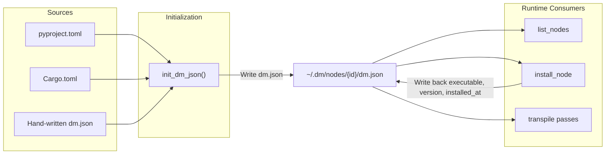

**dm.json** is the **single source of truth** for Dora Manager nodes — each node directory must contain this file, and the system uses it for the complete lifecycle management of node discovery, metadata loading, port validation, configuration injection, and installation orchestration. This document starts from type definitions in Rust source code, providing complete semantics, default value strategies, serialization rules, and real project usage examples field by field, targeting advanced developers who need to write or migrate custom nodes.

Sources: [model.rs](https://github.com/l1veIn/dora-manager/blob/master/crates/dm-core/src/node/model.rs#L1-L213), [mod.rs](https://github.com/l1veIn/dora-manager/blob/master/crates/dm-core/src/node/mod.rs#L1-L34)

## Role of dm.json in the System

dm.json is not just a static description file — it is read and written at three key stages:

1. **Import/Create Stage**: When `dm node import` or `dm node create` is executed, the `init_dm_json` function automatically infers metadata from `pyproject.toml` / `Cargo.toml` and generates dm.json. If dm.json already exists, it directly deserializes and updates the `id` field. [init.rs](https://github.com/l1veIn/dora-manager/blob/master/crates/dm-core/src/node/init.rs#L21-L112)
2. **Install Stage**: After `dm node install` executes build commands, it writes back `executable`, `version`, and `installed_at` fields to dm.json. [install.rs](https://github.com/l1veIn/dora-manager/blob/master/crates/dm-core/src/node/install.rs#L11-L75)
3. **Transpile Stage**: When dataflow YAML is transpiled to Dora native format, the transpiler reads `ports[].schema` from dm.json for port compatibility validation and reads `config_schema` for environment variable injection. [passes.rs](https://github.com/l1veIn/dora-manager/blob/master/crates/dm-core/src/dataflow/transpile/passes.rs#L160-L260)



Sources: [init.rs](https://github.com/l1veIn/dora-manager/blob/master/crates/dm-core/src/node/init.rs#L21-L112), [install.rs](https://github.com/l1veIn/dora-manager/blob/master/crates/dm-core/src/node/install.rs#L11-L75), [local.rs](https://github.com/l1veIn/dora-manager/blob/master/crates/dm-core/src/node/local.rs#L88-L136), [passes.rs](https://github.com/l1veIn/dora-manager/blob/master/crates/dm-core/src/dataflow/transpile/passes.rs#L186-L260)

## Complete Top-Level Field Reference

The `Node` struct is the Rust projection of dm.json. The following table lists all fields, where "required" is determined based on serde's default value strategy — in practice all fields have default values, and a valid dm.json can be extremely minimal.

| Field | Type | Required | Default | Semantics |
|-------|------|----------|---------|-----------|
| `id` | `string` | ✅ | — | Node unique identifier, must match directory name |
| `name` | `string` | — | `""` | Human-readable display name |
| `version` | `string` | ✅ | `""` | Semantic version number |
| `installed_at` | `string` | ✅ | `""` | Unix timestamp (seconds), automatically written on install |
| `source` | `object` | ✅ | — | Build source info, containing `build` and optional `github` |
| `description` | `string` | — | `""` | Brief description of node functionality |
| `executable` | `string` | — | `""` | Executable file path relative to node directory |
| `repository` | `object?` | — | `null` | Source repository metadata |
| `maintainers` | `array` | — | `[]` | Maintainer list |
| `license` | `string?` | — | `null` | SPDX license identifier |
| `display` | `object` | — | `{}` | Display metadata (category, tags, avatar) |
| `capabilities` | `array` | — | `[]` | Runtime capability declarations |
| `runtime` | `object` | — | `{}` | Runtime language and platform information |
| `ports` | `array` | — | `[]` | Port declaration list |
| `files` | `object` | — | `{}` | In-node file index |
| `examples` | `array` | — | `[]` | Example entry list |
| `config_schema` | `object?` | — | `null` | Configuration field definitions |
| `dynamic_ports` | `bool` | — | `false` | Whether to accept undeclared ports in YAML |

**About the `path` field**: This is a **runtime-only field**, marked with `#[serde(skip_deserializing)]`, and does not appear in the JSON file. After loading dm.json, the system attaches this field via `node.with_path(node_dir)`. [model.rs](https://github.com/l1veIn/dora-manager/blob/master/crates/dm-core/src/node/model.rs#L165-L168)

Sources: [model.rs](https://github.com/l1veIn/dora-manager/blob/master/crates/dm-core/src/node/model.rs#L110-L168)

## source — Build Source

```json
"source": {
  "build": "pip install -e .",
  "github": null
}
```

| Field | Type | Semantics |
|-------|------|-----------|
| `build` | `string` | Install command. The system determines installation strategy based on this: starts with `pip`/`uv` for Python venv flow, starts with `cargo` for Rust compilation flow |
| `github` | `string?` | Optional GitHub repository URL, inferred from `pyproject.toml`'s `repository` field in `init_dm_json` |

**Decisive impact of build command on installation flow**: The installer determines build type via `build_type.trim().to_lowercase()`. `pip install -e .` and `uv pip install -e .` trigger local Python installation (creating `.venv`), `pip install {package}` triggers remote PyPI installation, `cargo install --path .` triggers local Rust compilation. Any other value results in "Unsupported build type" error. [install.rs](https://github.com/l1veIn/dora-manager/blob/master/crates/dm-core/src/node/install.rs#L29-L61)

**Auto-inference logic**: `infer_build_command` in `init_dm_json` follows this priority — if `pyproject.toml` exists with `build-backend` as `maturin`, generate `pip install {id}`; if it's a regular Python project, generate `pip install -e .`; if `Cargo.toml` exists, generate `cargo install {id}`; fallback to `pip install {id}`. [init.rs](https://github.com/l1veIn/dora-manager/blob/master/crates/dm-core/src/node/init.rs#L228-L248)

Sources: [model.rs](https://github.com/l1veIn/dora-manager/blob/master/crates/dm-core/src/node/model.rs#L6-L10), [install.rs](https://github.com/l1veIn/dora-manager/blob/master/crates/dm-core/src/node/install.rs#L29-L61), [init.rs](https://github.com/l1veIn/dora-manager/blob/master/crates/dm-core/src/node/init.rs#L228-L248)

## repository — Source Repository

```json
"repository": {
  "url": "https://github.com/user/repo",
  "default_branch": "main",
  "reference": "v1.0.0",
  "subdir": "nodes/my-node"
}
```

| Field | Type | Default | Semantics |
|-------|------|---------|-----------|
| `url` | `string` | `""` | Repository URL |
| `default_branch` | `string?` | `null` | Default branch name |
| `reference` | `string?` | `null` | Git reference (branch name, tag, or commit hash) |
| `subdir` | `string?` | `null` | Subdirectory path within repository |

**Git operations during import**: The `import_git` function parses GitHub URL structure, supporting `https://github.com/{owner}/{repo}/tree/{ref}/{path}` format. When `subdir` exists, the system uses `git sparse-checkout` to only fetch the target subdirectory. [import.rs](https://github.com/l1veIn/dora-manager/blob/master/crates/dm-core/src/node/import.rs#L158-L200)

Sources: [model.rs](https://github.com/l1veIn/dora-manager/blob/master/crates/dm-core/src/node/model.rs#L24-L22)

## maintainers — Maintainers

```json
"maintainers": [
  { "name": "Dora Manager", "email": "dev@example.com", "url": "https://example.com" }
]
```

| Field | Type | Default | Semantics |
|-------|------|---------|-----------|
| `name` | `string` | `""` | Maintainer name (required; empty string entries preserved during serialization) |
| `email` | `string?` | `null` | Contact email |
| `url` | `string?` | `null` | Personal homepage |

`init_dm_json` infers the maintainer list from `pyproject.toml`'s `[project.authors]` array. [init.rs](https://github.com/l1veIn/dora-manager/blob/master/crates/dm-core/src/node/init.rs#L66-L78)

Sources: [model.rs](https://github.com/l1veIn/dora-manager/blob/master/crates/dm-core/src/node/model.rs#L25-L32)

## display — Display Metadata

```json
"display": {
  "category": "Builtin/Logic",
  "tags": ["logic", "bool", "and"],
  "avatar": null
}
```

| Field | Type | Default | Semantics |
|-------|------|---------|-----------|
| `category` | `string` | `""` | Category path (supports `/`-separated hierarchy), CLI's `dm node list` displays in `[category]` format |
| `tags` | `string[]` | `[]` | Search tags |
| `avatar` | `string?` | `null` | Node icon path |

Categories actually used in the project include `Builtin/Logic`, `Builtin/Interaction`, `Builtin/Media`, `Builtin/Utility`, `Builtin/Storage`, `Audio/Input`, etc.

Sources: [model.rs](https://github.com/l1veIn/dora-manager/blob/master/crates/dm-core/src/node/model.rs#L34-L42)

## capabilities — Capability Declarations

```json
"capabilities": ["configurable", "media"]
```

`capabilities` is a string array; the system currently recognizes the following values:

| Value | Semantics |
|-------|-----------|
| `"configurable"` | Node has declared `config_schema`, supports configuration panel |
| `"media"` | Node handles media streams (audio/video), used by runtime for media-related routing |

The migration script `migrate_dm_json.py` automatically injects `"configurable"` based on whether `config_schema` exists. [migrate_dm_json.py](https://github.com/l1veIn/dora-manager/blob/master/scripts/migrate_dm_json.py#L127)

Sources: [model.rs](https://github.com/l1veIn/dora-manager/blob/master/crates/dm-core/src/node/model.rs#L143)

## runtime — Runtime Information

```json
"runtime": {
  "language": "python",
  "python": ">=3.10",
  "platforms": []
}
```

| Field | Type | Default | Semantics |
|-------|------|---------|-----------|
| `language` | `string` | `""` | `"python"`, `"rust"`, or `"node"` |
| `python` | `string?` | `null` | Python version constraint (e.g., `">=3.10"`) |
| `platforms` | `string[]` | `[]` | Supported platform list (currently all empty arrays in project) |

**Auto-inference**: The `infer_runtime` function determines by priority — `pyproject.toml` exists → `"python"` (also extracts `requires-python`), `Cargo.toml` exists → `"rust"`, `package.json` exists → `"node"`. [init.rs](https://github.com/l1veIn/dora-manager/blob/master/crates/dm-core/src/node/init.rs#L269-L289)

Sources: [model.rs](https://github.com/l1veIn/dora-manager/blob/master/crates/dm-core/src/node/model.rs#L72-L79), [init.rs](https://github.com/l1veIn/dora-manager/blob/master/crates/dm-core/src/node/init.rs#L269-L289)

## ports — Port Declarations

Port declarations are the most structured part of dm.json, directly participating in **port compatibility validation** during the dataflow transpilation phase.

```json
"ports": [
  {
    "id": "audio",
    "name": "audio",
    "direction": "output",
    "description": "Continuous audio stream (Float32 PCM)",
    "required": true,
    "multiple": false,
    "schema": {
      "title": "PCM Audio Chunk",
      "description": "Float32 PCM audio samples",
      "type": { "name": "floatingpoint", "precision": "SINGLE" }
    }
  }
]
```

| Field | Type | Default | Semantics |
|-------|------|---------|-----------|
| `id` | `string` | `""` | Port identifier, must match keys in YAML `inputs`/`outputs` |
| `name` | `string` | `""` | Human-readable port name |
| `direction` | `"input"` \| `"output"` | `"input"` | Data flow direction |
| `description` | `string` | `""` | Port usage description |
| `required` | `bool` | `true` | Whether this is a required port |
| `multiple` | `bool` | `false` | Whether to accept multiple connections |
| `schema` | `object?` | `null` | Port data schema (see next section) |

**Serialization format for direction**: The Rust enum `NodePortDirection` uses `#[serde(rename_all = "snake_case")]`, so JSON writes `"input"` or `"output"`. [model.rs](https://github.com/l1veIn/dora-manager/blob/master/crates/dm-core/src/node/model.rs#L44-L50)

**Port role in transpilation**: When dataflow YAML connects two managed nodes, the transpiler looks up the corresponding `id` in both dm.json's `ports`. If **both ends have declared `schema`**, Arrow type compatibility validation is executed. If either side lacks `schema`, validation is silently skipped. When `dynamic_ports` is `true`, ports not declared in `ports` will not trigger warnings. [passes.rs](https://github.com/l1veIn/dora-manager/blob/master/crates/dm-core/src/dataflow/transpile/passes.rs#L182-L204)

Sources: [model.rs](https://github.com/l1veIn/dora-manager/blob/master/crates/dm-core/src/node/model.rs#L52-L69), [passes.rs](https://github.com/l1veIn/dora-manager/blob/master/crates/dm-core/src/dataflow/transpile/passes.rs#L182-L204)

### schema — Port Data Types (Arrow Type System)

The port's `schema` field follows the **DM Port Schema** specification, declaring data contracts based on the Apache Arrow type system. Complete Port Schema structure:

```json
{
  "$id": "dm-schema://audio-pcm",
  "title": "PCM Audio Chunk",
  "description": "Float32 PCM audio samples",
  "type": { "name": "floatingpoint", "precision": "SINGLE" },
  "nullable": false,
  "items": { },
  "properties": { },
  "required": [],
  "metadata": {}
}
```

| Field | Type | Semantics |
|-------|------|-----------|
| `$id` | `string?` | Schema unique identifier (URI format) |
| `title` | `string?` | Short name |
| `description` | `string?` | Detailed description |
| `type` | `object` | **Required.** Arrow type declaration, structure varies by type |
| `nullable` | `bool` | Default `false`, whether value can be null |
| `items` | `object?` | Element schema for list types (recursive) |
| `properties` | `object?` | Sub-fields for struct types (recursive map) |
| `required` | `string[]?` | List of required field names for struct types |
| `metadata` | `any?` | Free-format additional annotations |

`schema` can also use `$ref` to reference external files: `{ "$ref": "schemas/audio.json" }`. The parser loads referenced files relative to the node directory. [parse.rs](https://github.com/l1veIn/dora-manager/blob/master/crates/dm-core/src/node/schema/parse.rs#L15-L22)

Sources: [schema/model.rs](https://github.com/l1veIn/dora-manager/blob/master/crates/dm-core/src/node/schema/model.rs#L157-L184), [parse.rs](https://github.com/l1veIn/dora-manager/blob/master/crates/dm-core/src/node/schema/parse.rs#L15-L97)

#### Arrow Type Quick Reference

The `type` field's `name` determines the parsing method. Below are all supported Arrow types and their required additional fields:

| type.name | Additional Fields | Example | Common Use |
|-----------|------------------|---------|------------|
| `"null"` | None | `{"name": "null"}` | Trigger signals, heartbeats |
| `"bool"` | None | `{"name": "bool"}` | Boolean control |
| `"int"` | `bitWidth`, `isSigned` | `{"name": "int", "bitWidth": 8, "isSigned": false}` | Image bytes (uint8), integers |
| `"floatingpoint"` | `precision` | `{"name": "floatingpoint", "precision": "SINGLE"}` | PCM audio (float32), numbers |
| `"utf8"` | None | `{"name": "utf8"}` | Text, JSON encoded data |
| `"largeutf8"` | None | `{"name": "largeutf8"}` | Large text |
| `"binary"` | None | `{"name": "binary"}` | Binary data blocks |
| `"largebinary"` | None | `{"name": "largebinary"}` | Large binary data |
| `"fixedsizebinary"` | `byteWidth` | `{"name": "fixedsizebinary", "byteWidth": 16}` | Fixed-length binary |
| `"date"` | `unit` | `{"name": "date", "unit": "DAY"}` | Date |
| `"time"` | `unit`, `bitWidth` | `{"name": "time", "unit": "MICROSECOND", "bitWidth": 64}` | Time |
| `"timestamp"` | `unit`, `timezone?` | `{"name": "timestamp", "unit": "MICROSECOND", "timezone": "UTC"}` | Timestamp |
| `"duration"` | `unit` | `{"name": "duration", "unit": "SECOND"}` | Duration |
| `"list"` | None + `items` | `{"name": "list"}` | Variable-length list |
| `"largelist"` | None + `items` | `{"name": "largelist"}` | Large variable-length list |
| `"fixedsizelist"` | `listSize` + `items` | `{"name": "fixedsizelist", "listSize": 1600}` | Fixed-length list (e.g., audio frames) |
| `"struct"` | None + `properties` | `{"name": "struct"}` | Structured records |
| `"map"` | `keysSorted` | `{"name": "map", "keysSorted": true}` | Key-value mapping |

**precision enum values**: `"HALF"` (float16), `"SINGLE"` (float32), `"DOUBLE"` (float64). **unit enum values**: `"SECOND"`, `"MILLISECOND"`, `"MICROSECOND"`, `"NANOSECOND"`. [schema/model.rs](https://github.com/l1veIn/dora-manager/blob/master/crates/dm-core/src/node/schema/model.rs#L11-L107)

Sources: [schema/parse.rs](https://github.com/l1veIn/dora-manager/blob/master/crates/dm-core/src/node/schema/parse.rs#L103-L256), [schema/model.rs](https://github.com/l1veIn/dora-manager/blob/master/crates/dm-core/src/node/schema/model.rs#L67-L107)

#### Port Compatibility Validation Rules

When two managed nodes are connected through dataflow, the transpiler calls `check_compatibility(output_schema, input_schema)` to execute **subtype** semantic checks. Core rules:

| Rule | Description |
|------|-------------|
| Exact match | Same type always compatible |
| Integer safe widening | `int32 → int64` allowed, `int64 → int32` rejected, signs must match |
| Float safe widening | `float32 → float64` allowed, reverse rejected |
| utf8 → largeutf8 | Small text to large text safe |
| binary → largebinary | Small binary to large binary safe |
| fixedsizelist → list | Fixed-size list is subtype of variable-length list |
| Struct field coverage | Output struct must contain all `required` fields of input struct |

Sources: [schema/compat.rs](https://github.com/l1veIn/dora-manager/blob/master/crates/dm-core/src/node/schema/compat.rs#L91-L195)

## files — File Index

```json
"files": {
  "readme": "README.md",
  "entry": "dm_and/main.py",
  "config": "config.json",
  "tests": ["tests", "tests/test_basic.py"],
  "examples": []
}
```

| Field | Type | Default | Semantics |
|-------|------|---------|-----------|
| `readme` | `string` | `"README.md"` | README file relative path |
| `entry` | `string?` | `null` | Entry file path |
| `config` | `string?` | `null` | Configuration file path (config.json / config.toml / config.yaml) |
| `tests` | `string[]` | `[]` | Test file or directory list |
| `examples` | `string[]` | `[]` | Example file or directory list |

**Entry file inference**: Python projects probe in order `{module}/main.py` → `src/{module}/main.py` → `main.py`; Rust projects probe `src/main.rs` → `main.rs`; Node projects check `index.js`. Configuration files probe in order `config.json` → `config.toml` → `config.yaml` → `config.yml`. [init.rs](https://github.com/l1veIn/dora-manager/blob/master/crates/dm-core/src/node/init.rs#L291-L336)

Sources: [model.rs](https://github.com/l1veIn/dora-manager/blob/master/crates/dm-core/src/node/model.rs#L82-L93), [init.rs](https://github.com/l1veIn/dora-manager/blob/master/crates/dm-core/src/node/init.rs#L291-L336)

## config_schema — Configuration Field Definitions

`config_schema` is a free-format JSON object where each key corresponds to a configuration item. This is the core of the **declarative configuration** system — the transpiler reads this field in Pass 3 (configuration merge phase), resolves values by priority `inline_config > config.json persisted value > default`, then injects into environment variables.

```json
"config_schema": {
  "sample_rate": {
    "default": 16000,
    "description": "Audio sample rate in Hz",
    "env": "SAMPLE_RATE",
    "x-widget": {
      "type": "select",
      "options": [8000, 16000, 24000, 44100, 48000]
    }
  }
}
```

Fields for each configuration item:

| Field | Type | Semantics |
|-------|------|-----------|
| `default` | `any` | Default value. When absent, environment variable will not be set |
| `description` | `string?` | Human-readable description of configuration item |
| `env` | `string?` | Mapped environment variable name. **Only configuration items with `env` declared will be injected into runtime environment** |
| `x-widget` | `object?` | Frontend UI control hint (see next section) |

**Environment variable injection flow**: The transpiler iterates each key in `config_schema`, reads its `env` field as environment variable name, then looks up values by priority chain inline_config → config.json persistence → default, ultimately writing to `merged_env`. [passes.rs](https://github.com/l1veIn/dora-manager/blob/master/crates/dm-core/src/dataflow/transpile/passes.rs#L370-L416)

Sources: [model.rs](https://github.com/l1veIn/dora-manager/blob/master/crates/dm-core/src/node/model.rs#L158), [passes.rs](https://github.com/l1veIn/dora-manager/blob/master/crates/dm-core/src/dataflow/transpile/passes.rs#L370-L416)

### x-widget — Frontend Control Hints

`x-widget` is an extension field in `config_schema` entries, telling the frontend node details page which UI control to use for rendering this configuration item. The frontend `SettingsTab.svelte` directly reads `s?.["x-widget"]?.type` to determine rendering logic.

| type value | Additional Fields | Rendered As | Example |
|-----------|------------------|-------------|---------|
| `"select"` | `options: (string\|number)[]` | Dropdown select | `{"type": "select", "options": ["jpeg", "rgb8", "rgba8"]}` |
| `"slider"` | `min`, `max`, `step` | Slider | `{"type": "slider", "min": 0, "max": 100, "step": 1}` |
| `"switch"` | None | Switch | `{"type": "switch"}` |
| `"radio"` | `options` | Radio button group | `{"type": "radio", "options": ["a", "b"]}` |
| `"checkbox"` | `options` | Multi-select checkboxes | `{"type": "checkbox", "options": ["x", "y"]}` |
| `"file"` | None | File picker | `{"type": "file"}` |
| `"directory"` | None | Directory picker | `{"type": "directory"}` |

When `x-widget` is not declared, the frontend auto-infers based on value type: strings render as text input, numbers render as number input, booleans render as switches.

Sources: [SettingsTab.svelte](https://github.com/l1veIn/dora-manager/blob/master/web/src/routes/nodes/[id]/components/SettingsTab.svelte#L73-L182), [InspectorConfig.svelte](https://github.com/l1veIn/dora-manager/blob/master/web/src/routes/dataflows/[id]/components/graph/InspectorConfig.svelte#L169)

## dynamic_ports — Dynamic Port Switch

```json
"dynamic_ports": false
```

When set to `true`, the dataflow transpiler **skips** validation of ports declared in YAML but not registered in the `ports` array. This is critical for nodes that need to dynamically create ports based on user configuration (such as generic data forwarding nodes). Default `false` means all ports used in YAML should have corresponding declarations in `ports`.

Sources: [model.rs](https://github.com/l1veIn/dora-manager/blob/master/crates/dm-core/src/node/model.rs#L159-L163), [passes.rs](https://github.com/l1veIn/dora-manager/blob/master/crates/dm-core/src/dataflow/transpile/passes.rs#L186-L192)

## Complete dm.json Example

Below is a fully-featured dm.json demonstrating actual usage of all fields:

```json
{
  "id": "dm-microphone",
  "name": "dm-microphone",
  "version": "0.1.0",
  "installed_at": "1773318598",
  "source": {
    "build": "pip install -e .",
    "github": null
  },
  "description": "Microphone input with device selection. Publishes available devices for dynamic widget binding.",
  "executable": ".venv/bin/dm-microphone",
  "maintainers": [
    { "name": "Dora Manager" }
  ],
  "display": {
    "category": "Audio/Input",
    "tags": ["audio", "microphone", "input"]
  },
  "capabilities": ["configurable", "media"],
  "runtime": {
    "language": "python",
    "python": ">=3.10",
    "platforms": []
  },
  "ports": [
    {
      "id": "audio",
      "name": "audio",
      "direction": "output",
      "description": "Continuous audio stream (Float32 PCM)",
      "required": true,
      "multiple": false,
      "schema": {
        "title": "PCM Audio Chunk",
        "description": "Float32 PCM audio samples",
        "type": { "name": "floatingpoint", "precision": "SINGLE" }
      }
    },
    {
      "id": "device_id",
      "name": "device_id",
      "direction": "input",
      "description": "Select microphone by device ID",
      "required": false,
      "multiple": false,
      "schema": { "type": { "name": "utf8" } }
    }
  ],
  "files": {
    "readme": "README.md",
    "entry": "dm_microphone/main.py",
    "tests": [],
    "examples": []
  },
  "examples": [],
  "config_schema": {
    "sample_rate": {
      "default": 16000,
      "env": "SAMPLE_RATE",
      "x-widget": {
        "type": "select",
        "options": [8000, 16000, 24000, 44100, 48000]
      }
    },
    "max_duration": {
      "default": 0.1,
      "description": "Buffer duration in seconds before sending audio chunk",
      "env": "MAX_DURATION"
    }
  },
  "dynamic_ports": false
}
```

Sources: [dm-microphone/dm.json](https://github.com/l1veIn/dora-manager/blob/master/nodes/dm-microphone/dm.json)

## Minimal dm.json Template

For nodes just getting started, the following template covers required fields; all others can rely on defaults:

```json
{
  "id": "my-node",
  "version": "0.1.0",
  "installed_at": "",
  "source": {
    "build": "pip install -e ."
  },
  "description": "A brief description of what this node does.",
  "ports": [
    {
      "id": "input",
      "name": "input",
      "direction": "input",
      "description": "Input data",
      "required": true,
      "multiple": false,
      "schema": { "type": { "name": "utf8" } }
    },
    {
      "id": "output",
      "name": "output",
      "direction": "output",
      "description": "Processed result",
      "required": true,
      "multiple": false,
      "schema": { "type": { "name": "utf8" } }
    }
  ]
}
```

In practice, when creating a node via `dm node create my-node "description"`, `init_dm_json` automatically generates a complete dm.json with all metadata inferred from `pyproject.toml`. [init.rs](https://github.com/l1veIn/dora-manager/blob/master/crates/dm-core/src/node/init.rs#L21-L112), [local.rs](https://github.com/l1veIn/dora-manager/blob/master/crates/dm-core/src/node/local.rs#L13-L86)

## Field Auto-Inference Rules Summary

The core design philosophy of `init_dm_json` is **zero-configuration first** — developers don't need to hand-write most fields in dm.json; the system automatically infers from standard project files. Below is the complete inference chain:

| dm.json Field | Inference Source | Priority |
|--------------|-----------------|----------|
| `id` | Directory name | Fixed |
| `name` | `pyproject.toml` `[project.name]` / `Cargo.toml` `[package.name]` / Directory name | pyproject > cargo > fallback |
| `version` | `pyproject.toml` `[project.version]` / `Cargo.toml` `[package.version]` | pyproject > cargo > fallback |
| `description` | CLI parameter `--description` / `pyproject.toml` `[project.description]` / `Cargo.toml` `[package.description]` | hints > pyproject > cargo |
| `source.build` | Inferred by `build-backend` / file type | See `infer_build_command` |
| `repository` | `pyproject.toml` `[project.urls.Repository]` | pyproject only |
| `maintainers` | `pyproject.toml` `[project.authors]` | pyproject only |
| `license` | `pyproject.toml` `[project.license]` / `Cargo.toml` `[package.license]` | pyproject > cargo |
| `runtime.language` | File existence probe: pyproject.toml → python, Cargo.toml → rust, package.json → node | By priority |
| `runtime.python` | `pyproject.toml` `[project.requires-python]` | pyproject only |
| `files.readme` | File probe `README.md` | Default `"README.md"` |
| `files.entry` | Path probe (see `infer_files`) | Python/Rust/Node each have candidate lists |
| `files.config` | File probe `config.json` → `config.toml` → `config.yaml` → `config.yml` | In order |
| `files.tests` | Files and directories containing `test`/`tests` | Auto-collected |
| `files.examples` | Files and directories containing `example`/`examples`/`demo` | Auto-collected |

Sources: [init.rs](https://github.com/l1veIn/dora-manager/blob/master/crates/dm-core/src/node/init.rs#L21-L361)

## Common Pitfalls and Best Practices

**1. `id` must match directory name**: `init_dm_json` forcefully overwrites `id` to the directory name when loading existing dm.json. [init.rs](https://github.com/l1veIn/dora-manager/blob/master/crates/dm-core/src/node/init.rs#L32)

**2. `source.build` determines installation path**: Incorrect build commands cause installation failure. Python nodes must start with `pip` or `uv`, Rust nodes must start with `cargo`. [install.rs](https://github.com/l1veIn/dora-manager/blob/master/crates/dm-core/src/node/install.rs#L29-L61)

**3. Only entries with `env` declared in `config_schema` are injected**: If you want a configuration item available at runtime, you must provide the `env` field name, otherwise the transpiler skips the entry. [passes.rs](https://github.com/l1veIn/dora-manager/blob/master/crates/dm-core/src/dataflow/transpile/passes.rs#L390-L393)

**4. Missing port schema doesn't error but skips validation**: The transpiler only executes compatibility checks when both port ends have declared schemas. If your node needs type safety, provide `schema` for every port. [passes.rs](https://github.com/l1veIn/dora-manager/blob/master/crates/dm-core/src/dataflow/transpile/passes.rs#L198-L204)

**5. `executable` is written back after installation**: Python nodes become `.venv/bin/{id}` (macOS/Linux) or `.venv/Scripts/{id}.exe` (Windows), Rust nodes become `bin/dora-{id}` or `bin/{id}` (if id already starts with `dora-`). [install.rs](https://github.com/l1veIn/dora-manager/blob/master/crates/dm-core/src/node/install.rs#L39-L58)

**6. `interaction` field is a pass-through field**: Some built-in interaction nodes (like dm-slider, dm-text-input) contain an `interaction` field in dm.json, but this field is not in the Rust `Node` struct — serde silently ignores it during deserialization. This field may be directly read from raw JSON by the frontend or other toolchains.

Sources: [init.rs](https://github.com/l1veIn/dora-manager/blob/master/crates/dm-core/src/node/init.rs#L32), [install.rs](https://github.com/l1veIn/dora-manager/blob/master/crates/dm-core/src/node/install.rs#L29-L58), [passes.rs](https://github.com/l1veIn/dora-manager/blob/master/crates/dm-core/src/dataflow/transpile/passes.rs#L198-L204)

---

**Next Reading**: To deeply understand the mathematical foundation and compatibility algorithms of port type validation, see [Port Schema Specification: Port Validation Based on Arrow Type System](20-port-schema); to understand how dm.json participates in the complete multi-pass transpilation pipeline, see [Dataflow Transpiler: Multi-Pass Pipeline and Four-Layer Configuration Merge](08-transpiler); to browse existing node dm.json instances, see [Built-In Nodes: From Media Capture to AI Inference](19-builtin-nodes).
