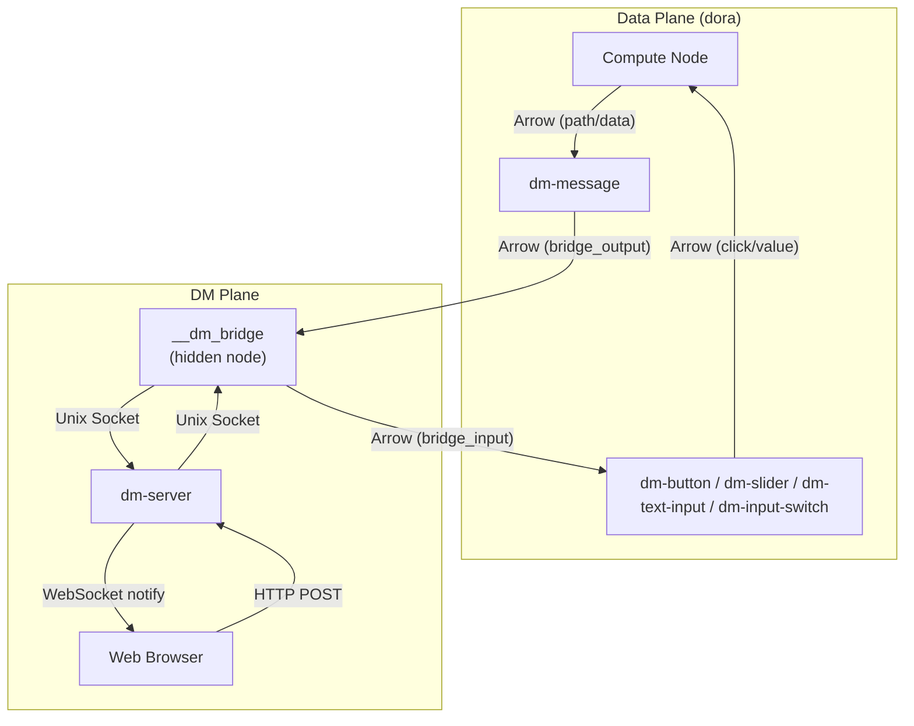
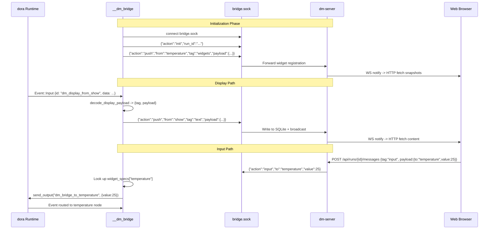

The interaction system is the bridge layer in Dora Manager that connects humans to data flows. Its core architectural decision is to introduce a **hidden Bridge node** -- automatically injected by the transpiler at compile time -- that consolidates all DM-plane communication (display push, user input injection) into a single process that communicates with dm-server via a Unix domain socket. This design means interaction nodes themselves require no networking code at all; they use only standard dora Arrow ports to complete all human-machine communication. This article starts from the **dual-plane model**, providing a deep analysis of how capability declarations drive the transpiler to inject the Bridge, how nodes interact with the Bridge via Arrow ports, and how dm-server completes message relay through Unix sockets.

Sources: [bridge.rs](https://github.com/l1veIn/dora-manager/blob/main/crates/dm-core/src/dataflow/transpile/bridge.rs#L1-L27), [passes.rs](https://github.com/l1veIn/dora-manager/blob/main/crates/dm-core/src/dataflow/transpile/passes.rs#L442-L564), [bridge.rs](https://github.com/l1veIn/dora-manager/blob/main/crates/dm-cli/src/bridge.rs#L1-L80)

## Dual-Plane Model: Data Plane and DM Plane

The architectural foundation of the interaction system is a clear dual-plane separation. The **Data Plane** is the standard Arrow stream communication provided by the dora runtime -- nodes pass structured data between each other through `inputs` / `outputs` ports. The **DM Plane** is the interaction layer added by Dora Manager -- responsible for bridging data-plane data to the Web frontend, or injecting user actions back into the data-plane.

These two planes intersect at junction points declared through the `capabilities` field in the node's `dm.json`. For example, the `dm-message` capability declares the `display` family, where `port: "data"` means the data-plane's `data` input port is simultaneously the DM-plane's inline display source. This binding relationship is not negotiated at runtime -- it is statically resolved during the transpile phase and transformed into concrete connection topology.



This architecture diagram reveals a key insight: **interaction nodes have no networking stack at all**. dm-message only sends JSON strings through a standard dora output port, and dm-button only receives JSON strings through a standard dora input port. All communication with dm-server (HTTP, WebSocket, Unix socket) is concentrated in a single process: `__dm_bridge`.

Sources: [dm.json](https://github.com/l1veIn/dora-manager/blob/main/nodes/dm-message/dm.json#L41-L75), [dm.json](https://github.com/l1veIn/dora-manager/blob/main/nodes/dm-button/dm.json#L37-L55), [bridge.rs](https://github.com/l1veIn/dora-manager/blob/main/crates/dm-cli/src/bridge.rs#L78-L200)

## dm-message: How Display Nodes Work

**dm-message** is the display-side node of the interaction family, responsible for forwarding content from the data-plane that needs human viewing to the DM-plane. It has two standard dora input ports -- `path` (file path) and `data` (inline content) -- and one hidden output port `dm_bridge_output_internal` injected by the transpiler.

### Dual-Port Input and Unified Bridge Output

dm-message's workflow is extremely concise: it receives dora INPUT events, constructs a JSON message in `{tag, payload}` format, and sends it out through the bridge output port. Specifically, when the `path` port receives a file path, the payload contains `{kind: "file", file: "<relative path>"}`; when the `data` port receives inline content, the payload contains `{kind: "inline", content: "<content>"}`. The `tag` field always uses the render mode name (e.g., `"text"`, `"image"`, `"json"`).

The core send function `emit_bridge` is only four lines of code:

```python
def emit_bridge(node: Node, output_port: str, tag: str, payload: dict):
    node.send_output(
        output_port,
        pa.array([json.dumps({"tag": tag, "payload": payload}, ensure_ascii=False)]),
    )
```

The output port name is read from the `DM_BRIDGE_OUTPUT_PORT` environment variable, with a default value of `dm_bridge_output_internal` -- this port does not exist in the YAML and is entirely dynamically injected by the transpiler in the `inject_dm_bridge` pass.

Sources: [main.py](https://github.com/l1veIn/dora-manager/blob/main/nodes/dm-message/dm_display/main.py#L116-L121), [main.py](https://github.com/l1veIn/dora-manager/blob/main/nodes/dm-message/dm_display/main.py#L143-L172)

### Automatic Render Mode Inference

dm-message's `render` configuration supports an `"auto"` mode, which automatically selects the rendering method based on the input source. For `path` input, it uses file extension mapping (`.log` -> `text`, `.json` -> `json`, `.png` -> `image`, etc.); for `data` input, it infers based on the Python value type (`dict`/`list` -> `json`, others -> `text`). Developers can also force a specific mode via the `RENDER` environment variable.

Sources: [main.py](https://github.com/l1veIn/dora-manager/blob/main/nodes/dm-message/dm_display/main.py#L15-L29), [main.py](https://github.com/l1veIn/dora-manager/blob/main/nodes/dm-message/dm_display/main.py#L87-L113)

## dm-input Family: How Input Nodes Work

Input nodes are the "human-to-data-flow" direction bridge in the interaction system. Four types are currently built in, and they follow an identical working pattern: **listen for JSON messages on a hidden bridge input port, parse them, and send Arrow data through standard dora output ports**.

### Input Node Comparison Table

| Node | Capability Declared in dm.json | Output Port | Output Arrow Type | Typical Use |
|------|-------------------------------|-------------|-------------------|-------------|
| **dm-text-input** | `widget_input` | `value` | `utf8` | Text prompts, multiline input |
| **dm-button** | `widget_input` | `click` | `utf8` | Triggering actions, flow control |
| **dm-slider** | `widget_input` | `value` | `float64` | Numerical adjustment, parameter control |
| **dm-input-switch** | `widget_input` | `value` | `boolean` | Toggle switching, mode selection |

Sources: [dm.json](https://github.com/l1veIn/dora-manager/blob/main/nodes/dm-text-input/dm.json#L37-L55), [dm.json](https://github.com/l1veIn/dora-manager/blob/main/nodes/dm-button/dm.json#L37-L55), [dm.json](https://github.com/l1veIn/dora-manager/blob/main/nodes/dm-slider/dm.json#L37-L56), [dm.json](https://github.com/l1veIn/dora-manager/blob/main/nodes/dm-input-switch/dm.json#L37-L56)

### Unified Message Reception Pattern

The core logic of all input nodes is completely identical -- they read JSON messages from the port specified by the `DM_BRIDGE_INPUT_PORT` environment variable, extract the `value` field, perform type conversion, and send to the semantic output port. Taking dm-button as an example:

```python
bridge_input_port = env_str("DM_BRIDGE_INPUT_PORT", "dm_bridge_input_internal")
node = Node()

for event in node:
    if event["type"] != "INPUT" or event["id"] != bridge_input_port:
        continue
    payload = decode_bridge_payload(event["value"])
    if payload is None:
        continue
    node.send_output("click", normalize_output(payload.get("value")))
```

The difference between each node lies only in the `normalize_output` function -- dm-slider converts values to `float64`, dm-input-switch to `boolean`, and dm-text-input and dm-button keep them as `utf8` strings. This pattern means that **adding a new input node type only requires implementing two functions**: `decode_bridge_payload` (JSON parsing) and `normalize_output` (type conversion).

Sources: [main.py](https://github.com/l1veIn/dora-manager/blob/main/nodes/dm-button/dm_button/main.py#L54-L81), [main.py](https://github.com/l1veIn/dora-manager/blob/main/nodes/dm-slider/dm_slider/main.py#L53-L80), [main.py](https://github.com/l1veIn/dora-manager/blob/main/nodes/dm-input-switch/dm_input_switch/main.py#L55-L77), [main.py](https://github.com/l1veIn/dora-manager/blob/main/nodes/dm-text-input/dm_text_input/main.py#L77-L104)

## Bridge Node Injection: The Transpiler's Core Magic

Bridge injection is the most critical architectural decision in the entire interaction system. It is automatically completed at compile time through the transpiler's Pass 4.5 (`inject_dm_bridge`), and is completely transparent to YAML authors.

### Capability-Driven Auto-Discovery

The first step in the injection process is **capability scanning**. The `build_bridge_node_spec` function reads each managed node's `dm.json`, checking whether its `capabilities` field contains the `display` or `widget_input` family. The key logic is as follows:

```rust
let bindings = meta
    .capability_bindings()
    .into_iter()
    .filter_map(|(family, binding)| match family.as_str() {
        "widget_input" | "display" => Some(HiddenBridgeBindingSpec { ... }),
        _ => None,
    })
    .collect::<Vec<_>>();
```

Only nodes that declare these two capabilities participate in bridge topology generation. Other nodes (such as dora-echo, dm-log, and other pure computation or storage nodes) are completely unaffected. This means that **dm-core does not contain any hardcoded node IDs** -- bridge injection is entirely driven by capability metadata.

Sources: [bridge.rs](https://github.com/l1veIn/dora-manager/blob/main/crates/dm-core/src/dataflow/transpile/bridge.rs#L68-L102), [model.rs](https://github.com/l1veIn/dora-manager/blob/main/crates/dm-core/src/node/model.rs#L333-L345)

### Dynamic Injection of Hidden Ports

After scanning is complete, the `inject_dm_bridge` function dynamically injects hidden ports and environment variables for each interaction node. This process is divided into two directions:

**Widget Input Direction** (dm-button, dm-slider, etc.) -- the transpiler does three things:
1. Adds a `dm_bridge_input_internal: __dm_bridge/<bridge_output_port>` connection to the node's `inputs` mapping
2. Injects the `DM_BRIDGE_INPUT_PORT` environment variable with a fixed value of `dm_bridge_input_internal`
3. Records the node's `bridge_output_port` (in the format `dm_bridge_to_<yaml_id>`) for use by the bridge node

**Display Direction** (dm-message) -- the transpiler similarly does three things:
1. Adds `dm_bridge_output_internal` to the node's `outputs` list
2. Injects the `DM_BRIDGE_OUTPUT_PORT` environment variable
3. Records the node's `bridge_input_port` (in the format `dm_display_from_<yaml_id>`) for use by the bridge node

Sources: [passes.rs](https://github.com/l1veIn/dora-manager/blob/main/crates/dm-core/src/dataflow/transpile/passes.rs#L462-L530), [bridge.rs](https://github.com/l1veIn/dora-manager/blob/main/crates/dm-core/src/dataflow/transpile/bridge.rs#L142-L170)

### Generation of the `__dm_bridge` Hidden Node

After all interaction node specs are collected, the transpiler appends a hidden managed node to the dataflow graph with the YAML ID `__dm_bridge`:

```rust
graph.nodes.push(DmNode::Managed(ManagedNode {
    yaml_id: HIDDEN_DM_BRIDGE_YAML_ID.to_string(),  // "__dm_bridge"
    node_id: "dm".to_string(),                        // uses dm CLI as the executable
    resolved_path: bridge_path,                       // points to dm CLI binary
    merged_env: env,                                  // contains DM_CAPABILITIES_JSON
    extra_fields: bridge_extra,                       // contains all inputs/outputs connections
}));
```

This node's `resolved_path` points to the dm CLI executable, `args` is set to `bridge --run-id <id>`, and the most critical environment variable `DM_CAPABILITIES_JSON` contains the serialized specs of all interaction nodes -- it is the sole data source for the bridge process to build its routing table at runtime. The bridge's `inputs` mapping consolidates all display nodes' `dm_bridge_output_internal` outputs into its own `dm_display_from_*` ports; the bridge's `outputs` list contains all `dm_bridge_to_*` ports, each connected to the corresponding input node.

Sources: [passes.rs](https://github.com/l1veIn/dora-manager/blob/main/crates/dm-core/src/dataflow/transpile/passes.rs#L530-L564), [bridge.rs](https://github.com/l1veIn/dora-manager/blob/main/crates/dm-core/src/dataflow/transpile/bridge.rs#L25-L27)

### Injection Example: From YAML to Compiled Topology

Using a slider+display subgraph from `demos/demo-interactive-widgets.yml` as an example, the following illustrates the topology changes before and after injection:

**Original YAML (written by the user)**:
```yaml
- id: temperature
  node: dm-slider
  outputs: [value]
  config:
    label: "Temperature (°C)"
    min_val: -20
    max_val: 50
```

**After Transpiler Injection (equivalent expansion)**:
```yaml
- id: temperature
  path: /path/to/dm-slider/.venv/bin/dm-slider
  outputs: [value]
  inputs:
    dm_bridge_input_internal: __dm_bridge/dm_bridge_to_temperature
  env:
    DM_BRIDGE_INPUT_PORT: "dm_bridge_input_internal"
    LABEL: "Temperature (°C)"
    MIN_VAL: "-20"
    MAX_VAL: "50"
    # ... other environment variables

- id: __dm_bridge
  path: /path/to/dm
  args: "bridge --run-id <uuid>"
  outputs:
    - dm_bridge_to_temperature
    # ... output ports for other widget nodes
  inputs:
    # ... bridge outputs from display nodes
  env:
    DM_CAPABILITIES_JSON: '[{"yaml_id":"temperature","node_id":"dm-slider",...}]'
    DM_RUN_ID: "<uuid>"
```

The user is completely unaware of the existence of the `__dm_bridge` node -- it is automatically injected during the transpile phase when `dm start` is executed, and is destroyed along with the dataflow when `dm stop` is executed.

Sources: [demo-interactive-widgets.yml](demos/demo-interactive-widgets.yml#L1-L129), [passes.rs](https://github.com/l1veIn/dora-manager/blob/main/crates/dm-core/src/dataflow/transpile/passes.rs#L442-L564)

## Bridge Process Runtime: Unix Socket Bidirectional Relay

The `__dm_bridge` node at runtime starts the `dm bridge --run-id <id>` subcommand, executing the `bridge_serve` function. This is a dual-role process -- it is both a regular node in the dora dataflow (initialized via `DoraNode::init_from_env()`) and a Unix socket client of dm-server.

### Routing Table Construction

After the bridge process starts, it first parses all specs from the `DM_CAPABILITIES_JSON` environment variable and constructs two routing tables:

| Routing Table | Key | Purpose |
|--------------|-----|---------|
| `widget_specs` | yaml_id -> (output_port, widget_payload) | Input direction: determines which dora output port to use to send user input to which node |
| `display_ports` | dora input port -> BridgeSpec | Display direction: determines which display node a received dora event came from |

Sources: [bridge.rs](https://github.com/l1veIn/dora-manager/blob/main/crates/dm-cli/src/bridge.rs#L82-L112)

### Widget Registration and Socket Connection

After the routing table is constructed, the bridge connects to dm-server via a Unix domain socket (`~/.dm/bridge.sock`). Once the connection is established, it sends two messages:

1. **Init message**: `{"action":"init","run_id":"<uuid>"}` -- declares which run's bridge it is
2. **Widget registration**: for each widget_input node, sends `{"action":"push","from":"<yaml_id>","tag":"widgets","payload":{...}}` -- widget descriptions are dynamically generated by the `widget_payload()` function based on node type (dm-text-input -> textarea, dm-button -> button, dm-slider -> slider, dm-input-switch -> switch)

Sources: [bridge.rs](https://github.com/l1veIn/dora-manager/blob/main/crates/dm-cli/src/bridge.rs#L113-L138), [bridge.rs](https://github.com/l1veIn/dora-manager/blob/main/crates/dm-cli/src/bridge.rs#L236-L282)

### Unified FIFO Task Queue

The bridge process adopts a **unified task queue** pattern to handle two asynchronous event sources -- dora dataflow events and Unix socket messages. Two producers (a synchronous thread for dora events, an async task for socket reading) push tasks into the same `mpsc::channel`, processed by a single consumer in FIFO order:



Sources: [bridge.rs](https://github.com/l1veIn/dora-manager/blob/main/crates/dm-cli/src/bridge.rs#L139-L200), [bridge.rs](https://github.com/l1veIn/dora-manager/blob/main/crates/dm-cli/src/bridge.rs#L284-L356)

### Display Direction: From dora Events to Server Messages

When the bridge receives an `Event::Input` from dora, it checks whether the `id` exists in the `display_ports` routing table. If matched, it decodes the JSON string from the Arrow data (in `{tag, payload}` format), constructs a `{"action":"push","from":"<yaml_id>","tag":"<render_mode>","payload":<display_payload>}` message, and writes it to the Unix socket. When dm-server's `bridge_socket_loop` receives it, it calls `MessageService::push()` to persist to SQLite and broadcast a notification to the Web frontend.

Sources: [bridge.rs](https://github.com/l1veIn/dora-manager/blob/main/crates/dm-cli/src/bridge.rs#L155-L174), [bridge_socket.rs](https://github.com/l1veIn/dora-manager/blob/main/crates/dm-server/src/handlers/bridge_socket.rs#L138-L169)

### Input Direction: From Server Messages to dora Output

When the bridge receives an input notification from the Unix socket (`{"action":"input","to":"<yaml_id>","value":<val>}`), it looks up the `widget_specs` routing table to obtain the corresponding dora output port name, then calls `send_json_command` to convert the value to the appropriate Arrow type and sends it via `node.send_output()`. `send_json_command` selects the Arrow array type based on the JSON value type: `bool` -> `BooleanArray`, integer -> `Int64Array`, float -> `Float64Array`, string -> `StringArray`.

Sources: [bridge.rs](https://github.com/l1veIn/dora-manager/blob/main/crates/dm-cli/src/bridge.rs#L176-L193), [bridge.rs](https://github.com/l1veIn/dora-manager/blob/main/crates/dm-cli/src/bridge.rs#L298-L356)

## dm-server's Bridge Socket Endpoint

dm-server creates a `~/.dm/bridge.sock` Unix domain socket at startup and runs `bridge_socket_loop` in the background. This loop executes the following lifecycle for each connection:

1. **Read init message** -- extracts `run_id`, binding the connection to a specific run
2. **Enter select loop** -- simultaneously monitoring two directions:
   - **Socket read**: parses `push` messages, calls `MessageService::push()` for persistence and broadcast
   - **Broadcast receive**: filters notifications with `tag == "input"`, queries the full message, and writes it back to the bridge

A key design on the server side is **idempotent persistence of push messages** -- each message is written to the `messages` table (append-only) while simultaneously updating the `message_snapshots` table via `ON CONFLICT DO UPDATE` semantics, ensuring that each `(node_id, tag)` combination always holds the latest state. This dual-table design supports both historical replay and fast snapshot queries.

Sources: [bridge_socket.rs](https://github.com/l1veIn/dora-manager/blob/main/crates/dm-server/src/handlers/bridge_socket.rs#L1-L174), [main.rs](https://github.com/l1veIn/dora-manager/blob/main/crates/dm-server/src/main.rs#L246-L262), [message.rs](https://github.com/l1veIn/dora-manager/blob/main/crates/dm-server/src/services/message.rs#L138-L161)

## Position in the Transpile Pipeline

The position of bridge injection in the overall transpile pipeline is critical. The complete 7-step pipeline is as follows:

| Pass | Name | Relationship with Interaction System |
|------|------|---------------------------------------|
| 1 | `parse` | Classifies nodes as Managed / External |
| 1.5 | `validate_reserved` | Empty -- dm-core does not hardcode any node IDs |
| 2 | `resolve_paths` | Resolves dm.json, obtains capability metadata |
| 2.5 | `validate_port_schemas` | Validates compatibility of user-declared port connection types |
| 3 | `merge_config` | Four-layer config merge, generates environment variables such as LABEL / RENDER |
| 4 | `inject_runtime_env` | Injects DM_RUN_ID / DM_NODE_ID / DM_RUN_OUT_DIR |
| **4.5** | **`inject_dm_bridge`** | **Scans capabilities -> builds routing tables -> injects hidden ports -> appends `__dm_bridge` node** |
| 5 | `emit` | Serializes the IR into dora-compatible YAML |

Pass 4.5 must execute after `inject_runtime_env` because the bridge node itself also needs `DM_RUN_ID` and `DM_RUN_OUT_DIR`. And it must execute after `resolve_paths` and `merge_config` because it depends on already-resolved dm.json metadata and already-merged environment variables to build widget descriptions.

Sources: [mod.rs](https://github.com/l1veIn/dora-manager/blob/main/crates/dm-core/src/dataflow/transpile/mod.rs#L1-L85)

## Capability Binding Declaration Specification

Bridge injection is entirely driven by the `capabilities` field in the node's `dm.json`. Two capability families are currently supported:

### `display` Family

Declares that the node is a display node, bridging data-plane content to the DM-plane. Each binding declares a data channel:

| Field | Meaning | Typical Value |
|-------|---------|---------------|
| `role` | The node's role within this family | `"source"` |
| `port` | dora port name, identifying the junction between data-plane and DM-plane | `"data"` or `"path"` |
| `channel` | Semantic channel on the DM side | `"inline"` or `"artifact"` |
| `media` | List of supported render types | `["text", "json", "markdown"]` |
| `lifecycle` | Lifecycle hints | `[]` |

Sources: [dm.json](https://github.com/l1veIn/dora-manager/blob/main/nodes/dm-message/dm.json#L41-L75), [dm-capability-binding-v0.md](https://github.com/l1veIn/dora-manager/blob/main/docs/design/dm-capability-binding-v0.md#L56-L100)

### `widget_input` Family

Declares that the node is an input node, receiving DM-plane user actions and injecting them into the data-plane. Each binding declares an interaction channel:

| Field | Meaning | Typical Value |
|-------|---------|---------------|
| `role` | Node role | `"widget"` |
| `channel` | Channel semantics: `"register"` for registration, `"input"` for data reception | `"register"` / `"input"` |
| `port` | dora output port name (only present when `channel=input`) | `"value"` / `"click"` |
| `media` | Interaction data type | `["text"]`, `["number"]`, `["boolean"]`, `["pulse"]` |
| `lifecycle` | Lifecycle constraints | `["run_scoped", "stop_aware"]` |

Each widget_input node typically declares two bindings: one `channel: "register"` describing widget registration information, and one `channel: "input"` describing the data reception port. The bridge process generates widget descriptions (for frontend rendering) and routing table entries (for input injection) from these two bindings respectively.

Sources: [dm.json](https://github.com/l1veIn/dora-manager/blob/main/nodes/dm-button/dm.json#L37-L55), [dm.json](https://github.com/l1veIn/dora-manager/blob/main/nodes/dm-slider/dm.json#L37-L56), [dm-capability-binding-v0.md](https://github.com/l1veIn/dora-manager/blob/main/docs/design/dm-capability-binding-v0.md#L102-L148)

## Extending Custom Interaction Nodes

Creating new interaction nodes follows a strict contract and requires no modifications to dm-core or bridge code:

**Creating a new display node**:
1. Declare a `display` capability in `dm.json`, specifying `port` and `channel`
2. In the node implementation, serialize content as a JSON string in `{"tag": "<render>", "payload": {...}}` format
3. Send an Arrow string array through the port specified by the `DM_BRIDGE_OUTPUT_PORT` environment variable

**Creating a new input node**:
1. Declare a `widget_input` capability in `dm.json`, specifying bindings for both `channel: "register"` and `channel: "input"`
2. In the node implementation, listen on the port specified by the `DM_BRIDGE_INPUT_PORT` environment variable
3. Parse received JSON messages, extract the `value` field, perform type conversion, and send through the declared output port

**The bridge process's `widget_payload()` function** generates widget descriptions by branching on the node's `node_id` -- it currently hardcodes four types (dm-text-input -> input/textarea, dm-button -> button, dm-slider -> slider, dm-input-switch -> switch). If an entirely new widget type is needed, both `widget_payload()` and the Web frontend's `InteractionPane.svelte` must be extended.

Sources: [bridge.rs](https://github.com/l1veIn/dora-manager/blob/main/crates/dm-cli/src/bridge.rs#L236-L282), [InteractionPane.svelte](https://github.com/l1veIn/dora-manager/blob/main/web/src/routes/runs/[id]/InteractionPane.svelte#L200-L321)

## Related Reading

- [Capability Binding: Node Capability Declaration and Runtime Role Binding](23-capability-binding.md) -- a deeper look at the complete design of the capability system
- [Built-in Nodes Overview: From Media Collection to AI Inference](07-builtin-nodes.md) -- understanding the position of interaction nodes in the complete node ecosystem
- [Dataflow Transpiler: Multi-Pass Pipeline and Four-Layer Config Merge](11-transpiler.md) -- understanding where bridge injection fits in the overall transpile pipeline
- [Reactive Widgets: Widget Registry, Dynamic Rendering, and WebSocket Parameter Injection](20-reactive-widgets.md) -- detailed documentation of the frontend widget rendering mechanism
