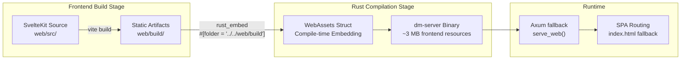
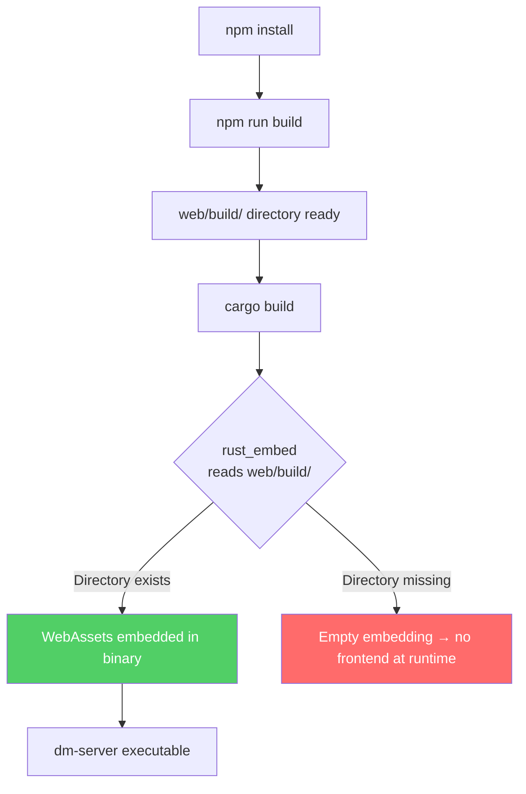
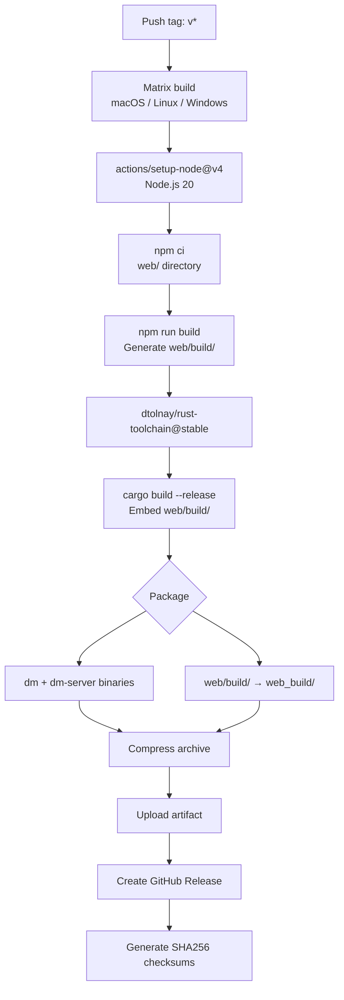

Dora Manager employs a **compile-time static embedding** strategy, packaging the complete build artifacts of the SvelteKit frontend into the Rust binary via `rust_embed`. This means end users only need to download a single `dm-server` executable to enjoy the full Web UI experience — no additional file server or frontend deployment steps required. This article systematically explains every layer of this joint build mechanism: from frontend build artifact structure, `rust_embed` compile-time embedding principles, Axum's SPA routing fallback strategy, to the complete loop of development environment and production release workflows.

Sources: [main.rs](https://github.com/l1veIn/dora-manager/blob/master/crates/dm-server/src/main.rs#L20-L22), [svelte.config.js](https://github.com/l1veIn/dora-manager/blob/master/web/svelte.config.js#L1-L15)

## Overall Architecture: How Frontend and Backend Are Stitched Together

The entire joint build mechanism can be described by a clear compilation pipeline — the frontend is first built as pure static files, and the Rust compiler embeds these files into the binary during the `cargo build` phase, with Axum serving them via a fallback handler at runtime.



The core advantage of this design is **zero runtime dependencies** — dm-server is a self-contained HTTP server, providing both `/api/*` backend API and directly hosting frontend pages. Users can access the complete application by opening `http://127.0.0.1:3210`.

Sources: [main.rs](https://github.com/l1veIn/dora-manager/blob/master/crates/dm-server/src/main.rs#L20-L22), [handlers/web.rs](https://github.com/l1veIn/dora-manager/blob/master/crates/dm-server/src/handlers/web.rs#L1-L27)

## Frontend Build Artifacts: adapter-static and SPA Mode

### SvelteKit Static Adapter Configuration

Dora Manager's frontend uses `@sveltejs/adapter-static` to compile the SvelteKit application into pure static files. This choice is the prerequisite for the joint build mechanism — only static files can be embedded by `rust_embed` at compile time.

Key configuration in `svelte.config.js`: `adapter-static` sets `fallback: 'index.html'`, meaning SvelteKit generates a standard SPA (Single Page Application) structure where all unmatched routes fall back to `index.html`, handled by client-side JavaScript routing. Meanwhile `paths.relative: false` ensures all resource references use absolute paths (like `/_app/immutable/...`), avoiding path resolution issues after embedding. [svelte.config.js](https://github.com/l1veIn/dora-manager/blob/master/web/svelte.config.js#L1-L15)

### Build Artifact Directory Structure

After executing `npm run build` (i.e., `vite build`), all artifacts are output to the `web/build/` directory, which is **excluded by `.gitignore`** and not version-controlled:

```
web/build/
├── index.html                          # SPA entry point (~1 KB)
├── robots.txt
└── _app/
    ├── version.json
    └── immutable/
        ├── assets/                     # CSS files (~330 KB)
        │   ├── 0.BgrlRXg5.css
        │   ├── 10.unNUpGj7.css
        │   └── ...
        ├── chunks/                     # Shared JS modules
        │   ├── BrG2omaf.js
        │   └── ...
        ├── entry/                      # Entry JS
        │   ├── start.C2exKWgn.js
        │   └── app.BcTUXpNC.js
        └── nodes/                      # Route pages (0-11, 12 total)
            ├── 0.B9BPPpvp.js
            └── ...
```

The entire `web/build/` directory is approximately **2.9 MB**, containing 87 files. Files under `_app/immutable/` all include content hashes (like `C2exKWgn`), natively supporting long-term caching strategies. `index.html` is the sole entry file, referencing various modules via `<script>` and `<link rel="modulepreload">`. [index.html](https://github.com/l1veIn/dora-manager/blob/master/web/build/index.html#L1-L36)

### Proxy Mode in Development Environment

During local development, there's no need to recompile Rust every time the frontend changes. The Vite development server, through proxy configuration in `vite.config.ts`, automatically forwards `/api` requests to `127.0.0.1:3210` (dm-server backend address), while WebSocket connections are also proxied (`ws: true`). This enables frontend and backend to run independently with hot updates:

```typescript
// vite.config.ts
server: {
    proxy: {
        '/api': {
            target: 'http://127.0.0.1:3210',
            changeOrigin: true,
            ws: true    // Support WebSocket proxy
        }
    }
}
```

[vite.config.ts](https://github.com/l1veIn/dora-manager/blob/master/web/vite.config.ts#L1-L16)

Sources: [vite.config.ts](https://github.com/l1veIn/dora-manager/blob/master/web/vite.config.ts#L8-L15), [web/.gitignore](https://github.com/l1veIn/dora-manager/blob/master/web/.gitignore#L1-L25)

## rust_embed: Compile-Time Static Embedding Mechanism

### Embedding Declaration and Working Principle

`rust_embed` is a Rust procedural macro that reads all files from a specified directory at **compile time**, embedding their content losslessly into the Rust binary. The declaration in Dora Manager is extremely concise:

```rust
use rust_embed::Embed;

#[derive(Embed)]
#[folder = "../../web/build"]
struct WebAssets;
```

This declaration does three things: First, the `#[folder]` attribute specifies a path relative to the current source file (`crates/dm-server/src/main.rs`), actually pointing to `web/build` under the project root. Second, the compiler reads all files in this directory into memory and compiles them into the binary during `cargo build`. Third, it automatically generates the `get(path: &str) -> Option<EmbeddedFile>` method for `WebAssets`.

**Key constraint**: Since embedding occurs at compile time, the `web/build/` directory must exist and contain complete artifacts before Rust compilation. If the directory is missing or empty, compilation won't fail (`rust_embed` allows empty directories), but at runtime all frontend resource requests will return 404 or fall back to an empty index.html. [main.rs](https://github.com/l1veIn/dora-manager/blob/master/crates/dm-server/src/main.rs#L11-L22)

### Dependency Versions and Features

In the workspace `Cargo.toml`, `rust-embed` enables the `axum` feature:

```toml
rust-embed = { version = "8.11", features = ["axum"] }
mime_guess = "2"
```

The `axum` feature generates Axum framework integration support for types produced by `rust_embed` (such as `IntoResponse` implementation). `mime_guess` is used to infer MIME types from file extensions, ensuring CSS files return `text/css`, JS files return `application/javascript`, etc. [Cargo.toml](https://github.com/l1veIn/dora-manager/blob/master/Cargo.toml), [dm-server/Cargo.toml](https://github.com/l1veIn/dora-manager/blob/master/crates/dm-server/Cargo.toml#L22-L23)

Sources: [Cargo.toml](https://github.com/l1veIn/dora-manager/blob/master/Cargo.toml), [dm-server/Cargo.toml](https://github.com/l1veIn/dora-manager/blob/master/crates/dm-server/Cargo.toml#L1-L35)

## Runtime Service: SPA Routing and Fallback Strategy

### serve_web Handler Implementation

Frontend resource serving at runtime is handled by the `serve_web` function in `handlers/web.rs`. This function is registered as the Axum router's **fallback handler** — meaning all requests not matched by `/api/*` routes enter this processing flow:

```rust
pub async fn serve_web(uri: Uri) -> impl IntoResponse {
    let mut path = uri.path().trim_start_matches('/').to_string();
    if path.is_empty() {
        path = "index.html".to_string();
    }
    match WebAssets::get(&path) {
        Some(content) => {
            let mime = mime_guess::from_path(&path).first_or_octet_stream();
            ([(header::CONTENT_TYPE, mime.as_ref())], content.data).into_response()
        }
        None => {
            // SPA fallback: unknown paths return index.html
            if let Some(index) = WebAssets::get("index.html") {
                let mime = mime_guess::from_path("index.html").first_or_octet_stream();
                ([(header::CONTENT_TYPE, mime.as_ref())], index.data).into_response()
            } else {
                (StatusCode::NOT_FOUND, "404 Not Found").into_response()
            }
        }
    }
}
```

This code implements the classic **SPA routing fallback pattern**, with logic divided into three layers:

| Request Path | Match Result | Response |
|-------------|-------------|---------|
| `/` or empty path | Exact match `index.html` | 200 + `text/html` |
| `/_app/immutable/assets/0.BgrlRXg5.css` | Exact match static resource | 200 + corresponding MIME type |
| `/dataflows/my-flow`, `/runs/abc123` etc. frontend routes | No match → fallback to `index.html` | 200 + `text/html` (client-side routing takes over) |

[handlers/web.rs](https://github.com/l1veIn/dora-manager/blob/master/crates/dm-server/src/handlers/web.rs#L1-L27)

### Fallback Registration Method

In `main.rs`'s route configuration, `serve_web` is registered via the `.fallback()` method, positioned after all API routes and Swagger UI:

```rust
let app = Router::new()
    .route("/api/...", ...)    // 70+ API routes
    .layer(CorsLayer::permissive())
    .with_state(state.clone())
    .merge(SwaggerUi::new("/swagger-ui")...)
    .fallback(axum::routing::get(handlers::serve_web));  // Registered last
```

Axum's fallback mechanism ensures API routes match first; only when the request path doesn't start with `/api` or `/swagger-ui` does it enter frontend service logic. [main.rs](https://github.com/l1veIn/dora-manager/blob/master/crates/dm-server/src/main.rs#L224-L225)

### Built-In Test Verification

The project includes two key tests verifying SPA routing behavior correctness. `serve_web_root_returns_index_html` tests that the root path `/` returns HTML content containing `<!doctype html>`. `serve_web_unknown_path_falls_back_to_index` tests that arbitrary unknown paths (like `/missing-route`) correctly fall back to `index.html`, ensuring SvelteKit's client-side routing can properly take over navigation in the browser. [tests.rs](https://github.com/l1veIn/dora-manager/blob/master/crates/dm-server/src/tests.rs#L1513-L1548)

Sources: [handlers/web.rs](https://github.com/l1veIn/dora-manager/blob/master/crates/dm-server/src/handlers/web.rs#L1-L27), [main.rs](https://github.com/l1veIn/dora-manager/blob/master/crates/dm-server/src/main.rs#L224-L225), [tests.rs](https://github.com/l1veIn/dora-manager/blob/master/crates/dm-server/src/tests.rs#L1513-L1548)

## Build Order and Dependencies

### Compilation Timeline Rigid Constraints

Since `rust_embed` reads `web/build/` at compile time, the entire build pipeline has strict **timing dependencies**:



**If you skip frontend build and directly `cargo build`**, compilation won't error (`rust_embed` allows empty directories), but running `dm-server` and accessing `http://127.0.0.1:3210` will result in "404 Not Found". This is because `WebAssets::get("index.html")` returns `None`, and both matching paths enter the `None` branch. [handlers/web.rs](https://github.com/l1veIn/dora-manager/blob/master/crates/dm-server/src/handlers/web.rs#L18-L25)

### Release Profile Optimization

The workspace `Cargo.toml` configures aggressive optimization parameters for release builds:

```toml
[profile.release]
lto = true           # Cross-crate link-time optimization, eliminate unused code
codegen-units = 1    # Single compilation unit, allowing more aggressive global optimization
strip = true         # Strip debug symbols, reduce binary size
opt-level = 3        # Highest optimization level
```

These settings work particularly effectively with `rust_embed`'s static embedding — LTO can identify and compress redundant byte patterns in embedded static resources, while `strip = true` ensures the final binary doesn't carry extra debug information due to embedded resources. [Cargo.toml](https://github.com/l1veIn/dora-manager/blob/master/Cargo.toml)

Sources: [Cargo.toml](https://github.com/l1veIn/dora-manager/blob/master/Cargo.toml), [handlers/web.rs](https://github.com/l1veIn/dora-manager/blob/master/crates/dm-server/src/handlers/web.rs#L18-L25)

## Development Workflow: dev.sh Parallel Startup

### One-Click Startup Script

The project provides a `dev.sh` script that integrates frontend build + backend startup + frontend development server into a single command. Its execution flow:

| Phase | Command | Purpose |
|-------|---------|---------|
| Pre-check | Check `cargo`, `node`, `npm` | Ensure development environment ready |
| Frontend build | `cd web && npm install && npm run build` | Generate `web/build/` for Rust compilation |
| Backend startup | `cargo run -p dm-server` | Compile and start dm-server (port 3210) |
| Frontend dev server | `cd web && npm run dev` | Start Vite HMR (port 5173) |

The script uses `trap cleanup EXIT INT TERM` to ensure both processes are terminated on Ctrl+C. Developers during daily development typically access the Vite development server directly (port 5173), enjoying hot module replacement (HMR); API requests are forwarded to the backend through Vite proxy. Only when verifying embedded static service behavior is it necessary to access `127.0.0.1:3210` directly. [dev.sh](https://github.com/l1veIn/dora-manager/blob/master/dev.sh)

### Development Mode vs. Production Mode Comparison

| Feature | Development Mode | Production Mode (Embedded) |
|---------|-----------------|---------------------------|
| Frontend service | Vite dev server (5173) | dm-server embedded (3210) |
| API requests | Vite proxy → 3210 | Directly handled by dm-server |
| Hot update | ✅ HMR immediate effect | ❌ Requires `npm run build` + `cargo build` |
| SPA routing | Vite built-in handling | `serve_web` fallback logic |
| WebSocket | Vite proxy (`ws: true`) | Axum native WebSocket |
| Binary artifacts | Debug build only | Single release binary |

Sources: [dev.sh](https://github.com/l1veIn/dora-manager/blob/master/dev.sh), [vite.config.ts](https://github.com/l1veIn/dora-manager/blob/master/web/vite.config.ts#L8-L15)

## Release Workflow: Front-End/Back-End Joint Build in CI/CD

### Release Workflow

When pushing a version tag (e.g., `v0.1.0`), `.github/workflows/release.yml` triggers multi-platform builds. Its pipeline strictly follows the "frontend first" timing constraint:



Notably, the release workflow not only embeds the frontend into the `dm-server` binary, but also **additionally copies `web/build/` as `web_build/`** into the release archive. This supports an alternative deployment mode — some advanced users may want to host the frontend with independent servers like Nginx, pointing directly to `dm-server`'s API port. [release.yml](https://github.com/l1veIn/dora-manager/blob/master/.github/workflows/release.yml#L66-L101)

### Joint Build Verification in CI Workflow

In continuous integration (`ci.yml`), every push to master or PR executes complete front-end/back-end joint build verification. The pipeline includes: frontend lint (`npm run lint` i.e., `svelte-check`), frontend build (`npm run build`), Rust format check (`cargo fmt --check`), Clippy static analysis, compilation, and testing. This ensures any changes breaking the front-end/back-end joint build are caught before merging. [ci.yml](https://github.com/l1veIn/dora-manager/blob/master/.github/workflows/ci.yml#L1-L120)

### Multi-Platform Build Matrix

| Platform | Target | Runner | Archive Format |
|----------|--------|--------|---------------|
| macOS (Apple Silicon) | `aarch64-apple-darwin` | `macos-latest` | `.tar.gz` |
| Linux (x86_64) | `x86_64-unknown-linux-gnu` | `ubuntu-latest` | `.tar.gz` |
| Windows (x86_64) | `x86_64-pc-windows-msvc` | `windows-latest` | `.zip` |

Each platform includes two binary files: `dm` (CLI tool) and `dm-server` (HTTP server with embedded frontend). [release.yml](https://github.com/l1veIn/dora-manager/blob/master/.github/workflows/release.yml#L18-L34)

Sources: [release.yml](https://github.com/l1veIn/dora-manager/blob/master/.github/workflows/release.yml#L1-L133), [ci.yml](https://github.com/l1veIn/dora-manager/blob/master/.github/workflows/ci.yml#L1-L120)

## Common Issues and Troubleshooting

### Build: Frontend page blank or 404 after `cargo build`

**Root cause**: `web/build/` directory doesn't exist or is empty (e.g., skipping frontend build during first compilation after cloning). `rust_embed` doesn't produce compilation errors for empty directories, so the issue only manifests at runtime.

**Troubleshooting**: Check if `web/build/index.html` exists. If not, execute:
```bash
cd web && npm install && npm run build && cd .. && cargo build
```

### Runtime: 404 after frontend route refresh

**Root cause**: If deployment doesn't use `dm-server`'s built-in service (e.g., using Nginx to directly host `web_build/`), you need to configure Nginx's `try_files` directive for SPA fallback:
```nginx
location / {
    try_files $uri $uri/ /index.html;
}
```

When using `dm-server` itself for serving, this issue doesn't exist, as `serve_web`'s fallback logic has built-in SPA fallback. [handlers/web.rs](https://github.com/l1veIn/dora-manager/blob/master/crates/dm-server/src/handlers/web.rs#L18-L25)

### CI: Frontend build succeeds but Rust compilation can't find resources

**Root cause**: `#[folder = "../../web/build"]` is a path relative to `crates/dm-server/src/main.rs`; CI's working directory must be the project root. If `working-directory` is set incorrectly causing path resolution failure, `rust_embed` embeds an empty directory.

**Verification**: In the CI script, `npm run build`'s `working-directory: web` completes, then subsequent `cargo build` executes in the project root — the path relationship is correct. [ci.yml](https://github.com/l1veIn/dora-manager/blob/master/.github/workflows/ci.yml#L47-L53)

Sources: [handlers/web.rs](https://github.com/l1veIn/dora-manager/blob/master/crates/dm-server/src/handlers/web.rs#L18-L25), [ci.yml](https://github.com/l1veIn/dora-manager/blob/master/.github/workflows/ci.yml#L47-L53)

## Summary and Further Reading

Dora Manager's front-end/back-end joint build solution achieves the engineering goal of "single binary deployment" with extremely low implementation complexity (only 27 lines of Web Handler + 3 lines of Embed declaration). This design choice — rather than dynamic file reading or reverse proxy — brings three core advantages: **zero-configuration deployment** (no need to manage static file paths), **atomic release** (front-end/back-end versions always consistent), and **cross-platform consistent behavior** (not dependent on OS filesystem characteristics).

For details on build and release automation configuration, continue reading [CI/CD: GitHub Actions Build and Release Configuration](24-ci-cd). For understanding the frontend's own API communication layer implementation, see [SvelteKit Project Structure and API Communication Layer](14-sveltekit-structure). The complete backend route design is detailed in [HTTP API Route Overview and Swagger Documentation](12-http-api).
