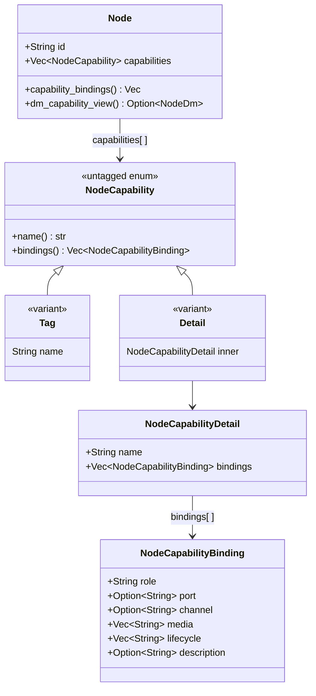
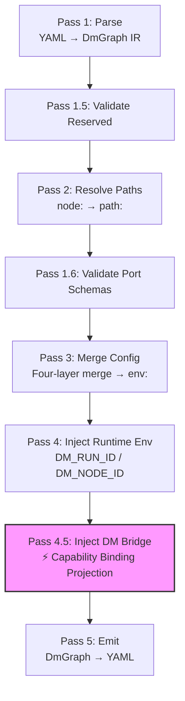
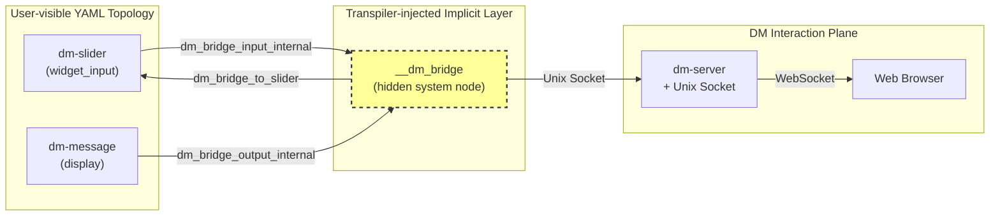

Capability Binding is the core mechanism in Dora Manager that explicitly associates **node declaration metadata** with **runtime behavioral roles**. It answers a fundamental architectural question: when interactive nodes (control inputs, content displays) exist in the dataflow, how can the system grant these nodes DM platform-specific runtime capabilities without polluting the dora data plane topology? This article provides an in-depth analysis of the capability declaration model (the `capabilities` field in `dm.json`), the type system (the union design of Tag and Detail), the runtime projection path (the transpiler's hidden bridge injection), and the complete lifecycle -- from node authors declaring in JSON, to the transpiler automatically weaving implicit bridge nodes, to the bridge process communicating with dm-server via Unix Socket.

Sources: [dm-capability-binding-v0.md](https://github.com/l1veIn/dora-manager/blob/main/docs/design/dm-capability-binding-v0.md#L1-L231), [panel-ontology-memo.md](https://github.com/l1veIn/dora-manager/blob/main/docs/design/panel-ontology-memo.md#L1-L327)

## Why Capability Binding Is Needed: Naming the Dual-Plane Architecture

Before diving into technical details, understanding the **dual-plane** architectural judgment is crucial. Two independent data worlds always coexist in the Dora Manager system:

- **Dora Data Plane**: node processes, Arrow payloads, `for event in node` loops, port topologies, YAML declarations -- this is the pure computation and dataflow world.
- **DM Interaction Plane**: run-scoped message persistence, widget registration, browser input events, content snapshots and history, WebSocket notifications -- this is the product-layer-oriented human-computer interaction world.

These two planes have never truly merged. The early `dm-panel` explicit node approach made the graph extremely cluttered; the later server-client node approach cleaned up the graph topology but scattered DM-specific connection management, message serialization, and lifecycle control logic across every interactive node. The core design choice of Capability Binding is: **rather than trying to eliminate the dual-plane, explicitly name and structure the binding relationship between them**. `dora` owns execution and dataflow, `dm` owns product-level capability bindings, and `dm.json` declares where these two intersect.

Sources: [panel-ontology-memo.md](https://github.com/l1veIn/dora-manager/blob/main/docs/design/panel-ontology-memo.md#L85-L151), [panel-ontology-memo.md](https://github.com/l1veIn/dora-manager/blob/main/docs/design/panel-ontology-memo.md#L224-L296)

## Declaration Model: the capabilities Field in dm.json

### Dual-Form Union: Tag and Detail

The `capabilities` field uses a **mixed list** design, where each element in the list can be either a simple string label (Tag) or a structured object carrying detailed binding information (Detail). This design is implemented via Rust's `untagged` enum:



**Tag** is used to declare coarse-grained capability labels, such as `"configurable"` indicating the node supports config merging, or `"media"` indicating the node involves media processing. Tags carry no additional fields, and the `bindings()` method returns an empty slice. **Detail** declares a named capability family (such as `display` or `widget_input`), which internally contains one or more `NodeCapabilityBinding` entries, each precisely describing the specific role the node plays within that capability family.

Sources: [model.rs](https://github.com/l1veIn/dora-manager/blob/main/crates/dm-core/src/node/model.rs#L71-L116), [model.rs](https://github.com/l1veIn/dora-manager/blob/main/crates/dm-core/src/node/model.rs#L339-L384)

### Binding Field Semantics

Each `NodeCapabilityBinding` consists of the following fields, which together define the intersection points between the DM plane and the dora data plane:

| Field | Type | Meaning |
|-------|------|---------|
| `role` | `String` | The node's role within the capability family, such as `"widget"` or `"source"` |
| `port` | `Option<String>` | The dora port name associated with the binding; if absent, the behavior is purely node-level |
| `channel` | `Option<String>` | The semantic channel on the DM side, such as `"register"`, `"input"`, `"inline"`, `"artifact"` |
| `media` | `Vec<String>` | Payload/rendering hints, such as `["text", "json"]`, `["image", "video"]` |
| `lifecycle` | `Vec<String>` | Lifecycle hints, such as `["run_scoped", "stop_aware"]` |
| `description` | `Option<String>` | Human-readable description for tool interfaces |

Key design constraint: **bindings are binding-centric, not port-centric**. A binding can point to a `port` (when the DM plane and the dora data plane intersect at a port), but certain DM semantics (such as widget registration) are node-level, so `port` is optional. This avoids the anti-pattern of forcing all DM concerns into artificial data ports.

Sources: [dm-capability-binding-v0.md](https://github.com/l1veIn/dora-manager/blob/main/docs/design/dm-capability-binding-v0.md#L39-L86), [model.rs](https://github.com/l1veIn/dora-manager/blob/main/crates/dm-core/src/node/model.rs#L79-L93)

## Capability Families in Detail: widget_input, display, and Tag Types

### widget_input Family

The `widget_input` family declares that a node participates in the browser-side widget input flow. Each `widget_input` node typically contains two bindings:

1. **`channel = "register"`**: The node publishes widget definitions to the DM plane. This is a node-level behavior that typically does not specify a `port`; `media` is `["widgets"]`, and `lifecycle` includes `["run_scoped", "stop_aware"]`.
2. **`channel = "input"`**: The DM plane passes user input values back to the node's data plane port. Here `port` points to the node's actual output port name (such as `"value"` or `"click"`), and `media` describes the payload type (such as `"text"`, `"number"`, `"pulse"`, `"boolean"`).

The built-in nodes currently using the `widget_input` family and their differences are shown in the following table:

| Node | Binding Port | Media Type | Widget Form |
|------|-------------|------------|-------------|
| `dm-text-input` | `value` | `["text"]` | Single-line input / multi-line text area |
| `dm-button` | `click` | `["pulse"]` | Trigger button |
| `dm-slider` | `value` | `["number"]` | Numeric slider |
| `dm-input-switch` | `value` | `["boolean"]` | Toggle switch |

Sources: [dm-text-input/dm.json](https://github.com/l1veIn/dora-manager/blob/main/nodes/dm-text-input/dm.json#L25-L57), [dm-button/dm.json](https://github.com/l1veIn/dora-manager/blob/main/nodes/dm-button/dm.json#L25-L57), [dm-slider/dm.json](https://github.com/l1veIn/dora-manager/blob/main/nodes/dm-slider/dm.json#L25-L57), [dm-input-switch/dm.json](https://github.com/l1veIn/dora-manager/blob/main/nodes/dm-input-switch/dm.json#L25-L57)

### display Family

The `display` family declares that a node participates in the DM interaction plane as a **sink endpoint** for message display. The dm-message node is a typical sink-style interaction node — it acts as the dataflow's terminal point, turning incoming content into human-visible DM run messages. Each `dm-message` node contains a single binding:

- **`channel = "message"`**: A unified message channel, receiving content through the `message` input port, auto-detecting inline text versus artifact file paths, supporting media types such as `text`, `json`, `markdown`, `image`, `audio`, `video`.

```json
{
  "name": "display",
  "bindings": [
    {
      "role": "source",
      "port": "message",
      "channel": "message",
      "media": ["text", "json", "markdown", "image", "audio", "video"],
      "lifecycle": [],
      "description": "Emits a human-visible message into the DM interaction plane, auto-detecting inline content versus artifact files."
    }
  ]
}
```

Unlike the bidirectional interaction of `widget_input`, the `display` family is a **unidirectional sink pattern** — data only flows from the dora data plane into the DM interaction plane, with no path for data to flow back from the browser to the node. This makes dm-message naturally suited as an observability endpoint for dataflows.

Sources: [dm-message/dm.json](https://github.com/l1veIn/dora-manager/blob/main/nodes/dm-message/dm.json#L25-L59), [dm-capability-binding-v0.md](https://github.com/l1veIn/dora-manager/blob/main/docs/design/dm-capability-binding-v0.md#L96-L111)

### Tag-Type Capabilities

Unlike the structured `widget_input` and `display`, Tag-type capabilities exist solely as coarse-grained classification labels:

| Tag | Meaning | Typical Nodes |
|-----|---------|---------------|
| `"configurable"` | The node has a `config_schema` and supports four-layer config merging | Most built-in nodes |
| `"media"` | The node involves media processing (audio/video/image streams) | `dm-microphone`, `dm-mjpeg`, `dm-stream-publish` |

Tags are not projected by the transpiler into bridge channels -- they are primarily used by dataflow inspection logic (e.g., the `inspect` module uses the `media` tag to determine whether the dataflow requires a media backend) and for frontend classification display.

Sources: [inspect.rs](https://github.com/l1veIn/dora-manager/blob/main/crates/dm-core/src/dataflow/inspect.rs#L147-L160), [dm-microphone/dm.json](https://github.com/l1veIn/dora-manager/blob/main/nodes/dm-microphone/dm.json#L7-L9)

## Runtime Projection: the Transpiler's Hidden Bridge Injection

This is the most ingenious part of Capability Binding -- the transformation from static declarations to runtime behavior occurs in **Pass 4.5** of the transpiler pipeline.

### Position in the Transpiler Pipeline

The transpiler pipeline executes in the following order:



`inject_dm_bridge` executes after path resolution and config merging are complete, because at this point all managed nodes' `dm.json` metadata has been loaded and environment variables have been merged.

Sources: [mod.rs](https://github.com/l1veIn/dora-manager/blob/main/crates/dm-core/src/dataflow/transpile/mod.rs#L1-L84), [passes.rs](https://github.com/l1veIn/dora-manager/blob/main/crates/dm-core/src/dataflow/transpile/passes.rs#L452-L570)

### Complete Bridge Node Injection Process

The work of `inject_dm_bridge` can be broken down into the following steps:

**Step 1: Collect binding specs**. Iterate over all managed nodes, load their `dm.json`, and call `build_bridge_node_spec` to extract bindings from the `widget_input` and `display` families. Only nodes containing these two families produce specs; nodes with only Tag-type capabilities are skipped.

**Step 2: Inject implicit ports and edges for each interactive node**. For each node that produces a spec:

- If the node has `display` family bindings, inject a `dm_bridge_output_internal` output port and set the `DM_BRIDGE_OUTPUT_ENV_KEY` environment variable to that port name. This allows the node's runtime code to know which port to send display content to.
- If the node has `widget_input` family bindings, inject a `dm_bridge_input_internal` input mapping (pointing to the hidden bridge's output) and set the `DM_BRIDGE_INPUT_ENV_KEY` environment variable to that port name. This allows the node's runtime code to know which port to receive widget input from.

**Step 3: Create the hidden bridge node**. Serialize all collected specs into JSON and pass them to the bridge process via the `DM_CAPABILITIES_JSON` environment variable. The bridge node itself uses the `dm` CLI's `bridge` subcommand as its executable, with a `yaml_id` of `__dm_bridge`, invisible to the user.



Sources: [passes.rs](https://github.com/l1veIn/dora-manager/blob/main/crates/dm-core/src/dataflow/transpile/passes.rs#L456-L570), [bridge.rs](https://github.com/l1veIn/dora-manager/blob/main/crates/dm-core/src/dataflow/transpile/bridge.rs#L46-L84)

### Bridge Process Runtime Behavior

When `dora` launches the transpiled YAML, `__dm_bridge` runs as a regular dora node. It deserializes all binding specs from the `DM_CAPABILITIES_JSON` environment variable and then performs the following key tasks:

**Input-side routing**: When a dora event arrives at a display-related port, the bridge decodes the payload into JSON, attaches source node information, and pushes it to dm-server via Unix Socket. The server stores it in the run-scoped SQLite database and notifies the frontend via WebSocket.

**Output-side routing**: When dm-server receives a frontend user input and passes it to the bridge via Unix Socket, the bridge matches the corresponding widget spec based on the `InputNotification.to` field, converts the JSON value to an Arrow type (`StringArray`, `Float64Array`, `BooleanArray`, etc.), and sends it to the corresponding node's input port via dora's `send_output`.

**Widget registration**: Upon startup, the bridge automatically extracts the environment variables of `widget_input` nodes (`LABEL`, `DEFAULT_VALUE`, `PLACEHOLDER`, etc.) from the binding specs, constructs widget definition JSON, and pushes it to dm-server via Unix Socket to complete widget registration.

Sources: [bridge.rs](https://github.com/l1veIn/dora-manager/blob/main/crates/dm-cli/src/bridge.rs#L57-L193), [bridge.rs](https://github.com/l1veIn/dora-manager/blob/main/crates/dm-cli/src/bridge.rs#L237-L355)

## End-to-End Example: Binding Projection in demo-interactive-widgets

Using `demos/demo-interactive-widgets.yml` as an example, this dataflow contains four `widget_input` nodes (`dm-slider`, `dm-button`, `dm-text-input`, `dm-input-switch`) and four `display` nodes (`dm-message`). During transpilation:

1. **Pass 2** parses all nodes' `dm.json` and confirms executable paths
2. **Pass 3** merges each node's config (e.g., `label: "Temperature (°C)"`) into environment variables
3. **Pass 4.5** detects that 8 nodes carry `widget_input` or `display` capability families, injects implicit port mappings for each node, collects 8 `HiddenBridgeBindingSpec` entries, and creates the `__dm_bridge` node
4. **Pass 5** produces the final YAML, with `__dm_bridge` appearing as the 13th node, but the user never wrote it in the original YAML

After startup, the bridge automatically registers the four widget types (slider, button, input, switch), establishes display channels, and completes the full projection from "static JSON declaration" to "runtime bidirectional interaction".

Sources: [demo-interactive-widgets.yml](demos/demo-interactive-widgets.yml#L1-L129), [passes.rs](https://github.com/l1veIn/dora-manager/blob/main/crates/dm-core/src/dataflow/transpile/passes.rs#L456-L570)

## Declaring Capabilities in Custom Nodes

If you are developing a custom node and want it to participate in the DM interaction plane, simply add the corresponding capability declarations in `dm.json`. Here are two key points:

**Declaration location**: Add structured objects to the `capabilities` array in `dm.json`. If your node needs widget input capability, add the `widget_input` family; if it needs display capability, add the `display` family. Also keep the `"configurable"` Tag to support config merging.

**Port alignment**: The `port` field in a binding must match the port ID declared in the `dm.json` `ports` array. For example, the port referenced by the `channel = "input"` binding in the `widget_input` family must be a port of `direction: "output"` type -- because from the bridge's perspective, user input values need to be sent **to** that node's output port through the dora data plane.

Sources: [dm-capability-binding-v0.md](https://github.com/l1veIn/dora-manager/blob/main/docs/design/dm-capability-binding-v0.md#L136-L191), [dm-text-input/dm.json](https://github.com/l1veIn/dora-manager/blob/main/nodes/dm-text-input/dm.json#L63-L77)

## Further Reading

- [Interaction System Architecture: dm-input / dm-message / Bridge Node Injection Principles](22-jiao-hu-xi-tong-jia-gou-dm-input-dm-message-bridge-jie-dian-zhu-ru-yuan-li) -- understanding the specific implementation details of interactive nodes and HTTP/WebSocket communication patterns
- [Dataflow Transpiler: Multi-Pass Pipeline and Four-Layer Config Merging](11-transpiler) -- the complete context of capability binding within the overall transpiler pipeline
- [Reactive Widgets: Widget Registry, Dynamic Rendering, and WebSocket Parameter Injection](20-xiang-ying-shi-kong-jian-widgets-kong-jian-zhu-ce-biao-dong-tai-xuan-ran-yu-websocket-can-shu-zhu-ru) -- how the frontend consumes widget definitions registered by the bridge
- [Custom Node Development Guide: Complete dm.json Field Reference](9-zi-ding-yi-jie-dian-kai-fa-zhi-nan-dm-json-wan-zheng-zi-duan-can-kao) -- the position and syntax of the `capabilities` field within the complete `dm.json`
