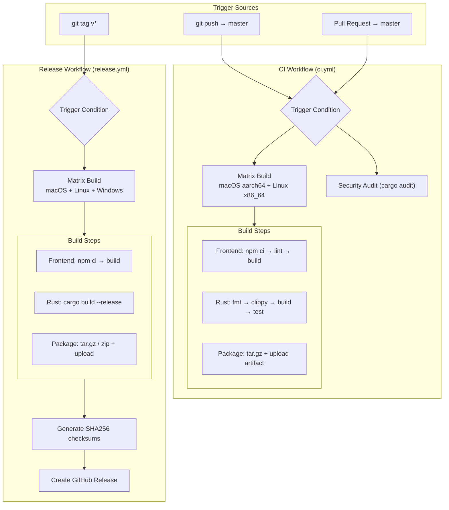
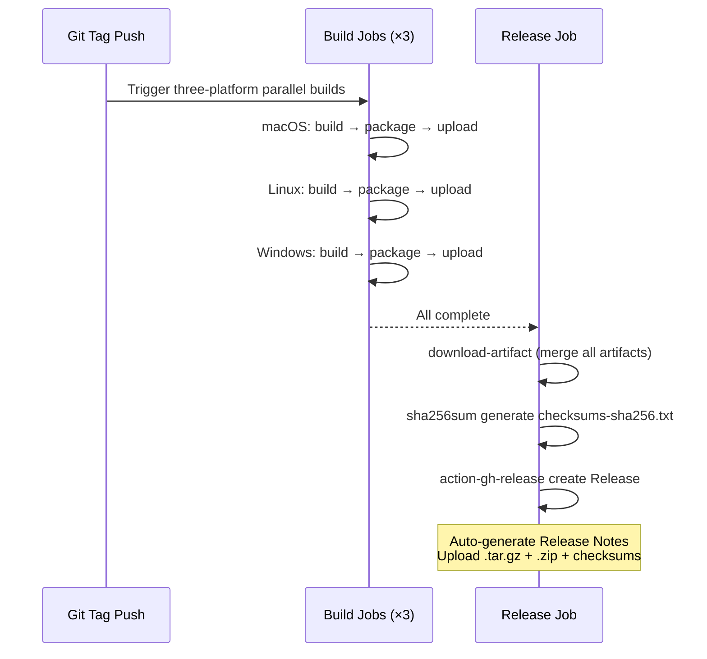
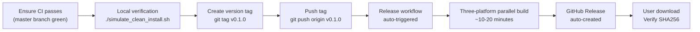

Dora Manager's continuous integration and continuous delivery system is driven by two GitHub Actions workflows — the **CI workflow** handles full quality gates for every push and Pull Request, while the **Release workflow** automatically builds cross-platform release artifacts and creates GitHub Releases upon version tag pushes. Both pipelines cover the complete chain from frontend SvelteKit build, Rust compilation and static analysis, multi-platform artifact packaging, security auditing, to SHA256 checksum generation, forming a fully automated delivery pipeline from code commit to user-downloadable binary files.

Sources: [ci.yml](https://github.com/l1veIn/dora-manager/blob/master/.github/workflows/ci.yml#L1-L120), [release.yml](https://github.com/l1veIn/dora-manager/blob/master/.github/workflows/release.yml#L1-L133)

## Overall Architecture: Dual Workflow Collaboration Model

The core design principle of the entire CI/CD system is **responsibility separation**: the CI pipeline focuses on code quality and correctness verification, while the Release pipeline focuses on artifact building and version publishing. Both share similar frontend/Rust build steps but differ fundamentally in build mode (debug vs release), trigger conditions, and artifact management.



Sources: [ci.yml](https://github.com/l1veIn/dora-manager/blob/master/.github/workflows/ci.yml#L1-L11), [release.yml](https://github.com/l1veIn/dora-manager/blob/master/.github/workflows/release.yml#L1-L15)

## CI Workflow: Continuous Integration Quality Gate

### Trigger Strategy and Environment Configuration

The CI workflow triggers on both `push` and `pull_request` events, targeting the `master` branch. Global environment variables set `CARGO_TERM_COLOR=always` (preserving colored output in CI logs) and `RUSTFLAGS="-D warnings"` (elevating all compilation warnings to errors). This configuration ensures any code failing lint cannot pass CI, curbing technical debt accumulation at the source.

Sources: [ci.yml](https://github.com/l1veIn/dora-manager/blob/master/.github/workflows/ci.yml#L1-L11)

### Matrix Build: Cross-Platform Parallel Verification

The CI workflow uses **matrix strategy** for cross-platform parallel builds, currently configured with two target platforms:

| Dimension | macOS Build | Linux Build | Windows Build |
|-----------|------------|-------------|---------------|
| **Target** | `aarch64-apple-darwin` | `x86_64-unknown-linux-gnu` | — |
| **Runner** | `macos-latest` | `ubuntu-latest` | — |
| **Artifact Format** | `tar.gz` | `tar.gz` | — |
| **Status** | ✅ Enabled | ✅ Enabled | ⏳ Pending path separator fix |

Key design detail: `fail-fast: false` ensures that even if one platform's build fails, other platforms' builds continue executing — this is crucial for diagnosing platform-specific issues, as a single failure would otherwise mask different problems on other platforms. The Windows build is currently commented out, with notes in the source marking pending fixes for path separator and Unix tool dependency issues.

Sources: [ci.yml](https://github.com/l1veIn/dora-manager/blob/master/.github/workflows/ci.yml#L13-L28)

### Build Pipeline: Complete Check Chain from Frontend to Rust

Each matrix instance's build process is divided into two serial sequences: the **frontend stage** and the **Rust stage**. Frontend precedes Rust — this ordering isn't arbitrary but because dm-server embeds static artifacts from `web/build/` into the binary at compile time via the `rust-embed` crate (see [Front-End/Back-End Joint Build: rust_embed Static Embedding and Release Process](23-build-and-embed)). If frontend isn't built first, Rust compilation embeds an empty or incomplete artifact.

**Frontend stage** executes three steps: `npm ci` (deterministic installation based on `package-lock.json`) → `npm run lint` (Svelte type checking) → `npm run build` (Vite production build). Node.js version is locked to 20, with npm caching configured to accelerate subsequent builds.

**Rust stage** executes four steps forming a progressively rigorous quality check chain:

| Step | Command | Purpose |
|------|---------|---------|
| Format check | `cargo fmt --check` | Verify code style consistency |
| Clippy | `cargo clippy --workspace --all-targets --target &lt;triple&gt;` | Static analysis + compilation warnings (with `-D warnings`) |
| Build | `cargo build --workspace --target &lt;triple&gt;` | Debug mode compile entire workspace |
| Tests | `cargo test --workspace --target &lt;triple&gt;` | Run full workspace test suite |

The Rust toolchain is installed via `dtolnay/rust-toolchain@stable`, consistent with the repository's `rust-toolchain.toml` (stable channel + clippy + rustfmt components). `Swatinem/rust-cache@v2` caches compilation artifacts by target triple, significantly reducing incremental build time.

Sources: [ci.yml](https://github.com/l1veIn/dora-manager/blob/master/.github/workflows/ci.yml#L29-L73), [rust-toolchain.toml](https://github.com/l1veIn/dora-manager/blob/master/rust-toolchain.toml)

### Artifact Packaging and Upload

After build completion, the CI workflow packages binary files and frontend artifacts into a single archive. Packaging logic diverges by OS into Unix (bash) and Windows (PowerShell) paths, but currently only the Unix path runs. Packaged content includes `dm` (CLI tool) and `dm-server` (HTTP server) binary files, plus frontend static resources in `web_build/`. Artifacts are uploaded via `actions/upload-artifact@v4` with a 7-day retention period, named in the format `dora-manager-&lt;target-triple&gt;`.

Sources: [ci.yml](https://github.com/l1veIn/dora-manager/blob/master/.github/workflows/ci.yml#L75-L107)

### Security Audit: Independent Job

The CI workflow's second job is `audit`, running independently on `ubuntu-latest`, executing `cargo audit` to scan all dependencies in `Cargo.lock` for known vulnerabilities. This job has a **parallel relationship** with the build job — it doesn't depend on build results, but independently checks out code, installs toolchain, and scans directly. This design allows security audit to begin while builds are still in progress, shortening overall pipeline time.

Sources: [ci.yml](https://github.com/l1veIn/dora-manager/blob/master/.github/workflows/ci.yml#L109-L120)

## Release Workflow: Cross-Platform Version Release

### Trigger Conditions and Permission Model

The Release workflow triggers only when pushing Git tags matching the `v*` pattern, such as `v0.1.0`, `v1.2.3-beta`. Unlike the CI workflow, it explicitly declares `permissions: contents: write` because subsequent steps need to create Releases and upload attachments via GitHub API — the default `GITHUB_TOKEN` permissions in newer GitHub Actions are read-only and must be explicitly elevated.

Sources: [release.yml](https://github.com/l1veIn/dora-manager/blob/master/.github/workflows/release.yml#L1-L14)

### Three-Platform Matrix Build

The Release workflow's build matrix includes the Windows platform in addition to CI:

| Dimension | macOS | Linux | Windows |
|-----------|-------|-------|---------|
| **Target** | `aarch64-apple-darwin` | `x86_64-unknown-linux-gnu` | `x86_64-pc-windows-msvc` |
| **Runner** | `macos-latest` | `ubuntu-latest` | `windows-latest` |
| **Artifact Format** | `tar.gz` | `tar.gz` | `zip` |
| **Binary Suffix** | None | None | `.exe` |

The introduction of the `binary_suffix` matrix variable is an elegant design — Windows binary files carry `.exe` suffix while Unix binaries don't. By parameterizing the suffix, packaging steps can handle both cases in the same template, avoiding maintaining a completely independent packaging logic for Windows.

Sources: [release.yml](https://github.com/l1veIn/dora-manager/blob/master/.github/workflows/release.yml#L16-L35)

### Release Build Differences: Omitting Lint, Focusing on Output

Compared to the CI workflow, the Release workflow's build steps have two key differences: **omitting `cargo fmt --check` and `cargo clippy`**, and **using `--release` Profile compilation**. Omitting lint is justified because code triggering Release must have already passed the CI pipeline (since tags can only be pushed to branches with merged PRs), making redundant checks wasteful. The Release Profile is deeply optimized in root `Cargo.toml`:

```toml
[profile.release]
lto = true           # Cross-crate link-time optimization, eliminate dead code
codegen-units = 1    # Single compilation unit, maximize optimization opportunities
strip = true         # Strip debug symbols, reduce binary size
opt-level = 3        # Highest optimization level
```

The combined effect of these configurations produces the smallest and fastest binary files, at the cost of significantly increased compilation time — a reasonable trade-off the Release pipeline is willing to make.

Sources: [release.yml](https://github.com/l1veIn/dora-manager/blob/master/.github/workflows/release.yml#L36-L64), [Cargo.toml](https://github.com/l1veIn/dora-manager/blob/master/Cargo.toml)

### Versioned Packaging and Artifact Naming

Release packaging follows the naming pattern `dora-manager-&lt;version&gt;-&lt;target-triple&gt;.&lt;ext&gt;`, e.g., `dora-manager-v0.1.0-aarch64-apple-darwin.tar.gz`. The version number is extracted from the `GITHUB_REF_NAME` environment variable (i.e., the tag name itself), ensuring a one-to-one correspondence between artifact names and Git tags. Packaging structure places all files in a subdirectory named after the version:

```
dora-manager-v0.1.0-aarch64-apple-darwin.tar.gz
└── dora-manager-v0.1.0/
    ├── dm              # CLI tool
    ├── dm-server       # HTTP server (with embedded frontend)
    └── web_build/      # Frontend static resources (standby)
```

Artifacts are uploaded via `actions/upload-artifact@v4` with only a 1-day retention period — because the Release Job immediately consumes these artifacts.

Sources: [release.yml](https://github.com/l1veIn/dora-manager/blob/master/.github/workflows/release.yml#L66-L106)

### Release Creation: Checksums and Auto-Publishing

The Release workflow's final stage is the `release` Job, which depends on all matrix builds completing via `needs: build` before executing. This Job's flow: download all build artifacts → generate SHA256 checksums → create GitHub Release.



The checksum file `checksums-sha256.txt` is generated using standard `sha256sum` tool, allowing users to verify file integrity after download. Release creation uses `softprops/action-gh-release@v2` with `generate_release_notes: true` to automatically extract changelog from Git commit history — meaning developers only need to push tags, and everything else happens automatically.

Sources: [release.yml](https://github.com/l1veIn/dora-manager/blob/master/.github/workflows/release.yml#L108-L133)

## Workflow Configuration Comparison

The following table summarizes key similarities and differences between the two workflows:

| Configuration Dimension | CI Workflow | Release Workflow |
|------------------------|------------|-----------------|
| **Trigger condition** | push/PR → master | Push `v*` tags |
| **Build mode** | `debug` (no `--release`) | `--release` (LTO + strip) |
| **Platform coverage** | macOS + Linux | macOS + Linux + Windows |
| **Rust checks** | fmt + clippy + build + test | build only |
| **Frontend checks** | lint + build | build only |
| **Artifact retention** | 7 days | 1 day (use and discard) |
| **Naming format** | `dora-manager-&lt;target&gt;` | `dora-manager-&lt;version&gt;-&lt;target&gt;` |
| **Security audit** | ✅ Independent Job | ❌ Not included |
| **Artifact publishing** | Upload Artifact | Create GitHub Release |
| **Checksums** | Not generated | SHA256 checksum file |
| **Permissions** | Default (read-only) | `contents: write` |

Sources: [ci.yml](https://github.com/l1veIn/dora-manager/blob/master/.github/workflows/ci.yml#L1-L120), [release.yml](https://github.com/l1veIn/dora-manager/blob/master/.github/workflows/release.yml#L1-L133)

## Key Third-Party Actions List

Both workflows depend on the following community Actions, categorized by purpose:

| Action | Version | Purpose | Usage Location |
|--------|---------|---------|---------------|
| `actions/checkout` | v4 | Checkout repository code | CI + Release |
| `actions/setup-node` | v4 | Install Node.js 20 + npm cache | CI + Release |
| `dtolnay/rust-toolchain` | stable | Install Rust toolchain + components | CI + Release |
| `Swatinem/rust-cache` | v2 | Cache Rust compilation artifacts | CI + Release |
| `actions/upload-artifact` | v4 | Upload build artifacts | CI + Release |
| `actions/download-artifact` | v4 | Download build artifacts | Release only |
| `softprops/action-gh-release` | v2 | Create GitHub Release | Release only |

Notable about `Swatinem/rust-cache`: CI uses `key: $&#123;&#123; matrix.target &#125;&#125;` while Release uses `key: $&#123;&#123; matrix.target &#125;&#125;-release` — meaning debug and release build caches don't interfere with each other, as their intermediate artifacts differ fundamentally in optimization level.

Sources: [ci.yml](https://github.com/l1veIn/dora-manager/blob/master/.github/workflows/ci.yml#L30-L59), [release.yml](https://github.com/l1veIn/dora-manager/blob/master/.github/workflows/release.yml#L37-L61)

## Release Operations: From Code to GitHub Release

For project maintainers, a complete release operation flow is as follows:



The `simulate_clean_install.sh` script provided in the repository is a **pre-release end-to-end smoke test** tool: it simulates a fresh installation flow in a sandbox environment — backup existing `~/.dm` directory → build frontend → compile Rust release binary → execute `dm install` → execute `dm doctor` → start `dm-server` → verify HTTP endpoints return 200. This script ensures release artifacts work properly in actual user environments.

Sources: [release.yml](https://github.com/l1veIn/dora-manager/blob/master/.github/workflows/release.yml#L1-L10), [simulate_clean_install.sh](https://github.com/l1veIn/dora-manager/blob/master/simulate_clean_install.sh)

## Known Limitations and Evolution Direction

The current CI/CD system has several clearly identified improvement items, all marked in code comments:

- **Windows CI build**: The Windows target in CI matrix is commented out, with the reason noted as "path separator and Unix tool dependency" issues. Windows builds are enabled in the Release workflow, meaning Windows support is available in release mode but not covered in daily CI quality gates.
- **Frontend test absence**: The `test` script in `web/package.json` currently only outputs placeholder information; the frontend has no automated test coverage.
- **Release Notes quality**: Relies on `generate_release_notes: true` auto-generation. If the project needs more structured changelogs in the future, conventional commits or changelog generation tools may need to be introduced.

Sources: [ci.yml](https://github.com/l1veIn/dora-manager/blob/master/.github/workflows/ci.yml#L27-L28), [web/package.json](https://github.com/l1veIn/dora-manager/blob/master/web/package.json#L14-L15)

## Further Reading

- Understand how dm-server embeds frontend artifacts at compile time: [Front-End/Back-End Joint Build: rust_embed Static Embedding and Release Process](23-build-and-embed)
- Understand the layered design of the three Rust crates: [Overall Architecture: dm-core / dm-cli / dm-server Layered Design](07-architecture-overview)
- Understand local development environment build and hot update workflow: [Development Environment Setup and Hot Update Workflow](03-dev-environment)
