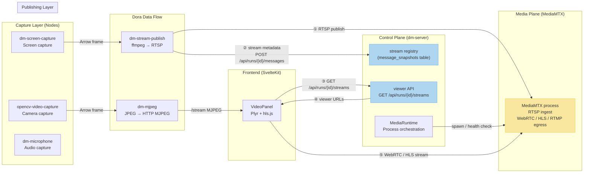
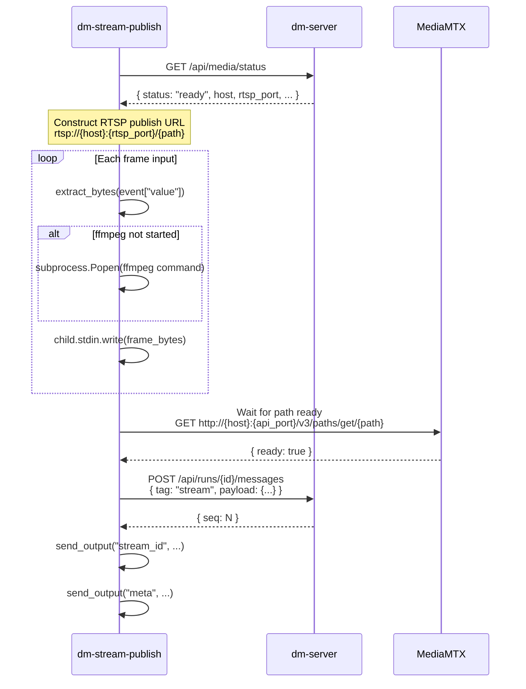
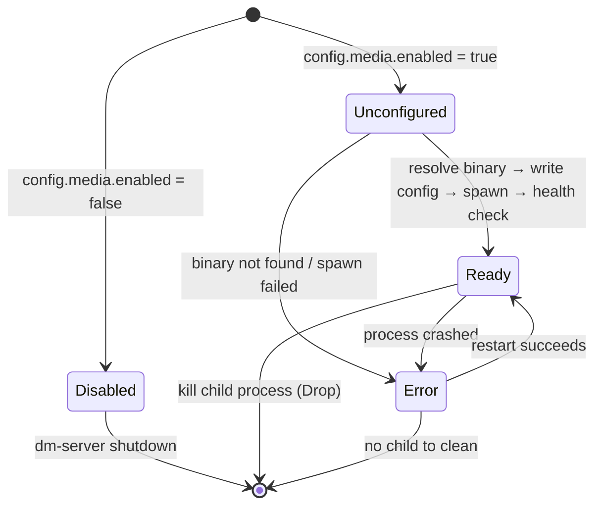
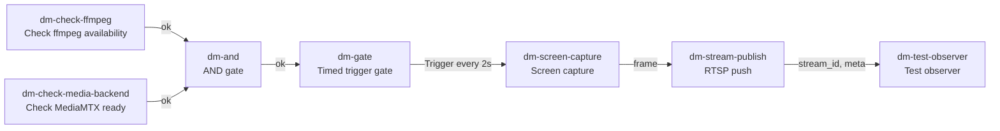

This document provides an in-depth analysis of Dora Manager's media streaming architecture -- the complete pipeline from node-level frame capture, through dm-server control plane orchestration, to MediaMTX media plane distribution, and finally playback in the frontend VideoPanel. You will understand why the system adopts the **separation of control plane and data plane** architectural decision, and the respective roles of MJPEG preview, RTSP publishing, and WebRTC/HLS playback.

Sources: [dm-streaming-architecture.md](https://github.com/l1veIn/dora-manager/blob/main/docs/design/dm-streaming-architecture.md#L1-L48)

## Architecture Overview: Control Plane and Data Plane Separation

Dora Manager's media streaming architecture follows a core principle: **dm-server only handles the control plane, not the media plane**. This means dm-server is responsible for stream metadata registration, querying, and viewer URL generation, while the actual audio/video frame transport, protocol conversion, and browser distribution are all delegated to the specialized media server MediaMTX.

The architecture diagram below illustrates the complete data flow path from capture to playback:



**Core data flow**: Capture nodes emit Arrow frames into the Dora data flow → `dm-stream-publish` encodes frames via ffmpeg and RTSP-pushes to MediaMTX → simultaneously registers stream metadata with dm-server via HTTP API → the frontend VideoPanel queries the viewer API to obtain playback URLs → finally pulls WebRTC or HLS streams from MediaMTX for playback.

Sources: [dm-streaming-architecture.md](https://github.com/l1veIn/dora-manager/blob/main/docs/design/dm-streaming-architecture.md#L56-L80), [dm-server-mediamtx-integration.md](https://github.com/l1veIn/dora-manager/blob/main/docs/design/dm-server-mediamtx-integration.md#L65-L82)

## Dual-Track Strategy: MJPEG Preview vs. Production Streaming

The system simultaneously has two media pathways, each serving different scenarios:

| Dimension | MJPEG Preview (dm-mjpeg) | Production Streaming (dm-stream-publish + MediaMTX) |
|---|---|---|
| **Purpose** | Debugging, zero-dependency preview | Production-grade real-time stream distribution |
| **Protocol** | MJPEG over HTTP (`multipart/x-mixed-replace`) | RTSP ingest → WebRTC / HLS egress |
| **Frontend complexity** | Zero (just an `` tag) | Medium (requires hls.js / Plyr player) |
| **Latency** | ~1 frame | WebRTC lowest; HLS 2-10 seconds |
| **Audio/video sync** | None (video only) | Supported |
| **Multi-client** | Limited (no auth, no session management) | Full publish/subscribe model |
| **Scalability** | None | Extensible to audio, point clouds, 3D scenes |

**MJPEG is not suitable as a streaming infrastructure** because it lacks multi-protocol capabilities, authentication and session orchestration, relay bridging, and recording/playback capabilities. However, in debugging scenarios like "quickly verifying whether frame data has arrived," MJPEG's zero-dependency and high reliability still make it the best choice.

Sources: [dm-streaming-architecture.md](https://github.com/l1veIn/dora-manager/blob/main/docs/design/dm-streaming-architecture.md#L50-L68), [dm-mjpeg.md](https://github.com/l1veIn/dora-manager/blob/main/docs/design/dm-mjpeg.md#L33-L49)

## dm-mjpeg Node: Lightweight MJPEG Preview Service

`dm-mjpeg` is a Rust-based sink adapter node that exposes video frames from the Dora data flow as an MJPEG over HTTP endpoint. Its role is that of a **preview node** -- receiving frames, scaling and encoding them as JPEG, and serving a `/stream` real-time preview -- without handling recording, archiving, or transcoding.

### Internal Architecture

The node employs a **dual-thread + async channel** architecture: a blocking thread runs the Dora event loop to receive frame data, sending frames to the Tokio async runtime via `mpsc::unbounded_channel`; the `FrameProcessor` in the async runtime handles frame rate limiting and JPEG encoding, and encoded frames are stored in `StreamState` (a single-writer multi-reader channel based on `tokio::sync::watch`), which is finally consumed by the Axum HTTP server.

```
Dora event loop (blocking thread)
  → Event::Input { id: "frame", data, metadata }
  → extract_frame() → IncomingFrame
  → mpsc::unbounded_channel transfer
  ↓
Tokio FrameProcessor (async task)
  → Frame rate check (max_fps throttling)
  → encode_frame() → JPEG encoding
  → StreamState::update() → watch channel
  ↓
Axum HTTP Server
  → GET /stream → multipart response, pushing latest JPEG frame by frame
  → GET /snapshot.jpg → returns latest single frame
  → GET /healthz → liveness check
```

Key design detail: `StreamState` maintains an atomic "latest JPEG frame" slot (`Arc<RwLock<Option<Arc<EncodedFrame>>>>`), so slow clients do not cause unbounded queue accumulation -- when a client consumes slower than production speed, the server skips old frames and only sends the latest frame. The `/stream` endpoint uses the `async_stream` generator to build an SSE-style multipart response body, where each chunk is wrapped by a `--frame` delimiter.

Sources: [main.rs](https://github.com/l1veIn/dora-manager/blob/main/nodes/dm-mjpeg/src/main.rs#L10-L35), [lib.rs](https://github.com/l1veIn/dora-manager/blob/main/nodes/dm-mjpeg/src/lib.rs#L108-L145)

### Supported Input Formats

| Format | Description | Requirements |
|---|---|---|
| `jpeg` | Complete JPEG byte stream, can be passed through or re-encoded | None |
| `rgb8` | `width × height × 3` tightly packed RGB data | Must provide width/height |
| `rgba8` | `width × height × 4` tightly packed RGBA data | Must provide width/height |
| `yuv420p` | Planar YUV420 data | Must provide width/height |

The YUV420p to RGB conversion uses standard BT.601 coefficients: `R = Y + 1.402V`, `G = Y - 0.344U - 0.714V`, `B = Y + 1.772U`, computed per-pixel and clamped to [0, 255].

Sources: [lib.rs](https://github.com/l1veIn/dora-manager/blob/main/nodes/dm-mjpeg/src/lib.rs#L309-L355)

### Configuration Parameters

All configuration is passed via environment variables (the `config_schema` in dm.json maps to environment variables):

| Parameter | Environment Variable | Default | Description |
|---|---|---|---|
| `host` | `HOST` | `127.0.0.1` | HTTP listen address |
| `port` | `PORT` | `4567` | HTTP listen port |
| `quality` | `QUALITY` | `80` | JPEG compression quality (1-100) |
| `max_fps` | `MAX_FPS` | `30` | Maximum frame rate |
| `width` | `WIDTH` | `0` (original) | Scaling width |
| `height` | `HEIGHT` | `0` (original) | Scaling height |
| `input_format` | `INPUT_FORMAT` | `jpeg` | Input pixel format |
| `drop_if_no_client` | `DROP_IF_NO_CLIENT` | `true` | Only keep latest frame when no client is connected |
| `allow_origin` | `ALLOW_ORIGIN` | Empty (no CORS) | CORS header value |

Sources: [dm.json](https://github.com/l1veIn/dora-manager/blob/main/nodes/dm-mjpeg/dm.json#L61-L101), [main.rs](https://github.com/l1veIn/dora-manager/blob/main/nodes/dm-mjpeg/src/main.rs#L38-L54)

## dm-stream-publish Node: RTSP Publishing and Stream Registration

`dm-stream-publish` is the key hub node of the entire production streaming pipeline. It is a Python node that receives encoded frame data from upstream, encodes it as H.264 through an **ffmpeg subprocess** and pushes the stream to MediaMTX's RTSP ingress, while simultaneously registering stream metadata with dm-server.

### Startup and Initialization Flow



On startup, the node first calls `GET /api/media/status` to confirm the MediaMTX backend is ready; if the status is not `ready`, it throws an exception and exits. The constructed RTSP publish path follows a run-scoped naming convention: `run-{run_id}--{node_id}--{stream_name}`, ensuring that paths do not conflict between different run instances.

Sources: [main.py](https://github.com/l1veIn/dora-manager/blob/main/nodes/dm-stream-publish/dm_stream_publish/main.py#L157-L220)

### ffmpeg Encoding Pipeline

The ffmpeg command line built by `dm-stream-publish` uses a lowest-latency configuration:

```
ffmpeg -hide_banner -loglevel warning
  -fflags nobuffer -flags low_delay
  -f image2pipe -framerate {fps} -vcodec {input_codec} -i -
  -an -c:v libx264 -preset veryfast -tune zerolatency
  -pix_fmt yuv420p -muxdelay 0.1
  -rtsp_transport tcp -f rtsp {publish_url}
```

Key parameter breakdown:
- **`-f image2pipe -i -`**: Read image data (PNG or JPEG) frame by frame from stdin
- **`-preset veryfast -tune zerolatency`**: H.264 encoding prioritizes extremely low latency
- **`-rtsp_transport tcp`**: Use TCP for RTSP transport, more reliable than UDP
- **`-muxdelay 0.1`**: Minimize muxing delay

Sources: [main.py](https://github.com/l1veIn/dora-manager/blob/main/nodes/dm-stream-publish/dm_stream_publish/main.py#L100-L119)

### Stream Message Protocol

After ffmpeg successfully starts pushing, `dm-stream-publish` sends a message with `tag = "stream"` to dm-server, and the payload follows the unified stream message schema v1:

```json
{
  "kind": "video",
  "stream_id": "screen-live-publish/main",
  "label": "Live Screen",
  "path": "run-abc123--screen-live-publish--main",
  "live": true,
  "codec": "h264",
  "width": 1280,
  "height": 720,
  "fps": 5,
  "transport": {
    "publish": "rtsp",
    "play": ["webrtc", "hls"]
  }
}
```

`path` is the path identifier in MediaMTX, and `transport.play` declares the list of available playback protocols. After dm-server receives this message, it stores it in the `message_snapshots` table (an upsert with `node_id + tag` as the primary key). When the frontend subsequently queries via the stream viewer API, the server automatically generates full WebRTC/HLS playback URLs based on the `path` and MediaMTX configuration.

Sources: [dm-screen-stream-node.md](https://github.com/l1veIn/dora-manager/blob/main/docs/design/dm-screen-stream-node.md#L14-L49), [messages.rs](https://github.com/l1veIn/dora-manager/blob/main/crates/dm-server/src/handlers/messages.rs#L420-L458)

## dm-server MediaMTX Integration: Media Runtime Orchestration

dm-server's integration with MediaMTX adopts an **external binary orchestration** pattern: MediaMTX is not an embedded Rust crate, but an independent process that is downloaded, configured, started, and monitored by dm-server.

### MediaRuntime Lifecycle



`MediaRuntime` is a core service initialized in `main.rs` when dm-server starts and mounted to `AppState.media`. Its `initialize()` method executes the following flow:

1. **Resolve binary path**: Check `DM_MEDIAMTX_PATH` environment variable → `mediamtx.path` in `config.toml` → auto-download
2. **Generate runtime config**: Write to `<DM_HOME>/runtime/mediamtx.generated.yml`, configuring API, RTSP, HLS, and WebRTC ports
3. **Start child process**: Use `tokio::process::Command` to spawn MediaMTX
4. **Wait for ready**: After a 250ms delay, mark the status as `Ready`

**Key degradation strategy**: MediaMTX startup failure **does not block dm-server's main functionality**. The interaction system, panel system, run management, and other features continue to operate normally; only streaming-related capabilities are marked as `unavailable`.

Sources: [media.rs](https://github.com/l1veIn/dora-manager/blob/main/crates/dm-server/src/services/media.rs#L79-L218), [main.rs](https://github.com/l1veIn/dora-manager/blob/main/crates/dm-server/src/main.rs#L60-L64)

### Binary Resolution Strategy

dm-server resolves the MediaMTX binary path in the following priority order:

| Priority | Source | Description |
|---|---|---|
| 1 | `DM_MEDIAMTX_PATH` environment variable | Explicit path specification, highest priority |
| 2 | `config.toml` → `mediamtx.path` | Path in the configuration file |
| 3 | Auto-download | Download from GitHub Release to local cache |

The auto-download process fetches the release assets of the specified version from the GitHub API, selects the matching archive based on the current platform (`OS + ARCH`), and after downloading, extracts it to a versioned cache directory `<DM_HOME>/bin/mediamtx/<version>/<platform>/mediamtx`. For example, on macOS ARM64, the cache path is `~/.dm/bin/mediamtx/v1.11.1/darwin-arm64/mediamtx`.

Sources: [media.rs](https://github.com/l1veIn/dora-manager/blob/main/crates/dm-server/src/services/media.rs#L168-L297)

### Generated MediaMTX Configuration

dm-server dynamically generates the MediaMTX configuration file based on the port configuration in `config.toml`:

```yaml
api: yes
apiAddress: 127.0.0.1:9997
rtspAddress: :8554
hls: yes
hlsAddress: :8888
webrtc: yes
webrtcAddress: :8889
paths:
  all:
    source: publisher
```

`paths.all.source: publisher` means all paths accept external stream publishing -- this is the simplified strategy for the first version. Run-level isolation is achieved through path naming (`run-{id}--{node}--{stream}`) rather than MediaMTX's internal authentication mechanisms.

Sources: [media.rs](https://github.com/l1veIn/dora-manager/blob/main/crates/dm-server/src/services/media.rs#L337-L353)

### Configuration System

dm-server's media configuration is stored in `<DM_HOME>/config.toml`:

```toml
[media]
enabled = true
backend = "mediamtx"

[media.mediamtx]
path = "/path/to/mediamtx"     # Optional, explicit binary path
version = "v1.11.1"            # Optional, specify download version
auto_download = true            # Whether to auto-download
api_port = 9997                 # MediaMTX API port
rtsp_port = 8554                # RTSP port
hls_port = 8888                 # HLS port
webrtc_port = 8889              # WebRTC port
host = "127.0.0.1"              # MediaMTX listen address
public_host = "192.168.1.100"   # Optional, public address for frontend access
public_webrtc_url = ""          # Optional, override WebRTC URL calculation
public_hls_url = ""             # Optional, override HLS URL calculation
```

`public_host` / `public_webrtc_url` / `public_hls_url` are used for deployment scenarios: when dm-server and the frontend are not on the same machine, the frontend needs to use a publicly reachable address to access MediaMTX, rather than `127.0.0.1`.

Sources: [config.rs](https://github.com/l1veIn/dora-manager/blob/main/crates/dm-core/src/config.rs#L14-L112)

## Stream Viewer API: From Frontend Query to Playback

dm-server provides two core API endpoints that allow the frontend to obtain playable stream URLs:

### GET /api/runs/{id}/streams

Returns the full description of all registered streams under a specified run instance, including viewer information:

```json
{
  "streams": [
    {
      "stream_id": "screen-live-publish/main",
      "from": "screen-live-publish",
      "kind": "video",
      "label": "Live Screen",
      "path": "run-abc123--screen-live-publish--main",
      "live": true,
      "codec": "h264",
      "width": 1280,
      "height": 720,
      "fps": 5,
      "viewer": {
        "preferred": "webrtc",
        "webrtc_url": "http://127.0.0.1:8889/run-abc123--screen-live-publish--main",
        "hls_url": "http://127.0.0.1:8888/run-abc123--screen-live-publish--main/index.m3u8"
      }
    }
  ]
}
```

**Viewer URL generation logic** is implemented in the `stream_descriptor_from_snapshot` function: the `viewer` object is only populated when `MediaBackendStatus` is `Ready`; otherwise, it returns `null`. URL assembly uses the `MediaRuntime`'s `hls_base_url()` / `webrtc_base_url()` methods, which prioritize the `public_hls_url` / `public_webrtc_url` configuration, and fall back to dynamically constructing URLs based on `public_host` or `host` + port number.

### GET /api/media/status

Returns the overall status of the media backend:

```json
{
  "backend": "mediamtx",
  "status": "ready",
  "enabled": true,
  "binary_path": "/Users/xxx/.dm/bin/mediamtx/v1.11.1/darwin-arm64/mediamtx",
  "host": "127.0.0.1",
  "api_port": 9997,
  "rtsp_port": 8554,
  "hls_port": 8888,
  "webrtc_port": 8889,
  "message": "MediaMTX 1.11.1 ready via download"
}
```

Sources: [messages.rs](https://github.com/l1veIn/dora-manager/blob/main/crates/dm-server/src/handlers/messages.rs#L82-L130), [system.rs](https://github.com/l1veIn/dora-manager/blob/main/crates/dm-server/src/handlers/system.rs#L45-L53)

## Frontend VideoPanel: HLS Playback and Stream Subscription

The frontend consumes streaming media data through the `VideoPanel` panel component. This panel is registered as the `video` type in the Panel Registry, with a data source mode of `snapshot` (subscribing to the latest snapshot of the `stream` tag).

### Dual-Mode Design

VideoPanel supports two working modes:

- **Manual mode**: The user manually enters an HLS/video URL to directly play any stream address
- **Message mode**: Automatically subscribes to all message snapshots with `tag = "stream"` in the current run, extracting playback URLs from them

In Message mode, VideoPanel filters snapshots with `tag === "stream"` from `context.snapshots`, sorts them by `seq` in descending order, and sequentially attempts to extract playback sources from the payload:

```mermaid
flowchart TD
    A[stream snapshot payload] --> B{Has payload.sources array?}
    B -- Yes --> C[Iterate sources to extract URLs]
    B -- No --> D{Has payload.url or payload.src?}
    D -- Yes --> E[Extract as Primary Source]
    D -- No --> F{Has payload.hls_url?}
    F -- Yes --> G[Extract as HLS Source]
    F -- No --> H{Has payload.viewer.hls_url?}
    H -- Yes --> I[Extract as Viewer HLS]
    H -- No --> J{Has payload.path?}
    J -- Yes --> K[Construct Legacy HLS URL<br/>hostname:8888/{path}/index.m3u8]
    J -- No --> L[No available source]
```

This multi-level fallback mechanism ensures that no matter whether a node sends complete viewer information, a direct HLS URL, or only the MediaMTX path, VideoPanel can find a playable address.

Sources: [VideoPanel.svelte](https://github.com/l1veIn/dora-manager/blob/main/web/src/lib/components/workspace/panels/video/VideoPanel.svelte#L75-L141)

### PlyrPlayer: hls.js-Based Playback Engine

`PlyrPlayer` is the underlying playback component that wraps the Plyr player + hls.js:

- **HLS streams**: Uses the `hls.js` library for segment loading and decoding, configured with `enableWorker: true` and a zero-retry policy (`manifestLoadingMaxRetry: 0`), ensuring quick error feedback when a stream is unavailable rather than waiting for extended periods
- **Native video/audio**: Directly sets the `src` attribute of `<video>` or `<audio>` elements
- **Error handling**: Both hls.js `fatal error` events and media element `error` events are displayed in an error banner at the bottom of the player

Sources: [PlyrPlayer.svelte](https://github.com/l1veIn/dora-manager/blob/main/web/src/lib/components/workspace/panels/video/PlyrPlayer.svelte#L30-L92)

### Registration in Panel Registry

VideoPanel is registered in the panel registry with `sourceMode: "snapshot"`, listening to messages with the `stream` tag:

```typescript
video: {
    kind: "video",
    title: "Plyr",
    dotClass: "bg-rose-500",
    sourceMode: "snapshot",
    supportedTags: ["stream"],
    defaultConfig: {
        mode: "manual",
        nodeId: "*",
        selectedSourceId: "",
        src: "",
        sourceType: "hls",
        autoplay: false,
        muted: true,
        poster: "",
        nodes: ["*"],
        tags: ["stream"],
    },
    component: VideoPanel,
}
```

When users add a Video panel in the runtime workspace, it defaults to Manual mode; after switching to Message mode, the panel automatically subscribes to the run's stream messages and displays the available source list.

Sources: [registry.ts](https://github.com/l1veIn/dora-manager/blob/main/web/src/lib/components/workspace/panels/registry.ts#L45-L67)

## Complete Data Flow Pipeline Example

The `system-test-stream.yml` system test dataflow demonstrates the complete streaming pipeline orchestration:



This dataflow implements a **gated startup** pattern: screen frame capture and streaming only begin after both ffmpeg and MediaMTX are ready. The `dm-gate` node only passes timer signals to the downstream `dm-screen-capture` when the `enabled` input is true, avoiding wasting capture resources when the media infrastructure is not ready.

Sources: [system-test-stream.yml](https://github.com/l1veIn/dora-manager/blob/main/tests/dataflows/system-test-stream.yml#L1-L77)

## Stream Metadata Storage and Querying

dm-server's stream metadata storage **reuses the existing messaging system** rather than creating a separate table. The `tag = "stream"` messages sent by `dm-stream-publish` are written to the `messages` table, and simultaneously upserted in the `message_snapshots` table with `(node_id, tag)` as the key -- meaning only the latest snapshot is kept for each node's each tag.

The `MessageService`'s `stream_snapshots()` method filters records with `tag = "stream"` from `message_snapshots`:

```rust
pub fn stream_snapshots(&self) -> Result<Vec<MessageSnapshot>> {
    Ok(self.snapshots()?
        .into_iter()
        .filter(|snapshot| snapshot.tag == "stream")
        .collect())
}
```

After the `list_streams` handler calls this method, it converts the raw snapshots into `StreamDescriptor` objects containing viewer URLs through `stream_descriptor_from_snapshot`. This design means the first version does not require a new database table, and independent storage will only be considered when more complex stream indexing is needed in the future.

Sources: [message.rs](https://github.com/l1veIn/dora-manager/blob/main/crates/dm-server/src/services/message.rs#L285-L292), [messages.rs](https://github.com/l1veIn/dora-manager/blob/main/crates/dm-server/src/handlers/messages.rs#L82-L108)

## Architectural Advantages and Future Directions

### Implemented Architectural Advantages

1. **Control plane/data plane separation**: dm-server does not process any media frame bytes; metadata and media streams are fully decoupled
2. **Graceful degradation**: When MediaMTX is unavailable, dm-server's main functionality is not affected
3. **Panel system compatibility**: VideoPanel is a standard panel renderer that does not break the existing Workspace architecture
4. **Cross-platform support**: MediaMTX binaries are downloaded and cached by `OS + ARCH`, covering macOS / Linux / Windows
5. **Unified stream protocol**: The `kind` field reserves extension space for `audio`, `pointcloud`, and `scene3d`

### Not-Yet-Implemented Future Directions

| Direction | Current Status | Required Changes |
|---|---|---|
| Audio streaming (AudioPanel) | Protocol reserved `kind = "audio"` | Add dm-microphone → dm-stream-publish audio pipeline |
| Point cloud streaming (PointCloudPanel) | Protocol reserved `kind = "pointcloud"` | Add dedicated rendering panel |
| Recording/playback UI | Not implemented | MediaMTX already supports recording; frontend management interface needed |
| TURN auto-deployment | Not implemented | WebRTC traversal of complex network environments |
| Download checksum verification | Not implemented | Verify checksums of GitHub Release assets |

Sources: [dm-streaming-architecture.md](https://github.com/l1veIn/dora-manager/blob/main/docs/design/dm-streaming-architecture.md#L200-L226), [dm-streaming-implementation-checklist.md](https://github.com/l1veIn/dora-manager/blob/main/docs/design/dm-streaming-implementation-checklist.md#L50-L58)

---

**Prerequisites**: Understanding this document requires familiarity with the messaging system fundamentals covered in [Interaction System Architecture: dm-input / dm-message / Bridge Node Injection Principles](22-jiao-hu-xi-tong-jia-gou-dm-input-dm-message-bridge-jie-dian-zhu-ru-yuan-li), as well as the run instance lifecycle covered in [Runtime Services: Startup Orchestration, Status Refresh, and CPU/Memory Metrics Collection](13-yun-xing-shi-fu-wu-qi-dong-bian-pai-zhuang-tai-shua-xin-yu-cpu-nei-cun-zhi-biao-cai-ji).

**Next steps**: For the complete field definitions of node installation and dm.json contracts, refer to [Built-in Nodes Overview: From Media Capture to AI Inference](7-nei-zhi-jie-dian-zong-lan-cong-mei-ti-cai-ji-dao-ai-tui-li); for the overall design of the frontend panel system, refer to [Runtime Workspace: Grid Layout, Panel System, and Real-time Log Viewing](19-yun-xing-gong-zuo-tai-wang-ge-bu-ju-mian-ban-xi-tong-yu-shi-shi-ri-zhi-cha-kan).
