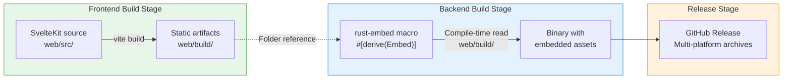
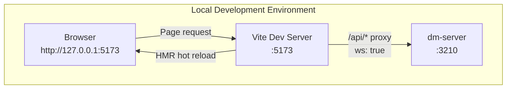
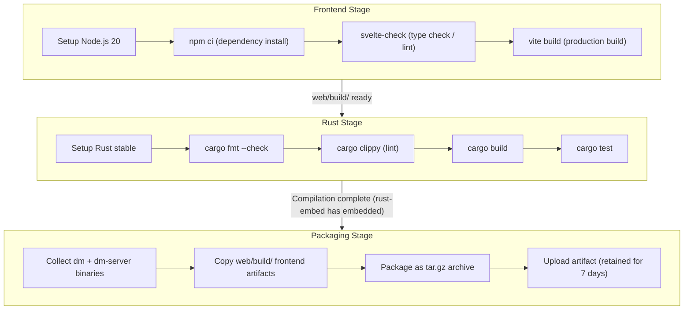
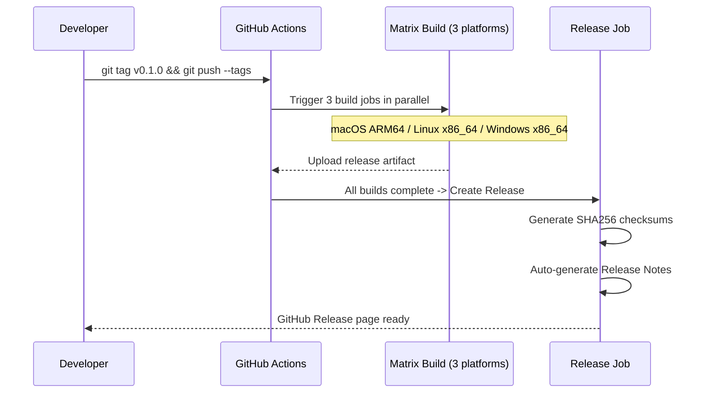

Dora Manager uses a **single-binary deployment** model -- the SvelteKit frontend is compiled into pure static files at build time, which are then embedded directly into the `dm-server` binary during Rust compilation via `rust-embed`. The final artifact is a single executable file with no need to deploy Node.js or Nginx separately. This article provides a complete walkthrough of the entire pipeline from `npm run build` to GitHub Release: frontend static build, compile-time asset embedding, SPA fallback serving, local development hot-reload workflow, and every stage of the cross-platform CI/CD pipeline.

Sources: [main.rs](https://github.com/l1veIn/dora-manager/blob/main/crates/dm-server/src/main.rs#L20-L22), [CHANGELOG.md](https://github.com/l1veIn/dora-manager/blob/main/CHANGELOG.md)

## Build Pipeline Overview

Before diving into each stage, let's establish a high-level understanding of the full pipeline. The Mermaid diagram below illustrates the complete data flow from source code to publishable binaries:



**Key design decision**: Choosing compile-time embedding over runtime filesystem reads makes `dm-server` a truly **self-contained binary** -- copy to deploy, with no risk of missing frontend files or path misalignment. The trade-off is that every frontend change requires recompiling the backend, but this happens naturally in CI environments.

Sources: [main.rs](https://github.com/l1veIn/dora-manager/blob/main/crates/dm-server/src/main.rs#L20-L22), [Cargo.toml](https://github.com/l1veIn/dora-manager/blob/main/Cargo.toml)

## Frontend Static Build: SvelteKit adapter-static

SvelteKit natively supports multiple modes including SSR (Server-Side Rendering) and CSR (Client-Side Rendering). Dora Manager chooses **pure static site generation** mode, meaning the build artifacts are a set of pure HTML/CSS/JS files with no dependency on any Node.js runtime.

### adapter-static Configuration

The core configuration lives in [svelte.config.js](https://github.com/l1veIn/dora-manager/blob/main/web/svelte.config.js):

```javascript
import adapter from '@sveltejs/adapter-static';

const config = {
    kit: {
        adapter: adapter({
            fallback: 'index.html'  // SPA fallback entry
        }),
        paths: {
            relative: false  // Use absolute paths for asset references
        }
    }
};
```

The purpose of the two key parameters:

| Parameter | Value | Purpose |
|---|---|---|
| `fallback` | `'index.html'` | All unmatched route requests fall back to `index.html`, enabling SPA client-side routing |
| `relative` | `false` | Asset references use absolute paths (e.g., `/_app/...`), avoiding path resolution errors under nested routes |

`fallback: 'index.html'` is the key to single-page applications -- when a user directly visits a URL like `/runs/abc123`, the server doesn't need to know about this route; it simply returns `index.html`, and the frontend JavaScript takes over to parse and render the corresponding page.

### Build Artifacts

After running `npm run build` (which actually executes `vite build`), all artifacts are output to the `web/build/` directory. This directory is excluded from version control via `.gitignore` and is only generated at build time. The build process is defined in [package.json](https://github.com/l1veIn/dora-manager/blob/main/web/package.json), with two key steps: `lint` (svelte-check type checking) and `build` (vite production build).

Sources: [svelte.config.js](https://github.com/l1veIn/dora-manager/blob/main/web/svelte.config.js#L1-L15), [package.json](https://github.com/l1veIn/dora-manager/blob/main/web/package.json#L7-L9), [.gitignore](https://github.com/l1veIn/dora-manager/blob/main/web/.gitignore#L3-L9)

## rust-embed Compile-time Embedding Mechanism

### Macro Declaration and Folder Mapping

In [main.rs](https://github.com/l1veIn/dora-manager/blob/main/crates/dm-server/src/main.rs#L20-L22), `rust-embed` uses a procedural macro to embed the entire `web/build/` directory tree into the binary at compile time:

```rust
#[derive(Embed)]
#[folder = "../../web/build"]
struct WebAssets;
```

This declaration does three things:

1. **Compile-time file reading**: The `#[folder]` attribute points to the path `../../web/build` relative to `crates/dm-server/`, which is `web/build/` under the project root. During compilation, `rust-embed` traverses all files in that directory and encodes their byte content as constants into the binary.
2. **Zero runtime overhead**: All file contents are stored in the `.rodata` section of ELF/Mach-O, accessed directly via memory mapping with no additional file I/O.
3. **API encapsulation**: The generated `WebAssets` type provides a `get(path) -> Option<EmbeddedFile>` method for retrieving embedded files by path.

### Dependency Configuration

`rust-embed` is declared in the workspace-level [Cargo.toml](https://github.com/l1veIn/dora-manager/blob/main/Cargo.toml):

```toml
rust-embed = { version = "8.11", features = ["axum"] }
mime_guess = "2"
```

`features = ["axum"]` enables integration type conversions with the Axum framework (`EmbeddedFile` can be directly converted into an Axum response), while `mime_guess` is used to infer `Content-Type` based on file extensions.

**Build ordering constraint**: Since `rust-embed` reads `web/build/` during the Rust compilation stage, the frontend must be built before the backend. This ordering is strictly enforced in CI pipelines and release workflows through step sequencing.

Sources: [main.rs](https://github.com/l1veIn/dora-manager/blob/main/crates/dm-server/src/main.rs#L20-L22), [Cargo.toml](https://github.com/l1veIn/dora-manager/blob/main/Cargo.toml), [dm-server/Cargo.toml](https://github.com/l1veIn/dora-manager/blob/main/crates/dm-server/Cargo.toml#L24-L25)

## Static Asset Serving and SPA Fallback

The embedded frontend assets are served through Axum's **fallback route**. In the router construction in [main.rs](https://github.com/l1veIn/dora-manager/blob/main/crates/dm-server/src/main.rs#L234-L235):

```rust
let app = Router::new()
    .route("/api/...", ...)   // API routes matched first
    .merge(SwaggerUi::new("/swagger-ui")...)
    .fallback(axum::routing::get(handlers::serve_web));  // All non-API requests go here
```

The semantics of `fallback` are: all requests not matched by `/api/*` routes or Swagger routes are handed to `serve_web`. This ensures API endpoints and frontend assets never conflict.

### serve_web Handler Logic

[handlers/web.rs](https://github.com/l1veIn/dora-manager/blob/main/crates/dm-server/src/handlers/web.rs#L6-L27) implements the classic SPA fallback pattern:

```rust
pub async fn serve_web(uri: Uri) -> impl IntoResponse {
    let mut path = uri.path().trim_start_matches('/').to_string();
    if path.is_empty() {
        path = "index.html".to_string();
    }

    match WebAssets::get(&path) {
        Some(content) => {
            let mime = mime_guess::from_path(&path).first_or_octet_stream();
            ([(header::CONTENT_TYPE, mime.as_ref())], content.data).into_response()
        }
        None => {
            // SPA fallback: unmatched paths return index.html
            if let Some(index) = WebAssets::get("index.html") {
                let mime = mime_guess::from_path("index.html").first_or_octet_stream();
                ([(header::CONTENT_TYPE, mime.as_ref())], index.data).into_response()
            } else {
                (StatusCode::NOT_FOUND, "404 Not Found").into_response()
            }
        }
    }
}
```

The decision flow is as follows:

| Request Path | `WebAssets::get()` Result | Response |
|---|---|---|
| `/` | Rewritten to `index.html` -> match found | `index.html` + `text/html` |
| `/assets/app-abc.js` | Match found | JS file + `application/javascript` |
| `/runs/xyz123` | No corresponding file -> **fallback** | `index.html` (frontend routing takes over) |
| `/nonexistent.css` | No corresponding file -> **fallback** | `index.html` (graceful degradation) |

`mime_guess::from_path()` automatically infers MIME types based on file extensions (`.js` -> `application/javascript`, `.css` -> `text/css`, `.svg` -> `image/svg+xml`), falling back to `application/octet-stream` when unrecognized.

Sources: [handlers/web.rs](https://github.com/l1veIn/dora-manager/blob/main/crates/dm-server/src/handlers/web.rs#L1-L27), [main.rs](https://github.com/l1veIn/dora-manager/blob/main/crates/dm-server/src/main.rs#L234-L235)

## Local Development Workflow: dev.sh Dual-Process Mode

During development, the frontend and backend run independently, communicating through Vite dev server's proxy mechanism. This workflow is orchestrated by the [dev.sh](https://github.com/l1veIn/dora-manager/blob/main/dev.sh) script.

### Architecture Topology



The Vite dev server configures proxy rules in [vite.config.ts](https://github.com/l1veIn/dora-manager/blob/main/web/vite.config.ts#L7-L14):

```typescript
server: {
    proxy: {
        '/api': {
            target: 'http://127.0.0.1:3210',
            changeOrigin: true,
            ws: true    // WebSocket proxy
        }
    }
}
```

`ws: true` is the key configuration -- it ensures WebSocket connections (used for run log streaming and message push) are also forwarded to the backend through the proxy, not just HTTP requests.

### dev.sh Orchestration Logic

The [dev.sh](https://github.com/l1veIn/dora-manager/blob/main/dev.sh) script orchestrates the dual processes in the following order:

1. **Prerequisite checks**: Verifies that `cargo` and `node` are installed
2. **Backend startup**: `cargo run -p dm-server &` starts the Rust backend, waiting for port 3210 to be ready (30-second timeout)
3. **Frontend startup**: `npm run dev -- --host 127.0.0.1 --port 5173` starts the Vite dev server
4. **Smart reuse**: If port 3210 is already occupied by a `dm-server` process, the backend startup is skipped and only the frontend dev server is started
5. **Graceful shutdown**: `trap cleanup EXIT INT TERM` captures Ctrl+C signals to ensure both child processes are properly terminated

This dual-process development experience is superior to recompiling the Rust binary on every frontend change -- frontend code modifications take effect almost instantly via Vite HMR, while backend API changes only require restarting `dm-server`.

Sources: [dev.sh](https://github.com/l1veIn/dora-manager/blob/main/dev.sh), [vite.config.ts](https://github.com/l1veIn/dora-manager/blob/main/web/vite.config.ts#L7-L14)

## CI Pipeline: Build Verification and Quality Gates

The CI pipeline is defined in [.github/workflows/ci.yml](https://github.com/l1veIn/dora-manager/blob/main/.github/workflows/ci.yml) and is automatically triggered on every push to the `master` branch or when a Pull Request is created.

### Matrix Build Strategy

The pipeline uses GitHub Actions' `matrix` strategy for cross-platform build verification:

| Matrix Item | target | runner | Description |
|---|---|---|---|
| macOS ARM64 | `aarch64-apple-darwin` | `macos-latest` | Apple Silicon native build |
| Linux x86_64 | `x86_64-unknown-linux-gnu` | `ubuntu-latest` | Standard Linux distribution |
| Windows | *Not yet enabled* | -- | Path separator issues pending fix |

`fail-fast: false` means that a failure on one platform will not cancel builds on other platforms, ensuring full coverage.

### Stage Execution Order



Noteworthy details:

- **Environment variable** `RUSTFLAGS: "-D warnings"` promotes all compiler warnings to errors, enforcing code quality gates
- **Rust caching** via `Swatinem/rust-cache@v2` accelerates subsequent builds, using `matrix.target` as the cache key
- **Artifact packaging**: Although `rust-embed` has already embedded the frontend into the binary, CI still packages `web/build/` separately into the `web_build/` directory for non-embedded scenarios

Additionally, there is a standalone **Security Audit** job that uses `cargo audit` to check for known security vulnerabilities in dependencies.

Sources: [ci.yml](https://github.com/l1veIn/dora-manager/blob/main/.github/workflows/ci.yml#L1-L120)

## Release Pipeline: Cross-Platform Binary Publishing

The Release pipeline is defined in [.github/workflows/release.yml](https://github.com/l1veIn/dora-manager/blob/main/.github/workflows/release.yml) and is triggered by Git tag pushes (`v*` pattern matching, e.g., `v0.1.0`).

### Two-Stage Design

The Release pipeline uses a **build + release** two-stage approach:



### Build Matrix

| Platform | target | Archive Format | Binary Suffix |
|---|---|---|---|
| macOS ARM64 | `aarch64-apple-darwin` | `.tar.gz` | (none) |
| Linux x86_64 | `x86_64-unknown-linux-gnu` | `.tar.gz` | (none) |
| Windows x86_64 | `x86_64-pc-windows-msvc` | `.zip` | `.exe` |

Compared to the CI pipeline, the Release additionally includes the Windows platform and uses the `--release` profile for optimized builds.

### Artifact Structure

Each platform's archive follows a unified directory structure:

```
dora-manager-v0.1.0-aarch64-apple-darwin/
├── dm                    # CLI tool
├── dm-server             # HTTP server (with embedded frontend)
└── web_build/            # Frontend static files (standalone copy)
    ├── index.html
    └── ...
```

The `dm-server` binary has already embedded the complete `web/build/` via `rust-embed`. The standalone copy of the `web_build/` directory is primarily for backup or debugging reference.

### Release Optimization Profile

The Release profile configuration in the workspace [Cargo.toml](https://github.com/l1veIn/dora-manager/blob/main/Cargo.toml) ensures the final artifacts are deeply optimized:

```toml
[profile.release]
lto = true           # Link-time optimization (cross-crate inlining)
codegen-units = 1     # Single codegen unit (better optimization, slower compilation)
strip = true          # Strip debug symbols (smaller binary)
opt-level = 3         # Highest optimization level
```

These settings significantly reduce binary size (`strip = true` can reduce it by 30-50%) while improving runtime performance through LTO and a single codegen-unit. The trade-off is increased compilation time, which is acceptable in CI environments.

Sources: [release.yml](https://github.com/l1veIn/dora-manager/blob/main/.github/workflows/release.yml#L1-L133), [Cargo.toml](https://github.com/l1veIn/dora-manager/blob/main/Cargo.toml)

## Build Ordering and Common Issue Troubleshooting

### Key Constraints on Build Ordering

Since `rust-embed` reads the `web/build/` directory at Rust compile time, the build order is immutable: **the frontend must be built before the backend**. If the order is reversed, `rust-embed` will fail to compile because `web/build/` doesn't exist (by default an empty directory won't cause an error, but the resulting binary will contain no frontend assets).

This requires the following sequence for any manual local build:

```bash
# 1. Build the frontend
cd web && npm ci && npm run build && cd ..

# 2. Build the backend
cargo build --release -p dm-server
```

### Quick Reference Table

| Scenario | Command | Notes |
|---|---|---|
| Local development | `./dev.sh` | Dual-process hot reload, no need to recompile Rust |
| Manual production build | First `cd web && npm run build`, then `cargo build --release -p dm-server` | Frontend before backend |
| Trigger official release | `git tag v0.x.x && git push --tags` | Automatically triggers the Release pipeline |
| Verify embedding works | `cargo run -p dm-server`, visit `http://127.0.0.1:3210` | Should see the frontend page |
| View API docs | Visit `http://127.0.0.1:3210/swagger-ui/` | Swagger UI starts with the server |

Sources: [dev.sh](https://github.com/l1veIn/dora-manager/blob/main/dev.sh), [CHANGELOG.md](https://github.com/l1veIn/dora-manager/blob/main/CHANGELOG.md)

## Further Reading

- [SvelteKit Project Structure: Route Design, API Communication Layer, and State Management](17-sveltekit-xiang-mu-jie-gou-lu-you-she-ji-api-tong-xin-ceng-yu-zhuang-tai-guan-li) -- Understand the complete architecture of the frontend `web/src/`, and which directories go into `web/build/` during a combined build
- [HTTP API Overview: REST Routes, WebSocket Real-time Channels, and Swagger Documentation](15-http-api-quan-lan-rest-lu-you-websocket-shi-shi-tong-dao-yu-swagger-wen-dang) -- Detailed explanation of the priority relationship between API routes and frontend asset fallback routes
- [Development Environment Setup: Building from Source and Hot-Reload Workflow](3-kai-fa-huan-jing-da-jian-cong-yuan-ma-gou-jian-yu-re-geng-xin-gong-zuo-liu) -- Detailed usage of `dev.sh` and environment configuration
- [Testing Strategy: Unit Tests, Data Flow Integration Tests, and System Test CheckList](26-ce-shi-ce-lue-dan-yuan-ce-shi-shu-ju-liu-ji-cheng-ce-shi-yu-xi-tong-ce-shi-checklist) -- Test levels covered by `cargo test` in the CI pipeline
