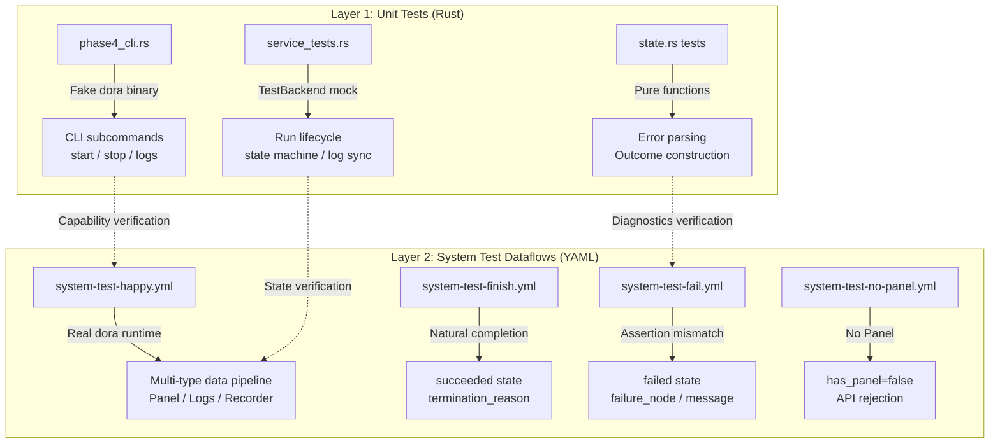
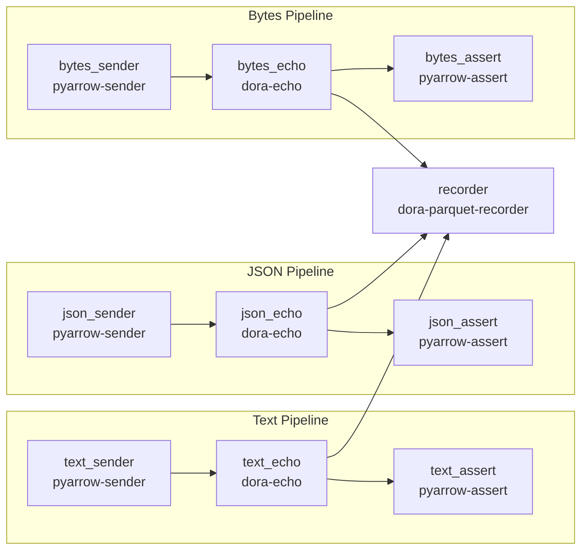
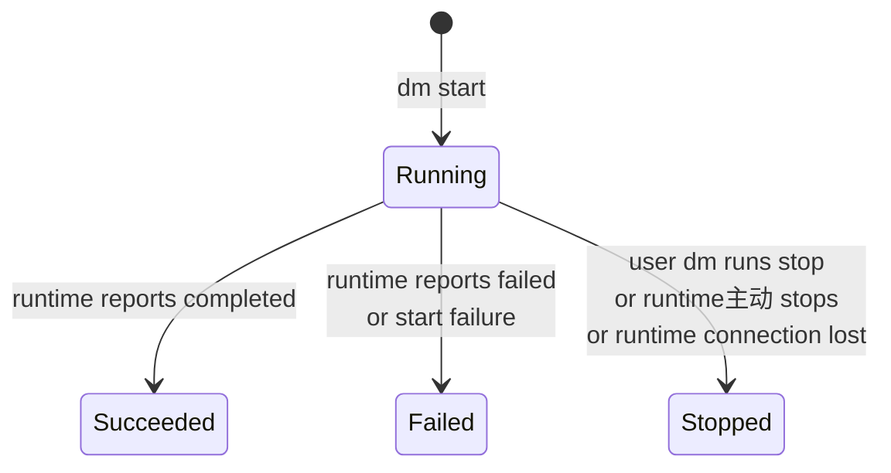
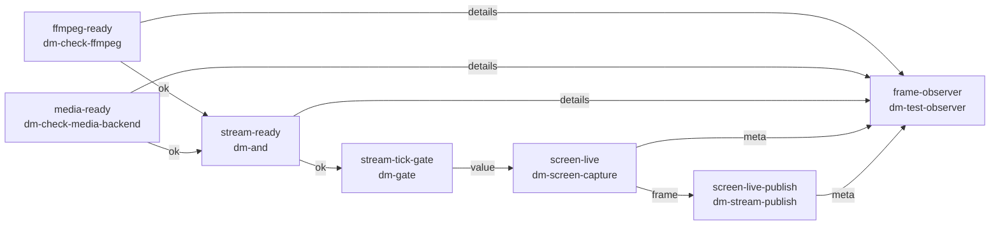

System test dataflows are the **bridge layer connecting unit tests and real runtime** in Dora Manager's testing system. They don't test business logic (like `qwen-dev.yml`'s AI inference pipeline), but focus on verifying whether five core operational scenarios — **run lifecycle management, Panel storage, log system, state transitions, and failure diagnostics** — are correct end-to-end. This document systematically explains their design philosophy, test matrix, custom test node architecture, and complete verification checklist.

Sources: [system-test-dataflows-plan.md](https://github.com/l1veIn/dora-manager/blob/master/docs/system-test-dataflows-plan.md#L1-L19)

## Design Philosophy: Determinism-First Integration Testing

Dora Manager's system test dataflows follow one core principle: **determinism over coverage**. This means the test suite prioritizes synthetic data over real hardware input, ensuring every `dm start` produces predictable results within seconds. Specifically, the design revolves around five principles:

- **Use deterministic nodes**: `pyarrow-sender`, `pyarrow-assert`, `dora-echo` and other nodes produce completely deterministic output for given inputs, not depending on external state.
- **Avoid hardware dependencies**: The main test suite doesn't depend on microphones, cameras, or other local hardware. Media capture nodes are handled separately as **second-stage extensions**.
- **Fast and repeatable**: Happy-path flows should complete in seconds.
- **Synthetic data first**: Text uses string `"system-test-text"`, JSON uses serialized strings, binary uses fixed PNG file header bytes `[137,80,78,71,13,10,26,10]`.
- **Layered verification**: Each dataflow verifies one or two specific scenarios, rather than one monolithic dataflow covering everything.

Sources: [system-test-dataflows-plan.md](https://github.com/l1veIn/dora-manager/blob/master/docs/system-test-dataflows-plan.md#L13-L19)

## Dual-Layer Test Architecture

Dora Manager's testing system consists of two complementary layers, each solving different problem domains:



**Layer 1** is Rust unit/integration tests running in `cargo test`, using mock `TestBackend` to replace real Dora runtime, verifying CLI parsing, Run state machine, error extraction, and other logic correctness. **Layer 2** is system test dataflow YAML running in real `dm start` environments, verifying end-to-end dataflow execution, Panel asset persistence, log tailing, and other cross-layer interactions.

Sources: [phase4_cli.rs](https://github.com/l1veIn/dora-manager/blob/master/crates/dm-cli/tests/phase4_cli.rs#L1-L13), [service_tests.rs](https://github.com/l1veIn/dora-manager/blob/master/crates/dm-core/src/runs/service_tests.rs#L1-L26), [state.rs](https://github.com/l1veIn/dora-manager/blob/master/crates/dm-core/src/runs/state.rs#L152-L183)

## Test Matrix: Eight Dataflows Overview

The current `tests/dataflows/` directory contains 11 YAML files, 8 of which belong to the system test suite (identified by `system-test-` prefix), with 3 used for interaction demos and development debugging. The matrix table below shows the complete coverage of system test dataflows:

| Dataflow | Core Verification Target | Node Count | Panel | Final State | Hardware Dependency |
|----------|------------------------|------------|-------|-------------|-------------------|
| `system-test-happy` | Multi-type data pipeline + Panel integration | 10 | ✅ | `stopped` (manual stop) | None |
| `system-test-finish` | Natural completion path | 3 | ❌ | `succeeded` | None |
| `system-test-fail` | Controlled failure + diagnostic metadata | 3 | ❌ | `failed` | None |
| `system-test-no-panel` | Explicit no-Panel path | 3 | ❌ | `succeeded` | None |
| `system-test-screen` | Screenshot asset persistence | 1 | ✅ | `succeeded` | macOS screenshot permission |
| `system-test-audio` | Audio asset persistence | 1 | ✅ | `succeeded` | Microphone |
| `system-test-stream` | Streaming pipeline orchestration | 6 | ❌ | Long-running | ffmpeg + mediamtx |
| `system-test-downloader` | Downloader node function verification | 1 | ❌ | Long-running | Network |
| `system-test-full` | Multimodal joint (VAD + screenshot + audio) | 4 | ✅ | Long-running | Microphone + screenshot |

The first four (happy / finish / fail / no-panel) form the **main test suite** with no hardware dependencies, runnable in any environment. The last five are the **extension test suite**, requiring specific hardware or network conditions.

Sources: [system-test-happy.yml](https://github.com/l1veIn/dora-manager/blob/master/tests/dataflows/system-test-happy.yml#L1-L83), [system-test-finish.yml](https://github.com/l1veIn/dora-manager/blob/master/tests/dataflows/system-test-finish.yml#L1-L25), [system-test-fail.yml](https://github.com/l1veIn/dora-manager/blob/master/tests/dataflows/system-test-fail.yml#L1-L25), [system-test-no-panel.yml](https://github.com/l1veIn/dora-manager/blob/master/tests/dataflows/system-test-no-panel.yml#L1-L25)

## Core Scenario Deep Dive

### system-test-happy: Comprehensive Multi-Type Data Pipeline Verification

This is the most complex foundational test dataflow, containing 10 nodes forming three parallel pipelines (text / json / bytes), each following a **sender → echo → assert** three-segment topology. Its architecture:



The three pipelines' key design intent is covering Dora Manager's ability to handle different Arrow data types: `text_sender` sends plain text `'system-test-text'`, `json_sender` sends serialized JSON string `'{"kind":"system-test","value":1}'`, `bytes_sender` sends integer arrays simulating PNG file headers `[137,80,78,71,13,10,26,10,0,0,0,0]`. The `recorder` node aggregates output from all three pipelines, persisting data as Parquet files, verifying `dora-parquet-recorder`'s multi-input aggregation and file storage behavior.

Sources: [system-test-happy.yml](https://github.com/l1veIn/dora-manager/blob/master/tests/dataflows/system-test-happy.yml#L1-L83)

### system-test-finish: Natural Completion Path

The simplest deterministic test, only 3 nodes, verifying the dataflow graph **naturally exits** after all nodes complete their work:

```
finish_sender → finish_echo → finish_assert
```

`pyarrow-sender` is one-shot — it sends one piece of data then exits. When all nodes in the graph have exited, the Dora runtime detects the dataflow has ended and marks the state as `succeeded`. This test's core verification point is `termination_reason = completed`, meaning the termination reason must be through completion rather than user stop.

Sources: [system-test-finish.yml](https://github.com/l1veIn/dora-manager/blob/master/tests/dataflows/system-test-finish.yml#L1-L25)

### system-test-fail: Controlled Failure and Diagnostic Metadata

This dataflow deliberately creates an **assertion mismatch** to verify the failure path's completeness:

```
fail_sender (sends 'system-test-actual')
  → fail_echo
    → fail_assert (expects 'system-test-expected')
```

`fail_sender` sends `'system-test-actual'`, but `fail_assert` is configured to expect `'system-test-expected'`. The `pyarrow-assert` node detects the mismatch and terminates with a non-zero exit code, with the Dora runtime subsequently marking the entire dataflow as `failed`. DM's state inference engine [`infer_failure_details`](https://github.com/l1veIn/dora-manager/blob/master/crates/dm-core/src/runs/state.rs#L34-L57) scans `fail_assert`'s runtime logs, extracts the `AssertionError:` line, and fills it into `run.json`'s `failure_node` and `failure_message` fields.

Sources: [system-test-fail.yml](https://github.com/l1veIn/dora-manager/blob/master/tests/dataflows/system-test-fail.yml#L1-L25), [state.rs](https://github.com/l1veIn/dora-manager/blob/master/crates/dm-core/src/runs/state.rs#L116-L139)

### system-test-no-panel: Explicit No-Panel Path Verification

This dataflow's structure is identical to `system-test-finish`, but its core difference is **not containing a `dm-panel` node**. The key verification point is `has_panel = false` in `run.json`, and the `~/.dm/runs/<run_id>/panel/` directory doesn't exist. This ensures no-Panel dataflows don't accidentally create Panel-related storage structures, and the Server's `/api/runs/{id}/panel/*` endpoints correctly reject access.

Sources: [system-test-no-panel.yml](https://github.com/l1veIn/dora-manager/blob/master/tests/dataflows/system-test-no-panel.yml#L1-L25)

## Custom Test Node Ecosystem

The main test suite uses general-purpose nodes from the Dora community (`pyarrow-sender`, `dora-echo`, etc.). To cover DM-exclusive scenarios like media asset persistence, the project builds three **dedicated test nodes**, implemented in Python and exposing declarative configuration interfaces through `dm.json`'s `config_schema`:

| Node | Category | Output Ports | Core Capabilities |
|------|----------|-------------|-------------------|
| `dm-test-media-capture` | Builtin/Test | `image` / `video` / `meta` | macOS screenshot and screen recording, supports trigger mode and timed repeat |
| `dm-test-audio-capture` | Builtin/Test | `audio` / `audio_stream` / `meta` | Fixed-duration microphone recording, WAV output + Float32 streaming output |
| `dm-test-observer` | Builtin/Test | `summary_text` / `summary_json` | Multimodal event aggregator, generates human-readable and machine-readable test summaries |

### dm-test-media-capture

This node uses macOS native screenshot tools (`screencapture` command) for deterministic screenshots, supporting three modes:

- **`screenshot`**: Capture once at startup or upon receiving `trigger` input, output PNG bytes to `image` port
- **`repeat_screenshot`**: Loop screenshots at `interval_sec` intervals
- **`record_clip`**: Record `clip_duration_sec` seconds of screen video, output MP4/MOV to `video` port

Its `config_schema` is declared via `dm.json`, and DM's transpilation layer automatically maps `config:` blocks to environment variables, eliminating the need for manual `env:` block configuration. In `system-test-screen.yml`, it runs with minimal configuration — single screenshot mode, no `trigger` input connection needed.

Sources: [dm.json](https://github.com/l1veIn/dora-manager/blob/master/nodes/dm-test-media-capture/dm.json#L83-L100), [README.md](https://github.com/l1veIn/dora-manager/blob/master/nodes/dm-test-media-capture/README.md#L1-L53)

### dm-test-audio-capture

This node uses Python's `sounddevice` library for fixed-duration microphone recording. It provides two output forms: `audio` port sends complete WAV file bytes (suitable for Panel asset storage), `audio_stream` port sends Float32 PCM sampling stream (suitable for downstream real-time processing nodes like `dora-vad`). In `system-test-audio.yml`, it runs in 16kHz mono 3-second mode; in `system-test-full.yml`, it serves as the audio source node for the VAD pipeline.

Sources: [dm.json](https://github.com/l1veIn/dora-manager/blob/master/nodes/dm-test-audio-capture/dm.json#L74-L142), [README.md](https://github.com/l1veIn/dora-manager/blob/master/nodes/dm-test-audio-capture/README.md#L1-L25)

### dm-test-observer

This is an **aggregation diagnostic node** that receives metadata outputs from multiple test nodes (audio metadata, screenshot metadata, VAD timestamps, etc.), and after aggregation generates test summaries in two formats: `summary_text` (human-readable plain text report) and `summary_json` (machine-parseable JSON object). In `system-test-stream.yml` and `system-test-full.yml`, it serves as the final verification convergence point, confirming all upstream nodes correctly produced expected metadata.

Sources: [dm.json](https://github.com/l1veIn/dora-manager/blob/master/nodes/dm-test-observer/dm.json#L1-L101)

## Run Lifecycle State Machine

Understanding the verification logic of system test dataflows requires first understanding DM's Run instance state machine. The `RunStatus` enum defines four states, and the `TerminationReason` enum defines six termination reasons:



| RunStatus | Meaning | Corresponding TerminationReason |
|-----------|---------|-------------------------------|
| `Running` | Dataflow is executing | None |
| `Succeeded` | All nodes completed normally | `completed` |
| `Failed` | Node failure or startup failure | `start_failed` / `node_failed` |
| `Stopped` | Externally stopped | `stopped_by_user` / `runtime_stopped` / `runtime_lost` |

Each system test dataflow verifies different state transition paths: `system-test-finish` verifies `Running → Succeeded`, `system-test-fail` verifies `Running → Failed (node_failed)`, `system-test-happy` verifies `Running → Stopped (stopped_by_user)`, `system-test-no-panel` verifies `Running → Succeeded` under no-Panel conditions.

The key implementation in state inference is in `state.rs`: when the Dora runtime returns failure information, the `parse_failure_details` function extracts the failed node name and detailed reason from the formatted string `"Node &lt;name&gt; failed: <detail>"`. When the runtime doesn't provide sufficient information, the `infer_failure_details` function falls back to scanning each node's runtime logs, looking for error markers like `AssertionError:`, `thread 'main' panicked at`, `Traceback`, etc.

Sources: [model.rs](https://github.com/l1veIn/dora-manager/blob/master/crates/dm-core/src/runs/model.rs#L5-L74), [state.rs](https://github.com/l1veIn/dora-manager/blob/master/crates/dm-core/src/runs/state.rs#L18-L57)

## Run Directory Structure and Verification Points

After each `dm start` execution, DM creates a standardized directory layout under `~/.dm/runs/<run_id>/`. Understanding this layout is the foundation for executing checklist verification:

```
~/.dm/runs/<run_id>/
├── run.json                    # Run instance metadata (status, node list, transpile info)
├── dataflow.yml                # Original YAML snapshot
├── dataflow.transpiled.yml     # Transpiled executable YAML
├── view.json                   # (Optional) Editor view state
├── out/                        # Dora runtime raw output
│   └── <dora_uuid>/
│       ├── log_worker.txt
│       └── log_<node>.txt
├── logs/                       # DM synced structured logs
│   └── <node>.log
└── panel/                      # (Panel dataflows only)
    └── index.db                # SQLite asset index
```

`run.json` is the core verification file, where `nodes_expected` field records all node IDs declared in YAML, `nodes_observed` records nodes actually observed by the runtime, and `transpile.resolved_node_paths` records executable file paths resolved by the transpiler for each node. The consistency of these three datasets is the foundation for verifying dataflow execution correctness.

Sources: [repo.rs](https://github.com/l1veIn/dora-manager/blob/master/crates/dm-core/src/runs/repo.rs#L9-L48), [service_start.rs](https://github.com/l1veIn/dora-manager/blob/master/crates/dm-core/src/runs/service_start.rs#L120-L174)

## Verification Checklist

The following checklist can be directly used for manual verification of each system test dataflow. All commands assume the `run_id` returned by `dm start` has been recorded.

### Common Checks (All Dataflows)

```bash
# 1. Start dataflow
dm start tests/dataflows/<flow>.yml
# Record returned run_id

# 2. Check Run list
dm runs

# 3. Check run.json core fields
cat ~/.dm/runs/<run_id>/run.json | python3 -m json.tool

# 4. Check directory structure
find ~/.dm/runs/<run_id> -maxdepth 3 -print | sort

# 5. View global logs
dm runs logs <run_id>
```

**Verification points**:

| Field | Expected |
|-------|----------|
| `dataflow_name` | Matches YAML filename (without extension) |
| `nodes_expected` | Contains all declared `id`s in YAML |
| `transpile.resolved_node_paths` | All node paths populated |
| `out/` directory | Contains raw Dora runtime logs |
| `schema_version` | `1` |

Sources: [system-test-dataflows-checklist.md](https://github.com/l1veIn/dora-manager/blob/master/docs/system-test-dataflows-checklist.md#L6-L30)

### system-test-happy Dedicated Checks

```bash
# Start
dm start tests/dataflows/system-test-happy.yml

# Verify each pipeline's logs
dm runs logs <run_id> text_sender
dm runs logs <run_id> json_sender
dm runs logs <run_id> bytes_sender
dm runs logs <run_id> recorder

# Verify Panel structure
find ~/.dm/runs/<run_id>/panel -maxdepth 2 -print | sort

# Verify Recorder output
find ~/.dm/runs/<run_id> -path '*recorder*' -print | sort

# Manual stop
dm runs stop <run_id>
```

**Verification points**:

| Check Item | Expected |
|-----------|----------|
| `has_panel` | `true` (due to containing recorder and other persistence nodes) |
| `panel/index.db` | Exists |
| text/json/bytes pipelines | All three pipelines produce logs |
| recorder Parquet | `.parquet` file exists in run directory |
| After manual stop | `status = stopped`, `termination_reason = stopped_by_user` |

Sources: [system-test-dataflows-checklist.md](https://github.com/l1veIn/dora-manager/blob/master/docs/system-test-dataflows-checklist.md#L47-L71)

### system-test-finish Dedicated Checks

```bash
dm start tests/dataflows/system-test-finish.yml
# Wait for natural completion
dm runs
cat ~/.dm/runs/<run_id>/run.json
dm runs logs <run_id>
```

**Verification points**:

| Check Item | Expected |
|-----------|----------|
| Final state | `status = succeeded` (not `stopped`) |
| `termination_reason` | `completed` (not `stopped_by_user`) |
| Log readability | `dm runs logs` still viewable after completion |
| No manual intervention | Dataflow graph exits on its own |

Sources: [system-test-dataflows-checklist.md](https://github.com/l1veIn/dora-manager/blob/master/docs/system-test-dataflows-checklist.md#L73-L93)

### system-test-fail Dedicated Checks

```bash
dm start tests/dataflows/system-test-fail.yml
# Wait for failure completion
dm runs
cat ~/.dm/runs/<run_id>/run.json
dm runs logs <run_id> fail_assert
```

**Verification points**:

| Check Item | Expected |
|-----------|----------|
| `status` | `failed` |
| `termination_reason` | `node_failed` |
| `failure_node` | `fail_assert` |
| `failure_message` | Contains assertion mismatch details (`AssertionError: Expected ... got ...`) |
| `fail_assert` log | Contains error details consistent with `failure_message` |

Sources: [system-test-dataflows-checklist.md](https://github.com/l1veIn/dora-manager/blob/master/docs/system-test-dataflows-checklist.md#L95-L117), [state.rs](https://github.com/l1veIn/dora-manager/blob/master/crates/dm-core/src/runs/state.rs#L116-L139)

### system-test-no-panel Dedicated Checks

```bash
dm start tests/dataflows/system-test-no-panel.yml
cat ~/.dm/runs/<run_id>/run.json
find ~/.dm/runs/<run_id> -maxdepth 2 -print | sort
```

**Verification points**:

| Check Item | Expected |
|-----------|----------|
| `has_panel` | `false` |
| `panel/` directory | **Does not exist** |
| `status` | `succeeded` |
| Lifecycle | Run completes normally, unaffected by missing Panel |

Sources: [system-test-dataflows-checklist.md](https://github.com/l1veIn/dora-manager/blob/master/docs/system-test-dataflows-checklist.md#L119-L138)

### system-test-screen Dedicated Checks

```bash
dm node install dm-test-media-capture    # First time requires installation
dm start tests/dataflows/system-test-screen.yml
dm runs logs <run_id> screen
find ~/.dm/runs/<run_id>/panel -maxdepth 3 -print | sort
sqlite3 ~/.dm/runs/<run_id>/panel/index.db 'select seq,input_id,type,storage,path from assets order by seq;'
```

**Verification points**:

| Check Item | Expected |
|-----------|----------|
| `has_panel` | `true` |
| Panel assets | At least 1 PNG image record + 1 JSON metadata record |
| Node logs | Contains screenshot command execution records |
| Screenshot permission | macOS may pop up permission request on first use; screenshot succeeds after authorization |

Sources: [system-test-dataflows-checklist.md](https://github.com/l1veIn/dora-manager/blob/master/docs/system-test-dataflows-checklist.md#L140-L167)

### system-test-audio Dedicated Checks

```bash
dm node install dm-test-audio-capture    # First time requires installation
dm start tests/dataflows/system-test-audio.yml
dm runs logs <run_id> microphone
find ~/.dm/runs/<run_id>/panel -maxdepth 3 -print | sort
sqlite3 ~/.dm/runs/<run_id>/panel/index.db 'select seq,input_id,type,storage,path from assets order by seq;'
```

**Verification points**:

| Check Item | Expected |
|-----------|----------|
| `has_panel` | `true` |
| Panel assets | At least 1 WAV audio record + 1 JSON metadata record |
| Final state | `succeeded` (auto-completes after 3-second recording) |
| Audio parameters | 16kHz / mono / 3 seconds |

Sources: [system-test-dataflows-checklist.md](https://github.com/l1veIn/dora-manager/blob/master/docs/system-test-dataflows-checklist.md#L169-L197)

## Extension Dataflows: Streaming and Multimodal Pipelines

### system-test-stream: Streaming Pipeline Orchestration Verification

This dataflow verifies Dora Manager's **streaming media architecture stack** works end-to-end. It orchestrates 6 nodes forming a complete pipeline from environment check to stream publishing:



This pipeline's core design pattern is **conditional gating**: `dm-check-ffmpeg` and `dm-check-media-backend` loop-check ffmpeg and mediamtx readiness at 5-second intervals respectively. Only when both return `ok` does `dm-and` let the signal through. `dm-gate` combines the ready signal with a 2-second timer, triggering screenshots rhythmically. Finally, `dm-stream-publish` publishes screenshot frames as RTSP stream at 5fps. `frame-observer` serves as the diagnostic convergence point, collecting metadata from each stage to confirm the pipeline is working correctly.

Sources: [system-test-stream.yml](https://github.com/l1veIn/dora-manager/blob/master/tests/dataflows/system-test-stream.yml#L1-L77)

### system-test-full: Multimodal Joint Test

This is the broadest-coverage test dataflow, combining audio capture, VAD voice activity detection, screenshot capture, and event aggregation:

```
microphone (dm-test-audio-capture, repeat mode, 2s)
  → audio_stream → vad (dora-vad)
                   → timestamp_start / timestamp_end
screen (dm-test-media-capture, repeat_screenshot, 5s interval)
  → image / meta
observer (dm-test-observer)
  ← microphone/meta, screen/meta, vad/timestamp_start, vad/timestamp_end
  → summary_text / summary_json
```

This dataflow uses `dm-test-audio-capture`'s `repeat` mode to continuously output audio streams, with downstream `dora-vad` node performing real-time voice activity detection, and output timestamp signals aggregated by `dm-test-observer`. This is a typical **long-running test** for verifying multi-node stability and Panel asset accumulation under continuous running conditions.

Sources: [system-test-full.yml](https://github.com/l1veIn/dora-manager/blob/master/tests/dataflows/system-test-full.yml#L1-L46)

## Unit Test Layer: TestBackend Architecture

System test dataflows verify end-to-end behavior, while `dm-core` internally implements **unit tests independent of real Dora runtime** through `TestBackend` trait mock. `TestBackend` implements the `RuntimeBackend` trait, allowing precise control over `start`, `stop`, and `list` runtime operation behavior:

| Method | Real Backend | TestBackend |
|--------|-------------|-------------|
| `start_detached` | Calls `dora start` and parses UUID | Returns preset `(uuid, message)` pair |
| `stop` | Calls `dora stop` | Records call parameters to `stop_calls` vector |
| `list` | Calls `dora list` | Returns preset `RuntimeDataflow` list |

This design enables the 7 test cases in `service_tests.rs` to complete in milliseconds, unaffected by platform differences. Key test scenarios covered include: UUID missing on start failure, log sync on stop, fault tolerance on stop failure, multi-state joint update on status refresh, and auto-stop old instance under restart strategy.

Sources: [service_tests.rs](https://github.com/l1veIn/dora-manager/blob/master/crates/dm-core/src/runs/service_tests.rs#L21-L53), [runtime.rs](https://github.com/l1veIn/dora-manager/blob/master/crates/dm-core/src/runs/runtime.rs)

## CI Integration Status and Evolution Path

The current CI pipeline (`.github/workflows/ci.yml`) runs `cargo test --workspace`, covering Layer 1's Rust unit tests and `phase4_cli.rs`'s CLI integration tests. System test dataflows (Layer 2) currently exist as **manual verification tools**, requiring developers to locally execute `dm start` and follow the checklist.

The main obstacle to including system test dataflows in CI is the **Dora runtime installation dependency** — the CI environment first needs `dm setup` to install the Dora runtime before dataflows can execute. Meanwhile, `pyarrow-sender`, `pyarrow-assert` and other community nodes also need pre-installation. This is the future direction for CI enhancement: adding the complete `dm setup` + `dm node install` + `dm start` flow in CI.

Sources: [ci.yml](https://github.com/l1veIn/dora-manager/blob/master/.github/workflows/ci.yml#L1-L73)

## Recommended Implementation Order

Following the original planning document's suggestions, system test dataflow implementation should follow this order:

1. ✅ Write `system-test-happy.yml` — Verify multi-type pipeline and Panel foundation
2. ✅ Write `system-test-finish.yml` — Verify natural completion path
3. ✅ Write `system-test-fail.yml` — Verify failure diagnostic chain
4. ✅ Write `system-test-no-panel.yml` — Verify explicit no-Panel path
5. ✅ Write verification checklist for each dataflow
6. ✅ Add `dm-test-media-capture` custom test node
7. ✅ Add `dm-test-audio-capture` custom test node
8. ✅ Write `system-test-screen.yml` and `system-test-audio.yml`
9. ✅ Write `system-test-stream.yml` streaming pipeline
10. ✅ Write `system-test-full.yml` multimodal joint test

All steps are currently complete. Next evolution directions include: automating the main test suite (first four dataflows) as an integration test stage in CI, and adding conditional skip logic for the extension suite (e.g., skipping audio tests when no microphone is detected).
