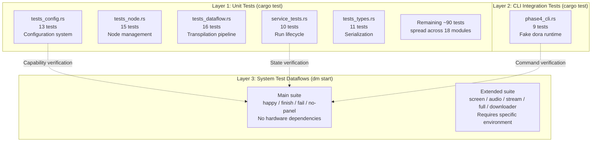
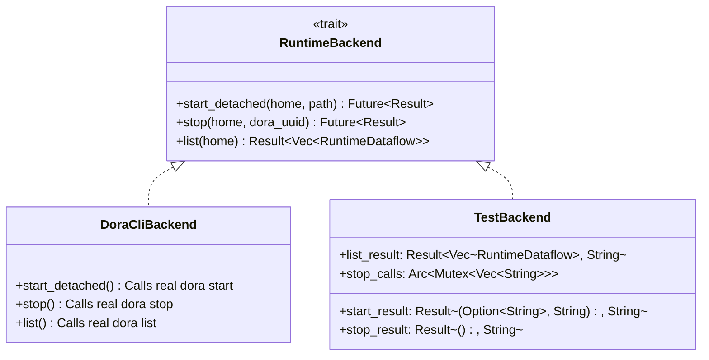
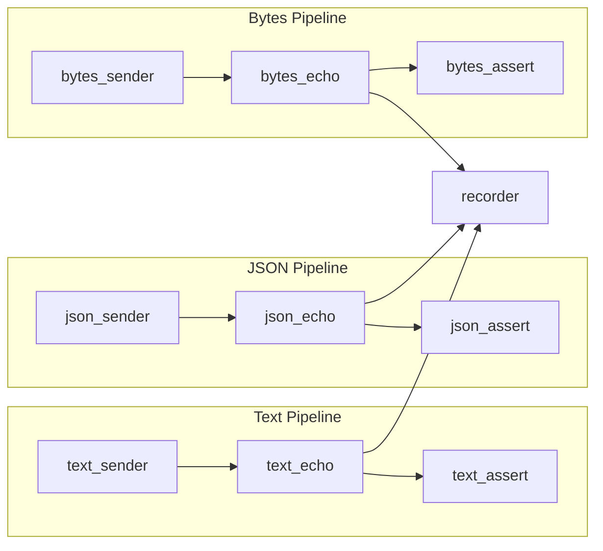
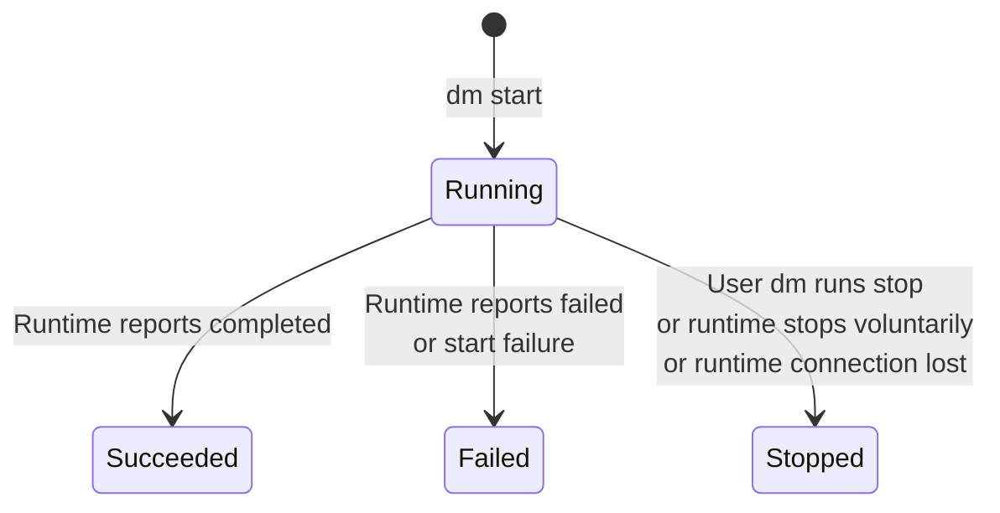

Dora Manager's testing system adopts a **layered isolation** strategy, precisely allocating verification responsibilities across three layers: the Rust unit test layer verifies internal logic correctness, the CLI integration test layer verifies end-to-end behavior of command-line interactions, and the system test dataflow layer verifies the complete execution trajectory of the Run lifecycle under a real Dora runtime. This document elaborates on the architectural design and test coverage of each layer, along with the manual verification checklist for system tests, helping developers understand "what to test, how to test, and why we test this way."

Sources: [system-test-dataflows-plan.md](https://github.com/l1veIn/dora-manager/blob/main/docs/system-test-dataflows-plan.md#L1-L19), [ci.yml](https://github.com/l1veIn/dora-manager/blob/main/.github/workflows/ci.yml#L70-L73)

## Three-Layer Test Architecture Overview



**Layer 1** runs within `cargo test --workspace` and contains approximately 180 `#[test]` functions distributed across 22 source files in `dm-core`. It uses `tempfile` to create temporary directories and `TestBackend` mocks to replace the real Dora runtime, verifying all internal logic from configuration serialization to Run state machines. **Layer 2** is also driven by `cargo test`, but builds a real `dm` CLI binary process through the `assert_cmd` framework, using shell scripts to simulate the `start`/`stop`/`list` command behavior of the `dora` runtime. **Layer 3** launches the real Dora runtime via `dm start` to execute YAML dataflows, verifying the end-to-end Run lifecycle.

Sources: [service_tests.rs](https://github.com/l1veIn/dora-manager/blob/main/crates/dm-core/src/runs/service_tests.rs#L21-L54), [phase4_cli.rs](https://github.com/l1veIn/dora-manager/blob/main/crates/dm-cli/tests/phase4_cli.rs#L1-L13), [ci.yml](https://github.com/l1veIn/dora-manager/blob/main/.github/workflows/ci.yml#L70-L73)

## Layer 1: Rust Unit Tests

### Test Distribution and Module Coverage

The `dm-core` crate is the most densely tested module, with unit tests distributed across the following files by functional domain:

| Module Domain | File | Test Count | Core Verification Content |
|---------------|------|------------|--------------------------|
| **Configuration system** | `tests/tests_config.rs` | 13 | `resolve_home` priority, `save/load` round-trip, automatic directory creation |
| **Node management** | `tests/tests_node.rs` | 15 | Node CRUD, scaffolding generation, built-in node protection, file tree filtering |
| **Dataflow transpilation** | `tests/tests_dataflow.rs` | 16 | Path resolution, Bridge injection, config_schema default injection, unknown node preservation |
| **Run lifecycle** | `runs/service_tests.rs` | 10 | Start failure, status refresh, stop success/failure/timeout, restart strategy |
| **Schema validation** | `node/schema/tests.rs` | 29 | dm.json field parsing, port declarations, capabilities structure |
| **Type serialization** | `tests/tests_types.rs` | 11 | JSON round-trip for `EnvItem`, `DoctorReport`, `InstallProgress`, etc. |
| **Environment detection** | `tests/tests_env.rs` | 5 | Python/uv/Rust detection logic |
| **Utility functions** | `tests/tests_util.rs` | 9 | `human_size`, `check_command`, `is_valid_dora_binary` |
| **API layer** | `tests/tests_api.rs` | 14 | `doctor`, `versions`, `install`, `uninstall`, event recording |
| **Installation system** | `install/mod.rs` + submodules | 11 | GitHub release parsing, source build, version management |
| **Node import** | `node/import.rs` + `hub.rs` | 10 | Node discovery, registry interaction |
| **Event system** | `events/mod.rs` | 6 | Event storage, filtering, XES compatibility |
| **State inference** | `runs/state.rs` | 3 | `parse_failure_details`, `extract_error_summary` |
| **Runtime parsing** | `runs/runtime.rs` | 4 | `extract_dataflow_id`, `parse_runtime_dataflows` |
| **Metrics collection** | `runs/service_metrics.rs` | 4 | CPU/memory metrics parsing |

A total of approximately **180 test functions** covering all core modules of `dm-core`. These tests follow a common pattern: using `tempfile::tempdir()` to create an isolated temporary `DM_HOME` directory, constructing necessary node metadata files (`dm.json`), then calling the function under test and asserting results.

Sources: [tests_config.rs](https://github.com/l1veIn/dora-manager/blob/main/crates/dm-core/src/tests/tests_config.rs#L1-L148), [tests_node.rs](https://github.com/l1veIn/dora-manager/blob/main/crates/dm-core/src/tests/tests_node.rs#L1-L200), [tests_dataflow.rs](https://github.com/l1veIn/dora-manager/blob/main/crates/dm-core/src/tests/tests_dataflow.rs#L1-L156), [tests_types.rs](https://github.com/l1veIn/dora-manager/blob/main/crates/dm-core/src/tests/tests_types.rs#L1-L183)

### TestBackend Architecture: Mock-Driven Run Lifecycle Testing

The core facility for Run lifecycle testing is `TestBackend` -- a mock object that implements the `RuntimeBackend` trait, replacing `DoraCliBackend` which actually calls `dora start/stop/list`:



The three fields of `TestBackend` allow precise control over each runtime operation's behavior: `start_result` simulates the return of `dora start` (it can return a response with a missing UUID to test start failure), `stop_result` simulates success or failure of the stop operation, and `list_result` simulates the dataflow list returned by `dora list`. `stop_calls` uses `Arc<Mutex<Vec<String>>>` to record all incoming `dora_uuid` parameters, enabling tests to verify that the stop operation was called correctly.

Sources: [runtime.rs](https://github.com/l1veIn/dora-manager/blob/main/crates/dm-core/src/runs/runtime.rs#L24-L34), [service_tests.rs](https://github.com/l1veIn/dora-manager/blob/main/crates/dm-core/src/runs/service_tests.rs#L22-L54)

### Key Test Scenario Analysis

The 10 tests in `service_tests.rs` cover the most critical interaction scenarios in the Run lifecycle:

| Test Function | Scenario Verified | Core Assertion |
|---------------|-------------------|----------------|
| `start_run_fails_when_runtime_uuid_is_missing` | dora start does not return a UUID | Run recorded as `Failed` + `StartFailed` |
| `refresh_run_statuses_keeps_running_state_when_runtime_list_fails` | `dora list` transient failure | Running state remains unchanged |
| `refresh_run_statuses_reconciles_stale_running_state` | Runtime completely unreachable | Marked as `Stopped` + `RuntimeLost` |
| `stop_run_success_marks_run_stopped_and_syncs_logs` | Normal stop | Log sync completed + `StoppedByUser` |
| `stop_run_failure_tolerates_when_not_in_runtime_list` | dora stop fails but dataflow already gone | Graceful handling, still marked as `Stopped` |
| `stop_run_failure_marks_run_failed_when_still_running` | dora stop fails and dataflow still running | Marked as `Failed` + `NodeFailed` |
| `stop_run_timeout_keeps_run_running_when_runtime_still_reports_running` | dora stop timeout | Remains `Running`, records `stop_request` |
| `refresh_run_statuses_updates_terminal_states` | Batch status refresh | Correctly identifies succeeded/failed/stopped/lost |
| `refresh_run_statuses_preserves_user_stop_intent` | User requests stop, then runtime reports succeeded | Prioritizes marking as `StoppedByUser` |
| `start_run_with_restart_strategy` | Restart strategy | Stops old Run before starting new Run |

These tests demonstrate an important design principle: **Run state inference is not a simple mapping of runtime states**, but rather a multi-source inference combining `stop_request` history, runtime return values, and log content. For example, `refresh_run_statuses_preserves_user_stop_intent` verifies that even if the runtime ultimately reports the dataflow completed naturally (`succeeded`), if the user previously requested a stop, DM will still mark it as `StoppedByUser`, as this more accurately reflects the causal relationship.

Sources: [service_tests.rs](https://github.com/l1veIn/dora-manager/blob/main/crates/dm-core/src/runs/service_tests.rs#L150-L717)

### Pure Function Tests for State Inference

The helper functions in `state.rs` handle the core logic for failure diagnosis -- they are **side-effect-free pure functions**, and tests cover key parsing paths:

- **`parse_failure_details`**: Extracts the failed node name and details from Dora runtime error messages in the format `"Node <name> failed: <detail>"`. Tests verify case-insensitive matching and handling of format variations.
- **`extract_error_summary`**: Extracts error summaries from node logs, preferentially matching key markers such as `AssertionError:`, `thread 'main' panicked at`, `panic:`, `ERROR`, falling back to the last line of a Python traceback.
- **`compact_error_text`**: Compresses multi-line error text into a single line, truncated to 240 characters.

These three functions form the underlying support for the failure diagnosis pipeline in the system test dataflow `system-test-fail`. When the `pyarrow-assert` node crashes due to an assertion mismatch, the Dora runtime reports `"Node fail_assert failed: ..."`, and DM's status refresh logic calls these functions to extract `failure_node` and `failure_message`, ultimately writing them into `run.json`.

Sources: [state.rs](https://github.com/l1veIn/dora-manager/blob/main/crates/dm-core/src/runs/state.rs#L18-L57), [state.rs tests](https://github.com/l1veIn/dora-manager/blob/main/crates/dm-core/src/runs/state.rs#L154-L185)

## Layer 2: CLI Integration Tests

### Fake Dora Runtime Architecture

CLI integration tests are located in `crates/dm-cli/tests/phase4_cli.rs` and perform end-to-end verification by building a real `dm` binary process through the `assert_cmd` framework. The core facility is the `setup_fake_runtime` function, which creates a shell script in a temporary directory to simulate the `dora` command:

```bash
#!/bin/sh
case "$1" in
  check)   exit 0 ;;
  list)    # Returns preset dataflow list ;;
  start)   # Creates log file, writes UUID ;;
  stop)    # Cleans up state files ;;
esac
```

This fake runtime enables CLI tests to verify the complete interaction flow of commands such as `dm start`, `dm runs`, `dm runs logs`, and `dm runs stop` **without installing the real Dora runtime**.

Sources: [phase4_cli.rs](https://github.com/l1veIn/dora-manager/blob/main/crates/dm-cli/tests/phase4_cli.rs#L18-L84)

### 9 CLI Test Cases

| Test Function | CLI Command Verified | Core Assertion |
|---------------|----------------------|----------------|
| `node_install_requires_id` | `dm node install` | Returns error when no arguments provided |
| `node_list_includes_builtin_nodes` | `dm node list` | Output includes `dm-test-media-capture`, etc. |
| `node_uninstall_missing_node_shows_friendly_error` | `dm node uninstall` | Friendly error message |
| `start_reports_parse_error_for_invalid_yaml` | `dm start bad.yml` | Reports "is not executable" |
| `start_fails_gracefully_when_no_dora_installed` | `dm start` (no runtime) | Reports "No active dora version" |
| `start_creates_run_and_runs_list_shows_it` | `dm start` + `dm runs` | Creation succeeds, visible in list |
| `runs_logs_and_stop_work_for_started_run` | `dm runs logs` + `dm runs stop` | Log content readable, stop succeeds |
| `start_rejects_conflicting_active_run_without_force` | Two consecutive `dm start` | Second one rejected |
| `runs_refresh_marks_stale_running_run_as_stopped` | `dm runs` (after runtime disappears) | Marked as `Stopped` |

Sources: [phase4_cli.rs](https://github.com/l1veIn/dora-manager/blob/main/crates/dm-cli/tests/phase4_cli.rs#L86-L310)

## Layer 3: System Test Dataflows

### Design Philosophy: Determinism First

System test dataflows follow a core principle: **determinism over coverage**. This means the test suite prioritizes synthetic data over real hardware input, ensuring that every `dm start` produces predictable results within seconds. Specific design principles include:

- **Use deterministic nodes**: `pyarrow-sender`, `pyarrow-assert`, `dora-echo`, etc. produce fully deterministic output given specific input
- **Avoid hardware dependencies**: The main test suite does not depend on local hardware such as microphones or cameras
- **Fast and repeatable**: Happy-path flows complete within seconds
- **Synthetic data preferred**: Text uses `'system-test-text'`, JSON uses `'{"kind":"system-test","value":1}'`, binary uses a simulated PNG file header `[137,80,78,71,13,10,26,10]`
- **Layered verification**: Each dataflow verifies one or two specific scenarios

Sources: [system-test-dataflows-plan.md](https://github.com/l1veIn/dora-manager/blob/main/docs/system-test-dataflows-plan.md#L13-L19)

### Test Matrix: Nine Dataflows at a Glance

The `tests/dataflows/` directory currently contains 9 YAML files prefixed with `system-test-*`, divided into a **main test suite** and an **extended test suite**:

| Dataflow | Core Verification Target | Node Count | Panel | Terminal State | Hardware Dependency |
|----------|--------------------------|------------|-------|---------------|-------------------|
| `system-test-happy` | Multi-type data pipeline + logs + Recorder | 10 | No | `stopped` (manual) | None |
| `system-test-finish` | Natural completion path | 3 | No | `succeeded` | None |
| `system-test-fail` | Controlled failure + diagnostic metadata | 3 | No | `failed` | None |
| `system-test-no-panel` | Explicit path without Panel | 3 | No | `succeeded` | None |
| `system-test-screen` | Screenshot asset persistence | 1 | No | `succeeded` | macOS screenshot permission |
| `system-test-audio` | Audio asset persistence | 1 | No | `succeeded` | Microphone |
| `system-test-stream` | Streaming pipeline orchestration | 7 | No | Long-running | ffmpeg + mediamtx |
| `system-test-downloader` | Downloader node functionality verification | 1 | No | Long-running | Network |
| `system-test-full` | Multi-modal combination (VAD + screenshot + audio) | 4 | No | Long-running | Microphone + screenshot |

The first four (happy / finish / fail / no-panel) form the **main test suite**, with no hardware dependencies, runnable in any environment. The remaining five are the **extended test suite**, requiring specific hardware or network conditions.

Sources: [system-test-happy.yml](https://github.com/l1veIn/dora-manager/blob/main/tests/dataflows/system-test-happy.yml#L1-L83), [system-test-finish.yml](https://github.com/l1veIn/dora-manager/blob/main/tests/dataflows/system-test-finish.yml#L1-L25), [system-test-fail.yml](https://github.com/l1veIn/dora-manager/blob/main/tests/dataflows/system-test-fail.yml#L1-L25), [system-test-no-panel.yml](https://github.com/l1veIn/dora-manager/blob/main/tests/dataflows/system-test-no-panel.yml#L1-L25)

### Core Scenario Deep Dive

#### system-test-happy: Three-Pipeline Parallel Verification

The most complex foundational test, containing 10 nodes forming three parallel pipelines (text / json / bytes), each following the **sender -> echo -> assert** three-stage topology, ultimately converging at the recorder node:



The key design intent of the three pipelines is to cover DM's ability to handle different Arrow data types: `text_sender` sends plain text `'system-test-text'`, `json_sender` sends a serialized JSON string `'{"kind":"system-test","value":1}'`, and `bytes_sender` sends an integer array simulating a PNG file header. All data is echoed back as-is via `dora-echo`, verified for data integrity by `pyarrow-assert`, and ultimately persisted as Parquet files by `dora-parquet-recorder`.

Sources: [system-test-happy.yml](https://github.com/l1veIn/dora-manager/blob/main/tests/dataflows/system-test-happy.yml#L1-L83)

#### system-test-finish: Natural Completion Path

The most concise deterministic test, with only 3 nodes: `finish_sender -> finish_echo -> finish_assert`. `pyarrow-sender` is one-shot -- it exits after sending a single piece of data. When all nodes exit, the Dora runtime detects the end of the dataflow and marks it as `succeeded`. The core verification point is `termination_reason = completed`.

Sources: [system-test-finish.yml](https://github.com/l1veIn/dora-manager/blob/main/tests/dataflows/system-test-finish.yml#L1-L25)

#### system-test-fail: Controlled Failure and Diagnosis

Intentionally creates an assertion mismatch: `fail_sender` sends `'system-test-actual'`, while `fail_assert` expects `'system-test-expected'`. After `pyarrow-assert` terminates with a non-zero exit code, DM's `parse_failure_details` extracts `failure_node = fail_assert` from the runtime error message, and `infer_failure_details` extracts the `failure_message` containing `AssertionError:` from the node logs.

Sources: [system-test-fail.yml](https://github.com/l1veIn/dora-manager/blob/main/tests/dataflows/system-test-fail.yml#L1-L25), [state.rs](https://github.com/l1veIn/dora-manager/blob/main/crates/dm-core/src/runs/state.rs#L18-L32)

#### system-test-stream: Condition-Gated Pipeline

Verifies the complete pipeline orchestration of the streaming architecture stack, using a **conditional gating** pattern: `dm-check-ffmpeg` and `dm-check-media-backend` repeatedly check dependency readiness, `dm-and` performs AND-gate aggregation, `dm-gate` combines the ready signal with a timer to rhythmically trigger `dm-screen-capture` screenshots, and `dm-stream-publish` publishes the stream. `dm-test-observer` aggregates metadata from the entire pipeline to generate a test summary.

Sources: [system-test-stream.yml](https://github.com/l1veIn/dora-manager/blob/main/tests/dataflows/system-test-stream.yml#L1-L77)

## Run Lifecycle State Machine

Understanding the verification logic of system tests requires understanding DM's Run state machine. `RunStatus` defines four states, and `TerminationReason` defines six termination reasons:



| RunStatus | Meaning | Corresponding TerminationReason |
|-----------|---------|-------------------------------|
| `Running` | Dataflow is executing | None |
| `Succeeded` | All nodes completed normally | `completed` |
| `Failed` | Node failure or start failure | `start_failed` / `node_failed` |
| `Stopped` | Stopped externally | `stopped_by_user` / `runtime_stopped` / `runtime_lost` |

Each system test dataflow verifies different state transition paths: `system-test-finish` verifies `Running -> Succeeded`, `system-test-fail` verifies `Running -> Failed (node_failed)`, `system-test-happy` verifies `Running -> Stopped (stopped_by_user)`, and `system-test-no-panel` verifies normal completion without a Panel.

Sources: [model.rs](https://github.com/l1veIn/dora-manager/blob/main/crates/dm-core/src/runs/model.rs#L5-L74), [state.rs](https://github.com/l1veIn/dora-manager/blob/main/crates/dm-core/src/runs/state.rs#L84-L116)

## Run Directory Structure and Verification Points

After each `dm start` execution, DM creates a standardized directory layout under `~/.dm/runs/<run_id>/`:

```
~/.dm/runs/<run_id>/
├── run.json                    # Run instance metadata
├── dataflow.yml                # Original YAML snapshot
├── dataflow.transpiled.yml     # Transpiled executable YAML
├── out/                        # Raw Dora runtime output
│   └── <dora_uuid>/
│       ├── log_worker.txt
│       └── log_<node>.txt
├── logs/                       # DM-synchronized structured logs
│   └── <node>.log
└── panel/                      # (Panel dataflows only)
    └── index.db                # SQLite asset index
```

Key fields in `run.json`: `nodes_expected` records all node IDs declared in the YAML, `nodes_observed` records nodes actually observed by the runtime, and `transpile.resolved_node_paths` records the executable file paths resolved by the transpiler for each node.

Sources: [repo.rs](https://github.com/l1veIn/dora-manager/blob/main/crates/dm-core/src/runs/repo.rs#L1-L48)

## Verification Checklist

The following checklist can be used directly for manual verification of each system test dataflow. All commands assume the `run_id` returned by `dm start` has been noted.

### General Checks (All Dataflows)

```bash
# 1. Start the dataflow
dm start tests/dataflows/<flow>.yml
# Note the returned run_id

# 2. Check the Run list
dm runs

# 3. Check core run.json fields
cat ~/.dm/runs/<run_id>/run.json | python3 -m json.tool

# 4. Check directory structure
find ~/.dm/runs/<run_id> -maxdepth 3 -print | sort

# 5. View global logs
dm runs logs <run_id>
```

**Verification Points**:

| Field | Expected |
|-------|----------|
| `dataflow_name` | Matches the YAML filename (without extension) |
| `nodes_expected` | Contains all declared `id`s from the YAML |
| `transpile.resolved_node_paths` | All node paths are populated |
| `out/` directory | Contains raw Dora runtime logs |
| `schema_version` | `1` |

Sources: [system-test-dataflows-checklist.md](https://github.com/l1veIn/dora-manager/blob/main/docs/system-test-dataflows-checklist.md#L6-L30)

### system-test-happy Specific Checks

```bash
dm start tests/dataflows/system-test-happy.yml

# Verify pipeline logs
dm runs logs <run_id> text_sender
dm runs logs <run_id> json_sender
dm runs logs <run_id> bytes_sender
dm runs logs <run_id> recorder

# Verify Recorder output
find ~/.dm/runs/<run_id> -path '*recorder*' -print | sort

# Manual stop
dm runs stop <run_id>
```

| Check Item | Expected |
|------------|----------|
| text/json/bytes pipelines | All three pipelines produce logs |
| recorder Parquet | `.parquet` files exist in the run directory |
| After manual stop | `status = stopped`, `termination_reason = stopped_by_user` |

Sources: [system-test-dataflows-checklist.md](https://github.com/l1veIn/dora-manager/blob/main/docs/system-test-dataflows-checklist.md#L47-L71)

### system-test-finish Specific Checks

```bash
dm start tests/dataflows/system-test-finish.yml
# Wait for natural completion
dm runs
cat ~/.dm/runs/<run_id>/run.json
dm runs logs <run_id>
```

| Check Item | Expected |
|------------|----------|
| Terminal state | `status = succeeded` (not `stopped`) |
| `termination_reason` | `completed` (not `stopped_by_user`) |
| Log readability | `dm runs logs` still accessible after completion |
| No manual intervention | Dataflow graph exits on its own |

Sources: [system-test-dataflows-checklist.md](https://github.com/l1veIn/dora-manager/blob/main/docs/system-test-dataflows-checklist.md#L73-L93)

### system-test-fail Specific Checks

```bash
dm start tests/dataflows/system-test-fail.yml
# Wait for failure to complete
dm runs
cat ~/.dm/runs/<run_id>/run.json
dm runs logs <run_id> fail_assert
```

| Check Item | Expected |
|------------|----------|
| `status` | `failed` |
| `termination_reason` | `node_failed` |
| `failure_node` | `fail_assert` |
| `failure_message` | Contains `AssertionError: Expected ... got ...` |
| `fail_assert` log | Contains error details consistent with `failure_message` |

Sources: [system-test-dataflows-checklist.md](https://github.com/l1veIn/dora-manager/blob/main/docs/system-test-dataflows-checklist.md#L95-L117)

### system-test-no-panel Specific Checks

```bash
dm start tests/dataflows/system-test-no-panel.yml
cat ~/.dm/runs/<run_id>/run.json
find ~/.dm/runs/<run_id> -maxdepth 2 -print | sort
```

| Check Item | Expected |
|------------|----------|
| `has_panel` | `false` |
| `panel/` directory | **Does not exist** |
| `status` | `succeeded` |

Sources: [system-test-dataflows-checklist.md](https://github.com/l1veIn/dora-manager/blob/main/docs/system-test-dataflows-checklist.md#L119-L138)

### system-test-screen Specific Checks

```bash
dm node install dm-test-media-capture    # Must install first time
dm start tests/dataflows/system-test-screen.yml
dm runs logs <run_id> screen
find ~/.dm/runs/<run_id>/panel -maxdepth 3 -print | sort
sqlite3 ~/.dm/runs/<run_id>/panel/index.db 'select seq,input_id,type,storage,path from assets order by seq;'
```

| Check Item | Expected |
|------------|----------|
| Panel assets | At least 1 PNG image record + 1 JSON metadata record |
| Node log | Contains screenshot command execution record |
| Screenshot permission | macOS may show permission prompt on first use |

Sources: [system-test-dataflows-checklist.md](https://github.com/l1veIn/dora-manager/blob/main/docs/system-test-dataflows-checklist.md#L140-L167)

### system-test-audio Specific Checks

```bash
dm node install dm-test-audio-capture    # Must install first time
dm start tests/dataflows/system-test-audio.yml
dm runs logs <run_id> microphone
find ~/.dm/runs/<run_id>/panel -maxdepth 3 -print | sort
sqlite3 ~/.dm/runs/<run_id>/panel/index.db 'select seq,input_id,type,storage,path from assets order by seq;'
```

| Check Item | Expected |
|------------|----------|
| Panel assets | At least 1 WAV audio record + 1 JSON metadata record |
| Terminal state | `succeeded` (auto-completes after 3-second recording) |
| Audio parameters | 16kHz / mono / 3 seconds |

Sources: [system-test-dataflows-checklist.md](https://github.com/l1veIn/dora-manager/blob/main/docs/system-test-dataflows-checklist.md#L169-L197)

### system-test-downloader Specific Checks

```bash
dm node install dm-downloader    # Must install first time
dm start tests/dataflows/system-test-downloader.yml
dm runs logs <run_id> dl-test
```

| Check Item | Expected |
|------------|----------|
| Downloaded file | `test/dora-readme.md` exists in the run directory |
| `path` output | Contains the downloaded file path |
| `ui` output | Contains progress JSON |

Sources: [system-test-downloader.yml](https://github.com/l1veIn/dora-manager/blob/main/tests/dataflows/system-test-downloader.yml#L1-L15)

### system-test-stream Specific Checks

This test requires mediamtx to be pre-started and ffmpeg to be installed:

```bash
dm node install dm-check-ffmpeg dm-check-media-backend dm-and dm-gate dm-screen-capture dm-stream-publish dm-test-observer
dm start tests/dataflows/system-test-stream.yml
dm runs logs <run_id> frame-observer
```

| Check Item | Expected |
|------------|----------|
| ffmpeg readiness check | `ffmpeg-ready` outputs `ok` event |
| mediamtx readiness check | `media-ready` outputs `ok` event |
| Conditional gating | `stream-ready` outputs only after both are ready |
| Stream publishing | `screen-live-publish` outputs `stream_id` |
| Observer summary | `frame-observer` outputs pipeline status summary |

Sources: [system-test-stream.yml](https://github.com/l1veIn/dora-manager/blob/main/tests/dataflows/system-test-stream.yml#L1-L77)

### system-test-full Specific Checks

Multi-modal combination test, requires microphone and screenshot permissions:

```bash
dm node install dm-test-audio-capture dm-test-media-capture dm-test-observer
dm start tests/dataflows/system-test-full.yml
dm runs logs <run_id> observer
```

| Check Item | Expected |
|------------|----------|
| Audio capture | `microphone` continuously outputs `audio_stream` |
| VAD detection | `vad` outputs `timestamp_start/end` events |
| Screenshot loop | `screen` outputs PNG every 5 seconds |
| Aggregated summary | `observer` outputs `summary_text` and `summary_json` |

Sources: [system-test-full.yml](https://github.com/l1veIn/dora-manager/blob/main/tests/dataflows/system-test-full.yml#L1-L46)

## Custom Test Node Ecosystem

The main test suite uses common Dora community nodes (`pyarrow-sender`, `dora-echo`, etc.). To cover DM-specific scenarios, the project builds three specialized test nodes:

| Node | Output Ports | Core Capability |
|------|-------------|-----------------|
| `dm-test-media-capture` | `image` / `video` / `meta` | macOS screenshot and screen recording, supports trigger and timer modes |
| `dm-test-audio-capture` | `audio` / `audio_stream` / `meta` | Fixed-duration microphone recording, WAV + Float32 streaming output |
| `dm-test-observer` | `summary_text` / `summary_json` | Multi-modal event aggregator, generates human/machine-readable test summaries |

Sources: [dm.json](https://github.com/l1veIn/dora-manager/blob/main/nodes/dm-test-media-capture/dm.json#L1-L100), [dm.json](https://github.com/l1veIn/dora-manager/blob/main/nodes/dm-test-audio-capture/dm.json#L1-L142), [dm.json](https://github.com/l1veIn/dora-manager/blob/main/nodes/dm-test-observer/dm.json#L1-L101)

## `dm test`: Single-Node Interactive Test Command

In addition to dataflow-level system tests, the project also provides the `dm test` command for **single-node-level rapid verification**. It compresses the multi-step workflow of writing YAML -> `dm up` -> `dm start` -> checking logs -> `dm down` into a single command:

```bash
# Interactive mode (human)
dm test dm-downloader --config url=https://example.com/model.bin

# Non-interactive mode (CI / Agent)
dm test dm-downloader --auto-trigger --timeout 10 --config url=https://...
```

The `dm test` workflow is: read `dm.json` to extract ports and configuration -> auto-generate test dataflow YAML -> start runtime -> inject `dm-test-harness` built-in node -> stream SUT logs and port events. The Harness node shares the same dual-thread architecture as `dm-panel`: the Event reader thread prints SUT output, while the Main loop thread handles stdin input or auto-triggering.

Sources: [dm-test.md](https://github.com/l1veIn/dora-manager/blob/main/docs/dm-test.md#L1-L52), [dm-test.md](https://github.com/l1veIn/dora-manager/blob/main/docs/dm-test.md#L120-L134)

## CI Integration Status

The current CI pipeline runs `cargo test --workspace`, covering Layer 1 Rust unit tests and Layer 2 CLI integration tests, executing in parallel on macOS (aarch64) and Linux (x86_64) platforms. The full CI stages include: frontend lint + build -> Rust format check -> clippy -> build -> test -> package artifacts -> security audit (`cargo audit`).

System test dataflows (Layer 3) currently exist as a **manual verification tool**. The main obstacle to incorporating them into CI is the Dora runtime installation dependency -- the CI environment needs to install the runtime via `dm setup` first, then pre-install community nodes such as `pyarrow-sender` and `pyarrow-assert`.

Sources: [ci.yml](https://github.com/l1veIn/dora-manager/blob/main/.github/workflows/ci.yml#L1-L120)

## Environment Isolation and Test Infrastructure

`dm-core`'s test infrastructure provides two key isolation tools:

- **`env_lock()`**: A process-level `Mutex` guard that ensures tests involving environment variables (such as `DM_HOME`, `PATH`) execute serially, avoiding flaky tests caused by concurrent modifications. All tests in `tests_env.rs` and `tests_util.rs` use this lock.
- **`PathGuard`**: An RAII guard that restores the original value of the `PATH` environment variable in its `Drop` implementation after modification, ensuring that even if a test panics, the global state is not polluted.

Together, these two facilities ensure that all tests run safely even under `cargo test`'s default multi-threaded parallel mode.

Sources: [test_support.rs](https://github.com/l1veIn/dora-manager/blob/main/crates/dm-core/src/test_support.rs#L1-L42)

## Recommended Reading Path

- After understanding the Run lifecycle, dive into [Runtime Service: Startup Orchestration, Status Refresh, and CPU/Memory Metrics Collection](13-yun-xing-shi-fu-wu-qi-dong-bian-pai-zhuang-tai-shua-xin-yu-cpu-nei-cun-zhi-biao-cai-ji) to learn about the production implementation of status refresh
- The transpilation mechanism for system test dataflows is detailed in [Dataflow Transpiler: Multi-Pass Pipeline and Four-Layer Configuration Merging](11-shu-ju-liu-zhuan-yi-qi-transpiler-duo-pass-guan-xian-yu-si-ceng-pei-zhi-he-bing)
- For the complete CI/CD pipeline configuration, see [Frontend-Backend Joint Build and Release: rust-embed Static Embedding and CI/CD Pipeline](25-qian-hou-duan-lian-bian-yu-fa-bu-rust-embed-jing-tai-qian-ru-yu-ci-cd-liu-shui-xian)
