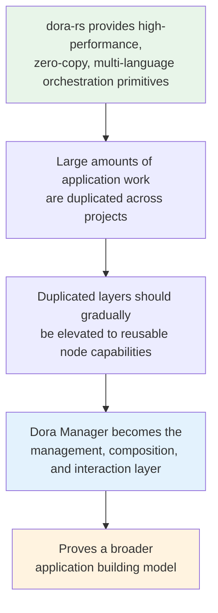
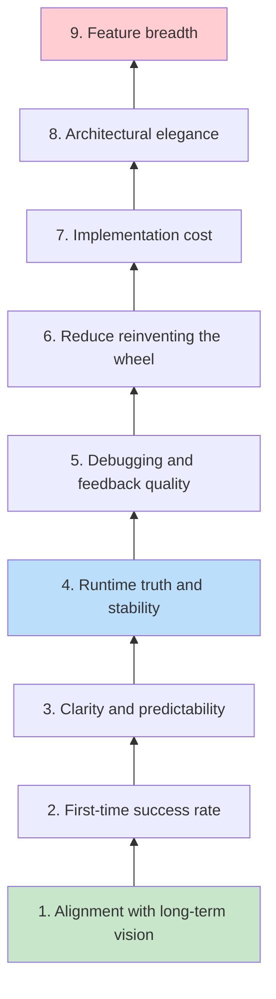
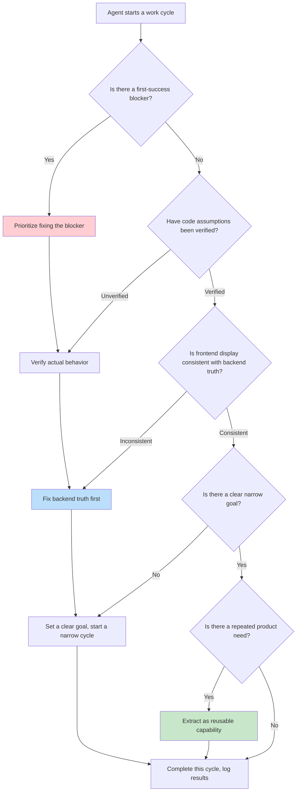

Dora Manager's constitution document (`PROJECT_CONSTITUTION.md`) is the project's **highest-level decision-making framework** — it does not describe how the code works, but rather defines the direction the code **should** work toward. This document serves as a steering wheel between rapid product growth and technical debt accumulation: when two technical paths conflict, the constitution provides the basis for adjudication; when an Agent completes a round of development autonomously, constitutional clauses are used to verify whether the output counts as "real progress." This article will systematically deconstruct every layer of logic in the constitution, and combined with the architecture principles document and actual Steering Cycles records, demonstrate how these principles are repeatedly applied in real development.

Sources: [PROJECT_CONSTITUTION.md](https://github.com/l1veIn/dora-manager/blob/main/PROJECT_CONSTITUTION.md), [architecture-principles.md](https://github.com/l1veIn/dora-manager/blob/main/docs/architecture-principles.md#L1-L132)

---

## Product Vision: From Lego Bricks to Reusable Application Building Model

The constitution opens with a highly recognizable metaphor — Dora Manager's goal is to make application development **feel more like assembling Lego bricks**, rather than building the same shell from scratch every time. This vision is not a vague slogan, but is decomposed into five specific "reusable layers":

| Reusable Layer | Meaning | Existing Node Examples |
|---------|------|-------------|
| **Display Layer** | Image rendering, video playback, log display | `dm-message`, `opencv-plot` |
| **Configuration Layer** | Parameter forms, environment variable management | `dm.json` → `config_schema` |
| **Interaction Layer** | User input controls, panel communication | `dm-button`, `dm-slider`, `dm-text-input` |
| **Output Layer** | File saving, data recording | `dm-save`, `dm-recorder` |
| **Feedback Layer** | Status signals, error propagation, readiness checks | `dm-check-ffmpeg`, `dm-and`, `dm-gate` |

This classification is not static. As the project evolves, each layer continues to accumulate reusable nodes. When a capability **repeatedly appears across different projects**, the correct approach is to elevate it into a reusable node, shared contract, or runtime feature, rather than reimplementing it in every project. This "**reuse over repetition**" philosophy permeates every layer of technical decision-making, from node design to transpiler architecture.

Sources: [PROJECT_CONSTITUTION.md](https://github.com/l1veIn/dora-manager/blob/main/PROJECT_CONSTITUTION.md)

---

## Product Mission and Current Bets

Dora Manager's mission is to transform dora-rs from a powerful **underlying orchestration engine** into a **usable application building and management layer**. It aims to help developers accomplish five things: discover and manage nodes, naturally define and run data flows, clearly observe runtime state, directly interact with running systems, and reuse common application capabilities.

The current phase's product bets are built on a clear causal chain:

These four bets are tightly interlocked: if dora-rs's timing advantage does not hold, the entire superstructure lacks a foundation; if cross-project duplication is not significant enough, the value of "reusable nodes" is not large enough; if Dora Manager cannot make this reuse practical, the vision remains just an idea.

Sources: [PROJECT_CONSTITUTION.md](https://github.com/l1veIn/dora-manager/blob/main/PROJECT_CONSTITUTION.md)

---

## Current Phase and Target Users

The constitution explicitly states: **the goal of the current phase is to prove the path, not to maximize breadth**. This judgment directly influences feature priority ordering:

| Priority | Meaning | Practical Manifestation |
|-------|------|---------|
| First-launch comprehensibility | Users won't get lost the first time they open it | Dashboard Quick Start + `Hello Timer` one-click experience |
| First success achieved quickly | Complete the first run within a few clicks | `dm start demos/demo-hello-timer.yml` zero-dependency run |
| Coherent edit-run-check loop | The core workflow feels like a unified whole | Workspace editing → Run → live logs → modify → rerun |
| Trustworthy runtime state | Status, failure, stop, recovery must all be real | Steering Cycles repeatedly fixing "frontend display vs backend truth inconsistency" |
| Reusable node patterns beginning to solidify | Display/config/interaction/feedback capabilities becoming node patterns | Widget system, dm.json contracts, Port Schema validation |

Target users have also been explicitly prioritized and excluded:

- **Current priority users**: Independent developers, dora-rs early technology adopters, advanced builders validating node/flow/interaction loops, engineers exploring reusable application building models
- **Explicitly not in current scope**: Large team governance, enterprise permission systems, distributed cluster scheduling, abstract-for-abstract's-sake generic platformization

This choice is not permanent — it is a resource-focusing decision made during the "prove the path" phase. Once the core loop is firmly established, the target user scope will naturally expand.

Sources: [PROJECT_CONSTITUTION.md](https://github.com/l1veIn/dora-manager/blob/main/PROJECT_CONSTITUTION.md)

---

## Decision Priority: Nine-Layer Adjudication Chain

When technical trade-offs conflict, the constitution provides a **nine-layer adjudication chain**, from highest to lowest priority:

This adjudication chain is repeatedly referenced in the project's actual operations. Below are several typical cases:

**Case 1: Frontend display vs backend truth (Item #4 > Item #8)**

In UX Test Round 3, the run summary card displayed the backend's `node_count_observed` (historically observed node count) as `Active Nodes`, causing "active" to still be displayed after the run had stopped. The fix was not to adjust frontend wording to mask the problem, but to change the label to the semantically correct `Observed Nodes`, ensuring frontend display is consistent with backend truth. [ux-test-rounds.md](https://github.com/l1veIn/dora-manager/blob/main/docs/records/ux-test-rounds.md#L103-L121)

**Case 2: First-time success rate > Feature breadth (Item #2 > Item #9)**

Steering Cycle 1 explicitly decided: do not expand editor or node capabilities, but first fortify a **deterministic first-time success path**. The Dashboard gained a dedicated `Hello Timer` entry point, allowing first-time users to complete their first run without relying on noisy history. [steering-cycles.md](https://github.com/l1veIn/dora-manager/blob/main/docs/records/steering-cycles.md#L1-L43)

**Case 3: Architectural elegance < Runtime truth (Item #8 < Item #4)**

Even though the SQLite polling approach originally adopted by dm-panel was architecturally simpler, when the latency in real-time control scenarios was unacceptable, the project chose the more complex WebSocket solution — because **runtime stability** and **debugging feedback quality** take priority over **architectural elegance**.

Sources: [PROJECT_CONSTITUTION.md](https://github.com/l1veIn/dora-manager/blob/main/PROJECT_CONSTITUTION.md)

---

## Seven Product Principles

Section 7 of the constitution defines seven product principles, each with clear scope boundaries and discrimination criteria.

### Principle 1: Reuse over repetition

> If a capability repeatedly appears across different products, prioritize turning it into a reusable node, contract, or runtime feature.

This is precisely the logic behind the birth of the `dm.json` contract — it was not pre-designed, but **naturally emerged** from the repeated process of writing installation scripts, configuration forms, and type validation. The transpiler relies on it for path resolution and configuration merging, the frontend relies on it for rendering controls, and the installer relies on it for creating sandbox environments.

Sources: [PROJECT_CONSTITUTION.md](https://github.com/l1veIn/dora-manager/blob/main/PROJECT_CONSTITUTION.md), [building-dora-manager-with-ai.md](https://github.com/l1veIn/dora-manager/blob/main/docs/blog/building-dora-manager-with-ai.md#L40-L70)

### Principle 2: First impressions matter

> The first-launch path, first page, first click, first run, first failure — these are all core product interfaces.

This principle directly gave rise to the Dashboard's `Quick Start` area, the `Hello Timer` built-in demo, and the zero-dependency first experience path of `dm start demos/demo-hello-timer.yml`. The conclusion of Steering Cycle 3 also confirms this: **the product has proven two optimistic paths (first success + first modification); the next weakness is no longer discovery, but recovery.**

Sources: [PROJECT_CONSTITUTION.md](https://github.com/l1veIn/dora-manager/blob/main/PROJECT_CONSTITUTION.md)

### Principle 3: Don't make users guess

> At critical moments, the product should help users understand: what is happening, what just happened, what failed, and what to do next.

This principle has been repeatedly validated in the design of the Recovery Path. Steering Cycle 5 decided to make broken Workspaces **self-explanatory in place** — when a workspace is invalid or missing nodes, the page directly explains what is wrong and what the user should do next, rather than forcing users to diagnose through trial-and-error or terminal logs.

Sources: [PROJECT_CONSTITUTION.md](https://github.com/l1veIn/dora-manager/blob/main/PROJECT_CONSTITUTION.md), [steering-cycles.md](https://github.com/l1veIn/dora-manager/blob/main/docs/records/steering-cycles.md#L158-L191)

### Principle 4: Fix the truth before polishing

> If frontend messages are inconsistent with backend reality, fix the system semantics first.

This is one of the most frequently cited principles. Steering Cycles 7-8 spent two full cycles addressing the quality of run failure messages — not to "make the interface look better," but because the backend's `outcome_summary` carried raw stack frames and trigger IDs, displaying them directly to users would undermine trust. The fix preserved root causes, removed noise, and made technical details available on demand.

Sources: [PROJECT_CONSTITUTION.md](https://github.com/l1veIn/dora-manager/blob/main/PROJECT_CONSTITUTION.md), [steering-cycles.md](https://github.com/l1veIn/dora-manager/blob/main/docs/records/steering-cycles.md#L227-L298)

### Principle 5: Demos must build confidence

> Demo flows, onboarding paths, shortcuts, and example nodes must help build trust, not create noise, broken links, or fragile illusions.

All demos in the `demos/` directory follow the principle of zero external dependencies: `demo-hello-timer` validates the engine + UI, `demo-interactive-widgets` showcases the control system, `demo-logic-gate` demonstrates conditional flow control. Every demo is a **trustworthy first-experience entry point**.

Sources: [PROJECT_CONSTITUTION.md](https://github.com/l1veIn/dora-manager/blob/main/PROJECT_CONSTITUTION.md)

### Principle 6: Main path before edge cases

> Before expanding breadth, continuously improve the core loop: `startup → run → understand → modify → rerun`.

This principle formed a clear work rhythm across Steering Cycles: Cycle 1 fortifies first run → Cycle 2 enters the edit-rerun loop → Cycle 3 cleans up homepage noise → Cycles 4-8 sequentially cover the failure recovery path → Cycles 9-10 eliminate cross-page information inconsistency. Each step takes the main path one step further, rather than expanding features laterally.

Sources: [PROJECT_CONSTITUTION.md](https://github.com/l1veIn/dora-manager/blob/main/PROJECT_CONSTITUTION.md)

### Principle 7: Core layer remains node-agnostic

> `dm-core` should not become a collection of special cases for individual nodes. Generic behavior should belong to shared contracts and shared runtime logic.

The architecture principles document places more specific constraints on this: `dm-core`'s responsibilities are limited to managing data flow lifecycle, transpiling YAML, and routing data. It **must not** hardcode any node IDs, must not set enum variants for specific nodes, must not store node-specific metadata in the run model, and must not contain node-specific business logic. If a node requires special framework support, that support should belong to the application layer (`dm-server`, `dm-cli`), not the core layer.

Sources: [PROJECT_CONSTITUTION.md](https://github.com/l1veIn/dora-manager/blob/main/PROJECT_CONSTITUTION.md), [architecture-principles.md](https://github.com/l1veIn/dora-manager/blob/main/docs/architecture-principles.md#L48-L65)

---

## Architecture Principles: Node Purity and Layering Constraints

The architecture principles document (`docs/architecture-principles.md`) distills seven architectural constraints from a deep analysis of the dm-panel subsystem. These constraints are the concrete implementation of constitutional principles at the code level.

### Node Business Purity

A node should do only **one thing**. A node is either a compute unit, a storage unit, or an interaction unit — it should never mix these concerns. If a node starts doing two things, it should be split into two nodes.

This purity constraint is directly reflected in the node family classification:

| Family | Responsibility | Constraint | Representative Nodes |
|------|------|------|---------|
| **Compute** | Data transformation | No side effects beyond Arrow output | `dora-qwen`, `dora-distil-whisper`, `dora-yolo` |
| **Storage** | Data persistence | Writes to filesystem but does not render | `dm-save` (future) |
| **Interaction** | Human-machine interface | Bridges humans and data flows (display + control) | `dm-message`, `dm-button`, `dm-slider` |
| **Source** | Data generation / event emission | Produces data but does not consume node output | `dm-timer`, `opencv-video-capture` |

### Orthogonality of Display and Persistence

The display path should leverage already-persisted artifacts, rather than reinventing them:

- **Persistence path**: `Compute node → dm-store → filesystem → Interaction node (reads & renders)`
- **Real-time display path**: `Compute node → Interaction node (renders Arrow data)`

Interaction nodes **do not store data** — storage is the responsibility of storage nodes. This separation of concerns ensures that each type of node does only one thing.

### Platform Independence of Interaction Nodes

The logic of interaction nodes (what to display, what input to accept) is platform-independent. The same node should work across Web (SvelteKit), CLI (stdin/stdout), Mobile (native/PWA), and Desktop (Tauri/Electron) — rendering is handled by platform adapters, and the data flow YAML remains unchanged.

### Architecture Decision Checklist

Every new feature or architectural proposal should pass through these four questions:

1. **Does this feature make a node do more than one thing?** → Split it
2. **Does this change require dm-core to know about a specific node?** → Push it to the application layer
3. **Does this add UI logic to a compute node?** → Create a dedicated interaction node
4. **Does this mix storage with display?** → Separate them

Sources: [architecture-principles.md](https://github.com/l1veIn/dora-manager/blob/main/docs/architecture-principles.md#L1-L132)

---

## What Does Not Count as Real Progress

Section 8 of the constitution defines a **reverse indicator list** — the following behaviors do not count as real progress unless they simultaneously improve the core product loop or the reusable node vision:

| Pseudo-Progress Type | Why It Doesn't Count | Correct Approach |
|-----------|----------|-----------|
| Adding features with no adoption signals | Features themselves are not value | Validate demand before investing |
| Making UI prettier but not clearer | Aesthetics ≠ comprehensibility | Help users understand what is happening first |
| Making code cleaner without changing product capability | Refactoring serves the product, not itself | Refactoring should accompany perceptible improvements |
| Adding abstraction layers with no user benefit | Indirection increases complexity | Abstraction should reduce users' cognitive burden |
| Optimizing low-frequency edge cases before main path works | Resource misallocation | Make the main path reliable before optimizing edges |

This checklist is frequently referenced in actual steering cycles — almost every Cycle's "Dissent / warning" section prevents the team from sliding into these pseudo-progress traps. For example, Cycle 2's warning: "Do not widen into editor feature work or broader UI polish without proving one real edit loop first."

Sources: [PROJECT_CONSTITUTION.md](https://github.com/l1veIn/dora-manager/blob/main/PROJECT_CONSTITUTION.md)

---

## Agent Operating Rules

The Dora Manager project has a significant AI-assisted development component (the author describes it as having "high VibeCoding content"), so the constitution specifically sets seven default behavioral guidelines for Agents:

These seven rules can be understood through a concise decision flow: **prioritize blockers → verify actual behavior → fix backend truth → narrow cycle with clear goal → log results → extract reusable capability**. Each one corresponds to the operationalization of a higher-level constitutional principle — for example, "prioritize first-success blockers" directly aligns with decision priority item #2 (first-time success rate), and "fix backend truth before frontend polish" directly aligns with principle 7.4 (fix the truth before polishing).

Sources: [PROJECT_CONSTITUTION.md](https://github.com/l1veIn/dora-manager/blob/main/PROJECT_CONSTITUTION.md)

---

## Constitutional Amendment and North Star Adjustment Rules

The constitution is **durable but not frozen**. The amendment mechanism is designed with two layers of protection:

### Constitutional Amendment (Section 10)

Amendment requires meeting at least one of the following trigger signals:
- Repeated internal use indicates current priorities are wrong
- Actual target users differ from assumed target users
- A stronger product direction emerges from real usage rather than theoretical reasoning alone
- Current wording has led to misdirected decisions across multiple cycles

Amendment must follow a four-step process: **identify the trigger signal → declare which clause no longer applies → draft replacement text → explain which decisions will change as a result**.

### North Star Adjustment (Section 11)

The North Star (the core expression of the product vision) can be refined but **must not be arbitrarily rewritten**. Adjustment is only allowed under the following conditions:
- Substantive changes in market or technology timing
- Repeated real user evidence contradicting the existing North Star
- The project has discovered a more authentic expression of the same underlying mission

Explicitly prohibited: adjusting the North Star for local convenience, short-term frustration, or a single implementation preference.

Sources: [PROJECT_CONSTITUTION.md](https://github.com/l1veIn/dora-manager/blob/main/PROJECT_CONSTITUTION.md)

---

## Final Validation Criterion

The last section of the constitution provides a **succinct success determination proposition**:

> Dora Manager is succeeding if and only if it increasingly proves: **developers should not rebuild the same display, configuration, interaction, output, and feedback layers every time. More of this work should become reusable, composable, runtime-driven building blocks — built on top of dora-rs.**

This validation criterion is the ultimate check for all decisions — whether it's technology selection, feature prioritization, or architectural refactoring, everything ultimately comes down to one question: **does this make more repetitive work into reusable building blocks?**

Sources: [PROJECT_CONSTITUTION.md](https://github.com/l1veIn/dora-manager/blob/main/PROJECT_CONSTITUTION.md)

---

## Steering Cycles: The Constitution in Practice

The value of the constitution lies not in how perfectly it is written, but in whether it **actually guides daily decisions**. The project's steering cycle records provide the most direct evidence. The table below shows how the first 11 cycles each referenced constitutional principles to make decisions:

| Cycle | Current Judgment | Decision | Corresponding Constitutional Principle |
|------|---------|------|---------------|
| **1** | First web path is the highest risk area | Fortify a deterministic first-time success path | First-time success rate (#2), First impressions (7.2) |
| **2** | First-success path verified, edit-rerun is next | Enter the `edit → rerun → confirm change` loop | Main path first (7.6), Clarity (#3) |
| **3** | Homepage noise distracts from the verified path | Clean up Dashboard history noise | Don't make users guess (7.3), Demos build confidence (7.5) |
| **4** | Next unknown is recovery, not discovery | Validate the `failure → diagnose → fix → rerun` path | Runtime truth (#4), Debugging feedback (#5) |
| **5** | Broken workspaces need to self-explain in place | Display diagnostic info directly on the workspace page | Don't make users guess (7.3) |
| **6** | Cover both `invalid_yaml` and runtime failures | Extend recovery coverage to syntax-level and runtime-level | Runtime stability (#4) |
| **7-8** | Failure messages too raw | Refine run failure message quality | Fix truth before polishing (7.4) |
| **9** | History page and workspace page messages inconsistent | Unify failure summary display across pages | Clarity (#3), Truth (#4) |
| **10** | Lack of direction guidance after leaving Demo | Redesign Dataflows page as "workspace map" | First-time success rate (#2) |
| **11** | Node catalog page misrepresents its positioning | Fix node catalog display and navigation | Don't make users guess (7.3), Clarity (#3) |

This table reveals a core pattern: steering cycles do not randomly jump between different features, but progressively deepen along the **main path** (`startup → run → understand → modify → rerun → recover → explore`). Each cycle explicitly rejects the temptation of "lateral feature expansion" and chooses to "take one more step along the main path" — this is the direct embodiment of constitutional principle 7.6 (main path before edge cases).

Sources: [steering-cycles.md](https://github.com/l1veIn/dora-manager/blob/main/docs/records/steering-cycles.md#L1-L399)

---

## Further Reading

- [Overall Layered Architecture: dm-core / dm-cli / dm-server Responsibility Division](10-zheng-ti-fen-ceng-jia-gou-dm-core-dm-cli-dm-server-zhi-ze-hua-fen) — Understanding how constitutional principle 7.7 (core layer node-agnostic) lands in code layering
- [Interaction System Architecture: dm-input / dm-message / Bridge Node Injection Principles](22-jiao-hu-xi-tong-jia-gou-dm-input-dm-message-bridge-jie-dian-zhu-ru-yuan-li) — Understanding the practical implementation of "platform-independent interaction nodes" in architecture principles
- [Testing Strategy: Unit Tests, Data Flow Integration Tests, and System Testing CheckList](26-ce-shi-ce-lue-dan-yuan-ce-shi-shu-ju-liu-ji-cheng-ce-shi-yu-xi-tong-ce-shi-checklist) — Understanding how the "runtime truth" principle is guaranteed at the testing level
- [Frontend-Backend Co-build and Release: rust-embed Static Embedding and CI/CD Pipeline](25-qian-hou-duan-lian-bian-yu-fa-bu-rust-embed-jing-tai-qian-ru-yu-ci-cd-liu-shui-xian) — Understanding how the CI pipeline enforces the "truth before polish" principle
